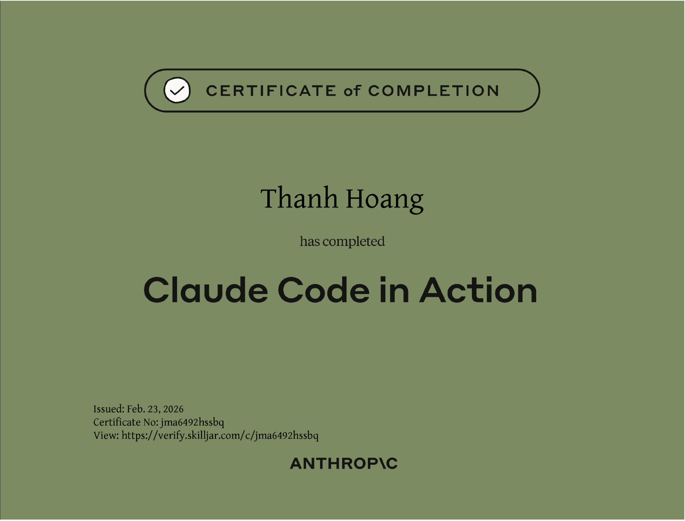

+++
title = "Học dùng AI – Claude Code"
date = "2026-02-23T23:05:00+07:00"
draft = false
tags = ["AI", "Claude-code"]
+++

Chào mọi người 👋  

Sau một thời gian dài sử dụng AI cho lập trình, mình bắt đầu nhận ra rằng: **biết dùng AI thôi là chưa đủ, mà cần phải dùng cho _đúng cách_ và _hiệu quả_**. Thế là mình quyết định dành thêm thời gian để học cách làm việc với **AI agent** bài bản hơn.

Tuần vừa rồi, ngoài giờ làm ban ngày thì buổi tối mình cày thêm một khoá học về **Claude Code**. Học cũng hơi chậm 🐌 nhưng không sao — miễn là **không bỏ cuộc** 😆. Bài viết này chủ yếu là để **khoe nhẹ thành quả sau 1 tuần cố gắng**.

Mọi người có thể tham khảo khoá học tại đây:

👉 https://anthropic.skilljar.com/claude-code-in-action

Khoá này **hoàn toàn miễn phí**, được tạo bởi chính team đứng sau **Claude Code**, nên nội dung khá chất lượng và thực tế. Với những ai chưa biết thì **Claude Code hiện đang được đánh giá rất cao (10/10)** trong mảng **AI agent cho coding & phân tích**, cực kỳ phù hợp cho dev.

Sau khi học xong, mọi người còn có thể nhận được **certificate** nữa — cảm giác cũng vui vui, có thêm động lực học tiếp 🎉.

*Click để xem bản đầy đủ*

---
Năm mới, khởi đầu mới. Hy vọng trong thời gian tới mình sẽ có thêm nhiều thứ hay ho để **khoe tiếp với anh em** 😄  
Hẹn gặp lại trong một bài viết khoe khác trong tương lai!
