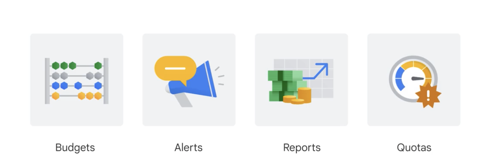
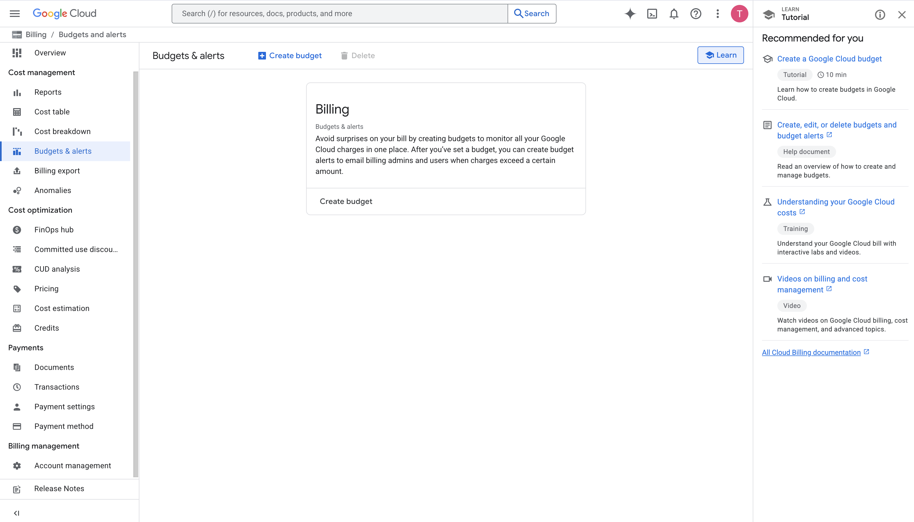
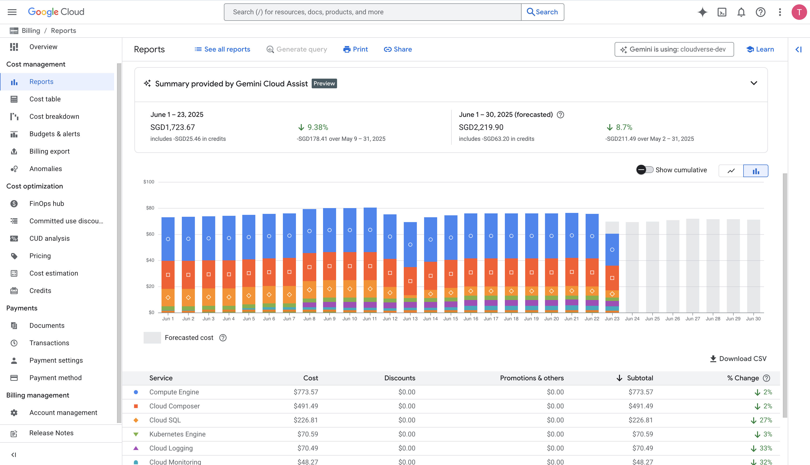
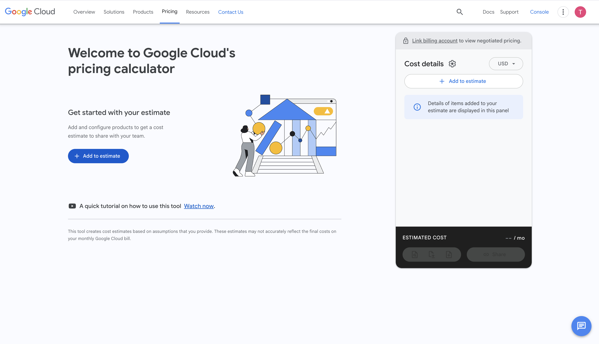

+++
title = "Google Cloud Billing"
date = "2025-06-24T13:00:00+07:00"
draft = false
tags = ["cloud", "GCP"]
+++

In Google Cloud, **Billing** is the system that helps you manage **costs, payments, and budgets** when using services on Google Cloud Platform (GCP), such as Compute Engine, BigQuery, Cloud Storage, and more. Below are the four most important components in Google Cloud Billing:

## 1. Budget
- Allows you to set a **spending limit** for a specific time period (e.g., month, quarter) for a project or billing account.
- **Purpose:** Avoid spending beyond your planned budget.
- **Example:** You're building a backend for a crawling system running on GCP, using multiple VMs or Cloud Functions. To control cost, you set a **$500/month** budget to track your expenses.

## 2. Alert
- Alerts are **automatically triggered** when spending exceeds a defined percentage of the budget (e.g., 50%, 90%, 100%).
- **Purpose:** Notify you when costs spike unexpectedly — possibly due to a bug or misconfiguration.
- **Example:** If the cost of your backend on Cloud Run reaches **90% of the $500 budget**, you’ll receive an email notification to take action.

## 3. Report
- A **visual tool** to analyze GCP spending over time, across services (e.g., Compute, BigQuery), projects, or by using labels.
- **Purpose:** Understand where your costs come from → optimize resource usage.
- **Example:** A report shows **BigQuery** is consuming **60%** of your backend budget. You decide to add Redis caching to reduce query load → lower costs.

## 4. Quotes (Cost Estimation)
- Use the **Google Cloud Pricing Calculator** to **estimate costs** before deploying your system.
- **Purpose:** Plan finances in advance and report estimated spending to your manager or PM — avoid surprises when receiving the actual bill.
- **Example:** Before launching a backend with Cloud Run + Firestore, you use the calculator to estimate a cost of **$200/month**, based on expected request volume and traffic.

