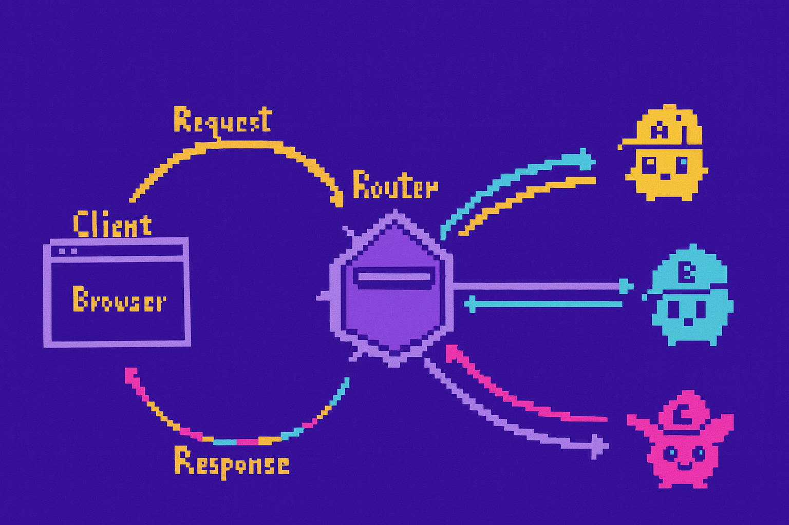
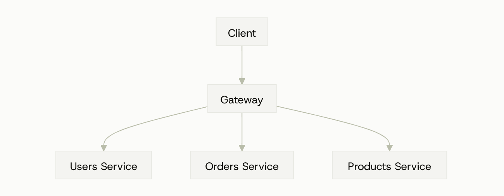

+++
title = "Triển khai microservice với GraphQL Federation"
date = "2025-09-22T21:10:00+07:00"
draft = false
tags = ["graphql federation", "microservice"]
+++

Trong quá trình làm việc, team mình từng triển khai một hệ thống microservice với hơn **20 service** hoạt động độc lập. Để kết nối các service này vào một API thống nhất cho client sử dụng, bọn mình đã áp dụng **GraphQL Federation**.

Bài viết này sẽ chia sẻ lại cách tiếp cận đó — cách mà Federation giúp gom nhiều service lại thành một **GraphQL API** duy nhất, đơn giản cho phía client nhưng vẫn linh hoạt cho backend.

Cùng mình bắt đầu nhé!

---

## 1. GraphQL là gì?

**GraphQL** là một ngôn ngữ truy vấn API (và runtime thực thi truy vấn đó) do Facebook phát triển — cho phép client yêu cầu **chính xác** những trường dữ liệu cần lấy, thay vì nhận fixed response như REST.

GraphQL bao gồm 4 yếu tố chính:

- **Schema**: định nghĩa kiểu dữ liệu (types) và các trường (fields) mà server cung cấp
- **Query**: client gửi để lấy dữ liệu (tương tự GET)
- **Mutation**: thay đổi dữ liệu (tương tự POST/PUT/DELETE)
- **Subscription**: push dữ liệu thời gian thực (WebSocket)

**So sánh nhanh với REST:**

- REST: nhiều endpoint, server quyết định payload
- GraphQL: một endpoint, client quyết định trường trả về → tránh under/over-fetching

> Phù hợp khi frontend cần linh hoạt lấy dữ liệu (mobile/web apps phức tạp). Nếu API đơn giản hoặc muốn caching HTTP truyền thống thì REST vẫn ổn.

---

## 2. GraphQL Federation là gì?

**GraphQL Federation** là mô hình chia nhỏ một GraphQL schema lớn thành nhiều **subgraph** (service nhỏ), sau đó **ghép lại** (compose) thành một API duy nhất thông qua một **gateway**.

Mục tiêu: mỗi team sở hữu schema + resolver riêng, vẫn cùng đóng góp vào API GraphQL tập trung cho client.

Ví dụ e-commerce: các team riêng quản lý sản phẩm, tài khoản người dùng, xử lý đơn hàng. Với GraphQL Federation, mỗi team có thể:

- Định nghĩa schema GraphQL của riêng họ.
- Triển khai và scale dịch vụ độc lập.
- Đóng góp vào một API GraphQL thống nhất mà không bị ràng buộc chặt chẽ.
- Giữ quyền sở hữu logic chuyên môn trong domain của mình.

Thông qua một **federated gateway** đóng vai trò điều phối trung tâm, ghép các schema riêng lẻ thành một schema thống nhất để client có thể truy vấn.

## 3. Các thành phần cốt lõi

- **Subgraph (service):** cung cấp một phần schema (types, queries, mutations) và resolvers của nó. Thông thường sẽ có nhiều subgraph
- **Gateway (federation gateway):** nhận Schema từ các subgraphs, compose thành supergraph schema và route request tới subgraphs.

**Schema composition** gồm:

- **Entities & keys:** liên kết type giữa các subgraphs, dùng directive `@key(fields: "...")` — khoá nhận diện entity (ví dụ `User` có `id`).

- **Type extension:** service B có thể extend type User `@key(fields: "id")` { id: ID! reviews: [Review] } — gateway biết cách gắn dữ liệu từ nhiều service.

- **Reference resolver**: mỗi subgraph cung cấp resolver để khi gateway cần **lấy thêm thông tin chi tiết một entity** từ một reference, subgraph đó trả dữ liệu (resolver được gọi là `__resolveReference`).

- **Directives bổ sung:** `@requires`, `@provides` để điều khiển dữ liệu cần fetch giữa services.

## 4. Cách GraphQL Federation hoạt động

1. **Đăng ký SDL (Schema) của subgraphs**  
   Mỗi subgraph xuất ra schema kèm các directive của Federation như `@key`, `@provides`, `@requires`, `extend type`, v.v.

2. **Composition (tại gateway)**  
   Gateway lấy schema từ tất cả các subgraph, compose thành một supergraph (kết hợp types, kiểm tra conflict, build query planner).

3. **Client gửi query tới gateway**  
   Client chỉ cần gọi 1 endpoint (gateway). Gateway nhận query và thực hiện query planning: chia query thành các phần nhỏ (fetch plan), map tới các subgraph tương ứng.

4. **Gateway gọi subgraphs theo plan**  
   Gateway gửi request tới các subgraph theo kế hoạch đã lên. Có thể gọi song song hoặc tuần tự, tuỳ thuộc vào dependency (ví dụ: cần lấy `User.id` trước rồi mới lấy `reviews`).

5. **Reference resolution**  
   Khi một subgraph trả về một reference (ví dụ { **typename: "User", id: "1"**}), subgraph khác có thể thực hiện **resolveReference** để trả thêm fields cho entity đó. Gateway dùng các resolver này để "ghép" dữ liệu.

6. **Aggregate & trả về client**  
   Gateway hợp nhất các responses thành 1 JSON duy nhất theo query shape rồi trả về client.

## 5. Lợi ích của GraphQL Federation

- ✅ **Phát triển theo domain**  
  Mỗi team có thể phát triển service của riêng mình một cách độc lập, nhưng vẫn dễ dàng tích hợp vào một API GraphQL chung. Nhờ đó, quá trình phát triển trở nên linh hoạt hơn và giảm bớt sự phụ thuộc giữa các team.

- 🔒 **Bảo vệ tính toàn vẹn của service**  
  Bước composition (ghép schema) kiểm tra sự tích hợp giữa các service, đảm bảo thay đổi trong một subgraph không xung đột với subgraph khác.

- 🚀 **Khả năng mở rộng và hiệu năng**  
  Mỗi subgraph/service có thể scale riêng theo yêu cầu của nó. Ví dụ: service `product` có thể scale 2 instances, trong khi service `order` lại chỉ chạy 1 instance.

- 🌐 **API duy nhất, thống nhất**  
  Client chỉ cần gọi một endpoint duy nhất, dù dữ liệu nằm rải rác ở nhiều service khác nhau. Gateway sẽ tự xử lý phần phức tạp phía sau, định tuyến truy vấn đến đúng service và trả về dữ liệu chính xác.

---

## 6. Triển khai thử

Trong phần này mình triển khai một hệ thống microservice nhỏ theo GraphQL Federation gồm:

- **Post service**  
  GitHub: [graphql-deferation-post](https://github.com/thanhhv98/graphql-deferation-post) — chạy ở port `3003`

- **User service**  
  GitHub: [graphql-deferation-user](https://github.com/thanhhv98/graphql-deferation-user) — chạy ở port `3002`

- **Gateway**  
  GitHub: [graphql-deferation-gateway](https://github.com/thanhhv98/graphql-deferation-gateway) — chạy ở port `3000`

> Các service này được implement bằng **Node.js + NestJS**  
> Tài liệu chính thức: [NestJS Federation Docs](https://docs.nestjs.com/graphql/federation)

### Hướng dẫn chạy:

1. Clone 3 repository ở trên về máy.
2. Cài đặt dependencies (`npm install` hoặc `yarn`).
3. Khởi chạy từng service:

   - `PostService`: `http://localhost:3003`
   - `UserService`: `http://localhost:3002`
   - `Gateway`: `http://localhost:3000`

4. Mở [http://localhost:3000/graphql](http://localhost:3000/graphql) trên trình duyệt.  
   → Bạn sẽ thấy gateway đã compose 2 subgraph là **user** và **post**.  
   → Có thể truy vấn dữ liệu thông qua **một endpoint duy nhất** tại gateway.

---

GraphQL Federation là một giải pháp mạnh mẽ, nhưng không phải lúc nào cũng phù hợp. Hãy chỉ sử dụng khi hệ thống của bạn thực sự cần phân tách service và có nhiều team cùng phát triển. Nếu lạm dụng, nó có thể khiến mọi thứ trở nên phức tạp và tốn nhiều công sức không cần thiết.

Cảm ơn bạn đã theo dõi đến cuối bài. Chúc bạn triển khai thành công! Nếu có câu hỏi hay chia sẻ gì thêm, đừng ngần ngại để lại bình luận bên dưới nhé.