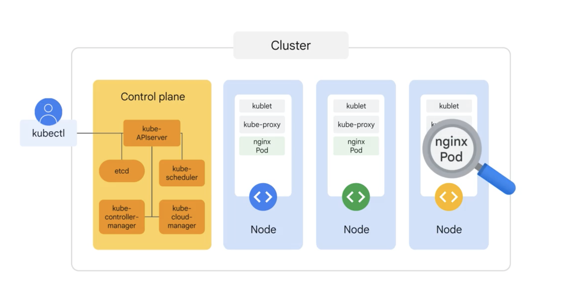

+++
title = "Kubernetes Components"
date = "2025-06-29T08:00:00+07:00"
draft = false
tags = ["cloud", "GCP", "k8s"]
+++

The architecture of Kubernetes is divided into two main parts:

## 1. Control Plane Components

The Control Plane is the **brain of Kubernetes** — responsible for managing the overall state of the cluster and orchestrating all activities.

### 1.1 kube-apiserver
- Acts as the central communication gateway of the system.
- All requests from `kubectl`, the Dashboard, CI/CD pipelines, etc., are sent through this component.
- Responsible for:
  - Authentication
  - Authorization
  - Reading/writing data from/to `etcd`
  - Forwarding requests to other components

> Example:  
> You run `kubectl get pods` → the request goes to the kube-apiserver.

---

### 1.2 etcd
- `etcd` is the key-value store used by Kubernetes to persist cluster state.
- It stores:
  - Pod names, namespaces
  - Replica counts
  - ConfigMaps, Secrets, etc.
- If `etcd` loses data → the entire cluster can malfunction.

> It's important to back it up regularly.

---

### 1.3 kube-scheduler
- When a new Pod is created (but not yet assigned to a node), the scheduler will:
  - Check the available resources across all nodes
  - Evaluate constraints (affinity, taints, zones, etc.)
  - Decide the best node to place the pod on

> Note: the scheduler **only makes the placement decision** — it doesn't create the pod itself.

---

### 1.4 kube-controller-manager
- Runs various built-in controllers to manage cluster state, such as:
  - **ReplicationController**: ensures the correct number of pod replicas
  - **NodeController**: monitors node status (up/down)
  - **JobController**: handles one-time jobs
  - **ServiceAccountController**, and more

> Example:  
> If you declare 3 pods and one crashes → the controller automatically recreates it.

- It acts as a **gatekeeper** that ensures the actual cluster state matches the YAML you applied.

---

### 1.5 cloud-controller-manager *(optional)*
- Separates cloud provider logic from the Kubernetes core.
- Common functions:
  - Creating external Load Balancers (e.g., GCP, AWS ELB)
  - Automatically attaching cloud volumes (e.g., EBS, PersistentDisk)
  - Updating node IPs in Services

> GKE, EKS, and AKS all utilize this component under the hood.

---

## 2. Node Components

Node components run on **every node** in the cluster (both master and worker nodes) to ensure:

- Pods are running correctly
- Containers are managed properly
- Networking functions as expected

---

### 2.1 kubelet
- The main agent running on each node.
- It receives instructions from the `kube-apiserver` and performs actions such as:
  - Creating pods
  - Monitoring container health and status
  - Reporting pod status back to the Control Plane
- Ensures that the actual state of the pod matches the desired state defined in YAML.

> If a pod crashes, the kubelet will attempt to restart it (if allowed by the restart policy).

---

### 2.2 kube-proxy
- Manages networking rules using iptables or IPVS.
- Handles internal load balancing and forwards traffic to the appropriate pods.
- Ensures that:
  - Pods can communicate with each other
  - Pods can access external networks if required

> Example:  
> When you access a ClusterIP service, `kube-proxy` routes the request to one of the underlying pods.

---

### 2.3 Container Runtime
- The runtime engine responsible for running containers.
- It performs tasks such as:
  - Pulling images (e.g., from Docker Hub, GCR)
  - Creating containers from those images
  - Managing container lifecycle (start, stop, restart)

Common container runtimes:

| Runtime        | Notes                                              |
|----------------|----------------------------------------------------|
| **containerd** | Default in Kubernetes 1.20+ (lightweight, fast)    |
| **Docker**     | Previously popular, now deprecated in recent K8s   |
| **CRI-O**      | Lightweight, designed specifically for Kubernetes  |
