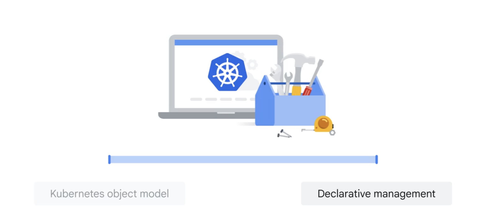

+++
title = "Kubernetes Concepts"
date = "2025-06-29T08:00:00+07:00"
draft = false
tags = ["cloud", "GCP", "k8s"]
+++

When learning Kubernetes, there are two core concepts you should understand: **Kubernetes Object Model** and **Declarative Management**. Let's break down both of these.



## 1. Kubernetes Object Model

Everything in Kubernetes is an **object**, and these objects are managed via YAML or JSON definitions. They represent the resources in your system.

### Cluster
A **cluster** is a group of machines (nodes) consisting of:
- **Control Plane (master)** - responsible for managing the system.
- **Worker Nodes** - where your applications run.

### Node
A **node** is a physical or virtual machine within a cluster.  
Each node includes:
- `kubelet`: manages pods on the node.
- `container runtime`: runs containers (e.g., Docker, containerd).
- `kube-proxy`: handles networking rules and traffic.

### Pod
A **pod** is the smallest deployable unit in Kubernetes.  
It contains one or more containers (usually one). All containers in a pod:
- Share the same IP address and volume.
- Are created and terminated together.

### Container
A **container** is your running application (e.g., Node.js, Golang, Redis).  
It is created from a container image and runs **inside a pod**.

### Deployment
A **deployment** defines the desired state of your pods:
- How many replicas?
- What image should be used?
- Should it auto-restart on failure?

You simply define the desired state (e.g., "I want 3 pods running image `my-app:v1`") and Kubernetes takes care of the rest.

### Service
A **service** exposes a set of pods via a stable endpoint.  
Since pods can change IP addresses, services help by:
- Providing load balancing.
- Enabling service discovery.

Examples: `ClusterIP`, `NodePort`, `LoadBalancer`.

### ConfigMap & Secret
Used to inject configuration into containers:
- `ConfigMap`: stores non-sensitive data (e.g., ENV variables, app name).
- `Secret`: stores sensitive data (e.g., passwords, API keys).

### Volume / PersistentVolume
Used to store data **outside the container**, so it won't be lost when the container restarts.  
Volumes can be mounted into pods.

### Ingress
Allows **external traffic** to access services inside the cluster.  
You can define routes like `/api` or domains like `app.domain.com`.  
Ingress is supported out of the box in GKE.

### Namespace
Namespaces divide a cluster into multiple logical environments:
- `dev`, `staging`, `production`...

They help separate and organize resources effectively.

---

## 2. Declarative Management

In Kubernetes, you don't run step-by-step commands (imperative).  
Instead, you declare your desired state using YAML.

For example:
> "I want 3 pods running image `my-app:v1.0.0`."

Kubernetes will:
- Compare the current state with the desired state.
- Automatically make adjustments: create pods, restart if they fail, scale up/down as needed.

You simply **apply the file**, and Kubernetes takes care of everything else.

```bash
kubectl apply -f deployment.yaml
