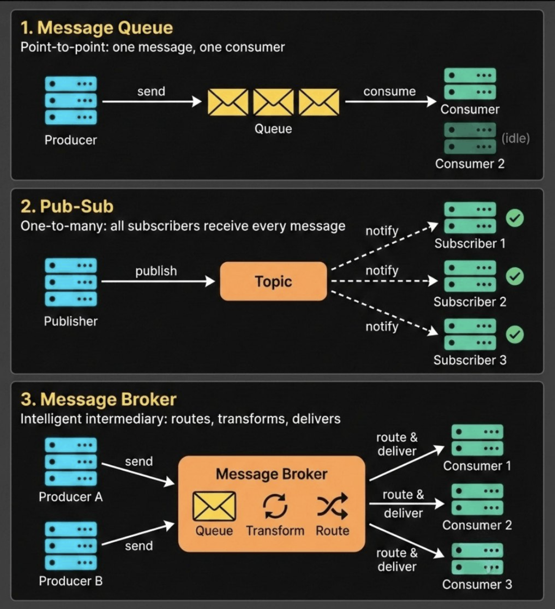

+++
date = '2026-02-22T21:38:51+07:00'
draft = false
title = 'Phân biệt Message Queue - Pub/Sub - Message Broker'
tags = ["backend"]
+++

Chào mọi người đầu xuân năm mới 2026 👋  
Cùng mình ôn tập lại một vài khái niệm trong lập trình mà anh em backend rất hay gặp phải nhưng đôi khi dễ bị nhầm lẫn nhé. Nào, let's go 🚀

Hôm nay chúng ta sẽ cùng phân biệt:

- **Message Queue**
- **Pub-Sub**
- **Message Broker**

Ba khái niệm này thường bị đánh tráo hoặc hiểu sai, nhưng thực tế chúng được thiết kế để giải quyết **những bài toán kiến trúc khác nhau**.



---

## 1. Message Queue (Hàng đợi tin nhắn)

**Message Queue** hoạt động theo mô hình **Point-to-Point**:  
Một **Producer** gửi message vào queue, và **chỉ duy nhất một Consumer** nhận và xử lý message đó. Sau khi xử lý xong (acknowledge), message sẽ bị xóa khỏi queue.

### Mục đích chính
- Xử lý bất đồng bộ (async)
- Giảm tải cho service chính
- Tăng throughput
- Retry, delay, rate limit
- Xử lý tác vụ nền (background jobs)

### Ví dụ
- AWS SQS  
- RabbitMQ (queue mode)  
- Celery  

### Use case: Gửi email sau khi user đăng ký
```
User Register → API → Push job gửi mail → Queue → Worker gửi email
```

Nếu gửi email trực tiếp:
- API chậm
- Dễ timeout

Dùng queue:
- API trả response ngay
- Worker xử lý nền

👉 **Queue rất phù hợp cho các tác vụ tốn thời gian nhưng không cần xử lý realtime.**

---

## 2. Pub-Sub (Publish / Subscribe)

**Pub-Sub** hoạt động theo mô hình **One-to-Many**:  
Một **Publisher** publish message lên **Topic**, và **tất cả Subscriber** đang subscribe topic đó đều nhận được **một bản sao message**.

Không có khái niệm "độc quyền" message - ai subscribe thì đều nhận.

### Mục đích chính
- Event-driven architecture
- Loose coupling
- Giao tiếp giữa các microservices

### Tối ưu cho
- Thông báo sự kiện
- Fan-out updates
- Luồng dữ liệu realtime

### Ví dụ
- AWS SNS  
- Kafka topics  
- Redis Pub/Sub  
- Google Pub/Sub  

### Use case: User tạo đơn hàng
```
Order Service → publish ORDER_CREATED
```

Các service khác subscribe:

- Email Service → gửi mail
- Notification Service → push notification
- Analytics Service → ghi log
- Loyalty Service → cộng điểm

👉 **1 event → nhiều service cùng xử lý**

---

## 3. Message Broker (Hệ thống trung gian)

**Message Broker** là **hệ thống trung gian quản lý và phân phối message** giữa Producer và Consumer.

Nó cung cấp:
- Lưu trữ message
- Routing
- Retry
- Load balancing
- Fan-out
- Persistence
- Monitoring

> Có thể hiểu:  
> **Message Broker là nền tảng hạ tầng, còn Queue và Pub-Sub là các mô hình giao tiếp được triển khai trên nền tảng đó.**

### Ví dụ
- RabbitMQ  
- Kafka  
- Redis  
- ActiveMQ  

### Vai trò chính
- Điều hướng message phức tạp
- Kết nối nhiều hệ thống
- Hỗ trợ nhiều mô hình giao tiếp cùng lúc (queue + pubsub)

---

## 4. So sánh nhanh

| Tiêu chí        | Message Queue        | Pub-Sub                       |
|-----------------|----------------------|--------------------------------|
| Mô hình         | Task distribution    | Event broadcast                |
| Số consumer     | 1                    | N                              |
| Dùng khi        | Xử lý job nền        | Event-driven                   |
| Ví dụ           | gửi mail, xử lý ảnh | order created, user registered |

---

## 5. Tóm tắt dễ nhớ

- **Message Queue** → giao việc cho worker  
- **Pub-Sub** → bắn event cho toàn hệ thống  
- **Message Broker** → thằng đứng giữa lo vận chuyển & phân phối message  

---

Nếu bạn đang thiết kế hệ thống backend hoặc microservices, hiểu rõ ba khái niệm này sẽ giúp bạn:

- Thiết kế kiến trúc sạch hơn
- Tối ưu performance
- Scale hệ thống dễ dàng
- Tránh coupling không cần thiết

Cảm ơn bạn đã đọc đến đây. Hẹn gặp lại trong bài viết tiếp theo nhé! 🙌