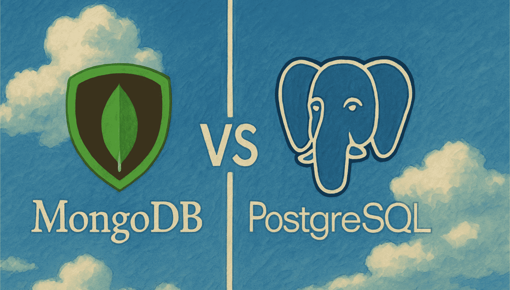

+++
date = '2025-04-23T20:44:51+07:00'
draft = false
title = 'SQL vs NoSQL'
tags = ["database"]
+++

Xin chào các bạn,

Trong bài viết này, tôi sẽ chia sẻ một số kinh nghiệm cá nhân khi phải lựa chọn giữa hai loại cơ sở dữ liệu phổ biến là **SQL** và **NoSQL**, cụ thể là **PostgreSQL** và **MongoDB**. Bài viết không đi sâu vào lý thuyết SQL hay NoSQL là gì, mà sẽ tập trung vào góc nhìn thực tế khi phải đưa ra lựa chọn trong một dự án cụ thể.

Tôi có thể khẳng định ngay từ đầu rằng **không có loại cơ sở dữ liệu nào là "tốt nhất"**, mà chỉ có loại **phù hợp nhất với bối cảnh và yêu cầu của dự án** tại thời điểm đó.

---

## 1. Tính linh hoạt và yêu cầu thay đổi

Nếu dự án có **deadline gấp**, trong khi **yêu cầu nghiệp vụ hoặc schema dữ liệu còn mơ hồ và dễ thay đổi liên tục**, tôi sẽ ưu tiên sử dụng **NoSQL**, cụ thể là MongoDB. 

Lý do là vì MongoDB **không yêu cầu schema cố định**, cho phép thay đổi cấu trúc dữ liệu linh hoạt mà **không cần thực hiện các bước migration phức tạp** như với cơ sở dữ liệu quan hệ. Điều này giúp tiết kiệm đáng kể thời gian và công sức trong giai đoạn phát triển ban đầu.

---

## 2. Tính ổn định, toàn vẹn dữ liệu và nghiệp vụ phức tạp

Ngược lại, nếu dự án đòi hỏi **tính toàn vẹn dữ liệu cao**, chẳng hạn như các hệ thống tài chính, ngân hàng hoặc thương mại điện tử, thì tôi sẽ ưu tiên sử dụng **SQL**, như PostgreSQL.

PostgreSQL hỗ trợ **ACID** tốt, xử lý tốt các **mối quan hệ phức tạp**, kể cả khi sử dụng dữ liệu JSON, mà vẫn đảm bảo hiệu năng. Cấu trúc dữ liệu rõ ràng, chặt chẽ giúp dễ dàng phát hiện và ngăn chặn lỗi logic từ sớm.

Ngược lại, MongoDB lại **quá linh hoạt**, điều này tiềm ẩn nhiều rủi ro nếu dev không kiểm soát tốt. Tôi từng gặp trường hợp trong một dự án mà nhiều team cùng sử dụng chung một MongoDB instance. Mỗi team lại định nghĩa collection `Users` theo cách riêng, với các field khác nhau — dẫn đến việc **khó bảo trì, khó hiểu dữ liệu**, và dễ phát sinh lỗi khó debug.

---

## 3. Nguồn lực và năng lực của team

Bên cạnh yêu cầu kỹ thuật, chúng ta cũng cần xem xét **năng lực của team backend và team DevOps** trong việc triển khai và vận hành hệ thống.

- Nếu team đã quen sử dụng PostgreSQL hoặc có kinh nghiệm xử lý dữ liệu phức tạp, thì PostgreSQL sẽ là lựa chọn hiệu quả hơn.
- Nếu team mạnh về Node.js, JavaScript, và đã quen dùng Mongoose, thì có thể cân nhắc sử dụng MongoDB nếu phù hợp với yêu cầu dự án.
- Trong trường hợp nguồn lực hạn chế, chưa thể đầu tư cho một loại database mới, thì có thể **tạm thời sử dụng giải pháp hiện tại**, nhưng cần có **kế hoạch cho việc chuyển đổi sau này**, ví dụ như áp dụng **Repository Pattern** để tách biệt phần logic truy cập cơ sở dữ liệu khỏi business logic.

---

## 4. Tổng kết

Tôi thường không chọn database theo cảm tính hay thói quen, mà sẽ đánh giá dựa trên các tiêu chí:
- Yêu cầu nghiệp vụ
- Tính chất dữ liệu
- Deadline triển khai
- Năng lực đội ngũ kỹ thuật

Tôi không tin vào “công nghệ tốt nhất”, mà tin vào “**công nghệ phù hợp nhất với bài toán cụ thể tại thời điểm cụ thể**”.

---