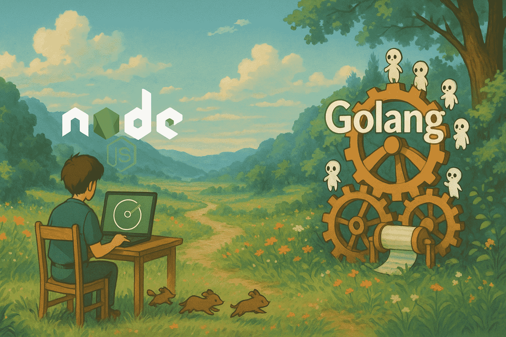

+++
date = '2025-05-17T19:00:00+07:00'
draft = false
title = 'So sánh Node.js và Golang trong Backend'
tags = ["backend", "nodejs", "golang"]
+++

Xin chào mọi người,

Trong quá trình làm việc ở vị trí Backend Engineer, mình đã trải qua nhiều ngôn ngữ lập trình, trong đó có **Node.js** và **Golang**. Vậy trường hợp nào nên dùng Node.js, trường hợp nào nên dùng Golang? Bài viết này chia sẻ kinh nghiệm thực chiến cá nhân và quan sát thực tế từ đồng nghiệp xung quanh. Let's start!



---

### 1. Hiệu năng và Đa luồng

**Golang** có hiệu năng tốt hơn nhờ là compiled language và mô hình **goroutine** rất nhẹ (lightweight thread do Go runtime quản lý), dễ dàng xử lý hàng nghìn concurrent connections mà tốn rất ít tài nguyên.

**Node.js** dùng event loop, rất hiệu quả cho ứng dụng **I/O-bound**, nhưng dễ bị nghẽn khi xử lý **CPU-bound** do chạy đơn luồng (có thể dùng worker threads nhưng không phải là mặc định).

Vậy nên, nếu hệ thống cần xử lý song song, real-time, high concurrency → **Golang** là lựa chọn tốt.

---
Mình sẽ chú thích thêm 1 xíu về I/O-bound và CPU-bound là gì cho mọi người dễ follow nhé:

**I/O-bound**: là tác vụ mà CPU phải chờ dữ liệu từ ngoài: đọc file, query DB, gởi request network...

```js
await fetch('https://api.example.com/data')
```

**CPU-bound**: là tác vụ sử dụng nhiều CPU, như tính toán, mã hoá, AI...

```js
for (let i = 0; i < 1e9; i++) {
  // Tính toán số nguyên tố
}
```

---

### 2. Tốc độ phát triển & Hệ sinh thái

- **Node.js**: ecosystem mạnh, npm phong phú, build nhanh, nhất là khi làm với frontend (JS/TS).
- **Golang**: code rõ ràng, nhưng viết nhiều hơn vì ít thư viện có sẵn.

Nên nếu cần tốc độ phát triển nhanh → Nodejs là lựa chọn tốt.

---

### 3. Maintainability & Readability

- **Golang**: strict typing, clear structure → dễ maintain trong team.
- **Node.js**: Typescript thì ổn, JavaScript thuần thì dễ sinh bug.

Nên dự án quy mô lớn → **Golang** tốt hơn về dài hạn.

---

### 4. Use Case thực tế

- Dự án DEX:
  - **Golang** cho core server xử lý thuật toán tìm đường đi tối ưu nhất giữa các pool để swap token (CPU-bound).
  - **Node.js** cho crawler/router (I/O-bound).

- Dự án web/blog:
  - **Node.js** phù hợp do chủ yếu fetch dữ liệu DB trả về.

---

### 5. Khả năng xử lý I/O

Thực ra Golang cũng xử lý I/O bất đồng bộ rất tốn nhờ goroutines và non-blocking calls. Nhưng có lý do tại sao người ta vẫn nói Nodejs mạnh hơn về I/O, đặc biệt là trong các hệ thống I/O intensive (API gateway, proxy server)
| **Yếu tố**          | **Node.js**                                                 | **Golang**                                                       |
|-----------------------------|--------------------------------------------------------------|-------------------------------------------------------------------|
| **I/O Handling**            | Event loop + libuv + Non-blocking I/O                        | Goroutine + epoll/kqueue (runtime quản lý)                        |
| **Concurrency Model**       | Single-threaded với event loop                              | Multi-threaded với goroutines                                     |
| **Resource Usage**          | Ít RAM (1 thread chính + thread pool khi cần)               | Nhẹ (goroutines ~2KB stack size)                                  |
| **I/O Performance**         | Cực nhanh cho I/O nhỏ                                       | Tốt nhưng có overhead khi nhiều goroutines                        |
| **Throughput**              | Rất cao với lượng request nhỏ, nhanh                        | Ổn định với request lớn, dài hạn                                  |

#### Nodejs có event-loop hoạt động mạnh như disptacher trung tâm:
- Request nhỏ (đọc file, query db, network) được đưa và libuv.
- Không cần tạo thread mới -> do là single thread , chỉ cần 1 thread chính để quản lý mọi thứ.
- callback-based -> event loop chỉ cần biết là khi nào I/O xong để tiếp tục xử lý.
Kết quả: với lượng I/O nhỏ và nhanh, nodejs cực kì nhanh và không bị lãng phí tài nguyên so với việc tạo goroutines/thread không cần thiết.

#### Go thì khác: 
- mỗi request sẽ tạo 1 goroutine (nhẹ, những vẫn là context riêng)
- Runtime của go quản lý goroutines bằng M:N Scheduler (map nhiều goroutines vào ít thread)
- Nếu request nhiều quá, runtime phải liên tục schedule và switch context -> có overhead dù nhỏ.
Kết quả: với lượng I/O nhỏ, liên tục, việc context swiching quá nhiều có thể làm giảm hiệu suất so với nodejs.

#### Khi nào Node.js vượt trội?
- API gateway (hàng triệu request/ngày)
- Chat app, notification
- Proxy server
- Streaming app (WebSocket, video chunks)

✅ **I/O-heavy** → Node.js  
✅ **CPU-heavy** → Golang

---

> Nói chung cả Nodejs và Golang đều rất mạnh mẽ, nhưng chúng phù hợp với từng usecase khác nhau. Chúng ta nên quan trọng việc chọn đúng công cụ cho bài toán hơn là chỉ chọn theo sở thích cá nhân.

---

Cảm ơn bạn đã đọc đến đây. Hẹn gặp lại trong bài viết tiếp theo nhé! 🙌