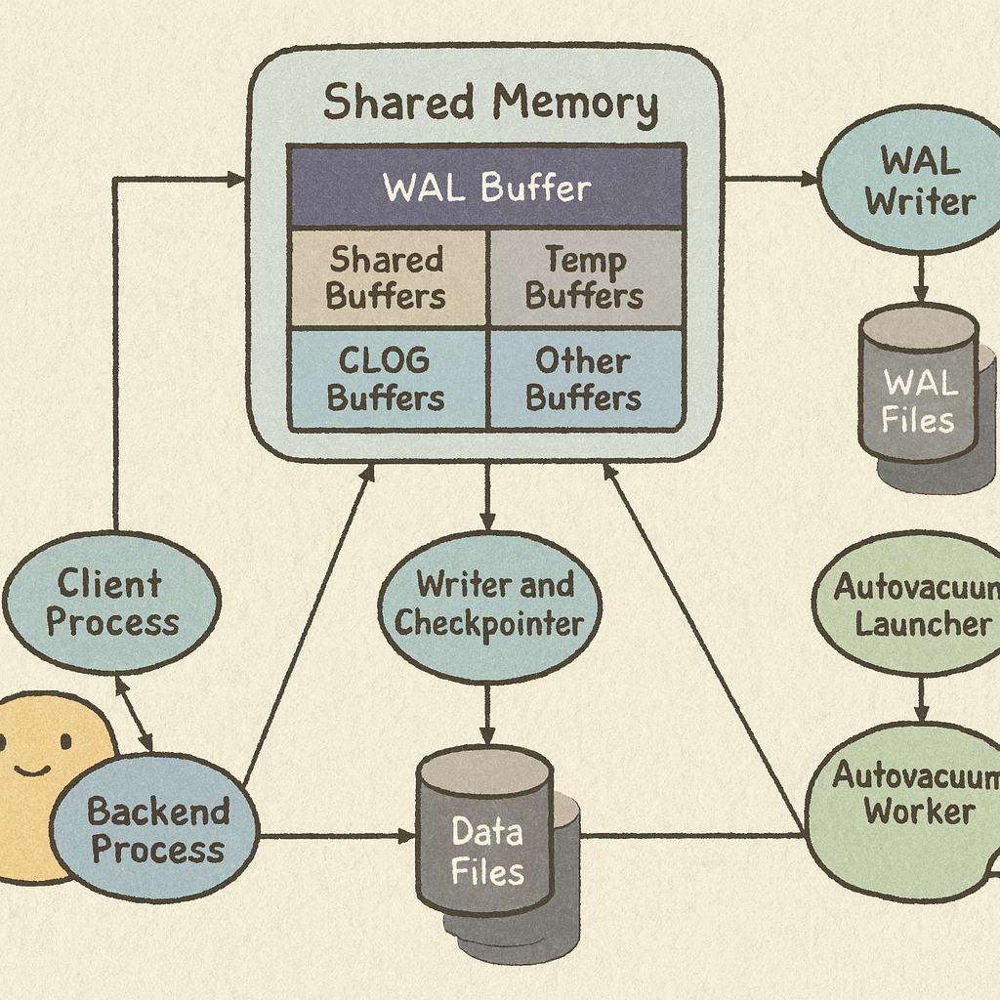
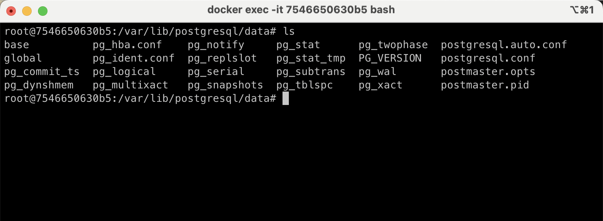
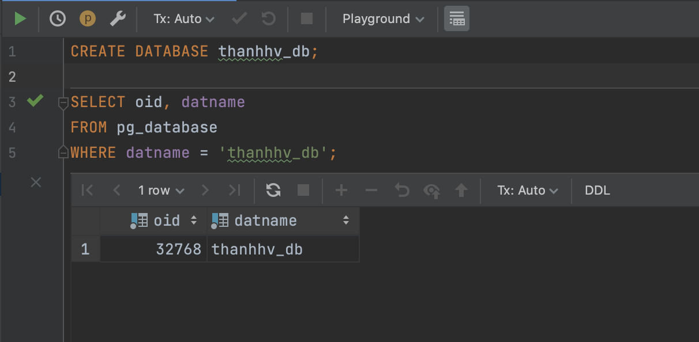
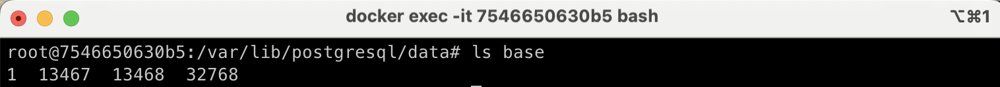
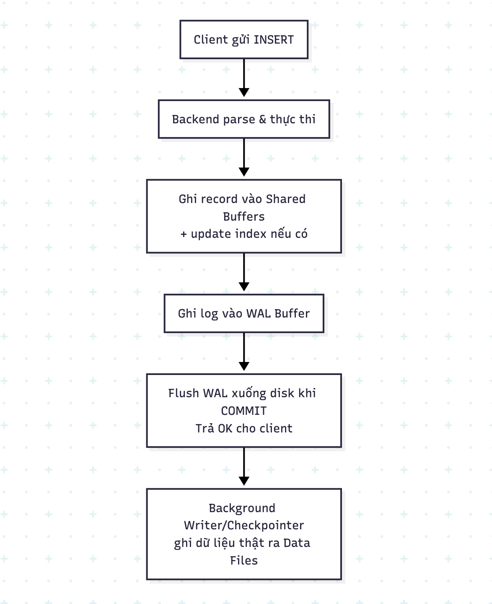

+++
date = '2025-09-07T23:00:00+07:00'
draft = false
title = 'Từ kiến trúc đến dữ liệu: PostgreSQL xử lý câu lệnh DML như thế nào'
tags = ["postgresql", "database"]
+++

Khi làm việc với database chắc hẳn chúng ta đã quen với các câu lệnh như `SELECT`, `UPDATE`, `INSERT`, `DELETE`,...  
Giả sử khi chạy một câu lệnh `INSERT INTO ...` để thêm record vào DB thì bên trong cơ sở dữ liệu sẽ làm những gì để xử lý?  
Trong bài viết này, hãy cùng mình tìm hiểu đằng sau một câu lệnh SQL khi thực thi sẽ đi qua những bước gì nhé.

---

## 1. Kiến trúc logic của PostgreSQL

Hình dưới mô tả kiến trúc tổng quát của PostgreSQL (Một vài thứ hơi advanced nên bạn có thể tìm hiểu thêm tài liệu bên ngoài để hiểu nó là gì nhé):



### Client Process và Backend Process
Đây là nơi câu lệnh SQL được gửi từ command-line hoặc từ các tool như DataGrip, pgAdmin,... tới **backend** của PostgreSQL.  
Backend sẽ parse câu lệnh, phân tích plan, thực thi và trả kết quả.

### Shared Memory
Vùng nhớ dùng chung cho tất cả backend, gồm:

- **WAL Buffer**: đệm tạm cho log (Write-Ahead Log) trước khi flush ra WAL file.  
- **Shared Buffers**: cache page dữ liệu (table, index) thay vì đọc/ghi trực tiếp từ disk.  
- **CLOG hay pg_xact(Commit Log) Buffers**: lưu trạng thái commit/abort của transaction.  
- **Temp Buffers**: cho bảng tạm và sort/hash tạm.  
- **Other Buffers**: các cấu trúc khác (lock tables, proc array,…).

💡 PostgreSQL (và hầu hết DBMS) đều **ghi vào bộ nhớ trước rồi mới đẩy xuống disk**, với 2 mục tiêu:

1. **Tăng tốc độ**  
   Shared Buffers giữ page dữ liệu đang truy cập/thay đổi → thao tác trên RAM nhanh hơn rất nhiều so với disk.  
   Khi có thay đổi (`INSERT/UPDATE/DELETE`), backend chỉ cần ghi vào Shared Buffers và WAL Buffer → trả kết quả cho client ngay.

2. **Đảm bảo an toàn dữ liệu (Durability)**  
   PostgreSQL tuân thủ nguyên tắc **Write-Ahead Logging (WAL)**: luôn ghi thay đổi vào WAL Buffer → WAL Files trước khi commit.  
   Nếu server crash, dữ liệu chưa kịp flush xuống Data Files vẫn có thể phục hồi từ WAL.

### Writer và Checkpointer
- **Writer (Background Writer):** định kỳ flush dirty pages từ Shared Buffers ra Data Files.  
- **Checkpointer:** tại checkpoint, toàn bộ dirty pages được flush để tạo "mốc nhất quán" giúp recovery nhanh hơn khi crash.

### WAL Writer và WAL Files
- **WAL Writer:** flush dữ liệu từ WAL Buffer xuống WAL Files trên disk.  
- WAL là cơ chế đảm bảo durability: **ghi log trước khi ghi dữ liệu thực sự**.

### Autovacuum Launcher & Worker
- **Autovacuum Launcher:** giám sát hệ thống, khởi chạy Autovacuum Worker khi cần.  
- **Autovacuum Worker:** dọn row "chết" (do MVCC), freeze transaction id, cập nhật statistics → tránh phình table và giữ query planner tối ưu.  

👉 Hình dung đơn giản: **Autovacuum Launcher** giống như scheduler → canh khi nào cần thì bật job. Job chính là **Autovacuum Worker**.

### Data Files
Nơi lưu trữ dữ liệu thực tế: table, index, TOAST, FSM, VM.  
Writer/Checkpointer sẽ flush Shared Buffers xuống Data Files.


## 2. Kiến trúc vật lý của PostgreSQL

Nếu bạn chưa có cài đặt PostgreSQL thì có thể dùng Docker cho nhẹ nhàng.  
Image chính thức: https://hub.docker.com/_/postgres  
(Mình sẽ viết một bài riêng về lý do nên dùng Docker sau 👌)

Sau khi cài xong, ta thử truy cập vào thư mục data để xem PostgreSQL lưu gì trong đó:  

```bash
cd /var/lib/postgresql/data
ls
```

Cùng tìm hiểu từng thư mục/file nhé:



---

### 1. base/
- Chứa dữ liệu của từng **database**.  
- Mỗi database = 1 folder (tên folder = **OID** của database).  
- Trong mỗi folder database:
  - Mỗi table / index = 1 file (tên file = **relfilenode ID**).  
  - Đây chính là nơi dữ liệu "thực sự" của các bảng nằm.

**Ví dụ:**  
Tạo database mới:
```sql
CREATE DATABASE thanhhv_db;
```

Xem OID của nó:
```sql
SELECT oid, datname
FROM pg_database
WHERE datname = 'thanhhv_db';
```

Ta sẽ thấy kết quả trả về OID = `32768`.  


Nếu bạn truy cập vào thư mục `base/` sẽ thấy có thư mục `32768`, chính là nơi PostgreSQL lưu dữ liệu của `thanhhv_db`.




Bạn có thể tạo thêm table trong database này để quan sát file phát sinh.

---

### 2. global/
- Chứa metadata toàn cụm (cluster-wide).  
- Một số file quan trọng:
  - `pg_database` → thông tin database  
  - `pg_auth` → user, role  
  - `pg_control` → thông tin khởi động cluster, checkpoint, timeline, version…

---

### 3. pg_wal/
- Lưu **Write-Ahead Log (WAL)** - log mọi thay đổi.  
- Khi transaction commit, dữ liệu được ghi vào WAL trước → nếu crash thì phục hồi từ đây.  
- Cực kỳ quan trọng để đảm bảo durability.

---

### 4. pg_tblspc/
- Mặc định PostgreSQL sẽ tạo database và table trong thư mục `base/`.  
- Nếu bạn tạo **tablespace**, PostgreSQL sẽ lưu dữ liệu ở đường dẫn bạn chỉ định (ví dụ HDD), còn trong `pg_tblspc/` chỉ giữ symlink trỏ tới đó.  
- Đây là cách phổ biến để tối ưu chi phí:  
  - Data nóng → SSD  
  - Data cũ/ít truy cập → HDD  

**Ví dụ:**  
Tạo tablespace:
```sql
CREATE TABLESPACE product_space
OWNER postgres
LOCATION '/mnt/hdd/pg_tablespace_product';
```

Tạo database sử dụng tablespace:
```sql
CREATE DATABASE product_db
WITH OWNER = postgres
TABLESPACE = product_space;
```

Khi đó database sẽ nằm ở `/mnt/hdd/pg_tablespace_product` thay vì `/base`.

---

### 5. Transaction-related
- `pg_xact/` → trạng thái commit/abort của transaction  
- `pg_multixact/` → lock chia sẻ giữa nhiều transaction  
- `pg_subtrans/` → mapping subtransaction → top-level transaction  

---

### 6. Một số file đặc biệt
- `pg_hba.conf` → cấu hình kết nối (host-based authentication)  
- `postgresql.conf` → cấu hình server  
- `postmaster.pid` → PID của tiến trình Postgres, để tránh start trùng  
- `PG_VERSION` → version PostgreSQL hiện tại  

⚠️ **Lưu ý:**  
- Với file config (`postgresql.conf`, `pg_hba.conf`), chỉ chỉnh trực tiếp khi cần.  
- Ưu tiên update qua SQL (`ALTER SYSTEM SET ...; SELECT pg_reload_conf();`) để có log/tracking.  
- Một số file đặc biệt (vd: `pg_hba.conf`) bắt buộc phải sửa tay vì không chỉnh qua SQL được.

## 3. Inspect một câu lệnh INSERT dưới góc nhìn Backend Engineer

Giả sử khi chạy một câu lệnh như sau:

```sql
INSERT INTO test VALUES (1, 'thanhhv');
```

Quy trình xử lý có thể tóm gọn thành 5 bước chính:

1. Client gửi SQL → Backend process nhận và parse, tạo execution plan.

2. Ghi dữ liệu vào bộ nhớ (Shared Buffers): record được thêm vào page trong RAM, đánh dấu dirty. Nếu có index thì index cũng được update trong buffer. Lúc này commit chưa cần data file, chỉ cần WAL được flush là đủ

3. Sinh log (WAL): thay đổi được ghi vào WAL Buffer.

4. Commit: WAL được flush xuống disk (`pg_wal/`) → đảm bảo dữ liệu bền vững. PostgreSQL trả kết quả OK cho client.

5. Ghi dữ liệu thật: sau commit, dữ liệu trong buffer sẽ được background writer/checkpointer ghi dần ra data files. Nếu server crash trước đó thì sẽ phục hồi dựa trên WAL.




Ở đây mình giải thích theo hướng một backend engineer cần nắm nên đã bỏ qua một vài advanced section bên trong.
Những bước này thường chỉ cần thiết cho ai làm rất sâu về database. Nếu bạn có bổ sung hoặc góc nhìn khác, hãy để lại góp ý ở phần bình luận nhé 🚀

---
Cám ơn mọi người đã đọc đến đây 🙌 Hẹn gặp lại trong những bài viết sắp tới.  
Chúc mọi người sẽ gặt hái được nhiều thành tựu trong quá trình học và làm việc với database của mình!
