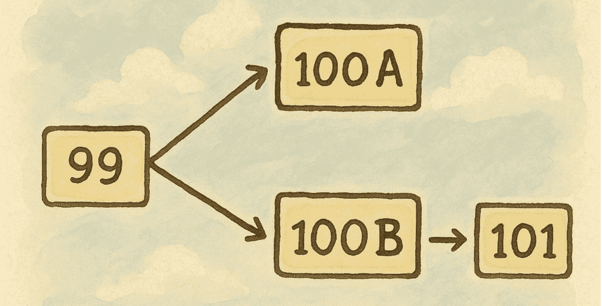

+++
date = '2025-05-10T23:44:00+07:00'
draft = false
title = 'Re-org là gì? Backend Developer cần xử lý thế nào khi Blockchain "đổi ý"'
tags = ["blockchain", "backend"]
+++

## 1. Cơ bản về cách blockchain thêm block

Các blockchain như Ethereum, Bitcoin hoạt động như sau:

- Mỗi node trong mạng sẽ giữ một bản sao của blockchain hiện tại.
- Khi một miner (hoặc validator) tìm được block mới hợp lệ, nó sẽ broadcast block đó cho mạng.
- Các node nhận block mới sẽ xác minh, nếu hợp lệ thì thêm vào chain của mình.

Vấn đề xảy ra khi nhiều miner có thể tìm được block mới gần như cùng một lúc.  
Giả sử mạng lưới đang dừng ở block thứ `99`. Miner A tìm ra block `100A` và broadcast nó. Ở một nơi khác, Miner B cũng tìm ra một block `100B` và broadcast. Do độ trễ mạng, các node khác nhau có thể nhận và thêm vào chuỗi khác nhau: 100A hoặc 100B.

Lúc này, blockchain tạo ra hai nhánh tạm thời (gọi là **temporary fork**) ở block thứ 100.

---

## 2. Khi nào xảy ra re-org?



Giả sử Miner C đào tiếp block `101` dựa trên `100B`, chuỗi lúc này là:

```
Block 99 -> Block 100B -> Block 101
```

Trong khi đó, bạn đang theo chuỗi:

```
Block 99 -> Block 100A
```

Theo quy tắc **longest chain**, blockchain sẽ chọn chuỗi dài hơn là chuỗi chính thức.  
Vì vậy, chain `100B -> 101` sẽ được chấp nhận, và block `100A` bị loại bỏ.  
Quá trình này gọi là **chain reorganization (re-org)**.

**Re-org** là lúc mà mạng đổi ý và chọn một nhánh mới dài hơn, bỏ qua nhánh cũ — giống như chơi cờ mà bỗng dưng đi lại nước trước đó vì thấy đường khác ngon hơn!

---

## 3. Các kỹ thuật xử lý khi re-org xảy ra ở phía backend

### 3.1. Delay block confirmation

Đây là cách phổ biến và đơn giản nhất.  
Khi indexing dữ liệu từ blockchain, bạn **bỏ qua một vài block cuối cùng** để tránh sai sót do re-org.

Ví dụ:  
- Trên Ethereum, thường **bỏ qua 12 block cuối** (tức chỉ xử lý đến `latest - 12`).
- Các chain khác sẽ có con số riêng, bạn cần tra thêm tài liệu.

Tuy nhiên, cách này có độ trễ nên có thể kèm theo giải pháp UI như:  
> "Đang xử lý dữ liệu... lần cập nhật gần nhất 1 phút trước"

---

### 3.2. Xây dựng hệ thống rollback tự động (phức tạp hơn)

Để dữ liệu gần như **realtime** nhưng vẫn chính xác, bạn có thể xây hệ thống hỗ trợ rollback khi re-org:

- Khi lưu dữ liệu từ block, luôn **lưu kèm blockNumber và blockHash**.
- Mỗi khi có block mới, kiểm tra lại N block trước đó (ví dụ: 12 block).
- Nếu blockHash không khớp với dữ liệu đã lưu:
  - **Rollback**: xóa dữ liệu liên quan block cũ, sync lại block mới.
  - Hoặc tạo record mới với trạng thái như: `confirmed`, `reorged`, `replaced`,... để phục vụ audit.

Phương pháp này **chính xác hơn**, nhưng phức tạp và tốn công hơn rất nhiều.  
Việc lựa chọn cách xử lý phù hợp nên **linh hoạt tùy vào yêu cầu hệ thống và đặc thù sản phẩm** bạn đang làm.

---

## 👋 Kết

Hy vọng bài viết giúp bạn hiểu rõ hơn về khái niệm re-org và cách đối phó với nó trong backend.  
Cảm ơn mọi người đã đọc tới đây. Hẹn gặp lại ở bài viết tiếp theo nhé! 🚀