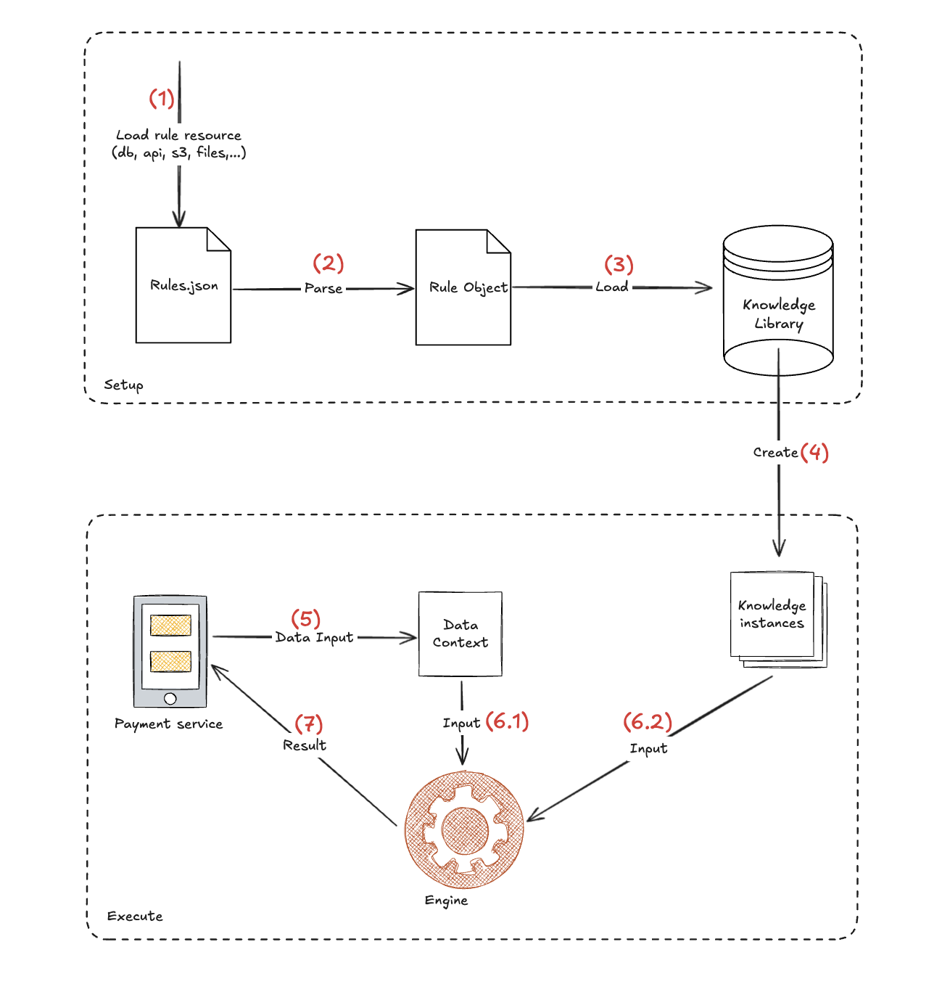
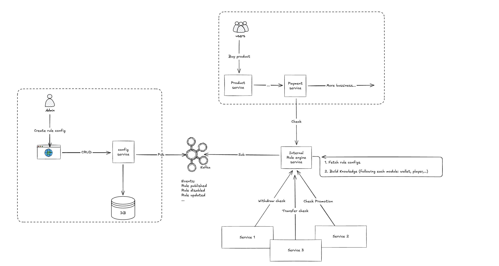

+++
title = "Chuyện mình triển khai Rule Engine trong backend"
date = "2025-11-29T23:00:00+07:00"
draft = false
tags = ["rule-engine", "golang", "system-design"]
+++

Chào mọi người, gần đây khi mình chuyển sang công việc mới với một ngôn ngữ lập trình khác, mình có cơ hội tham gia thiết kế một hệ thống rule engine để đáp ứng các yêu cầu business của công ty. Trong quá trình tìm hiểu và research, mình muốn ghi lại những kiến thức đã học được, đồng thời chia sẻ lại theo một scope phổ biến hơn để phù hợp với nhiều mô hình business hiện nay. Bài viết này vừa để mình hệ thống hóa kiến thức, vừa hy vọng giúp ích cho những bạn đang quan tâm đến rule engine.

Cùng bắt đầu nhé!


---

## 1. Rule engine là gì? Tại sao lại phải cần nó?

Rule engine là một hệ thống phần mềm dùng để quản lý và thực thi các luật, quy tắc (rules) riêng biệt khỏi code chính của ứng dụng. Nói cách khác, nó giúp tách logic quyết định ra khỏi code core để dễ thay đổi, bảo trì và mở rộng.

Cấu trúc cơ bản của nó gồm:

- **Rule (quy tắc):** Một điều kiện kèm hành động, ví dụ: "Nếu khách hàng VIP và mua trên 1 triệu → giảm giá 10%".
- **Engine:** Chịu trách nhiệm kiểm tra các rule và thực hiện hành động khi điều kiện thỏa.

### Tại sao cần rule engine?

- Tách biệt logic: Giúp code chính không bị rối, rule có thể thay đổi mà không cần sửa code core.
- Dễ bảo trì và mở rộng: Thêm/sửa/xóa rule mà không cần deploy toàn bộ ứng dụng.
- Hỗ trợ logic phức tạp: Khi hệ thống có quá nhiều điều kiện, rule engine quản lý tốt hơn là code rải rác.
- Tái sử dụng: Cùng một rule có thể áp dụng ở nhiều nơi khác nhau.
- Người nghiệp vụ có thể quản lý: Với một số engine, người không phải dev cũng có thể chỉnh rule qua UI.

---

## 2. Rule engine dưới góc nhìn của 1 software engineer

Giả sử bạn đang viết một e-commerce API, cần áp dụng giảm giá theo nhiều điều kiện:

- Khách VIP → giảm 10%
- Mua > 5 sản phẩm → giảm thêm 5%
- Mua vào dịp Black Friday → giảm thêm 15%

Nếu viết thuần trong code, bạn sẽ có nhiều `if/else` rối rắm:

```go
discount := 0.0
if user.IsVIP {
    discount += 0.1
}
if len(cart.Items) > 5 {
    discount += 0.05
}
if today == BlackFriday {
    discount += 0.15
}
totalPrice := cart.Total * (1 - discount)
```

**Vấn đề**: Mỗi lần có rule mới phải sửa code → deploy → dễ lỗi.

Nếu dùng rule engine, bạn chỉ tạo rule ngoài code (ví dụ theo format GRL - định dạng rule của grule):

```
Rule 1: IF user.IsVIP THEN discount = 10%
Rule 2: IF cart.Items > 5 THEN discount += 5%
Rule 3: IF today == BlackFriday THEN discount += 15%
```

Backend chỉ cần gọi rule engine:
```go
discount := ruleEngine.Calculate(user, cart)
totalPrice := cart.Total * (1 - discount)
```
**Lợi ích:**

- Thêm/sửa/xóa rule không cần deploy code.

- Logic phức tạp dễ quản lý và dễ mở rộng khi business lớn dần.

## 3. Giới thiệu về 1 rule engine trong Golang, cách bên dưới nó hoạt động

Hiện tại có rất nhiều library implement rule engine từ NodeJS, Python, Golang, .NET,... Nhưng khi làm việc với Golang thì mình thấy thư viện `grule-rule-engine` xử lý khá tốt cho nhu cầu của mình. Nó hỗ trợ hầu hết operator, làm việc tốt với định dạng JSON, GRL,... và performance khá ổn (mình đã benchmark chạy ổn ở ~10k RPS).

Documentation có thể xem tại link sau: https://github.com/hyperjumptech/grule-rule-engine

Vậy bên trong rule engine thực sự nó làm gì mà có thể **"lợi hại"** như vậy? Hãy cùng mình đi sâu vào cơ chế hoạt động bên dưới nhé.

Hình sau mô tả chi tiết các bước **rule engine** thực thi:



### Phase 1 — Setup phase
#### 1. Load rule resource

Tải rule từ file (`rules.json`, `.grl`), DB, API, S3,…

Đây là nguồn dữ liệu quy tắc, ví dụ: `IF user.IsVIP THEN discount = 10%`.

#### 2. Parse

Chuyển rule từ JSON/GRL thành Rule Object mà engine hiểu.
Ở grule-rule-engine, parser sẽ tạo AST (abstract syntax tree) từ rule script.

#### 3. Load vào Knowledge Library

Nạp Rule Object vào **Knowledge Library** (thư viện kiến thức, giống như là database của engine vậy).
Library chứa toàn bộ rule đã được parse, sẵn sàng để engine sử dụng.

#### 4. Tạo Knowledge Base Instances

Từ Knowledge Library, engine tạo ra **Knowledge Base** — đây là runtime snapshot của rule set, dùng để thực thi rule.

(Việc này cho phép reuse Knowledge Base nhiều lần mà không cần parse lại rule.)

### Phase 2 — Execute phase (chạy rule với dữ liệu thực tế)
#### 5. Input → Data Context

Nhận dữ liệu runtime từ service (ví dụ `Payment Service`).
Dữ liệu được map thành Data Context, tức là các biến mà rule có thể đọc và thay đổi.

#### 6. Engine nhận input

Input từ _Data Context_

Input từ _Knowledge Base_

Engine sẽ kiểm tra điều kiện của rule, thực thi hành động nếu điều kiện thỏa.

#### 7. Trả kết quả

Engine trả về output — ví dụ: `discount`, `fraud flag`, `approval result`,...

Service caller nhận kết quả và xử lý tiếp.

## 4. Triển khai trong 1 dự án thực tế

Trong thực tế, khi implement một hệ thống rule engine mình sẽ chia nó thành 2 phần:
1 phần là **định nghĩa rule**, 1 phần là engine để **thực thi rule**.

Tổng quan về hệ thống như hình sau:




Sẽ có 1 service gọi là **config service**. Admin sẽ vào cấu hình rule và lưu vào database. Khi admin publish / update / create rule, service này sẽ bắn message qua Kafka.

**Service rule-engine** sẽ nhận message, parse rule thành định dạng mà rule engine có thể thực thi được (ở đây là JSON hoặc GRL của grule-rule-engine), lưu trữ vào database và load vào runtime memory khi service khởi chạy hoặc khi có cập nhật mới.

Những service khác khi cần check rule sẽ gọi đến **service rule-engine**, truyền vào input. Rule-engine sẽ tổng hợp data, map vào Data Context tương ứng rồi tiến hành kiểm tra. Sau khi xong sẽ trả lại response cho service gọi (bao gồm cả những data bị effect bởi rule).

## 5. Sample code

Dưới đây là đoạn code đơn giản implement 1 flow check rule theo `grule-rule-engine`, các bạn có thể tải về và chạy thử.

```go
package main

import (
	"fmt"

	"github.com/hyperjumptech/grule-rule-engine/ast"
	"github.com/hyperjumptech/grule-rule-engine/builder"
	"github.com/hyperjumptech/grule-rule-engine/engine"
	"github.com/hyperjumptech/grule-rule-engine/pkg"
)

// Fact struct
type Topup struct {
	Amount              float64
	NumberOfTransaction int
	BonusAmount         float64
	BonusPercent        int
}

func (t *Topup) Log(msg string) {
	fmt.Printf("You topup %.f$. You'll receive %d percent %.2f$ bonus\n", t.Amount, t.BonusPercent, t.BonusAmount)
}

func main() {
	mt := &Topup{
		Amount:              20000,
		NumberOfTransaction: 0,
		BonusAmount:         0,
		BonusPercent:        0,
	}

	dataCtx := ast.NewDataContext()
	if err := dataCtx.Add("T", mt); err != nil {
		fmt.Println("Error Prepare fact:", err)
		panic(err)
	}

	knowledgeLibrary := ast.NewKnowledgeLibrary()
	ruleBuilder := builder.NewRuleBuilder(knowledgeLibrary)

	jsonData := []byte(`[
    {
        "name": "Bonus10Percent",
        "salience": 1,
        "version": "0.0.1",
        "description": "Add 10% bonus if amount > 1000 and first transaction",
        "when": {
            "and": [
                {"gt": ["T.Amount", 1000]},
                {"eq": ["T.NumberOfTransaction", 0]}
            ]
        },
        "then": [
            {"set": ["T.NumberOfTransaction", {"plus": ["T.NumberOfTransaction", 1]}]},
            {"set": ["T.BonusAmount", {"plus": ["T.BonusAmount", {"mul": ["T.Amount", {"const": 0.10}]}]}]},
            {"set": ["T.BonusPercent", {"plus": ["T.BonusPercent", 10]}]},
            {"call": ["T.Log", {"const": "Applied 10% bonus"}]}
        ]
    }
]`)

	resource := pkg.NewBytesResource(jsonData)
	jsonResource, err := pkg.NewJSONResourceFromResource(resource)
	if err != nil {
		panic(err)
	}

	if err := ruleBuilder.BuildRuleFromResource("TutorialRules", "0.0.1", jsonResource); err != nil {
		panic(err)
	}

	knowledgeBase, err := knowledgeLibrary.NewKnowledgeBaseInstance("TutorialRules", "0.0.1")
	if err != nil {
		panic(err)
	}

	gruleEngine := engine.NewGruleEngine()
	if err := gruleEngine.Execute(dataCtx, knowledgeBase); err != nil {
		panic(err)
	}
}
```

## 6. Kết luận

Việc triển khai một hệ thống rule-engine không chỉ đơn giản như vậy. Trong quá trình làm sẽ phát sinh nhiều vấn đề như:

- Load rule từ database mỗi lần check rất chậm → cần caching hoặc load trước vào runtime memory.

- Invalid Knowledge Base khi config service xoá / disable / update rule.

- Quản lý version của rule.

- Ưu tiên (priority) của rule khi nhiều rule cùng tác động đến cùng một dữ liệu.

- Và còn rất nhiều thứ khác khi hệ thống lớn dần.

> Không có cách nào improve nhanh hơn là tự mình tham gia thiết kế và vận hành một hệ thống như vậy, tự viết và tìm ra giải pháp phù hợp cho bài toán của mình. Hy vọng qua bài viết này đã giúp bạn hiểu rõ hơn về rule engine và có thể implement được nó ở mức độ đơn giản.

Hẹn gặp lại trong bài viết tiếp theo nhé. Nếu bạn có ý kiến hoặc chia sẻ thêm về rule-engine đừng ngần ngại comment bên dưới nhé.
Bye for now.