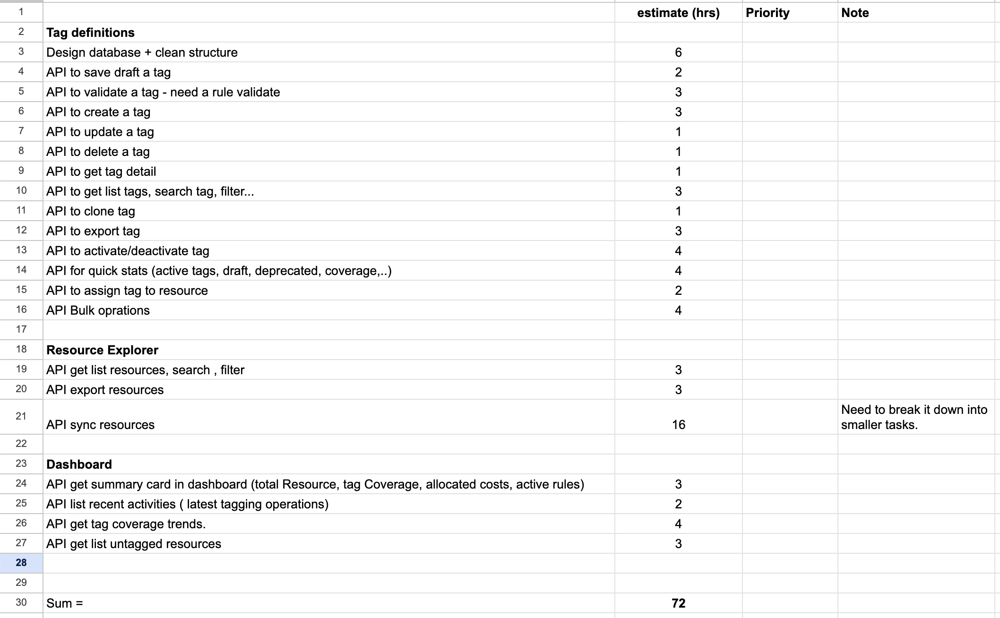
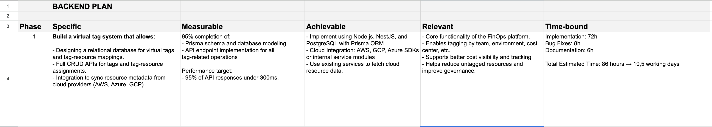

+++
title = "Lập kế hoạch công việc hiệu quả với SMART"
date = "2025-08-29T21:00:00+07:00"
draft = false
tags = ["smart", "manage"]
+++

Chắc hẳn bạn đã quá quen thuộc với việc làm việc trong các team theo các mô hình quản lý như **Agile**, đặc biệt là trong các công ty lớn. Vì vậy hôm nay mình sẽ chia sẻ cho các bạn cách có thể làm việc hiệu quả hơn khi muốn đóng góp nhiều hơn vào các buổi planning, muốn nhận được đánh giá tốt hơn từ team, hoặc khi các bạn làm cho startup nơi đòi hỏi nỗ lực cá nhân cao do thiếu hụt về resource.  
Đó chính là **lập kế hoạch theo quy tắc `SMART`**.

---

## 1. SMART là gì?

Khi đặt mục tiêu, nhiều người thường bị mơ hồ: muốn học nhiều hơn, làm việc tốt hơn, hay tiết kiệm nhiều hơn… nhưng không biết đo lường ra sao.  
**SMART** là một nguyên tắc giúp biến mục tiêu “mơ hồ” thành cụ thể, rõ ràng và khả thi. Nó là viết tắt của:  

- **S** (Specific - Cụ thể)  
- **M** (Measurable - Đo lường được)  
- **A** (Achievable - Khả thi)  
- **R** (Relevant - Liên quan)  
- **T** (Time-bound - Có thời hạn)  

Chúng ta hãy cùng đi vào chi tiết từng yếu tố.

---

### Specific (Cụ thể)

Mục tiêu phải rõ ràng, dễ hiểu, không chung chung.  
> ❌ Sai: "Tôi muốn giỏi tiếng Anh."  
> ✅ Đúng: "Tôi muốn cải thiện kỹ năng nói tiếng Anh để giao tiếp trong công việc"  

👉 Khi cụ thể, bạn sẽ biết chính xác mình phải làm gì mỗi ngày.

---

### Measurable (Đo lường được)

Mục tiêu cần có thước đo để biết mình đã đạt hay chưa.  

> ❌ Sai: "Tôi sẽ luyện nghe tiếng Anh thường xuyên."  
> ✅ Đúng: "Tôi sẽ nghe podcast tiếng Anh ít nhất 20 phút mỗi ngày và ghi chú lại 5 từ mới."  

👉 Con số (20 phút, 5 từ) chính là thước đo để bạn kiểm tra tiến độ.

---

### Achievable (Khả thi)

Mục tiêu phải nằm trong khả năng thực hiện, không quá viển vông, phù hợp với thời gian và năng lực.  

> ❌ Sai: "Trong 1 tháng tôi sẽ nói tiếng Anh như người bản xứ."  
> ✅ Đúng: "Trong 1 tháng tôi sẽ học 200 từ vựng mới và dùng chúng để viết 10 đoạn hội thoại ngắn."  

👉 Thử thách bản thân, nhưng vẫn cần thực tế dựa trên nguồn lực.

---

### Relevant (Liên quan)

Mục tiêu cần gắn với định hướng lớn trong công việc hoặc cuộc sống.  

> ❌ Sai: "Tôi sẽ học thêm tiếng Anh để… cho vui."  
> ✅ Đúng: "Tôi sẽ luyện tiếng Anh để giao tiếp tốt hơn trong công việc của một engineer và chuẩn bị phỏng vấn vào các công ty quốc tế."  

👉 Khi mục tiêu có ý nghĩa với sự nghiệp, bạn sẽ dễ kiên trì hơn.

---

### Time-bound (Có thời hạn)

Deadline giúp bạn tránh trì hoãn.  

> ❌ Sai: "Tôi sẽ học tiếng Anh để lên fluent."  
> ✅ Đúng: "Tôi sẽ hoàn thành trình độ Basic trong 3 tháng, đạt Intermediate sau 4 tháng tiếp theo, và hướng đến Fluent sau 8 tháng nữa."  

👉 Có mốc thời gian rõ ràng sẽ giúp bạn có lộ trình cụ thể và biết mình đang ở đâu.

---

## 2. Vận dụng SMART vào lập kế hoạch cho một feature cụ thể

Nếu đã đọc qua đoạn trên thì chắc bạn cũng hiểu sơ qua về cách lập kế hoạch theo SMART rồi. Bây giờ mình sẽ áp dụng nó vào một feature cụ thể mà mình từng làm trong dự án.  
Dĩ nhiên đây chỉ là một feature nhỏ và phổ biến, không hề liên quan đến bảo mật hay thông tin nhạy cảm của công ty cũ nên hoàn toàn phù hợp để chia sẻ. (Nếu anh em trong công ty có đọc được bài này thì hoan hỉ nhé =))  

**Tình huống:**  
Hôm ấy là thứ 5, team sắp bước vào buổi planning cho sprint tiếp theo. Nội dung chính của sprint này là triển khai một module mới gọi là **[virtual-tag](../virtual-tag-in-finops)** để quản lý thông tin trong hệ thống. Đây là cách mình và team Backend đã lên plan.

---

#### Specific - Xây dựng hệ thống Virtual Tag

- Thiết kế cơ sở dữ liệu quan hệ để quản lý virtual tag và mối quan hệ gán tag cho resource.  
- Xây dựng đầy đủ API CRUD cho việc tạo, đọc, cập nhật, xóa tag và thao tác gán/bỏ gán tag.  
- Tích hợp với AWS, Azure, GCP để đồng bộ metadata của resource về hệ thống.  

---

#### Measurable - Tiêu chí đo lường

- Hoàn thành **95%** các hạng mục:  
  - Thiết kế Prisma schema và database modeling.  
  - Triển khai API endpoint cho toàn bộ thao tác liên quan đến tag.  

- Mục tiêu hiệu năng:  
  - **95%** API response dưới **300ms**.  

---

#### Achievable - Phương tiện thực hiện

- Triển khai bằng **Node.js, NestJS, PostgreSQL** và **Prisma ORM**.  
- Tích hợp cloud qua **AWS, GCP, Azure SDKs** hoặc service module nội bộ.  
- Sử dụng các service sẵn có để fetch dữ liệu resource từ cloud.  

---

#### Relevant - Tính liên quan

- Là **chức năng cốt lõi** của nền tảng FinOps.  
- Cho phép gắn tag theo **team, môi trường, cost center**.  
- Hỗ trợ tăng khả năng quan sát chi phí và tracking.  
- Giúp giảm resource **không được gắn tag** và cải thiện governance.  

---

#### Time-bound - Thời hạn

- Triển khai: **72 giờ**  
- Sửa lỗi: **8 giờ**  
- Viết tài liệu: **6 giờ**  

👉 Tổng thời gian ước tính: **86 giờ ≈ 10,5 ngày làm việc**  

Tất nhiên, thực tế cần break nhỏ từng task để estimate chính xác hơn. Thường thì mình sẽ tạm chia trên Excel, sau đó đưa vào Jira và refine lại cùng team để có con số cuối cùng. Đôi khi những cuộc họp có thể khiến kế hoạch ban đầu bị xáo trộn, nhưng nhờ có sự chuẩn bị, chúng ta có thể nhanh chóng thích nghi và tái cấu trúc lại plan của bản thân cũng như của team để vẫn đạt được mục tiêu chung.

> Ví dụ về break task

 

> Ví dụ về 1 plan hoàn chỉnh

---

## Kết luận

Việc lập kế hoạch theo SMART giúp buổi planning trong sprint **dễ dàng hơn**, giúp mình nêu ra vấn đề, phân tích việc nào thực sự cần thiết và có tính khả thi với dự án. Nó mang lại rất nhiều giá trị, đặc biệt nếu bạn là một developer và muốn tiến xa hơn (senior, leader) thì đây là kỹ năng **bắt buộc phải có**.

Con số và ví dụ trong bài mang tính tham khảo, mỗi dự án sẽ có điều chỉnh khác nhau, hy vọng nó sẽ mang lại 1 ít giá trị cho bạn. Thank you!
