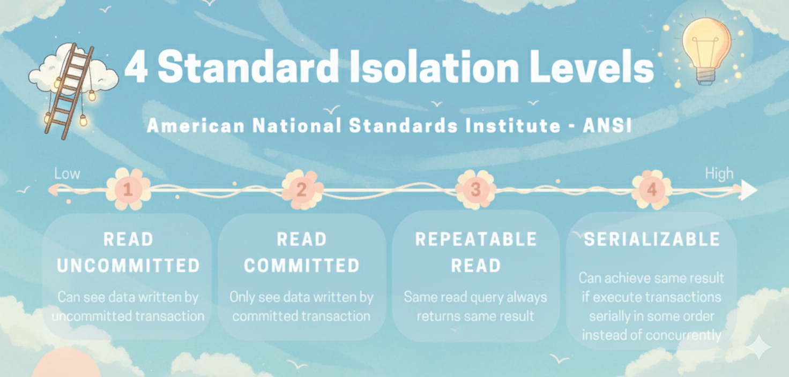

+++
title = "Các level isolation của transaction trong SQL"
date = "2025-10-08T20:10:00+07:00"
draft = false
tags = ["database", "transaction isolation"]
+++

Thời gian gần đây khi mình tham gia các buổi phỏng vấn ở vị trí backend thì thường xuyên được hỏi đến các câu hỏi về **database**, trong đó chủ yếu xoay quanh **transaction**.  
Vậy nên trong bài viết hôm nay mình sẽ cùng ôn lại kiến thức về nó nhé.  
Nội dung này mình không rành lắm nên chủ yếu là góp nhặt và tích luỹ để viết cho bản thân nhớ lâu hơn — cũng tiện chia sẻ cho các bạn hữu duyên nếu đọc được.  

Cùng nhau bắt đầu nhé 👇  



---

## 🧩 Mở bài

Khi nói đến **transaction trong SQL**, chúng ta thường nghe đến khái niệm **ACID** — 4 tính chất quan trọng đảm bảo một transaction hoạt động **an toàn và nhất quán**.

### 🔹 Atomicity (Tính nguyên tử)
Mọi thao tác trong transaction được xem là một khối duy nhất.  
Hoặc tất cả đều thực hiện thành công, hoặc **không có gì được thực hiện (rollback)**.

➡️ **Ví dụ:**  
Chuyển tiền từ A → B gồm 2 bước:
1. Trừ tiền tài khoản A  
2. Cộng tiền tài khoản B  

Nếu bước 2 lỗi → bước 1 phải rollback, để không mất tiền oan.

---

### 🔹 Consistency (Tính nhất quán)
Sau mỗi transaction, dữ liệu phải giữ được trạng thái hợp lệ theo các ràng buộc (constraint, foreign key, trigger,…).

➡️ **Ví dụ:**  
Tổng tiền của A + B phải luôn bằng 1000 trước và sau giao dịch — không thể thành 900 hay 1100.

---

### 🔹 Isolation (Tính cô lập)
Nhiều transaction chạy song song **không được ảnh hưởng lẫn nhau**.  
Kết quả cuối cùng phải giống như khi chúng được thực thi tuần tự.

---

### 🔹 Durability (Tính bền vững)
Khi transaction đã **commit**, dữ liệu được ghi vĩnh viễn (thường là xuống đĩa hoặc WAL log).  
Kể cả khi hệ thống crash, dữ liệu vẫn không mất.

> 💡 **ACID** = đảm bảo giao dịch toàn vẹn, nhất quán, độc lập và bền vững.

---

## ⚙️ Thân bài: Isolation Level trong SQL

Hầu hết các hệ quản trị cơ sở dữ liệu quan hệ đều hỗ trợ **4 mức độ isolation**.  
Cùng xem chi tiết nhé 👇

---

### 🧱 1. Read Uncommitted
Transaction có thể **đọc dữ liệu chưa commit** từ transaction khác.  
➡️ Dễ xảy ra **dirty read** (đọc dữ liệu “bẩn”, sai).

**Ví dụ:**  
- Transaction A cập nhật `balance = 500` nhưng chưa commit.  
- Transaction B đọc thấy `balance = 500`.  
- Sau đó A rollback → dữ liệu B đọc là sai.

> ⚠️ Ít dùng, không an toàn.  
> PostgreSQL không thực sự hỗ trợ mức này — nó tự động nâng lên **Read Committed**.

---

### 🧱 2. Read Committed *(mặc định trong PostgreSQL, Oracle)*
Chỉ đọc **dữ liệu đã commit**.  
Mỗi query chỉ thấy dữ liệu đã commit **trước khi query bắt đầu**.

Có thể xảy ra:
- **Non-repeatable read** (đọc cùng dòng hai lần, thấy giá trị khác).  
- **Phantom read** (các dòng mới được thêm xuất hiện trong lần đọc sau).

**Ví dụ:**  
- A đọc `balance = 1000`.  
- B update → commit → A đọc lại thấy `balance = 800`.

---

### 🧱 3. Repeatable Read *(mặc định trong MySQL)*
Toàn bộ transaction sẽ thấy **một snapshot dữ liệu tại thời điểm transaction bắt đầu**.  
Ngăn **dirty read** và **non-repeatable read**,  
nhưng vẫn có thể xảy ra **phantom read** (dòng mới được insert sau khi snapshot chụp).

**Ví dụ:**  
- A đếm `COUNT(*) user = 5`.  
- B thêm 1 user mới → commit → A vẫn thấy = 5 (snapshot cũ).  
- Nhưng nếu A thêm dữ liệu tương tự có thể bị conflict (phantom).

> Trong cùng 1 transaction (Repeatable Read / Serializable), dữ liệu bị “đóng băng” theo snapshot tại lúc bắt đầu transaction.  
> Khi mở transaction mới, snapshot mới sẽ được tạo → query sẽ thấy bản ghi mới commit từ transaction khác.

---

### 🧱 4. Serializable
Mức mạnh nhất — đảm bảo kết quả tương đương như thể các transaction chạy **tuần tự**.  
Ngăn tất cả anomaly (dirty, non-repeatable, phantom).

Database sẽ phát hiện conflict và **rollback 1 transaction** (serialization failure).

**Ví dụ:**  
```sql
-- Transaction A
SELECT SUM(balance) FROM accounts;  -- thấy tổng = 1000

-- Transaction B
UPDATE accounts SET balance = balance - 100 WHERE id = 1;
COMMIT;

-- Transaction A (tiếp tục)
UPDATE accounts SET balance = balance + 100 WHERE id = 2;
COMMIT;
```

Nếu để nguyên **(Read Committed / Repeatable Read)**, về mặt lý thuyết có thể **tổng số dư bị sai lệch**.  

Với **Serializable**, PostgreSQL sẽ **rollback một trong hai transaction** → đảm bảo kết quả **giống như thể chúng chạy tuần tự** *(A trước B hoặc B trước A)*.

---

### 🧾 Ứng dụng thực tế: Đặt vé / Booking
Giả sử có **1 ghế duy nhất**.

- Transaction A kiểm tra ghế trống → insert booking.  
- Transaction B cũng kiểm tra và thấy trống (do snapshot giống nhau) → insert booking.

→ Với **Read Committed / Repeatable Read**, có thể 2 booking cùng tồn tại.  
→ Với **Serializable**, PostgreSQL rollback 1 booking → đảm bảo ghế chỉ được đặt 1 lần.

---

## 🍃 Isolation trong MongoDB
MongoDB **không có nhiều isolation level như SQL**.  
Nó chỉ có **một mức duy nhất** cho transaction: **Snapshot Isolation (SI)** — tương tự **Repeatable Read** trong PostgreSQL.

Nghĩa là:
- Transaction đọc dữ liệu nhất quán theo snapshot tại thời điểm bắt đầu.  
- Không thấy dữ liệu chưa commit từ transaction khác (**no dirty read**).  
- Các query trong cùng transaction thấy cùng một snapshot (**no non-repeatable read**).  
- Tuy nhiên, vẫn có thể gặp **write conflict (phantom/write skew)** → MongoDB sẽ rollback 1 transaction.

---

## ✅ Kết luận

Việc lựa chọn **isolation level** cho transaction phụ thuộc vào mục đích và yêu cầu của hệ thống.
Ở mức càng cao, ứng dụng sẽ an toàn và nhất quán hơn, nhưng đồng thời hiệu năng có thể giảm do tốn thêm chi phí kiểm tra và khóa dữ liệu.

Cảm ơn bạn đã đọc đến đây!
Nếu bạn có kinh nghiệm hoặc góc nhìn khác về chủ đề này, đừng ngần ngại chia sẻ ở phần bình luận bên dưới nhé.

See ya 👋

---
