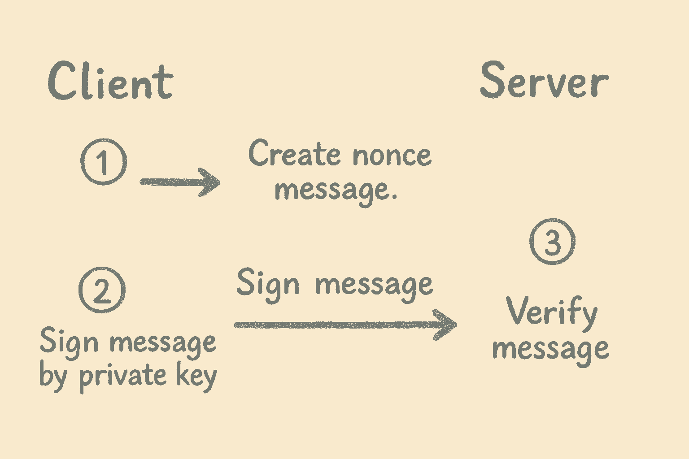

+++
date = '2025-05-11T20:40:00+07:00'
draft = false
title = 'Xác thực người dùng bằng ví crypto'
tags = ["blockchain", "nodeJs"]
+++

Hôm nay, trong một buổi đầu tuần sau chuyến đi du lịch giữa năm, tôi tranh thủ ôn lại kiến thức để chuẩn bị cho buổi phỏng vấn vị trí Backend Blockchain sắp tới. Nhân tiện, tôi viết lại bài này để ghi nhớ kỹ thuật xác thực người dùng không cần tài khoản và mật khẩu, mà sử dụng đăng nhập bằng ví Web3 (như Metamask, Coin98 Super Wallet, Trust Wallet,...). Cùng bắt đầu nhé! Quá trình này gồm **3 bước đơn giản**:


---

## 1. Lấy message từ server

Đầu tiên, client sẽ gửi request đến server để lấy `message` về. Đây là nội dung mà client sẽ ký bằng ví như Metamask để xác thực với dApp.  
Vì message cần được thống nhất giữa server và client, nên **server nên là bên tạo và quản lý message** này.

### Ví dụ message:

```
thanhhv.github.io wants you to sign in with your Ethereum account:
0xA1B2...D3E4

Sign-in request for MyDApp

URI: https://thanhhv.github.io
Version: 1
Chain ID: 1
Nonce: 839174
Issued At: 2025-05-11T20:40:00Z
```

Đây là định dạng theo **EIP-4361 (Sign-In With Ethereum)** được sử dụng phổ biến.  
`Nonce` là số ngẫu nhiên dùng một lần (có thể dùng UUID), kết hợp với timestamp để tránh **replay attack**.

> Server nên tạo `nonce`, lưu vào database với các field:  
> `nonce`, `wallet`, `expiresAt`, `used = false`, sau đó gắn vào message trả về cho client.

---

## 2. Client ký message bằng private key

Sau khi nhận được message, client sẽ **dùng private key để ký**.  
Ví dụ sử dụng thư viện `ethers`:

```js
const { ethers } = require("ethers");
const wallet = new ethers.Wallet(process.env.PRIVATE_KEY);
const signature = await wallet.signMessage(message);
```

Client sau đó gửi `{ message, signature }` về server.

---

## 3. Server xác thực chữ ký

Server sẽ:
- Tách `nonce` từ message ra.
- Truy vấn DB để kiểm tra:
  - Có tồn tại không?
  - Hết hạn chưa?
  - Đã được sử dụng chưa?

Sau đó, **dùng `ethers` để xác thực chữ ký**:

```js
const { ethers } = require("ethers");
const recoveredAddress = ethers.utils.verifyMessage(message, signature);

const isValid = recoveredAddress.toLowerCase() === addressFromRequest;
```

Nếu hợp lệ, server có thể cập nhật DB: `used = true`, và cho phép đăng nhập thành công.

---

## 4. Bonus: Kết hợp với JWT

Giả sử bạn đang xây dựng **trang quản trị admin**, sau khi bước 3 hoàn tất, server có thể tạo 1 **JWT token**. Những request tiếp theo sẽ dùng token này để xác thực — giống như mô hình web2 quen thuộc.

Tuy là đăng nhập bằng ví crypto, nhưng sau đó bạn có thể tương tác với hệ thống như người dùng thông thường, vừa an toàn, vừa tiện lợi.

---

Hết rồi! Hy vọng bài viết hữu ích cho bạn nào đang tìm hiểu về Web3 authentication. Chúc cho tôi sẽ may mắn vượt qua vòng phỏng vấn sắp tới nhé, hihi 😄

---