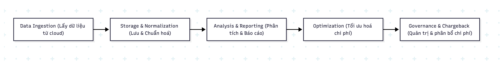
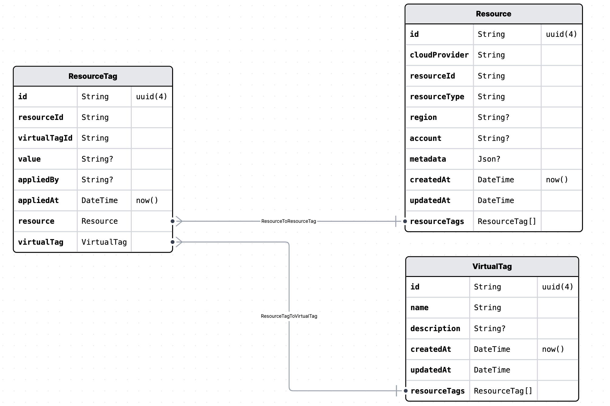
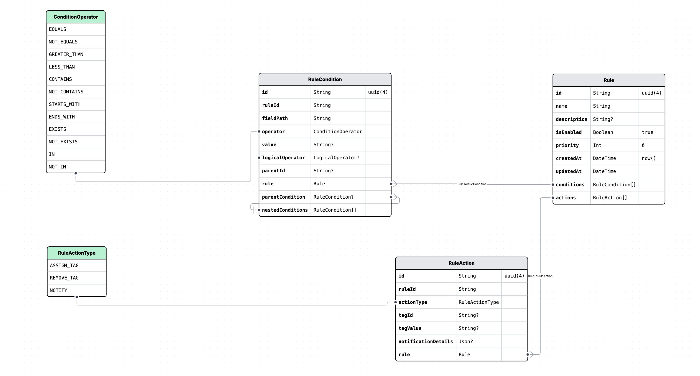

+++
title = "Designing a virtual tag module in FinOps"
date = "2025-08-17T10:00:00+07:00"
draft = false
tags = ["cloud", "virtual tag"]
+++

Khi làm việc với các hệ thống FinOps thì có 2 thứ quan trọng chúng ta cần phải quan tâm đó chính là **perspective**, thứ 2 là **showback và chargeback**. Trong bài viết này mình sẽ chia sẻ lại tại sao chúng quan trọng và làm sao để có thể dễ dàng quản lý chúng bằng module **virtual tag** trong các hệ thông FinOps.

Bắt đầu nào, dĩ nhiên là ngoài những cái này ra thì FinOps cũng có rất nhiều thứ quan trọng cần phải chú ý nhưng ở đây ta chỉ nói về những cái này thôi nhé.

---

## 1. Cách thức hoạt động cơ bản của 1 hệ thống FinOps

Một hệ thống FinOps về cơ bản sẽ gồm có các **job hoặc pipeline để lấy dữ liệu từ cloud về** (bao gồm: usage, billing, resource, metadata...) thường dùng do các API của cloud cung cấp.

Sau đó sẽ:
- **Chuẩn hoá và lưu trữ** nó vào CSDL (PostgreSQL, ClickHouse),
- **Phân tích – tối ưu chi phí – báo cáo** dựa trên dữ liệu đó.

---

## 2. Perspective là gì?

- *Perspective* dịch sang tiếng Việt là **góc nhìn**. Trong FinOps, nó là cách biểu diễn chi phí tài nguyên một cách trực quan, giúp quản trị viên nhìn ra:
  - Dòng tiền
  - Chi phí
  - Sự phân bổ tài nguyên

  Từ đó đưa ra các chiến lược tối ưu hoá.

- Perspective không phải là một resource cố định. Nó là **cách biểu diễn dữ liệu phân tích, lọc theo logic**. Ví dụ:

  > Dựa vào tag `env=production` trên AWS, bạn lọc tài nguyên có tag đó và thấy:
  > - Tháng này: EC2, S3 production tiêu $2000
  > - Tháng trước: chỉ $1000  
  > → Từ đây bạn biết cần phân tích gì tiếp theo để tối ưu chi phí.

---

## 3. Showback và Chargeback là gì?

Hãy tưởng tượng bạn đi ăn nhà hàng với team 5 người. Bạn gọi nhiều món, và hóa đơn như sau:

- Cá chiên: 200k  
- Cơm chiên: 200k  
- Thịt gà: 300k  
- Canh: 200k  
- Tráng miệng: 200k  
- Nước uống: 250k  
- **Tổng: 1.350k** (không biết tính nhẩm có đúng không nữa =)))

Bạn thanh toán trước, rồi chia tiền lại cho từng người trong team.

- ➤ Quá trình **nhà hàng đưa hoá đơn và bạn thanh toán** gọi là **Showback**
- ➤ Quá trình **bạn chia lại tiền cho từng người** gọi là **Chargeback**

---

### Trong môi trường Cloud thì sao?

Công ty bạn có nhiều team, dùng chung AWS cloud, mỗi team làm 1 dự án. Bạn là sếp, thấy bill tháng rồi là **$4000**.

- Công ty trả tiền → **Showback**
- Bạn muốn xem chi tiết từng team xài bao nhiêu → gửi báo cáo để họ tối ưu tháng sau → **Chargeback**

Lưu ý: Không bắt buộc mỗi team phải hoàn tiền, chỉ mang tính minh bạch và tối ưu hoá.

---

## 4. Virtual tag là gì? Tại sao nó lại cần thiết?

**Virtual Tag** trong FinOps là một cơ chế **gắn nhãn logic (logical/derived tagging)** cho dữ liệu chi phí cloud **mà không cần tag thật trên resource**.

Vì:
- Không phải resource nào cũng được gắn tag
- Cùng 1 chức năng nhưng mỗi cloud tag khác nhau (VD: AWS `prod`, GCP `production`) → khó gom nhóm khi tạo perspective

➡️ Virtual Tag là **nhãn "ảo" sinh ra từ dữ liệu**, giúp **phân bổ chi phí chính xác hơn**, không phụ thuộc hoàn toàn vào tag gốc.

---

### 🎯 Mục đích của Virtual Tag

- **Tăng Cost Visibility**: Gom nhóm tài nguyên theo team, project, env, service... kể cả khi không có tag thật
- **Khắc phục tagging sai/thiếu**: Cho phép gắn logic thay thế
- **Phân tích & báo cáo chi phí**: Tạo perspective linh hoạt cho BI dashboard, Looker,...

---

> **Tóm lại**:  
> `Virtual Tag` → tạo nên `Perspective` → phục vụ cho `Showback/Chargeback` của hệ thống

---

### 💡 Thiết kế cơ bản của hệ thống Virtual Tag

- Tạo bảng `virtualTag` để lưu thông tin tag
- Liên kết bảng `resource` thông qua bảng trung gian `resourceTag`
- Quan hệ **n-n** là hợp lý (1 resource có nhiều tag, 1 tag áp dụng cho nhiều resource)

→ Sau đó có thể dễ dàng đánh tag cho resource, tạo perspective và **query theo tag** trong bảng `virtualTag`.

---

## Bonus: Tự động đánh tag bằng rule engine

Khi đã có module virtual tag thì nên có thêm **module rule engine** – gọi là `tag-rule-engine`.

### 📌 Lý do:
- Dữ liệu FinOps lấy từ cloud cực lớn (hàng chục triệu record)
- Thủ công đánh tag là không khả thi

### 🛠 Ví dụ rule:
> Nếu 1 resource trong tháng vừa rồi xài > $200 → tự động gán virtual tag là `expensive`

Cron job sẽ check điều kiện, nếu đúng → gán tag. Sau này cần lọc resource expensive thì rất nhanh. Dưới đây là 1 thiết kế cơ bản nhất của 1 rule tag-engine. Nó bao gồm 1 cái condition để dữ liệu có thể được match và 1 action để trigger hành động khi match với condition đó. Viết blog nên làm đơn giản vậy thôi, thực tế nó cũng vậy à, chỉ là có râu ria thêm tí thui =))

> ✅ Lưu ý khi triển khai:
> - Lưu log các tag đã gán để tracking
> - Ghi lại tác nhân gán tag: `SYSTEM`, `USER`,...

---
Hết rồi nếu có góp ý gì moi người nhận xét vào bên dưới giúp mình nha. Thank you.