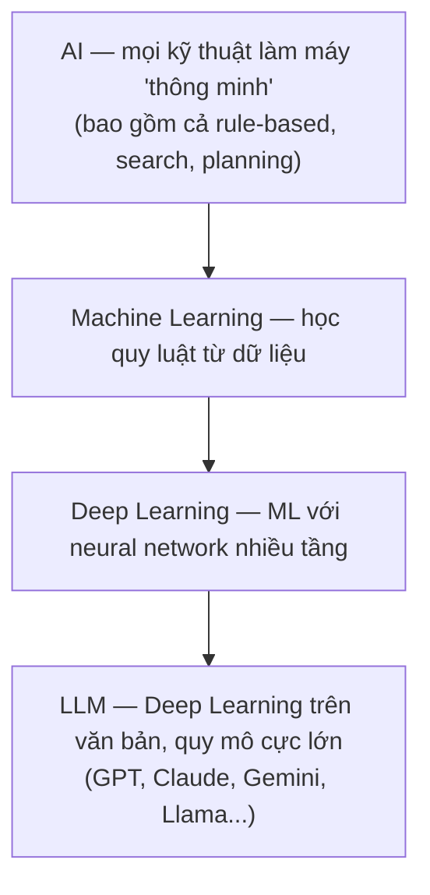
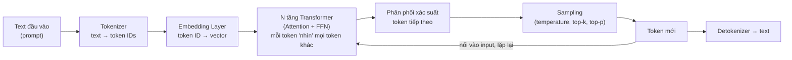
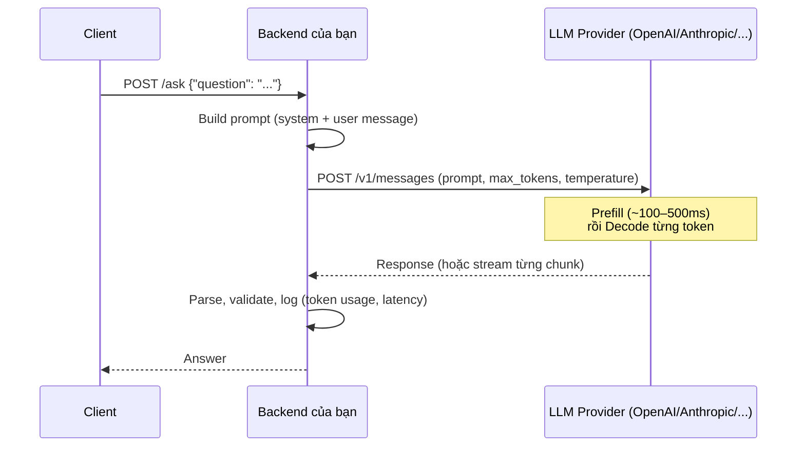

+++
title = "Chương 01 — AI Fundamentals cho Engineer"
date = "2026-07-18T07:10:00+07:00"
draft = false
tags = ["backend", "ai", "llm"]
series = ["AI cho Backend Engineer"]
+++

## 1. Problem Statement

Bạn là Backend Engineer. Sếp nói: "Tích hợp AI vào sản phẩm." Câu hỏi đầu tiên **không phải** là "dùng model nào", mà là: **bài toán này có cần AI không, và nếu cần thì cần loại nào?**

Nếu không phân biệt được AI / ML / Deep Learning / LLM, bạn sẽ:

- Dùng LLM (đắt, chậm, non-deterministic) cho bài toán mà một câu `SELECT` hoặc một cây `if/else` giải quyết tốt hơn.
- Đánh giá sai chi phí: một API call LLM đắt gấp 1.000–100.000 lần một query database.
- Thiết kế sai kiến trúc: coi LLM như một hàm thuần túy (pure function) trong khi nó là một service xác suất, có độ trễ tính bằng giây.

## 2. Tại sao chương này tồn tại

- **Business Problem**: doanh nghiệp muốn tự động hóa các tác vụ liên quan đến ngôn ngữ và tri thức phi cấu trúc (đọc hiểu tài liệu, trả lời khách hàng, viết nội dung) — thứ mà phần mềm truyền thống làm rất kém.
- **Engineering Problem**: engineer cần một mental model đúng để quyết định *khi nào* dùng công cụ nào, thay vì "mọi thứ đều là ChatGPT".
- **AI Problem**: các thuật ngữ AI/ML/DL/LLM bị dùng lẫn lộn trong marketing, dẫn đến kỳ vọng sai và thiết kế sai.

## 3. First Principles

### 3.1. Phần mềm truyền thống: logic tường minh

Phần mềm truyền thống là **rule được viết tay**:

```
Input → Rules (do người viết) → Output
```

Ví dụ — tính phí ship:

```go
func ShippingFee(weightKg float64, region string) int {
    if region == "HCM" && weightKg < 2 {
        return 15000
    }
    // ... hàng trăm rule khác
}
```

Điểm mạnh: **deterministic, rẻ, nhanh, kiểm thử được, giải thích được**. Cùng input luôn cho cùng output. Đây là tiêu chuẩn vàng — đừng bao giờ từ bỏ nó khi chưa cần.

Điểm yếu: rule phải **liệt kê được**. Hãy thử viết rule cho:

- "Email này có phải khách hàng đang giận không?"
- "Hai câu hỏi này có cùng ý nghĩa không?"
- "Tóm tắt hợp đồng 40 trang này."

Không gian input là ngôn ngữ tự nhiên — vô hạn biến thể, không liệt kê nổi. Đây là ranh giới của phần mềm truyền thống.

### 3.2. Machine Learning: rule được học từ dữ liệu

ML đảo ngược chiều:

```
Traditional: Input + Rules → Output
ML:          Input + Output (dữ liệu mẫu) → Rules (model)
```

Thay vì viết rule "email giận dữ chứa từ X, Y, Z", ta đưa 100.000 email đã gán nhãn (giận / không giận) cho thuật toán, nó **tự tìm quy luật thống kê** và nén quy luật đó vào một tập tham số — gọi là **model**.

Hệ quả kiến trúc quan trọng mà Backend Engineer phải nhớ:

| Đặc tính | Traditional | ML |
|---|---|---|
| Output | Deterministic | Xác suất (kèm confidence) |
| "Sửa bug" | Sửa code | Sửa dữ liệu / train lại |
| Test | Unit test pass/fail | Đo accuracy/precision/recall trên tập test |
| Suy giảm theo thời gian | Không | Có (data drift) — model tốt hôm nay có thể tệ sau 6 tháng |

### 3.3. Deep Learning: ML với neural network nhiều tầng

Deep Learning là **một nhánh của ML** dùng neural network nhiều tầng. Với engineer, điểm khác biệt thực dụng:

- ML cổ điển (logistic regression, gradient boosting): cần người thiết kế feature (feature engineering), chạy tốt trên CPU, dữ liệu dạng bảng.
- Deep Learning: **tự học feature** từ dữ liệu thô (text, ảnh, âm thanh), cần GPU, cần rất nhiều dữ liệu.

Bài học chọn công cụ: **dữ liệu dạng bảng (fraud detection, credit scoring, churn prediction) → gradient boosting (XGBoost/LightGBM) vẫn thường thắng Deep Learning**, rẻ hơn nhiều. Deep Learning thắng ở dữ liệu phi cấu trúc.

### 3.4. LLM: Deep Learning cho ngôn ngữ, ở quy mô cực lớn

LLM (Large Language Model) là model Deep Learning được train trên hàng nghìn tỷ token văn bản, với một nhiệm vụ duy nhất ở tầng gốc: **dự đoán token tiếp theo**.

```
Input:  "Thủ đô của Việt Nam là"
Output: phân phối xác suất trên toàn bộ từ vựng
        → "Hà" (0.92), "thành" (0.03), ...
```

Điều bất ngờ (và là lý do cả ngành thay đổi): khi model đủ lớn, việc "dự đoán token tiếp theo" tạo ra **năng lực tổng quát** — dịch, tóm tắt, viết code, suy luận — mà **không cần train riêng cho từng tác vụ**. Đây là khác biệt căn bản với ML truyền thống:

| | ML truyền thống | LLM |
|---|---|---|
| Mỗi tác vụ | Một model riêng, train riêng | Một model dùng chung, điều khiển bằng **prompt** |
| Chi phí thêm tác vụ mới | Thu thập data + train (tuần/tháng) | Viết prompt (giờ) |
| Ai làm được | ML Engineer | **Backend Engineer** |

Dòng cuối là lý do bộ tài liệu này tồn tại: **LLM biến bài toán AI từ bài toán train model thành bài toán tích hợp hệ thống** — đúng chuyên môn của Backend Engineer.

### 3.5. Quan hệ giữa các khái niệm



Lưu ý: "AI" rộng hơn ML — một hệ chess engine rule-based cũng là AI. Nhưng trong ngữ cảnh 2024+, khi ai đó nói "tích hợp AI", 95% họ đang nói về LLM.

## 4. Internal Architecture — Transformer ở mức hệ thống

Bạn không cần hiểu toán của Transformer. Bạn cần hiểu **data flow** của nó, vì data flow này quyết định độ trễ, chi phí và giới hạn của mọi hệ thống bạn xây.

### 4.1. Inference pipeline



Ba sự thật kiến trúc rút ra từ pipeline này:

**1. Sinh token là tuần tự (autoregressive).** Model sinh từng token một, token sau phụ thuộc token trước. Không thể song song hóa việc sinh 1 câu trả lời. Hệ quả: **độ trễ tỷ lệ thuận với độ dài output**. Câu trả lời 1.000 token mất ~10–30 giây. Đây là lý do **streaming response là bắt buộc** cho UX (Chương 08).

**2. Hai pha có chi phí khác nhau.**
- **Prefill**: xử lý toàn bộ prompt một lượt (song song được, nhanh, đo bằng time-to-first-token).
- **Decode**: sinh từng token (tuần tự, chậm, đo bằng tokens/second).

Vì vậy provider tính giá **input token rẻ hơn output token** (thường 3–5 lần). Prompt dài làm tăng chi phí và thời gian prefill; output dài làm tăng thời gian chờ tuyến tính.

**3. Attention có chi phí bậc hai theo độ dài context.** Mỗi token phải "nhìn" mọi token trước nó. Context 200K token không chỉ đắt tiền — nó còn chậm và làm model **giảm khả năng chú ý đến chi tiết ở giữa** ("lost in the middle"). Context Window lớn không phải là lý do để nhét mọi thứ vào (Chương 02).

### 4.2. LLM là gì dưới góc nhìn Backend?

Hãy quên "trí tuệ". Dưới góc nhìn hệ thống, một LLM API là:

```
Một HTTP service:
- Stateless           → không nhớ gì giữa 2 request; "trí nhớ" là do BẠN gửi lại lịch sử
- Non-deterministic   → cùng input có thể ra output khác (trừ khi temperature=0, và kể cả vậy)
- Độ trễ cao          → 500ms – 60s, biến động lớn
- Giá theo usage      → tính bằng token, input/output giá khác nhau
- Có rate limit       → RPM (requests/min) và TPM (tokens/min)
- Không có SLA đúng đắn → có thể trả lời sai với giọng điệu tự tin (hallucination)
```

Mỗi dòng trên sinh ra một chương trong tài liệu này: stateless → Session Management; non-deterministic → Evaluation & Guardrails; độ trễ → Streaming & Caching; giá token → Cost Optimization; rate limit → Retry & Fallback; hallucination → RAG & Grounding.

### 4.3. Sequence diagram: một request "hỏi AI" đơn giản nhất



Ngay cả ở dạng tối giản, backend đã có 4 trách nhiệm: build prompt, gọi provider với timeout/retry, validate output, và **log token usage** — bỏ qua điều cuối là nguồn gốc của hóa đơn bất ngờ (Chương 13, case "Token Cost tăng đột biến").

## 5. Trade-off

### Rule-based vs ML vs LLM — bảng quyết định

| Tiêu chí | Rule-based | ML cổ điển | LLM API |
|---|---|---|---|
| Chi phí/request | ~0 | ~0.0001$ | 0.001$ – 0.1$ |
| Latency | µs | ms | giây |
| Deterministic | ✅ | ⚠️ (ổn định) | ❌ |
| Giải thích được | ✅ | ⚠️ | ❌ |
| Xử lý ngôn ngữ tự do | ❌ | ⚠️ (task hẹp) | ✅ |
| Thời gian ship tính năng mới | Tuần (code rule) | Tháng (data+train) | Giờ (prompt) |
| Chi phí vận hành dài hạn | Thấp | Trung bình (retrain) | Cao (token + eval + guardrail) |

Nguyên tắc: **chọn công cụ yếu nhất còn giải quyết được bài toán**. Rule-based trước, ML nếu có dữ liệu và task hẹp, LLM khi input là ngôn ngữ tự do hoặc cần tính tổng quát.

### Quality vs Cost ngay từ tầng khái niệm

Cùng một task phân loại email: LLM lớn đạt 95% accuracy với 0.01$/email; model classifier nhỏ đạt 92% với 0.00001$/email. Ở 10 triệu email/tháng, chênh lệch là **100.000$ vs 100$**. Câu hỏi đúng không phải "cái nào thông minh hơn" mà là "3% accuracy có đáng 99.900$/tháng không?" — thường câu trả lời là dùng LLM để **gán nhãn dữ liệu**, rồi train classifier nhỏ (distillation pattern).

## 6. Production Considerations

Ở mức fundamentals, ghi nhớ các nguyên tắc sẽ được triển khai chi tiết ở Phần III–IV:

- **Timeout**: luôn đặt timeout cho call LLM (khuyến nghị: 2× p95 latency của use case; streaming thì timeout theo "im lặng giữa 2 chunk").
- **Retry**: chỉ retry lỗi tạm thời (429, 5xx, timeout), có exponential backoff + jitter; **không retry** lỗi 4xx do prompt.
- **Logging**: log mọi request/response kèm `model`, `input_tokens`, `output_tokens`, `latency_ms`, `finish_reason`. Đây là dữ liệu sống còn cho cost control và debug.
- **Treat output as untrusted input**: output của LLM đi vào hệ thống của bạn phải được validate như user input (Chương 12).

## 7. Anti-patterns

- **"AI hóa" mọi thứ**: dùng LLM để validate email format, parse date, tính toán số học — những việc regex/library làm đúng 100% với chi phí ~0.
- **Coi LLM như database**: hỏi LLM "doanh thu Q3 của công ty tôi là bao nhiêu" mà không cung cấp dữ liệu. Model chỉ có kiến thức đến thời điểm train và **sẽ bịa** khi không biết.
- **Coi demo là production**: demo chạy đúng 10/10 lần không nói lên gì. Production nghĩa là đúng ở percentile 99 trên 1 triệu input đa dạng, kèm giám sát khi nó sai.
- **Bỏ qua chi phí ở giai đoạn thiết kế**: chọn model lớn nhất "cho chắc", đến khi scale mới nhận ra chi phí token vượt doanh thu tính năng.

## 8. Best Practices

- Bắt đầu mọi thiết kế bằng câu hỏi: "Giải pháp **không dùng AI** trông như thế nào?" — nó là baseline và thường là fallback của bạn.
- Xây **evaluation trước khi xây tính năng** (Chương 11): nếu không đo được "đúng", bạn không thể cải thiện và không dám thay model.
- Thiết kế để **thay model dễ dàng** (abstraction layer / AI Gateway — Chương 08): thị trường model thay đổi theo quý, hệ thống khóa cứng vào một model là hệ thống nợ kỹ thuật.
- Bắt đầu bằng model nhỏ + prompt tốt, chỉ nâng model khi eval chứng minh cần thiết.

## 9. Khi nào KHÔNG nên dùng AI (LLM)

- **Bài toán yêu cầu đúng tuyệt đối**: tính tiền, phân quyền, giao dịch tài chính, validate pháp lý. LLM sai 0.5% vẫn là hàng nghìn lỗi/ngày ở scale.
- **Rule liệt kê được và ổn định**: phí ship, quy trình phê duyệt cố định — rule-based rẻ hơn, nhanh hơn, audit được.
- **Latency budget dưới 100ms**: search suggestion, fraud check trong luồng thanh toán — LLM không đáp ứng nổi (trừ khi async hoặc pre-compute).
- **Không có cách đánh giá đầu ra**: nếu không ai kiểm tra được LLM trả lời đúng hay sai, bạn đang ship rủi ro chứ không phải tính năng.
- **Chi phí không tương xứng**: tự động hóa tác vụ tốn 2 phút/người/ngày bằng pipeline LLM tốn 500$/tháng.

---

**Chương tiếp theo**: [02 — LLM Fundamentals](/series/ai-for-backend-engineers/02-llm-fundamentals/) — Token, Context Window, Embedding và các tham số sampling ảnh hưởng trực tiếp đến chất lượng và hóa đơn của bạn như thế nào.
