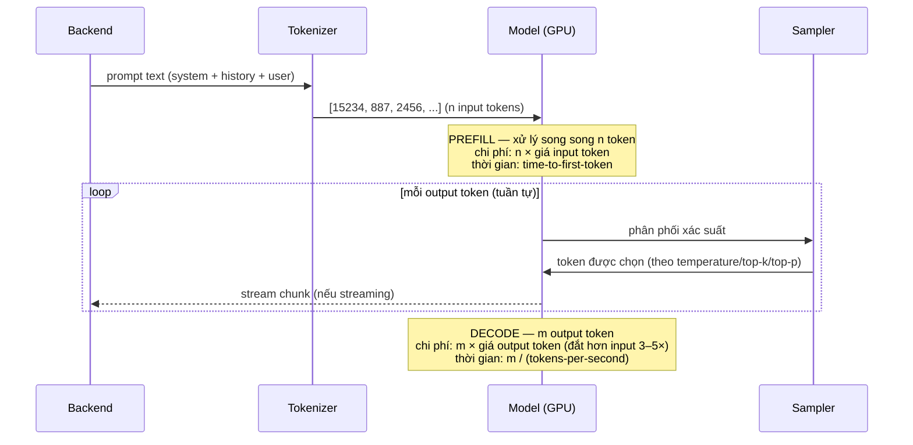

+++
title = "Chương 02 — LLM Fundamentals: Token, Context, Embedding, Sampling"
date = "2026-07-18T07:20:00+07:00"
draft = false
tags = ["backend", "ai", "llm"]
series = ["AI cho Backend Engineer"]
+++

## 1. Problem Statement

Team bạn tích hợp LLM. Sau 1 tháng: hóa đơn gấp 8 lần dự toán, một số hội thoại dài bị "quên" nội dung đầu, kết quả lúc hay lúc dở không rõ vì sao. Cả ba vấn đề đều xuất phát từ việc không hiểu 4 khái niệm: **Token, Context Window, Embedding, Sampling**. Chúng không phải lý thuyết — chúng là **đơn vị tính tiền, giới hạn bộ nhớ, cấu trúc dữ liệu, và núm điều chỉnh chất lượng** của hệ thống bạn vận hành.

## 2. Tại sao chúng tồn tại

- **Business Problem**: chi phí LLM tính theo token — không hiểu token thì không dự toán, không tối ưu được chi phí.
- **Engineering Problem**: Context Window là giới hạn cứng như RAM — vượt là lỗi hoặc mất dữ liệu; Embedding là nền của semantic search và RAG.
- **AI Problem**: model làm việc trên số, không phải chữ. Token và Embedding là cầu nối giữa text và tính toán.

## 3. First Principles

### 3.1. Token & Tokenization

Model không đọc ký tự, không đọc từ — nó đọc **token**: đơn vị văn bản con (subword) do thuật toán tokenization (BPE và biến thể) quyết định từ tần suất xuất hiện trong dữ liệu train.

```
"internationalization" → ["international", "ization"]     (2 token)
"Xin chào các bạn"     → ["Xin", " ch", "ào", " các", " b", "ạn"]  (~6 token)
```

Quy tắc thực dụng:

- Tiếng Anh: ~4 ký tự/token, ~0.75 từ/token.
- **Tiếng Việt: tốn nhiều token hơn tiếng Anh 1.5–2.5 lần** (tùy tokenizer), vì dấu và cấu trúc âm tiết ít xuất hiện trong dữ liệu train. Hệ quả trực tiếp: cùng một nội dung, ứng dụng tiếng Việt **đắt hơn và tốn context hơn**. Đây là con số phải đưa vào dự toán.
- JSON/code tốn token cho ký tự cú pháp (`{`, `"`, indent). Trả JSON đã minify tiết kiệm 10–20%.

Đếm token bằng thư viện (`tiktoken` cho OpenAI, API `count_tokens` của Anthropic) — **đừng ước lượng bằng độ dài chuỗi** khi tính tiền hoặc cắt context.

```typescript
import { encoding_for_model } from "tiktoken";
const enc = encoding_for_model("gpt-4o");
const nTokens = enc.encode(userInput).length; // dùng để enforce budget trước khi gọi API
```

### 3.2. Context Window

Context Window là **tổng số token model xử lý trong một lần gọi**: system prompt + lịch sử hội thoại + tài liệu đính kèm + câu hỏi + **cả output sinh ra**. Nó giống RAM: giới hạn cứng, hết là tràn.

```
┌──────────────── Context Window (ví dụ 128K) ────────────────┐
│ System prompt │ History │ RAG documents │ User msg │ Output │
└─────────────────────────────────────────────────────────────┘
```

Ba sự thật production:

1. **LLM stateless** — "trí nhớ" của chatbot là do backend gửi lại toàn bộ lịch sử mỗi request. Hội thoại càng dài, mỗi request càng đắt: chi phí hội thoại tăng **bậc hai** theo số lượt (lượt thứ N gửi lại N-1 lượt trước). Đây là lý do phải có chiến lược cắt/tóm tắt history (Chương 08).
2. **Context lớn ≠ chất lượng cao.** Hiện tượng "lost in the middle": model chú ý tốt phần đầu và cuối context, kém phần giữa. Nhét 150K token tài liệu để hỏi 1 câu thường **tệ hơn** RAG lấy đúng 2K token liên quan (Chương 05) — và đắt gấp ~75 lần.
3. Vượt context → lỗi 400 hoặc bị cắt lặng lẽ tùy provider. Backend phải **tự đếm và enforce** trước khi gọi.

### 3.3. Embedding

Embedding là vector số (768–3072 chiều) biểu diễn **ý nghĩa** của văn bản, sao cho văn bản cùng nghĩa nằm gần nhau trong không gian vector.

```
embed("Làm sao đổi mật khẩu?")   ≈ gần với
embed("Tôi quên password rồi")    (cosine similarity ~0.85)
                                  ≠ xa với
embed("Chính sách giao hàng")     (cosine similarity ~0.15)
```

Vì sao Backend Engineer phải quan tâm: embedding biến bài toán "hiểu ngữ nghĩa" (không giải được bằng SQL) thành bài toán "tìm vector gần nhất" (giải được bằng Vector Database — Chương 06). Đây là nền tảng của semantic search, RAG, deduplication, recommendation, phân cụm ticket.

Lưu ý quan trọng:

- Embedding model **tách biệt** với LLM sinh text — rẻ hơn ~100 lần, nhanh hơn nhiều.
- Vector từ 2 model khác nhau **không so sánh được với nhau**. Đổi embedding model = re-index toàn bộ dữ liệu (Chương 13, case "Embedding Drift").

### 3.4. Attention — mức trực quan

Attention là cơ chế cho phép mỗi token "nhìn" và đánh trọng số tất cả token khác trong context để hiểu ngữ cảnh. Câu "Con **ngân hàng** này lãi suất cao" và "**ngân hàng** cát ven sông" — cùng từ, attention giúp model gán nghĩa khác nhau nhờ từ xung quanh.

Điều engineer cần nhớ: (1) chi phí attention tăng theo bình phương độ dài context; (2) attention là lý do prompt **có cấu trúc rõ ràng** (đánh dấu phần, XML tags) hoạt động tốt hơn văn xuôi lộn xộn — model "tìm" thông tin dễ hơn.

### 3.5. Sampling: Temperature, Top-k, Top-p

Model output ra **phân phối xác suất** trên toàn bộ từ vựng cho token tiếp theo. Sampling quyết định chọn token nào từ phân phối đó:

| Tham số | Cơ chế | Tăng lên thì |
|---|---|---|
| `temperature` (0–2) | Làm phẳng/nhọn phân phối. 0 = luôn chọn token xác suất cao nhất | Đa dạng hơn, "sáng tạo" hơn, kém ổn định hơn |
| `top_k` | Chỉ giữ k token xác suất cao nhất rồi mới sample | k nhỏ = an toàn, k lớn = đa dạng |
| `top_p` (0–1) | Giữ tập token nhỏ nhất có tổng xác suất ≥ p (nucleus sampling) | p nhỏ = an toàn, p lớn = đa dạng |

Khuyến nghị production:

- **Task cần chính xác/ổn định** (extraction, classification, function calling, sinh JSON): `temperature = 0`. Lưu ý: temperature 0 **giảm mạnh** nhưng không đảm bảo 100% deterministic (do tính toán song song trên GPU).
- **Task sáng tạo** (viết nội dung, brainstorm): `temperature 0.7–1.0`.
- Chỉnh **một** trong temperature/top_p, đừng chỉnh cả hai — khó debug.
- Ghi tham số sampling vào log cùng prompt version: "kết quả lúc hay lúc dở" thường do ai đó đổi temperature mà không ai biết.

## 4. Internal Architecture — dòng chảy token và tiền



Công thức chi phí và độ trễ mà mọi thiết kế phải tính:

```
cost    = input_tokens × input_price + output_tokens × output_price
latency ≈ TTFT(phụ thuộc input_tokens) + output_tokens / TPS
```

Ví dụ cụ thể (giá minh họa: input 3$/1M token, output 15$/1M token):

| Kịch bản | Input | Output | Chi phí/req | Chi phí 1M req/tháng |
|---|---|---|---|---|
| Prompt gọn, output ngắn | 500 | 200 | ~0.0045$ | 4.500$ |
| System prompt phình to + history không cắt | 8.000 | 200 | ~0.027$ | 27.000$ |
| Thêm output dài dòng | 8.000 | 1.500 | ~0.0465$ | 46.500$ |

Cùng một tính năng, chênh lệch 10 lần chi phí — chỉ do quản lý token. Đây là "core metric" của AI Backend.

## 5. Trade-off

- **Context Size vs Cost**: gửi nhiều context tăng khả năng model có đủ thông tin, nhưng chi phí tăng tuyến tính và chất lượng có thể giảm (lost in the middle). Điểm cân bằng thực nghiệm: chỉ gửi context **liên quan** (được retrieval chọn lọc), không gửi context **có thể liên quan**.
- **Latency vs Quality**: model lớn chất lượng cao hơn nhưng TTFT và TPS tệ hơn. Nhiều bài toán production chọn model nhỏ + prompt tốt + retry khi fail thay vì model lớn mặc định.
- **Determinism vs Diversity**: temperature 0 cho pipeline ổn định, dễ test; nhưng với tính năng người dùng đọc trực tiếp (chatbot), temperature 0 tạo cảm giác máy móc và lặp từ.
- **Embedding dimension**: vector lớn (3072d) recall tốt hơn chút ít nhưng tốn RAM/disk gấp đôi vector 1536d và chậm hơn khi search hàng chục triệu vector. Đa số use case: model embedding nhỏ là đủ, hãy đo trước khi trả thêm tiền.

## 6. Production Considerations

- **Token budget enforcement**: đặt `max_tokens` cho output mọi request; đếm input token trước khi gọi; từ chối hoặc cắt gọn thay vì để lỗi 400 nổ ở runtime.
- **Log 4 số mỗi request**: `input_tokens`, `output_tokens`, `ttft_ms`, `total_ms`. Dashboard cost theo tenant/feature dựng từ đây (Chương 11).
- **Cắt history có chiến lược**: giữ system prompt + N lượt gần nhất + tóm tắt phần cũ (Chương 08), đừng để hội thoại dài tự nhiên ăn hết context.
- **Chuẩn hóa input trước khi embed**: lowercase/trim/bỏ boilerplate — rác vào embedding là rác vào search.
- **Pin model version**: `gpt-4o-2024-08-06` thay vì `gpt-4o` — alias bị trỏ sang version mới có thể thay đổi hành vi hệ thống mà bạn không hề deploy gì.

## 7. Anti-patterns

- Ước lượng token bằng `len(text)/4` cho tiếng Việt → sai 2 lần, dự toán sai 2 lần.
- Nhét toàn bộ tài liệu vào context "cho chắc" thay vì retrieval → đắt hơn và thường kém hơn.
- Không đặt `max_tokens` → một prompt lỗi khiến model sinh 4.000 token rác, nhân với retry, nhân với traffic.
- Temperature cao cho task extraction/JSON → lỗi parse ngẫu nhiên, khó tái hiện.
- Đổi embedding model nhưng chỉ re-embed dữ liệu mới → query vector và document vector thuộc 2 không gian khác nhau, search âm thầm tệ đi (Chương 13).

## 8. Best Practices

- Xây một module `tokenBudget` dùng chung: đếm, cắt, phân bổ token cho từng phần của prompt (system/history/context/output) theo tỷ lệ định trước.
- Chuẩn hóa cấu hình sampling theo **loại task** (bảng cấu hình tập trung), không để mỗi dev tự chọn temperature rải rác trong code.
- Đo cost/request theo feature ngay từ ngày đầu — chi phí LLM là chi phí biến đổi (variable cost), khác hoàn toàn chi phí server cố định mà backend quen thuộc.
- Với tiếng Việt: benchmark tokenizer của các provider trên dữ liệu thật của bạn trước khi chọn — chênh lệch token count giữa các provider có thể 30–50%.

## 9. Khi nào KHÔNG cần quan tâm sâu

Nếu bạn chỉ gọi LLM vài trăm request/ngày cho internal tool, tối ưu token là premature optimization — cứ dùng mặc định, đặt `max_tokens` hợp lý là đủ. Các kỹ thuật trong chương này trở nên quan trọng khi: chi phí LLM > vài trăm $/tháng, hội thoại nhiều lượt, có RAG, hoặc latency là yêu cầu sản phẩm.

---

**Chương tiếp theo**: [03 — Prompt Engineering & Structured Output](/series/ai-for-backend-engineers/03-prompt-engineering/) — biến LLM từ "hộp chat" thành một component có giao diện vào/ra ổn định.
