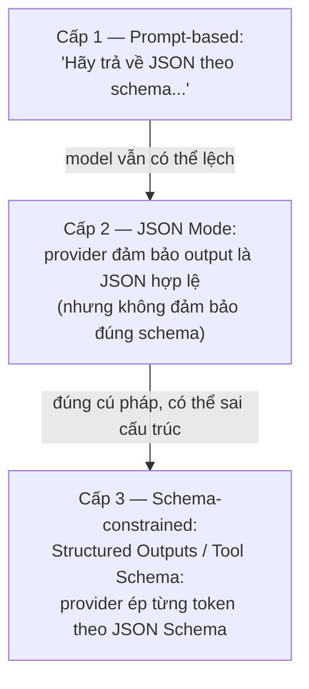
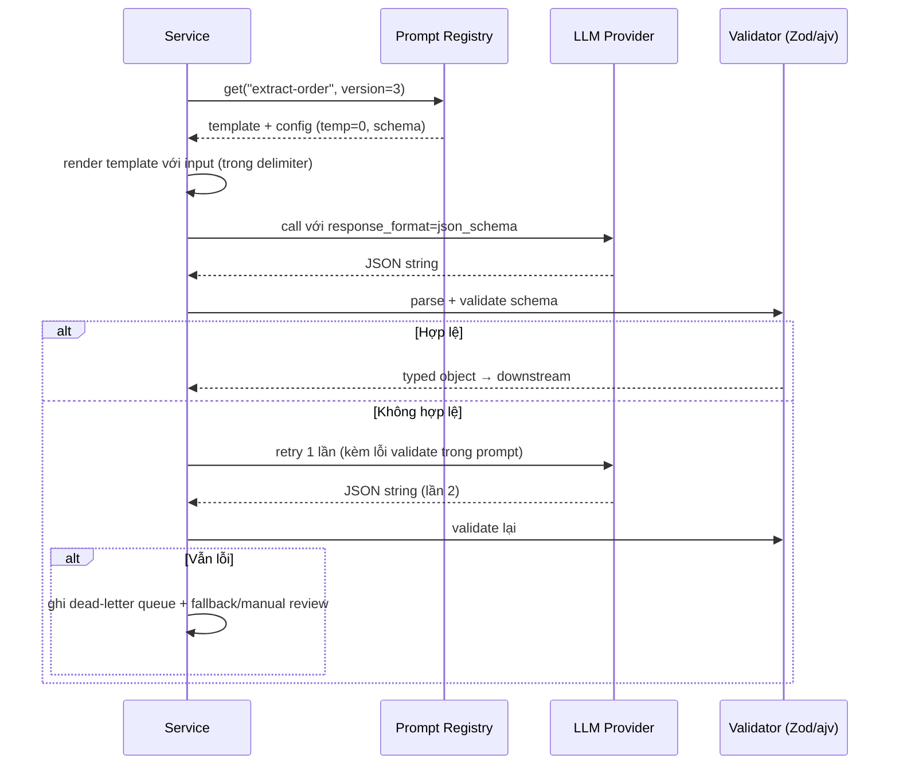

+++
title = "Chương 03 — Prompt Engineering & Structured Output"
date = "2026-07-18T07:30:00+07:00"
draft = false
tags = ["backend", "ai", "llm"]
series = ["AI cho Backend Engineer"]
+++

## 1. Problem Statement

Backend cần LLM trích xuất thông tin đơn hàng từ email khách. Dev viết: `"Trích xuất thông tin từ email sau: ..."`. Kết quả: lúc trả JSON, lúc trả văn xuôi, lúc thêm lời chào "Chắc chắn rồi! Đây là thông tin...", lúc bịa field không tồn tại. Code parse downstream vỡ liên tục.

Prompt Engineering giải quyết bài toán: **biến một model xác suất thành component có hành vi đủ ổn định để lập trình được**. Structured Output giải quyết nửa còn lại: **đầu ra phải là dữ liệu có schema, không phải văn bản tự do**.

## 2. Tại sao nó tồn tại

- **Business Problem**: cùng một model, prompt tốt và prompt tệ tạo ra chênh lệch chất lượng lớn hơn chênh lệch giữa 2 thế hệ model — prompt là đòn bẩy rẻ nhất.
- **Engineering Problem**: hệ thống downstream cần contract (schema, type) — văn bản tự do không tích hợp được vào pipeline.
- **AI Problem**: LLM được train để "tiếp nối văn bản một cách hợp lý" — nó cần được **định hướng** để hiểu vai trò, ràng buộc và định dạng mong muốn.

## 3. First Principles

Prompt không phải "câu thần chú". Prompt là **cấu hình runtime của model** — nó thiết lập: vai trò (role), ngữ cảnh (context), nhiệm vụ (task), ràng buộc (constraints), định dạng đầu ra (format), và ví dụ (examples). Model tiếp nối văn bản; prompt tạo ra một "văn bản mồi" sao cho phần tiếp nối hợp lý nhất chính là kết quả bạn muốn.

### 3.1. Cấu trúc prompt chuẩn

```
[SYSTEM PROMPT]
1. Role        — "Bạn là hệ thống trích xuất dữ liệu đơn hàng."
2. Context     — Bối cảnh nghiệp vụ, dữ liệu tham chiếu
3. Task        — Nhiệm vụ cụ thể, từng bước nếu cần
4. Constraints — Điều được/không được làm, xử lý edge case
5. Format      — Schema đầu ra, ví dụ minh họa
[USER MESSAGE]
6. Input thực tế (đặt trong delimiter rõ ràng)
```

Nguyên tắc nền tảng:

- **Rõ ràng thắng khéo léo**: viết cho model như viết spec cho một junior engineer mới vào — cụ thể, không giả định ngầm.
- **Delimiter tách data khỏi instruction**: bọc input người dùng trong `<input>...</input>` hoặc `"""..."""`. Đây vừa là kỹ thuật chất lượng vừa là lớp phòng thủ prompt injection đầu tiên (Chương 12).
- **Nói điều cần làm thay vì điều cấm**: "Chỉ trả lời dựa trên tài liệu được cung cấp" tốt hơn "Đừng bịa".
- **Xử lý trường hợp thiếu thông tin một cách tường minh**: "Nếu không tìm thấy, trả về `null`" — nếu không dặn, model sẽ đoán.

### 3.2. Few-shot: dạy bằng ví dụ

Đưa 2–5 cặp input/output mẫu vào prompt. Few-shot hiệu quả đặc biệt khi: format phức tạp, task có quy ước riêng của domain, hoặc cần model bắt chước giọng điệu. Trade-off: mỗi ví dụ tốn token **trên mọi request** — 5 ví dụ × 200 token × 1M request/tháng = 1 tỷ token chỉ để "dạy lại từ đầu" mỗi lần. Chọn ví dụ đắt giá nhất (bao phủ edge case) chứ không phải nhiều nhất; dùng prompt caching nếu provider hỗ trợ (Chương 08).

### 3.3. Chain of Thought (CoT) — mức khái niệm

Yêu cầu model "suy nghĩ từng bước trước khi trả lời" cải thiện đáng kể các task suy luận nhiều bước (phân tích, so sánh, toán logic). Bản chất: model sinh token tuần tự — cho nó "không gian" sinh các bước trung gian nghĩa là cho nó thêm tính toán trước khi chốt đáp án.

Trade-off production: CoT tăng output token (chi phí + latency) đáng kể. Với model thế hệ mới có "extended thinking/reasoning" tích hợp, CoT thủ công trong prompt ít cần thiết hơn — nhưng nguyên lý "cho model suy luận trước, kết luận sau" vẫn đúng. Mẹo tích hợp: yêu cầu model xuất phần suy luận vào field riêng (`"reasoning": "..."`) rồi backend **bỏ field đó đi**, chỉ dùng kết quả — được chất lượng của CoT mà downstream vẫn sạch.

### 3.4. Prompt Template — prompt là code

Prompt production không phải chuỗi nối tay trong controller. Nó là **template có version, có biến, có test**:

```typescript
// prompts/extract-order/v3.ts
export const extractOrderPrompt = {
  id: "extract-order",
  version: 3,
  model: "claude-sonnet-4-5",
  temperature: 0,
  maxTokens: 1024,
  system: `Bạn là hệ thống trích xuất dữ liệu đơn hàng từ email tiếng Việt.
Chỉ sử dụng thông tin có trong email. Field không tìm thấy → null.
Trả về JSON đúng schema, không thêm bất kỳ văn bản nào khác.`,
  buildUser: (email: string) => `<email>\n${email}\n</email>`,
};
```

Version hóa prompt là điều kiện tiên quyết cho A/B testing và rollback (Chương 11).

## 4. Internal Architecture — Structured Output

### 4.1. Ba cấp độ ép format, từ yếu đến mạnh



- **Cấp 1** phù hợp prototype. **Cấp 3** (OpenAI Structured Outputs, hoặc dùng tool/function schema của Anthropic như một cơ chế ép schema) là chuẩn production: constraint được áp ở tầng sampling — model **không thể** sinh token vi phạm schema.
- Dù ở cấp nào, backend **vẫn phải validate** bằng schema validator (Zod/ajv/go-playground) — vì schema đúng không có nghĩa giá trị đúng (model có thể trả `"total": 0` cho email không có giá).

### 4.2. Request flow production



Pattern "retry kèm error feedback" (gửi lại lỗi validate cho model tự sửa) giải quyết phần lớn lỗi lần 1 — nhưng phải giới hạn 1–2 lần, có circuit breaker, vì retry là nhân chi phí.

### 4.3. Ví dụ hoàn chỉnh (Node.js/TypeScript)

```typescript
import Anthropic from "@anthropic-ai/sdk";
import { z } from "zod";

const OrderSchema = z.object({
  customer_name: z.string().nullable(),
  items: z.array(z.object({ name: z.string(), quantity: z.number() })),
  total_vnd: z.number().nullable(),
  urgency: z.enum(["low", "normal", "high"]),
});
type Order = z.infer<typeof OrderSchema>;

const client = new Anthropic({ timeout: 30_000 });

export async function extractOrder(email: string): Promise<Order> {
  const resp = await client.messages.create({
    model: "claude-sonnet-4-5",
    max_tokens: 1024,
    temperature: 0,
    system: extractOrderPrompt.system,
    // Dùng tool schema như cơ chế ép structured output
    tools: [{
      name: "save_order",
      description: "Lưu thông tin đơn hàng đã trích xuất",
      input_schema: {
        type: "object",
        properties: {
          customer_name: { type: ["string", "null"] },
          items: { type: "array", items: { type: "object",
            properties: { name: { type: "string" }, quantity: { type: "number" } },
            required: ["name", "quantity"] } },
          total_vnd: { type: ["number", "null"] },
          urgency: { enum: ["low", "normal", "high"] },
        },
        required: ["customer_name", "items", "total_vnd", "urgency"],
      },
    }],
    tool_choice: { type: "tool", name: "save_order" }, // ép model luôn dùng tool
    messages: [{ role: "user", content: `<email>\n${email}\n</email>` }],
  });

  const toolUse = resp.content.find(b => b.type === "tool_use");
  if (!toolUse) throw new Error("no structured output");
  return OrderSchema.parse(toolUse.input); // validate lần cuối — luôn luôn
}
```

## 5. Trade-off

- **Fine-tuning vs Prompt Engineering**: fine-tuning dạy model *hành vi/giọng điệu/format* qua dữ liệu train; prompt dạy qua chỉ dẫn mỗi request. Prompt: ship trong giờ, đổi trong phút, không cần data pipeline. Fine-tuning: tốn dataset + chi phí train + vận hành model riêng, và **đóng băng** hành vi. Quy tắc: vắt kiệt prompt engineering (kèm few-shot, kèm RAG) trước; chỉ fine-tune khi (a) cần format/giọng điệu rất đặc thù ở volume lớn, (b) muốn model nhỏ bắt chước model lớn để giảm chi phí.
- **Prompt dài (nhiều chỉ dẫn, nhiều ví dụ) vs chi phí**: mỗi chỉ dẫn thêm vào system prompt là chi phí trên mọi request mãi mãi. Đo lường: nếu bỏ một đoạn mà eval không giảm — bỏ hẳn.
- **Ép schema chặt vs độ linh hoạt**: schema càng chặt càng dễ tích hợp, nhưng field `enum` quá hẹp khiến model nhét sai giá trị gần nhất thay vì báo không xác định. Luôn có lối thoát: giá trị `"other"`, field `null`, hoặc field `confidence`.

## 6. Production Considerations

- **Prompt là artifact deploy được**: lưu trong repo hoặc prompt registry, có version, có changelog, có eval chạy trước khi release (Chương 11). Đổi 1 câu trong system prompt có thể đổi hành vi toàn hệ thống — đối xử như đổi code.
- **Log cặp (prompt_version, input_hash, output)**: không log được thì không debug được "vì sao hôm qua đúng hôm nay sai".
- **Timeout + retry có phân loại**: lỗi schema → retry kèm feedback (tối đa 2); lỗi 429/5xx → backoff; lỗi content filter → không retry, ghi nhận.
- **Cache**: task extraction với input trùng lặp (email template, tài liệu chuẩn) → cache theo hash(input + prompt_version) tiết kiệm đáng kể.
- **Security**: input người dùng luôn nằm trong delimiter, không bao giờ nối thẳng vào system prompt (Chương 12).

## 7. Anti-patterns

- **Prompt khổng lồ chữa mọi bệnh**: mỗi lần gặp lỗi lại đắp thêm một câu "đừng làm X" → system prompt 3.000 token mâu thuẫn nội tại, không ai dám sửa. Chữa đúng: eval + tách task nhỏ.
- **Nối chuỗi tay trong business logic**: prompt rải rác khắp codebase, không version, sửa một chỗ quên chỗ khác.
- **Tin JSON mode là đủ**: JSON hợp lệ ≠ schema đúng ≠ giá trị đúng. Ba tầng kiểm tra khác nhau.
- **Parse output bằng regex/string split**: vỡ ngay khi model đổi cách diễn đạt. Dùng structured output + validator.
- **Một prompt làm 5 việc**: trích xuất + phân loại + tóm tắt + dịch + đánh giá trong một call → chất lượng từng việc đều giảm, không đo được việc nào hỏng. Tách pipeline.

## 8. Best Practices

- Chuẩn hóa "Prompt Definition" trong codebase: id, version, model, sampling config, schema đầu ra, template — một object duy nhất, một nơi duy nhất.
- Mỗi prompt có **bộ test case** (input mẫu → output kỳ vọng hoặc tiêu chí chấm) chạy trong CI như unit test.
- Task quan trọng: thêm field `confidence` hoặc `"insufficient_information": true` để backend route các case model không chắc sang người xử lý.
- Viết prompt bằng ngôn ngữ có nhiều dữ liệu train nhất cho *chỉ dẫn* (tiếng Anh thường ổn định hơn), giữ *dữ liệu và output* bằng tiếng Việt — pattern phổ biến cho ứng dụng Việt: system prompt tiếng Anh, yêu cầu "respond in Vietnamese".
- Định kỳ chạy lại eval khi provider cập nhật model — prompt tối ưu cho model cũ có thể kém trên model mới.

## 9. Khi nào KHÔNG nên dùng

- Input có cấu trúc sẵn (form, JSON, CSV chuẩn) → parser thường, đúng 100%, chi phí 0.
- Phân loại với tập nhãn nhỏ, dữ liệu huấn luyện dồi dào, volume cực lớn → classifier nhỏ tự host rẻ hơn LLM hàng trăm lần.
- Yêu cầu extraction đúng 100% cho nghiệp vụ tài chính/pháp lý → LLM chỉ được làm bước gợi ý, con người duyệt; hoặc không dùng.
- Template hóa văn bản với biến cố định ("Chào {name}, đơn {id} đã giao") → string template, không cần model.

---

**Chương tiếp theo**: [04 — Function Calling, Tool Calling & MCP](/series/ai-for-backend-engineers/04-function-calling-mcp/) — cho LLM khả năng *hành động* lên hệ thống thay vì chỉ *nói*.
