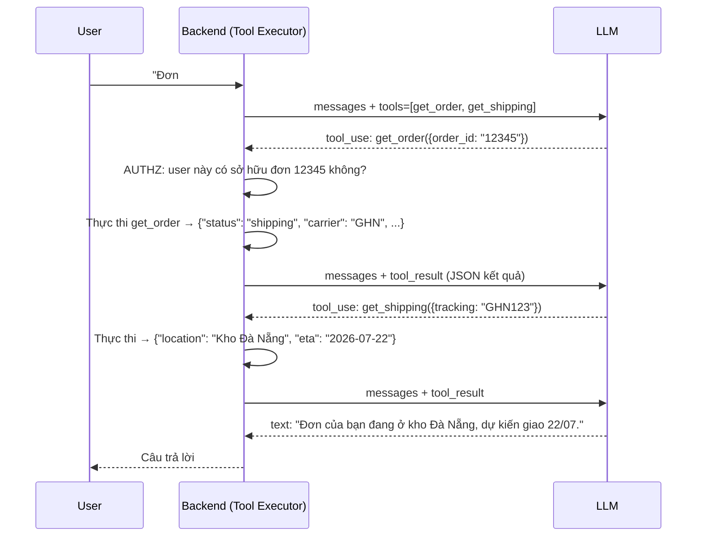
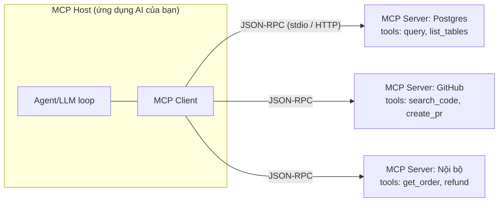

+++
title = "Chương 04 — Function Calling, Tool Calling & MCP"
date = "2026-07-18T07:40:00+07:00"
draft = false
tags = ["backend", "ai", "llm"]
series = ["AI cho Backend Engineer"]
+++

## 1. Problem Statement

Chatbot của bạn trả lời rất hay câu "chính sách đổi trả là gì" nhưng bó tay với "đơn hàng #12345 của tôi đang ở đâu?" — vì thông tin đó nằm trong database của bạn, không nằm trong model. LLM chỉ biết những gì có trong dữ liệu train (đã cũ) và trong prompt (giới hạn).

Function Calling (Tool Calling) giải quyết bài toán: **cho LLM khả năng yêu cầu hệ thống thực thi hành động** — query database, gọi API, gửi email — theo cách có cấu trúc, kiểm soát được. MCP (Model Context Protocol) giải quyết bài toán tiếp theo: **chuẩn hóa cách các tool được khai báo và kết nối**, để không phải viết lại tích hợp cho mỗi cặp (ứng dụng × nguồn dữ liệu).

## 2. Tại sao nó tồn tại

- **Business Problem**: giá trị thật của AI trong doanh nghiệp nằm ở việc kết nối với dữ liệu và hệ thống nội bộ — model "biết mọi thứ trừ công ty của bạn" thì vô dụng.
- **Engineering Problem**: trước function calling, dev phải parse văn bản tự do của model để đoán ý định ("hình như nó muốn tra đơn hàng?") — mong manh và nguy hiểm.
- **AI Problem**: model không có tay chân — nó chỉ sinh text. Cần một giao thức để text đó trở thành **lệnh gọi hàm có schema**.

## 3. First Principles

Sự thật quan trọng nhất, cần khắc sâu: **LLM không bao giờ thực thi hàm. LLM chỉ sinh ra một JSON nói rằng nó muốn gọi hàm. Backend của bạn thực thi.**

```
1. Backend khai báo tool (tên + mô tả + JSON Schema tham số) trong request
2. Model đọc câu hỏi, quyết định: trả lời thẳng, hay yêu cầu gọi tool
3. Nếu gọi tool: model trả về {"name": "get_order", "input": {"order_id": "12345"}}
4. BACKEND thực thi hàm thật (với đầy đủ authz, validation)
5. Backend gửi kết quả hàm vào lượt tiếp theo của hội thoại
6. Model đọc kết quả, sinh câu trả lời cuối (hoặc gọi tool tiếp)
```

Điều này có 2 hệ quả kiến trúc lớn:

1. **Quyền lực nằm ở backend** — model "xin", backend "cho". Mọi kiểm soát an ninh (authz theo user, whitelist tool, confirm hành động nguy hiểm) đặt ở bước 4, không đặt niềm tin vào model.
2. **Đây là một vòng lặp (agentic loop)** — một câu hỏi có thể cần nhiều lượt tool call. Backend phải quản lý vòng lặp: giới hạn số bước, timeout tổng, xử lý tool lỗi.

## 4. Internal Architecture

### 4.1. Sequence diagram — tool calling loop



Lưu ý chi phí: mỗi vòng lặp là **một lần gọi LLM đầy đủ**, gửi lại toàn bộ hội thoại + tool result. Câu hỏi cần 3 tool call = 4 lần trả tiền cho context ngày càng dài.

### 4.2. Tool Executor — thành phần backend phải xây

```go
// Go — tool executor với authz, timeout, và giới hạn vòng lặp
type ToolExecutor struct {
    registry map[string]Tool // tên tool → handler + schema
}

type Tool struct {
    Handler     func(ctx context.Context, user User, input json.RawMessage) (any, error)
    Dangerous   bool          // cần user confirm trước khi chạy?
    Timeout     time.Duration
}

func (e *ToolExecutor) RunLoop(ctx context.Context, user User, msgs []Message) (string, error) {
    const maxSteps = 8 // chặn vòng lặp vô hạn — bắt buộc
    for step := 0; step < maxSteps; step++ {
        resp, err := callLLM(ctx, msgs, e.toolSchemas())
        if err != nil {
            return "", err
        }
        if resp.StopReason != "tool_use" {
            return resp.Text, nil // model trả lời xong
        }
        for _, tc := range resp.ToolCalls {
            tool, ok := e.registry[tc.Name]
            if !ok { // model bịa tên tool — có xảy ra thật
                msgs = appendToolError(msgs, tc.ID, "unknown tool")
                continue
            }
            tctx, cancel := context.WithTimeout(ctx, tool.Timeout)
            result, err := tool.Handler(tctx, user, tc.Input) // authz bên trong handler
            cancel()
            if err != nil {
                // Trả lỗi VỀ CHO MODEL — nó thường tự sửa (đổi tham số, đổi tool)
                msgs = appendToolError(msgs, tc.ID, sanitizeErr(err))
            } else {
                msgs = appendToolResult(msgs, tc.ID, result)
            }
        }
    }
    return "", ErrMaxStepsExceeded
}
```

Các quyết định thiết kế trong đoạn code trên đều là bài học production: giới hạn `maxSteps`, timeout từng tool, xử lý model bịa tên tool, và **trả lỗi về cho model thay vì fail cả request** (model tự sửa tham số tốt đến bất ngờ).

### 4.3. MCP — Model Context Protocol

Vấn đề trước MCP: M ứng dụng AI × N nguồn dữ liệu (GitHub, Postgres, Slack, Jira...) = M×N tích hợp viết tay, mỗi cái một kiểu khai báo tool.

MCP (Anthropic mở nguồn, 2024, nay là chuẩn mở được các provider lớn hỗ trợ) chuẩn hóa thành M+N: mỗi nguồn dữ liệu viết **một MCP server**, mỗi ứng dụng AI viết **một MCP client** — mọi cặp tự tương thích.



MCP server expose 3 loại năng lực: **tools** (hàm gọi được), **resources** (dữ liệu đọc được), **prompts** (template dùng lại). Ứng dụng khởi động → hỏi server "có tool gì?" (`tools/list`) → đưa danh sách vào LLM → khi model muốn gọi → client gửi `tools/call` sang server.

Góc nhìn backend: **MCP server chỉ là một service RPC có discovery**. Kỹ năng xây REST API của bạn chuyển thẳng sang: cũng là input validation, authz, rate limit, versioning. Khác biệt duy nhất: "client" của bạn là một LLM — nên **mô tả tool và thông báo lỗi phải viết cho model đọc hiểu được** (rõ ràng, có gợi ý cách sửa).

## 5. Trade-off

- **Nhiều tool vs chất lượng chọn tool**: đưa 50 tool vào context → model chọn sai nhiều hơn, tốn token khai báo schema mỗi request. Ngưỡng thực nghiệm: dưới ~15–20 tool/lượt. Nhiều hơn → chia nhóm theo ngữ cảnh, hoặc 2 tầng (router chọn nhóm → nhóm chọn tool).
- **Tool "to" vs tool "nhỏ"**: tool to (`handle_order(action, ...)`) ít schema nhưng model dễ dùng sai; tool nhỏ (`get_order`, `cancel_order`, `refund_order`) rõ ràng, authz theo từng hành động dễ hơn. Ưu tiên tool nhỏ, đặt tên như đặt tên endpoint.
- **Tự do vs kiểm soát**: cho model tự quyết chuỗi tool call thì linh hoạt nhưng khó dự đoán chi phí/latency; ép luồng cố định (workflow) thì ổn định nhưng cứng. Chương 07 phân tích sâu (Workflow vs Agent).
- **MCP vs tích hợp trực tiếp**: MCP thêm một lớp gián tiếp (process/service riêng, JSON-RPC). Nếu bạn chỉ có 3 tool nội bộ dùng cho 1 ứng dụng — khai báo tool trực tiếp đơn giản hơn. MCP đáng giá khi tool cần **dùng lại** bởi nhiều ứng dụng/nhiều team, hoặc muốn dùng hệ sinh thái MCP server có sẵn.

## 6. Production Considerations

- **Authorization là của backend, không phải của model**: tool handler phải kiểm tra quyền theo user đang đăng nhập (không phải theo "model nói gì"). Sai lầm chết người: tool `query_database(sql)` chạy với quyền admin — prompt injection biến nó thành cửa hậu (Chương 12).
- **Hành động nguy hiểm cần confirm**: refund, xóa, gửi email ra ngoài → đánh dấu `dangerous`, trả về client yêu cầu người dùng xác nhận trước khi thực thi (human-in-the-loop).
- **Idempotency**: model có thể gọi trùng tool khi retry — tool ghi (create/refund) phải có idempotency key như mọi API thanh toán.
- **Timeout ba tầng**: từng tool < tổng loop < request của client; loop 8 bước × tool 10s có thể = 80s + LLM latency.
- **Observability**: trace mỗi bước loop (tool nào, input gì, bao lâu, lỗi gì) — sự cố "agent chạy mãi không xong" chỉ debug được bằng trace (Chương 11).
- **Sanitize tool result**: kết quả tool (đặc biệt nội dung từ web/email/tài liệu người khác) là **kênh prompt injection gián tiếp** — lọc trước khi đưa vào context (Chương 12).

## 7. Anti-patterns

- Tool `execute_sql(query)` / `run_shell(cmd)` quyền cao — trao khả năng tùy ý cho một hệ thống non-deterministic và mọi kẻ tấn công qua prompt injection.
- Mô tả tool sơ sài ("gets data") — model chọn sai tool, truyền sai tham số; mô tả tool là interface documentation, viết kỹ như viết OpenAPI spec.
- Không giới hạn số vòng lặp — một edge case khiến model gọi tool qua lại vô hạn, đốt token đến khi hết quota.
- Nuốt lỗi tool (trả "success" giả) — model tưởng thành công và báo người dùng sai sự thật.
- Fail cả request khi một tool lỗi — thay vì trả lỗi về cho model để nó thử cách khác.

## 8. Best Practices

- Thiết kế tool như thiết kế public API: tên rõ, schema chặt, mô tả có ví dụ, error message hướng dẫn được ("order_id phải dạng ORD-xxxxx").
- Mọi tool call ghi audit log: user, tool, input, output, duration — vừa để debug vừa để compliance.
- Test tool calling bằng bộ hội thoại mẫu trong CI: câu hỏi X phải dẫn đến tool Y với tham số Z.
- Trả về tool result **gọn**: model không cần 200 field JSON của internal API — chọn lọc field liên quan, tiết kiệm token và tăng độ chính xác.
- Với MCP: pin version server, kiểm soát danh sách server được phép kết nối như kiểm soát dependency.

## 9. Khi nào KHÔNG nên dùng

- Luồng cố định biết trước ("nhận webhook → tra đơn → gửi thông báo") → viết code thường, không cần model quyết định gì.
- Chỉ cần dữ liệu tĩnh trong prompt → nhét context trực tiếp hoặc RAG (Chương 05) rẻ hơn vòng lặp tool.
- Hành động không thể đảo ngược, rủi ro cao, không có bước người duyệt → đừng nối vào LLM.
- Latency budget chặt: mỗi tool call thêm 1 vòng LLM (giây) — luồng cần phản hồi < 2s không có chỗ cho multi-step tool calling.

---

**Chương tiếp theo**: [05 — RAG](/series/ai-for-backend-engineers/05-rag/) — kỹ thuật quan trọng nhất để LLM trả lời đúng trên dữ liệu riêng của bạn.
