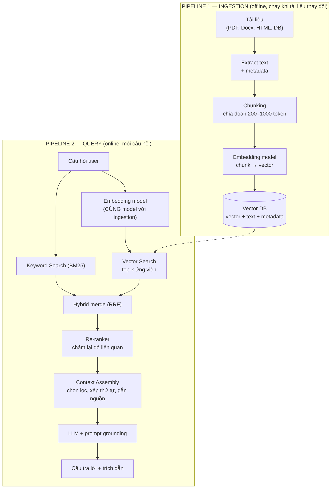
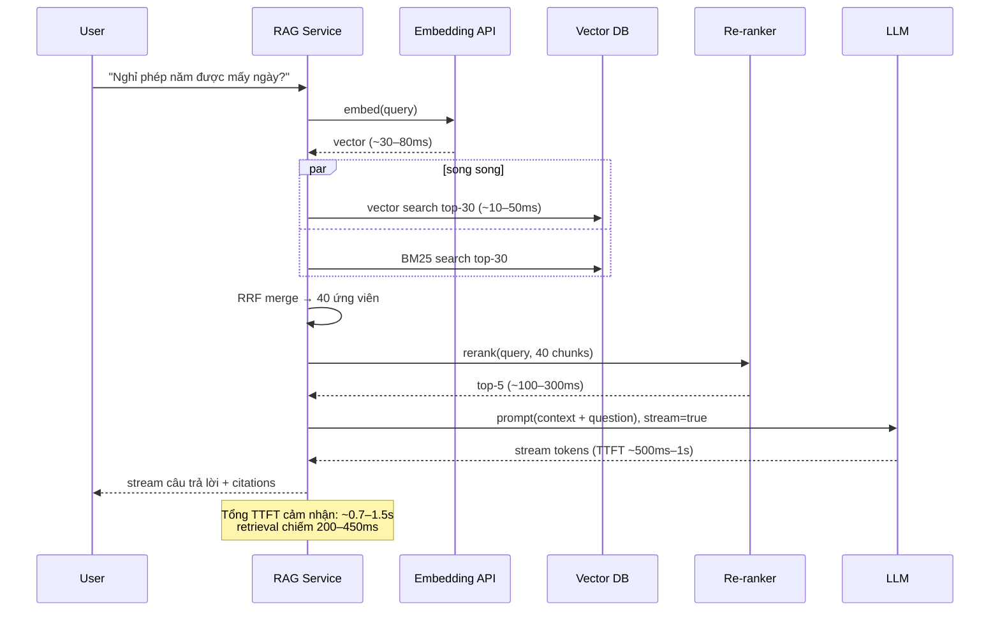

+++
title = "Chương 05 — RAG (Retrieval-Augmented Generation)"
date = "2026-07-18T07:50:00+07:00"
draft = false
tags = ["backend", "ai", "llm"]
series = ["AI cho Backend Engineer"]
+++

## 1. Problem Statement

Công ty bạn có 5.000 tài liệu nội bộ (chính sách, hướng dẫn, hợp đồng). Nhân viên hỏi chatbot: "Nghỉ phép năm được mấy ngày?" Model trả lời **sai nhưng rất tự tin** — vì nó chưa từng thấy quy chế công ty bạn, nó bịa từ kiến thức chung.

Ba lựa chọn:

1. **Nhét hết 5.000 tài liệu vào prompt** → vượt context window, hoặc lọt vừa thì đắt khủng khiếp và chất lượng giảm (lost in the middle).
2. **Fine-tune model trên tài liệu** → đắt, chậm cập nhật (tài liệu đổi mỗi tuần?), và fine-tuning **không đáng tin để nhét kiến thức facts** — nó dạy hành vi tốt hơn dạy sự kiện.
3. **RAG**: tìm đúng vài đoạn tài liệu liên quan đến câu hỏi, đưa vào prompt, yêu cầu model trả lời **chỉ dựa trên đó**.

RAG thắng vì nó biến bài toán "model phải biết mọi thứ" thành bài toán **search + đọc hiểu** — search là việc hệ thống làm tốt, đọc hiểu là việc LLM làm tốt.

## 2. Tại sao nó tồn tại

- **Business Problem**: dữ liệu doanh nghiệp thay đổi hằng ngày, riêng tư, và là thứ tạo giá trị — AI phải trả lời trên dữ liệu đó, kèm trích dẫn để kiểm chứng được.
- **Engineering Problem**: context window hữu hạn và đắt; cần cơ chế chọn lọc thông tin đưa vào model theo từng câu hỏi.
- **AI Problem**: hallucination — model bịa khi thiếu thông tin. RAG "tiếp đất" (grounding) câu trả lời vào tài liệu thật, giảm mạnh (không triệt tiêu) hallucination.

## 3. First Principles

RAG = **Retrieval** (tìm) + **Augmented** (bổ sung vào prompt) + **Generation** (sinh câu trả lời). Bản chất là một mẫu kiến trúc, không phải một thư viện:

```
Câu hỏi → tìm k đoạn văn bản liên quan nhất → nhét vào prompt → model trả lời dựa trên chúng
```

Chất lượng RAG bị chặn trên bởi chất lượng retrieval: **model không thể trả lời đúng từ context sai**. 80% công sức RAG production nằm ở phía retrieval (chunking, indexing, search, re-ranking) — không nằm ở prompt.

## 4. Internal Architecture

### 4.1. Hai pipeline độc lập



Ingestion là **batch pipeline** (queue + worker, chạy khi tài liệu đổi); Query là **online path** (latency-sensitive). Hai pipeline có SLO, scaling và failure mode khác nhau — tách hạ tầng ngay từ đầu.

### 4.2. Chunking — quyết định quan trọng nhất

Chunk là đơn vị được embed và được tìm thấy. Chunk sai thì mọi thứ sau sai.

| Chiến lược | Cách làm | Khi nào dùng |
|---|---|---|
| Fixed-size + overlap | Cắt mỗi 500 token, chồng lấn 50–100 | Baseline, tài liệu không cấu trúc |
| Recursive/Semantic boundary | Cắt theo đoạn văn, heading, câu | Đa số tài liệu — chuẩn khuyến nghị |
| Structure-aware | Theo cấu trúc tài liệu: mỗi điều khoản hợp đồng, mỗi hàng FAQ, mỗi function code | Tài liệu có cấu trúc — tốt nhất khi làm được |
| Parent-child | Embed chunk nhỏ (dễ match), trả về chunk cha lớn hơn (đủ ngữ cảnh) | Câu hỏi cần ngữ cảnh rộng |

Nguyên tắc: chunk phải **tự đứng được** (người đọc chunk đơn lẻ vẫn hiểu nó nói về gì). Kỹ thuật giá trị cao: **thêm ngữ cảnh vào chunk trước khi embed** — tiêu đề tài liệu + section vào đầu chunk ("Quy chế nhân sự 2026 > Điều 12: Nghỉ phép — ..."), hoặc dùng LLM sinh 1 câu mô tả ngữ cảnh cho từng chunk (contextual retrieval). Tốn chi phí ingestion một lần, tăng recall rõ rệt mãi về sau.

### 4.3. Hybrid Search & Re-ranking

- **Vector search** bắt ngữ nghĩa ("quên mật khẩu" ≈ "reset password") nhưng kém với mã hiệu chính xác ("lỗi E-4012", "điều 12.3", tên riêng).
- **Keyword search (BM25)** ngược lại: chính xác với term hiếm, mù ngữ nghĩa.
- **Hybrid**: chạy cả hai, trộn bằng Reciprocal Rank Fusion (RRF) — mặc định đúng cho production, đặc biệt tài liệu kỹ thuật/pháp lý nhiều mã hiệu.
- **Re-ranking**: lấy top 20–50 ứng viên từ hybrid search (nhanh, recall cao nhưng thô), đưa qua cross-encoder re-ranker (Cohere Rerank, BGE-reranker) chấm điểm từng cặp (câu hỏi, chunk) — chính xác hơn nhiều — rồi lấy top 3–5 đưa vào prompt. Chi phí: +50–300ms; đáng giá với hầu hết hệ thống QA.

### 4.4. Context Assembly & Grounding prompt

Bước cuối thường bị xem nhẹ: lắp context vào prompt đúng cách.

```typescript
// Node.js — context assembly với citation
function buildRagPrompt(question: string, chunks: RankedChunk[]): string {
  const context = chunks
    .map((c, i) => `<doc id="${i + 1}" source="${c.source}" section="${c.section}">\n${c.text}\n</doc>`)
    .join("\n");
  return `Trả lời câu hỏi CHỈ dựa trên các tài liệu dưới đây.
Quy tắc:
- Mỗi thông tin đưa ra phải kèm trích dẫn [số doc].
- Nếu tài liệu không đủ thông tin để trả lời, nói rõ "Tôi không tìm thấy thông tin này trong tài liệu" — TUYỆT ĐỐI không suy đoán.
- Nếu các tài liệu mâu thuẫn, nêu rõ mâu thuẫn.

<documents>
${context}
</documents>

Câu hỏi: ${question}`;
}
```

Ba yếu tố bắt buộc: (1) chỉ dẫn "chỉ dựa trên tài liệu"; (2) **đường lui tường minh** khi thiếu thông tin — thiếu nó model sẽ bịa; (3) citation để người dùng kiểm chứng và để bạn đo được model có dùng đúng nguồn không.

### 4.5. Sequence diagram — query path với độ trễ



## 5. Trade-off

### RAG vs Fine-tuning — so sánh trực diện

| Tiêu chí | RAG | Fine-tuning |
|---|---|---|
| Cập nhật kiến thức | Tức thì (re-index tài liệu) | Train lại (ngày/tuần) |
| Kiến thức facts | ✅ mạnh, có trích dẫn | ❌ không đáng tin, dễ hallucinate |
| Hành vi/giọng điệu/format | ⚠️ qua prompt | ✅ mạnh nhất |
| Kiểm soát truy cập theo user | ✅ filter lúc retrieval | ❌ kiến thức "nướng" vào model, không tách được |
| Giải thích được ("vì sao trả lời vậy") | ✅ xem chunks được dùng | ❌ hộp đen |
| Chi phí ban đầu | Trung bình (pipeline) | Cao (data + train + hosting) |
| Chi phí mỗi request | Cao hơn chút (retrieval + context token) | Thấp hơn chút |

Kết luận thực dụng: **kiến thức → RAG; hành vi → prompt trước, fine-tuning sau; hai thứ không loại trừ nhau** (fine-tune model nhỏ để dùng trong pipeline RAG là pattern tối ưu chi phí phổ biến).

### Các trade-off nội bộ RAG

- **top_k lớn**: recall tăng nhưng token tăng, nhiễu tăng (model dễ dùng nhầm đoạn không liên quan), latency tăng. Thực nghiệm với eval, thường 3–8 chunks sau re-rank.
- **Chunk nhỏ**: match chính xác hơn nhưng thiếu ngữ cảnh; chunk lớn: ngược lại. Parent-child cho cả hai nhưng thêm phức tạp.
- **Re-ranker**: +latency +chi phí, nhưng thường là nâng cấp chất lượng/chi phí tốt nhất toàn pipeline. Bỏ qua khi corpus nhỏ (<10K chunks) và hybrid search đã đủ.
- **Self-host embedding vs API**: API đơn giản nhưng ingestion 10M tài liệu tốn kém và bị rate limit; self-host (BGE, E5, multilingual model cho tiếng Việt) rẻ ở volume lớn, thêm việc vận hành GPU.

## 6. Production Considerations

- **Đồng bộ dữ liệu**: tài liệu sửa/xóa phải được re-chunk, re-embed, xóa vector cũ. Thiết kế theo event (CDC/webhook → queue → worker) chứ không crawl định kỳ toàn bộ. Vector mồ côi của tài liệu đã xóa = trả lời dựa trên thông tin không còn tồn tại (Chương 13, case "dữ liệu lỗi thời").
- **Access control lúc retrieval**: filter theo quyền user **trong query vector DB** (metadata filter: `department`, `acl`), tuyệt đối không retrieval xong mới lọc — top-k đã "nhìn thấy" tài liệu cấm là đã rò rỉ vào context.
- **Cache 2 tầng**: cache embedding của query phổ biến; cache câu trả lời theo (normalized query + doc version) cho câu hỏi lặp lại nhiều.
- **Metric bắt buộc**: retrieval recall@k trên bộ eval (câu hỏi → chunk đúng đã gán nhãn), tỷ lệ "không tìm thấy thông tin", citation accuracy, end-to-end answer quality (Chương 11). Không có bộ số này, mọi thay đổi chunking/model là mò mẫm.
- **Version toàn pipeline**: embedding model version + chunking config + index version phải đi cùng nhau; đổi một trong ba = re-index.

## 7. Anti-patterns

- **"Chunk 512 token cho mọi thứ"** — cắt đôi bảng biểu, tách điều khoản khỏi tiêu đề; chunking phải nhìn cấu trúc tài liệu.
- **Bỏ qua keyword search** — thuần vector search rồi thắc mắc vì sao tìm "điều 12.3" không ra.
- **Không có đường lui "không biết"** — prompt không dặn xử lý khi context không chứa câu trả lời → hallucination có trích dẫn (nguy hiểm hơn không trích dẫn).
- **Đánh giá bằng demo** — thử 5 câu thấy ổn rồi ship; RAG fail âm thầm ở đuôi phân phối câu hỏi.
- **Nhét cả 20 chunks "cho chắc"** — nhiễu làm giảm chất lượng, chi phí ×4.
- **Embed nguyên tài liệu 50 trang thành 1 vector** — vector trung bình hóa mọi chủ đề, không match với câu hỏi cụ thể nào.

## 8. Best Practices

- Đầu tư nhất vào **chunking theo cấu trúc + contextual enrichment** — ROI cao nhất pipeline.
- Hybrid search là mặc định; re-ranker khi corpus > vài chục nghìn chunks hoặc chất lượng là ưu tiên.
- Xây **golden dataset** 50–200 cặp (câu hỏi thật → tài liệu đúng → đáp án chuẩn) ngay tuần đầu; mọi thay đổi pipeline phải chạy qua nó.
- Trả lời kèm citation và link tài liệu gốc — vừa tăng niềm tin, vừa là cơ chế phát hiện lỗi từ người dùng.
- Log (query, chunks retrieved, chunks cited, answer) — dữ liệu vàng để cải thiện: câu hỏi nào retrieval kém, tài liệu nào thiếu.
- Query transformation cho câu hỏi hội thoại: "thế còn của quản lý?" phải được viết lại thành câu độc lập ("Số ngày nghỉ phép của cấp quản lý?") trước khi search — dùng LLM nhỏ rewrite, +1 call nhưng bắt buộc cho chatbot RAG.

## 9. Khi nào KHÔNG nên dùng RAG

- **Corpus nhỏ và ổn định** (< vài chục trang): nhét thẳng vào system prompt + prompt caching — đơn giản hơn, không có tầng retrieval để hỏng.
- **Tra cứu có cấu trúc**: "đơn hàng #12345 trạng thái gì" là SQL/API lookup qua function calling, không phải semantic search.
- **Keyword search truyền thống đã đủ**: người dùng tìm theo mã, tên chính xác — Elasticsearch thuần rẻ và nhanh hơn.
- **Yêu cầu đúng 100% từng con số**: RAG giảm hallucination nhưng không diệt; nghiệp vụ pháp lý/tài chính cần người duyệt hoặc chỉ trả về **trích dẫn nguyên văn** thay vì để model diễn giải.
- **Không có nguồn tài liệu đáng tin**: RAG trên tài liệu rác = câu trả lời rác có trích dẫn ("garbage in, garbage out with citations").

---

**Chương tiếp theo**: [06 — Vector Database](/series/ai-for-backend-engineers/06-vector-database/) — chọn và vận hành trái tim của tầng retrieval.
