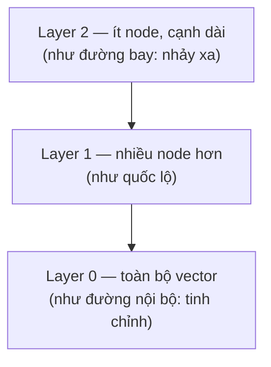
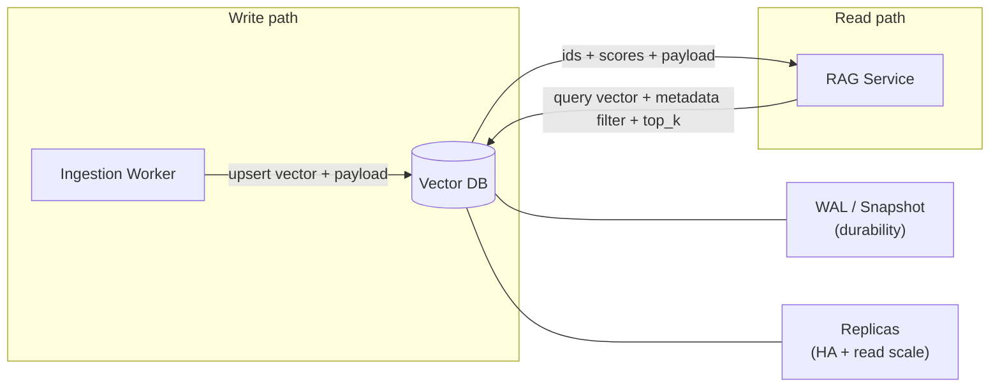

+++
title = "Chương 06 — Vector Database"
date = "2026-07-18T08:00:00+07:00"
draft = false
tags = ["backend", "ai", "llm"]
series = ["AI cho Backend Engineer"]
+++

## 1. Problem Statement

RAG pipeline của bạn cần tìm "k vector gần nhất với query vector" trong 10 triệu vector, dưới 50ms, kèm filter theo quyền truy cập. Postgres với `ORDER BY embedding <-> query LIMIT 5` quét tuần tự sẽ mất hàng giây. Bạn cần: (1) cấu trúc index chuyên cho tìm kiếm lân cận, (2) quyết định dùng database nào — và quyết định này ảnh hưởng vận hành nhiều năm.

## 2. Tại sao nó tồn tại

- **Business Problem**: semantic search / RAG / recommendation ở quy mô hàng triệu document cần truy vấn nhanh và rẻ.
- **Engineering Problem**: tìm chính xác k-nearest-neighbor (kNN) trong không gian nhiều chiều có chi phí O(n) mỗi query — không scale. Cần đánh đổi một chút độ chính xác lấy tốc độ.
- **AI Problem**: embedding chỉ hữu dụng nếu tìm kiếm trên chúng đủ nhanh để nằm trong online path.

## 3. First Principles

### 3.1. ANN — Approximate Nearest Neighbor

Ý tưởng cốt lõi của mọi vector index: **chấp nhận tìm gần đúng để đổi lấy tốc độ**. Thay vì so query với toàn bộ n vector, index tổ chức dữ liệu sao cho chỉ cần thăm một phần nhỏ mà vẫn tìm được (hầu hết) các vector gần nhất.

Chỉ số đo lường: **Recall@k** = tỷ lệ trong k kết quả trả về trùng với k kết quả đúng tuyệt đối. Recall 0.95 nghĩa là trung bình 5% kết quả "đúng" bị bỏ sót. **Recall vs Latency là trade-off trung tâm của mọi vector DB** — mọi tham số tuning đều xoay quanh nó.

### 3.2. HNSW — Hierarchical Navigable Small World

Cấu trúc index phổ biến nhất hiện nay (pgvector, Qdrant, Weaviate, Milvus đều hỗ trợ):



Đồ thị nhiều tầng: tầng trên thưa để "nhảy" nhanh đến đúng vùng, tầng dưới dày để tinh chỉnh. Search đi từ trên xuống — độ phức tạp ~O(log n).

- Ưu: recall cao (0.95–0.99) với latency thấp (ms), chuẩn mặc định cho search online.
- Nhược: **index nằm trong RAM** — 10M vector × 1536 chiều × 4 byte ≈ 61GB chưa kể đồ thị; build index chậm; delete/update làm suy giảm chất lượng đồ thị dần (cần rebuild định kỳ).
- Tham số chính: `M` (số cạnh/node — RAM vs recall), `ef_construction` (chất lượng build), `ef_search` (**tham số runtime quan trọng nhất**: tăng = recall tăng, latency tăng — đây là núm vặn Recall vs Latency).

### 3.3. IVF — Inverted File Index

Chia không gian thành `nlist` cụm (k-means); search chỉ thăm `nprobe` cụm gần nhất.

- Ưu: RAM ít hơn HNSW, build nhanh, kết hợp được với nén (Product Quantization) để chứa tỷ vector.
- Nhược: recall thấp hơn ở cùng latency; vector gần biên cụm dễ bị bỏ sót; cần train lại cụm khi phân phối dữ liệu đổi.
- Chọn khi: dataset rất lớn (>100M), RAM là ràng buộc, chấp nhận recall thấp hơn hoặc bù bằng nprobe cao.

Quy tắc nhanh: **online search chất lượng cao → HNSW; quy mô cực lớn/ngân sách RAM chặt → IVF+PQ; dưới 100K vector → brute force chính xác 100% vẫn đủ nhanh, đừng vội index**.

## 4. Internal Architecture — vị trí trong hệ thống



Một query thực tế không chỉ là "tìm gần nhất" mà là: **filter (tenant, ACL, ngày) + vector search + trả payload**. Khả năng filter hiệu quả (pre-filter trong lúc duyệt đồ thị, không phải hậu lọc) là điểm khác biệt lớn giữa các sản phẩm — hậu lọc trên top-k có thể trả về 0 kết quả khi filter chặt.

## 5. Trade-off — So sánh các lựa chọn

| | pgvector | Qdrant | Milvus | Weaviate | Pinecone |
|---|---|---|---|---|---|
| Loại | Extension của Postgres | DB chuyên dụng (Rust) | DB chuyên dụng, kiến trúc phân tán (Go/C++) | DB chuyên dụng (Go), tích hợp module AI | SaaS managed thuần |
| Vận hành | Như Postgres — đã biết sẵn | Đơn giản (single binary / cluster) | Phức tạp (etcd, object storage, nhiều node role) | Trung bình | Không phải vận hành |
| Quy mô thoải mái | đến ~vài triệu vector | đến ~trăm triệu | trăm triệu → tỷ | đến ~trăm triệu | tùy tiền |
| Filter + vector | ✅ SQL — mạnh nhất về tổ hợp quan hệ | ✅ payload filter tốt, pre-filter | ✅ | ✅ | ✅ |
| Hybrid (BM25 + vector) | Cần kết hợp tsvector/pg_search tự ghép | ✅ built-in (sparse vector) | ✅ | ✅ built-in | ✅ |
| Transaction với dữ liệu nghiệp vụ | ✅ duy nhất có ACID chung với data chính | ❌ | ❌ | ❌ | ❌ |
| Chi phí | Rẻ nhất (tận dụng Postgres có sẵn) | Thấp (self-host) / có cloud | Hạ tầng đáng kể | Trung bình | Cao nhất, đắt theo scale |
| Rủi ro | Giới hạn scale, tuning ít | Cộng đồng nhỏ hơn Postgres | Độ phức tạp vận hành | Hướng đi sản phẩm đổi nhanh | Vendor lock-in, chi phí |

Khuyến nghị theo tình huống:

- **Đang dùng Postgres, < vài triệu vector** (đa số ứng dụng doanh nghiệp): **pgvector**. Một hệ thống ít hơn để vận hành, JOIN vector với dữ liệu nghiệp vụ, ACID, backup sẵn có. Đừng thêm database mới khi chưa cần.
- **Vector là workload trung tâm, chục triệu+, cần HNSW tuning + hybrid search tốt**: **Qdrant** (cân bằng tốt giữa hiệu năng, tính năng, độ đơn giản vận hành).
- **Hàng trăm triệu → tỷ vector, có team hạ tầng**: **Milvus**.
- **Không muốn vận hành gì cả, ngân sách thoáng**: **Pinecone** (hoặc managed offering của Qdrant/Weaviate).

Trade-off then chốt: **thêm một database chuyên dụng = thêm một hệ thống phải HA, backup, monitor, nâng cấp, và đồng bộ dữ liệu với nguồn chính**. Chi phí vận hành đó thường lớn hơn chênh lệch hiệu năng ở quy mô nhỏ và vừa.

### Benchmark khung (tự chạy trên dữ liệu của bạn — đừng tin số của vendor)

```
Dataset: vector thật của bạn (không phải random), kèm filter thật
Đo:  recall@10 so với brute-force ground truth
     p50/p95/p99 latency ở QPS mục tiêu (đo cả lúc vừa upsert — index đang nóng)
     RAM/disk footprint; thời gian build index; ảnh hưởng của filter chặt
Quét: ef_search (HNSW) hoặc nprobe (IVF) để vẽ đường cong Recall–Latency
```

Con số tham khảo bậc độ lớn (1–5M vector, 1536d, HNSW, máy đơn hợp lý): p95 một-vài-chục ms ở recall ~0.95+. Nếu bạn đo ra hàng trăm ms — thường là do filter hậu lọc, index chưa build xong, hoặc thiếu RAM.

## 6. Production Considerations

- **Đồng bộ nguồn chính ↔ vector DB**: vector DB là **derived data** — nguồn sự thật là DB nghiệp vụ/kho tài liệu. Thiết kế để có thể **rebuild toàn bộ index từ nguồn** bất cứ lúc nào (khi đổi embedding model, khi index hỏng). Không có đường rebuild = không có đường lui.
- **Upsert theo id ổn định** (hash của source_id + chunk_position) để cập nhật tài liệu không tạo trùng lặp.
- **Multi-tenancy**: filter theo `tenant_id` trong mọi query (bắt buộc ở tầng repository, không tin tầng gọi); tenant lớn cân nhắc collection/partition riêng.
- **Monitor**: recall trên bộ mẫu định kỳ (index suy giảm âm thầm sau nhiều delete/update), p99 latency, RAM headroom, số vector ≈ số chunk kỳ vọng (lệch = pipeline ingestion rò rỉ).
- **Backup**: snapshot định kỳ + kịch bản restore có diễn tập; và nhớ — backup nguồn + khả năng re-embed đôi khi là chiến lược recovery tốt hơn backup index.
- **Quantization** (int8/binary): giảm 4–32× RAM, mất 1–5% recall — bật khi chi phí RAM thành vấn đề, sau khi đo.

## 7. Anti-patterns

- Chọn DB chuyên dụng vì "chuẩn AI stack" khi 200K vector nằm gọn trong pgvector — trả phí vận hành một hệ thống mới cho vấn đề chưa tồn tại.
- Benchmark bằng vector random — phân phối embedding thật khác hoàn toàn, recall đo được vô nghĩa.
- Hậu lọc ACL: search xong mới lọc quyền → thiếu kết quả (filter chặt) và rò rỉ tài liệu vào ranking. Pre-filter luôn.
- Không pin embedding model version cùng index — nửa index model cũ, nửa model mới, similarity giữa chúng vô nghĩa (Chương 13, "Embedding Drift").
- Để mặc định `ef_search`/`nprobe` của thư viện mà chưa từng quét đường cong Recall–Latency trên dữ liệu của mình.

## 8. Best Practices

- Bắt đầu với pgvector trừ khi có lý do định lượng để làm khác; thiết kế tầng repository trừu tượng (interface `VectorStore`) để chuyển DB sau này không đau.
- Lưu **text + metadata đầy đủ trong payload** (hoặc join được về nguồn) — đừng chỉ lưu vector rồi phải query ngược nhiều hệ thống trong online path.
- Giữ một bộ "canary queries" có ground truth, chạy recall check sau mỗi lần re-index/nâng cấp.
- Kích thước hóa RAM từ đầu: `n_vectors × dim × 4 bytes × ~1.5 (đồ thị + overhead)` — hết RAM là latency tăng phi tuyến.
- Tách collection theo embedding model version; migrate bằng dual-write + backfill + switch, như mọi cuộc migration database.

## 9. Khi nào KHÔNG cần Vector Database

- **< ~100K vector**: brute-force trong RAM (NumPy / pgvector không index) đã < 50ms — đủ cho rất nhiều ứng dụng nội bộ.
- **Search theo mã, ID, tên chính xác**: B-tree/Elasticsearch — bài toán không có ngữ nghĩa thì không cần vector.
- **Dữ liệu quan hệ có cấu trúc**: "đơn hàng của user X tháng này" là SQL, đừng semantic-search nó.
- **Tần suất query cực thấp**: vài chục query/ngày trên 1M vector — brute-force 500ms/query vẫn rẻ hơn vận hành một DB mới.

---

**Chương tiếp theo**: [07 — AI Agents](/series/ai-for-backend-engineers/07-ai-agents/) — khi nào cần một hệ thống tự lập kế hoạch, và khi nào workflow cố định là lựa chọn đúng.
