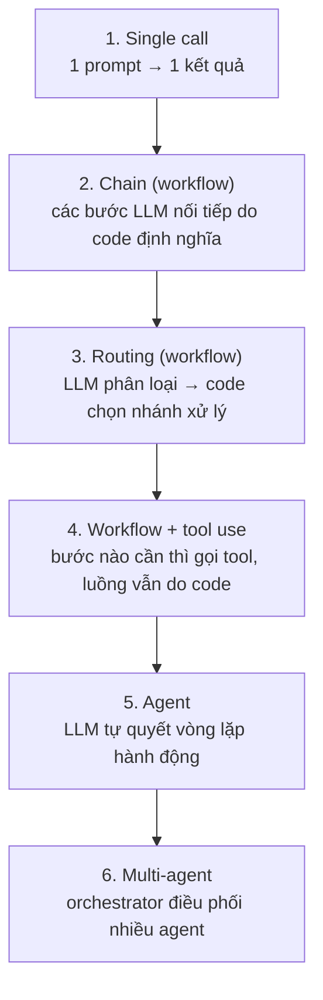
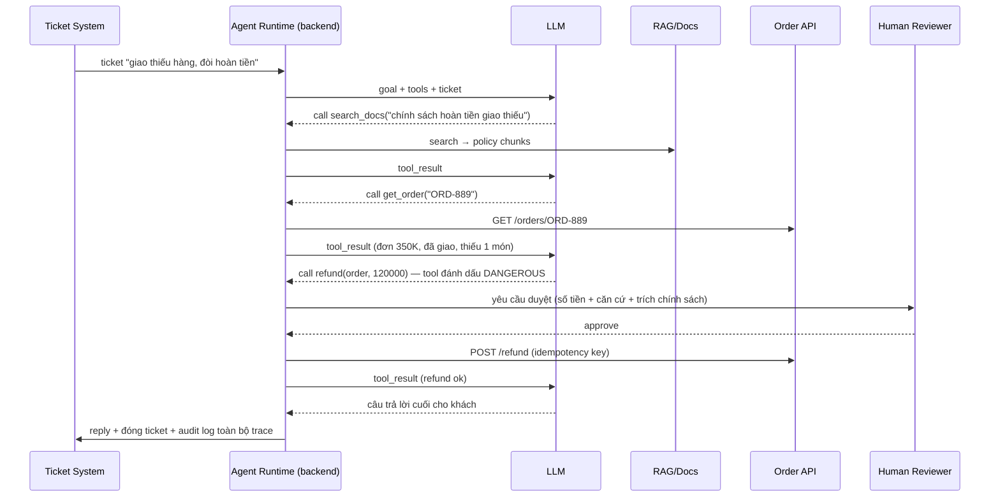

+++
title = "Chương 07 — AI Agents: Planning, Memory, Workflow vs Agent"
date = "2026-07-18T08:10:00+07:00"
draft = false
tags = ["backend", "ai", "llm"]
series = ["AI cho Backend Engineer"]
+++

## 1. Problem Statement

Yêu cầu: "Tự động xử lý ticket hỗ trợ: đọc ticket, tra cứu tài liệu, kiểm tra trạng thái đơn, nếu cần thì hoàn tiền, rồi trả lời khách."

Cách 1 — **Workflow**: bạn viết code định nghĩa các bước cố định, LLM chỉ làm từng việc nhỏ trong mỗi bước (phân loại, soạn văn bản).
Cách 2 — **Agent**: bạn đưa LLM mục tiêu + bộ tool, để **model tự quyết định** làm gì, theo thứ tự nào, đến khi nào xong.

Chọn sai hướng có giá đắt: workflow cho bài toán quá đa dạng → rừng if/else không bao giờ đủ; agent cho bài toán vốn cố định → hệ thống đắt, chậm, không dự đoán được, khó debug — để giải bài toán mà 20 dòng code làm được.

## 2. Tại sao Agent tồn tại

- **Business Problem**: có những tác vụ mà **đường đi phụ thuộc dữ liệu gặp phải trên đường** — không liệt kê trước được (điều tra sự cố, nghiên cứu, xử lý ticket đa dạng).
- **Engineering Problem**: mã hóa mọi nhánh xử lý của thế giới thực bằng if/else là bất khả thi với không gian input mở.
- **AI Problem**: một lượt gọi LLM chỉ "nói" được; tác vụ thực tế cần chuỗi **quan sát → suy luận → hành động** lặp lại.

## 3. First Principles

Định nghĩa gọn: **Agent = LLM + Tools + Vòng lặp + Trạng thái**, trong đó **LLM quyết định luồng điều khiển** (control flow).

```
while not done:
    thought  = LLM(goal, history, tool_results)   # suy luận: làm gì tiếp?
    action   = thought.tool_call                   # chọn tool + tham số
    result   = execute(action)                     # backend thực thi
    history += (thought, action, result)           # quan sát, tích lũy
```

Phân biệt then chốt (định nghĩa được ngành chấp nhận rộng rãi):

- **Workflow**: LLM là **bước xử lý** trong luồng do code định nghĩa. Code quyết định điều khiển.
- **Agent**: LLM là **bộ điều khiển** của luồng. Model quyết định bước tiếp theo dựa trên kết quả bước trước.

Hệ quả nghiêm túc về mặt kỹ thuật: agent là hệ thống **non-deterministic ở tầng control flow** — cùng input có thể đi đường khác nhau. Mọi thuộc tính bạn quen thuộc (chi phí cố định, latency dự đoán được, test tái lập) đều mất. Đó là cái giá của tính linh hoạt.

### Các thành phần

- **Planning**: cách agent chia mục tiêu thành bước. Hai mức: ngầm (ReAct — nghĩ và hành động xen kẽ từng bước) và tường minh (sinh plan trước, thực thi, điều chỉnh). Plan tường minh dễ quan sát và cho phép chèn bước người duyệt.
- **Tools**: như Chương 04 — chất lượng mô tả tool quyết định chất lượng agent nhiều hơn chất lượng model.
- **Memory**:
  - *Working memory*: hội thoại + tool results trong context — **tài nguyên đắt và hữu hạn**; agent chạy dài phải nén (tóm tắt các bước cũ, giữ kết luận, bỏ chi tiết).
  - *Long-term memory*: lưu ngoài (DB/vector store) các sự kiện, sở thích user, kết luận từ phiên trước; truy xuất lại khi liên quan. Bản chất là RAG trên chính lịch sử của agent.
- **Multi-agent**: nhiều agent chuyên biệt (researcher, coder, reviewer) phối hợp — thường qua mẫu orchestrator-workers. Sức mạnh thật: **tách context** — mỗi agent con có context sạch cho việc của nó, tránh một context khổng lồ nhiễu loạn. Giá: chi phí ×N, độ phức tạp phối hợp, lỗi lan truyền giữa các agent. Chỉ dùng khi một agent đã chứng minh là không đủ.

## 4. Internal Architecture

### 4.1. Phổ kiến trúc — từ đơn giản đến phức tạp



**Nguyên tắc số một của thiết kế agent: đứng ở mức thấp nhất còn giải được bài toán.** Đa số use case doanh nghiệp dừng ở mức 3–4. Mức 5–6 dành cho bài toán thật sự mở (coding agent, deep research, điều tra đa bước).

### 4.2. Sequence diagram — agent xử lý ticket



Điểm kiến trúc đáng chú ý: bước **human-in-the-loop** cho hành động tiền bạc; **audit trace toàn bộ** các bước; agent runtime là code backend của bạn — không phải phép màu của framework.

### 4.3. Agent runtime dưới góc nhìn backend

Agent chạy dài (phút → giờ) là một **stateful long-running job**, không phải request-response:

- Trạng thái (history, bước hiện tại) phải **persist được** — process chết thì resume, không chạy lại từ đầu (đặc biệt các bước đã ghi dữ liệu).
- Cần **checkpoint** trước mỗi hành động có side effect; hành động ghi phải idempotent.
- Cần **budget**: max steps, max tokens, max thời gian, max tiền — vượt là dừng và báo cáo, không lặng lẽ chạy tiếp.
- Đây chính là bài toán durable execution — vì thế Temporal xuất hiện trong so sánh với LangGraph (Chương 14).

```typescript
// Node.js — khung agent loop với budget và checkpoint
interface AgentBudget { maxSteps: number; maxCostUsd: number; deadline: Date; }

async function runAgent(goal: string, tools: Tool[], budget: AgentBudget) {
  const state = await store.loadOrCreate(goal);      // resume nếu có checkpoint
  while (!state.done) {
    assertBudget(state, budget);                     // vượt budget → dừng có kiểm soát
    const decision = await llm.decide(goal, state.history, tools);
    if (decision.type === "final_answer") return finish(state, decision.text);

    if (tools.byName(decision.tool).dangerous) {
      await requestHumanApproval(state, decision);   // treo lại chờ duyệt — state đã persist
    }
    await store.checkpoint(state, decision);         // TRƯỚC side effect
    const result = await execute(decision, { idempotencyKey: state.id + state.step });
    state.record(decision, result);                  // + nén history nếu quá dài
    await store.save(state);
  }
}
```

## 5. Trade-off

### Workflow vs Agent — bảng quyết định

| Tiêu chí | Workflow | Agent |
|---|---|---|
| Chi phí | Dự đoán được (n bước cố định) | Biến động lớn (3–50 lượt LLM) |
| Latency | Dự đoán được | Không — có thể phút/giờ |
| Debug | Dễ — nhìn bước nào fail | Khó — phải đọc trace suy luận |
| Test | Unit test từng bước | Eval thống kê trên nhiều lần chạy |
| Độ phủ bài toán | Chỉ các nhánh đã mã hóa | Cả nhánh chưa lường trước |
| Chất lượng trên happy path | Cao và ổn định | Ngang hoặc kém hơn (dễ đi lạc) |
| Phù hợp | Quy trình nghiệp vụ, pipeline dữ liệu, hầu hết automation | Điều tra, nghiên cứu, coding, tác vụ mở |

Câu hỏi quyết định: **"Tôi có thể vẽ flowchart các bước xử lý trước không?"** Vẽ được (dù có nhánh) → Workflow. Không vẽ được vì bước sau phụ thuộc kết quả bước trước theo cách không liệt kê nổi → Agent.

- **Autonomy vs Control**: thêm tự do cho agent = bớt khả năng dự đoán. Kỹ thuật trung hòa: agent trong "hộp" — tool bị giới hạn quyền, hành động ghi cần duyệt, budget chặt.
- **Multi-agent vs Single agent**: multi-agent tăng chất lượng ở tác vụ rộng (nhiều mảng độc lập) nhờ tách context, nhưng chi phí token thường gấp 3–15 lần và thêm failure mode phối hợp. Bắt đầu với 1 agent + tool tốt.

## 6. Production Considerations

- **Trace từng bước là bắt buộc**: (step, prompt, decision, tool, result, tokens, cost) — không có trace thì sự cố "agent làm gì suốt 40 phút?" không trả lời được.
- **Kiểm soát chi tiêu theo run**: đếm token cộng dồn mỗi run, alert ở 80% budget, kill ở 100%. Agent lỗi lặp vô hạn là hóa đơn nghìn đô trong một đêm (Chương 13).
- **Sandbox cho tool nguy hiểm**: agent viết code → chạy trong container tách biệt; agent duyệt web → chặn nội bộ mạng (SSRF).
- **Timeout phân tầng + graceful degradation**: agent quá hạn → trả kết quả tốt nhất đến thời điểm đó + trạng thái, đừng vứt toàn bộ công sức.
- **Đánh giá theo phân phối**: chạy bộ eval N lần, đo tỷ lệ thành công, chi phí trung bình/p95, số bước — một lần chạy demo không nói lên gì (non-deterministic).
- **Phân quyền theo user thật**: agent hành động **thay mặt** user → tool chạy với credential/scope của user đó, không phải service account toàn quyền.

## 7. Anti-patterns

- **Agent hóa mọi thứ theo trend**: dùng agent cho quy trình 3 bước cố định — đắt hơn 10 lần, chậm hơn 10 lần, tin cậy kém hơn code thường.
- **Vòng lặp không đáy**: không max steps, không budget — agent kẹt trong chu kỳ thử-sai vĩnh viễn.
- **Context phình không nén**: 50 tool result thô trong history → vượt context, chi phí bùng nổ, model "quên" mục tiêu ban đầu.
- **Multi-agent ngày đầu tiên**: 5 agent gọi nhau khi chưa có eval, chưa có trace — hệ thống không ai hiểu nổi.
- **Tin lời agent tự báo cáo**: agent nói "đã hoàn thành" không có nghĩa đã hoàn thành — verify bằng kiểm tra độc lập (test chạy pass, record tồn tại trong DB).
- **Không có nút dừng khẩn cấp**: mọi hệ agent production cần kill switch tức thời theo run/theo toàn hệ thống.

## 8. Best Practices

- Leo thang độ phức tạp có bằng chứng: single call → chain → routing → tool use → agent; mỗi bước leo phải có eval chứng minh mức dưới không đủ.
- Đầu tư vào **mô tả tool và error message** — cải thiện agent nhiều hơn đổi model trong đa số trường hợp.
- Thiết kế tool "quan sát được nhiều, hành động ít": nhiều tool đọc, ít tool ghi, tool ghi cần duyệt.
- Nén history chủ động: giữ mục tiêu + kết luận từng giai đoạn + k bước gần nhất; tóm tắt phần còn lại.
- Ghi lại các run thất bại làm test case — bộ eval agent tốt nhất được xây từ chính thất bại thực tế.
- Cân nhắc framework (LangGraph, Agent SDK các provider) cho cấu trúc, nhưng hiểu rằng **giá trị nằm ở tool + eval + guardrail của bạn**, không nằm ở framework.

## 9. Khi nào KHÔNG nên dùng Agent

- Quy trình vẽ được flowchart → workflow (rẻ, nhanh, tin cậy, debug được).
- Latency yêu cầu < vài giây → agent loop không vừa; dùng single call hoặc pre-compute.
- Tác vụ rủi ro cao không có điểm chèn người duyệt tự nhiên → thiết kế lại trước khi nghĩ đến agent.
- Ngân sách chi phí/request cố định chặt → chi phí agent có phương sai lớn, vi phạm ngân sách là chuyện thường ngày.
- Bài toán một câu trả lời từ tri thức có sẵn → RAG một lượt là đủ, đừng bắt model "đi điều tra".

---

**Chương tiếp theo**: [08 — AI Backend Architecture](/series/ai-for-backend-engineers/08-ai-backend-architecture/) — tầng hạ tầng chung cho mọi ứng dụng AI: gateway, routing, caching, streaming, session.
