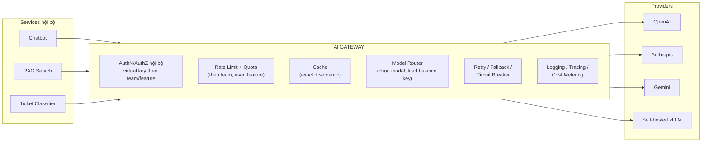
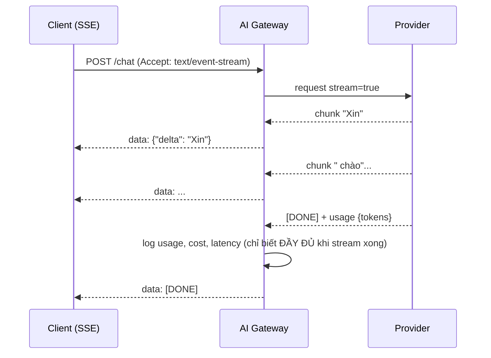

+++
title = "Chương 08 — AI Backend Architecture: Gateway, Routing, Caching, Streaming, Session"
date = "2026-07-18T08:20:00+07:00"
draft = false
tags = ["backend", "ai", "llm"]
series = ["AI cho Backend Engineer"]
+++

## 1. Problem Statement

Công ty bạn giờ có 4 tính năng AI (chatbot, tóm tắt, phân loại ticket, RAG search) do 3 team viết. Hiện trạng: mỗi team tự gọi provider bằng SDK riêng, API key rải trong env của từng service, không ai biết tổng chi phí, một team bị rate limit làm team khác cũng nghẽn (chung key), muốn đổi từ OpenAI sang Anthropic phải sửa 3 codebase, và không có logging thống nhất.

Đây chính xác là bài toán mà backend đã giải nhiều lần với database (connection pool), microservice (API gateway), external API (adapter layer). Lời giải cùng dạng: **một tầng hạ tầng AI dùng chung** — AI Gateway và các thành phần vệ tinh.

## 2. Tại sao nó tồn tại

- **Business Problem**: kiểm soát chi phí tập trung, không phụ thuộc một vendor, tính năng AI mới ship nhanh trên hạ tầng sẵn.
- **Engineering Problem**: cross-cutting concerns (auth, rate limit, retry, log, cache) phải làm một lần, không lặp lại mỗi team.
- **AI Problem**: provider không ổn định như database — rate limit chặt, outage xảy ra, model deprecated liên tục; hệ thống phải cách ly được sự bất ổn đó.

## 3. First Principles

AI Gateway là **reverse proxy chuyên cho LLM traffic**, đứng giữa mọi service nội bộ và mọi model provider:



Nguyên tắc thiết kế: gateway expose **một API thống nhất** (thường theo format OpenAI-compatible hoặc một schema nội bộ) + tham số mức ý định (`task: "summarize"`, `quality: "high"`) — để app không cần biết model nào đứng sau. Build hay dùng sẵn (LiteLLM, Portkey, Kong AI Gateway, Envoy AI Gateway) — xem mục Trade-off.

## 4. Internal Architecture — từng thành phần

### 4.1. Model Routing

Router quyết định request nào đến model nào, theo:

- **Task routing**: phân loại → model nhỏ rẻ; suy luận phức tạp → model lớn. Có thể tĩnh (config theo feature) hoặc động (một classifier nhỏ đánh giá độ khó của prompt rồi chọn model — tiết kiệm 30–70% chi phí ở hệ thống lớn, đổi lấy thêm một tầng phức tạp).
- **Load balancing**: xoay nhiều API key/region/deployment để cộng dồn rate limit.
- **Health-based**: provider lỗi/chậm → route sang provider khác (kết hợp circuit breaker).

### 4.2. Retry, Fallback, Circuit Breaker

```go
// Go — phân loại lỗi quyết định hành vi
func classify(err error, status int) Action {
    switch {
    case status == 429:               // rate limit
        return RetryWithBackoff        // tôn trọng Retry-After header
    case status >= 500:                // provider lỗi
        return RetryThenFallback       // 1-2 lần rồi đổi provider
    case status == 400 && isContextLength(err):
        return TruncateAndRetry        // cắt context rồi thử lại — KHÔNG retry nguyên bản
    case status == 400, status == 422: // lỗi request
        return FailFast                // retry vô ích, đừng đốt quota
    case isTimeout(err):
        return RetryOnce               // cẩn thận: request có thể đã được tính tiền
    }
    return FailFast
}
```

Fallback chain production điển hình: `model chính → model tương đương provider khác → model nhỏ hơn → degraded response ("hệ thống bận, thử lại sau" hoặc kết quả từ rule-based)`. Lưu ý chất lượng: fallback sang model khác có thể thay đổi hành vi — prompt phải được test trên cả chain, và response nên gắn nhãn model đã dùng để debug.

Circuit breaker theo từng provider: lỗi liên tiếp vượt ngưỡng → mở mạch, route thẳng sang fallback vài chục giây, thăm dò rồi đóng lại. Tránh việc mọi request chờ timeout 60s trong lúc provider outage.

### 4.3. Caching — đặc thù LLM

| Tầng | Cơ chế | Hit rate | Ghi chú |
|---|---|---|---|
| Exact cache | hash(model + prompt + params) → response | Thấp với chat tự do, cao với task lặp (phân loại, extraction) | Redis, TTL theo use case |
| Semantic cache | embed(query) → tìm query cũ tương tự ≥ ngưỡng → trả response cũ | Trung bình | **Rủi ro trả sai**: "chuyển tiền qua app?" ≈ "hủy chuyển tiền qua app?" — similarity cao, ý ngược. Chỉ dùng cho nội dung tĩnh, ngưỡng chặt, có kill switch |
| Provider prompt caching | provider cache phần đầu prompt (system + few-shot + tài liệu) giữa các request | — | Giảm 50–90% chi phí input phần cache. **Điều kiện: phần ổn định nằm ĐẦU prompt** — đây là lý do kiến trúc prompt: static trước, dynamic sau |

Cache invalidation: key phải chứa `prompt_version` và `doc_version` — quên điều này là serve câu trả lời của chính sách đã hết hiệu lực (Chương 13).

### 4.4. Streaming Response

Non-streaming: user chờ 15s nhìn spinner. Streaming: từ chữ đầu tiên sau ~1s. Cùng tổng thời gian, cảm nhận khác hẳn — **streaming là mặc định cho mọi UI chat**.



Những việc backend phải xử lý mà demo không lộ ra: client ngắt kết nối giữa chừng (hủy request xuống provider để không trả tiền phần thừa); lỗi xảy ra **giữa** stream (đã gửi nửa câu — cần event `error` trong protocol của bạn, client xử lý được); timeout theo "khoảng lặng giữa 2 chunk" chứ không theo tổng thời gian; guardrail/content filter trên nội dung streaming (quét từng đoạn — đã stream ra là không rút lại được); usage token chỉ chốt ở cuối stream (metering phải chờ).

```go
// Go — proxy SSE với idle timeout và client-cancel
func streamHandler(w http.ResponseWriter, r *http.Request) {
    flusher := w.(http.Flusher)
    w.Header().Set("Content-Type", "text/event-stream")
    upstream, _ := callProviderStream(r.Context(), buildReq(r)) // ctx hủy → hủy upstream
    idle := time.NewTimer(15 * time.Second)
    for {
        select {
        case chunk, ok := <-upstream.Chunks:
            if !ok { return } // stream xong
            idle.Reset(15 * time.Second)
            fmt.Fprintf(w, "data: %s\n\n", chunk.JSON())
            flusher.Flush()
        case <-idle.C:
            fmt.Fprintf(w, "data: {\"error\": \"upstream_stalled\"}\n\n")
            flusher.Flush()
            return
        case <-r.Context().Done(): // client bỏ đi
            upstream.Cancel()      // dừng đốt tiền ngay
            return
        }
    }
}
```

### 4.5. Session Management & Conversation History

LLM stateless → "cuộc hội thoại" là cấu trúc dữ liệu backend sở hữu:

```
Session Store (Redis/Postgres):
  session_id → {user_id, messages[], summary, metadata, prompt_version, created_at}
```

Vấn đề trung tâm: **history dài ra vô hạn, context và tiền thì không**. Chiến lược quản lý theo thang:

1. **Sliding window**: giữ N lượt gần nhất — đơn giản, mất thông tin cũ.
2. **Summarization**: khi history vượt ngưỡng, dùng model rẻ tóm tắt phần cũ thành đoạn "summary", giữ nguyên các lượt gần — chuẩn phổ biến. Chú ý: tóm tắt là lossy, thông tin quan trọng (tên, số, quyết định) nên được trích thành structured notes thay vì chỉ văn xuôi.
3. **Summary + retrieval**: lượt cũ được embed; khi cần, retrieval lượt liên quan vào context — "trí nhớ dài hạn" cho hội thoại rất dài.

Ngoài ra: session phải có TTL và giới hạn kích thước (Chương 13, "Memory Growth"); `prompt_version` lưu theo session để hội thoại đang diễn ra không đổi hành vi giữa chừng khi bạn deploy prompt mới.

### 4.6. Rate Limiting & Quota — hai chiều

- **Chiều vào** (bảo vệ bạn): limit theo user/tenant/feature — không chỉ theo request mà **theo token** (1 user gửi 50K token/request khác 1 user gửi 500). Quota tiền theo tháng cho từng tenant với hard cap.
- **Chiều ra** (tôn trọng provider): điều tiết tổng TPM/RPM xuống dưới hạn mức provider, hàng đợi ưu tiên (interactive trước, batch sau) khi gần chạm trần.

## 5. Trade-off

- **Build vs Buy gateway**: LiteLLM/Portkey/Kong cho 80% tính năng ngay lập tức; tự build khi có yêu cầu đặc thù (routing theo logic nghiệp vụ, metering phức tạp, compliance). Chi phí thật của tự build nằm ở **duy trì** — provider API đổi liên tục. Hướng đi phổ biến: bắt đầu bằng open-source (LiteLLM), thay dần phần cần thiết.
- **Gateway tập trung vs thư viện nhúng**: gateway = thêm 1 hop (5–20ms, không đáng kể so với giây của LLM) + một single point of failure phải HA; thư viện nhúng = không hop nhưng cross-cutting concerns lặp ở mọi service và nâng cấp khó. Với ≥ 2 team dùng AI: gateway thắng.
- **Semantic cache**: tiết kiệm chi phí ↔ rủi ro trả lời sai ngữ cảnh. Chỉ bật cho content tĩnh, đo tỷ lệ false-hit bằng eval, có công tắc tắt nhanh.
- **Streaming vs Non-streaming**: streaming bắt buộc cho chat UI; non-streaming đơn giản hơn nhiều cho pipeline máy-với-máy (batch, extraction) — đừng stream chỗ không có người nhìn. (So sánh đầy đủ: Chương 14.)

## 6. Production Considerations

- Gateway phải **HA hơn mọi thứ sau nó**: nhiều instance, stateless (state ở Redis), health check, và có đường bypass khẩn cấp (app gọi thẳng provider với feature flag) nếu gateway chết.
- **Metering là chức năng hạng nhất**: mỗi response gắn (team, feature, user, model, tokens, cost) đẩy về hệ thống metric — cost dashboard theo chiều bất kỳ dựng từ đây (Chương 11).
- **Virtual key**: team nhận key nội bộ từ gateway (kèm quota, model được phép), không bao giờ cầm key thật của provider — thu hồi, xoay key thật không ảnh hưởng ai.
- **Log có kiểm soát PII**: prompt/response chứa dữ liệu người dùng — chính sách log (mask, TTL, quyền xem) phải có từ ngày đầu (Chương 12).
- **Timeout ngân sách theo tầng**: client 60s > gateway 55s > provider call 50s — tầng ngoài luôn dài hơn tầng trong, tránh "ai cũng chờ ai".

## 7. Anti-patterns

- Mỗi team một API key thật của provider, rải trong env — không quota, không audit, lộ key là thay toàn bộ.
- Retry 429 lập tức không backoff — tự DDoS chính quota của mình, kéo dài sự cố.
- Cache không chứa prompt_version — deploy prompt mới nhưng user vẫn nhận response của prompt cũ, "deploy rồi mà không thấy đổi".
- Gửi nguyên history 100 lượt mỗi request vì "context window còn chỗ" — chi phí hội thoại tăng bậc hai.
- Ước lượng chi phí bằng đếm ký tự thay vì usage thật từ response.
- Bọc streaming bằng "chờ đủ rồi trả một cục" ở một tầng trung gian — mất toàn bộ giá trị của streaming mà vẫn trả độ phức tạp của nó.

## 8. Best Practices

- Chuẩn hóa **một interface LLM nội bộ** (đủ dùng: messages, tools, stream, metadata) — mọi app nói chuyện qua nó; đổi provider là việc của gateway.
- Tag mọi request: `feature`, `team`, `prompt_id`, `prompt_version`, `session_id`, `request_id` — xương sống của observability và cost attribution.
- Chạy **game day**: tắt provider chính trong staging, xem fallback chain có chạy như thiết kế.
- Thiết kế prompt để tối ưu provider caching: phần tĩnh (system, few-shot, tài liệu chung) đứng đầu, phần động (user input) đứng cuối.
- Đặt hard cap chi tiêu ở mức gateway theo ngày/tháng — thà tính năng ngừng phục vụ còn hơn hóa đơn không trần.

## 9. Khi nào KHÔNG cần

Một service, một tính năng AI, một provider, vài nghìn request/ngày: SDK provider + retry wrapper + log usage là đủ. Gateway trở nên đáng giá khi xuất hiện bất kỳ dấu hiệu nào: ≥2 team dùng AI, cần cost attribution, cần fallback đa provider, cần quota theo tenant, hoặc chi phí LLM thành mục đáng kể trong P&L. Xây sớm quá là overhead; xây muộn quá là gỡ nợ ở 3 codebase — thời điểm đúng thường là "tính năng AI thứ hai".

---

**Chương tiếp theo**: [09 — Model Serving](/series/ai-for-backend-engineers/09-model-serving/) — đứng sau gateway là gì: managed API hay GPU của chính bạn.
