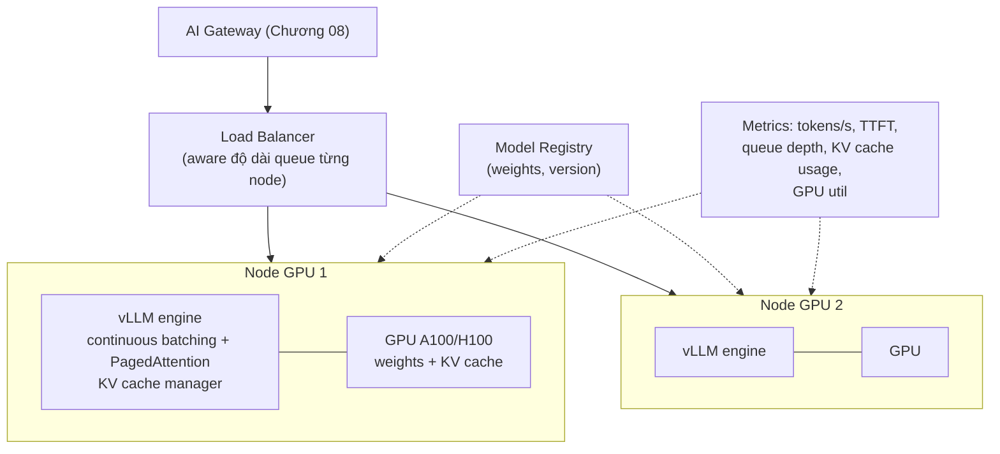

+++
title = "Chương 09 — Model Serving: API vs Self-hosted, Ollama, vLLM, TensorRT-LLM"
date = "2026-07-18T08:30:00+07:00"
draft = false
tags = ["backend", "ai", "llm"]
series = ["AI cho Backend Engineer"]
+++

## 1. Problem Statement

CFO hỏi: "Chi phí OpenAI 40.000$/tháng — tự host model open-source có rẻ hơn không?" CTO hỏi: "Dữ liệu khách hàng gửi sang API nước ngoài có ổn về compliance không?" Câu trả lời đúng cần hiểu: serving LLM thực chất là vận hành gì, các engine khác nhau chỗ nào, và tổng chi phí sở hữu (TCO) thật sự gồm những gì — vì quyết định này là một trong những quyết định hạ tầng đắt nhất của hệ thống AI.

## 2. Tại sao chủ đề này tồn tại

- **Business Problem**: chi phí, compliance (dữ liệu không được rời lãnh thổ/hạ tầng), độc lập vendor.
- **Engineering Problem**: serving LLM là bài toán hạ tầng đặc thù (GPU, batching, KV cache) — khác hẳn serving web app; đánh giá thấp nó là nguồn thất bại phổ biến của dự án "tự host cho rẻ".
- **AI Problem**: model open-weights (Llama, Qwen, Mistral, DeepSeek...) đã đủ tốt cho nhiều task — lựa chọn thật sự tồn tại, không còn là "bắt buộc dùng API".

## 3. First Principles — serving LLM tốn kém ở đâu

Ba đặc điểm chi phối mọi thiết kế serving:

1. **Trọng số model khổng lồ**: model 70B tham số ở FP16 = ~140GB — vượt VRAM một GPU; cần multi-GPU hoặc **quantization** (nén trọng số xuống INT8/INT4: giảm 2–4× VRAM, mất vài % chất lượng — với serving, INT8/FP8 gần như "miễn phí", INT4 cần đo kỹ trên task của bạn).
2. **KV Cache**: khi sinh token, model lưu trạng thái attention (key/value) của mọi token trước đó. KV cache lớn theo (số request đồng thời × độ dài context) và **ăn VRAM cạnh tranh trực tiếp với số request phục vụ được đồng thời** — đây là giới hạn throughput thật, không phải compute.
3. **GPU utilization phụ thuộc batching**: chạy từng request một, GPU rảnh phần lớn thời gian. Phải gộp nhiều request chạy song song — nhưng request LLM dài ngắn khác nhau, batch tĩnh (chờ đủ batch, chờ request dài nhất xong) lãng phí. **Continuous batching** (request mới vào/ra khỏi batch theo từng token step) là phát kiến quan trọng nhất của serving engine hiện đại — tăng throughput 5–20 lần so với naive serving.

## 4. Internal Architecture

### 4.1. Kiến trúc self-hosted serving điển hình



### 4.2. Các lựa chọn serving

| | Vai trò | Điểm mạnh | Điểm yếu | Dùng khi |
|---|---|---|---|---|
| **OpenAI / Anthropic / Gemini API** | Managed API | Chất lượng frontier, không vận hành, tính năng (tool use, caching, batch) hoàn thiện | Chi phí theo token, dữ liệu rời hạ tầng, rate limit, phụ thuộc vendor | Mặc định cho hầu hết sản phẩm, đặc biệt giai đoạn tìm product-market fit |
| **Ollama** | Chạy model local (llama.cpp) | Cài 1 lệnh, chạy trên laptop/CPU/GPU nhỏ, GGUF quantized | Không thiết kế cho concurrent production traffic | Dev/prototype, demo offline, tool nội bộ ít người dùng |
| **vLLM** | Serving engine production, open-source | Continuous batching + PagedAttention (quản lý KV cache theo trang, giảm lãng phí VRAM), throughput cao, OpenAI-compatible API, hệ sinh thái rộng | Phải vận hành GPU infra thật sự | Chuẩn mặc định khi self-host production |
| **TensorRT-LLM** (+ Triton) | Engine tối ưu sâu của NVIDIA | Hiệu năng đỉnh trên GPU NVIDIA (compile kernel theo model+GPU) | Phức tạp nhất: build engine theo từng model/GPU, chu kỳ thay đổi chậm | Quy mô rất lớn, đội infra chuyên trách, vắt kiệt phần cứng |

(SGLang, TGI là các lựa chọn cùng nhóm vLLM — khi đánh giá hãy benchmark trên workload của bạn.)

### 4.3. Metric riêng của serving

- **TTFT** (time to first token) — trải nghiệm; **TPOT/ITL** (thời gian mỗi token) — tốc độ đọc; **throughput** (tokens/s toàn hệ) — chi phí.
- Trade-off nội tại: **tăng batch → throughput tăng, TTFT/TPOT từng request tệ đi**. Phải chọn điểm vận hành theo SLO, và tách pool interactive (batch nhỏ, latency tốt) khỏi pool batch job (batch to, throughput tối đa).
- **Queue depth và KV cache utilization** là 2 metric cảnh báo sớm quá tải — GPU util cao không xấu (nó nên cao), queue dài mới xấu.

## 5. Trade-off — API vs Self-hosted

### Phép tính TCO trung thực

```
API:        cost = tokens × giá  (biến đổi thuần, scale-to-zero, không nhân sự)

Self-host:  cost = GPU (thuê ~1-2$/giờ/A100 → 700-1500$/tháng/GPU, chạy 24/7
                    kể cả lúc 3h sáng không ai dùng)
          + kỹ sư vận hành (thường bị bỏ quên — và là khoản lớn nhất)
          + chất lượng: model open-weights thường THẤP HƠN frontier API cho task khó
            → có thể phải chấp nhận sản phẩm kém hơn hoặc pipeline phức tạp hơn để bù
```

Điểm hòa vốn chỉ đến khi: **utilization cao và ổn định** (GPU idle là tiền cháy), task nằm trong năng lực model open-weights (đã eval chứng minh), và có năng lực vận hành GPU thật. Kinh nghiệm ngành: nhiều dự án "tự host cho rẻ" quay lại API sau 6 tháng vì TCO thật cao hơn dự tính — thứ họ thiếu không phải GPU mà là tính đúng khoản nhân sự và utilization.

### Bảng quyết định

| Yếu tố | Nghiêng về API | Nghiêng về Self-host |
|---|---|---|
| Volume | Thấp/biến động mạnh | Cao, ổn định, dự đoán được |
| Task | Cần chất lượng frontier, đa dạng | Hẹp, model 7–70B sau eval là đủ |
| Compliance | Provider có DPA/region phù hợp | Dữ liệu tuyệt đối không rời hạ tầng |
| Latency | Chấp nhận internet RTT | Cần thấp và kiểm soát được (on-prem, edge) |
| Đội ngũ | Không có kinh nghiệm GPU infra | Có đội infra chuyên trách |
| Fine-tuned model riêng | (API fine-tuning bị giới hạn) | Cần toàn quyền với trọng số |

Chiến lược trưởng thành thường thấy: **API để ship và học → đo kỹ workload → self-host các task hẹp volume lớn (classification, extraction, embedding) bằng model nhỏ → giữ API cho task khó**. Hybrid qua AI Gateway (Chương 08) — routing quyết định request nào đi đâu.

## 6. Production Considerations (khi self-host)

- **Capacity planning theo token, không theo request**: ước tính (requests/s × avg input × avg output) → tokens/s cần → số GPU. Nhớ p95 context dài hơn average nhiều.
- **Autoscaling khó**: model load mất phút (kéo hàng chục GB weights) — scale-up không kịp spike; cần warm pool hoặc over-provision. Scale-to-zero thực tế không khả thi cho latency-sensitive.
- **Health check đúng kiểu**: endpoint trả 200 chưa chắc GPU khỏe — health check nên chạy một inference ngắn thật.
- **Version rollout**: blue-green theo node (không hot-swap model trong engine); giữ node version cũ đến khi eval version mới pass trên traffic thật (shadow/canary).
- **Quantization phải qua eval**: INT4 tiết kiệm VRAM nhưng suy giảm chất lượng không đều giữa các task — benchmark chung không thay được eval của bạn.
- **Multi-tenant fairness**: một tenant gửi context 100K token chiếm KV cache của cả node — limit độ dài input theo tenant ở tầng trước engine.

## 7. Anti-patterns

- Quyết định self-host bằng phép so sánh "giá GPU vs giá token" bỏ quên nhân sự vận hành và GPU idle time.
- Dùng Ollama phục vụ production traffic đồng thời cao — nó không sinh ra cho việc đó; đường lên đúng là vLLM.
- Chọn model theo leaderboard tổng hợp thay vì eval trên task + dữ liệu (đặc biệt tiếng Việt) của chính bạn — thứ hạng chung không dự đoán chất lượng trên workload cụ thể.
- Serve interactive chat và batch pipeline chung một pool GPU — batch job nuốt KV cache, chat TTFT tăng vọt giờ cao điểm.
- Không có kế hoạch thoát (exit plan) cả hai chiều: khóa cứng vào một provider API, hoặc chôn vốn GPU 3 năm cho workload có thể biến mất.

## 8. Best Practices

- Mọi serving path (API và self-host) đứng sau cùng một AI Gateway — chuyển dịch dần bằng config routing, không sửa app.
- Trước khi self-host bất kỳ model nào: chạy eval so sánh nó với API đang dùng trên chính dữ liệu production (sampled, ẩn danh) — quyết định bằng số.
- Benchmark serving bằng workload thật: phân phối độ dài input/output thật, mức đồng thời thật, đo TTFT/TPOT p95 chứ không chỉ throughput đỉnh.
- Bắt đầu self-host bằng task **embedding và classification** — model nhỏ, dễ eval, volume lớn, rủi ro chất lượng thấp — trước khi động đến generation.
- Theo dõi thị trường theo quý: giá API giảm và model open-weights mạnh lên liên tục — bài toán TCO cần tính lại định kỳ, theo cả hai chiều.

## 9. Khi nào KHÔNG nên self-host

- Chưa có product-market fit — tối ưu chi phí hạ tầng cho sản phẩm chưa chắc sống là tối ưu sai chỗ.
- Chi phí API hiện tại < chi phí một kỹ sư — con số nói thay tất cả.
- Task cần chất lượng frontier (suy luận phức tạp, coding khó) — model open-weights sau eval không đạt thì đừng ép.
- Không ai trong team từng vận hành GPU production — học phí sẽ trả bằng downtime của sản phẩm.

---

**Chương tiếp theo**: [10 — AI System Design](/series/ai-for-backend-engineers/10-ai-system-design/) — ráp mọi thứ đã học thành thiết kế hoàn chỉnh cho 7 hệ thống AI phổ biến.
