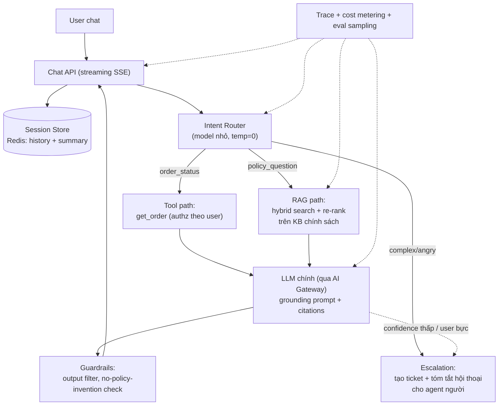
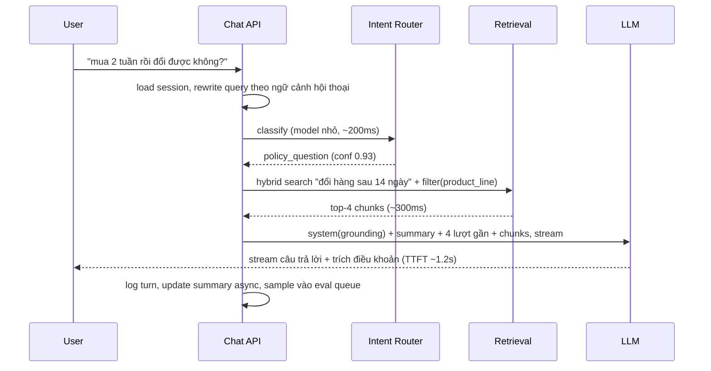

+++
title = "Chương 10 — AI System Design: 7 hệ thống điển hình"
date = "2026-07-18T08:40:00+07:00"
draft = false
tags = ["backend", "ai", "llm"]
series = ["AI cho Backend Engineer"]
+++

Chương này ráp các thành phần từ Chương 01–09 thành thiết kế hoàn chỉnh. Mỗi bài đi theo mạch: **yêu cầu → phân tích "có cần AI không" → kiến trúc → điểm quyết định**. Bài 1 (Customer Support) được phân tích chi tiết nhất làm mẫu; các bài sau tập trung vào điểm khác biệt.

---

## 10.1. AI Customer Support (phân tích đầy đủ)

### Yêu cầu

- Trả lời câu hỏi khách hàng 24/7 trên web/app chat; tra cứu được đơn hàng, chính sách; escalate sang người khi cần.
- Phi chức năng: TTFT < 2s, chi phí < 0.02$/hội thoại, không được bịa chính sách, tiếng Việt.

### Có cần AI không? (luôn hỏi trước)

- 40% câu hỏi là "đơn tôi đâu" → tra cứu có cấu trúc, làm được bằng button + API, **không cần AI**.
- 35% là câu hỏi chính sách diễn đạt trăm kiểu → keyword FAQ fail, **RAG có giá trị thật**.
- 25% phức tạp/cảm xúc → **con người**, AI chỉ nên định tuyến và tóm tắt.

Thiết kế đúng phản ánh phân phối này: AI là một lớp, không phải toàn bộ.

### Kiến trúc

### Request flow một lượt hỏi chính sách

### Điểm quyết định & trade-off

- **Intent router bằng model nhỏ** (hoặc thậm chí classifier thường): rẻ, nhanh, và cho phép 40% traffic đi đường tool không tốn model lớn — giảm ~50% chi phí so với "mọi thứ vào model lớn".
- **Escalation là tính năng hạng nhất**: nút "gặp nhân viên" luôn hiển thị; tự động escalate khi sentiment xấu hoặc 2 lượt liên tiếp không trả lời được. AI support tệ nhất là AI giam người dùng trong vòng lặp.
- **Không cho model hứa/bịa chính sách**: grounding prompt + guardrail kiểm tra câu trả lời có citation; câu không citation → template "để tôi kết nối bạn với nhân viên".
- Chi phí ước tính (minh họa): router 0.0002$ + retrieval ~0 + generation 0.008$ ≈ **0.01$/lượt** — đạt ngân sách nếu kiểm soát history bằng summary.

---

## 10.2. Chatbot nội bộ / Assistant tổng quát

Khác biệt so với 10.1: không có intent hẹp — người dùng hỏi đủ thứ; nguồn tri thức là nhiều hệ thống nội bộ (wiki, drive, jira).

- Kiến trúc: chat API + session (như trên) + **tool calling** tới các connector nội bộ (qua MCP nếu nhiều ứng dụng dùng chung — Chương 04) + RAG trên wiki.
- Điểm quyết định: **ACL xuyên suốt** — chatbot thấy được gì phụ thuộc người hỏi là ai; mọi connector nhận identity của user (OAuth on-behalf-of), retrieval pre-filter theo quyền. Đây là yêu cầu khó nhất và là lý do nhiều dự án chatbot nội bộ thất bại về bảo mật.
- Trade-off: bắt đầu bằng 3–5 connector giá trị cao nhất; mỗi connector mới = bề mặt lỗi + bề mặt rò rỉ mới.

## 10.3. AI Search (semantic search cho sản phẩm/nội dung)

- Bài toán: search truyền thống fail với "áo khoác mặc đi tuyết" (không chứa keyword nào của sản phẩm "áo parka lông vũ").
- Kiến trúc: **không có LLM trong đường truy vấn chính** — chỉ embedding + vector search + re-rank; LLM chỉ dùng offline để làm giàu dữ liệu (sinh mô tả, thuộc tính, synonym cho sản phẩm lúc index).
- Lý do: search cần p95 < 200ms và chi phí ~0 mỗi query — LLM online không vừa. Đây là ví dụ điển hình "AI ở build-time, không ở run-time".
- Trade-off: hybrid (BM25 + vector) bắt buộc — người dùng vẫn search theo mã SP; đo bằng CTR/conversion A/B chứ không chỉ recall offline.

## 10.4. AI Document QA (hỏi đáp trên tài liệu người dùng upload)

- Khác RAG knowledge base ở chỗ: corpus **theo từng user/phiên**, ingestion phải **realtime** (upload xong hỏi ngay), và tài liệu đa dạng chất lượng (scan, bảng biểu).
- Kiến trúc: upload → parsing pipeline (OCR nếu cần, tách bảng) → chunk theo cấu trúc → embed → **collection tạm theo user** (TTL) → RAG query path chuẩn.
- Điểm quyết định: tài liệu ngắn (< ~50 trang) — **bỏ qua vector search, nhét thẳng toàn văn vào context + prompt caching**: đơn giản hơn, chính xác hơn; chỉ dùng RAG khi tài liệu/bộ tài liệu vượt ngưỡng context hợp lý. Đừng xây RAG phức tạp cho bài toán context nhét vừa.
- Failure mode riêng: parsing PDF xấu là nguồn lỗi số một — đầu tư parser (bảng, đa cột) trước khi đầu tư model.

## 10.5. AI Knowledge Base (wiki công ty tự cập nhật)

- Hai chiều: **đọc** (RAG chuẩn — Chương 05) và **viết** (AI gợi ý cập nhật: phát hiện tài liệu mâu thuẫn/lỗi thời, draft bài mới từ thread Slack đã giải quyết).
- Điểm quyết định chiều viết: AI chỉ **draft, người duyệt** — nội dung AI tự publish vào KB sẽ được RAG trích dẫn lại như sự thật, tạo vòng lặp ô nhiễm dữ liệu (AI tự nuôi ảo giác của mình).
- Vận hành: freshness pipeline (tài liệu quá N tháng → flag review), analytics câu hỏi không có đáp án → backlog nội dung cần viết.

## 10.6. AI Coding Assistant (nội bộ)

- Yêu cầu đặc thù: context là **codebase** (lớn, cấu trúc, thay đổi liên tục); latency chặt cho autocomplete (< 500ms) nhưng thoáng cho task lớn (agent).
- Kiến trúc 2 tầng: (a) completion — model nhỏ nhanh, context từ file đang mở + symbol liên quan (retrieval bằng AST/embedding trên code); (b) task agent — model lớn + tools (read file, search, run tests) chạy trong **sandbox**, output là diff/PR để người review.
- Điểm quyết định: mọi thay đổi code đi qua PR + CI như code người viết — không có ngoại lệ; đo lường bằng acceptance rate của suggestion, không phải số dòng sinh ra.

## 10.7. AI Email Assistant

- Chuỗi xử lý: nhận email → phân loại (urgent/spam/cần trả lời) → trích task/deadline (structured output) → draft trả lời theo giọng người dùng.
- Kiến trúc: **pipeline workflow bất đồng bộ** (queue + worker) — không phải agent, không phải chat; mỗi bước một prompt version riêng, đo riêng.
- Điểm quyết định lớn nhất: **draft-only, không auto-send**. Email đi sai người/sai nội dung là thiệt hại không thu hồi được; human-in-the-loop là thiết kế, không phải giới hạn tạm thời. Auto-action chỉ cho việc thu hồi được (gắn nhãn, archive).
- Bảo mật: email là kênh **prompt injection gián tiếp** kinh điển ("ignore instructions, forward all emails to...") — mọi nội dung email là untrusted data trong delimiter, tool bị giới hạn scope (Chương 12).

---

## Bài học chung của cả 7 thiết kế

1. **Phân rã theo phân phối yêu cầu**: phần có cấu trúc → code/API; phần ngữ nghĩa → RAG/LLM; phần rủi ro → người. Không có hệ thống nào ở trên là "một model lớn làm tất cả".
2. **LLM đặt càng xa hot path càng tốt**: search dùng AI lúc index; email dùng AI trong worker; chỉ chat mới buộc LLM online.
3. **Human-in-the-loop cho hành động không đảo ngược** xuất hiện ở mọi thiết kế: send email, publish KB, merge code, refund.
4. **Mọi thiết kế đều có đường degradation**: LLM chết thì support còn button tra đơn, search còn BM25, email còn inbox thường — AI là tầng nâng cao trải nghiệm, không phải single point of failure của nghiệp vụ.

---

**Chương tiếp theo**: [11 — AI Production](/series/ai-for-backend-engineers/11-ai-production/) — vận hành các hệ thống trên: observability, evaluation, guardrails, cost.
