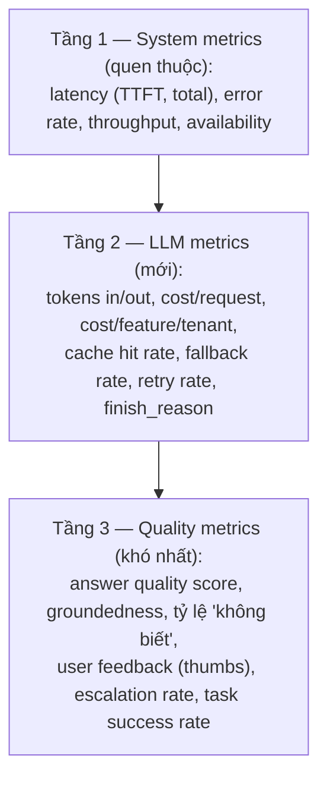
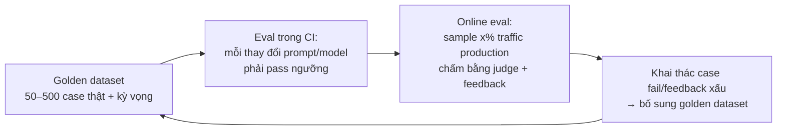

+++
title = "Chương 11 — AI Production: Observability, Evaluation, Guardrails, Cost & MLOps"
date = "2026-07-18T08:50:00+07:00"
draft = false
tags = ["backend", "ai", "llm"]
series = ["AI cho Backend Engineer"]
+++

## 1. Problem Statement

Hệ thống AI của bạn đã chạy. Tuần sau, PM hỏi: "Chatbot dạo này trả lời tệ hơn phải không?" — bạn không có số liệu để xác nhận hay bác bỏ. Kế toán hỏi: "8.000$ tiền API tháng này là của tính năng nào?" — không biết. Dev sửa prompt fix một bug, ba bug mới xuất hiện ở case khác — không ai phát hiện trong 2 tuần.

Phần mềm truyền thống có mạng lưới an toàn: type system, unit test, error rate. AI production **mặc định không có gì** — response 200 OK có thể là câu trả lời sai hoàn toàn. Chương này xây lại mạng lưới an toàn đó cho hệ thống non-deterministic.

## 2. Tại sao nó tồn tại

- **Business Problem**: chất lượng AI là chất lượng sản phẩm; chi phí AI là variable cost cần quy về đơn vị kinh doanh; sự cố AI là sự cố uy tín.
- **Engineering Problem**: "đúng/sai" của LLM không quan sát được bằng HTTP status — cần hệ đo lường riêng.
- **AI Problem**: hành vi model thay đổi theo prompt, model version, phân phối input — trôi dạt âm thầm nếu không đo liên tục.

## 3. First Principles

### 3.1. Observability — ba tầng



Đơn vị quan sát trung tâm là **trace**: một request AI = chuỗi span (retrieval → rerank → LLM call 1 → tool → LLM call 2), mỗi span mang prompt version, model, tokens, cost, latency. Chuẩn hiện hành: OpenTelemetry GenAI semantic conventions; công cụ chuyên dụng: Langfuse, Phoenix, LangSmith, Braintrust. Nguyên tắc riêng của GenAI: **lưu được cả nội dung prompt/response** (có kiểm soát PII) — vì debug AI là đọc lại chính văn bản, không chỉ nhìn số.

### 3.2. Evaluation — "unit test" của hệ AI

Không có eval thì mọi thay đổi (prompt, model, chunking) là đánh cược. Ba cơ chế chấm, xếp theo chi phí:

1. **Code-based check** (rẻ, chạy mọi nơi): output đúng schema? có citation? độ dài hợp lệ? chứa từ cấm? regression chính xác cho task có đáp án đúng (classification, extraction).
2. **LLM-as-judge** (trung bình): dùng model mạnh chấm output theo rubric (đúng trọng tâm? grounded vào context? giọng điệu?). Lưu ý: judge cũng có bias (thiên vị câu dài, thiên vị output của chính họ model) — phải **calibrate judge với người** trên mẫu nhỏ trước khi tin.
3. **Human review** (đắt, chuẩn vàng): duyệt mẫu định kỳ + các case eval tự động flag.

Vòng đời eval:



Golden dataset lấy từ **traffic thật** (ẩn danh hóa), không phải case tự nghĩ — phân phối input thật luôn lạ hơn tưởng tượng.

### 3.3. Guardrails — kiểm soát vào/ra runtime

- **Input guardrails**: chặn prompt injection pattern, off-topic, PII không được phép vào (Chương 12).
- **Output guardrails**: schema validation, content policy (từ ngữ, chủ đề cấm), **groundedness check** (câu trả lời có được context hỗ trợ không — một model nhỏ kiểm tra), business rule (không hứa hoàn tiền, không tư vấn pháp lý).
- Vị trí: chạy trong đường response; với streaming — quét theo đoạn, chấp nhận trade-off (chặn sớm hơn = TTFT chậm hơn).
- Nguyên tắc: guardrail **fail-closed cho hành động** (không chắc thì không thực thi tool), **fail-open có nhãn cho nội dung** (không chắc thì thêm disclaimer/escalate) — tùy khẩu vị rủi ro từng tính năng.

### 3.4. Hallucination Detection

Không có máy phát hiện nói dối hoàn hảo; production dùng tổ hợp:

- **Groundedness scoring** (RAG): mọi claim trong câu trả lời phải map được về chunk nguồn — chấm bằng NLI model/LLM judge; câu trả lời điểm thấp → chặn hoặc gắn cảnh báo.
- **Citation enforcement**: buộc trích dẫn; câu không có nguồn là tín hiệu đỏ.
- **Self-consistency** (case rủi ro cao): hỏi 2–3 lần, câu trả lời mâu thuẫn nhau → độ tin thấp → escalate. Chi phí ×3, chỉ cho luồng quan trọng.
- **Confidence elicitation**: yêu cầu model tự báo độ chắc chắn + "insufficient_information" — không hoàn hảo nhưng lọc được phần thô.

### 3.5. Cost Optimization — thứ tự đòn bẩy

Theo ROI giảm dần, đã kiểm chứng rộng rãi:

1. **Đo và attribute trước đã** — không đo được thì mọi tối ưu là mù.
2. **Cắt token thừa**: system prompt phình, history không nén, top_k quá tay, output không giới hạn — thường tiết kiệm 30–50% mà không đổi kiến trúc.
3. **Prompt caching của provider**: cấu trúc prompt static-trước-dynamic-sau — giảm mạnh chi phí input lặp.
4. **Model routing**: task dễ xuống model rẻ (Chương 08) — tiết kiệm lớn nhất về dài hạn.
5. **Response caching** (exact → semantic có kiểm soát).
6. **Batch API** cho offline work: provider giảm ~50% cho batch chấp nhận trễ 24h — mọi pipeline không realtime nên đi đường này.
7. Fine-tune model nhỏ thay model lớn cho task hẹp volume cực lớn — đòn cuối, sau khi mọi đòn trên đã dùng.

## 4. Internal Architecture — Prompt Versioning, A/B, Rollback (MLOps cho LLM app)

### 4.1. Prompt là deployable artifact

```
Prompt Registry (DB/Git):
  prompt_id, version, content, model, params, schema, eval_score, status (draft/canary/live/retired)
```

Vòng đời: sửa prompt → chạy eval CI → pass → deploy **canary** (5% traffic) → so metric canary vs control → promote hoặc rollback. Rollback prompt phải **tức thời** (đổi con trỏ version trong registry, không cần deploy code) — đây là ưu thế lớn nhất của việc tách prompt khỏi code.

### 4.2. A/B testing đặc thù AI

- So sánh 2 prompt version / 2 model trên traffic thật; metric: quality score (judge), thumbs rate, escalation rate, cost, latency — **không chỉ engagement** (câu trả lời dài hấp dẫn hơn có thể sai nhiều hơn).
- Ràng buộc: một session dính một variant (không đổi giữa hội thoại); log variant vào trace; đủ mẫu mới kết luận — quality score có phương sai cao hơn CTR truyền thống.

### 4.3. Model upgrade — quy trình

Provider deprecate model cũ định kỳ; nâng version model là **thay đổi hành vi toàn hệ thống**:

```
Pin version cụ thể → khi có model mới: chạy full eval offline
→ lệch ngưỡng? điều chỉnh prompt → canary 5% → theo dõi 1–2 tuần → promote
→ giữ đường rollback đến khi model cũ thật sự bị tắt
```

### 4.4. Dashboard & Alert tối thiểu

| Dashboard | Nội dung |
|---|---|
| Cost | $/ngày theo feature/team/model; cost per request trend; % budget tháng đã dùng |
| Performance | TTFT/total p50-p95-p99; error/retry/fallback rate theo provider |
| Quality | judge score trend; thumbs down rate; "không biết" rate; escalation rate; groundedness |
| Usage | requests, tokens, cache hit, phân phối theo intent |

Alert nên có ngay từ đầu: chi phí ngày > 150% trung bình 7 ngày; fallback rate > 5%; p95 TTFT vượt SLO; thumbs-down spike; guardrail block spike (dấu hiệu tấn công hoặc regression).

## 5. Trade-off

- **Độ phủ eval vs tốc độ ship**: eval 500 case × judge model là tiền và thời gian CI; mức hợp lý: bộ nhỏ (50) chạy mỗi PR, bộ đầy đủ chạy nightly/trước release.
- **Guardrail chặt vs UX**: mỗi tầng kiểm tra thêm latency và false positive (chặn nhầm câu hợp lệ làm người dùng bực). Tinh chỉnh bằng số liệu block-rate + khiếu nại, không bằng cảm giác.
- **Log đầy đủ vs privacy**: nội dung prompt/response là dữ liệu debug quý nhất nhưng chứa PII — chính sách: mask tự động, TTL ngắn cho nội dung thô, quyền truy cập theo vai trò, opt-out theo tenant.
- **Sampling online eval**: 100% là quá đắt; 1–5% + oversample các case có tín hiệu xấu (thumbs down, escalation, guardrail hit) là điểm cân bằng phổ biến.

## 6. Production Considerations

- Chuẩn hóa **AI middleware** ngay từ request đầu tiên: mọi LLM call tự động sinh trace + metering — retrofit sau đắt gấp mười.
- Golden dataset là tài sản có chủ (owner, review định kỳ, version) — dataset chết thì eval thành hình thức.
- Phân biệt 3 loại thay đổi và quy trình tương ứng: đổi prompt (eval CI + canary), đổi model (full eval + canary dài), đổi pipeline RAG (re-index + recall check + eval end-to-end).
- Post-mortem sự cố AI phải trả lời thêm: phát hiện bằng metric nào? nếu bằng khiếu nại của user — thiếu metric gì? (Chương 13 là danh mục sự cố để diễn tập.)

## 7. Anti-patterns

- **Ship rồi mới nghĩ đến đo** — không có baseline thì "AI dạo này tệ hơn" mãi mãi là tranh cãi cảm tính.
- **Eval một lần lúc launch** — model drift, input drift, prompt được sửa dần: chất lượng là dòng chảy, không phải chốt kiểm một lần.
- **Tin judge tuyệt đối** — judge chưa calibrate với người là một nguồn ảo giác nữa.
- **Tối ưu chi phí bằng model rẻ hơn trước khi cắt token thừa** — đổi 30% chất lượng lấy khoản tiết kiệm mà việc nén history làm được miễn phí.
- **Alert theo error rate HTTP** — hệ AI hỏng thầm lặng với 200 OK; alert phải đứng trên quality metrics.
- **Prompt sửa thẳng trên production "vì chỉ là text"** — text đó là behavior của hệ thống.

## 8. Best Practices

- Ngày 1 của mọi tính năng AI: trace + cost metering + 20 case golden + 1 dashboard. Bốn thứ này rẻ khi làm sớm, đắt khi làm muộn.
- Gắn **feedback loop vào sản phẩm** (thumbs, "báo lỗi câu trả lời") — nguồn eval case rẻ và thật nhất.
- Review "AI quality report" hằng tuần như review error budget: score trend, top failure, cost trend, action items.
- Mọi số liệu quality gắn với (prompt_version, model_version, index_version) — không có bộ ba này thì không trả lời được "vì sao tuần này tệ đi".
- Diễn tập rollback prompt/model như diễn tập rollback deploy.

## 9. Khi nào KHÔNG cần mức đầu tư này

Internal tool < 100 user, rủi ro thấp: trace + cost log + 20 case smoke test là đủ; đừng dựng bộ máy eval/canary đầy đủ cho tool nội bộ. Ngược lại, tính năng đối mặt khách hàng, có hành động, hoặc chi phí > vài nghìn $/tháng: mọi mục trong chương này là bắt buộc, câu hỏi chỉ là thứ tự.

---

**Chương tiếp theo**: [12 — Security](/series/ai-for-backend-engineers/12-security/) — prompt injection, jailbreak, data leakage và cách phòng thủ theo tầng.
