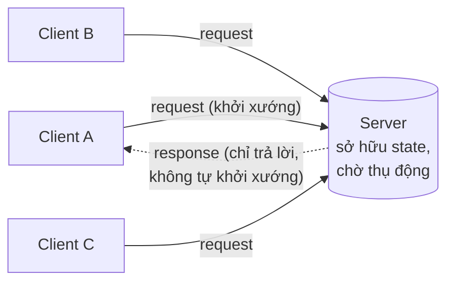
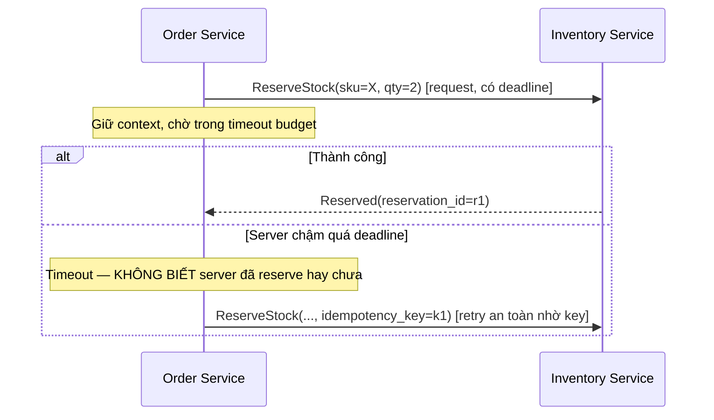
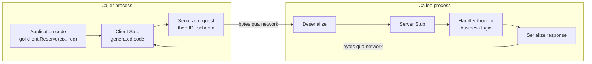
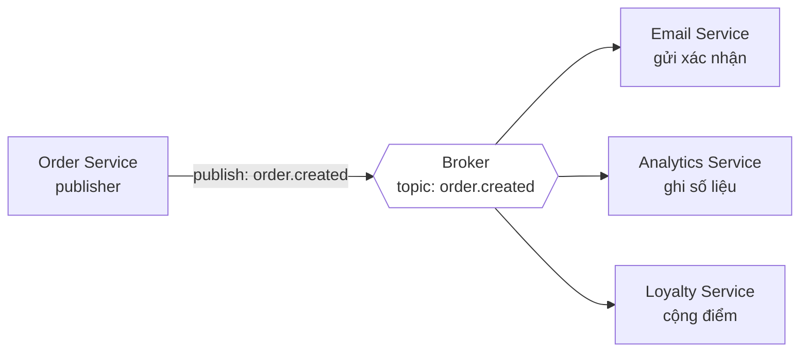
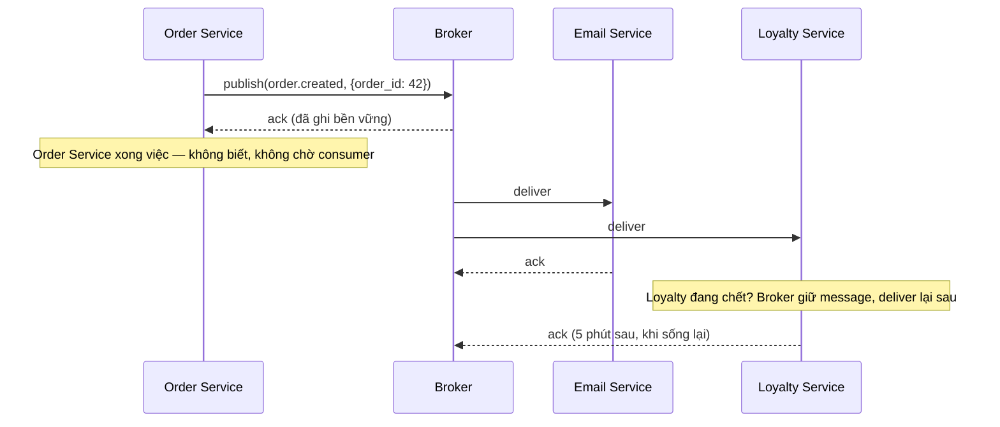
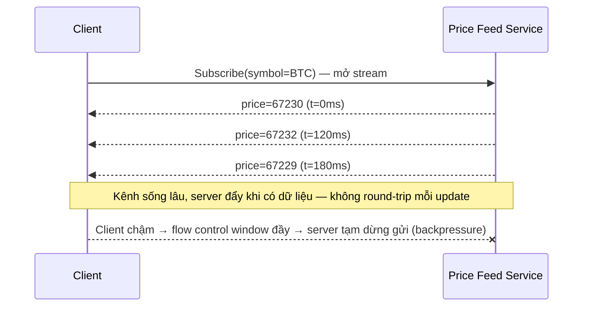
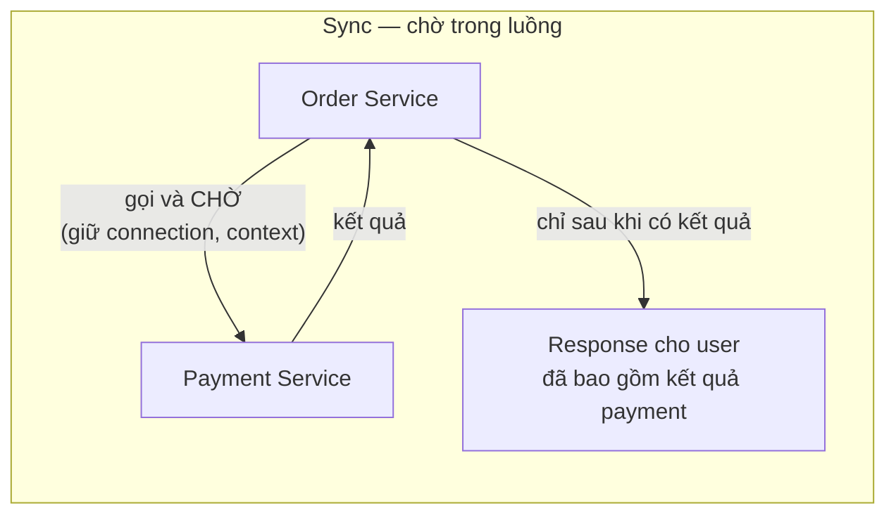
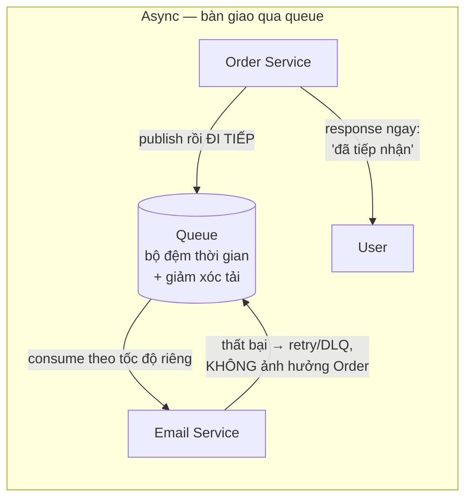
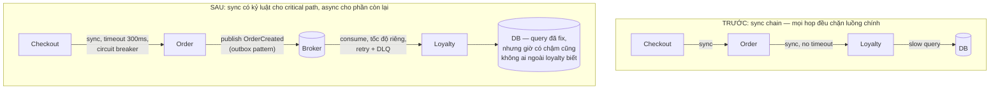

+++
title = "Chương 1: Communication Fundamentals — Vì sao hệ thống cần giao tiếp"
date = "2026-02-22T07:00:00+07:00"
draft = false
tags = ["backend", "communication", "api", "architecture"]
series = ["Backend Communication Architecture"]
+++

← Mục lục | [Chương sau →](/series/backend-communication-architect/02-http/)

---

## 1. Problem Statement: Từ một function call đến một network call

Hãy bắt đầu từ một tình huống kinh doanh có thật, không phải từ định nghĩa.

Công ty của bạn vận hành một hệ thống thương mại điện tử. Ba năm trước, toàn bộ hệ thống là một monolith viết bằng Go: module `order` gọi module `inventory` bằng một function call, module `payment` gọi module `notification` bằng một method trên struct. Mọi thứ chạy trong **cùng một process, cùng một address space, cùng một failure domain**. Một lời gọi hàm mất vài chục nanosecond, không bao giờ "mất gói tin", không bao giờ trả về một nửa kết quả, và hoặc là cả process sống, hoặc là cả process chết — không có trạng thái lưng chừng.

Rồi doanh nghiệp lớn lên và tạo ra ba áp lực mà monolith không giải được:

- **Áp lực về tổ chức (organizational scale):** 8 kỹ sư trở thành 80 kỹ sư. Mỗi lần deploy monolith cần phối hợp 6 team, mỗi hotfix của team payment buộc team search phải regression test lại. Tốc độ giao hàng (lead time) tăng từ 1 ngày lên 2 tuần. Đây là hệ quả trực tiếp của Conway's Law: kiến trúc hệ thống phản chiếu cấu trúc giao tiếp của tổ chức, và khi tổ chức phân mảnh, hệ thống buộc phải phân mảnh theo.
- **Áp lực về tài nguyên (resource scale):** Module recommendation cần GPU và nhiều RAM, module checkout cần latency thấp và độ ổn định tuyệt đối. Nhồi chúng vào cùng một binary nghĩa là scale cả hai theo cấu hình đắt nhất, và một memory leak trong recommendation kéo sập checkout — nơi tạo ra doanh thu.
- **Áp lực về độ tin cậy (fault isolation):** Business yêu cầu checkout phải đạt 99.95% availability, nhưng module export báo cáo chỉ cần 99%. Trong monolith, cả hai chia sẻ chung một failure domain nên mọi module đều bị kéo về mức SLA của module tệ nhất.

Giải pháp là tách hệ thống thành nhiều process/service độc lập. Và ngay khoảnh khắc bạn tách `inventory` ra khỏi process của `order`, một điều căn bản đã thay đổi mà nhiều team chỉ nhận ra sau sự cố đầu tiên:

> **Function call trở thành network call. Và network call là một loài sinh vật hoàn toàn khác.**

Nếu không hiểu bản chất của giao tiếp qua network — các mô hình, mức độ coupling, mô hình latency và mô hình failure của từng lựa chọn — thì hệ quả không phải là "code xấu", mà là những sự cố production rất cụ thể: cascade failure lúc 2 giờ sáng vì một service chậm kéo theo toàn bộ chuỗi gọi; đơn hàng bị trừ tiền hai lần vì retry không idempotent; queue phình 40 triệu message vì consumer chết mà không ai biết. Chương này xây nền móng để các chương sau (HTTP, REST, gRPC, message queue, event streaming) có chỗ đứng.

### Nếu không có "communication architecture" thì sao?

Nhiều team tách service nhưng không thiết kế giao tiếp — họ chỉ "gọi HTTP cho nhanh". Hệ quả điển hình sau 12–18 tháng:

- **Distributed monolith:** các service gọi nhau đồng bộ theo chuỗi sâu 5–7 tầng. Về mặt deploy thì tách, về mặt runtime thì vẫn là một khối: một service chết, cả chuỗi chết. Bạn trả toàn bộ chi phí của distributed system (latency, độ phức tạp vận hành) mà không nhận được lợi ích nào (fault isolation, independent scaling).
- **Availability nhân lên theo chiều xấu:** nếu mỗi service đạt 99.9% và một request đi qua 5 service đồng bộ nối tiếp, availability của cả chuỗi là 0.999^5 ≈ 99.5% — tức từ ~43 phút downtime/tháng thành ~3.6 giờ/tháng, mà không ai chủ động quyết định điều đó.
- **Latency cộng dồn không kiểm soát:** mỗi hop thêm serialization + network round-trip + queueing. Chuỗi 6 hop với p99 mỗi hop 50ms dễ dàng tạo ra p99 tổng trên 500ms vì tail latency cộng hưởng (tail amplification).

Vậy câu hỏi đúng không phải là "dùng REST hay gRPC hay Kafka", mà là: **hai hệ thống này cần loại quan hệ giao tiếp nào — coupling ở mức nào, chịu được failure kiểu gì, latency budget bao nhiêu — rồi mới chọn công cụ.**

---

## 2. Vì sao vấn đề này tồn tại: Network không phải là function call

### 2.1. Sự khác biệt bản chất

Khi `order.Reserve(sku)` là một function call trong cùng process:

- Nó **luôn đến nơi**: không có khái niệm "gói tin thất lạc".
- Nó **luôn trả về đúng một lần**: hoặc kết quả, hoặc panic — không có trạng thái "không biết đã chạy hay chưa".
- Nó **rẻ đến mức bỏ qua được**: vài chục nanosecond, không cần nghĩ về số lần gọi.
- Nó **chia sẻ memory**: truyền con trỏ, không cần serialize.

Khi cùng lời gọi đó đi qua network, cả bốn điều trên sụp đổ. Một network call điển hình trong datacenter mất 0.5–2ms (chậm hơn function call khoảng **4–5 bậc độ lớn**), có thể thất bại theo hàng chục cách, và tệ nhất: có thể thất bại theo cách **bạn không biết nó đã thành công hay chưa** (request đến nơi, server xử lý xong, nhưng response bị mất). Trạng thái "không biết" này — ambiguous failure — là gốc rễ của gần như mọi bài toán khó trong distributed systems: idempotency, exactly-once delivery, distributed transaction.

### 2.2. Tám ngộ nhận của distributed computing (8 Fallacies)

Peter Deutsch và các kỹ sư Sun Microsystems đúc kết 8 giả định sai mà kỹ sư mới chuyển từ lập trình đơn máy sang distributed thường mắc. Chúng đáng được phân tích kỹ vì **mỗi fallacy tương ứng với một lớp sự cố production cụ thể**:

| # | Ngộ nhận | Thực tế | Sự cố production điển hình |
|---|----------|---------|---------------------------|
| 1 | The network is reliable | Packet loss, connection reset, partition xảy ra hằng ngày ở scale lớn | Request mất giữa chừng; nếu không có retry + idempotency, dữ liệu mất hoặc double-write |
| 2 | Latency is zero | Round-trip trong DC ~0.5ms, cross-region 50–150ms, mobile 100–500ms | Vòng lặp gọi N+1 network call biến trang 200ms thành 8 giây |
| 3 | Bandwidth is infinite | Băng thông có hạn và chia sẻ; NIC, switch, WAN link đều bão hòa được | Payload JSON 5MB/request làm nghẽn NIC, tăng GC pressure, tăng tail latency |
| 4 | The network is secure | Mạng nội bộ vẫn bị nghe lén, giả mạo, lateral movement | Service nội bộ không mTLS bị khai thác sau khi một pod bị chiếm |
| 5 | Topology doesn't change | Pod bị reschedule, IP đổi, autoscaler thêm/bớt node liên tục | Client cache DNS/connection tới IP cũ, trả lỗi hàng loạt sau khi deploy |
| 6 | There is one administrator | Nhiều team, nhiều vendor, nhiều policy khác nhau quản lý các phần của đường truyền | Firewall của team hạ tầng cắt idle connection sau 350s, connection pool của bạn giữ 400s → lỗi "connection reset" ngẫu nhiên |
| 7 | Transport cost is zero | Serialization tốn CPU, mỗi connection tốn memory, egress tốn tiền thật | Hóa đơn cross-AZ traffic tăng 10x sau khi tách service; CPU 30% chỉ để marshal JSON |
| 8 | The network is homogeneous | Đường truyền đi qua nhiều thiết bị, MTU khác nhau, proxy can thiệp khác nhau | HTTP/2 hoạt động trong DC nhưng bị proxy tầng giữa hạ xuống HTTP/1.1, mất multiplexing |

Điểm cần khắc sâu: các fallacy này **không phải là rủi ro hiếm gặp cần "lưu ý"** — ở quy mô hàng nghìn instance và hàng tỷ request/ngày, chúng là **sự kiện chắc chắn xảy ra mỗi ngày**. Kiến trúc giao tiếp tốt không cố loại bỏ chúng (bất khả thi) mà **thiết kế để hệ thống đúng đắn ngay cả khi chúng xảy ra**.

### 2.3. Hệ quả thiết kế rút ra từ first principles

Từ bản chất của network, ta rút ra ba tiên đề mà mọi mô hình giao tiếp phía sau đều phải trả lời:

1. **Mọi network call đều có thể thất bại theo cách mơ hồ** → mọi thao tác ghi qua network phải hoặc idempotent, hoặc có cơ chế deduplication, hoặc chấp nhận rủi ro double-processing một cách có chủ đích.
2. **Mọi network call đều tốn thời gian không xác định trước** → mọi call phải có timeout tường minh, và tổng latency của một luồng nghiệp vụ là một budget cần phân bổ có chủ đích cho từng hop.
3. **Hai bên giao tiếp tiến hóa độc lập** → format dữ liệu và contract phải có chiến lược versioning/compatibility ngay từ ngày đầu, không phải khi vỡ.

---

## 3. Khung phân tích: Ba trục coupling, latency model, failure model

Trước khi đi vào từng mô hình giao tiếp, cần một khung phân tích thống nhất. Với mỗi mô hình, ta sẽ hỏi ba nhóm câu hỏi:

### 3.1. Coupling — hai hệ thống ràng buộc nhau đến mức nào?

- **Temporal coupling (ràng buộc thời gian):** hai bên có cần **cùng sống tại cùng thời điểm** để giao tiếp thành công không? Sync request-response có temporal coupling cao nhất: callee chết là caller thất bại ngay. Message queue phá vỡ ràng buộc này: producer gửi lúc 10:00, consumer có thể xử lý lúc 10:05 khi nó sống lại.
- **Spatial coupling (ràng buộc vị trí/danh tính):** caller có cần biết **cụ thể ai** sẽ xử lý message không? Gọi trực tiếp `inventory-service:8080` là spatial coupling cao. Publish vào topic `order.created` là spatial coupling thấp: publisher không biết và không cần biết có 0, 1 hay 7 consumer.
- **Format coupling (ràng buộc schema):** hai bên ràng buộc nhau qua cấu trúc dữ liệu chặt đến đâu, và ai kiểm soát sự tiến hóa của schema? Đây là loại coupling **không mô hình nào loại bỏ được** — dù async đến đâu, nếu consumer không hiểu message thì giao tiếp vẫn thất bại. Async chỉ làm format coupling **khó thấy hơn** (lỗi xuất hiện muộn, ở nơi khác), vì vậy các hệ event-driven trưởng thành đều cần schema registry.

### 3.2. Latency model — thời gian đi đâu?

Latency của một lần giao tiếp = serialization + transmission + propagation + **queueing** + processing + đường về. Điểm then chốt: ở hệ thống chịu tải, **queueing delay chiếm phần lớn tail latency** và tăng phi tuyến khi utilization tiến gần 100% (theo lý thuyết hàng đợi, thời gian chờ tỷ lệ với ρ/(1−ρ)). Vì vậy so sánh các mô hình bằng latency trung bình là vô nghĩa; phải nhìn **phân phối (p50/p99/p99.9)** và cách mô hình đó hành xử khi quá tải.

### 3.3. Failure model — thất bại trông như thế nào và ai gánh?

Với mỗi mô hình, hỏi: khi bên nhận chết/chậm, bên gửi thấy gì? Failure lan truyền (cascade) hay được hấp thụ (absorb)? Có trạng thái mơ hồ không, và ai chịu trách nhiệm giải quyết (retry, dedup, reconcile)?

---

## 4. Các mô hình giao tiếp — bản chất từng loại

### 4.1. Client-Server

**Bản chất:** phân vai bất đối xứng. Một bên (server) sở hữu tài nguyên/trạng thái và **chờ đợi thụ động**; bên kia (client) **khởi xướng** mọi tương tác. Đây không phải một giao thức mà là một **cấu trúc quyền lực**: server không bao giờ tự tìm đến client (trong mô hình thuần túy), nên mọi vấn đề "server muốn báo cho client" (push) đều phải giải quyết bằng kỹ thuật bổ sung — polling, long-polling, WebSocket, server push — sẽ phân tích ở mục Push vs Pull.



- **Coupling:** temporal cao (server phải sống khi client gọi), spatial cao (client phải biết địa chỉ server — dù có thể gián tiếp qua DNS/LB), format tùy giao thức.
- **Latency model:** 1 round-trip cho mỗi tương tác, cộng chi phí thiết lập connection nếu chưa có (chương 2 sẽ mổ xẻ chi phí này với TCP/TLS).
- **Failure model:** failure **hiển hiện tức thời** với client — đây vừa là nhược điểm (client phải xử lý) vừa là ưu điểm lớn (không có failure âm thầm; client biết ngay và có thể phản ứng).
- **Khi phù hợp:** gần như mọi tương tác có người dùng chờ kết quả, mọi truy vấn cần dữ liệu tức thời. Đây là mô hình mặc định đúng cho phần lớn giao tiếp — các mô hình khác tồn tại để giải các trường hợp mô hình này giải kém.

### 4.2. Request-Response

**Bản chất:** một **cặp message có tương quan** — mỗi request tương ứng đúng một response, và caller giữ context chờ response đó. Request-Response là một mô hình tương tác, độc lập với chuyện sync hay async ở tầng vận chuyển: bạn hoàn toàn có thể làm request-response qua message queue (gửi request vào queue A kèm `correlation_id`, chờ response ở queue B) — khi đó temporal coupling giảm nhưng bản chất "hỏi–đáp" vẫn giữ nguyên.



- **Coupling:** format coupling **cao nhất trong các mô hình** — caller phụ thuộc cả cấu trúc request lẫn cấu trúc response, và thường phụ thuộc cả ngữ nghĩa lỗi.
- **Latency model:** caller trả trọn vẹn chi phí round-trip trong luồng của mình. Chuỗi request-response nối tiếp cộng dồn tuyến tính; đây là lý do fan-out song song (gọi nhiều downstream đồng thời rồi gom kết quả) là kỹ thuật tối ưu quan trọng nhất của mô hình này.
- **Failure model:** timeout tạo ra **trạng thái mơ hồ kinh điển**: response không về không có nghĩa là request không được xử lý. Hệ quả bắt buộc: mọi request có side-effect phải mang idempotency key nếu muốn retry an toàn.
- **Khi phù hợp:** thao tác cần kết quả ngay để đi tiếp (kiểm tra tồn kho trước khi cho đặt hàng, xác thực token trước khi cho truy cập), truy vấn dữ liệu, mọi luồng có con người đang chờ.

### 4.3. RPC (Remote Procedure Call)

**Bản chất:** một **lớp trừu tượng đặt lên trên request-response** với tham vọng: làm cho network call *trông giống* function call — có signature, có kiểu dữ liệu, có stub tự sinh từ IDL (Interface Definition Language). Giá trị thật của RPC là **developer experience và contract chặt**: compiler bắt lỗi kiểu ngay lúc build thay vì runtime, code sinh tự động loại bỏ boilerplate marshal/unmarshal.

Nguy hiểm thật của RPC cũng nằm đúng ở tham vọng đó: sự giống nhau về cú pháp che giấu sự khác nhau về ngữ nghĩa. Bài học lịch sử (được tổng kết trong "A Note on Distributed Computing" của Waldo et al., 1994) vẫn nguyên giá trị: **không thể và không nên che giấu ranh giới network**. RPC framework hiện đại (gRPC là ví dụ tiêu biểu) đã học bài này — chúng phơi bày deadline, cancellation, status code, streaming ra API thay vì giấu đi.



- **Coupling:** format coupling rất cao nhưng **được quản lý tường minh** qua IDL — đây là điểm ăn tiền: schema evolution có luật chơi rõ (field number, optional, reserved). Temporal và spatial coupling giống request-response thuần.
- **Latency model:** như request-response, cộng thêm chi phí serialize/deserialize — thường thấp hơn JSON nhờ binary format, và ổn định hơn.
- **Failure model:** như request-response, nhưng framework thường cung cấp sẵn deadline propagation (deadline truyền xuyên suốt chuỗi gọi), status code chuẩn hóa, retry policy khai báo. Cạm bẫy: retry mặc định của framework + handler không idempotent = double-processing.
- **Khi phù hợp:** giao tiếp service-to-service nội bộ, nơi hai đầu do cùng tổ chức kiểm soát, tần suất gọi cao, cần contract chặt và hiệu năng serialize tốt.

### 4.4. Pub/Sub (Publish/Subscribe)

**Bản chất:** đảo ngược hướng phụ thuộc. Thay vì sender biết receiver ("gửi cho inventory-service"), sender chỉ biết **chủ đề** ("có đơn hàng mới, ai quan tâm thì nghe"). Một tầng trung gian (broker) nhận message theo topic và phân phối cho mọi subscriber. Đây là công cụ mạnh nhất để **giảm spatial coupling**: thêm consumer thứ N không đòi hỏi thay đổi gì ở producer.





- **Coupling:** spatial gần bằng không (publisher không biết subscriber), temporal thấp (broker làm bộ đệm thời gian), nhưng **format coupling vẫn nguyên vẹn và trở nên nguy hiểm hơn** — publisher đổi schema có thể làm gãy consumer mà không có lỗi nào ở phía publisher. Broker trở thành hạ tầng critical: mọi coupling với nhau được đổi lấy coupling với broker.
- **Latency model:** latency từ publish đến khi consumer xử lý xong (end-to-end lag) là **không có cận trên đảm bảo** — phụ thuộc độ sâu queue và tốc độ consumer. Publish latency thì thấp và ổn định (chỉ chờ broker ack).
- **Failure model:** failure của consumer **được hấp thụ** thay vì lan ngược về producer — đây là giá trị cốt lõi. Đổi lại, failure trở nên **âm thầm**: consumer chết, producer vẫn thấy mọi thứ bình thường, và bạn chỉ biết khi consumer lag đã thành 40 triệu message. Giám sát lag là bắt buộc, không phải tùy chọn.
- **Khi phù hợp:** một sự kiện có nhiều bên quan tâm; các xử lý hạ nguồn được phép trễ vài giây đến vài phút; cần thêm consumer trong tương lai mà không sửa producer.

### 4.5. Event-driven Architecture

**Bản chất:** Pub/Sub là **cơ chế vận chuyển**; event-driven là **triết lý thiết kế ngữ nghĩa** đặt lên trên nó. Sự khác biệt then chốt nằm ở loại message:

- **Command** ("ReserveStock"): mệnh lệnh, hướng tới một receiver cụ thể, mang **ý định của sender**, sender thường quan tâm kết quả. Command giữ nguyên hướng phụ thuộc: sender biết receiver phải làm gì.
- **Event** ("OrderCreated"): tuyên bố một **sự thật đã xảy ra**, ở thì quá khứ, bất biến, không hướng tới ai. Publisher không có ý định gì về việc ai sẽ làm gì với nó. Đây là sự đảo ngược phụ thuộc **về mặt ngữ nghĩa nghiệp vụ**: logic "khi có đơn hàng thì cộng điểm loyalty" sống ở Loyalty Service (nơi hiểu nghiệp vụ loyalty), không phải ở Order Service.

Hệ quả kiến trúc quan trọng: trong hệ event-driven, **workflow không tồn tại ở một nơi nào cả** — nó là kết quả nổi lên (emergent) từ chuỗi phản ứng của các service. Đây vừa là sức mạnh (mỗi service tự chủ hoàn toàn) vừa là chi phí lớn nhất: không ai nhìn thấy toàn cảnh luồng nghiệp vụ nếu không đầu tư vào distributed tracing và tài liệu hóa event flow. Với các workflow cần điều phối chặt (ví dụ saga có bù trừ), cân nhắc orchestration (một điều phối viên tường minh) thay vì choreography (phản ứng dây chuyền) — trade-off giữa "dễ hiểu luồng" và "tập trung phụ thuộc".

- **Coupling & failure:** như Pub/Sub, cộng thêm rủi ro ngữ nghĩa: event schema là **public API vĩnh viễn** — event đã publish thì không rút lại được, consumer 2 năm sau vẫn có thể replay nó.
- **Khi phù hợp:** domain có nhiều bounded context phản ứng với cùng sự kiện nghiệp vụ; cần audit trail tự nhiên; team muốn tự chủ deploy tối đa.

### 4.6. Streaming

**Bản chất:** thay đổi đơn vị giao tiếp từ **message rời rạc** sang **dòng chảy liên tục có thứ tự** trên một kênh sống lâu. Ba biến thể: server streaming (một request, dòng response — ví dụ tail log, live price), client streaming (dòng request, một response — ví dụ upload telemetry), bidirectional (hai dòng độc lập — ví dụ chat, collaborative editing). Ở tầng dữ liệu, event streaming (Kafka-style) còn thêm một bản chất nữa: **stream là một log bền vững có thể replay** — consumer mới có thể đọc lại từ đầu, điều Pub/Sub truyền thống không có.

Khái niệm sống còn của streaming là **backpressure**: khi consumer chậm hơn producer, hệ thống phải có cơ chế truyền tín hiệu "chậm lại" ngược dòng (flow control của HTTP/2, TCP window, hoặc pull-based consumption của Kafka). Không có backpressure, chỉ còn ba kết cục: buffer phình đến OOM, drop dữ liệu, hoặc block toàn bộ.



- **Coupling:** temporal cao trong suốt vòng đời stream (đứt kênh là mất giao tiếp — phải thiết kế reconnect + resume từ vị trí cũ), format coupling cao và **kéo dài** (đổi schema giữa stream đang chạy rất khó).
- **Latency model:** đây là điểm ăn tiền — sau khi thiết lập, mỗi message chỉ tốn one-way latency, không tốn round-trip, không tốn thiết lập connection. Với dữ liệu tần suất cao, streaming thắng request-response nhiều lần về cả latency lẫn chi phí.
- **Failure model:** connection đứt là failure mode trung tâm. Câu hỏi thiết kế bắt buộc: resume từ đâu (offset? sequence number?), phát hiện đứt bằng gì (heartbeat/keepalive — vì TCP không báo đứt kịp thời), và dedup thế nào khi resume trùng lặp.
- **Khi phù hợp:** dữ liệu thay đổi liên tục với tần suất cao, real-time UI, sync dữ liệu liên tục giữa hệ thống, xử lý sự kiện theo thứ tự với khả năng replay.

### 4.7. Push vs Pull

Đây là trục lựa chọn xuyên qua mọi mô hình trên: **ai là người khởi xướng việc chuyển dữ liệu khi dữ liệu mới xuất hiện?**

- **Pull (consumer khởi xướng):** consumer hỏi định kỳ hoặc khi cần. Ưu điểm mang tính quyết định: **consumer tự kiểm soát tốc độ nhận** — backpressure có sẵn miễn phí, consumer không bao giờ bị dội ngập. Nhược điểm: trade-off giữa độ trễ phát hiện dữ liệu mới và chi phí polling rỗng (poll mỗi 5s = trễ trung bình 2.5s + N request/s vô ích khi không có gì mới). Kafka consumer chọn pull chính vì lý do backpressure; Prometheus chọn pull vì phía thu thập kiểm soát được tải và topology.
- **Push (producer khởi xướng):** dữ liệu đến ngay khi có, không lãng phí polling. Nhược điểm đối xứng: producer phải biết/giữ kênh tới consumer (tăng spatial/temporal coupling), và **phải tự giải bài toán backpressure** — consumer chậm thì producer làm gì? (buffer, drop, block — phải chọn tường minh).
- **Thực tế production thường là lai:** push notification "có dữ liệu mới" (nhỏ, rẻ, được phép mất) + pull dữ liệu thật (consumer chủ động, có kiểm soát). Mẫu này tận dụng độ trễ thấp của push và sự an toàn của pull.

### 4.8. Sync vs Async — phân tích first principles

Đây là quyết định nền tảng nhất, cần mổ xẻ kỹ hơn cả. Định nghĩa chính xác trước đã, vì từ "async" bị dùng cho hai thứ khác nhau:

- **Async ở tầng lập trình** (non-blocking I/O, goroutine, callback): caller không chiếm thread trong khi chờ — nhưng **về mặt kiến trúc vẫn là sync** nếu luồng nghiệp vụ vẫn phải chờ kết quả mới đi tiếp. Go làm điều này tự động: code trông blocking nhưng runtime là non-blocking I/O.
- **Async ở tầng kiến trúc** (điều chương này bàn): luồng nghiệp vụ **không chờ** kết quả xử lý của bên kia để hoàn thành phần việc của mình. Order Service ghi đơn, publish event, trả lời khách "đặt hàng thành công" — việc gửi email xảy ra sau, ở nơi khác, thành bại không ảnh hưởng response.

Bốn trục trade-off ở mức first principles:

**Trục 1 — Blocking và tài nguyên chờ.** Sync nghĩa là mỗi request đang chờ downstream chiếm giữ tài nguyên (connection, memory của request context, slot trong pool). Khi downstream chậm lại, số request "đang chờ" tích tụ — đây chính là cơ chế vật lý của cascade failure: downstream chậm → upstream cạn pool → upstream của upstream cạn pool → sập dây chuyền. Async cắt đứt dây chuyền này bằng cách chuyển "chờ" thành "message nằm trong queue" — trạng thái chờ được lưu ở hạ tầng bền vững thay vì trong memory của process đang sống.

**Trục 2 — Backpressure và hấp thụ đột biến.** Sync có backpressure tự nhiên: downstream chậm thì caller chậm theo, tải tự giảm từ nguồn (dù cách "tự giảm" này chính là cascade nếu không có timeout/circuit breaker). Async hấp thụ burst tốt hơn hẳn — queue là bộ giảm xóc — nhưng tạo ra rủi ro mới: **queue không giới hạn là một lời hứa suông**. Nếu tốc độ vào lớn hơn tốc độ ra trong thời gian dài, queue phình vô hạn, lag tăng vô hạn, và message "thành công" trở nên vô nghĩa (email xác nhận gửi sau 6 giờ). Hệ async trưởng thành luôn có giới hạn queue + chính sách khi đầy (drop, reject, degrade) — tức là chủ động đưa backpressure quay trở lại.

**Trục 3 — Consistency.** Sync cho phép read-your-writes trong một luồng: gọi xong, kết quả đã có, đọc lại thấy ngay. Async đồng nghĩa **eventual consistency là mặc định**: sau khi publish `OrderCreated`, tồn kho chưa trừ ngay — có một cửa sổ thời gian hệ thống "sai" một cách có chủ đích. Câu hỏi đúng không phải "eventual consistency có chấp nhận được không" (kỹ thuật), mà là **"nghiệp vụ chịu được cửa sổ không nhất quán bao lâu, và UX xử lý cửa sổ đó thế nào"** (sản phẩm). Nhiều nghiệp vụ chịu được tốt hơn ta tưởng (email trễ 30s vô hại); một số tuyệt đối không (trừ tiền phải thấy ngay số dư mới).

**Trục 4 — Complexity dịch chuyển chứ không biến mất.** Sync đơn giản ở development (đọc code từ trên xuống là hiểu luồng, stack trace liền mạch, test dễ) nhưng phức tạp ở runtime resilience (phải tự xây timeout, retry, circuit breaker, bulkhead để không sập dây chuyền). Async đơn giản ở resilience (cách ly failure có sẵn từ kiến trúc) nhưng phức tạp ở mọi thứ khác: luồng nghiệp vụ vô hình, debug cần tracing xuyên broker, test integration khó, phải xử lý duplicate/out-of-order/poison message, và cần vận hành thêm một hệ broker HA. **Tổng độ phức tạp không giảm — nó dịch chuyển từ code sang topology.** Chọn sync/async là chọn nơi bạn muốn trả chi phí phức tạp.





---

## 5. Bảng so sánh các mô hình

| Tiêu chí | Request-Response (sync) | RPC | Pub/Sub | Event-driven | Streaming |
|---|---|---|---|---|---|
| Temporal coupling | Cao — hai bên phải cùng sống | Cao | Thấp — broker đệm thời gian | Thấp | Cao trong vòng đời stream |
| Spatial coupling | Cao — biết địa chỉ callee | Cao (qua service discovery) | Rất thấp — chỉ biết topic | Rất thấp | Trung bình — biết endpoint stream |
| Format coupling | Cao | Cao, quản lý qua IDL | Cao nhưng **ẩn** — cần schema registry | Cao, event là API vĩnh viễn | Cao, kéo dài suốt stream |
| Latency nhận kết quả | 1 RTT — thấp và đoán được | 1 RTT | Không đảm bảo cận trên (phụ thuộc lag) | Không đảm bảo | One-way sau khi thiết lập — thấp nhất cho dữ liệu liên tục |
| Failure hiển thị với sender | Tức thời, tường minh | Tức thời, status chuẩn hóa | Âm thầm — cần giám sát lag | Âm thầm | Đứt kênh — cần heartbeat + resume |
| Hấp thụ burst | Kém — quá tải lan ngược | Kém | Tốt — queue là giảm xóc | Tốt | Trung bình — flow control |
| Consistency tự nhiên | Read-your-writes | Read-your-writes | Eventual | Eventual | Theo thứ tự trong stream |
| Chi phí vận hành thêm | Thấp | Trung bình (IDL toolchain) | Cao — broker HA, lag monitoring | Cao + schema governance | Cao — quản lý kênh dài hạn |
| Phù hợp nhất cho | User đang chờ kết quả | Service-to-service nội bộ tần suất cao | Một sự kiện, nhiều bên nghe | Nghiệp vụ phản ứng theo sự kiện | Dữ liệu liên tục tần suất cao |

Bảng benchmark minh họa độ lớn tương đối của các loại chi phí (**số liệu minh họa, phụ thuộc môi trường** — đo trên hạ tầng của bạn trước khi quyết định):

| Thao tác | Độ trễ điển hình | Ghi chú |
|---|---|---|
| Function call trong process | ~1–50 ns | Mốc so sánh |
| Mutex lock/unlock | ~20–50 ns | |
| Đọc 1MB từ RAM | ~50–100 µs | |
| Round-trip cùng AZ trong datacenter | ~0.3–1 ms | Chậm hơn function call ~10^4–10^5 lần |
| Round-trip cross-AZ | ~1–3 ms | Cộng thêm chi phí egress |
| Round-trip cross-region (liên lục địa) | ~60–150 ms | Giới hạn bởi tốc độ ánh sáng — không tối ưu được |
| TCP + TLS 1.3 handshake (cùng region) | ~2–5 ms | Chi tiết ở chương 2 |
| Serialize/deserialize JSON 10KB | ~20–100 µs mỗi chiều | Tốn CPU, tạo garbage |
| Publish → broker ack (Kafka, acks=all, cùng DC) | ~2–10 ms | Publish latency, không phải end-to-end |
| End-to-end lag Pub/Sub khi consumer khỏe | ~5–50 ms | Khi consumer quá tải: không có cận trên |

---

## 6. Ví dụ Golang: sync call vs async qua channel/queue

Ví dụ chạy được, mô phỏng đúng bài toán ở đầu chương: Order Service cần Inventory (bắt buộc, sync) và Email (không bắt buộc, async). Channel nội bộ ở đây đóng vai trò minh họa cho message queue — trong production, hàng đợi này phải là hạ tầng bền vững (Kafka, RabbitMQ, SQS...) vì channel trong memory **mất sạch khi process chết** (sẽ phân tích ở mục failure example).

```go
// Chạy: go run main.go
// Minh họa: sync call (chờ kết quả, timeout, lan truyền failure)
// vs async qua queue (bàn giao, cách ly failure, graceful shutdown).
package main

import (
	"context"
	"errors"
	"fmt"
	"log"
	"math/rand"
	"sync"
	"time"
)

// ---------- Phía SYNC: Inventory — bắt buộc phải có kết quả mới đi tiếp ----------

type InventoryClient struct{}

// Reserve mô phỏng một network call: có độ trễ, có thể thất bại.
// Nhận ctx để caller kiểm soát deadline — nguyên tắc số 1 của sync call:
// KHÔNG BAO GIỜ chờ vô hạn. Mọi network call phải có cận trên thời gian.
func (c *InventoryClient) Reserve(ctx context.Context, sku string, qty int) (string, error) {
	delay := time.Duration(20+rand.Intn(80)) * time.Millisecond // mô phỏng RTT + processing
	select {
	case <-time.After(delay):
		if rand.Intn(10) == 0 { // mô phỏng fallacy #1: network is NOT reliable
			return "", errors.New("inventory: connection reset")
		}
		return fmt.Sprintf("rsv-%s-%d", sku, rand.Intn(9999)), nil
	case <-ctx.Done():
		// Deadline hết TRƯỚC khi có kết quả. Lưu ý trạng thái mơ hồ:
		// server có thể ĐÃ reserve. Production cần idempotency key để retry an toàn.
		return "", fmt.Errorf("inventory: %w", ctx.Err())
	}
}

// ---------- Phía ASYNC: Email — bàn giao qua queue, không chờ ----------

type EmailTask struct {
	OrderID string
	To      string
}

// EmailQueue bọc channel CÓ GIỚI HẠN. Quyết định thiết kế quan trọng nhất:
// queue không giới hạn = hứa suông. Khi đầy, ta phải CHỌN tường minh
// giữa block / drop / reject — ở đây chọn reject để caller tự quyết.
type EmailQueue struct {
	tasks chan EmailTask
	wg    sync.WaitGroup
}

func NewEmailQueue(capacity, workers int) *EmailQueue {
	q := &EmailQueue{tasks: make(chan EmailTask, capacity)}
	for i := 0; i < workers; i++ {
		q.wg.Add(1)
		go q.worker(i)
	}
	return q
}

// Enqueue KHÔNG block: nếu queue đầy, trả lỗi ngay (backpressure tường minh).
// Caller quyết định: log và bỏ qua (email không critical) hay degrade cách khác.
func (q *EmailQueue) Enqueue(t EmailTask) error {
	select {
	case q.tasks <- t:
		return nil
	default:
		return errors.New("email queue full — backpressure")
	}
}

func (q *EmailQueue) worker(id int) {
	defer q.wg.Done()
	for t := range q.tasks { // channel đóng + cạn → vòng lặp kết thúc
		// Consumer xử lý theo tốc độ CỦA NÓ — temporal decoupling.
		time.Sleep(time.Duration(100+rand.Intn(200)) * time.Millisecond)
		if rand.Intn(5) == 0 {
			// Email fail KHÔNG ảnh hưởng đơn hàng — failure được cách ly.
			// Production: retry với backoff, quá N lần thì đẩy vào dead-letter queue.
			log.Printf("[email-worker-%d] FAILED order=%s (sẽ vào DLQ ở production)", id, t.OrderID)
			continue
		}
		log.Printf("[email-worker-%d] sent confirmation for order=%s", id, t.OrderID)
	}
}

// Close: graceful shutdown — ngừng nhận task mới, chờ xử lý nốt task đang có.
// Thiếu bước này, mọi task trong queue biến mất khi process tắt.
func (q *EmailQueue) Close() {
	close(q.tasks)
	q.wg.Wait()
}

// ---------- Order Service: kết hợp hai mô hình theo đúng bản chất nghiệp vụ ----------

type OrderService struct {
	inventory *InventoryClient
	emails    *EmailQueue
}

func (s *OrderService) PlaceOrder(ctx context.Context, sku string, qty int) (string, error) {
	// SYNC vì nghiệp vụ đòi hỏi: không có hàng thì KHÔNG ĐƯỢC tạo đơn.
	// Budget 100ms — con số này là quyết định kiến trúc, xuất phát từ
	// latency budget tổng của endpoint, không phải con số tùy hứng.
	rctx, cancel := context.WithTimeout(ctx, 100*time.Millisecond)
	defer cancel()

	rsv, err := s.inventory.Reserve(rctx, sku, qty)
	if err != nil {
		return "", fmt.Errorf("place order: %w", err) // failure hiển hiện — user biết ngay
	}

	orderID := fmt.Sprintf("ord-%d", rand.Intn(99999))

	// ASYNC vì nghiệp vụ cho phép: email trễ 30 giây vô hại,
	// và email service chết không được quyền chặn việc bán hàng.
	if err := s.emails.Enqueue(EmailTask{OrderID: orderID, To: "gavin@smartbit.one"}); err != nil {
		log.Printf("order %s created but email skipped: %v", orderID, err) // degrade có chủ đích
	}

	return orderID + " (reservation " + rsv + ")", nil
}

func main() {
	rand.Seed(time.Now().UnixNano())
	svc := &OrderService{
		inventory: &InventoryClient{},
		emails:    NewEmailQueue(64, 2), // capacity và concurrency là quyết định tường minh
	}

	for i := 0; i < 5; i++ {
		start := time.Now()
		id, err := svc.PlaceOrder(context.Background(), "sku-123", 2)
		if err != nil {
			log.Printf("order FAILED in %v: %v", time.Since(start), err)
			continue
		}
		// Quan sát: latency của PlaceOrder CHỈ gồm inventory call.
		// Email không đóng góp — đó chính là giá trị của async.
		log.Printf("order OK in %v: %s", time.Since(start), id)
	}

	svc.emails.Close() // chờ email worker xử lý nốt trước khi thoát
}
```

Ba quyết định thiết kế cần rút ra từ ví dụ: thứ nhất, **sync/async được chọn theo ngữ nghĩa nghiệp vụ** (inventory là điều kiện tiên quyết → sync; email là hệ quả cho phép trễ → async), không theo sở thích công nghệ. Thứ hai, **mọi ranh giới đều có cận trên tường minh** — timeout cho sync call, capacity cho queue — vì "vô hạn" trong distributed system luôn là một failure mode đang chờ ngày phát nổ. Thứ ba, **chính sách khi vượt cận trên được viết ra thành code** (trả lỗi, degrade, log) thay vì để hệ thống tự chọn cách chết.

---

## 7. Production: vận hành các mô hình giao tiếp

Những nguyên tắc chung áp dụng cho mọi mô hình — các chương sau sẽ chi tiết hóa cho từng công nghệ:

- **Timeout ở mọi ranh giới, phân bổ theo budget:** endpoint có SLO 300ms thì các hop bên trong phải chia nhau ngân sách đó (ví dụ 100ms inventory + 150ms payment + dự phòng), và deadline nên truyền xuôi dòng (deadline propagation) để hop cuối không làm việc vô ích cho một request đã hết hạn ở đầu chuỗi.
- **Retry có kỷ luật:** chỉ retry lỗi có khả năng transient (timeout, 503, connection reset), luôn kèm exponential backoff + jitter để tránh retry storm đồng loạt, giới hạn tổng số lần, và **tuyệt đối không retry thao tác ghi không idempotent**. Cẩn trọng retry amplification: 3 tầng, mỗi tầng retry 3 lần = 27 request đập vào tầng cuối đang hấp hối.
- **Circuit breaker cho sync call:** khi downstream lỗi vượt ngưỡng, ngừng gọi một thời gian và fail fast — mục đích kép: bảo vệ caller khỏi cạn tài nguyên chờ, và cho downstream không gian thở để hồi phục.
- **Giám sát theo bản chất từng mô hình:** với sync, theo dõi latency histogram (p50/p99/p999), error rate, độ bão hòa connection pool. Với async, chỉ số sống còn là **consumer lag** (độ sâu queue và tuổi của message cũ nhất) cùng kích thước dead-letter queue — vì failure của async là âm thầm, không có alert lag nghĩa là mù.
- **Distributed tracing từ ngày đầu:** với sync, trace nối các span qua context propagation; với async, trace phải đi xuyên broker (nhét trace context vào message header). Hệ event-driven không có tracing là hệ không debug được.
- **Load balancing nhận thức về mô hình:** request-response ngắn cân bằng theo request; streaming/connection dài phải cân bằng theo connection và xử lý bài toán rebalance khi scale (connection cũ dính chặt vào instance cũ).

---

## 8. Failure example: cascade failure từ một lựa chọn sync sai chỗ

Tình huống production kinh điển (tái dựng từ mẫu sự cố phổ biến). Hệ thống: `checkout → order → loyalty` (cộng điểm thưởng, gọi **sync** vì "tiện, sẵn HTTP client"), loyalty gọi tiếp một database.

- **T+0:** database của loyalty bắt đầu chậm do một query tồi — mỗi call từ 20ms thành 8 giây.
- **T+30s:** loyalty không có timeout phía server, các request treo. Order Service gọi loyalty với client timeout mặc định (không đặt — tức gần như vô hạn với `http.Client` zero-value của Go). Goroutine và connection của order tích tụ theo đúng cơ chế Trục 1 mục 4.8.
- **T+2m:** connection pool của order cạn. Mọi endpoint của order — kể cả những endpoint **không liên quan gì đến loyalty** — bắt đầu timeout vì tranh nhau tài nguyên. Checkout thấy order chậm, user bấm lại nút thanh toán, tải tăng gấp đôi (retry từ con người là loại retry storm khó chặn nhất).
- **T+5m:** toàn bộ luồng mua hàng sập. Nguyên nhân gốc: một database query chậm của một tính năng **không quan trọng** (điểm thưởng hiển thị trễ 5 phút cũng chẳng ai phàn nàn).

Ba lỗi kiến trúc xếp chồng: (1) chọn sync cho một quan hệ nghiệp vụ bản chất là async — "cộng điểm" là hệ quả của đơn hàng, không phải điều kiện; (2) không có timeout tường minh ở bất kỳ ranh giới nào; (3) không có bulkhead — loyalty call dùng chung pool tài nguyên với các luồng critical. Fallacy bị vi phạm: #1 (giả định loyalty luôn đáp), #2 (giả định latency luôn nhỏ).

## 9. Refactoring example: từ sync chain sang kiến trúc đúng bản chất

Cách chữa không phải là "chuyển hết sang async" mà là **xếp lại từng quan hệ theo đúng bản chất nghiệp vụ của nó**:



Các bước refactor theo thứ tự rủi ro tăng dần, mỗi bước tự đứng được một mình:

1. **Ngay lập tức (giờ):** thêm timeout tường minh cho call order→loyalty (ví dụ 200ms) và circuit breaker. Loyalty fail thì log và bỏ qua — đơn hàng vẫn thành công. Chỉ riêng bước này đã loại bỏ cascade.
2. **Ngắn hạn (tuần):** tách loyalty call ra khỏi luồng response — đơn giản nhất là goroutine + worker queue nội bộ như ví dụ mục 6, chấp nhận mất task khi process chết (điểm thưởng có job đối soát bù).
3. **Đúng đắn dài hạn (quý):** chuyển sang event `OrderCreated` qua broker bền vững, dùng **transactional outbox** ở Order Service (ghi event vào bảng outbox trong cùng transaction với đơn hàng, một relay đẩy sang broker) để không mất event khi crash giữa chừng; Loyalty consume với retry + dead-letter queue + alert theo lag. Đồng thời thêm consumer thứ hai (analytics) mà không sửa một dòng nào ở Order — nghiệm thu giá trị của spatial decoupling.

## 10. Anti-pattern cần nhận diện

- **Distributed monolith:** tách service nhưng giữ nguyên tư duy function call — chuỗi sync sâu, deploy vẫn phải phối hợp, share database. Nhận diện: không thể deploy service A mà không hẹn lịch với team B.
- **Async washing:** bọc sync call trong goroutine/thread rồi gọi đó là async. Luồng nghiệp vụ vẫn chờ kết quả, coupling không đổi, chỉ thêm độ khó debug. Async thật sự nằm ở chỗ nghiệp vụ không chờ, không phải ở chỗ code không chờ.
- **Event chứa mệnh lệnh trá hình:** publish event tên `OrderCreated` nhưng payload và ngữ nghĩa thực chất là "EmailService hãy gửi mail" — publisher vẫn biết và điều khiển consumer, chỉ mất đi sự tường minh của command. Nhận diện: đổi logic consumer phải sửa payload ở producer.
- **Queue không giới hạn làm thùng rác vô hạn:** dựa vào queue để "không bao giờ mất message" nhưng không giám sát lag, không có DLQ, không có chính sách khi consumer chết dài hạn.
- **Retry mù quáng:** retry mọi lỗi, không backoff, không jitter, không idempotency — biến sự cố nhỏ thành retry storm và double-processing.
- **Sync hóa async để lấy kết quả:** publish message rồi poll chờ kết quả trong cùng request handler — nhận toàn bộ độ phức tạp của async cộng toàn bộ coupling của sync. Nếu cần kết quả ngay, hãy dùng sync một cách đàng hoàng.

## 11. Khi nào KHÔNG nên phân tán (và không cần chương này)

Trung thực về điều kiện biên là trách nhiệm của architect:

- **Khi monolith vẫn phục vụ tốt:** team dưới ~10–15 kỹ sư, deploy vài lần/ngày vẫn trơn tru, một failure domain chấp nhận được — thì đừng tách. Modular monolith (ranh giới module chặt, giao tiếp qua interface trong process) cho bạn 70% lợi ích tổ chức với 5% chi phí phân tán, và các module có ranh giới sạch sẽ là ứng viên tách dễ nhất khi thời điểm đến.
- **Khi hai thành phần luôn thay đổi cùng nhau:** nếu mọi feature đều phải sửa cả A lẫn B, tách chúng qua network chỉ biến compile error thành production error. Ranh giới service phải trùng ranh giới nghiệp vụ ổn định.
- **Khi nghiệp vụ đòi hỏi transaction chặt giữa các thành phần:** ACID trong một database đơn giản hơn saga + compensation nhiều bậc. Đừng tách hai thứ cần commit cùng nhau trừ khi lợi ích khác đủ lớn để trả giá bằng eventual consistency.
- **Khi tổ chức chưa đủ năng lực vận hành:** distributed system đòi hỏi tracing, centralized logging, on-call trưởng thành, broker HA. Thiếu những thứ đó, hệ phân tán của bạn sẽ kém tin cậy hơn monolith nó thay thế.

Khi các điều kiện trên không còn đúng — tổ chức lớn, nhu cầu scale/isolation thật — thì giao tiếp qua network là tất yếu, và chương tiếp theo bắt đầu từ giao thức thống trị tuyệt đối của thế giới request-response: HTTP, vì sao nó thắng, và nó đã phải tiến hóa qua bốn thế hệ như thế nào để giải những bài toán do chính sự thành công của nó tạo ra.

---

← Mục lục | [Chương sau →](/series/backend-communication-architect/02-http/)
