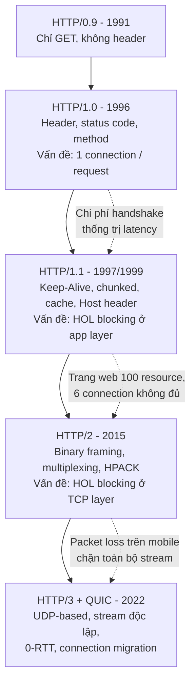
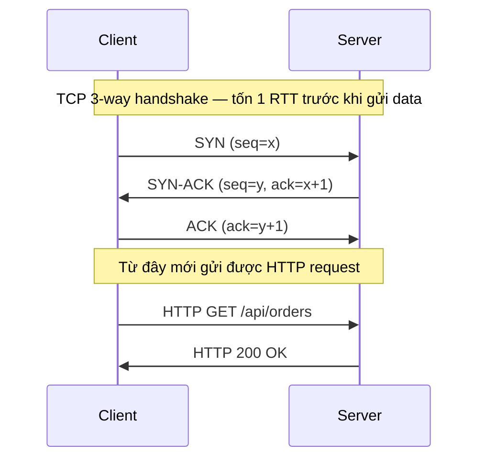
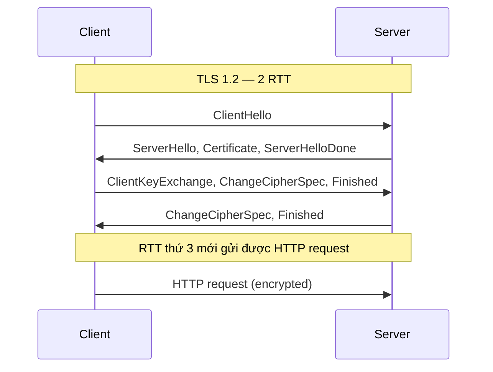
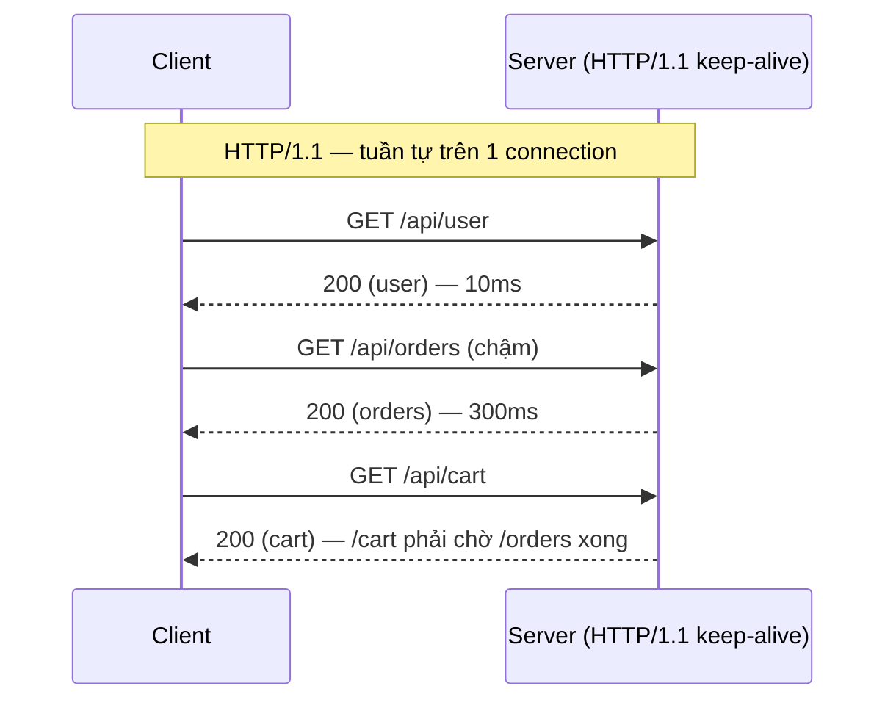
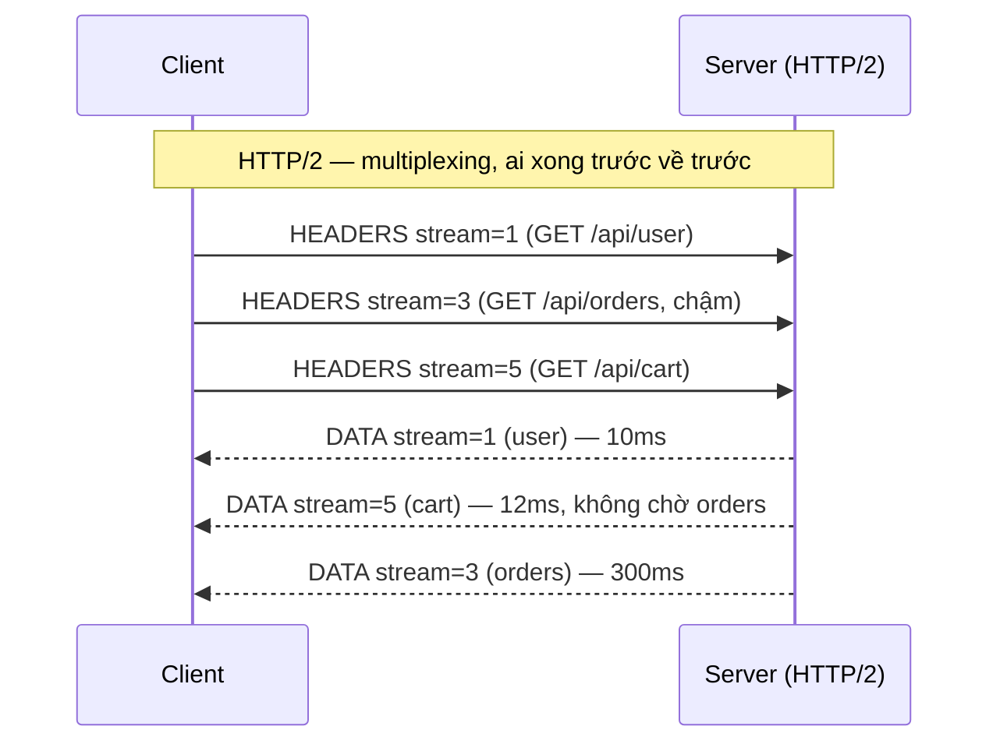
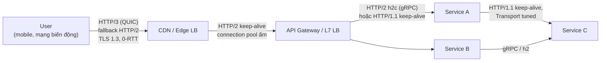

+++
title = "Chương 2: HTTP — Nền tảng của giao tiếp hiện đại"
date = "2026-02-22T08:00:00+07:00"
draft = false
tags = ["backend", "communication", "api", "architecture"]
series = ["Backend Communication Architecture"]
+++

[← Chương trước](/series/backend-communication-architect/01-communication-fundamentals/) | Mục lục | [Chương sau →](/series/backend-communication-architect/03-rest/)

---

## 1. Problem Statement

Hãy bắt đầu bằng một tình huống production quen thuộc.

Hệ thống e-commerce của bạn có 40 microservice. Một buổi sáng thứ Hai, sau đợt flash sale, team on-call báo cáo: service `checkout` gọi service `pricing` với p99 latency tăng từ 15ms lên 800ms, dù CPU của `pricing` chỉ 30%. Không có deploy mới. Không có query chậm. Metrics của `pricing` hoàn toàn bình thường.

Nguyên nhân cuối cùng: `checkout` dùng `http.Client` mặc định của Go, và `MaxIdleConnsPerHost` mặc định là 2. Dưới tải cao, mỗi request phải mở TCP connection mới — mỗi connection tốn 1 RTT cho TCP handshake, thêm 1-2 RTT cho TLS handshake, cộng thêm slow start khiến throughput ban đầu thấp. Node chạy `checkout` cạn ephemeral port vì hàng chục nghìn connection ở trạng thái `TIME_WAIT`.

Vấn đề này không nằm ở REST, không nằm ở business logic, không nằm ở database. Nó nằm ở **tầng HTTP và TCP bên dưới** — tầng mà phần lớn engineer coi là "đã được lo sẵn".

Đây là luận điểm trung tâm của chương này: **mọi giao thức application-level hiện đại — REST, GraphQL, gRPC, SSE, thậm chí WebSocket handshake — đều đứng trên HTTP. Hiểu HTTP ở mức cơ chế là hiểu 80% các vấn đề production liên quan đến giao tiếp giữa các service.** Khi bạn debug một lỗi 502 lúc 3 giờ sáng, thứ cứu bạn không phải là kiến thức về framework, mà là hiểu biết về connection lifecycle, timeout semantics, và ý nghĩa vận hành của từng status code.

Chương này trình bày HTTP theo **dòng tiến hóa**: không liệt kê feature, mà trả lời câu hỏi *vì sao* mỗi phiên bản ra đời — mỗi phiên bản HTTP là một lời giải cho giới hạn của phiên bản trước, và giới hạn đó luôn bắt nguồn từ một bài toán scale có thật.

---

## 2. Tại sao HTTP tồn tại và tiến hóa như vậy

### 2.1. Business Problem

Năm 1991, bài toán của Tim Berners-Lee đơn giản: truyền tài liệu hypertext giữa các máy. HTTP/0.9 chỉ có một method (`GET`), không có header, không có status code. Mở connection, gửi request, nhận response, đóng connection. Xong.

Nhưng business không đứng yên:

- **1996 (HTTP/1.0)**: Web trở thành nền tảng thương mại. Trang web có hình ảnh, form, session. Cần metadata (header), cần content type, cần status code để phân biệt thành công/thất bại.
- **1997-1999 (HTTP/1.1)**: Một trang web trung bình cần 10-30 resource. Mở connection mới cho từng resource giết chết trải nghiệm người dùng và làm quá tải server. Cần **connection reuse**.
- **2015 (HTTP/2)**: Trang web trung bình cần 70-100 resource, header phình to vì cookie và tracking. Amazon đo được mỗi 100ms latency làm giảm ~1% doanh thu. Cần **multiplexing** và **header compression**.
- **2022 (HTTP/3)**: Người dùng mobile chuyển đổi liên tục giữa Wi-Fi và 4G/5G; mạng có packet loss cao. TCP — nền móng của HTTP/1.1 và HTTP/2 — trở thành nút thắt không thể sửa từ application layer. Cần **thay cả transport layer**.

Mỗi bước tiến hóa của HTTP đều được thúc đẩy bởi tiền: latency là doanh thu, bandwidth là chi phí hạ tầng, connection là tài nguyên hữu hạn.

### 2.2. Technical Problem

Về mặt kỹ thuật, lịch sử HTTP là lịch sử của việc **đẩy head-of-line (HOL) blocking xuống tầng thấp hơn**:

1. HTTP/1.0: mỗi request một connection → chi phí handshake thống trị latency.
2. HTTP/1.1 keep-alive: tái sử dụng connection, nhưng trên một connection các request phải xếp hàng tuần tự → **HOL blocking ở application layer**.
3. HTTP/2 multiplexing: nhiều stream song song trên một connection, giải quyết HOL ở application layer — nhưng tất cả stream vẫn đi qua **một** TCP connection, một packet loss chặn tất cả stream → **HOL blocking ở transport layer**.
4. HTTP/3/QUIC: bỏ TCP, xây transport mới trên UDP với stream độc lập ở transport layer → giải quyết nốt HOL blocking cuối cùng (trong phạm vi một connection).

Nắm được chuỗi nhân quả này, bạn sẽ không bao giờ phải học thuộc "HTTP/2 có gì mới" — bạn *suy ra* được nó.

### 2.3. Scale Problem

Ở quy mô nhỏ, mọi phiên bản HTTP đều "chạy được". Sự khác biệt chỉ hiện ra ở scale:

- 10 req/s: HTTP/1.1 không keep-alive vẫn ổn.
- 1.000 req/s giữa hai service: connection churn bắt đầu ăn CPU (TLS handshake) và ephemeral port.
- 50.000 req/s qua một load balancer: số lượng connection, kích thước header, và hành vi retry quyết định hệ thống sống hay chết.

Đó là lý do một Senior Engineer cần hiểu HTTP ở mức cơ chế chứ không chỉ mức API.



---

## 3. Internal Architecture

### 3.1. TCP căn bản — chi phí thật của một connection mới

HTTP/1.x và HTTP/2 chạy trên TCP. Trước khi byte HTTP đầu tiên được gửi, TCP phải hoàn thành **3-way handshake**:



Chi phí mở một connection mới (chưa tính TLS):

| Giai đoạn | Số RTT | Ghi chú |
|---|---|---|
| TCP 3-way handshake | 1 RTT | Client có thể gửi data ngay sau ACK |
| TLS 1.2 handshake | +2 RTT | Xem mục 3.9 |
| TLS 1.3 handshake | +1 RTT | 0-RTT nếu resumption |
| **Tổng (HTTPS, TLS 1.2)** | **3 RTT** | Trước khi gửi byte HTTP đầu tiên |
| **Tổng (HTTPS, TLS 1.3)** | **2 RTT** | |

Với RTT nội bộ datacenter ~0.5ms, chi phí này nhỏ. Với RTT liên vùng 80ms hoặc mobile 150ms, một connection mới trên TLS 1.2 tốn **240-450ms trước khi làm được bất cứ việc gì**.

Chưa hết. TCP có **slow start**: connection mới bắt đầu với congestion window (cwnd) nhỏ (thường 10 segment ≈ 14KB với initcwnd=10), và tăng dần theo từng RTT. Nghĩa là connection mới không chỉ chậm khởi động — nó còn **chậm truyền dữ liệu trong nhiều RTT đầu tiên**. Một response 1MB trên connection mới cần nhiều RTT chỉ để cwnd mở đủ rộng; cùng response đó trên connection đã "ấm" (cwnd đã lớn) truyền nhanh hơn đáng kể.

**Hệ quả kiến trúc**: connection là tài nguyên đắt và *có trạng thái nhiệt* (warm/cold). Toàn bộ phần còn lại của chương này — keep-alive, connection pool, multiplexing, 0-RTT — đều là các kỹ thuật để **trả chi phí này càng ít lần càng tốt**.

### 3.2. HTTP/1.0 → HTTP/1.1: Keep-Alive và bi kịch của Pipelining

#### Keep-Alive — vì sao tồn tại

HTTP/1.0 mặc định đóng connection sau mỗi response. Một trang web 30 resource = 30 lần trả chi phí handshake + 30 lần slow start từ đầu. HTTP/1.1 đảo ngược mặc định: **connection được giữ mở (persistent) trừ khi một bên gửi `Connection: close`**. Client gửi request tiếp theo trên cùng connection đã ấm.

Đây là tối ưu quan trọng nhất trong lịch sử HTTP xét theo tỷ lệ lợi ích/chi phí: gần như miễn phí về độ phức tạp, tiết kiệm hàng trăm ms mỗi request.

Nhưng keep-alive tạo ra một bài toán mới: **connection nhàn rỗi chiếm tài nguyên** (file descriptor, memory buffer, entry trong conntrack table của firewall/NAT). Server phải có `IdleTimeout` để thu hồi; client phải có cơ chế phát hiện connection đã bị server đóng. Sự bất đồng giữa idle timeout của client, server, và các thiết bị trung gian (LB, NAT) là nguồn gốc của lỗi kinh điển "connection reset by peer" — client dùng lại connection mà LB đã âm thầm đóng. Quy tắc vận hành: **idle timeout của client phải nhỏ hơn của mọi hop phía sau**.

#### Pipelining — vì sao thất bại

HTTP/1.1 spec cho phép pipelining: gửi nhiều request liên tiếp không chờ response. Về lý thuyết, điều này khử được RTT chờ giữa các request. Thực tế, pipelining chết yểu vì ba lý do:

1. **Response phải trả về đúng thứ tự request** (HTTP/1.1 không có cách nào gắn response với request ngoài thứ tự). Request đầu chậm → mọi response sau bị giữ lại. Đây chính là **head-of-line blocking ở application layer**, và pipelining làm nó *tệ hơn* chứ không đỡ hơn.
2. **Proxy và server trung gian hỏng ngầm**: nhiều thiết bị chỉ hỗ trợ pipelining một phần hoặc sai, gây corrupt response — lỗi cực khó debug.
3. **Idempotency**: nếu connection đứt giữa chừng, client không biết request nào đã được xử lý; chỉ dám pipeline các request idempotent, làm lợi ích thu hẹp.

Mọi browser lớn đã tắt pipelining từ lâu. Bài học thiết kế: **một tối ưu đúng trên lý thuyết nhưng đòi hỏi toàn bộ hệ sinh thái trung gian phải đúng theo sẽ thất bại trong thực tế**. HTTP/2 học bài học này bằng cách đóng gói multiplexing vào binary framing mà thiết bị trung gian không thể "hiểu một nửa".

#### Workaround thời HTTP/1.1: domain sharding, spriting — và vì sao nay là anti-pattern

Vì một connection HTTP/1.1 chỉ xử lý tuần tự, browser mở **6 connection song song mỗi origin** để có 6 "làn". Vẫn không đủ với trang 100 resource, nên ngành công nghiệp sinh ra các workaround:

- **Domain sharding**: rải static asset lên `img1.example.com`, `img2.example.com`... để nhân số connection lên 12, 18, 24.
- **Spriting / bundling / inlining**: gộp nhiều ảnh vào một sprite, gộp JS/CSS vào một bundle, inline ảnh nhỏ bằng base64 — giảm *số request* thay vì tăng *số làn*.

Sang thời HTTP/2, các workaround này **đảo dấu thành anti-pattern**:

- Domain sharding phá vỡ multiplexing (mỗi shard là một connection riêng với handshake, slow start, HPACK context riêng) và phá hiệu quả prioritization của HTTP/2.
- Bundle khổng lồ phá cache granularity: sửa 1 dòng CSS → invalidate toàn bộ bundle; HTTP/2 xử lý 50 file nhỏ trên một connection hiệu quả hơn.

Đây là mẫu hình đáng ghi nhớ: **best practice là hàm của giao thức bên dưới. Khi giao thức đổi, best practice cũ có thể trở thành anti-pattern.**

### 3.3. Chunked Transfer Encoding — nền tảng của streaming

HTTP/1.1 với persistent connection đặt ra câu hỏi: làm sao client biết response kết thúc ở đâu để bắt đầu đọc response tiếp theo? Câu trả lời thông thường là `Content-Length`. Nhưng nếu server **không biết trước độ dài** — response được sinh dần (report lớn, kết quả LLM, event stream) — thì sao?

`Transfer-Encoding: chunked`: body được chia thành các chunk, mỗi chunk có prefix là độ dài hex, kết thúc bằng chunk độ dài 0:

```
HTTP/1.1 200 OK
Transfer-Encoding: chunked
Content-Type: text/plain

7\r\n
Hello, \r\n
6\r\n
world!\r\n
0\r\n
\r\n
```

Ý nghĩa kiến trúc của chunked encoding lớn hơn nhiều vẻ ngoài của nó:

- Nó là cơ chế cho phép **server bắt đầu gửi trước khi biết toàn bộ response** — nền tảng của **Server-Sent Events (SSE)** (chương sau) và mọi API streaming text hiện nay (token streaming của LLM API chính là chunked response hoặc HTTP/2 data frame).
- Trong Go, `http.ResponseWriter` tự động chuyển sang chunked khi bạn gọi `Flush()` trước khi biết Content-Length — đây là lý do `http.Flusher` tồn tại.
- Chunked cho phép server gửi **trailer** (header sau body) — gRPC dựa vào trailer để truyền status, và đây là lý do gRPC yêu cầu HTTP/2 (trailer qua HTTP/1.1 proxy rất không đáng tin).

Lưu ý vận hành: proxy/LB trung gian có thể **buffer** response và phá hành vi streaming (nginx `proxy_buffering`, một số CDN). Khi SSE "không nhận được gì rồi nhận cả cục", hãy nghi buffer ở trung gian trước khi nghi code.

### 3.4. Compression — CPU đổi lấy bandwidth

HTTP hỗ trợ nén body qua content negotiation: client gửi `Accept-Encoding: gzip, br, zstd`, server chọn và trả `Content-Encoding: br`.

| Thuật toán | Tỷ lệ nén (text) | Chi phí CPU nén | Ghi chú |
|---|---|---|---|
| gzip | Chuẩn cơ sở | Thấp | Hỗ trợ ở mọi nơi, mặc định an toàn |
| brotli (br) | Tốt hơn gzip ~15-25% với text | Cao ở level cao | Level cao chỉ nên dùng cho static asset nén sẵn (pre-compress); level thấp (4-5) cho dynamic |
| zstd | Gần brotli, giải nén rất nhanh | Thấp-trung bình | Hỗ trợ browser/proxy mới hơn; mạnh cho service-to-service |

Nguyên tắc trade-off:

- **Static asset**: pre-compress một lần với brotli level 11, serve mãi mãi. CPU trả một lần, bandwidth tiết kiệm vĩnh viễn.
- **Dynamic response**: nén on-the-fly với level thấp. Nén quá mạnh làm tăng TTFB — bạn đổi bandwidth lấy latency, thường là lỗ với response nhỏ.
- **Đừng nén payload < ~1KB** (thường nằm gọn trong 1 packet, nén không tiết kiệm packet nào mà tốn CPU) và **đừng nén dữ liệu đã nén** (JPEG, MP4, protobuf đã gọn).
- Service-to-service trong cùng datacenter: bandwidth rẻ, CPU của bạn đắt — cân nhắc tắt nén hoặc dùng zstd level thấp.

**Ghi chú bảo mật (BREACH)**: nén + secret trong response + attacker điều khiển được một phần response = kênh rò rỉ secret qua kích thước response nén (attacker đoán dần secret bằng cách quan sát response ngắn đi khi phần họ inject trùng với secret). Đối sách thực dụng: không đặt CSRF token/secret trong response có phần nội dung do attacker kiểm soát, hoặc tắt nén cho các response đó, hoặc dùng token thay đổi mỗi request (masking).

### 3.5. Header — cấu trúc và chi phí ẩn

Header HTTP/1.x là text `Tên: Giá trị`, phân tách bằng CRLF. Vài điểm mà Senior Engineer buộc phải nắm:

**Case-insensitive**: tên header không phân biệt hoa thường theo spec. `Content-Type` và `content-type` là một. Go chuẩn hóa qua `textproto.CanonicalMIMEHeaderKey` (nên dùng `Header.Get()` thay vì truy cập map trực tiếp). HTTP/2 và HTTP/3 **bắt buộc lowercase**. Code so sánh header case-sensitive là bug tiềm ẩn chờ ngày proxy đổi behavior.

**Hop-by-hop vs end-to-end**: một số header chỉ có ý nghĩa giữa hai hop liền kề và **proxy phải gỡ bỏ trước khi forward**: `Connection`, `Keep-Alive`, `Transfer-Encoding`, `TE`, `Upgrade`, `Proxy-Authorization`... Phần còn lại (như `Cache-Control`, `Authorization`, `Content-Type`) là end-to-end, đi xuyên suốt tới đích. Hệ quả thực tế:

- Bạn không thể "gửi `Connection: close` xuyên qua proxy" — nó chỉ tác động tới hop đầu tiên.
- Reverse proxy tự viết mà quên gỡ hop-by-hop header là nguồn của lỗ hổng **request smuggling** (bất đồng giữa front-end và back-end về ranh giới request, đặc biệt quanh `Transfer-Encoding` vs `Content-Length`).

**Chi phí header lặp lại**: HTTP/1.1 gửi lại **toàn bộ header trên mỗi request**, không nén. Một cookie session 1KB + tracking cookie 3KB + `User-Agent` + đủ loại `X-*` header dễ dàng đạt 4-8KB **mỗi request**. Với trang web 100 request, đó là gần nửa MB upload chỉ cho header — trên đường uplink vốn hẹp của mobile. Cookie phình to là "thuế vô hình" mà nhiều tổ chức trả trong nhiều năm mà không đo. Đây chính là bài toán HPACK của HTTP/2 sinh ra để giải (mục 3.10).

### 3.6. Status Code — ngữ nghĩa và ý nghĩa vận hành

Status code là **hợp đồng vận hành** giữa service, không phải chi tiết trang trí. Máy móc (LB, retry logic, monitoring, cache) hành xử dựa trên nó.

| Nhóm | Ngữ nghĩa | Ai chịu trách nhiệm | Retry được không |
|---|---|---|---|
| 1xx | Thông tin (101 Switching Protocols cho WebSocket, 100 Continue) | — | — |
| 2xx | Thành công | — | Không cần |
| 3xx | Redirect (301/308 vĩnh viễn, 302/307 tạm thời, 304 Not Modified) | Client follow | — |
| 4xx | **Client sai** — gửi lại y nguyên sẽ vẫn sai | Client | **Không** (trừ 408, 429 có backoff) |
| 5xx | **Server hỏng** — request có thể hợp lệ | Server | Có, với backoff + budget, và chỉ khi idempotent |

Các cặp hay bị dùng sai — và vì sao sai gây hại thật:

**200 với body chứa error** (`{"success": false, "error": ...}`): anti-pattern phá vỡ mọi tầng hạ tầng. Monitoring đếm error rate = 0 trong khi user gặp lỗi hàng loạt. CDN/proxy có thể **cache response lỗi** vì thấy 200. Client library không kích hoạt retry/circuit breaker. Nếu buộc phải sống chung (hệ thống legacy), tối thiểu phải thêm metric đếm error từ body — nhưng hãy coi đó là nợ kỹ thuật cần trả.

**401 vs 403**: 401 Unauthorized nghĩa là *"tôi không biết bạn là ai"* (thiếu/sai/hết hạn credential — client nên refresh token và thử lại); 403 Forbidden nghĩa là *"tôi biết bạn là ai, và bạn không có quyền"* (retry vô ích, refresh token vô ích). Dùng lẫn hai code này làm hỏng logic tự động refresh token của client: trả 403 khi token hết hạn → client không refresh → user bị đá ra ngoài; trả 401 khi thiếu quyền → client refresh token vô hạn → tự DoS chính mình.

**502 vs 503 vs 504** — bộ ba quan trọng nhất khi debug lúc 3 giờ sáng, vì mỗi code chỉ về một hướng điều tra khác nhau:

- **502 Bad Gateway**: proxy/LB **nhận được response nhưng không hợp lệ**, hoặc connection tới upstream bị từ chối/reset. Hướng điều tra: upstream crash? đang restart giữa deploy? trả về garbage? connection bị reset (upstream đóng keep-alive connection đúng lúc proxy tái sử dụng)?
- **503 Service Unavailable**: upstream **chủ động nói "tôi không phục vụ được lúc này"** — health check fail, không còn backend nào trong pool, hoặc chính app trả 503 khi shed load. Hướng điều tra: capacity, health check, graceful shutdown, circuit breaker đang mở. 503 kèm `Retry-After` là cách văn minh để báo client backoff.
- **504 Gateway Timeout**: upstream **nhận request nhưng không trả lời kịp** trong timeout của proxy. Hướng điều tra: upstream chậm (query chậm, GC pause, gọi tiếp downstream chậm — timeout lan truyền), hoặc timeout của proxy cấu hình ngắn hơn thời gian xử lý hợp lệ.

Ba code này khác nhau ở **thời điểm và tính chất thất bại**: 502 = "nói chuyện được nhưng nói bậy / bị dập máy", 503 = "chủ động từ chối", 504 = "im lặng quá lâu". Dashboard gộp cả ba thành "5xx rate" đánh mất thông tin chẩn đoán quý giá nhất.

Ngoài ra: **429 Too Many Requests** (rate limit — client phải backoff, kèm `Retry-After`), **408 Request Timeout** (client gửi quá chậm — liên quan trực tiếp tới `ReadHeaderTimeout` ở mục 5).

### 3.7. Cache — hệ thống phân tán ẩn mình trong HTTP

HTTP cache là hệ thống cache phân tán lớn nhất thế giới: browser cache, proxy cache, CDN edge — tất cả điều phối chỉ bằng header, không cần gọi API nào.

**Cache-Control directives** quan trọng:

| Directive | Ý nghĩa |
|---|---|
| `max-age=3600` | Fresh trong 3600s, trong thời gian đó không cần hỏi lại server |
| `s-maxage=86400` | max-age riêng cho shared cache (CDN/proxy), override max-age |
| `no-cache` | **Được cache**, nhưng phải revalidate với server trước mỗi lần dùng (tên gây hiểu lầm kinh điển) |
| `no-store` | Không được lưu ở bất cứ đâu (dữ liệu nhạy cảm) |
| `private` / `public` | Chỉ browser cache / cả shared cache được lưu |
| `stale-while-revalidate=60` | Được serve bản stale trong 60s trong khi revalidate ngầm — vũ khí giấu latency mạnh nhất của CDN |
| `immutable` | Nội dung không bao giờ đổi trong max-age, browser bỏ qua revalidate khi reload |

**Revalidation** — khi cache hết fresh, thay vì tải lại toàn bộ, client hỏi "còn dùng được không?":

- **ETag / If-None-Match**: server gắn `ETag: "abc123"` (hash/version của resource). Lần sau client gửi `If-None-Match: "abc123"`. Nếu chưa đổi, server trả **304 Not Modified không kèm body** — tiết kiệm toàn bộ bandwidth của body, chỉ tốn 1 RTT.
- **Last-Modified / If-Modified-Since**: tương tự nhưng theo timestamp, độ phân giải 1 giây và không phân biệt được nội dung đổi-rồi-đổi-lại. ETag chính xác hơn; dùng cả hai thì ETag thắng.

Bẫy thực tế với ETag: server tính ETag từ inode/mtime (Apache mặc định thời xưa) → mỗi node trong cluster sinh ETag khác nhau cho cùng nội dung → cache hit rate sụp đổ sau load balancer. ETag phải được tính từ **nội dung**, deterministic giữa các node.

Ví dụ implement revalidation phía server trong Go — ngắn nhưng thể hiện đúng hợp đồng 304:

```go
// serveReport trả report đã sinh sẵn, hỗ trợ ETag revalidation.
// ETag tính từ NỘI DUNG (sha256) — deterministic giữa mọi node
// trong cluster, tránh bẫy ETag-theo-inode làm vỡ cache sau LB.
func serveReport(w http.ResponseWriter, r *http.Request) {
	body, err := loadReport(r.Context())
	if err != nil {
		http.Error(w, "internal error", http.StatusInternalServerError)
		return
	}

	sum := sha256.Sum256(body)
	// ETag phải nằm trong dấu nháy kép theo spec; strong ETag.
	etag := `"` + hex.EncodeToString(sum[:8]) + `"`

	w.Header().Set("ETag", etag)
	// Cache 60s; hết hạn thì revalidate; được dùng bản stale thêm 30s
	// trong khi fetch ngầm — che latency của lần revalidate.
	w.Header().Set("Cache-Control",
		"public, max-age=60, stale-while-revalidate=30")

	// So khớp If-None-Match TRƯỚC khi ghi body.
	// Match -> 304, KHÔNG body: client dùng bản trong cache,
	// ta tiết kiệm toàn bộ bandwidth của body.
	if match := r.Header.Get("If-None-Match"); match == etag {
		w.WriteHeader(http.StatusNotModified)
		return
	}

	w.Header().Set("Content-Type", "application/json")
	w.Write(body)
}
```

Lưu ý thiết kế: ví dụ trên vẫn phải *sinh* body để tính ETag — tiết kiệm bandwidth chứ không tiết kiệm compute. Muốn tiết kiệm cả compute, ETag phải đến từ metadata rẻ (version/updated_at trong DB, hash lưu sẵn) để nhánh 304 không chạm vào dữ liệu nặng. Đây là khác biệt giữa "làm đúng spec" và "làm đúng bài toán".

**Chiến lược thực dụng cho static asset** — cache busting qua tên file: `app.3f9a2c.js` với `Cache-Control: public, max-age=31536000, immutable`. Deploy bản mới = tên file mới trong HTML. Không bao giờ phải invalidate, không bao giờ serve nhầm bản cũ. Đây là lời giải đẹp nhất cho câu nói nổi tiếng *"chỉ có hai bài toán khó trong khoa học máy tính: cache invalidation và đặt tên"* — bằng cách biến bài toán invalidation thành bài toán đặt tên.

**Cache invalidation với API dynamic** thì không có lời giải đẹp: purge CDN theo tag/URL có độ trễ lan truyền (giây tới phút giữa hàng trăm edge), purge quá rộng gây thundering herd về origin. Nguyên tắc: TTL ngắn + `stale-while-revalidate` thường vận hành ổn định hơn TTL dài + purge chủ động; và **đừng bao giờ để response cá nhân hóa (chứa dữ liệu user) lọt vào shared cache** — thiếu `private` hoặc thiếu `Vary` đúng là nguồn của sự cố lộ dữ liệu người dùng nghiêm trọng đã xảy ra ở nhiều công ty lớn.

### 3.8. Connection Pool — cơ chế trong Go net/http và cái bẫy kinh điển

Đây là phần "gần ví tiền" nhất của chương với Go engineer.

Trong Go, `http.Client` chỉ là lớp vỏ (redirect, cookie, timeout tổng). Thực thể quản lý connection là **`http.Transport`**:

- Transport duy trì pool các **idle connection** theo key `(scheme, host, port, proxy)`.
- Khi bạn gọi request: Transport tìm idle connection khớp key → nếu có, tái sử dụng (không handshake); nếu không, **mở connection mới** (dial + TLS handshake).
- Khi response được **đọc hết và đóng đúng cách** (`io.ReadAll` hoặc drain + `resp.Body.Close()`), connection trở về pool.
- Pool bị giới hạn bởi: `MaxIdleConns` (tổng, mặc định 100), **`MaxIdleConnsPerHost` (mặc định 2)**, `IdleConnTimeout` (mặc định 90s), `MaxConnsPerHost` (mặc định 0 = không giới hạn).

Cái bẫy nằm ở tổ hợp hai giá trị mặc định:

> `MaxIdleConnsPerHost = 2` nghĩa là: dù bạn bắn 500 request đồng thời tới cùng một host, khi các request xong, **pool chỉ giữ lại 2 connection**; 498 connection còn lại bị đóng ngay. Đợt 500 request tiếp theo phải mở lại ~498 connection mới. Trong khi đó `MaxConnsPerHost = 0` nghĩa là không có gì chặn việc mở connection mới vô hạn.

Kết quả dưới tải cao và concurrency lớn: **connection churn** — mở/đóng connection liên tục. Hậu quả dây chuyền: CPU cháy vào TLS handshake, latency p99 nhảy vọt vì handshake + slow start, và nghiêm trọng nhất là **ephemeral port exhaustion** — mỗi connection đã đóng nằm ở `TIME_WAIT` khoảng 60s chiếm một local port; hết dải port (~28K mặc định trên Linux) thì `connect: cannot assign requested address` và service sập dù mọi thứ khác khỏe. Failure case chi tiết và cách refactor ở mục 6.

Một bẫy anh em: **quên drain response body**. Nếu bạn `Close()` body khi chưa đọc hết, Go không thể tái sử dụng connection (còn byte thừa trên wire) → connection bị đóng → churn y hệt, dù cấu hình pool đã đúng. Luật: *luôn đọc hết body (hoặc `io.Copy(io.Discard, resp.Body)`) trước khi Close nếu muốn connection quay về pool*.

### 3.9. TLS — chi phí thật hôm nay

**TLS 1.2 full handshake — 2 RTT** (sau TCP handshake):



**TLS 1.3 — 1 RTT**: client gửi luôn key share trong ClientHello (đoán trước cipher suite server sẽ chọn), server trả ServerHello + Certificate + Finished trong một chuyến. TLS 1.3 còn dọn sạch các cipher suite yếu — vừa nhanh hơn vừa an toàn hơn, không có trade-off; không có lý do gì để không bật.

**Session resumption**: connection tiếp theo tới cùng server có thể bỏ qua phần đắt của handshake bằng session ticket (PSK trong TLS 1.3). TLS 1.3 đi xa hơn với **0-RTT (early data)**: client gửi HTTP request ngay trong chuyến bay đầu tiên kèm PSK. Cảnh báo quan trọng: 0-RTT data **có thể bị replay** bởi attacker — chỉ dùng cho request idempotent (GET), và server/LB phải được cấu hình từ chối 0-RTT cho các endpoint có side effect.

**mTLS (mutual TLS)**: server cũng yêu cầu client trình certificate — hai chiều xác thực. Đây là nền tảng định danh service-to-service trong service mesh (Istio/Linkerd/Consul). Chi phí thật của mTLS không nằm ở CPU mà ở **vận hành certificate lifecycle**: cấp phát, rotate (thường 24h trong mesh), revoke, và debug khi certificate hết hạn giữa đêm. Service mesh tồn tại một phần lớn là để tự động hóa chính việc này.

**Chi phí thật của TLS hôm nay**: với AES-NI trong mọi CPU hiện đại, chi phí mã hóa symmetric của TLS trên connection đã thiết lập là **1-2% CPU** — không đáng bàn. Chi phí thật nằm ở **handshake** (asymmetric crypto + RTT). Kết luận thiết kế: *"TLS đắt" là đúng nếu bạn churn connection, và gần như sai nếu connection được tái sử dụng tốt*. Một lần nữa, mọi con đường dẫn về connection reuse.

### 3.10. HTTP/2 — multiplexing và giải phóng application layer

HTTP/2 (2015, gốc từ SPDY của Google) giữ nguyên **ngữ nghĩa** HTTP (method, header, status code — code của bạn gần như không đổi) nhưng thay hoàn toàn **cách đóng gói trên wire**.

**Binary framing**: thay vì text tự do, mọi thứ là frame nhị phân có type (HEADERS, DATA, SETTINGS, WINDOW_UPDATE, RST_STREAM, GOAWAY...) và **stream ID**. Parse nhanh, không mơ hồ (nguồn của request smuggling trong HTTP/1.1), và quan trọng nhất — frame của các stream khác nhau **đan xen tự do trên một connection**.

**Stream và multiplexing**: mỗi cặp request/response là một stream với ID riêng. Response về theo bất kỳ thứ tự nào, ai xong trước về trước — **HOL blocking ở application layer biến mất**. Một connection TCP duy nhất thay cho 6+ connection của HTTP/1.1: một lần handshake, một lần slow start, một cwnd ấm dùng chung.





**HPACK — header compression**: giải bài toán cookie phình to ở mục 3.5. Hai bên duy trì **dynamic table** đồng bộ các header đã gửi; header lặp lại (cookie, user-agent, authorization — vốn giống hệt nhau giữa các request) chỉ tốn **1-2 byte** tham chiếu vào table thay vì hàng KB. HPACK dùng bảng tra + Huffman thay vì gzip chính vì bài học **CRIME attack** (nén header bằng DEFLATE cho phép đoán secret — cùng họ với BREACH). Cái giá: dynamic table là **trạng thái gắn với connection** — proxy phải giữ table riêng cho từng connection hai phía, và đây là lý do connection HTTP/2 "đắt về memory" hơn với các LB.

**Flow control**: vì nhiều stream chia nhau một connection, HTTP/2 có flow control riêng ở cả mức stream và mức connection (frame WINDOW_UPDATE) — một consumer chậm không được phép nuốt toàn bộ buffer của connection. Bẫy vận hành: window mặc định 64KB quá nhỏ cho truyền file lớn liên datacenter (bandwidth-delay product cao); gRPC client/server đều có option chỉnh initial window — throughput thấp bí ẩn trên đường dài thường do đây.

**Server push — và vì sao bị bỏ**: ý tưởng server chủ động đẩy resource client "sắp cần" (đẩy CSS ngay khi HTML được yêu cầu). Thất bại trong thực tế: server không biết cache của client (đẩy thứ client đã có = phí bandwidth), độ phức tạp cao, lợi ích đo được thấp hơn `preload`/103 Early Hints. Chrome gỡ hỗ trợ năm 2022; HTTP/3 nhiều implementation không buồn làm. Bài học lặp lại lần hai (sau pipelining): *feature đòi hỏi bên gửi đoán đúng trạng thái bên nhận thường thất bại*.

**Giới hạn còn lại — TCP-level HOL blocking**: TCP cam kết giao byte **đúng thứ tự**. Một packet mất → TCP giữ lại *mọi* byte đến sau nó cho tới khi retransmit thành công — kể cả khi các byte đó thuộc stream khác, hoàn toàn không liên quan. Nghịch lý đo được: trên mạng packet loss cao (mobile ~2%+), HTTP/2 với 1 connection có thể **chậm hơn** HTTP/1.1 với 6 connection, vì 6 connection là 6 phần độc lập, mất packet ở connection này không chặn connection kia. Multiplexing càng tốt ở app layer, hậu quả của một packet loss ở transport layer càng lan rộng. Muốn sửa tận gốc phải sửa transport — nhưng TCP nằm trong kernel và middlebox toàn Internet, không thể nâng cấp. Lối thoát duy nhất: xây transport mới trên UDP.

### 3.11. HTTP/3 và QUIC — thay móng nhà

**QUIC** là transport protocol chạy trên **UDP**, implement ở **userspace**, tích hợp sẵn TLS 1.3. HTTP/3 là HTTP mapping trên QUIC. Chọn UDP không phải vì UDP "nhanh" — mà vì UDP là giao thức duy nhất đi qua được mọi middlebox mà vẫn cho phép tự định nghĩa logic phía trên; QUIC tự làm lại reliability, congestion control, ordering ở userspace.

- **Stream độc lập ở transport layer**: QUIC hiểu khái niệm stream. Packet loss chỉ chặn đúng stream có data trong packet đó; các stream khác tiếp tục — **TCP HOL blocking được giải quyết**.
- **Handshake gộp**: transport + TLS 1.3 handshake trong **1 RTT**; với server đã biết, **0-RTT** — request đầu tiên bay cùng chuyến với handshake (cùng caveat replay như TLS 1.3 0-RTT).
- **Connection migration**: TCP định danh connection bằng 4-tuple (src IP, src port, dst IP, dst port) — đổi mạng Wi-Fi → 4G là đứt connection, làm lại từ đầu. QUIC định danh bằng **Connection ID** độc lập với IP: user rời văn phòng, điện thoại chuyển sang 4G, video call/download **tiếp tục không đứt quãng**. Với ứng dụng mobile-first, đây là khác biệt trải nghiệm lớn nhất của HTTP/3.
- **Header compression QPACK**: HPACK thiết kế lại để không tự tạo HOL blocking giữa các stream (dynamic table update đi kênh riêng).

**Cái giá phải trả**:

- **CPU cao hơn TCP** (thường 1.5-2 lần cho cùng throughput): mất kernel offload (GSO/GRO cho TCP đã tối ưu hàng thập kỷ), crypto per-packet, xử lý userspace. Đang thu hẹp dần nhờ UDP GSO nhưng chưa hết.
- **UDP bị chặn/throttle** ở một số mạng doanh nghiệp — mọi triển khai HTTP/3 **bắt buộc có fallback** TCP (cơ chế: response HTTP/2 kèm header `Alt-Svc: h3=":443"` để client biết lần sau thử QUIC).
- **Observability khó hơn**: QUIC mã hóa gần như toàn bộ, kể cả phần lớn transport metadata — tcpdump/middlebox "mù"; debug dựa vào qlog/endpoint logging thay vì bắt gói giữa đường.

**Trạng thái adoption (thời điểm viết)**: tất cả browser lớn hỗ trợ; các CDN lớn (Cloudflare, Fastly, Akamai, CloudFront) và Google/Meta serve tỷ trọng lớn traffic qua HTTP/3; khoảng trên dưới 30% traffic web toàn cầu. Nhưng ở **backend nội bộ**, HTTP/3 còn hiếm: gRPC chưa chính thức trên HTTP/3 ở mọi ngôn ngữ, LB nội bộ hỗ trợ chưa đều, và trong datacenter RTT ~0.5ms + packet loss ~0% thì lợi ích của QUIC gần bằng không trong khi chi phí CPU là thật. Pattern phổ biến đúng đắn hiện nay: **HTTP/3 ở edge (user ↔ CDN/LB), HTTP/2 hoặc HTTP/1.1 keep-alive phía sau**.

Trong Go: `net/http` chuẩn chưa có HTTP/3; dùng `quic-go` (`github.com/quic-go/quic-go/http3`) — API tương thích kiểu `http.RoundTripper`/`http.Server` nên chuyển đổi ít đau.

### 3.12. Bảng so sánh HTTP/1.1 vs HTTP/2 vs HTTP/3

| Tiêu chí | HTTP/1.1 | HTTP/2 | HTTP/3 |
|---|---|---|---|
| Transport | TCP | TCP | QUIC (UDP) |
| Định dạng wire | Text | Binary framing | Binary framing |
| Multiplexing | Không (6+ connection song song) | Có, trên 1 connection | Có, stream độc lập ở transport |
| HOL blocking app layer | **Có** | Không | Không |
| HOL blocking transport layer | Có (nhưng phân tán trên nhiều connection) | **Có, tập trung 1 connection** | **Không** |
| Header compression | Không | HPACK | QPACK |
| Handshake connection mới (với TLS 1.3) | 2 RTT (TCP+TLS) | 2 RTT (TCP+TLS) | 1 RTT (gộp), 0-RTT resumption |
| Connection migration khi đổi mạng | Không | Không | **Có (Connection ID)** |
| TLS | Tùy chọn | Thực tế bắt buộc (browser chỉ hỗ trợ h2 trên TLS) | Bắt buộc (TLS 1.3 tích hợp) |
| Chi phí CPU server | Thấp | Thấp-trung bình (HPACK state) | Cao hơn (userspace, per-packet crypto) |
| Debug bằng tcpdump/curl thô | Dễ (đọc được bằng mắt) | Cần tool (h2 decode) | Khó (mã hóa transport, cần qlog) |
| Phù hợp nhất | Nội bộ đơn giản, webhook, tool | gRPC, API nội bộ, edge phổ thông | Edge cho mobile/mạng yếu, latency-critical |

---

## 4. Trade-off Analysis

Phân tích theo từng trục, áp dụng cho quyết định "chọn phiên bản HTTP nào ở đâu":

**Latency**: HTTP/3 thắng ở connection mới (1 RTT vs 2 RTT) và mạng loss cao; HTTP/2 thắng HTTP/1.1 khi nhiều request song song tới cùng host. Nhưng trên connection đã ấm trong datacenter, cả ba gần như ngang nhau — **connection reuse quan trọng hơn phiên bản giao thức**. Đừng nâng cấp lên HTTP/3 để sửa vấn đề mà thực chất do connection pool sai.

**Bandwidth**: HPACK/QPACK tiết kiệm đáng kể khi header lớn (cookie, JWT trong Authorization — JWT 4KB lặp lại mỗi request là bài toán có thật). Body compression độc lập với phiên bản HTTP.

**Complexity**: HTTP/1.1 debug được bằng `telnet` và mắt thường — giá trị vận hành không nên xem nhẹ. HTTP/2 thêm trạng thái (HPACK table, flow control window, stream lifecycle) — nhiều CVE của các proxy lớn nằm ở implementation h2 (ví dụ lớp lỗi Rapid Reset 2023: attacker mở/hủy stream liên tục, rẻ với attacker, đắt với server). HTTP/3 thêm cả một transport stack ở userspace.

**Scalability**: HTTP/2 giảm mạnh số connection (tốt cho LB, conntrack, memory tổng) nhưng mỗi connection "đắt" hơn và một connection giờ mang nhiều traffic hơn — mất một connection đau hơn. Chú ý load balancing: **L4 LB với HTTP/2 phân tải kém** (một connection dài mang nghìn request dồn vào một backend); với gRPC/h2 nội bộ, cần L7 LB hoặc client-side load balancing per-request.

**Developer Experience**: HTTP/1.1 với curl là DX chuẩn vàng. HTTP/2 hầu như trong suốt với code ứng dụng (Go tự bật h2 khi dùng TLS). HTTP/3 hiện cần thư viện riêng, hệ tooling đang trưởng thành.

**Operational Cost**: HTTP/3 tốn CPU hơn ở edge — với fleet lớn, đó là hóa đơn thật; đo lợi ích trên user metrics (TTFB p75 mobile) trước khi trả. HTTP/2 nội bộ giảm chi phí connection nhưng tăng yêu cầu về chất lượng LB.

**Compatibility**: HTTP/1.1 chạy được qua mọi thứ từng làm ra. HTTP/2 cần TLS + ALPN với browser (h2c cleartext dùng nội bộ, ví dụ gRPC sau LB đã terminate TLS). HTTP/3 cần UDP không bị chặn + fallback bắt buộc.

**Observability**: mỗi lần nâng phiên bản là một lần "mù" hơn trên wire (text → binary → encrypted transport). Đầu tư tương ứng vào structured logging, distributed tracing, và metric ở endpoint thay vì dựa vào bắt gói giữa đường.

**Security**: HTTP/3 bắt buộc TLS 1.3 — mặt bằng an ninh cao nhất. HTTP/1.1 mang nhiều lớp lỗi parsing (request smuggling qua bất đồng `Content-Length`/`Transfer-Encoding`). HTTP/2 loại bỏ smuggling kiểu cũ nhưng sinh lớp tấn công stream-based mới. 0-RTT ở TLS 1.3/QUIC mở cửa replay nếu dùng sai.

---

## 5. Production

### 5.1. HTTP client trong Go — Transport tune đúng

`http.DefaultClient` **không có timeout** (treo vô hạn nếu server không trả lời) và mang `MaxIdleConnsPerHost=2`. Không bao giờ dùng nó cho traffic production. Dưới đây là client chuẩn cho service-to-service, kèm giải thích từng quyết định:

```go
package httpclient

import (
	"net"
	"net/http"
	"time"
)

// NewClient tạo HTTP client cho giao tiếp service-to-service.
// Mỗi downstream service nên có client riêng để cô lập pool và timeout
// theo đặc thù của service đó (bulkhead pattern).
func NewClient() *http.Client {
	transport := &http.Transport{
		// DialContext kiểm soát tầng TCP.
		DialContext: (&net.Dialer{
			// Timeout cho TCP handshake. Nội bộ datacenter, 2s là quá đủ;
			// nếu 2s chưa xong SYN/SYN-ACK thì đích gần như chắc chắn có vấn đề,
			// fail nhanh để retry sang node khác tốt hơn là chờ.
			Timeout: 2 * time.Second,
			// TCP keep-alive probe ở tầng kernel: phát hiện peer chết
			// mà không gửi FIN/RST (node bị kill -9, network partition).
			// Không có nó, connection "zombie" nằm trong pool và request
			// tiếp theo treo tới hết timeout.
			KeepAlive: 30 * time.Second,
		}).DialContext,

		// Timeout cho TLS handshake, tách khỏi TCP dial.
		// Tách riêng để metric/log phân biệt được "không mở nổi TCP"
		// với "TLS chậm" (thường do server nghẽn CPU hoặc OCSP chậm).
		TLSHandshakeTimeout: 3 * time.Second,

		// ==== Phần quan trọng nhất: connection pool ====

		// Tổng số idle connection toàn client, mọi host.
		MaxIdleConns: 200,

		// SỐ IDLE CONNECTION GIỮ LẠI CHO MỖI HOST.
		// Mặc định là 2 — nguồn gốc của vô số sự cố connection churn.
		// Đặt xấp xỉ mức concurrency ổn định tới host này để connection
		// được giữ ấm giữa các đợt tải.
		MaxIdleConnsPerHost: 100,

		// Trần TỔNG số connection (đang dùng + idle + đang dial) tới một host.
		// Mặc định 0 = vô hạn — nghĩa là khi downstream chậm, client sẽ
		// mở connection không giới hạn và tự gây port exhaustion.
		// Đây đồng thời là một hàng rào bulkhead: chặn việc một downstream
		// chậm nuốt toàn bộ tài nguyên connection của process.
		MaxConnsPerHost: 200,

		// Đóng idle connection sau 60s không dùng.
		// PHẢI NHỎ HƠN idle timeout của server/LB phía sau (thường 60-90s).
		// Nếu client giữ lâu hơn server, client sẽ gửi request trên
		// connection server vừa đóng -> lỗi "connection reset by peer"
		// xuất hiện lác đác, cực khó truy vết.
		IdleConnTimeout: 60 * time.Second,

		// Timeout chờ server bắt đầu trả response header sau khi
		// request đã gửi xong. Đây là "server nghĩ lâu quá".
		ResponseHeaderTimeout: 5 * time.Second,

		// Bật HTTP/2 nếu server hỗ trợ (qua ALPN). Với HTTPS, Go tự bật;
		// đặt tường minh để hành vi không đổi ngầm giữa các phiên bản Go.
		ForceAttemptHTTP2: true,
	}

	return &http.Client{
		Transport: transport,
		// Deadline TỔNG cho toàn bộ request: dial + TLS + gửi request
		// + chờ header + ĐỌC HẾT BODY. Là chốt chặn cuối cùng —
		// các timeout thành phần ở trên không cover thời gian đọc body.
		// Lưu ý: timeout theo từng request nên đặt qua context
		// (http.NewRequestWithContext) để tùy biến theo endpoint;
		// Client.Timeout là trần cứng an toàn.
		Timeout: 10 * time.Second,
	}
}
```

Và phía gọi — hai quy tắc sống còn:

```go
func fetchOrder(ctx context.Context, client *http.Client, id string) (*Order, error) {
	// Timeout theo ngữ cảnh nghiệp vụ, truyền xuyên suốt call chain.
	ctx, cancel := context.WithTimeout(ctx, 3*time.Second)
	defer cancel()

	req, err := http.NewRequestWithContext(ctx, http.MethodGet,
		"https://pricing.internal/orders/"+id, nil)
	if err != nil {
		return nil, err
	}

	resp, err := client.Do(req)
	if err != nil {
		return nil, fmt.Errorf("call pricing: %w", err)
	}
	// Quy tắc 1: luôn Close body — không Close là leak connection + goroutine.
	defer resp.Body.Close()

	if resp.StatusCode != http.StatusOK {
		// Quy tắc 2: drain body trước khi return trên nhánh lỗi,
		// nếu không connection KHÔNG quay về pool -> churn.
		// LimitReader chống server độc/lỗi trả body vô hạn.
		io.Copy(io.Discard, io.LimitReader(resp.Body, 4<<10))
		return nil, fmt.Errorf("pricing status %d", resp.StatusCode)
	}

	var o Order
	if err := json.NewDecoder(resp.Body).Decode(&o); err != nil {
		return nil, err
	}
	return &o, nil
}
```

### 5.2. HTTP server trong Go — timeout đầy đủ

`http.ListenAndServe(addr, handler)` tạo server **không có bất kỳ timeout nào** — mỗi client chậm/độc chiếm một goroutine và một file descriptor vô thời hạn. Server production:

```go
package main

import (
	"context"
	"errors"
	"log"
	"net/http"
	"os/signal"
	"syscall"
	"time"
)

func newServer(handler http.Handler) *http.Server {
	return &http.Server{
		Addr:    ":8443",
		Handler: handler,

		// Thời gian tối đa để đọc XONG request HEADER.
		// Chống Slowloris: attacker mở connection và nhỏ giọt từng byte
		// header để chiếm giữ connection vô hạn, cạn file descriptor.
		// Header hợp lệ luôn tới trong vài ms; 5s là hào phóng.
		ReadHeaderTimeout: 5 * time.Second,

		// Thời gian tối đa đọc toàn bộ request (header + body).
		// Chống client gửi body nhỏ giọt. Nếu server có endpoint upload
		// file lớn, đừng đặt global — dùng per-route qua http.TimeoutHandler
		// hoặc kiểm soát bằng context trong handler.
		ReadTimeout: 15 * time.Second,

		// Thời gian tối đa ghi response (tính từ lúc đọc xong header).
		// Chống client đọc chậm giữ goroutine + buffer mãi mãi.
		// LƯU Ý: endpoint streaming/SSE sẽ bị cắt bởi WriteTimeout —
		// server phục vụ SSE cần cấu hình riêng (chương SSE bàn kỹ).
		WriteTimeout: 30 * time.Second,

		// Thời gian giữ keep-alive connection nhàn rỗi trước khi đóng.
		// Không có nó, mọi client từng kết nối đều giữ một fd vĩnh viễn.
		// Nhớ nguyên tắc: GIÁ TRỊ NÀY PHẢI LỚN HƠN IdleConnTimeout
		// của các client/LB đứng trước, để server không đóng trước.
		IdleTimeout: 120 * time.Second,

		// Chặn header khổng lồ (mặc định 1MB): chống memory abuse
		// và chặn sớm cookie/JWT phình bất thường.
		MaxHeaderBytes: 64 << 10, // 64KB
	}
}

func main() {
	srv := newServer(routes())

	// Graceful shutdown: nhận SIGTERM (Kubernetes gửi trước khi kill),
	// ngừng nhận connection mới, chờ request đang chạy xong.
	// Thiếu đoạn này, mỗi lần deploy là một loạt 502 ở LB.
	ctx, stop := signal.NotifyContext(context.Background(),
		syscall.SIGINT, syscall.SIGTERM)
	defer stop()

	go func() {
		log.Printf("listening on %s", srv.Addr)
		if err := srv.ListenAndServeTLS("cert.pem", "key.pem"); err != nil &&
			!errors.Is(err, http.ErrServerClosed) {
			log.Fatalf("server: %v", err)
		}
	}()

	<-ctx.Done()

	// Cho request đang chạy tối đa 20s để hoàn tất.
	// Phải NHỎ HƠN terminationGracePeriodSeconds của Kubernetes (mặc định 30s),
	// nếu không pod bị SIGKILL trước khi shutdown xong.
	shutdownCtx, cancel := context.WithTimeout(context.Background(), 20*time.Second)
	defer cancel()
	if err := srv.Shutdown(shutdownCtx); err != nil {
		log.Printf("graceful shutdown failed: %v", err)
	}
}
```

Tóm tắt "timeout nào chống cái gì":

| Timeout | Chống gì |
|---|---|
| `ReadHeaderTimeout` | Slowloris — nhỏ giọt header chiếm connection |
| `ReadTimeout` | Body nhỏ giọt, upload treo |
| `WriteTimeout` | Client đọc chậm giữ goroutine/buffer |
| `IdleTimeout` | Keep-alive connection zombie cạn file descriptor |
| `MaxHeaderBytes` | Header bomb, memory abuse |
| `Shutdown` + signal | 502 khi deploy/scale-down |

### 5.3. Benchmark minh họa

Kịch bản: client Go gọi API JSON ~2KB response qua HTTPS, 200 concurrent worker, so sánh cấu hình. *(Số liệu minh họa để thể hiện bậc độ lớn và xu hướng — kết quả thực tế phụ thuộc môi trường, phần cứng, RTT và tải; hãy tự benchmark trên hệ của bạn.)*

| Cấu hình | RTT mạng | p50 | p99 | Connection mới/s | CPU client |
|---|---|---|---|---|---|
| Default Transport (idle/host=2), HTTP/1.1, TLS 1.2 | 1ms | 4ms | 180ms | ~1.900 | 71% |
| Tuned Transport (idle/host=100), HTTP/1.1, TLS 1.3 | 1ms | 1.8ms | 9ms | ~3 | 22% |
| Tuned, HTTP/2 (1 connection multiplexed) | 1ms | 1.7ms | 8ms | ~0 | 19% |
| Tuned, HTTP/1.1, RTT 40ms liên vùng | 40ms | 42ms | 55ms | ~3 | 20% |
| Default, HTTP/1.1, RTT 40ms liên vùng | 40ms | 124ms | 460ms | ~1.800 | 65% |
| HTTP/2 vs HTTP/3, mạng 2% packet loss, RTT 60ms | 60ms | h3 thắng rõ ở p99 (không TCP HOL) | — | — | h3 tốn CPU hơn ~1.5x |

Ba điều bảng này minh họa: (1) pool sai làm p99 tệ hơn **hàng chục lần** — và p99 mới là thứ user cảm nhận; (2) RTT càng lớn, giá của connection mới càng đắt; (3) HTTP/3 tỏa sáng đúng ở nơi nó được thiết kế cho: mạng loss cao, RTT lớn — không phải trong datacenter.

### 5.4. Observability — nhìn thấy tầng connection bằng httptrace

Phần lớn team chỉ đo latency tổng của request — con số đó trộn lẫn DNS, dial, TLS, chờ server, đọc body thành một, và khi p99 tăng thì không biết nhìn vào đâu. `net/http/httptrace` tách được từng giai đoạn:

```go
// instrumentedDo bọc một request với trace để tách latency theo giai đoạn
// và — quan trọng nhất — đo tỷ lệ connection reuse.
func instrumentedDo(client *http.Client, req *http.Request) (*http.Response, error) {
	var (
		start        = time.Now()
		dnsStart     time.Time
		connectStart time.Time
		tlsStart     time.Time
	)

	trace := &httptrace.ClientTrace{
		DNSStart: func(httptrace.DNSStartInfo) { dnsStart = time.Now() },
		DNSDone: func(httptrace.DNSDoneInfo) {
			metrics.DNSDuration.Observe(time.Since(dnsStart).Seconds())
		},
		ConnectStart: func(_, _ string) { connectStart = time.Now() },
		ConnectDone: func(_, _ string, err error) {
			if err == nil {
				metrics.DialDuration.Observe(time.Since(connectStart).Seconds())
			}
		},
		TLSHandshakeStart: func() { tlsStart = time.Now() },
		TLSHandshakeDone: func(tls.ConnectionState, error) {
			metrics.TLSDuration.Observe(time.Since(tlsStart).Seconds())
		},
		// Hook giá trị nhất: connection lấy được là mới hay tái sử dụng?
		// Tỷ lệ reused thấp = pool cấu hình sai hoặc body không được drain.
		GotConn: func(info httptrace.GotConnInfo) {
			if info.Reused {
				metrics.ConnReused.Inc()
			} else {
				metrics.ConnNew.Inc()
			}
		},
		GotFirstResponseByte: func() {
			metrics.TTFB.Observe(time.Since(start).Seconds())
		},
	}

	req = req.WithContext(httptrace.WithClientTrace(req.Context(), trace))
	return client.Do(req)
}
```

Bốn tín hiệu tối thiểu nên có trên dashboard của **mọi** HTTP client quan trọng:

| Metric | Cảnh báo điều gì |
|---|---|
| `conn_reused / (conn_reused + conn_new)` | Reuse ratio < ~95% dưới tải ổn định = pool sai / body leak / idle timeout lệch |
| TLS handshake duration | Tăng = server nghẽn CPU, hoặc churn đang xảy ra |
| TTFB (GotFirstResponseByte) tách khỏi total | Phân biệt "server nghĩ lâu" với "body to / mạng chậm" |
| In-flight request theo host | Tiệm cận `MaxConnsPerHost` = sắp nghẽn ở hàng chờ connection |

Phía server, tương đương tối thiểu: đếm request theo status code **tách 502/503/504** (mục 3.6), đo thời gian ở từng giai đoạn qua middleware, và log `Connection`/protocol version để biết tỷ trọng h1/h2 thực tế — nhiều team bật HTTP/2 xong không hề biết ALPN fail và toàn bộ traffic vẫn chạy h1.

### 5.5. Production example — kiến trúc phân tầng phiên bản HTTP

Mô hình phổ biến ở các hệ thống lớn hiện nay:



- **Edge**: HTTP/3 nơi nó đáng tiền nhất — user trên mobile, RTT cao, loss cao, đổi mạng liên tục. CDN gánh phần phức tạp.
- **CDN → origin**: HTTP/2 trên connection nuôi sẵn (connection ấm, cwnd lớn, TLS resumption).
- **Nội bộ**: gRPC/h2 hoặc HTTP/1.1 keep-alive với Transport tune đúng. RTT 0.5ms và loss ~0% khiến HTTP/3 nội bộ chưa bõ chi phí CPU và độ phức tạp vận hành.

Điểm hay của kiến trúc này: **mỗi đoạn đường dùng phiên bản tối ưu cho đặc tính mạng của đoạn đó** — vì HTTP giữ nguyên ngữ nghĩa qua các phiên bản, việc "phiên dịch" h3 → h2 → h1.1 ở mỗi hop là trong suốt với application code.

---

## 6. Anti-pattern

### 6.1. Danh sách anti-pattern thường gặp

1. **Dùng `http.DefaultClient` / `http.Get()` trong production** — không timeout, pool mặc định 2/host. Mọi codebase nghiêm túc nên có lint rule cấm.
2. **Một `http.Client` mới cho mỗi request** (`client := &http.Client{}` trong handler) — mỗi client có pool riêng, nghĩa là **không bao giờ có reuse**. Client/Transport được thiết kế để share và safe cho concurrent use: tạo một lần, dùng chung.
3. **Quên `resp.Body.Close()` hoặc quên drain body** — leak fd, chặn connection reuse (mục 5.1).
4. **200 OK với body error** — phá monitoring, cache, retry (mục 3.6).
5. **Retry không backoff, không jitter, không budget, retry cả request non-idempotent** — biến sự cố nhỏ thành retry storm đánh sập chính mình; POST retry mù tạo double-charge.
6. **Domain sharding / bundle khổng lồ trên HTTP/2** — tối ưu của thời đại trước thành gánh nặng thời đại này (mục 3.2).
7. **Timeout đồng loạt một giá trị trên cả chuỗi gọi** — gateway 10s, service A gọi B cũng 10s, B gọi C cũng 10s: khi C treo, tất cả cùng hết giờ một lúc, không tầng nào kịp xử lý lỗi tử tế. Timeout phải **giảm dần theo chiều sâu** (deadline propagation qua context).
8. **Idle timeout client ≥ idle timeout server/LB** — reset lác đác không truy vết được (mục 5.1).
9. **Dữ liệu cá nhân hóa lọt shared cache** — thiếu `Cache-Control: private` / `Vary` (mục 3.7).
10. **Sticky theo connection với HTTP/2 qua L4 LB** — một connection mang nghìn request dồn một backend, phân tải lệch nghiêm trọng (mục 4).

### 6.2. Failure example — `MaxIdleConnsPerHost=2` đánh sập checkout

Quay lại sự cố mở đầu chương, giờ mổ xẻ đầy đủ theo dòng thời gian:

**Bối cảnh**: service `checkout` (Go) gọi `pricing` qua HTTPS nội bộ, code dùng `http.DefaultClient`. Bình thường 300 req/s, mọi thứ ổn — vì tải đủ thấp, request ít khi dồn cục, 2 idle connection cộng một ít connection mới mỗi giây là đủ, không ai nhận ra bom hẹn giờ.

**Diễn biến khi flash sale đẩy tải lên 3.000 req/s, concurrency ~400**:

1. 400 request đồng thời → Transport chỉ có 2 idle connection khớp host → **mở ~398 connection mới cùng lúc** (`MaxConnsPerHost=0`, không gì cản).
2. Mỗi connection mới: TCP handshake + TLS handshake. 398 TLS handshake đồng thời dội vào `pricing` → CPU `pricing` dành cho asymmetric crypto tăng vọt → handshake chậm lại → latency của *mọi* request mới tăng theo.
3. Đợt request xong, pool chỉ giữ **2** connection, ~398 connection bị client đóng → chui vào `TIME_WAIT` 60s, mỗi cái chiếm một ephemeral port của node `checkout`.
4. Chu kỳ lặp mỗi đợt tải: mở nghìn connection/giây, đóng nghìn connection/giây. Sau vài chục giây, số socket `TIME_WAIT` chạm trần dải ephemeral port (~28K).
5. `checkout` bắt đầu văng `dial tcp: connect: cannot assign requested address`. Vì lỗi này xảy ra ở *client*, dashboard của `pricing` **hoàn toàn xanh** — đúng như on-call báo cáo: "pricing bình thường mà checkout vẫn lỗi".
6. Tệp đè tệp: `checkout` có retry (không backoff) → mỗi lỗi đẻ thêm request → thêm connection churn → **retry storm khuếch đại chính nguyên nhân gốc**.

**Chữ ký nhận diện sự cố này** (để lần sau bạn khoanh vùng trong 5 phút thay vì 5 giờ):

- Client-side error `cannot assign requested address` hoặc `i/o timeout` khi dial; server-side metrics bình thường.
- `ss -s` trên node client: hàng chục nghìn socket `timewait`.
- Latency phân bố **hai đỉnh** (bimodal): request trúng connection có sẵn ~vài ms, request phải mở connection mới ~hàng trăm ms — p50 đẹp, p99 thảm họa.
- CPU tăng ở *cả hai phía* tương quan với connection rate, không tương quan với request rate.

### 6.3. Refactoring example — từ default sang tuned

**Trước** (code thật sự phổ biến hơn bạn nghĩ):

```go
// checkout/pricing_client.go — TRƯỚC
func GetPrice(itemID string) (*Price, error) {
	// Bug 1: http.Get dùng DefaultClient — không timeout,
	//        MaxIdleConnsPerHost=2, MaxConnsPerHost vô hạn.
	resp, err := http.Get("https://pricing.internal/price/" + itemID)
	if err != nil {
		return nil, err
	}
	// Bug 2: không defer Close — return sớm bên dưới sẽ leak connection.
	var p Price
	if resp.StatusCode != 200 {
		// Bug 3: không drain, không close -> connection không về pool.
		return nil, fmt.Errorf("status %d", resp.StatusCode)
	}
	if err := json.NewDecoder(resp.Body).Decode(&p); err != nil {
		return nil, err
	}
	resp.Body.Close()
	return &p, nil
}
```

**Sau** — client dùng chung, pool đúng kích thước, deadline truyền qua context:

```go
// checkout/pricing_client.go — SAU
type PricingClient struct {
	http    *http.Client
	baseURL string
}

// NewPricingClient được gọi ĐÚNG MỘT LẦN lúc khởi động (wire vào DI).
// Client là shared, concurrent-safe; pool sống cùng process.
func NewPricingClient(baseURL string) *PricingClient {
	return &PricingClient{
		baseURL: baseURL,
		http: &http.Client{
			Transport: &http.Transport{
				DialContext: (&net.Dialer{
					Timeout:   2 * time.Second,
					KeepAlive: 30 * time.Second,
				}).DialContext,
				TLSHandshakeTimeout: 3 * time.Second,
				// Concurrency ổn định ~400 -> giữ ấm 100-200 connection.
				MaxIdleConns:        256,
				MaxIdleConnsPerHost: 128,
				// Trần cứng: downstream chậm thì xếp hàng chờ connection,
				// KHÔNG mở vô hạn — bảo vệ ephemeral port và bảo vệ pricing.
				MaxConnsPerHost: 256,
				// Nhỏ hơn IdleTimeout 120s của server pricing.
				IdleConnTimeout:       60 * time.Second,
				ResponseHeaderTimeout: 2 * time.Second,
				ForceAttemptHTTP2:     true,
			},
			Timeout: 5 * time.Second, // trần cứng cuối cùng
		},
	}
}

func (c *PricingClient) GetPrice(ctx context.Context, itemID string) (*Price, error) {
	// Deadline nghiệp vụ: checkout chỉ chờ pricing tối đa 800ms,
	// NHỎ HƠN deadline mà gateway cấp cho checkout (deadline propagation).
	ctx, cancel := context.WithTimeout(ctx, 800*time.Millisecond)
	defer cancel()

	req, err := http.NewRequestWithContext(ctx, http.MethodGet,
		c.baseURL+"/price/"+url.PathEscape(itemID), nil)
	if err != nil {
		return nil, err
	}

	resp, err := c.http.Do(req)
	if err != nil {
		return nil, fmt.Errorf("pricing: %w", err)
	}
	defer resp.Body.Close()

	if resp.StatusCode != http.StatusOK {
		io.Copy(io.Discard, io.LimitReader(resp.Body, 4<<10))
		return nil, fmt.Errorf("pricing: status %d", resp.StatusCode)
	}

	var p Price
	if err := json.NewDecoder(resp.Body).Decode(&p); err != nil {
		return nil, fmt.Errorf("pricing: decode: %w", err)
	}
	return &p, nil
}
```

**Kết quả sau refactor** (số liệu minh họa, phụ thuộc môi trường): connection mới giảm từ ~2.000/s xuống một con số/s; p99 từ 800ms về ~10ms; socket `TIME_WAIT` từ ~28K về vài trăm; CPU của `pricing` giảm 40% *dù tải request không đổi* — toàn bộ phần CPU đó trước kia đốt vào TLS handshake lặp lại.

**Bài học meta của refactoring này**: không một dòng business logic nào thay đổi. Toàn bộ sự cố và toàn bộ lời giải nằm ở tầng mà framework "che" đi. Đó chính là 80% vấn đề production mà chương này nói tới ở đầu.

Việc còn lại sau refactor: gắn instrumentation của mục 5.4 để không bao giờ mù nữa. Nếu team đã theo dõi tỷ lệ connection reuse từ trước, sự cố này đã được phát hiện từ môi trường staging thay vì lúc flash sale. **Tỷ lệ connection reuse là một trong những metric đáng giá nhất mà hầu như không ai theo dõi.**

---

## 7. Khi nào KHÔNG nên dùng

Với HTTP, câu hỏi đúng không phải "dùng hay không" (bạn gần như chắc chắn dùng) mà là **"không nên dùng phiên bản nào ở đâu"** và **"khi nào cần bước ra ngoài HTTP"**.

### 7.1. Khi nào KHÔNG dùng HTTP/1.1

- **Giao tiếp nội bộ tần suất cao giữa số ít service cố định** với nhiều request song song: HOL blocking ở app layer buộc bạn nuôi pool connection lớn; HTTP/2 (hoặc gRPC) làm cùng việc với một connection và ít tài nguyên hơn.
- **Cần trailer tin cậy hoặc stream hai chiều thật** (gRPC streaming): HTTP/1.1 không đáp ứng được qua các proxy phổ thông.
- **Header lớn lặp lại** (JWT vài KB mỗi request, cookie nặng) trên đường truyền tính tiền theo bandwidth: không có header compression là trả tiền vô ích.
- Ngược lại, **đừng vội bỏ** HTTP/1.1 cho: webhook, integration với đối tác (mẫu số chung tương thích lớn nhất), health check, tool nội bộ, debug — sự đơn giản đọc-được-bằng-mắt là tính năng, không phải hạn chế.

### 7.2. Khi nào KHÔNG dùng HTTP/2

- **Mạng packet loss cao** (mobile, vệ tinh, Wi-Fi công cộng) ở edge: TCP HOL blocking tập trung trên một connection làm HTTP/2 có thể *tệ hơn* HTTP/1.1 nhiều connection. Nếu user của bạn ở đó, ưu tiên HTTP/3 với fallback.
- **Đứng sau L4 load balancer thuần** mà không có client-side LB: phân tải theo connection sẽ lệch nghiêm trọng. Sửa hạ tầng LB trước, bật h2 sau.
- **Hệ thống chịu tải hostile trực tiếp** mà proxy/server chưa vá các lớp tấn công stream (Rapid Reset): kiểm tra phiên bản và limit (`MaxConcurrentStreams`) trước khi expose.
- Khi **toàn bộ traffic là request tuần tự, một-một, ít song song** (batch job gọi API lần lượt): multiplexing không mang lại gì, HTTP/1.1 keep-alive là đủ và đơn giản hơn để vận hành.

### 7.3. Khi nào KHÔNG dùng HTTP/3

- **Nội bộ datacenter**: RTT dưới 1ms, loss ~0% — hai vấn đề QUIC giải quyết đều không tồn tại, trong khi chi phí CPU cao hơn và tooling non hơn là thật. Hầu hết tổ chức chưa nên chạy HTTP/3 nội bộ.
- **Môi trường mạng doanh nghiệp chặn/throttle UDP** (không hiếm): nếu tập user của bạn chủ yếu ở đó, HTTP/3 chỉ là chi phí thêm cho một đường fallback.
- **Khi đội vận hành chưa có công cụ quan sát QUIC**: mất khả năng tcpdump mà chưa có qlog/tracing thay thế là tự bịt mắt mình trong sự cố.
- **Ứng dụng phụ thuộc thư viện HTTP/3 chưa trưởng thành** trong ngôn ngữ của bạn: đánh giá độ chín của implementation (quic-go, msquic, quiche) như đánh giá một dependency rủi ro cao, vì nó thay cả transport stack.

### 7.4. Khi nào bước ra ngoài HTTP

- **Latency ngân sách dưới mili-giây, message rate cực cao, nội bộ** (trading, telemetry hạ tầng, game server tick): chi phí ngữ nghĩa HTTP (header, request/response model) là thừa — cân nhắc TCP/UDP thuần với protocol tự định nghĩa, hoặc messaging chuyên dụng.
- **Giao tiếp hai chiều liên tục, server chủ động đẩy với tần suất cao**: WebSocket (vẫn handshake qua HTTP rồi thoát ly) hoặc message queue — các chương sau.
- **Fan-out một-tới-nhiều, decoupling theo thời gian** (producer và consumer không cần cùng online): đây là địa hạt của message broker, không phải của bất kỳ phiên bản HTTP nào.

Nguyên tắc chốt chương: **HTTP không phải một lựa chọn duy nhất mà là một phổ các lựa chọn** — và phần lớn giá trị bạn khai thác được từ nó không nằm ở việc chọn phiên bản mới nhất, mà ở việc vận hành đúng những cơ chế đã 25 năm tuổi: connection reuse, timeout đủ tầng, status code đúng ngữ nghĩa, cache header đúng chỗ. Các chương tiếp theo — REST, GraphQL, gRPC, SSE, WebSocket — đều sẽ quay lại tham chiếu các cơ chế nền này; khi một chương sau nói "gRPC yêu cầu HTTP/2", bạn đã biết chính xác *vì sao*.

---

[← Chương trước](/series/backend-communication-architect/01-communication-fundamentals/) | Mục lục | [Chương sau →](/series/backend-communication-architect/03-rest/)
