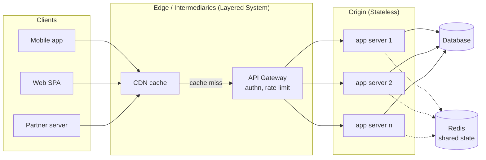
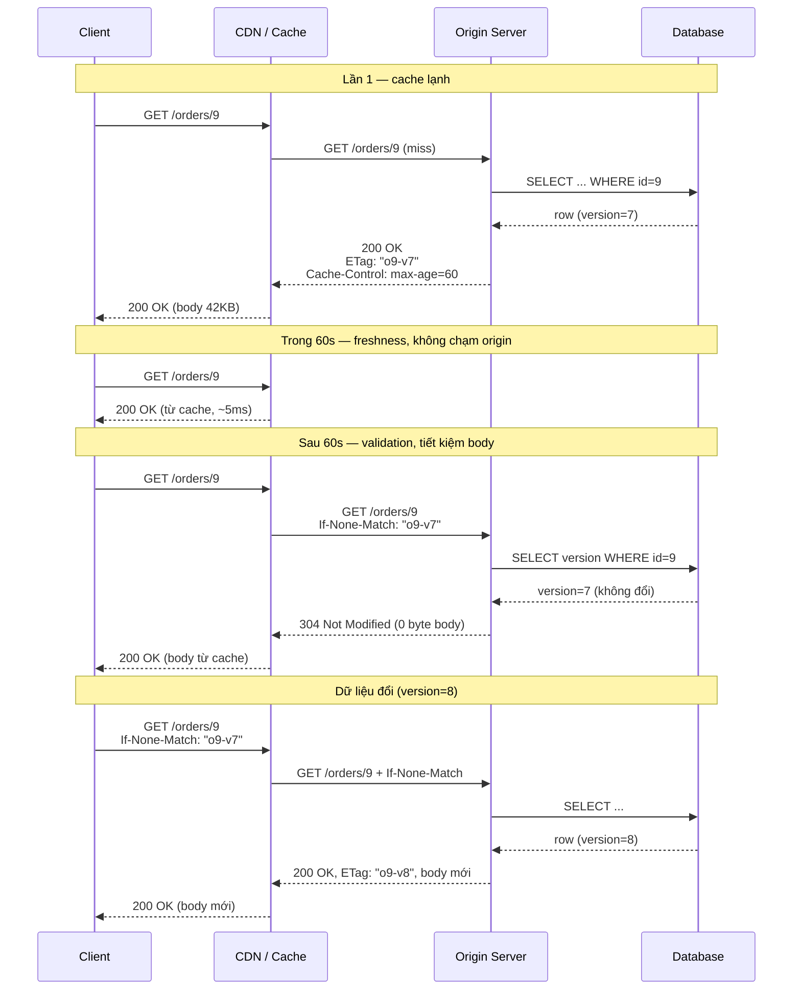

+++
title = "Chương 3. REST — Kiến trúc tài nguyên trên HTTP"
date = "2026-02-22T09:00:00+07:00"
draft = false
tags = ["backend", "communication", "api", "architecture"]
series = ["Backend Communication Architecture"]
+++

[← Chương trước](/series/backend-communication-architect/02-http/) | Mục lục | [Chương sau →](/series/backend-communication-architect/04-graphql/)

---

## 3.1. Problem Statement — bài toán trước khi có giải pháp

Hãy bắt đầu từ một tình huống rất thật. Công ty bạn có một hệ thống quản lý đơn hàng. Ban đầu chỉ có một web app nội bộ gọi thẳng vào database. Sau 18 tháng, bức tranh thay đổi:

- Team mobile cần đọc/ghi đơn hàng từ iOS và Android.
- Đối tác logistics cần truy vấn trạng thái đơn qua máy chủ của họ.
- Team data cần kéo dữ liệu định kỳ để làm báo cáo.
- Một team khác xây admin portal, cũng cần cùng dữ liệu nhưng thao tác khác.

Bốn client, bốn ngôn ngữ, bốn vòng đời release khác nhau — tất cả cần truy cập **cùng một tập dữ liệu** qua HTTP. Câu hỏi kỹ thuật đặt ra:

1. **Interface thống nhất**: làm sao để 4 team client không phải học 4 quy ước khác nhau cho mỗi loại thao tác? Nếu mỗi endpoint tự đặt luật riêng (`/getOrder?id=1`, `/order_fetch`, `/api/loadOrderData`), chi phí tích hợp tăng tuyến tính theo số endpoint × số client.
2. **Cache được**: đối tác logistics poll trạng thái đơn mỗi 30 giây. Nếu mọi request đều xuyên xuống database, bạn trả tiền hạ tầng cho những response giống hệt nhau hàng nghìn lần.
3. **Scale được**: khi traffic tăng 10 lần, bạn muốn thêm server phía sau load balancer là xong — không muốn phát hiện ra rằng request của user A *bắt buộc* phải rơi vào server X vì session nằm ở đó.
4. **Tiến hóa độc lập**: server đổi database, đổi ngôn ngữ, thêm field — client cũ không được chết.

Nếu không có một tập quy ước chung để giải các bài toán trên, mỗi tổ chức sẽ tự phát minh lại — và thực tế trước thời REST phổ biến, RPC-over-HTTP kiểu SOAP/XML-RPC chính là như vậy: mỗi service một WSDL, mỗi thao tác một verb tự đặt, cache HTTP gần như vô dụng vì mọi thứ đi qua `POST /endpoint`.

REST không phải là một công nghệ. Nó là **một tập ràng buộc kiến trúc (architectural constraints)** mà Roy Fielding chưng cất từ chính cách Web đã scale được đến hàng tỷ client. Điểm mấu chốt: mỗi constraint tồn tại để *mua* một thuộc tính hệ thống cụ thể, và *trả giá* bằng một thứ khác. Hiểu REST nghĩa là hiểu bảng giá đó, không phải thuộc lòng "dùng danh từ, đừng dùng động từ trong URL".

## 3.2. Tại sao REST tồn tại — Business, Technical, Scale

**Business problem.** Chi phí tích hợp là chi phí lớn nhất của một API. Một interface thống nhất biến kiến thức thành tài sản tái sử dụng: engineer đã làm việc với một REST API tử tế sẽ đoán đúng 80% cách dùng API thứ hai. Điều này giảm time-to-integrate cho đối tác — trực tiếp là doanh thu với các công ty API-first (Stripe, Twilio).

**Technical problem.** HTTP đã có sẵn một hệ sinh thái khổng lồ: proxy, CDN, load balancer, browser cache, công cụ debug. Nhưng hệ sinh thái đó chỉ hoạt động nếu bạn dùng HTTP *đúng ngữ nghĩa*: GET phải an toàn để cache dám cache, PUT phải idempotent để proxy dám retry. REST là cách khai thác tối đa hạ tầng có sẵn thay vì chui trong tunnel `POST` và tự xây lại mọi thứ.

**Scale problem.** Web scale được vì ba thứ: stateless server (thêm máy là xong), cache nhiều tầng (phần lớn request không chạm origin), và uniform interface (intermediary hiểu được traffic mà không cần hiểu ứng dụng). REST đóng gói đúng ba thứ đó thành constraint.

## 3.3. Sáu constraint — và vì sao từng cái tồn tại

### 3.3.1. Client–Server

**Constraint**: tách concern giữa UI (client) và data storage (server), giao tiếp qua interface.

**Vì sao tồn tại**: cho phép hai phía tiến hóa độc lập. Team mobile release 2 tuần/lần, backend deploy 10 lần/ngày — nếu không có ranh giới interface rõ ràng, mọi thay đổi backend đều là thay đổi client. Cái giá: mọi tương tác phải đi qua network, với đầy đủ failure mode của network (chương 1 đã bàn về fallacies of distributed computing).

### 3.3.2. Stateless

**Constraint**: mỗi request từ client phải chứa **toàn bộ** thông tin cần để server hiểu và xử lý nó. Server không lưu session state giữa các request.

**Vì sao tồn tại**: đây là constraint mua *khả năng scale-out* — sẽ phân tích sâu ở mục 3.5, vì đây là constraint bị vi phạm nhiều nhất trong thực tế.

### 3.3.3. Cacheable

**Constraint**: response phải tự khai báo (ngầm định hoặc tường minh) nó cache được hay không, và cache được bao lâu.

**Vì sao tồn tại**: cache là cách duy nhất để giảm latency *dưới* mức tốc độ ánh sáng cho phép — request không đi thì không tốn thời gian. Nó cũng là đòn bẩy chi phí lớn nhất: một CDN edge phục vụ response tĩnh rẻ hơn origin server hàng chục lần. Cái giá: nguy cơ stale data, và độ phức tạp invalidation. Chi tiết ở mục 3.6.

### 3.3.4. Uniform Interface

Constraint trung tâm, gồm bốn sub-constraint:

1. **Identification of resources** — mọi thứ đáng nói đến đều có định danh (URI). Điều này biến "dữ liệu" thành "địa chỉ": link được, bookmark được, log được, cache theo key được.
2. **Manipulation through representations** — client thao tác resource qua *representation* (JSON, XML...), không chạm vào bản thể trong database. Server tự do đổi storage mà không đổi contract.
3. **Self-descriptive messages** — mỗi message chứa đủ metadata để xử lý nó (method, media type, cache directive). Đây là lý do intermediary (CDN, proxy) hoạt động được: chúng đọc metadata chuẩn, không cần hiểu business logic.
4. **HATEOAS** — hypermedia as the engine of application state; client đi theo link trong response thay vì hardcode URI. Mục 3.8 phân tích vì sao sub-constraint này gần như không được dùng.

**Vì sao tồn tại**: uniform interface là thứ làm cho *toàn bộ hệ sinh thái* (client generic, proxy, cache, crawler, tooling) hoạt động với API của bạn mà không cần code riêng. Cái giá — Fielding nói thẳng trong luận án: hiệu năng. Interface chuẩn hóa không bao giờ tối ưu bằng interface đo ni đóng giày cho một cặp client–server cụ thể. Đây chính là khe hở mà gRPC (chương 5) khai thác cho giao tiếp nội bộ.

### 3.3.5. Layered System

**Constraint**: kiến trúc được phép xếp tầng — client không biết (và không cần biết) nó đang nói chuyện với origin server hay một intermediary.

**Vì sao tồn tại**: cho phép chèn CDN, WAF, API gateway, load balancer vào giữa mà không đổi client. Toàn bộ ngành CDN tồn tại được nhờ constraint này. Cái giá: mỗi tầng thêm latency và một điểm cần vận hành.

### 3.3.6. Code-on-Demand (optional)

**Constraint** (tùy chọn): server có thể gửi code thực thi cho client (JavaScript là ví dụ kinh điển). Với API backend-to-backend, constraint này gần như không dùng — nhắc đến để đầy đủ, và để thấy REST được thiết kế cho Web nói chung, không riêng JSON API.



Điểm cần đọc ra từ diagram: vì server stateless, gateway phân phối request cho *bất kỳ* instance nào; vì response self-descriptive và cacheable, CDN chặn được một phần traffic trước khi nó chạm origin. Hai thuộc tính đó không tự nhiên mà có — chúng là kết quả của việc tuân thủ constraint.

## 3.4. Richardson Maturity Model — thang đo mức độ "REST"

Leonard Richardson đề xuất thang 4 mức để đo một API dùng HTTP "sâu" đến đâu:

| Level | Đặc điểm | Ví dụ | Hệ quả |
|---|---|---|---|
| 0 | Một URI, một method (thường POST), HTTP chỉ là tunnel | `POST /api` body `{"action":"getOrder","id":9}` | Mất toàn bộ hạ tầng HTTP: không cache, không retry an toàn, log/metrics vô nghĩa theo URL |
| 1 | Nhiều URI cho resource, nhưng vẫn một method | `POST /orders/9` cho cả đọc lẫn ghi | Địa chỉ hóa được resource, nhưng intermediary vẫn mù ngữ nghĩa |
| 2 | URI + đúng HTTP verb + đúng status code | `GET /orders/9` → 200, `DELETE /orders/9` → 204 | Cache, retry, monitoring hoạt động. **Đa số API production dừng ở đây** |
| 3 | Level 2 + hypermedia (HATEOAS) | Response chứa link `"cancel": "/orders/9/cancellation"` | Client điều hướng theo link, giảm coupling với URI |

**Vì sao đa số dừng ở Level 2?** Vì Level 2 là điểm mà *chi phí bỏ ra mua được nhiều lợi ích nhất*. Lên Level 3 đòi hỏi client được viết theo kiểu "duyệt hypermedia" — nhưng client thực tế (mobile app, service khác) được viết bởi con người đọc docs và hardcode flow. Lợi ích của HATEOAS chỉ hiện ra khi client *thật sự* generic, điều hiếm gặp ngoài browser. Phân tích sâu hơn ở mục 3.8.

Bài học thực dụng: nếu API của bạn đang ở Level 0–1 (rất nhiều "REST API" nội bộ thực chất là RPC qua POST), hãy lên Level 2 trước khi bàn bất cứ chuyện gì khác — vì Level 2 là nơi cache, idempotency và observability bắt đầu hoạt động.

## 3.5. Resource modeling và URI design

### 3.5.1. Tư duy resource-first

Sai lầm phổ biến nhất khi thiết kế REST API: bắt đầu từ *hành động* ("tôi cần API để hủy đơn") thay vì từ *resource* ("hệ thống có những danh từ nào, quan hệ ra sao"). Quy trình đúng:

1. Liệt kê các danh từ nghiệp vụ: `order`, `customer`, `shipment`, `refund`.
2. Xác định quan hệ: một order có nhiều shipment; refund thuộc về order.
3. Ánh xạ hành động vào method chuẩn trên danh từ. Hành động không map được vào CRUD → **reify** (vật hóa) nó thành resource: "hủy đơn" trở thành việc *tạo* một `cancellation`.

```text
GET    /orders                     # collection
POST   /orders                     # tạo order mới
GET    /orders/{id}                # một order
PATCH  /orders/{id}                # sửa một phần
DELETE /orders/{id}                # xóa (nếu nghiệp vụ cho phép xóa thật)
GET    /orders/{id}/shipments      # sub-resource
POST   /orders/{id}/cancellation   # reify hành động "hủy" thành resource
GET    /orders/{id}/cancellation   # xem trạng thái hủy — miễn phí có luôn!
```

Reification không phải là mẹo lách luật. Nó mua được hai thứ thật: (a) hành động có địa chỉ, nghĩa là có trạng thái tra cứu được, có audit trail tự nhiên; (b) POST tạo resource mới kết hợp được với idempotency key (mục 3.7).

### 3.5.2. Quy ước URI đáng theo — và lý do

| Quy ước | Lý do kỹ thuật (không phải thẩm mỹ) |
|---|---|
| Danh từ số nhiều, không động từ | Động từ đã có ở method; đưa động từ vào URI phá vỡ khả năng suy luận của intermediary |
| Không đuôi `.json` | Format là chuyện của content negotiation (`Accept` header), không phải định danh |
| Lowercase, dấu `-` thay `_` | URI là case-sensitive theo spec (trừ host); đồng nhất giảm lỗi cache key |
| Không nhét filter vào path (`/orders/active`) | `/orders?status=active` cho phép tổ hợp nhiều filter; path dành cho định danh phân cấp |
| Độ sâu tối đa ~2 cấp lồng | `/a/{id}/b/{id}/c/{id}` buộc client biết cả chuỗi ID; sub-resource sâu nên có URI phẳng riêng (`/c/{id}`) |

Điểm tinh tế về sub-resource: `/orders/{id}/shipments` phù hợp khi shipment *chỉ có nghĩa* trong ngữ cảnh order. Nhưng nếu team logistics cần truy cập shipment độc lập, hãy cho nó thêm URI hạng nhất `/shipments/{id}` — một resource có thể có nhiều URI, nhưng mỗi URI chỉ trỏ đến một resource.

## 3.6. Stateless — hệ quả với scale-out và session

### 3.6.1. Cơ chế

Stateless nghĩa là: giữa hai request liên tiếp của cùng một client, server **không được phép nhớ gì** trong bộ nhớ tiến trình mà request sau phụ thuộc vào. Mọi ngữ cảnh — danh tính, quyền, con trỏ phân trang — phải nằm trong request (header, token, cursor) hoặc trong **shared state tier** (database, Redis) mà mọi instance đều với tới được.

Phân biệt quan trọng mà nhiều người nhầm: stateless không có nghĩa là "không có state". Nó nghĩa là **session state nằm ở client, resource state nằm ở storage** — không nằm ở RAM của một app server cụ thể.

### 3.6.2. Vì sao đây là constraint quyết định khả năng scale-out

Xét hai kịch bản với 3 app server sau load balancer:

**Kịch bản A — stateful (session trong RAM):** request đăng nhập của user rơi vào server 1, session lưu ở heap của server 1. Từ đó:
- Load balancer phải bật **sticky session** (hash theo cookie/IP) → phân phối tải lệch, một server nóng trong khi hai server nguội.
- Server 1 chết → toàn bộ user trên đó văng session. Deploy = đăng xuất hàng loạt, nghĩa là bạn *ngại deploy*.
- Autoscaling gần như vô nghĩa: thêm server 4 không gánh được user cũ.

**Kịch bản B — stateless:** danh tính nằm trong token (JWT hoặc opaque token tra ở Redis). Bất kỳ request nào rơi vào bất kỳ server nào cũng xử lý được. Thêm máy = thêm throughput, tuyến tính. Deploy rolling không ai bị ảnh hưởng. Server trở thành **cattle, not pets**.

Cái giá của stateless — phải trả, không miễn phí:
- **Mỗi request to hơn**: token, context đi kèm mọi request thay vì gửi một lần. Fielding gọi đích danh đây là trade-off "per-interaction overhead".
- **Xác thực lặp lại**: verify JWT signature mỗi request (CPU), hoặc tra Redis mỗi request (network hop). Chọn một trong hai kiểu chi phí.
- **Revocation khó**: JWT stateless đúng nghĩa thì không thu hồi được trước khi hết hạn — muốn thu hồi phải thêm denylist, tức là... lại thêm state. Kỹ thuật thực dụng: access token ngắn hạn (5–15 phút, stateless) + refresh token dài hạn (stateful, thu hồi được).

### 3.6.3. Ranh giới thực dụng

Rate limiting, idempotency store, distributed lock — về bản chất là state. Nguyên tắc kiến trúc: **app server tier phải stateless; state dồn về tier chuyên trách** (Redis, database) có chiến lược HA riêng. Câu hỏi kiểm tra nhanh khi review thiết kế: *"Nếu tôi kill -9 một instance bất kỳ ngay lúc này, request kế tiếp của user có sao không?"* — nếu câu trả lời là "có", bạn có state rò rỉ vào app tier.

## 3.7. Cacheability — ETag, Cache-Control, CDN

### 3.7.1. Hai cơ chế, hai mục đích khác nhau

**Freshness (Cache-Control)** — tránh gửi request:

```text
Cache-Control: public, max-age=60, stale-while-revalidate=30
```

Trong 60 giây, cache (browser/CDN) trả response mà **không hỏi origin** — latency bằng 0 network round-trip đến origin. `stale-while-revalidate` cho phép trả bản cũ ngay lập tức trong khi refresh nền — một trong những directive đáng giá nhất cho UX.

**Validation (ETag / Last-Modified)** — tránh gửi lại body:

Server gắn `ETag` (fingerprint của representation) vào response. Lần sau client gửi `If-None-Match: "<etag>"`. Nếu nội dung không đổi, server trả `304 Not Modified` **không có body** — request vẫn đi một vòng, nhưng thay vì tải 200KB JSON, chỉ có headers vài trăm byte.



### 3.7.2. Thiết kế ETag cho đúng

- **Đừng hash cả body mỗi request** nếu tránh được — thế là tốn CPU serialize + hash rồi mới quyết định không gửi. Nếu resource có cột `version` hoặc `updated_at`, dùng nó làm ETag: kiểm tra chỉ tốn một query nhẹ (thậm chí cache được).
- **Strong vs weak ETag**: `W/"abc"` (weak) tuyên bố "tương đương ngữ nghĩa, không chắc giống từng byte" — đủ cho JSON API; strong ETag cần cho range request (file lớn).
- **ETag còn là công cụ concurrency control**: client gửi `If-Match: "o9-v7"` kèm PUT/PATCH; server trả `412 Precondition Failed` nếu version đã đổi → optimistic locking chuẩn HTTP, chống lost update giữa hai client cùng sửa.

### 3.7.3. CDN cho API động

Nhiều team mặc định "API động thì không CDN được" — sai trong nhiều trường hợp:

- Response public, thay đổi chậm (danh mục sản phẩm, tỷ giá, cấu hình): `Cache-Control: public, s-maxage=300` để CDN giữ 5 phút, origin giảm tải đáng kể.
- Response cá nhân hóa: `Cache-Control: private, max-age=30` — chỉ browser cache, CDN không giữ.
- **Cấm cache tuyệt đối** (số dư tài khoản, dữ liệu y tế): `Cache-Control: no-store`.
- Điều nguy hiểm nhất: **quên khai báo**. Heuristic caching của intermediary có thể tự ý cache response không có directive. Quy tắc production: *mọi* endpoint phải khai báo Cache-Control tường minh, kể cả khi giá trị là `no-store`. Và nhớ `Vary: Accept-Encoding, Authorization` khi response phụ thuộc các header đó — thiếu `Vary` là nguồn kinh điển của lỗi "user A thấy dữ liệu user B" qua cache chung.

## 3.8. Idempotency — nền tảng của retry an toàn

### 3.8.1. Vì sao đây là chuyện sống còn

Network fail theo kiểu khó chịu nhất: **bạn không biết request đã được xử lý hay chưa**. Client gửi "tạo thanh toán", timeout — server có thể (a) chưa nhận, (b) nhận nhưng chưa xử lý xong, (c) đã xử lý xong nhưng response lạc mất. Ba trường hợp này client không phân biệt được. Lựa chọn duy nhất là retry — và retry chỉ an toàn khi thao tác idempotent: **thực hiện N lần cho cùng kết quả như 1 lần**.

### 3.8.2. Bảng method × safe × idempotent

| Method | Safe (không đổi state) | Idempotent | Ghi chú |
|---|---|---|---|
| GET | Có | Có | Retry thoải mái, cache được |
| HEAD | Có | Có | Như GET, không body |
| OPTIONS | Có | Có | CORS preflight |
| PUT | Không | **Có** | Replace toàn bộ — ghi 2 lần cùng nội dung = 1 lần |
| DELETE | Không | **Có** | Xóa 2 lần = xóa 1 lần (lần 2 trả 404 vẫn là idempotent về *state*) |
| POST | Không | **Không** | Gửi 2 lần = 2 resource / 2 lần trừ tiền |
| PATCH | Không | **Không đảm bảo** | `{"op":"increment"}` không idempotent; set-field thì có — spec không hứa gì |

Safe ⊂ idempotent: mọi method safe đều idempotent, chiều ngược lại không đúng (PUT idempotent nhưng không safe). Ý nghĩa vận hành: proxy/SDK/service mesh được phép **tự động retry** method idempotent khi lỗi network; với POST thì không — trừ khi bạn tự chế tạo idempotency bằng cơ chế dưới đây.

### 3.8.3. Idempotency key cho POST

Cơ chế (Stripe phổ biến hóa pattern này):

1. Client sinh key duy nhất cho *mỗi ý định nghiệp vụ* (UUID v4), gửi trong header `Idempotency-Key`.
2. Server, **trước khi xử lý**, ghi key vào store (Redis/DB) với trạng thái `in-flight` — bằng thao tác atomic (`SETNX`).
3. Xử lý xong, lưu (status code + body) dưới key đó, TTL 24–48h.
4. Request lặp lại với cùng key: trả lại đúng response đã lưu, **không xử lý lại**.
5. Request đến khi key đang `in-flight`: trả `409 Conflict` (hoặc chờ) — chống double-submit chạy song song.

Ba điểm chết người nếu làm sai:
- **Check-then-set không atomic** → hai request song song cùng qua bước check → double charge. Phải dùng `SETNX`/`INSERT ... ON CONFLICT`.
- **Key do server sinh** → vô nghĩa. Key phải do client sinh, vì chỉ client biết hai request là *cùng một ý định* hay hai ý định khác nhau.
- **Chỉ lưu key, không lưu response** → request retry nhận 200 rỗng thay vì kết quả gốc, client không biết payment ID là gì.

Code Go đầy đủ cho middleware này ở mục 3.13.

## 3.9. HATEOAS — cơ chế, và vì sao thực tế ít dùng

### 3.9.1. Cơ chế

Response không chỉ chứa dữ liệu mà chứa **các bước đi tiếp hợp lệ** dưới dạng link:

```json
{
  "id": "ord_9",
  "status": "confirmed",
  "total": {"amount": 250000, "currency": "VND"},
  "_links": {
    "self":     {"href": "/orders/ord_9"},
    "cancel":   {"href": "/orders/ord_9/cancellation", "method": "POST"},
    "payment":  {"href": "/orders/ord_9/payment"}
  }
}
```

Ý tưởng đẹp: client không hardcode URI, không hardcode business rule ("đơn `shipped` không hủy được" — đơn giản là link `cancel` biến mất). Server đổi URI structure, đổi rule — client không cần deploy lại. Đây chính xác là cách browser + HTML hoạt động: bạn không hardcode URL của nút "Thanh toán", bạn bấm link server đưa.

### 3.9.2. Vì sao ít được dùng

1. **Không có client generic.** Browser là generic client của HTML vì có *con người* nhìn màn hình và quyết định bấm gì. Client API là *code* — code phải được viết trước, bởi người đọc docs, và người đó sẽ hardcode flow dù bạn có gửi link hay không. Link trong response trở thành payload thừa.
2. **Chi phí trả ngay, lợi ích trả sau (và có thể không bao giờ).** Đổi URI structure là sự kiện hiếm; team trả chi phí serialize/maintain link mỗi ngày để phòng một sự kiện vài năm một lần — kèm theo đó vẫn chẳng dám đổi URI vì không chắc *mọi* client đều theo link.
3. **Không giải quyết vấn đề khó nhất**: link cho biết *đi đâu*, không cho biết *gửi body gì*. Muốn tự mô tả body cần thêm form descriptor (như HTML form) — các chuẩn (HAL-FORMS, Siren) tồn tại nhưng chưa bao giờ đạt critical mass, và thiếu tooling là án tử với chuẩn API.
4. **Chatty**: client hypermedia đúng nghĩa phải "duyệt" từ entry point qua nhiều bước — thêm round-trip trên mobile network là thứ không ai chấp nhận.

**Phần đáng giữ lại**: link `self`, link phân trang (`next`, `prev` — mục 3.11), và ý tưởng *affordance theo trạng thái* (trả về danh sách `available_actions` để UI ẩn/hiện nút — không cần client tự suy luận lại business rule). Đó là HATEOAS liều thấp, chi phí thấp, lợi ích thật.

## 3.10. Versioning — URI vs Header vs Media type

Trước khi chọn cách version, hãy nhớ nguyên tắc giảm nhu cầu version: **thay đổi tương thích thì không cần version mới**. Thêm field mới, thêm endpoint mới, nới lỏng validation — tương thích. Đổi tên field, đổi kiểu, xóa field, siết validation — breaking. Kỷ luật phía client cũng quan trọng: client phải **bỏ qua field lạ** (tolerant reader), đừng bật strict deserialization rồi chết vì server thêm một field.

Khi buộc phải breaking change:

| Tiêu chí | URI (`/v2/orders`) | Header (`X-API-Version: 2`) | Media type (`Accept: application/vnd.co.v2+json`) |
|---|---|---|---|
| Dễ dùng/debug (curl, browser) | Tốt nhất | Trung bình | Kém |
| "Đúng" theo lý thuyết REST | Kém (URI mới ≠ resource mới) | Trung bình | Đúng nhất (version hóa representation) |
| Cache/CDN | Tự nhiên (URI là cache key) | Cần `Vary` — dễ quên | Cần `Vary: Accept` |
| Routing theo version ở gateway | Dễ (path-based) | Được | Khó hơn |
| Quên chỉ định version | Không thể quên | Cần quy ước default | Cần quy ước default |
| Thực tế ai dùng | Đa số (Google, Twitter...) | Ít | GitHub (kết hợp date-based) |

Khuyến nghị thực dụng: **URI versioning với major version thô** (`/v1`, `/v2`), coi nó như định danh của *contract* chứ không phải của resource. Lý lẽ "URI versioning không REST" đúng về lý thuyết nhưng cái giá thực tế (debug khó, cache dễ sai vì quên Vary, routing phức tạp) thường không đáng. Điều quan trọng hơn cách chọn: **chính sách deprecation** — công bố lịch, gắn header `Deprecation`/`Sunset` vào response v1, đo lường ai còn gọi, và thực sự tắt nó. Version sống mãi là nợ vận hành kép: mọi bug fix phải làm hai nơi.

## 3.11. Pagination — offset vs cursor, phân tích tận gốc

### 3.11.1. Offset pagination và vì sao nó chết ở bảng lớn

```sql
SELECT * FROM orders ORDER BY created_at DESC LIMIT 20 OFFSET 100000;
```

Vấn đề nằm ở chỗ **OFFSET không phải là phép nhảy — nó là phép đếm**. B-tree index cho phép *seek* đến một giá trị key trong O(log n), nhưng không có cấu trúc nào cho phép "nhảy đến phần tử thứ 100.000 theo thứ tự sắp xếp" (trừ khi duy trì counted B-tree — các RDBMS phổ biến không làm). Vậy nên engine phải:

1. Duyệt index theo thứ tự, **đọc và vứt bỏ 100.000 entry đầu** (kèm heap fetch nếu cần cột ngoài index),
2. rồi mới trả 20 dòng bạn cần.

Chi phí trang thứ k là **O(k × page_size)** — tuyến tính theo độ sâu. Trang 1 mất 2ms, trang 5.000 mất hàng giây, và mỗi query như vậy chiếm buffer pool, đẩy page nóng của người khác ra khỏi cache. Một crawler kiên nhẫn duyệt tuần tự đến trang sâu là đủ để kéo sập database — failure example ở mục 3.16 mô tả đúng kịch bản này.

Vấn đề thứ hai, ít được nhắc nhưng nghiêm trọng không kém: **kết quả không ổn định dưới ghi**. Giữa lúc client đọc trang 1 và trang 2, nếu có dòng mới chen vào đầu danh sách, mọi dòng dịch xuống một vị trí → client thấy lặp phần tử cuối trang 1 ở đầu trang 2 (hoặc mất phần tử nếu có xóa). Với feed dữ liệu ghi nhiều, offset pagination *sai về ngữ nghĩa* chứ không chỉ chậm.

Offset mua được gì để đổi lại? Nhảy đến trang bất kỳ ("trang 7 của kết quả tìm kiếm") và đếm tổng số trang. Nếu UI của bạn thật sự cần hai thứ đó — admin table nhỏ, dữ liệu ít ghi — offset vẫn là lựa chọn hợp lý.

### 3.11.2. Cursor (keyset) pagination — cơ chế

Thay vì "bỏ qua k dòng", ta nói với database điều nó làm giỏi nhất: **seek đến một vị trí trong index**.

```sql
-- Trang đầu
SELECT id, created_at, ... FROM orders
ORDER BY created_at DESC, id DESC
LIMIT 21;   -- lấy dư 1 để biết còn trang sau không

-- Trang kế: "mọi thứ đứng SAU dòng cuối của trang trước"
SELECT id, created_at, ... FROM orders
WHERE (created_at, id) < ($1, $2)      -- row-value comparison
ORDER BY created_at DESC, id DESC
LIMIT 21;
```

Các điểm thiết kế bắt buộc hiểu:

- **Sort key phải xác định toàn phần (total order)**: `created_at` có thể trùng giữa hai dòng → phải thêm tie-breaker duy nhất (`id`). Thiếu tie-breaker là bug kinh điển: dòng bị lặp hoặc mất ở ranh giới trang.
- **Row-value comparison** `(a,b) < ($1,$2)` khớp thẳng với composite index `(created_at DESC, id DESC)` → engine seek một phát đến đúng vị trí, đọc đúng 21 entry. Chi phí **O(page_size)** bất kể trang sâu bao nhiêu. (Viết dạng khai triển `a < $1 OR (a = $1 AND b < $2)` hoạt động ở mọi DB nhưng optimizer một số bản xử lý kém hơn row-value.)
- **Cursor encode thế nào**: cursor = giá trị sort key của dòng cuối trang, serialize (JSON/binary) rồi **base64url** để đi trong query string. Encode base64 không phải để bảo mật mà để (a) opaque — client không nên parse và tự chế cursor, cho phép server đổi format sau này; (b) an toàn URL. Nếu sợ client giả mạo cursor để dò dữ liệu, thêm HMAC. Ví dụ cursor decode ra: `{"t":"2026-07-01T09:30:00Z","id":"ord_8421"}`.
- **Ổn định dưới ghi**: dòng mới chen vào *trước* vị trí cursor không ảnh hưởng các trang sau — vì điều kiện WHERE neo theo *giá trị*, không theo *vị trí*.

Cái giá của cursor: không nhảy trang bất kỳ, không "tổng số trang" rẻ (nếu cần, đếm ước lượng hoặc đếm riêng), sort động theo nhiều tiêu chí phức tạp hơn (mỗi sort order cần index tương ứng), và cursor có thể "mồ côi" nếu dòng neo bị xóa (không sao — điều kiện `<` vẫn đúng, đây là ưu điểm của việc neo theo giá trị thay vì theo ID tồn tại).

### 3.11.3. Response format

```json
{
  "data": [ /* 20 items */ ],
  "page_info": {
    "next_cursor": "eyJ0IjoiMjAyNi0wNy0wMVQwOTozMDowMFoiLCJpZCI6Im9yZF84NDIxIn0",
    "has_next": true
  }
}
```

Kèm header `Link: <...?cursor=...>; rel="next"` (RFC 8288) nếu muốn client generic dùng được — mảnh HATEOAS đáng giữ.

## 3.12. Filtering, Sorting và contract OpenAPI

### 3.12.1. Filtering / Sorting

- Filter qua query param, mỗi field một param: `GET /orders?status=confirmed&customer_id=c_12&created_after=2026-07-01`. Tránh phát minh mini-language trong một param (`?q=status:eq:confirmed AND ...`) — parse phức tạp, khó validate, khó document; nếu nhu cầu query phức tạp đến mức đó, đó là tín hiệu cân nhắc GraphQL (chương 4) hoặc một search endpoint riêng.
- **Whitelist sort field**: `?sort=-created_at,total`. Cho sort tự do theo mọi cột = cho client tạo query không có index → chính là bài toán offset ở trên dưới hình thức khác. Mỗi sort được phép phải có index chống lưng, và cursor phải encode theo sort key tương ứng.
- Trả `400` với thông điệp rõ ràng khi param không hợp lệ — đừng âm thầm bỏ qua filter sai chính tả (`?staus=confirmed` trả toàn bộ orders là một security incident chờ ngày xảy ra).

### 3.12.2. OpenAPI — contract-first vs code-first

| | Contract-first (viết YAML trước) | Code-first (generate từ code) |
|---|---|---|
| Cơ chế | Thiết kế spec → review → generate server stub + client SDK | Viết handler + annotation → generate spec |
| Ưu | Client/server làm song song từ ngày 1; spec được *thiết kế* chứ không *lộ ra*; breaking change bị chặn ở review spec; mock server từ spec | Không bao giờ lệch code (spec sinh từ code); ma sát thấp, hợp team nhỏ di chuyển nhanh |
| Nhược | Cần kỷ luật giữ spec ↔ code khớp (phải có CI validate); tooling generate Go server tốt nhưng không hoàn hảo | Spec chỉ tốt bằng annotation — thường thiếu example, error case; thiết kế API bị dẫn dắt bởi cấu trúc code nội bộ |
| Phù hợp | API public, nhiều consumer, nhiều team | API nội bộ, ít consumer, prototype |

Dù chọn hướng nào, hai thứ không được thiếu trong CI: (1) **contract test** — chạy spec chống lại server thật (Schemathesis hoặc tương đương) để bắt drift; (2) **breaking-change detection** trên diff của spec (oasdiff hoặc tương đương) để một PR đổi kiểu field bị chặn tự động thay vì được phát hiện bởi khách hàng.

## 3.13. Production-grade REST API bằng Go + chi

Dưới đây là một service thu nhỏ nhưng đủ các thành phần production: middleware chain, error theo RFC 7807, cursor pagination, và idempotency-key middleware. Code chạy được với `go 1.22+`, dependency: `github.com/go-chi/chi/v5`, `github.com/redis/go-redis/v9`.

### 3.13.1. Error model — RFC 7807 (Problem Details)

Vì sao cần chuẩn error: mỗi endpoint tự chế format error (`{"error": "..."}`, `{"message": "..."}`, `{"err_code": 5}`) nghĩa là mỗi client phải viết N bộ parser. RFC 7807 chuẩn hóa: media type `application/problem+json`, các field `type`, `title`, `status`, `detail`, `instance`, mở rộng tùy ý.

```go
// problem/problem.go
package problem

import (
	"encoding/json"
	"net/http"
)

// Details theo RFC 7807. "type" là URI định danh LOẠI lỗi —
// client branch theo type, không parse chuỗi detail (chuỗi được phép đổi).
type Details struct {
	Type     string `json:"type"`               // vd: "https://api.example.com/problems/validation"
	Title    string `json:"title"`              // mô tả ngắn, ổn định theo type
	Status   int    `json:"status"`             // trùng HTTP status
	Detail   string `json:"detail,omitempty"`   // diễn giải cho lần lỗi cụ thể này
	Instance string `json:"instance,omitempty"` // URI của request gặp lỗi
	// Extension: gắn trace ID để user report lỗi là ops tra được ngay.
	TraceID string `json:"trace_id,omitempty"`
	// Extension cho lỗi validation: chỉ đích danh field sai.
	InvalidParams []InvalidParam `json:"invalid_params,omitempty"`
}

type InvalidParam struct {
	Name   string `json:"name"`
	Reason string `json:"reason"`
}

func Write(w http.ResponseWriter, r *http.Request, p Details) {
	if p.Instance == "" {
		p.Instance = r.URL.Path
	}
	if tid := r.Header.Get("X-Trace-Id"); tid != "" {
		p.TraceID = tid
	}
	w.Header().Set("Content-Type", "application/problem+json")
	w.WriteHeader(p.Status)
	_ = json.NewEncoder(w).Encode(p)
}

func Validation(w http.ResponseWriter, r *http.Request, params []InvalidParam) {
	Write(w, r, Details{
		Type:          "https://api.example.com/problems/validation",
		Title:         "Request validation failed",
		Status:        http.StatusBadRequest,
		InvalidParams: params,
	})
}
```

### 3.13.2. Cursor pagination

```go
// pagination/cursor.go
package pagination

import (
	"encoding/base64"
	"encoding/json"
	"errors"
	"time"
)

// Cursor neo theo GIÁ TRỊ sort key của dòng cuối trang trước.
// Encode base64url để opaque với client — server giữ quyền đổi format.
type Cursor struct {
	CreatedAt time.Time `json:"t"`
	ID        string    `json:"id"` // tie-breaker: created_at có thể trùng
}

var ErrBadCursor = errors.New("malformed cursor")

func Encode(c Cursor) string {
	b, _ := json.Marshal(c)
	return base64.RawURLEncoding.EncodeToString(b)
}

func Decode(s string) (Cursor, error) {
	var c Cursor
	b, err := base64.RawURLEncoding.DecodeString(s)
	if err != nil {
		return c, ErrBadCursor
	}
	if err := json.Unmarshal(b, &c); err != nil || c.ID == "" {
		return c, ErrBadCursor // cursor hỏng là lỗi 400 của client, không phải 500
	}
	return c, nil
}
```

```go
// store/orders.go
package store

import (
	"context"
	"database/sql"
	"time"
)

type Order struct {
	ID        string    `json:"id"`
	Status    string    `json:"status"`
	TotalVND  int64     `json:"total_vnd"`
	CreatedAt time.Time `json:"created_at"`
	Version   int64     `json:"-"` // dùng làm ETag, không expose
}

type OrderStore struct{ DB *sql.DB }

// ListAfter dùng keyset: seek thẳng vào composite index
// (created_at DESC, id DESC) — chi phí O(limit) bất kể độ sâu trang.
// after == nil nghĩa là trang đầu.
func (s *OrderStore) ListAfter(ctx context.Context, after *struct {
	T  time.Time
	ID string
}, limit int) ([]Order, error) {
	const base = `SELECT id, status, total_vnd, created_at, version FROM orders `
	var rows *sql.Rows
	var err error
	if after == nil {
		rows, err = s.DB.QueryContext(ctx,
			base+`ORDER BY created_at DESC, id DESC LIMIT $1`, limit)
	} else {
		// Row-value comparison: khớp thẳng composite index, một lần seek.
		rows, err = s.DB.QueryContext(ctx,
			base+`WHERE (created_at, id) < ($1, $2)
			      ORDER BY created_at DESC, id DESC LIMIT $3`,
			after.T, after.ID, limit)
	}
	if err != nil {
		return nil, err
	}
	defer rows.Close()
	var out []Order
	for rows.Next() {
		var o Order
		if err := rows.Scan(&o.ID, &o.Status, &o.TotalVND, &o.CreatedAt, &o.Version); err != nil {
			return nil, err
		}
		out = append(out, o)
	}
	return out, rows.Err()
}
```

### 3.13.3. Idempotency-key middleware

```go
// idempotency/middleware.go
package idempotency

import (
	"bytes"
	"context"
	"crypto/sha256"
	"encoding/hex"
	"encoding/json"
	"io"
	"net/http"
	"time"

	"github.com/redis/go-redis/v9"
)

type storedResponse struct {
	Status      int    `json:"status"`
	Body        []byte `json:"body"`
	ContentType string `json:"content_type"`
	ReqHash     string `json:"req_hash"` // chống dùng lại key cho payload KHÁC
}

type Middleware struct {
	RDB *redis.Client
	TTL time.Duration // 24–48h là hợp lý: đủ dài cho retry, đủ ngắn để store không phình
}

// recorder chặn response để lưu lại — request lặp phải nhận ĐÚNG response gốc.
type recorder struct {
	http.ResponseWriter
	status int
	buf    bytes.Buffer
}

func (r *recorder) WriteHeader(code int) { r.status = code; r.ResponseWriter.WriteHeader(code) }
func (r *recorder) Write(b []byte) (int, error) {
	r.buf.Write(b)
	return r.ResponseWriter.Write(b)
}

func (m *Middleware) Handler(next http.Handler) http.Handler {
	return http.HandlerFunc(func(w http.ResponseWriter, r *http.Request) {
		if r.Method != http.MethodPost { // PUT/DELETE đã idempotent sẵn
			next.ServeHTTP(w, r)
			return
		}
		key := r.Header.Get("Idempotency-Key")
		if key == "" {
			// Chính sách: endpoint tạo tiền/đơn nên BẮT BUỘC key.
			http.Error(w, `{"title":"Idempotency-Key header required","status":400}`,
				http.StatusBadRequest)
			return
		}

		// Hash body để phát hiện client tái dùng key cho payload khác — đó là bug
		// phía client và phải trả 422, không được im lặng trả response cũ.
		body, err := io.ReadAll(io.LimitReader(r.Body, 1<<20))
		if err != nil {
			http.Error(w, "cannot read body", http.StatusBadRequest)
			return
		}
		r.Body = io.NopCloser(bytes.NewReader(body))
		sum := sha256.Sum256(body)
		reqHash := hex.EncodeToString(sum[:])

		ctx := r.Context()
		redisKey := "idem:" + key

		// Bước quyết định: SETNX — atomic check-and-claim. Nếu tách thành
		// GET rồi SET, hai request song song cùng lọt qua → double execution.
		claimed, err := m.RDB.SetNX(ctx, redisKey,
			`{"status":0,"req_hash":"`+reqHash+`"}`, m.TTL).Result()
		if err != nil {
			// Redis chết: fail-closed với endpoint tiền bạc (503 + Retry-After),
			// vì thà chậm còn hơn double charge. Đây là quyết định NGHIỆP VỤ.
			w.Header().Set("Retry-After", "2")
			http.Error(w, "idempotency store unavailable", http.StatusServiceUnavailable)
			return
		}

		if !claimed { // key đã tồn tại: hoặc đã xong, hoặc đang chạy
			raw, err := m.RDB.Get(ctx, redisKey).Bytes()
			if err != nil {
				http.Error(w, "idempotency store unavailable", http.StatusServiceUnavailable)
				return
			}
			var st storedResponse
			_ = json.Unmarshal(raw, &st)
			switch {
			case st.ReqHash != reqHash:
				http.Error(w, `{"title":"Idempotency-Key reused with different payload","status":422}`,
					http.StatusUnprocessableEntity)
			case st.Status == 0: // in-flight: bản gốc chưa xử lý xong
				w.Header().Set("Retry-After", "1")
				http.Error(w, `{"title":"Request with this key is in flight","status":409}`,
					http.StatusConflict)
			default: // replay response gốc, đánh dấu để client/ops biết
				w.Header().Set("Content-Type", st.ContentType)
				w.Header().Set("Idempotency-Replayed", "true")
				w.WriteHeader(st.Status)
				_, _ = w.Write(st.Body)
			}
			return
		}

		// Ta là request đầu tiên: xử lý và lưu response.
		rec := &recorder{ResponseWriter: w, status: http.StatusOK}
		next.ServeHTTP(rec, r.WithContext(context.WithValue(ctx, ctxKey{}, key)))

		// Lỗi 5xx không lưu — cho phép client retry chạy lại logic.
		// (Kỹ hơn nữa: xóa key để nhả claim ngay thay vì đợi TTL.)
		if rec.status >= 500 {
			_ = m.RDB.Del(ctx, redisKey).Err()
			return
		}
		st, _ := json.Marshal(storedResponse{
			Status: rec.status, Body: rec.buf.Bytes(),
			ContentType: rec.Header().Get("Content-Type"), ReqHash: reqHash,
		})
		_ = m.RDB.Set(ctx, redisKey, st, m.TTL).Err()
	})
}

type ctxKey struct{}
```

Quyết định thiết kế đáng chú ý trong đoạn trên: (1) `SetNX` là trái tim — atomicity không thương lượng được; (2) hash body để bắt lỗi client dùng lại key; (3) khi Redis chết, chọn fail-closed cho endpoint tài chính — trade-off availability lấy correctness, và đó là quyết định phải được nghiệp vụ phê duyệt chứ không phải engineer tự quyết trong code.

### 3.13.4. Handler, ETag và router

```go
// main.go
package main

import (
	"context"
	"database/sql"
	"encoding/json"
	"errors"
	"fmt"
	"log/slog"
	"net/http"
	"os"
	"os/signal"
	"strconv"
	"syscall"
	"time"

	"github.com/go-chi/chi/v5"
	"github.com/go-chi/chi/v5/middleware"
	"github.com/redis/go-redis/v9"

	"example.com/orders/idempotency"
	"example.com/orders/pagination"
	"example.com/orders/problem"
	"example.com/orders/store"
)

type API struct{ Orders *store.OrderStore }

// GET /v1/orders?cursor=...&limit=...
func (a *API) listOrders(w http.ResponseWriter, r *http.Request) {
	limit := 20
	if s := r.URL.Query().Get("limit"); s != "" {
		n, err := strconv.Atoi(s)
		if err != nil || n < 1 || n > 100 { // chặn trần: limit=100000 là một dạng DoS
			problem.Validation(w, r, []problem.InvalidParam{
				{Name: "limit", Reason: "must be an integer in [1,100]"}})
			return
		}
		limit = n
	}

	var after *struct {
		T  time.Time
		ID string
	}
	if cs := r.URL.Query().Get("cursor"); cs != "" {
		c, err := pagination.Decode(cs)
		if err != nil {
			problem.Validation(w, r, []problem.InvalidParam{
				{Name: "cursor", Reason: "malformed or expired cursor"}})
			return
		}
		after = &struct {
			T  time.Time
			ID string
		}{c.CreatedAt, c.ID}
	}

	// Lấy dư 1 dòng: cách rẻ nhất để biết has_next mà không cần COUNT(*).
	items, err := a.Orders.ListAfter(r.Context(), after, limit+1)
	if err != nil {
		problem.Write(w, r, problem.Details{
			Type: "https://api.example.com/problems/internal",
			Title: "Internal error", Status: http.StatusInternalServerError})
		return
	}
	hasNext := len(items) > limit
	if hasNext {
		items = items[:limit]
	}
	var next string
	if hasNext && len(items) > 0 {
		last := items[len(items)-1]
		next = pagination.Encode(pagination.Cursor{CreatedAt: last.CreatedAt, ID: last.ID})
	}

	w.Header().Set("Content-Type", "application/json")
	w.Header().Set("Cache-Control", "private, max-age=10") // tường minh, kể cả khi ngắn
	if next != "" {
		w.Header().Set("Link",
			fmt.Sprintf(`</v1/orders?cursor=%s&limit=%d>; rel="next"`, next, limit))
	}
	_ = json.NewEncoder(w).Encode(map[string]any{
		"data": items,
		"page_info": map[string]any{
			"next_cursor": next, "has_next": hasNext,
		},
	})
}

// GET /v1/orders/{id} — ETag từ cột version: validation không cần serialize body.
func (a *API) getOrder(w http.ResponseWriter, r *http.Request) {
	id := chi.URLParam(r, "id")
	o, err := a.Orders.Get(r.Context(), id)
	if errors.Is(err, sql.ErrNoRows) {
		problem.Write(w, r, problem.Details{
			Type: "https://api.example.com/problems/not-found",
			Title: "Order not found", Status: http.StatusNotFound,
			Detail: fmt.Sprintf("no order with id %q", id)})
		return
	}
	if err != nil {
		problem.Write(w, r, problem.Details{
			Type: "https://api.example.com/problems/internal",
			Title: "Internal error", Status: http.StatusInternalServerError})
		return
	}

	// ETag từ version: so sánh rẻ, đổi mỗi lần UPDATE (version = version + 1).
	etag := fmt.Sprintf(`"o-%s-v%d"`, o.ID, o.Version)
	w.Header().Set("ETag", etag)
	w.Header().Set("Cache-Control", "private, max-age=0, must-revalidate")
	if r.Header.Get("If-None-Match") == etag {
		w.WriteHeader(http.StatusNotModified) // 0 byte body
		return
	}
	w.Header().Set("Content-Type", "application/json")
	_ = json.NewEncoder(w).Encode(o)
}

func main() {
	logger := slog.New(slog.NewJSONHandler(os.Stdout, nil))
	db, err := sql.Open("pgx", os.Getenv("DATABASE_URL"))
	if err != nil {
		logger.Error("db open", "err", err)
		os.Exit(1)
	}
	rdb := redis.NewClient(&redis.Options{Addr: os.Getenv("REDIS_ADDR")})
	api := &API{Orders: &store.OrderStore{DB: db}}
	idem := &idempotency.Middleware{RDB: rdb, TTL: 24 * time.Hour}

	r := chi.NewRouter()
	// Thứ tự middleware LÀ thiết kế: RequestID trước để mọi log/error có trace id;
	// Recoverer trong cùng để panic của handler vẫn được các tầng ngoài ghi nhận.
	r.Use(middleware.RequestID)
	r.Use(middleware.RealIP)
	r.Use(middleware.Logger)
	r.Use(middleware.Recoverer)
	r.Use(middleware.Timeout(15 * time.Second)) // không request nào được treo vô hạn
	r.Use(middleware.Compress(5))

	r.Route("/v1", func(r chi.Router) {
		r.Get("/orders", api.listOrders)
		r.With(idem.Handler).Post("/orders", api.createOrder)
		r.Get("/orders/{id}", api.getOrder)
		r.With(idem.Handler).Post("/orders/{id}/cancellation", api.cancelOrder)
	})
	r.Get("/healthz", func(w http.ResponseWriter, _ *http.Request) { w.WriteHeader(200) })

	srv := &http.Server{
		Addr:              ":8080",
		Handler:           r,
		ReadHeaderTimeout: 5 * time.Second,  // chống Slowloris
		ReadTimeout:       10 * time.Second,
		WriteTimeout:      20 * time.Second, // > middleware.Timeout để 504 kịp ghi ra
		IdleTimeout:       120 * time.Second,
	}

	// Graceful shutdown: điều kiện tiên quyết của zero-downtime deploy.
	go func() {
		if err := srv.ListenAndServe(); err != nil && !errors.Is(err, http.ErrServerClosed) {
			logger.Error("listen", "err", err)
			os.Exit(1)
		}
	}()
	stop := make(chan os.Signal, 1)
	signal.Notify(stop, os.Interrupt, syscall.SIGTERM)
	<-stop
	ctx, cancel := context.WithTimeout(context.Background(), 30*time.Second)
	defer cancel()
	_ = srv.Shutdown(ctx) // ngừng nhận request mới, chờ request đang chạy xong
	logger.Info("shutdown complete")
}
```

(`createOrder`, `cancelOrder`, `Get` của store lược bớt cho gọn — cấu trúc tương tự `getOrder`.)

## 3.14. Benchmark minh họa — chi phí JSON và giá trị của cache

**Số liệu minh họa, phụ thuộc môi trường** (đo trên máy dev 8 core, Go 1.22, payload order list 20 items; bạn phải tự đo trên hệ của mình trước khi ra quyết định).

Chi phí serialize một response 20 orders (~18KB JSON):

| Thao tác | Thời gian/op | Allocations | Ghi chú |
|---|---|---|---|
| `encoding/json` Marshal | ~95 µs | ~210 allocs | Reflection-based |
| Marshal + gzip level 5 | ~240 µs | — | Đổi CPU lấy bandwidth |
| Protobuf marshal (cùng dữ liệu) | ~18 µs | ~25 allocs | Để so sánh — chương 5 |
| Kích thước JSON | 18.4 KB | | |
| JSON + gzip | 3.1 KB | | Tỷ lệ nén ~6x với JSON lặp key |
| Protobuf | 5.6 KB | | Nhỏ hơn JSON thô, thua JSON gzip về size |

Latency end-to-end của `GET /orders/{id}` theo từng tầng cache (p50, client cùng region):

| Kịch bản | p50 | Tải lên origin | Ghi chú |
|---|---|---|---|
| Không cache, mỗi request chạm DB | ~28 ms | 100% | Baseline |
| ETag/304 (validation) | ~9 ms | 100% request, ~5% bandwidth | Vẫn tốn connection + query version |
| CDN hit (`s-maxage=60`) | ~4 ms | ~2% (chỉ miss) | Origin gần như nhàn rỗi |

Hai kết luận đọc ra từ bảng: (1) JSON chậm hơn binary formats cả về CPU lẫn size — nhưng với đa số API, chi phí đó nhỏ so với query DB và network, và mua được debuggability + hệ sinh thái; chỉ khi profile chỉ ra serialize là hotspot mới đáng đổi format. (2) Cache theo tầng có hiệu quả bậc thang: 304 tiết kiệm bandwidth, nhưng freshness caching (CDN hit) mới tiết kiệm cả compute — thiết kế Cache-Control đáng công hơn tối ưu serializer.

## 3.15. Production concerns

- **Deployment**: stateless app tier + graceful shutdown (code trên) + readiness probe tách khỏi liveness probe. Readiness trả false khi đang shutdown để LB rút traffic *trước khi* process dừng nhận request — thiếu bước này, rolling deploy tạo một loạt 502.
- **Timeout theo tầng**: quy tắc *timeout phía ngoài > tổng timeout phía trong*. Ví dụ: LB 30s > server WriteTimeout 20s > middleware timeout 15s > DB query timeout 10s. Đảo ngược thứ tự là công thức tạo goroutine mồ côi tiếp tục cày DB sau khi client đã bỏ đi — luôn truyền `r.Context()` xuống mọi query để hủy lan truyền.
- **Retry**: chỉ auto-retry method idempotent (GET/PUT/DELETE, và POST *có* idempotency key), với exponential backoff **+ jitter** (retry đồng loạt không jitter tạo thundering herd — chính là sóng thứ hai đánh sập hệ vừa gượng dậy). Tôn trọng `Retry-After` từ server.
- **Circuit breaker**: đặt ở client gọi downstream. Khi tỷ lệ lỗi vượt ngưỡng → mở mạch, fail fast, cho downstream thở; hé mạch (half-open) thăm dò trước khi đóng lại. Kết hợp với **load shedding** phía server: trả 429/503 sớm khi quá tải tốt hơn là nhận rồi timeout.
- **Load balancing**: stateless cho phép round-robin/least-request thuần túy. Bật connection reuse (keep-alive) từ LB về origin; theo dõi phân phối connection khi dùng HTTP/2 (ít connection, multiplexing — LB kiểu per-connection sẽ lệch tải).
- **Monitoring**: RED metrics (Rate, Errors, Duration) *theo route template* (`/orders/{id}`, không phải `/orders/9` — cardinality metrics nổ tung nếu label theo URL thô). Thêm: tỷ lệ 304, cache hit ratio ở CDN, độ sâu pagination (histogram limit × số trang), tỷ lệ replay idempotency (tăng đột biến = client nào đó đang retry bão).
- **Tracing**: propagate W3C `traceparent` qua mọi hop; span cho DB query và Redis call. Trace là công cụ duy nhất trả lời "request chậm vì tầng nào" trong hệ nhiều tầng cache/proxy.

## 3.16. Failure example — offset pagination đánh sập database

Kịch bản có thật về mặt cấu trúc (chi tiết đã ẩn danh): hệ thống e-commerce, bảng `orders` 80 triệu dòng, endpoint `GET /orders?page=N&page_size=100` dùng `LIMIT 100 OFFSET (N-1)*100`, phục vụ cả web admin lẫn API đối tác.

**Diễn biến:**
1. Một đối tác viết job đồng bộ toàn bộ lịch sử đơn: vòng lặp `page=1..N`, 4 worker song song, chạy lúc 2h sáng "cho vắng".
2. Trang 1–1.000 chạy êm (offset ≤ 100.000 — vài chục ms). Từ trang ~20.000, mỗi query phải quét-bỏ 2 triệu index entry: 1.5–3 giây/query, đọc hàng trăm MB buffer.
3. Bốn worker giữ 4 connection chạy query dài liên tục. Buffer pool bị flood bởi page "đọc một lần rồi bỏ", đẩy page nóng của traffic checkout ra ngoài → **mọi query khác cũng chậm theo** (đây là điểm nhiều người bỏ sót: nạn nhân không phải là job, mà là traffic OLTP dùng chung buffer).
4. Query checkout chậm → app server giữ connection lâu hơn → pool cạn → request xếp hàng → timeout 15s đồng loạt → health check dựa trên endpoint có chạm DB cũng fail → orchestrator restart hàng loạt app server → connection storm khi cùng mở lại pool → sự cố kéo dài 40 phút, lúc 2h sáng, do một job "đọc dữ liệu" tưởng như vô hại.

**Mổ xẻ nguyên nhân gốc:** không phải "đối tác dùng sai" — API *cho phép* truy cập trang sâu tùy ý với chi phí O(N) là lỗi thiết kế của phía cung cấp. Ba lớp phòng thủ đều thiếu: (a) không có trần độ sâu offset, (b) không có statement timeout ở DB, (c) health check ăn theo DB nên biến sự cố chậm thành sự cố sập.

## 3.17. Refactoring example — chuyển offset sang cursor

Migration thực hiện qua 4 bước, không breaking client cũ ngay:

**Bước 1 — cầm máu tức thời** (deploy trong ngày sự cố): trần offset + statement timeout.

```go
// Chặn trần độ sâu — trang > 200 trả 400 kèm hướng dẫn dùng cursor.
if page*pageSize > 20_000 {
    problem.Write(w, r, problem.Details{
        Type:   "https://api.example.com/problems/pagination-depth",
        Title:  "Offset pagination depth exceeded",
        Status: http.StatusBadRequest,
        Detail: "use cursor pagination (?cursor=...) for deep traversal; see docs",
    })
    return
}
```

```sql
-- Phòng thủ tầng DB, bắt mọi query lạc loài chứ không riêng pagination:
ALTER ROLE api_readonly SET statement_timeout = '2s';
```

**Bước 2 — thêm cursor song song với offset** trên cùng endpoint. Composite index đã có sẵn `(created_at DESC, id DESC)` (nếu chưa, tạo `CONCURRENTLY`). Response offset cũ được bổ sung `page_info.next_cursor` — client cũ không hỏng (tolerant reader), client mới có đường chuyển.

```go
// Trước — handler cũ (rút gọn):
//   offset := (page - 1) * pageSize
//   rows := db.Query(`SELECT ... ORDER BY created_at DESC, id DESC
//                     LIMIT $1 OFFSET $2`, pageSize, offset)   // O(offset)

// Sau — cùng endpoint, ưu tiên cursor nếu có:
if cs := q.Get("cursor"); cs != "" {
    c, err := pagination.Decode(cs)
    if err != nil { /* 400 */ }
    items, err = a.Orders.ListAfter(ctx, &struct {
        T  time.Time
        ID string
    }{c.CreatedAt, c.ID}, limit+1)                              // O(limit)
} else if page := q.Get("page"); page != "" {
    // đường cũ, đã có trần độ sâu ở Bước 1
}
```

**Bước 3 — dịch chuyển client**: docs cập nhật, header `Deprecation: true` + `Link: <docs>; rel="deprecation"` trên response có `page=`, dashboard đếm usage theo API key, liên hệ trực tiếp các key còn dùng offset sâu.

**Bước 4 — kết thúc**: sau chu kỳ deprecation, `page=` quá trần trả 400 vĩnh viễn; offset nông (vài trang đầu cho UI) có thể giữ — nó vô hại và UI "nhảy trang 3" vẫn cần.

**Kết quả đo được** (số liệu minh họa, phụ thuộc môi trường): p99 của endpoint list từ 2.8s (trang sâu) xuống 35ms đồng đều mọi trang; buffer cache hit ratio của DB hồi từ 84% về 99%; job đồng bộ của đối tác chạy *nhanh hơn* trước (cursor tuần tự không phải trả thuế đếm-bỏ), một kết cục hiếm hoi khiến cả hai phía cùng hài lòng.

## 3.18. Anti-patterns

1. **RPC đội lốt REST**: `POST /api/getOrders`, `POST /api/orders/updateStatus`. Mất cache, mất retry an toàn, mất ngữ nghĩa cho intermediary. (Nếu bạn *muốn* RPC, hãy dùng RPC thật — chương 5 — thay vì phiên bản kém của cả hai.)
2. **Tunnel mọi thứ qua 200 OK**: body `{"success": false, "error": "not found"}` với status 200. CDN sẽ cache "lỗi thành công" này; monitoring mù lỗi; client phải parse body mới biết fail. Status code là contract với *toàn bộ hạ tầng*, không chỉ với client.
3. **Session state trong app server** (đã mổ xẻ ở 3.6) — sticky session là mùi thiết kế, không phải giải pháp.
4. **Offset không trần + sort không whitelist** — đã thấy hậu quả ở 3.16.
5. **POST tạo tiền/đơn không idempotency key**: mọi timeout là một double-charge tiềm năng. "Chưa thấy xảy ra" nghĩa là "chưa đủ traffic".
6. **Version sống vĩnh viễn**: giữ v1 "cho an toàn" 4 năm = mọi bug fix nhân đôi công. Version không có sunset date là nợ chưa ghi sổ.
7. **Endpoint trả entity database thô**: expose `internal_cost`, `is_flagged`... vì serialize thẳng struct DB. Representation phải là lớp tách bạch (DTO) — đó chính là chữ R trong REST.
8. **`?fields=` + `?expand=` + `?include=` chồng chất**: khi API mọc đủ loại param định hình response, bạn đang xây GraphQL tồi bằng query string. Nhận diện tín hiệu và cân nhắc công cụ đúng (chương 4).
9. **Bỏ qua `Vary`**: cache chung (CDN) + response phụ thuộc `Authorization`/`Accept-Language` mà không khai `Vary` → rò dữ liệu giữa user. Đây là lỗi bảo mật, không phải lỗi hiệu năng.

## 3.19. Khi nào KHÔNG nên dùng REST

- **Giao tiếp nội bộ service-to-service, latency-sensitive, contract chặt**: gRPC cho type-safety từ codegen, binary serialization, streaming, deadline propagation. REST giữa 40 microservice nội bộ là trả thuế uniform interface cho khán giả không tồn tại (không CDN, không client đa dạng).
- **Client cần shape dữ liệu linh hoạt, nhiều màn hình khác nhau, mobile tiết kiệm round-trip**: GraphQL (chương 4). Dấu hiệu: REST API của bạn mọc chi chít `?include=`/`?fields=` và BFF endpoints per-screen.
- **Realtime server-push**: REST là request-response; polling là giải pháp nghèo. Dùng WebSocket/SSE (chương 7) hoặc GraphQL subscription.
- **Workflow dài, bất đồng bộ, event-driven**: "đặt hàng → thanh toán → xuất kho" mô hình hóa bằng message queue/event stream (chương 8) tự nhiên hơn là chuỗi call đồng bộ + polling status.
- **Truyền file lớn/streaming dữ liệu liên tục**: dùng presigned URL đến object storage cho file; streaming protocol cho data feed — đừng base64 file 500MB vào JSON.
- **Thao tác batch phức tạp xuyên nhiều resource với transaction semantics**: REST không có khái niệm transaction xuyên request; ép nó vào (endpoint `/batch` nhận mảng operation) là tự chế RPC. Cân nhắc thiết kế lại boundary hoặc dùng công cụ khác.

Nguyên tắc chốt chương: REST thắng ở **biên hệ thống** — nơi client đa dạng, hạ tầng HTTP (cache, CDN, tooling) phát huy, và uniform interface có khán giả. Càng đi sâu vào nội bộ, các constraint càng trở thành thuế không mua được gì — và đó là lúc nhìn sang hai chương kế tiếp.

---

[← Chương trước](/series/backend-communication-architect/02-http/) | Mục lục | [Chương sau →](/series/backend-communication-architect/04-graphql/)
