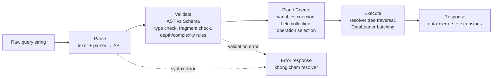
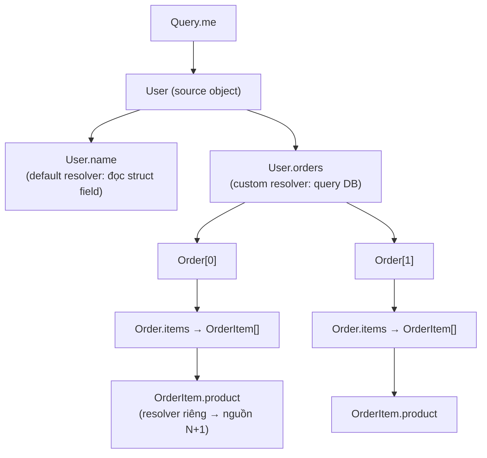
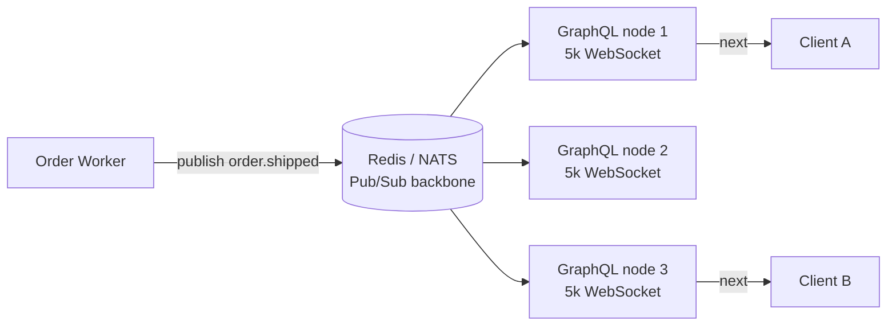
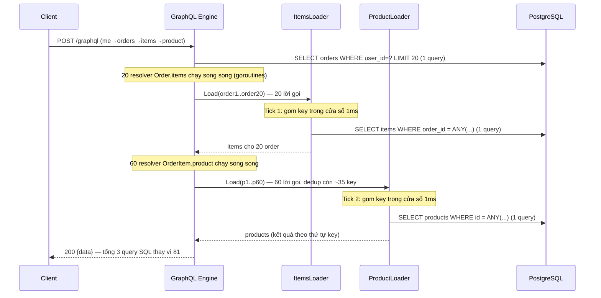
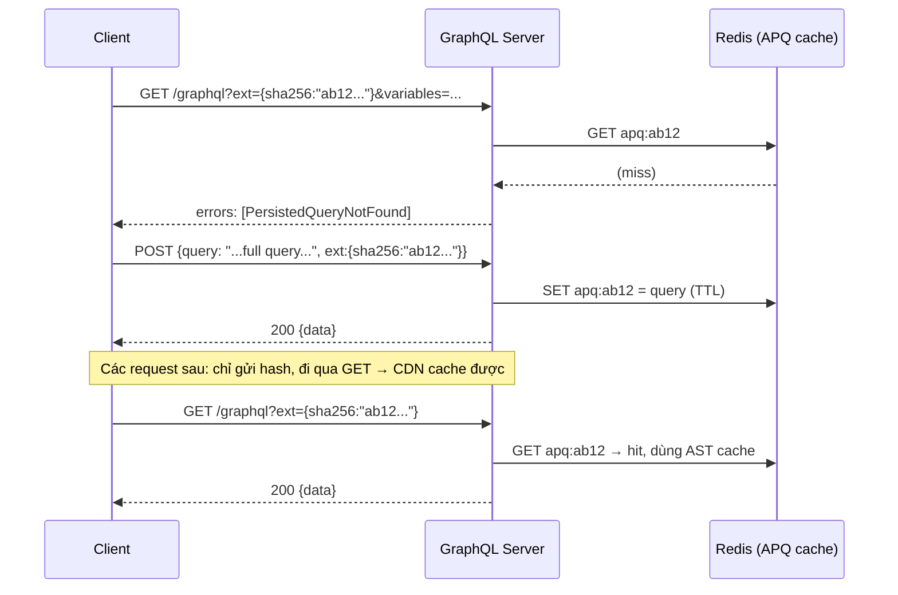
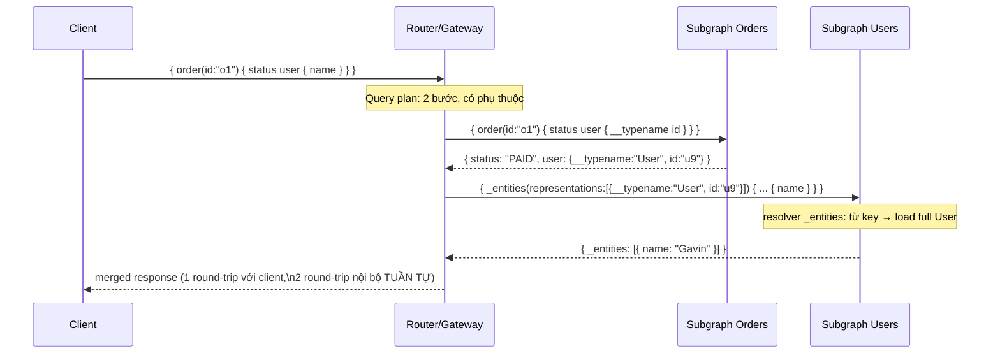

+++
title = "Chương 4: GraphQL — Query Language cho API"
date = "2026-02-22T10:00:00+07:00"
draft = false
tags = ["backend", "communication", "api", "architecture"]
series = ["Backend Communication Architecture"]
+++

[← Chương trước](/series/backend-communication-architect/03-rest/) | Mục lục | [Chương sau →](/series/backend-communication-architect/05-grpc/)

---

## 1. Problem Statement

Hãy bắt đầu bằng một tình huống mà gần như mọi team backend phục vụ mobile app đều gặp phải.

Công ty bạn có một mobile app thương mại điện tử. App có màn hình Home, màn hình Profile, màn hình Order History, màn hình Order Detail. Backend đã có sẵn một bộ REST API được thiết kế "chuẩn resource-oriented":

```
GET /users/{id}
GET /users/{id}/orders
GET /orders/{id}
GET /orders/{id}/items
GET /products/{id}
```

Bây giờ nhìn vào từng màn hình:

- **Màn hình Profile** chỉ cần `name`, `avatarUrl` của user. Nhưng `GET /users/{id}` trả về 40 field, bao gồm cả address book, preferences, KYC status — những thứ màn hình này không dùng. Đây là **over-fetching**: client trả tiền bandwidth và latency cho dữ liệu nó vứt đi.
- **Màn hình Order History** cần danh sách order, mỗi order cần thêm tên và ảnh của 3 sản phẩm đầu tiên để render thumbnail. `GET /users/{id}/orders` chỉ trả về `productId`. Client phải gọi tiếp `GET /products/{id}` cho từng sản phẩm. Đây là **under-fetching** dẫn đến **N+1 round-trip từ phía client** — trên mạng 4G với RTT 100–300ms, mỗi round-trip thừa là UX chết.
- **Màn hình Home** cần một tổ hợp: thông tin user rút gọn + 5 order gần nhất + banner khuyến mãi + gợi ý sản phẩm. Bốn resource, bốn endpoint, bốn round-trip tuần tự hoặc song song nhưng vẫn tốn connection và battery.

Team mobile yêu cầu backend viết endpoint riêng: `GET /screens/home`, `GET /screens/order-history`. Backend viết. Ba tháng sau, team iOS đổi thiết kế màn hình Home, cần thêm field. Team Android chưa đổi. Backend giờ phải version hóa endpoint theo màn hình, theo platform, theo app version. Bạn có `GET /v3/screens/home?platform=ios`. Đây không còn là API nữa — đây là **view rendering đẩy xuống tầng backend**, và mỗi thay đổi UI đều cần một lần deploy backend.

Vấn đề kỹ thuật cốt lõi: **REST cố định shape của response tại server, trong khi nhu cầu về shape dữ liệu nằm ở client và thay đổi theo tốc độ của UI.** Mọi giải pháp vá (endpoint per screen, tham số `?fields=`, `?expand=`) đều là những ngôn ngữ query tự chế, không có type system, không có tooling, không có chuẩn.

GraphQL giải quyết đúng một việc: **dịch chuyển quyền quyết định shape dữ liệu từ server về client, dưới một contract có kiểu (typed contract) mà server kiểm soát được.** Client hỏi đúng cái nó cần, trong một round-trip. Server khai báo *những gì có thể hỏi* (schema), không khai báo *response trông như thế nào*.

Chương này đi sâu vào cách GraphQL thực hiện điều đó — và cái giá phải trả, vì quyền lực đẩy về client đồng nghĩa với rủi ro đẩy về server.

---

## 2. Tại sao GraphQL tồn tại

### 2.1. Business Problem

- **Tốc độ phát triển UI bị chặn bởi backend**: mỗi màn hình mới, mỗi thay đổi layout cần backend sửa hoặc thêm endpoint. Lead time của một feature UI = lead time UI + lead time backend + thời gian phối hợp.
- **Đa client, đa shape**: iOS, Android, Web, Smart TV, partner API — cùng dữ liệu, khác shape. Duy trì BFF (Backend-for-Frontend) riêng cho từng client là một lựa chọn hợp lệ, nhưng chi phí nhân sự tuyến tính theo số client.
- **Chi phí mạng trên mobile**: over-fetching lãng phí bandwidth (người dùng ở thị trường trả tiền theo data quan tâm điều này), nhiều round-trip lãng phí thời gian và pin.

### 2.2. Technical Problem

- REST không có ngôn ngữ để client mô tả **projection** (chọn field) và **traversal** (đi theo quan hệ) trong một request.
- Không có **machine-readable contract** thống nhất giữa client và server ở mức field (OpenAPI mô tả endpoint, nhưng không cho client chọn shape).
- Việc "join" các resource diễn ra ở client, qua public network — nơi có latency cao nhất trong toàn hệ thống.

### 2.3. Scale Problem

Facebook tạo ra GraphQL (2012, public 2015) khi họ đối mặt: hàng trăm kiểu client, news feed có shape dữ liệu cực kỳ đa dạng, và app native không thể ép người dùng update để đổi API. GraphQL cho phép **một API surface duy nhất phục vụ vô hạn shape**, với **schema evolution không cần versioning** (thêm field không phá client cũ; field cũ được đánh dấu `@deprecated` và theo dõi usage trước khi xóa).

Điểm cần thẳng thắn ngay từ đầu: GraphQL **không** làm backend nhanh hơn, **không** giảm số query xuống database, **không** miễn phí. Nó chuyển vấn đề *"nhiều round-trip qua WAN"* thành vấn đề *"một query phức tạp mà server phải thực thi an toàn"*. Toàn bộ phần còn lại của chương là về việc trả cái giá đó một cách có kiểm soát.

---

## 3. Internal Architecture

### 3.1. Schema và Type System — contract là trung tâm

Trong GraphQL, schema (viết bằng SDL — Schema Definition Language) là **single source of truth**: nó vừa là contract giữa client và server, vừa là input để generate code (client types, server resolver interfaces), vừa là dữ liệu cho tooling (autocomplete, linting, breaking-change detection trong CI).

```graphql
# schema.graphqls
type User {
  id: ID!
  name: String!
  email: String!
  avatarUrl: String        # nullable: có thể chưa upload avatar
  orders(first: Int = 10, after: String): OrderConnection!
}

type Order {
  id: ID!
  status: OrderStatus!
  totalAmount: Money!
  createdAt: Time!
  items: [OrderItem!]!     # list non-null chứa phần tử non-null
  user: User!
}

type OrderItem {
  id: ID!
  product: Product!
  quantity: Int!
  unitPrice: Money!
}

type Product {
  id: ID!
  name: String!
  imageUrl: String
}

enum OrderStatus {
  PENDING
  PAID
  SHIPPED
  DELIVERED
  CANCELLED
}

type Query {
  me: User
  order(id: ID!): Order
}
```

Ba quyết định thiết kế trong schema trên đáng phân tích:

**Nullability là semantics, không phải trang trí.** `String!` nghĩa là server *cam kết* field này không bao giờ null. Cam kết này có hệ quả runtime: nếu resolver của một field non-null trả về null (hoặc lỗi), GraphQL engine sẽ **null propagation** — null "lan ngược" lên parent gần nhất có kiểu nullable. Nếu `Order.user` là `User!` và resolver user lỗi, toàn bộ object `order` đó bị null hóa; nếu `Query.order` cũng non-null thì toàn bộ `data` thành null. Nguyên tắc thực dụng: **non-null cho field mà thiếu nó object vô nghĩa (id, status); nullable cho field đến từ service khác** — vì service khác có thể chết, và bạn muốn trả partial data thay vì hủy cả response. Đây là quyết định về **failure isolation**, được mã hóa ngay trong type system.

**`[OrderItem!]!` có 4 biến thể** (`[T]`, `[T]!`, `[T!]`, `[T!]!`) và chúng khác nhau thật: `[T!]!` nói "luôn có list, không phần tử nào null" — client không cần code phòng thủ. `[T!]` nói "có thể chưa load được list". Chọn sai làm client viết null-check vô nghĩa ở hàng trăm chỗ.

**Pagination dùng Connection pattern** (`OrderConnection` với `edges/cursor/pageInfo` theo Relay spec) thay vì `[Order!]!` trần. Với API public hoặc dữ liệu tăng trưởng, đây gần như bắt buộc — đổi từ list trần sang connection sau này là breaking change:

```graphql
type OrderConnection {
  edges: [OrderEdge!]!
  pageInfo: PageInfo!
  totalCount: Int          # nullable có chủ đích: COUNT(*) đắt,
                           # server có quyền trả null khi bảng quá lớn
}

type OrderEdge {
  node: Order!
  cursor: String!          # opaque cursor — client KHÔNG được parse.
                           # Bên trong thường là base64(created_at + id),
                           # nhưng đó là chi tiết cài đặt server giữ quyền đổi.
}

type PageInfo {
  hasNextPage: Boolean!
  endCursor: String
}
```

Ngoài object type, type system còn ba công cụ mô hình hóa quan trọng:

- **Interface** cho đa hình có field chung: `interface Node { id: ID! }` — nền tảng của global object identification (Relay `node(id:)` query), cho phép client re-fetch bất kỳ entity nào bằng một query duy nhất.
- **Union** cho kết quả không có field chung: `union SearchResult = User | Order | Product`. Client dùng inline fragment (`... on User { name }`) và bắt buộc xử lý từng nhánh — type system thay thế cho tài liệu.
- **Directive** cho metadata khai báo: `@deprecated(reason:)`, `@cacheControl`, custom directive `@auth(role:)`. Directive là cơ chế mở rộng schema mà không đổi ngôn ngữ.

**Schema evolution không cần versioning** — quy trình thực tế để xóa một field mà không có `/v2`:

1. Thêm field mới song song (additive change — không bao giờ phá client).
2. Đánh dấu field cũ `@deprecated(reason: "Use totalAmountV2, xem RFC-142")` — tooling client hiện warning ngay trong IDE.
3. Theo dõi **field-level usage** từ telemetry (mỗi request log các field được query — đây là dữ liệu REST không bao giờ có: bạn *biết chính xác* client nào còn dùng field nào, ở app version nào).
4. Khi usage về 0 (hoặc chỉ còn app version đã ép update), xóa field. Có bằng chứng, không đoán.

Schema còn là công cụ tổ chức team: mọi thay đổi API đi qua schema review (một dạng design review ép buộc), và CI chạy schema diff để phát hiện breaking change (xóa field, đổi type, thêm required argument, thu hẹp nullability theo chiều nguy hiểm) trước khi merge. Tool phổ biến: `graphql-inspector`, Apollo/Cosmo schema checks.

### 3.2. Query lifecycle: Parse → Validate → Plan → Execute

Một GraphQL request đi qua bốn pha, và hiểu từng pha quan trọng vì **mỗi pha là một điểm chặn bảo mật/hiệu năng khác nhau**:



- **Parse**: query string → AST. Chi phí CPU tỉ lệ với độ dài query. Đây là lý do persisted query (3.8) có lợi cả về CPU: server cache AST theo hash, bỏ qua parse.
- **Validate**: AST được đối chiếu với schema — field có tồn tại không, argument đúng kiểu không, fragment hợp lệ không. **Depth limit và complexity limit chạy ở pha này** — tức là query độc hại bị chặn *trước khi bất kỳ resolver nào chạy*, trước khi chạm database. Nếu bạn chặn ở resolver là đã quá muộn.
- **Plan/Coerce**: chọn operation (một document có thể chứa nhiều operation), coerce variables theo type, gom field (field collection — merge các field trùng do fragment).
- **Execute**: đi cây resolver (3.3).

Response luôn có shape `{ "data": ..., "errors": [...], "extensions": {...} }` — và luôn là **HTTP 200** khi execution xảy ra (kể cả khi có field lỗi). Điều này khác triệt để với REST, bàn kỹ ở 3.11.

### 3.3. Resolver và Execution Engine

Execution engine của GraphQL về bản chất là **duyệt cây**: mỗi field trong query tương ứng một resolver function. Resolver của field cha trả về "source object", engine truyền nó xuống làm input cho resolver của field con.



Những tính chất quan trọng của engine:

**Mỗi resolver độc lập và không biết gì về nhau.** `OrderItem.product` không biết nó đang được gọi lần thứ 50 trong cùng một query. Đây là nguồn gốc của N+1 (3.7) — không phải bug, mà là hệ quả trực tiếp của mô hình composition: tính đúng đắn cục bộ (mỗi resolver tự lo dữ liệu của nó) đổi lấy hiệu năng toàn cục.

**Sibling fields trong query được phép thực thi song song.** Spec quy định execution của query là "normal execution" — các field cùng cấp không có thứ tự phụ thuộc, engine (gqlgen dùng goroutine + `sync.WaitGroup`) chạy chúng concurrent. Hệ quả cho bạn: **resolver phải thread-safe**, và context là nơi duy nhất an toàn để chia sẻ state per-request.

**Mutation thực thi tuần tự (serial), từ trên xuống.** Vì sao spec bắt buộc điều này? Vì mutation có side effect, và client cần một mô hình suy luận được:

```graphql
mutation {
  addToCart(productId: "p1") { cart { total } }
  checkout { orderId }        # phải thấy p1 trong cart
}
```

Nếu hai mutation này chạy song song, `checkout` có thể chạy trước `addToCart` — kết quả không xác định. Serial execution biến một mutation document thành một "script" có thứ tự. (Lưu ý: chỉ các field *top-level* của mutation là serial; các field con bên trong payload vẫn resolve song song bình thường.)

**Context propagation.** Trong gqlgen, mỗi resolver nhận `context.Context`. Đây là backbone của request: auth principal, trace span, DataLoader, deadline — tất cả đi qua context. Một request GraphQL = một context tree, và cancellation của HTTP request tự động hủy mọi resolver đang chạy (nếu resolver của bạn tôn trọng `ctx.Done()` — nhiều team quên, và resolver mồ côi tiếp tục cào database sau khi client đã bỏ đi).

Trong Go, gqlgen chọn cách tiếp cận **schema-first + code generation**: bạn viết SDL, `gqlgen generate` sinh ra interface resolver có kiểu chặt và toàn bộ plumbing execution (field collection, concurrency, JSON marshal). Đối thủ chính là graphql-go (runtime reflection, ít type-safe hơn nhưng không cần bước generate). Với hệ thống lớn, codegen thắng: đổi schema mà quên sửa resolver là lỗi *compile-time*, không phải lỗi runtime lúc 2 giờ sáng.

```yaml
# gqlgen.yml — các quyết định cấu hình đáng chú ý
schema:
  - graph/*.graphqls          # schema tách nhiều file theo domain
exec:
  package: generated
model:
  filename: graph/model/models_gen.go
resolver:
  layout: follow-schema        # mỗi file schema một file resolver — scale theo team
autobind:
  - "example.com/shop/internal/domain"  # bind type domain có sẵn, không sinh model trùng
models:
  ID:
    model: github.com/99designs/gqlgen/graphql.ID
  Time:
    model: github.com/99designs/gqlgen/graphql.Time
  Money:
    model: example.com/shop/internal/scalar.Money  # custom scalar: kiểm soát
                                                   # marshal/unmarshal tiền tệ
```

Điểm thiết kế trong `autobind`: gqlgen cho phép resolver trả thẳng domain struct (`domain.Order`) thay vì model sinh tự động — field trùng tên được engine đọc trực tiếp (default resolver, zero-cost), field khác biệt mới cần resolver riêng. Điều này giữ ranh giới rõ: domain model là của domain, GraphQL model chỉ tồn tại khi shape thật sự khác.

Code gqlgen tối thiểu cho schema trên:

```go
// resolver.go
type Resolver struct {
    OrderRepo   repo.OrderRepo
    UserRepo    repo.UserRepo
    ProductRepo repo.ProductRepo
}

// Query.me — root resolver: lấy user từ auth context, KHÔNG từ argument.
// Quyết định thiết kế: identity đến từ token, không bao giờ tin client.
func (r *queryResolver) Me(ctx context.Context) (*model.User, error) {
    uid, ok := auth.UserID(ctx)
    if !ok {
        return nil, nil // chưa đăng nhập → me: null (schema cho phép nullable)
    }
    return r.UserRepo.ByID(ctx, uid)
}

// User.orders — field resolver: chỉ chạy khi client hỏi field này.
// Đây chính là "lazy loading" tự nhiên của GraphQL: màn hình Profile
// không hỏi orders thì query DB orders không bao giờ chạy.
func (r *userResolver) Orders(ctx context.Context, u *model.User,
    first *int, after *string) (*model.OrderConnection, error) {
    limit := clamp(deref(first, 10), 1, 100) // server luôn clamp — không tin client
    return r.OrderRepo.ByUserCursor(ctx, u.ID, limit, after)
}
```

Chú ý quyết định `clamp(limit, 1, 100)`: client quyết định shape, nhưng **server quyết định giới hạn**. Mọi argument dạng số lượng phải bị chặn trên ở server — đây là quy tắc không có ngoại lệ.

### 3.4. Serialization, Transport, Connection Management

- **Serialization**: response là JSON (spec không bắt buộc nhưng thực tế là JSON tuyệt đối). Nghĩa là GraphQL **không** thắng gRPC/Protobuf về kích thước hay tốc độ encode — cái nó tiết kiệm là *dữ liệu thừa không được gửi*, không phải encoding hiệu quả hơn.
- **Transport**: query/mutation thường đi qua HTTP POST một endpoint duy nhất (`/graphql`), body chứa `{query, variables, operationName}`. GET được dùng cho persisted query để tận dụng HTTP cache/CDN. Việc "một endpoint, toàn POST" là lý do lớp cache HTTP truyền thống mù với GraphQL (3.9).
- **Connection management**: với query/mutation, giống REST — HTTP/1.1 keep-alive hoặc HTTP/2 multiplexing, stateless, load balancer L7 hoạt động bình thường. Subscription (3.6) là ngoại lệ: connection dài hạn, stateful, thay đổi hoàn toàn bài toán vận hành.

Toàn bộ cấu hình transport + phòng thủ tập trung tại một chỗ khi dựng server gqlgen — đây là "production baseline" mà chương này sẽ tham chiếu lại:

```go
// cmd/server/main.go — production baseline
func main() {
    cfg := generated.Config{Resolvers: buildResolvers()}
    registerComplexity(&cfg) // xem 3.10

    srv := handler.New(generated.NewExecutableSchema(cfg))

    // Transport: khai báo TƯỜNG MINH những gì chấp nhận — không dùng
    // handler.NewDefaultServer vì nó bật sẵn nhiều thứ bạn chưa audit.
    srv.AddTransport(transport.POST{})                  // query + mutation
    srv.AddTransport(transport.GET{})                   // persisted query qua CDN
    srv.AddTransport(transport.Websocket{               // subscription, xem 3.6
        KeepAlivePingInterval: 10 * time.Second,
        InitFunc:              wsAuth, // auth qua connection_init payload
        Upgrader: websocket.Upgrader{
            CheckOrigin: checkAllowedOrigins, // WebSocket KHÔNG có CORS —
        },                                    // tự kiểm soát origin hoặc bị CSWSH
    })
    // Chú ý: KHÔNG add transport.MultipartForm nếu không nhận upload.

    srv.SetQueryCache(lru.New[*ast.QueryDocument](1000)) // cache AST theo query hash
    srv.Use(extension.AutomaticPersistedQuery{           // APQ, xem 3.8
        Cache: apqRedisCache{rdb},                        // cache chia sẻ giữa các node
    })
    srv.Use(extension.FixedComplexityLimit(1000))        // xem 3.10
    srv.SetErrorPresenter(errorPresenter)                 // xem 3.11
    srv.SetRecoverFunc(func(ctx context.Context, p any) error {
        log.Ctx(ctx).Error().Any("panic", p).Msg("resolver panic")
        return gqlerror.Errorf("internal error") // panic 1 resolver không giết process
    })

    mux := http.NewServeMux()
    mux.Handle("/graphql",
        authMiddleware(            // xác thực TRƯỚC khi chạm engine
            loaders.Middleware(repos)( // DataLoader per-request, xem 3.7
                timeoutMiddleware(srv))))

    server := &http.Server{Addr: ":8080", Handler: mux,
        ReadHeaderTimeout: 5 * time.Second}
    log.Fatal(server.ListenAndServe())
}
```

Thứ tự middleware ở đây có chủ đích: auth ngoài cùng (fail sớm nhất, rẻ nhất), rồi DataLoader (cần identity trong context để loader tôn trọng quyền), rồi timeout, cuối cùng mới đến engine. Đảo thứ tự auth và loader là mở đường cho lỗi authorization ở batch function.

### 3.5. Mutation — design convention

Spec GraphQL không quy định cách thiết kế mutation; convention cộng đồng (chịu ảnh hưởng Relay) đã hội tụ về pattern sau, và nó đáng theo vì lý do kỹ thuật cụ thể:

```graphql
input PlaceOrderInput {
  cartId: ID!
  paymentMethodId: ID!
  couponCode: String
  idempotencyKey: String!   # bàn ở phần Production
}

type PlaceOrderPayload {
  order: Order                    # null nếu thất bại
  userErrors: [UserError!]!       # lỗi nghiệp vụ là DATA, không phải error
}

type UserError {
  field: [String!]                # ["couponCode"] → UI highlight đúng ô input
  code: UserErrorCode!            # enum: máy đọc được, không parse string
  message: String!                # người đọc được
}

type Mutation {
  placeOrder(input: PlaceOrderInput!): PlaceOrderPayload!
}
```

Ba quyết định và lý do:

1. **Một `input` type duy nhất** thay vì 5 argument rời: thêm field optional sau này không phá client, client code-gen ra một struct sạch, và document dễ đọc.
2. **Payload type riêng** thay vì trả thẳng `Order`: cho phép mutation trả thêm metadata (userErrors, các object khác bị ảnh hưởng) mà không phá schema về sau.
3. **`userErrors` — errors as data**: lỗi nghiệp vụ dự đoán được ("coupon hết hạn", "hết hàng") thuộc về *domain*, được model trong schema với type đầy đủ, để client render UI. Mảng `errors` top-level của GraphQL dành cho lỗi *hệ thống* (unauthorized, internal error, timeout). Trộn hai loại này là anti-pattern phổ biến nhất trong thiết kế mutation: client phải parse `errors[].message` bằng string matching để biết "hết hàng" — mong manh và không có type.

Một biến thể mạnh hơn của errors-as-data là dùng union: `union PlaceOrderResult = PlaceOrderSuccess | InsufficientStock | CouponExpired` — type system ép client xử lý từng case. Chi phí là schema phình to; hãy dùng cho các mutation quan trọng có nhiều failure mode nghiệp vụ.

### 3.6. Subscription — realtime trên GraphQL

Subscription cho client đăng ký nhận event theo đúng shape nó muốn:

```graphql
type Subscription {
  orderStatusChanged(orderId: ID!): Order!
}
```

**Transport**: hai lựa chọn thực tế:
- **WebSocket với protocol `graphql-ws`** (thay thế protocol cũ `subscriptions-transport-ws` đã ngừng maintain): full-duplex, một connection multiplex nhiều subscription qua message `subscribe/next/complete`. Cần xử lý riêng authentication (message `connection_init` mang token — WebSocket không gửi lại header sau handshake) và keep-alive (ping/pong).
- **SSE (Server-Sent Events)**: đơn giản hơn, đi qua HTTP thuần nên thân thiện proxy/LB hơn, một chiều server→client (đủ cho subscription), nhưng mỗi subscription một connection (trừ khi dùng protocol ghép như `graphql-sse` distinct connections mode).

Phần auth cho WebSocket trong gqlgen (được gắn vào `transport.Websocket{InitFunc: wsAuth}` trong baseline ở 3.4):

```go
// wsAuth chạy MỘT LẦN khi client gửi connection_init.
// Token nằm trong payload vì browser WebSocket API không cho set header tùy ý.
func wsAuth(ctx context.Context, p transport.InitPayload) (context.Context, *transport.InitPayload, error) {
    token := p.Authorization() // đọc payload["Authorization"]
    claims, err := verifyJWT(token)
    if err != nil {
        return nil, nil, fmt.Errorf("unauthorized") // đóng connection: code 4403
    }
    // Cạm bẫy: JWT hết hạn sau 15 phút, WebSocket sống hàng giờ.
    // Phải chọn: (a) đóng connection khi token hết hạn (client re-connect
    // với token mới), hoặc (b) re-check quyền tại thời điểm PHÁT event.
    // Làm (a) tối thiểu; hệ thống nhạy cảm làm cả hai.
    ctx = auth.WithClaims(ctx, claims)
    go closeAtExpiry(ctx, claims.ExpiresAt)
    return ctx, nil, nil
}
```

**Kiến trúc scale — vấn đề thật sự.** Subscription resolver trong gqlgen trả về channel:

```go
func (r *subscriptionResolver) OrderStatusChanged(ctx context.Context,
    orderID string) (<-chan *model.Order, error) {

    if err := authz.CanViewOrder(ctx, orderID); err != nil {
        return nil, err // authorize MỘT LẦN lúc subscribe — và phải nhớ:
                        // quyền có thể bị thu hồi trong khi sub còn sống
    }

    ch := make(chan *model.Order, 8) // buffer nhỏ: slow consumer bị drop,
                                     // không được phép block publisher
    // Đăng ký vào Pub/Sub backbone (Redis) — KHÔNG phải in-memory bus
    unsub := r.PubSub.Subscribe("order:"+orderID, func(o *model.Order) {
        select {
        case ch <- o:
        default: // client chậm: drop event, client tự re-fetch khi reconnect
        }
    })
    go func() {
        <-ctx.Done() // client ngắt kết nối → dọn dẹp
        unsub()
        close(ch)
    }()
    return ch, nil
}
```

Vấn đề: bạn có 3 node GraphQL sau load balancer. Client A giữ WebSocket với node 1. Sự kiện "order shipped" phát sinh từ một worker được route... vào node 3 (hoặc từ một service khác hoàn toàn). Node 3 không có channel nào của client A. **In-memory event bus chỉ chạy được với đúng 1 node.**

Giải pháp chuẩn: **Pub/Sub backbone** — mọi node publish event vào Redis Pub/Sub / NATS / Kafka; mọi node subscribe topic liên quan và fan-out vào các channel WebSocket cục bộ của mình:



Chi phí vận hành thật của subscription — cần tính trước khi commit:
- **Connection là state**: deploy = drain hàng chục nghìn WebSocket; client phải có logic reconnect + re-subscribe + fetch-on-reconnect (bù event bị mất trong lúc ngắt).
- **Load balancer**: cần idle timeout dài (hoặc ping đều đặn), sticky không bắt buộc nhưng connection distribution lệch khi scale-in/out.
- **Delivery semantics**: Redis Pub/Sub là at-most-once, mất event khi node restart. Nếu nghiệp vụ cần "không được lỡ event", subscription chỉ nên là *tín hiệu* ("có thay đổi, hãy re-fetch"), còn source of truth là query.
- Nếu nhu cầu chỉ là "notification thưa thớt", cân nhắc polling định kỳ hoặc SSE đơn giản trước khi dựng cả hạ tầng WebSocket + backbone.

### 3.7. N+1 và DataLoader — vấn đề trung tâm về hiệu năng

**Cơ chế phát sinh.** Nhìn lại cây resolver ở 3.3. Query:

```graphql
{ me { orders(first: 20) { edges { node { items { product { name imageUrl } } } } } } }
```

- `User.orders` → 1 query SQL lấy 20 order.
- `Order.items` chạy cho *từng* order → 20 query.
- `OrderItem.product` chạy cho *từng* item (giả sử 3 item/order) → 60 query.

Tổng: **81 query SQL cho một GraphQL request**, phần lớn là `SELECT ... WHERE id = ?` lặp lại. Đây không phải lỗi lập trình — resolver `OrderItem.product` được viết đúng, chỉ là nó không biết 59 "bản sao" của nó đang chạy cùng lúc. N+1 trong GraphQL nguy hiểm hơn trong ORM truyền thống vì **client quyết định độ sâu traversal** — bạn không kiểm soát được query nào sẽ đến.

**DataLoader** giải quyết bằng hai cơ chế, đều **scoped per-request**:

1. **Batching**: thay vì load ngay, resolver gọi `loader.Load(ctx, id)` — trả về promise. Loader gom các key được yêu cầu trong một "cửa sổ" ngắn (một tick — vài trăm microsecond, hoặc đến khi đủ batch size), rồi gọi **một** batch function `fetch([]id) → []item` (một câu `WHERE id IN (...)`).
2. **Caching per-request**: cùng key hỏi hai lần trong một request → một lần fetch. Cache sống theo request, chết theo request — không có bài toán invalidation.

Trong Go không có event loop như Node.js, nên "tick" được cài đặt bằng timer: thư viện `dataloadgen` (kế thừa `dataloaden` của tác giả gqlgen, API generics) gom key trong một `wait window` (ví dụ 1–2ms) hoặc đến `maxBatch`. Đây là trade-off tường minh: **cộng tối đa ~2ms latency vào mỗi tầng để đổi lấy việc giảm hàng chục lần số query DB** — gần như luôn luôn hời, vì một round-trip DB đã tốn hơn 1ms.

```go
// loaders/loaders.go
package loaders

import (
    "context"
    "time"

    "github.com/vikstrous/dataloadgen"
)

type ctxKey struct{}

type Loaders struct {
    ProductByID *dataloadgen.Loader[string, *model.Product]
    ItemsByOrderID *dataloadgen.Loader[string, []*model.OrderItem]
}

// Middleware: tạo Loaders MỚI cho MỖI request.
// Quyết định thiết kế quan trọng nhất: loader per-request, không bao giờ global.
// Loader global = cache không bao giờ invalidate + rò dữ liệu giữa các user
// (user A load product theo quyền của A, user B nhận từ cache — authorization bypass).
func Middleware(repo repo.Repos) func(http.Handler) http.Handler {
    return func(next http.Handler) http.Handler {
        return http.HandlerFunc(func(w http.ResponseWriter, r *http.Request) {
            l := &Loaders{
                ProductByID: dataloadgen.NewLoader(
                    fetchProducts(repo.Product),
                    dataloadgen.WithWait(1*time.Millisecond), // cửa sổ gom batch
                    dataloadgen.WithBatchCapacity(200),       // khớp giới hạn IN() của DB
                ),
                ItemsByOrderID: dataloadgen.NewLoader(
                    fetchItemsByOrder(repo.Order),
                    dataloadgen.WithWait(1*time.Millisecond),
                    dataloadgen.WithBatchCapacity(100),
                ),
            }
            ctx := context.WithValue(r.Context(), ctxKey{}, l)
            next.ServeHTTP(w, r.WithContext(ctx))
        })
    }
}

func For(ctx context.Context) *Loaders {
    return ctx.Value(ctxKey{}).(*Loaders)
}

// Batch function: nhận N key, trả N kết quả THEO ĐÚNG THỨ TỰ key.
// Contract này là nơi bug hay nằm: DB trả kết quả không theo thứ tự,
// và key vắng mặt phải map thành nil/error đúng vị trí.
func fetchProducts(pr repo.ProductRepo) func(context.Context, []string) ([]*model.Product, []error) {
    return func(ctx context.Context, ids []string) ([]*model.Product, []error) {
        rows, err := pr.ByIDs(ctx, ids) // SELECT * FROM products WHERE id = ANY($1)
        if err != nil {
            errs := make([]error, len(ids))
            for i := range errs { errs[i] = err }
            return make([]*model.Product, len(ids)), errs
        }
        byID := make(map[string]*model.Product, len(rows))
        for _, p := range rows { byID[p.ID] = p }
        out := make([]*model.Product, len(ids))
        errs := make([]error, len(ids))
        for i, id := range ids {
            if p, ok := byID[id]; ok {
                out[i] = p
            } else {
                errs[i] = fmt.Errorf("product %s not found", id)
            }
        }
        return out, errs
    }
}
```

Resolver dùng loader:

```go
func (r *orderItemResolver) Product(ctx context.Context, it *model.OrderItem) (*model.Product, error) {
    // Load() block cho đến khi batch được flush và kết quả sẵn sàng.
    // 60 resolver gọi song song → dataloadgen gom thành 1 câu SQL.
    return loaders.For(ctx).ProductByID.Load(ctx, it.ProductID)
}
```

Sequence diagram — query execution với DataLoader batching qua 2 tick (2 tầng batch):



**Giới hạn của DataLoader** cần biết: nó batch theo *key đơn* — các resolver có argument phức tạp (filter, sort khác nhau) không batch chung được; và nó không thay thế được việc thiết kế query DB tốt (đôi khi một JOIN ở tầng `orders` giết cả hai tầng N+1 rẻ hơn — nhưng khi đó bạn quay lại việc đoán trước shape, mất tính composition. Chọn theo hot path thực tế).

### 3.8. Persisted Query và APQ

Vấn đề: (a) client gửi cả query string mỗi request — query production có thể vài KB, lãng phí bandwidth đúng cái GraphQL định tiết kiệm; (b) endpoint nhận *ngôn ngữ truy vấn tùy ý* từ Internet — bề mặt tấn công quá rộng.

**APQ (Automatic Persisted Queries)**: client gửi `sha256(query)` thay cho query. Server tra cache (Redis): trúng → chạy; trượt → trả `PersistedQueryNotFound`, client gửi lại kèm full query, server cache lại. Tiết kiệm bandwidth và CPU parse, **nhưng không phải cơ chế bảo mật** — attacker vẫn gửi được full query bất kỳ.



Lưu ý vận hành: APQ cache phải là **Redis chia sẻ** giữa các node (như baseline 3.4) — cache in-memory per-node gây bão `PersistedQueryNotFound` mỗi lần deploy hoặc scale-out, nhân đôi round-trip đúng lúc hệ thống đang nhạy cảm nhất.

**Persisted query allowlist (trusted documents)** — khuyến nghị mạnh cho API nội bộ first-party ở production: tại build time, tooling extract mọi query trong codebase client, đăng ký vào registry với ID. Runtime, server **chỉ chấp nhận ID trong registry**, từ chối mọi query string tự do. Hệ quả:
- Bề mặt tấn công từ "ngôn ngữ truy vấn Turing-vô-hạn-tổ-hợp" co về "tập hữu hạn query đã review" — depth/complexity limit trở thành phòng tuyến thứ hai thay vì thứ nhất.
- Query đi qua GET với ID → CDN cache được.
- Chi phí: cần pipeline build đăng ký query, môi trường dev phải bypass, và **không dùng được cho public API** nơi third-party viết query tùy ý (khi đó bạn bắt buộc quay về cost analysis, 3.10).

### 3.9. Caching — điểm yếu cấu trúc của GraphQL

Vì sao REST cache dễ: `GET /products/123` — URL là cache key, HTTP method nói rõ safe/unsafe, `Cache-Control`/ETag/CDN hoạt động miễn phí. GraphQL phá cả ba giả định: một endpoint, POST, và không gian query gần như vô hạn (hai query khác nhau một field là hai cache entry khác nhau). **Lớp cache HTTP hiện có của Internet mù với GraphQL.** Các lớp bù đắp:

1. **Client-side normalized cache** (Apollo Client, Relay, urql): response được "chuẩn hóa" thành bảng object theo `__typename + id`, các query khác nhau chia sẻ cùng bản ghi — mutation trả về `Order` cập nhật *mọi* màn hình đang hiển thị order đó. Đây là tính năng ăn tiền nhất của hệ sinh thái client GraphQL, và là lý do schema nên có `id: ID!` trên mọi entity. Chi phí: độ phức tạp client tăng đáng kể (cache invalidation, optimistic update, partial data).
2. **Server-side response cache**: cache toàn bộ response theo key = hash(query + variables + user/role). Hiệu quả cho dữ liệu public ít biến động; gần vô dụng cho dữ liệu cá nhân hóa (key chứa userID → hit rate thấp).
3. **Cache theo field với `@cacheControl`**: schema khai báo `type Product @cacheControl(maxAge: 300)`, engine tính `maxAge` của response = **min của mọi field** trong query (field nhạy cảm nhất quyết định) và scope `PUBLIC/PRIVATE`. Kết hợp persisted query qua GET → CDN cache được thật.
4. **Cache ở tầng data** (Redis trước DB, per-entity): không liên quan GraphQL, nhưng thực tế là nơi phần lớn hiệu quả cache nằm — và DataLoader per-request đã là tầng cache đầu tiên.

Kết luận thẳng: nếu workload của bạn là **read-heavy, public, cacheable ở CDN** (trang tin tức, catalog), REST/HTTP cache là lợi thế cấu trúc mà GraphQL phải trả nhiều công sức mới đuổi kịp. Cân nhắc điều này *trước* khi chọn, không phải sau.

### 3.10. Security — client cầm quyền query nghĩa là server phải phòng thủ theo tầng

GraphQL đảo ngược mô hình đe dọa của REST: với REST, chi phí mỗi endpoint do server code quyết định, còn với GraphQL **client soạn được query có chi phí tùy ý**. Các tầng phòng thủ:

**Depth limit.** Query lồng vòng (`user → orders → user → orders → ...` qua quan hệ hai chiều) tăng chi phí theo cấp số nhân. Chặn ở pha validation:

```go
srv := handler.New(generated.NewExecutableSchema(cfg))
srv.Use(extension.FixedComplexityLimit(300)) // xem bên dưới
// depth limit trong gqlgen thường cài qua validation rule / complexity;
// nguyên tắc: schema first-party hiếm khi cần depth > 8
```

**Complexity/cost limit** — quan trọng hơn depth, vì query nông vẫn có thể đắt (`orders(first: 10000)`). Mỗi field được gán cost, list nhân theo argument số lượng:

```go
// gqlgen: complexity function per-field, khai báo trong Config
cfg := generated.Config{Resolvers: resolvers}

// Cost của User.orders = childComplexity * số phần tử xin
cfg.Complexity.User.Orders = func(childComplexity int, first *int, after *string) int {
    n := deref(first, 10)
    return childComplexity * n
}
cfg.Complexity.Order.Items = func(childComplexity int) int {
    return childComplexity * 5 // ước lượng trung bình item/order
}

srv := handler.New(generated.NewExecutableSchema(cfg))
srv.Use(extension.FixedComplexityLimit(1000))
// Query vượt 1000 điểm bị từ chối Ở PHA VALIDATION — trước mọi resolver,
// trước mọi query DB. Đây là điểm khác biệt sống còn so với timeout.
```

Chọn ngưỡng thế nào? Đo cost của các query hợp lệ đắt nhất hiện có, nhân 2–3 làm ngưỡng, log các query bị từ chối, hạ dần. Cost model không cần chính xác tuyệt đối — nó cần *chặn được sự bất đối xứng* giữa vài KB query text và hàng triệu row DB.

**Rate limiting theo cost, không theo request.** 100 request/phút vô nghĩa khi một request có thể đắt gấp 10.000 request khác. Đúng: mỗi client có ngân sách *điểm cost* mỗi phút (cách GitHub GraphQL API làm — 5.000 điểm/giờ, mỗi query trả về cost của nó trong response để client tự điều tiết). Trong gqlgen, cost đã được tính ở pha validation — chỉ cần chặn thêm một tầng trừ ngân sách:

```go
// Extension: trừ ngân sách cost TRƯỚC execution, trả cost về client.
type CostRateLimit struct{ Buckets *redisrate.Limiter }

func (CostRateLimit) ExtensionName() string { return "CostRateLimit" }
func (CostRateLimit) Validate(graphql.ExecutableSchema) error { return nil }

func (c CostRateLimit) InterceptResponse(ctx context.Context,
    next graphql.ResponseHandler) *graphql.Response {

    stats := extension.GetComplexityStats(ctx) // cost đã tính ở validation
    clientID := auth.ClientID(ctx)
    res, err := c.Buckets.AllowN(ctx, "cost:"+clientID,
        redisrate.PerMinute(10000), stats.Complexity) // token bucket theo ĐIỂM
    if err == nil && res.Allowed == 0 {
        return graphql.ErrorResponse(ctx,
            "cost budget exceeded, retry after %v", res.RetryAfter)
    }
    resp := next(ctx)
    // Trả cost trong extensions để client tự điều tiết — API contract tốt
    resp.Extensions = map[string]any{"cost": stats.Complexity,
        "costBudgetRemaining": res.Remaining}
    return resp
}
```

**Batching attack.** Nhiều GraphQL server chấp nhận mảng query trong một HTTP request (`[{query...}, {query...}, ...]`) — attacker nhét 1.000 lần thử mật khẩu/alias vào một request, qua mặt rate limiter đếm request. Ngoài ra **alias abuse** trong một query: `q1: login(...) q2: login(...) ... q500: login(...)`. Phòng thủ: giới hạn số operation/batch, giới hạn alias trùng root field, và rate limit theo cost đã cover phần lớn.

**Introspection trong production**: tắt cho public API (đừng phát bản đồ schema cho attacker; lưu ý field suggestion trong error message cũng rò schema — tắt luôn), nhưng **giữ hoặc thay thế bằng schema registry cho internal API** — introspection là thứ nuôi sống toàn bộ tooling. Và hãy trung thực: tắt introspection là obscurity, không phải security — authorization từng field mới là phòng tuyến thật.

**Authorization ở tầng nào?** Không phải ở resolver root — vì GraphQL cho phép đi tới một object qua nhiều đường (`Query.order` và `User.orders` cùng dẫn tới `Order`). Nguyên tắc: **authorize tại tầng domain/data (theo entity), không theo entry point**; directive `@auth` trên schema chỉ là lớp khai báo phía trên.

### 3.11. Error handling — partial data thay vì status code

REST: một request → một status code → thành hay bại toàn phần. GraphQL: một query chạm 5 service; service recommendation chết không có nghĩa là user không xem được profile. Response chuẩn:

```json
{
  "data": {
    "me": {
      "name": "Gavin",
      "orders": { "edges": [ ... ] },
      "recommendations": null
    }
  },
  "errors": [
    {
      "message": "recommendation service unavailable",
      "path": ["me", "recommendations"],
      "extensions": { "code": "UNAVAILABLE", "traceId": "abc-123" }
    }
  ]
}
```

HTTP status là **200** — vì HTTP chỉ là transport; "thành công" ở đây là per-field, và status code không thể mô tả "80% thành công". Hệ quả vận hành mà nhiều team vấp:

- **Monitoring dựa trên HTTP 5xx trở nên mù**: dashboard xanh trong khi 50% field đang lỗi. Bắt buộc đo *GraphQL error rate* (số response có `errors`, phân theo `path` và `extensions.code`) — xem phần Production.
- **Client phải xử lý partial data** như một trạng thái hạng nhất: render phần có, degrade phần lỗi. Đây là feature (graceful degradation "miễn phí") nếu client làm đúng, là nguồn bug im lặng nếu client chỉ check `data != null`.
- **Nullability quyết định bán kính lỗi** (nhắc lại 3.1): `recommendations` nullable → lỗi bị cô lập; nếu non-null, lỗi lan ngược làm null cả `me`.
- Chuẩn hóa `extensions.code` (bộ code hữu hạn: `UNAUTHENTICATED`, `FORBIDDEN`, `NOT_FOUND`, `UNAVAILABLE`, `INTERNAL`) và **không bao giờ** rò message nội bộ (SQL, stack trace) — gqlgen: đặt `ErrorPresenter` để map/mask mọi error trước khi trả ra.

```go
srv.SetErrorPresenter(func(ctx context.Context, e error) *gqlerror.Error {
    err := graphql.DefaultErrorPresenter(ctx, e)
    var de *domain.Error
    if errors.As(e, &de) {
        err.Extensions = map[string]any{"code": de.Code}
        return err
    }
    // Lỗi không nhận diện được: log đầy đủ server-side, trả về generic
    log.Ctx(ctx).Error().Err(e).Msg("unhandled resolver error")
    err.Message = "internal error"
    err.Extensions = map[string]any{"code": "INTERNAL", "traceId": trace.ID(ctx)}
    return err
})
```

### 3.12. Federation — một graph, nhiều team

**Bài toán tổ chức, không phải bài toán kỹ thuật.** Công ty có 10 team, mỗi team sở hữu một domain (users, orders, products, payments). Bạn muốn client thấy **một graph thống nhất** (`order.user.name` đi xuyên domain), nhưng không muốn 10 team commit vào một monolith GraphQL — schema file 20.000 dòng, deploy chung, tranh chấp merge.

Federation (Apollo Federation spec — có nhiều implementation gồm Apollo Router, Cosmo Router, và gqlgen hỗ trợ subgraph) chia graph thành các **subgraph** do từng team sở hữu, và một **gateway/router** ghép chúng lại:

```graphql
# Subgraph: orders (team Orders sở hữu)
type Order @key(fields: "id") {
  id: ID!
  status: OrderStatus!
  user: User!            # tham chiếu sang subgraph khác
}

type User @key(fields: "id") {
  id: ID!                # chỉ khai báo key — "tôi biết User tồn tại, định danh bằng id"
  orders: [Order!]!      # team Orders ĐÓNG GÓP field này vào type User
}
```

```graphql
# Subgraph: users (team Users sở hữu)
type User @key(fields: "id") {
  id: ID!
  name: String!
  email: String!
}
```

**Entity resolution với `@key`**: `@key(fields: "id")` tuyên bố `User` là một *entity* — object có định danh toàn cục, nhiều subgraph cùng đóng góp field. Router thực thi query xuyên subgraph bằng **query planning phân tán**:



Subgraph Users phải implement entity resolver (gqlgen sinh sẵn interface khi bật federation):

```go
// Được router gọi qua _entities khi subgraph khác tham chiếu User
func (r *entityResolver) FindUserByID(ctx context.Context, id string) (*model.User, error) {
    // LƯU Ý: router gửi representations theo BATCH — implement bằng
    // DataLoader ở đây nữa, nếu không N+1 tái sinh ở tầng liên-service.
    return loaders.For(ctx).UserByID.Load(ctx, id)
}
```

**Chi phí vận hành thật** — phần mà các bài giới thiệu federation thường bỏ qua:

- **Router là single point of failure và điểm nghẽn hiệu năng mới**: mọi query đi qua nó, mọi cross-subgraph query thành nhiều internal round-trip *tuần tự theo dependency*. Latency P99 của một query = tổng chuỗi phụ thuộc dài nhất trong query plan.
- **Schema composition cần quy trình**: các subgraph publish schema vào registry; composition check chạy trong CI (subgraph A xóa field mà subgraph B `@requires` → build fail). Không có registry + CI check, federation là distributed monolith với thêm một hop.
- **Debugging phân tán**: "field này null vì sao" giờ cần trace xuyên router → subgraph → DataLoader → DB. Distributed tracing không còn là nice-to-have.
- **Ngưỡng đáng giá**: dưới ~3 team / ~3 domain, một GraphQL monolith module hóa tốt (schema tách file, resolver tách package, CODEOWNERS per module) rẻ hơn nhiều. Federation trả lời bài toán *tổ chức* ở quy mô nhiều team — đừng dựng nó cho một team 6 người vì "chuẩn bị cho tương lai".
- **Phương án thay thế**: schema stitching (tự ghép ở gateway code — linh hoạt, tự bảo trì), hoặc đơn giản là *nhiều graph riêng biệt* nếu các domain thật sự không cần join với nhau.

---

## 4. Trade-off Analysis

Bảng dưới so tương quan với REST (chương 3) và gRPC (chương 5) để đặt trong ngữ cảnh:

| Chiều | Đánh giá | Phân tích |
|---|---|---|
| **Latency** | Thắng lớn trên WAN nhiều-resource; thua nhẹ per-request | Gộp N round-trip WAN thành 1 là chiến thắng lớn nhất. Đổi lại: parse/validate/execute + DataLoader wait window cộng ~1–5ms mỗi request so với REST handler thẳng. Trên mạng nội bộ latency thấp, lợi thế gộp round-trip teo lại. |
| **Bandwidth** | Thắng ở payload thừa; thua ở request size và encoding | Không gửi field thừa. Nhưng query string vài KB mỗi request (APQ giải quyết) và JSON verbose hơn Protobuf đáng kể. |
| **Complexity** | Chi phí cố định cao | Schema, codegen, DataLoader, complexity limit, error presenter — trước khi viết dòng nghiệp vụ đầu tiên. REST bắt đầu từ 0 và trả dần; GraphQL trả trước. Với hệ thống nhỏ, chi phí cố định này không bao giờ hoàn vốn. |
| **Scalability** | Query/mutation scale ngang như REST; subscription là bài toán riêng | Stateless HTTP scale bình thường. Điểm khó: chi phí mỗi request *không đồng nhất và không đoán trước* → capacity planning phải theo cost, không theo RPS. Subscription cần Pub/Sub backbone + quản lý connection state. |
| **DX (Developer Experience)** | Điểm mạnh nhất | Client tự phục vụ shape mới không cần backend deploy; typed codegen hai đầu; introspection nuôi tooling (GraphiQL, autocomplete, lint); schema diff bắt breaking change trong CI. Đây là lý do thật sự các tổ chức lớn chọn GraphQL. |
| **Operational Cost** | Cao hơn REST rõ rệt | Cần schema registry, cost model, per-field monitoring, DataLoader hygiene. Federation thêm router + composition pipeline. Ước lượng thô: cần ít nhất một người "own" GraphQL platform khi tổ chức vượt vài team. |
| **Compatibility** | Evolution tốt, ecosystem HTTP kém | Thêm field không phá client; `@deprecated` + field usage tracking cho phép xóa field có bằng chứng. Đổi lại: mù với HTTP cache/CDN, một số API gateway/WAF hiểu kém endpoint POST duy nhất. |
| **Observability** | Phải tự xây lại | Mất "status code + URL path" — hai chiều quan trọng nhất của HTTP monitoring. Phải đo theo operation name, field, cost, GraphQL error code. Bù lại khi làm đúng: field-level tracing chi tiết hơn REST từng có. |
| **Security** | Bề mặt tấn công rộng hơn mặc định | Client soạn query tùy ý = phải có depth/complexity limit, cost-based rate limit, chống batching/alias abuse, allowlist. REST an toàn hơn *mặc định*; GraphQL an toàn *khi được cấu hình đúng*. |

**Benchmark minh họa** (số liệu minh họa, phụ thuộc môi trường — hãy đo trên hệ của bạn):

*Kịch bản 1: Màn hình Order History trên mobile, RTT 100ms, 20 order + product info.*

| Cách tiếp cận | Round-trip WAN | Thời gian mạng | Payload | Tổng thời gian cảm nhận |
|---|---|---|---|---|
| REST resource thuần (orders → products tuần tự theo batch) | 3 (orders, products batch 1, batch 2) | ~300ms | 48 KB (full object) | ~340ms |
| REST + endpoint riêng `/screens/order-history` | 1 | ~100ms | 14 KB | ~135ms |
| GraphQL 1 query + DataLoader | 1 | ~100ms | 12 KB | ~140ms |

Đọc kết quả cho đúng: GraphQL ≈ REST-endpoint-riêng về hiệu năng. **Cái GraphQL mua không phải tốc độ, mà là việc không phải viết và bảo trì endpoint riêng cho mọi màn hình về sau.** Nếu bạn chỉ có 3 màn hình ổn định, endpoint riêng là lựa chọn hợp lý hơn.

*Kịch bản 2: server-side, cùng query, trước/sau DataLoader (PostgreSQL nội bộ, RTT DB ~0.5ms):*

| | Số query SQL | P50 | P99 | DB CPU |
|---|---|---|---|---|
| Resolver naive | 81 | 95ms | 320ms | cao (81 lần parse/plan) |
| DataLoader (wait 1ms) | 3 | 9ms | 28ms | thấp |

---

## 5. Production Considerations

### 5.1. Deployment topology

Hai mô hình chính:

1. **Một GraphQL service** (monolith graph) đứng trước các internal service (REST/gRPC) — GraphQL đóng vai BFF thống nhất. Phù hợp đến quy mô vài team.
2. **Federation**: router + subgraph per team (3.12). Router deploy như một tier riêng, scale độc lập, config qua supergraph schema được publish từ registry — thay đổi schema không cần deploy router.

Dù mô hình nào: GraphQL server nên là **tầng orchestration mỏng** — resolver gọi service/repo, không chứa business logic. Logic nằm trong domain service để dùng lại được ngoài GraphQL (job, event handler, admin API).

### 5.2. Monitoring — đo cái gì khi status code hết thiêng

Bốn nhóm metric bắt buộc, tag theo `operation_name` (client phải đặt tên operation — enforce điều này):

```
graphql_request_duration_seconds{operation_name, operation_type}   # histogram
graphql_request_errors_total{operation_name, error_code}           # từ errors[].extensions.code
graphql_field_duration_seconds{type, field}                        # chỉ instrument field đắt
graphql_query_complexity{operation_name}                           # histogram cost — phát hiện leo thang
dataloader_batch_size{loader} / dataloader_load_total{loader}      # hiệu quả batching
```

Alert đúng: error rate theo `error_code=INTERNAL|UNAVAILABLE` per operation (không phải HTTP 5xx — thứ gần như luôn 200), P99 per operation (không phải per endpoint — chỉ có một endpoint), và **complexity P99 tăng dần** (dấu hiệu client mới viết query nặng, hoặc dò tấn công).

### 5.3. Distributed tracing

Một GraphQL request = một cây span. Chuẩn thực dụng với gqlgen + OpenTelemetry:

- Root span cho request (attribute: `graphql.operation.name`, `graphql.operation.type`, complexity score).
- Span cho pha parse/validate (thấy được chi phí query khổng lồ).
- **Span per resolver chỉ cho field có resolver thật** (field đọc struct không đáng span — một query có thể có 500 field, trace 500 span là tự DDoS hệ thống tracing). gqlgen cho phép việc này qua interceptor kiểm tra `graphql.GetFieldContext(ctx).IsResolver` / method.
- Propagate `trace_id` vào `errors[].extensions.traceId` — người debug đi thẳng từ error trong response tới trace.
- Với federation: router propagate W3C traceparent xuống subgraph — trace xuyên router/subgraph là điều kiện sống còn để debug (3.12).

### 5.4. Timeout — theo tầng, ngân sách giảm dần

```go
// Tầng 1: HTTP server — chặn trên tuyệt đối
server := &http.Server{ReadTimeout: 5 * time.Second, WriteTimeout: 30 * time.Second}

// Tầng 2: per-request budget, truyền qua context — mọi resolver thừa hưởng
func TimeoutMiddleware(next http.Handler) http.Handler {
    return http.HandlerFunc(func(w http.ResponseWriter, r *http.Request) {
        ctx, cancel := context.WithTimeout(r.Context(), 10*time.Second)
        defer cancel()
        next.ServeHTTP(w, r.WithContext(ctx))
    })
}

// Tầng 3: per-downstream — mỗi lời gọi service con ngắn hơn hẳn budget tổng
ctx2, cancel := context.WithTimeout(ctx, 2*time.Second)
```

Điểm đặc thù GraphQL: một query chạm nhiều downstream, timeout tổng không được là tổng các timeout con. Ưu tiên **field nullable + trả partial data với error** thay vì hủy cả request vì một downstream chậm: resolver bắt `context.DeadlineExceeded` từ downstream, trả `nil, err` — engine điền null cho field đó và ghi vào `errors`.

### 5.5. Retry và idempotency

- **Query**: an toàn để retry (theo spec là side-effect-free — nếu team bạn viết query có side effect, đó là bug quy trình). Retry với backoff + jitter, budget giới hạn.
- **Mutation**: KHÔNG tự động retry trừ khi có idempotency. Đây là lý do `idempotencyKey` xuất hiện trong `PlaceOrderInput` (3.5): client sinh UUID per hành-động-người-dùng, server ghi nhận key trong storage có TTL, request trùng key trả lại kết quả cũ. Convention này phải nằm trong schema — không có chỗ nào "chuẩn" như header Idempotency-Key của REST vì mutation nào cần thì tự khai báo.
- **Subscription**: retry = reconnect + re-subscribe + **re-fetch trạng thái hiện tại** (vì Pub/Sub backbone thường at-most-once, event trong lúc ngắt đã mất).

### 5.6. Circuit breaker — đặt ở downstream, không ở GraphQL layer

Circuit breaker per-downstream-service (quanh client gọi UserService, RecommendationService...), không phải quanh GraphQL request — vì một request chạm nhiều service, breaker ở tầng request sẽ mở vì một service phụ và giết luôn các field lành. Khi breaker của RecommendationService mở: resolver `recommendations` fail-fast tức thì, trả null + error entry, các field khác vẫn sống. **GraphQL + nullable field + circuit breaker per-downstream = graceful degradation có cấu trúc** — một trong những tổ hợp đẹp nhất của kiến trúc này.

### 5.7. Load balancing

- Query/mutation: stateless — L7 LB thường, không cần sticky. Lưu ý duy nhất: chi phí request không đồng nhất, least-outstanding-requests tốt hơn round-robin khi có query nặng.
- Subscription/WebSocket: LB phải hỗ trợ connection dài (idle timeout, upgrade); khi scale-in, node bị tắt phải gửi `complete`/close để client reconnect sang node khác; connection count là metric autoscaling tốt hơn CPU.
- Federation: router → subgraph là hop nội bộ tần suất cao — ưu tiên gRPC hoặc HTTP/2 keep-alive, và subgraph đặt gần router (cùng zone) vì query plan tuần tự khuếch đại mọi ms RTT nội bộ.

### 5.8. Failure example — query explosion làm sập server

Sự cố điển hình (tổng hợp từ các post-mortem thực tế trong ngành). Hệ thống: GraphQL public API, schema có quan hệ hai chiều `User.orders` và `Order.user`, chưa bật complexity limit vì "để sau, đang gấp roadmap".

Một client (không ác ý — một intern bên đối tác thử nghiệm) gửi:

```graphql
query Boom {
  me { orders(first: 100) { edges { node {
    user { orders(first: 100) { edges { node {
      user { orders(first: 100) { edges { node {
        user { orders(first: 100) { edges { node { id } } } }
      } } } }
    } } } }
  } } } }
}
```

Bốn tầng lồng qua quan hệ hai chiều, mỗi tầng nhân 100. Diễn biến:

- `T+0s`: request đầu tiên. Số node lý thuyết: 100^4 = 10^8. DataLoader dedup cứu được một phần (user lặp lại), nhưng số `Order` object vẫn bùng nổ hàng triệu — mỗi object là allocation trên heap.
- `T+5s`: client timeout, **retry** (retry mặc định của HTTP client). Server không biết client đã bỏ — resolver không check `ctx.Done()`, tiếp tục cào. Giờ có 2 query explosion chạy song song.
- `T+30s`: heap của pod đạt limit, Go GC chiếm >60% CPU, P99 của *mọi* client tăng từ 40ms lên 8s. Health check `/healthz` (cũng chạy trong process đó) timeout.
- `T+45s`: Kubernetes OOMKill pod. Traffic dồn sang các pod còn lại — client kia vẫn retry. Cascading OOM lần lượt từng pod. **Toàn bộ API down vì một query 30 dòng.**

Bài học, theo thứ tự phòng tuyến:
1. **Complexity limit là hàng phòng thủ số một** và phải có *trước khi* nhận traffic ngoài — với cost model ở 3.10, query trên có cost ~10^8, bị từ chối trong <1ms ở pha validation, không một resolver nào chạy.
2. Quan hệ hai chiều trong schema (`Order.user` ↔ `User.orders`) là thuốc nổ — cân nhắc có thật sự cần chiều ngược, hoặc chặn bằng depth limit.
3. Resolver phải tôn trọng `ctx.Done()` — client bỏ đi thì dừng.
4. Memory limit per-request (giới hạn tổng số node trả về) là lưới cuối.
5. Public API không allowlist thì cost analysis + cost-based rate limit là bắt buộc, không phải "để sau".

### 5.9. Refactoring example — thêm DataLoader loại bỏ N+1

Hiện trạng: endpoint Order History P99 = 320ms, DB CPU cao bất thường. Bật SQL log cho một request:

```
-- TRƯỚC: log SQL của 1 GraphQL request (rút gọn từ 81 dòng)
[12:00:01.001] SELECT * FROM orders WHERE user_id='u9' ORDER BY created_at DESC LIMIT 20;
[12:00:01.014] SELECT * FROM order_items WHERE order_id='o1';
[12:00:01.019] SELECT * FROM order_items WHERE order_id='o2';
... (18 dòng tương tự)
[12:00:01.150] SELECT * FROM products WHERE id='p101';
[12:00:01.155] SELECT * FROM products WHERE id='p102';
[12:00:01.159] SELECT * FROM products WHERE id='p101';   -- lặp! cùng product
... (57 dòng tương tự)
-- Tổng: 81 queries, wall time ~210ms
```

Resolver gây bệnh:

```go
// TRƯỚC — đúng về logic, thảm họa về hiệu năng khi chạy x60
func (r *orderItemResolver) Product(ctx context.Context, it *model.OrderItem) (*model.Product, error) {
    return r.ProductRepo.ByID(ctx, it.ProductID) // 1 SQL mỗi lần gọi
}
```

Refactor ba bước: (1) thêm `ByIDs` vào repo (`WHERE id = ANY($1)`), (2) khai báo loader trong middleware per-request (code đầy đủ ở 3.7), (3) đổi resolver:

```go
// SAU — một dòng đổi, toàn bộ magic nằm ở loader per-request
func (r *orderItemResolver) Product(ctx context.Context, it *model.OrderItem) (*model.Product, error) {
    return loaders.For(ctx).ProductByID.Load(ctx, it.ProductID)
}
```

```
-- SAU: log SQL của cùng request
[12:00:01.001] SELECT * FROM orders WHERE user_id='u9' ORDER BY created_at DESC LIMIT 20;
[12:00:01.015] SELECT * FROM order_items WHERE order_id = ANY('{o1,...,o20}');
[12:00:01.024] SELECT * FROM products WHERE id = ANY('{p101,p102,...}');  -- 35 id đã dedup
-- Tổng: 3 queries, wall time ~11ms
```

Kết quả production: P99 320ms → 28ms, DB CPU giảm ~70%, connection pool hết bão hòa giờ cao điểm. Chốt lại quy trình: thêm metric `dataloader_batch_size` và một CI check đơn giản — integration test đếm số SQL query per GraphQL operation (fail nếu vượt ngưỡng) để N+1 không lặng lẽ quay lại khi có resolver mới.

---

## 6. Anti-patterns

**1. Schema là bản chụp của database.** Generate schema 1:1 từ bảng SQL (hoặc dùng tool auto-expose DB). Hậu quả: lộ internal structure, client coupling vào schema DB, mọi migration DB thành breaking change API, và các cột nhạy cảm lộ ra vì "quên exclude". Schema phải model **domain theo góc nhìn client**, được thiết kế có chủ đích.

**2. Mutation "tiết kiệm": `updateUser(input: UpdateUserInput!)` với 30 field optional.** Không thể authorize theo hành vi (đổi email khác đổi avatar), không thể validate theo ngữ cảnh, audit log vô nghĩa. Đúng: mutation theo **hành vi nghiệp vụ** — `changeEmail`, `updateAvatar`, `deactivateAccount`.

**3. Nghiện non-null.** Đánh `!` mọi nơi "cho chặt chẽ". Một field lỗi từ service phụ → null propagation hủy cả response (3.1). Non-null là cam kết availability, không phải style.

**4. DataLoader global / cache xuyên request.** Loader singleton để "tận dụng cache": dữ liệu stale không bao giờ invalidate, và nghiêm trọng hơn — kết quả load theo quyền user A được serve cho user B. Loader sống theo request, chấm hết.

**5. Business logic trong resolver.** Resolver 300 dòng validate + tính toán + gọi 4 repo. Logic đó không tái sử dụng được cho job/event/REST admin, không test được ngoài GraphQL harness. Resolver chỉ là adapter: extract input → gọi domain service → map output.

**6. Errors-as-strings.** Client `if strings.Contains(err.Message, "out of stock")`. Đổi message = phá client. Dùng `userErrors` với code enum (3.5) hoặc union result.

**7. Expose GraphQL nội bộ ra public không thay đổi gì.** Internal graph có field admin, quan hệ hai chiều, không cost limit — mở ra Internet nguyên trạng. Public graph cần được thiết kế riêng (contract riêng hoặc ít nhất một tầng filter + allowlist + cost model chặt).

**8. Dùng GraphQL làm proxy 1:1 cho REST.** Mỗi query map đúng một REST endpoint, không traversal, không selection có ý nghĩa. Bạn đang trả toàn bộ chi phí GraphQL (tooling, security, monitoring) để nhận đúng tính năng của một reverse proxy.

**9. Bỏ qua operation name.** Client gửi query anonymous → monitoring chỉ thấy "POST /graphql" nghìn lần. Enforce operation name từ ngày đầu (reject anonymous operation ở production) — bằng không, mọi dashboard về sau là một đống bùn không phân loại được.

**10. Subscription cho mọi thứ realtime.** Dùng subscription để sync cả model dữ liệu lớn qua WebSocket. Subscription tốt cho *tín hiệu*; đồng bộ dữ liệu lớn thuộc về query (có phân trang, có cache, có retry semantics rõ ràng).

---

## 7. Khi nào KHÔNG nên dùng GraphQL

Quyết định kiến trúc tốt là biết khi nào lợi thế cốt lõi — client tự quyết shape — không đáng giá:

1. **API nội bộ service-to-service.** Hai service backend nói chuyện với nhau có shape dữ liệu cố định, hai đầu do bạn kiểm soát, chạy trong mạng nội bộ latency thấp. Lợi thế "client tự chọn field" vô nghĩa; chi phí parse/validate và JSON encode là thuế thuần túy. gRPC (chương 5) thắng áp đảo ở đây: contract Protobuf, binary encoding, streaming, deadline propagation chuẩn.
2. **Public content read-heavy, cacheable.** Trang tin, blog, catalog công khai — nơi CDN cache hit 95% là mục tiêu. REST + HTTP caching là lợi thế cấu trúc (3.9); GraphQL phải xây lại bằng persisted query + `@cacheControl` để đạt gần mức đó.
3. **File upload / binary / streaming dữ liệu lớn.** GraphQL là JSON; multipart upload spec tồn tại nhưng là citizen hạng hai và nhiều gateway xử lý kém. Upload đi presigned URL (S3/GCS), streaming đi gRPC/WebSocket thuần.
4. **Team nhỏ, một client, ít màn hình, shape ổn định.** Chi phí cố định (schema, codegen, DataLoader, cost limit, monitoring riêng) không hoàn vốn. Một bộ REST endpoint tốt — hoặc endpoint-per-screen — rẻ hơn và đủ. GraphQL hoàn vốn khi *tần suất thay đổi shape* và *số lượng client* đủ cao.
5. **Tổ chức chưa sẵn sàng trả chi phí vận hành.** Không ai own schema, không có CI schema check, không có người hiểu cost analysis — GraphQL trong điều kiện đó là REST phức tạp hơn với bề mặt tấn công rộng hơn. Đây là lý do thất bại phổ biến nhất trong thực tế, hơn mọi lý do kỹ thuật.
6. **Yêu cầu latency per-request cực chặt (single-digit ms).** Overhead parse/validate/execute + DataLoader wait window là đáng kể ở thang này. Trading, bidding, hot path nội bộ: dùng gRPC hoặc custom protocol.
7. **Webhook / event delivery.** Đẩy event cho hệ thống ngoài là bài toán của message queue / webhook có retry + signature — không phải của một query language.

Câu hỏi kiểm tra cuối cùng trước khi chọn: *"Trong 12 tháng tới, có bao nhiêu client khác nhau sẽ cần bao nhiêu shape dữ liệu khác nhau từ API này, và tần suất thay đổi là bao nhiêu?"* Nếu câu trả lời là "một client, shape ổn định" — bạn vừa tiết kiệm cho team mình một hệ thống phức tạp. Nếu là "năm client, thay đổi hàng tuần, ba team backend phục vụ" — GraphQL (và đến ngưỡng nhiều team: federation) là khoản đầu tư có cơ sở, với điều kiện trả đủ các khoản phí đã liệt kê trong chương này: DataLoader, cost limit, persisted query, per-field observability.

Chương tiếp theo đi vào gRPC — lời giải cho chính kịch bản số 1 ở trên: giao tiếp service-to-service, nơi hiệu năng encoding và contract chặt chẽ quan trọng hơn tính linh hoạt của shape.

---

[← Chương trước](/series/backend-communication-architect/03-rest/) | Mục lục | [Chương sau →](/series/backend-communication-architect/05-grpc/)
