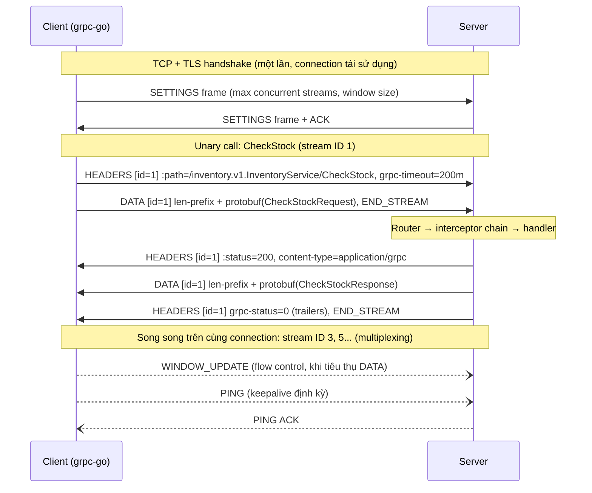
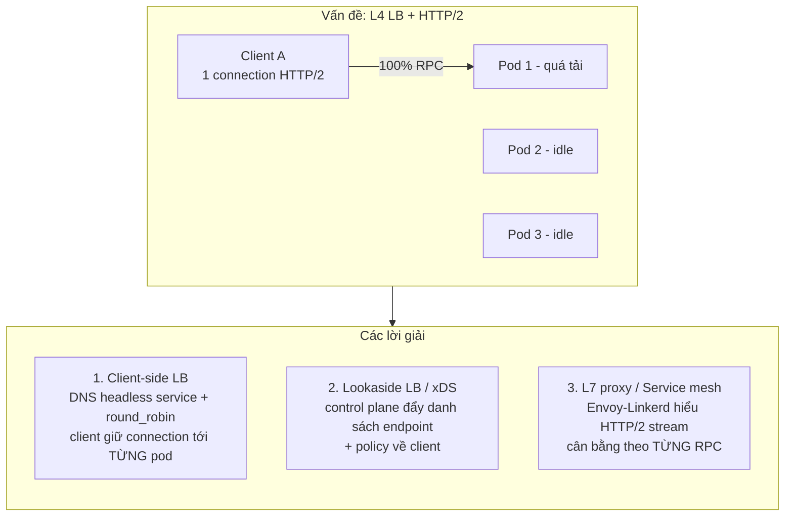

+++
title = "Chương 5: gRPC — RPC hiệu năng cao cho Internal Services"
date = "2026-02-22T11:00:00+07:00"
draft = false
tags = ["backend", "communication", "api", "architecture"]
series = ["Backend Communication Architecture"]
+++

[← Chương trước](/series/backend-communication-architect/04-graphql/) | Mục lục | [Chương sau →](/series/backend-communication-architect/06-websocket/)

---

## 1. Problem Statement

Hãy bắt đầu từ một hệ thống thật. Bạn đang vận hành một nền tảng thương mại điện tử với khoảng 200 internal service. Mỗi request từ người dùng — ví dụ "đặt hàng" — kích hoạt một chuỗi gọi nội bộ: `api-gateway → order-service → inventory-service → pricing-service → promotion-service → payment-service → notification-service`. Fan-out trung bình 1 request bên ngoài thành 15–30 lời gọi nội bộ. Ở mức 5.000 request/giây từ phía người dùng, hệ thống nội bộ đang xử lý **hơn 100.000 lời gọi service-to-service mỗi giây**.

Toàn bộ giao tiếp nội bộ đang chạy trên REST/JSON over HTTP/1.1. Ba nhóm vấn đề xuất hiện, và chúng không phải vấn đề "tối ưu cho vui" — chúng là chi phí thật:

**Vấn đề 1 — CPU đốt vào serialization.** Profiling một pod `order-service` cho thấy 28% CPU dành cho `encoding/json` (marshal + unmarshal). JSON là text-based: mỗi số nguyên phải chuyển thành chuỗi thập phân rồi parse ngược lại; mỗi field name lặp lại đầy đủ trong từng message; parser phải quét từng byte để tìm dấu `"`, `:`, `,`. Với 100.000 lời gọi nội bộ/giây, bạn đang trả tiền cloud cho việc chuyển `12345` thành `"12345"` và ngược lại, hàng tỷ lần mỗi ngày.

**Vấn đề 2 — Không type-safe.** `pricing-service` đổi field `discount` từ số sang object `{amount, currency}`. Không có gì bắt buộc `order-service` biết điều này lúc compile. Sự cố chỉ lộ ra lúc runtime, ở production, lúc 2 giờ sáng, dưới dạng `json: cannot unmarshal object into Go value of type float64`. Contract giữa các service tồn tại dưới dạng... file Confluence cập nhật lần cuối 8 tháng trước.

**Vấn đề 3 — Không streaming, và HTTP/1.1 head-of-line blocking.** `inventory-service` cần trả về 50.000 bản ghi tồn kho cho batch job. Với REST bạn phải: (a) trả một response khổng lồ — client giữ toàn bộ trong memory, hoặc (b) tự chế pagination — N round-trip, mỗi round-trip trả thêm latency. HTTP/1.1 chỉ cho phép một request đang bay (in-flight) trên mỗi connection, nên client phải mở connection pool lớn; mỗi connection là một lần TCP handshake + TLS handshake + slow start.

Bài toán kỹ thuật rút gọn: **cần một cơ chế giao tiếp nội bộ có (1) binary serialization rẻ CPU và nhỏ trên wire, (2) contract được enforce lúc compile-time ở cả hai phía, (3) streaming hai chiều, (4) multiplexing trên ít connection.** Đó chính xác là tập giao của Protocol Buffers + HTTP/2 + codegen — tức là gRPC.

---

## 2. Tại sao gRPC tồn tại

### 2.1. Business problem

- **Chi phí hạ tầng:** serialization là "thuế" trả trên mọi lời gọi. Giảm 20–30% CPU cho giao tiếp nội bộ ở quy mô trăm service là giảm trực tiếp hóa đơn cloud.
- **Tốc độ phát triển:** khi contract nằm trong file `.proto` được version-control và codegen ra client/server stub, team A đổi API thì team B **fail lúc compile**, không phải lúc production. Chi phí phối hợp giữa các team giảm đáng kể.
- **Time-to-market cho tính năng realtime nội bộ:** streaming có sẵn trong framework thay vì phải tự dựng WebSocket/polling nội bộ.

### 2.2. Technical problem

- JSON không có schema bắt buộc; OpenAPI là tài liệu, không phải enforcement (trừ khi bạn tự dựng validation pipeline — thêm một hệ thống phải bảo trì).
- HTTP/1.1: một connection, một request tại một thời điểm → connection pool phình to, head-of-line blocking ở tầng ứng dụng.
- Không có chuẩn chung cho deadline, retry, cancellation lan truyền qua chuỗi gọi — mỗi team tự chế một kiểu.

### 2.3. Scale problem

Ở 10 service, REST/JSON hoàn toàn ổn. Ở 200 service với fan-out sâu, ba hiện tượng phi tuyến xuất hiện:

1. **Latency cộng dồn theo chiều sâu:** chuỗi gọi 6 tầng, mỗi tầng thêm 2ms serialize + 1ms parse → riêng serialization đã chiếm ~18ms trong latency budget 100ms.
2. **Tail latency khuếch đại theo fan-out:** gọi song song 20 service, latency của request = max của 20 lời gọi. p99 của từng service trở thành p50 của request tổng. Mọi ms tiết kiệm được ở từng hop đều đáng giá.
3. **Contract drift:** số cặp (producer, consumer) tăng theo O(n²) tiềm năng. Không có machine-enforced contract, drift là chắc chắn, chỉ là khi nào.

gRPC tồn tại vì Google đã đối mặt chính xác bài toán này ở quy mô nội bộ (hệ thống tiền nhiệm là Stubby, xử lý hàng chục tỷ lời gọi mỗi giây), và open-source hóa lời giải năm 2015.

---

## 3. Internal Architecture

### 3.1. Bản chất RPC — và vì sao "ảo tưởng local call" nguy hiểm

Ý tưởng cốt lõi của RPC: làm cho lời gọi remote **trông giống** lời gọi hàm local:

```go
// Trông như gọi hàm bình thường...
resp, err := inventoryClient.CheckStock(ctx, &pb.CheckStockRequest{Sku: "ABC-123"})
```

Đằng sau một dòng đó là: marshal request thành bytes → nén (tùy chọn) → đóng frame HTTP/2 → ghi vào TCP socket → qua N hop mạng → server đọc frame → unmarshal → dispatch vào handler → và toàn bộ chiều ngược lại. Sự tiện lợi này chính là **mối nguy số một của RPC**, vì nó che giấu ba sự thật vật lý:

**Thứ nhất, latency không phải zero và không có cận trên.** Lời gọi local mất nanosecond, deterministic. Lời gọi remote mất từ trăm microsecond đến... vô hạn (network partition). Code viết theo tư duy local — gọi tuần tự trong vòng lặp, không đặt deadline — sẽ sụp đổ khi mạng chậm. Một `for` loop gọi RPC 100 lần tuần tự ở 1ms/lời gọi là 100ms; cùng loop đó khi mạng degrade lên 50ms/lời gọi là 5 giây.

**Thứ hai, partial failure — chế độ lỗi không tồn tại trong local call.** Gọi hàm local: hoặc thành công, hoặc panic — bạn luôn biết kết quả. Gọi remote: request có thể đã đến server, server **đã xử lý xong** (đã trừ tiền!), nhưng response bị mất trên đường về. Client nhận timeout và **không thể phân biệt** giữa "server chưa nhận" và "server đã xử lý". Đây là lý do idempotency không phải optional trong hệ phân tán — retry một request không idempotent sau timeout có thể trừ tiền hai lần.

**Thứ ba, không có shared memory.** Truyền con trỏ là vô nghĩa; mọi thứ phải serialize. Object graph có cycle, resource handle (file descriptor, mutex) không thể đi qua wire. Thiết kế message của RPC buộc phải là dữ liệu thuần, không phải object "sống".

gRPC không xóa bỏ các vấn đề này — không framework nào làm được — nhưng nó **thừa nhận** chúng bằng thiết kế: deadline là first-class citizen, status code phân biệt rõ `UNAVAILABLE` (nên retry) và `DEADLINE_EXCEEDED` (không rõ trạng thái), cancellation lan truyền tự động. Framework tốt không giấu sự thật phân tán; nó cho bạn công cụ để đối mặt.

### 3.2. Protocol Buffers — vì sao nhanh và nhỏ hơn JSON

Protobuf là binary encoding với schema tách rời khỏi dữ liệu. Hiểu wire format là hiểu vì sao nó thắng JSON về cả kích thước lẫn CPU.

#### 3.2.1. Tag-Length-Value và field number

Mỗi field trên wire được encode thành: **tag** (chứa field number + wire type), theo sau là payload. Tag là một varint:

```
tag = (field_number << 3) | wire_type
```

Wire type chỉ có 6 giá trị, quan trọng nhất:

| Wire type | Giá trị | Dùng cho |
|---|---|---|
| VARINT | 0 | int32, int64, uint, bool, enum, sint (zigzag) |
| I64 | 1 | fixed64, double |
| LEN | 2 | string, bytes, message lồng nhau, packed repeated |
| I32 | 5 | fixed32, float |

Điểm then chốt: **field name không bao giờ xuất hiện trên wire — chỉ có field number.** JSON gửi `"customer_email_address": "a@b.com"` (24 byte overhead cho tên field, lặp lại trong mọi message); protobuf gửi 1 byte tag. Đây là nguồn tiết kiệm kích thước lớn nhất.

#### 3.2.2. Varint

Số nguyên được encode theo varint: mỗi byte dùng 7 bit dữ liệu, bit cao nhất (MSB) báo "còn byte tiếp theo hay không". Số nhỏ tốn ít byte:

```
1        → 0x01                    (1 byte)
300      → 0xAC 0x02               (2 byte)
           1010 1100  0000 0010
           ^MSB=1: còn tiếp   ^MSB=0: hết
           Ghép 7-bit groups (little-endian): 0000010 ++ 0101100 = 100101100 = 300
```

Trong thực tế, phần lớn số nguyên trong hệ thống (count, status code, quantity, enum) là số nhỏ → 1–2 byte thay vì chuỗi thập phân + dấu ngoặc của JSON. Lưu ý: số âm với `int32` chiếm 10 byte varint (vì được coi là uint64 lớn) — nếu field thường xuyên âm, dùng `sint32` (zigzag encoding: -1 → 1, 1 → 2, -2 → 3...) để giữ nhỏ.

#### 3.2.3. Vì sao parse nhanh hơn JSON

- **Không scan tìm delimiter:** JSON parser phải đọc từng byte tìm `"`, `,`, `}`; protobuf đọc tag → biết ngay wire type → biết chính xác cần đọc bao nhiêu byte (varint tự kết thúc, LEN có độ dài đứng trước). Parser nhảy thẳng, không đoán.
- **Không chuyển đổi text↔number:** `float64` trong JSON phải qua `strconv` hai chiều — một trong những hàm tốn CPU nhất của `encoding/json`. Protobuf copy 8 byte IEEE 754 nguyên xi.
- **Không cần reflection nếu dùng codegen:** code marshal/unmarshal được sinh sẵn cho từng message type, biết trước layout — trong khi `encoding/json` của Go dựa trên reflection (dù có cache).
- **Skip field không biết trong O(length):** gặp field number lạ, parser đọc wire type, nhảy qua đúng số byte. Đây cũng là nền tảng của forward compatibility.

#### 3.2.4. Backward/Forward compatibility — luật bất di bất dịch

Schema evolution là lý do protobuf sống sót ở quy mô lớn. Vì wire chỉ chứa field number, các luật sau đảm bảo client cũ đọc được message mới (forward compat) và server mới đọc được message cũ (backward compat):

1. **Không bao giờ đổi field number của field đang tồn tại.** Field number là identity trên wire.
2. **Không bao giờ tái sử dụng field number đã xóa.** Dùng `reserved 4, 9;` và `reserved "old_name";` để compiler chặn việc tái sử dụng. Vi phạm luật này tạo ra lỗi kinh dị nhất: binary cũ decode field mới **thành nghĩa cũ** — dữ liệu "hợp lệ" nhưng sai hoàn toàn, không có error nào được ném ra.
3. **Thêm field mới luôn an toàn** (code cũ skip field lạ; code mới thấy field vắng mặt → default value).
4. **Cẩn trọng với default value:** proto3 không phân biệt "field = 0" và "field không được set" với scalar thường — nếu cần phân biệt, dùng `optional` (proto3 từ 3.15) hoặc wrapper type.
5. **Đổi type chỉ trong nhóm tương thích wire** (int32/uint32/int64/bool cùng varint — nhưng vẫn có bẫy truncation), tốt nhất là **không đổi**.

So sánh với JSON: JSON "tương thích" theo nghĩa parser không crash, nhưng không có cơ chế nào ngăn hai team hiểu khác nhau về cùng một field. Protobuf biến compatibility thành thứ compiler và code review trên file `.proto` có thể kiểm soát.

### 3.3. IDL và contract-first codegen

Với gRPC, file `.proto` là **nguồn sự thật duy nhất** — không phải code, không phải wiki:

```protobuf
// inventory/v1/inventory.proto
syntax = "proto3";

package inventory.v1;

option go_package = "github.com/smartbit/protos/gen/inventory/v1;inventoryv1";

service InventoryService {
  // Unary: kiểm tra tồn kho một SKU.
  rpc CheckStock(CheckStockRequest) returns (CheckStockResponse);

  // Server streaming: xuất toàn bộ tồn kho theo warehouse, trả từng batch.
  rpc ExportStock(ExportStockRequest) returns (stream StockItem);

  // Client streaming: nhận cập nhật tồn kho hàng loạt từ thiết bị kiểm kho.
  rpc BulkUpdateStock(stream StockUpdate) returns (BulkUpdateSummary);

  // Bidirectional: đồng bộ tồn kho realtime hai chiều với warehouse edge.
  rpc SyncStock(stream StockEvent) returns (stream StockEvent);
}

message CheckStockRequest {
  string sku = 1;
  string warehouse_id = 2;
}

message CheckStockResponse {
  string sku = 1;
  int64 available = 2;
  int64 reserved = 3;
  // Field 4 từng là `bool in_stock`, đã xóa — khóa lại vĩnh viễn.
  reserved 4;
  reserved "in_stock";
}

message ExportStockRequest {
  string warehouse_id = 1;
}

message StockItem {
  string sku = 1;
  int64 available = 2;
  int64 updated_at_unix = 3;
}

message StockUpdate {
  string sku = 1;
  int64 delta = 2;
}

message BulkUpdateSummary {
  int64 applied = 1;
  int64 rejected = 2;
}

message StockEvent {
  string sku = 1;
  int64 available = 2;
  string origin = 3; // "central" | "edge"
}
```

Quy trình contract-first đúng chuẩn ở quy mô nhiều team:

1. `.proto` sống trong **một repo riêng** (hoặc thư mục chung được quản lý bằng Buf/BSR), có review bắt buộc, có breaking-change detection trong CI (`buf breaking`).
2. CI codegen ra package cho từng ngôn ngữ, publish có version.
3. Service import stub đã sinh — **không ai viết tay client**.

Điểm khác biệt triết lý với REST: OpenAPI thường được sinh **từ code** (code-first) nên contract chạy theo implementation; proto đảo ngược — implementation chạy theo contract. Khi thay đổi API phải đi qua review của file proto, thay đổi breaking bị chặn trước khi bất kỳ dòng code nào được viết.

### 3.4. Bốn loại RPC

| Loại | Chữ ký | Use case điển hình |
|---|---|---|
| Unary | 1 request → 1 response | 90% lời gọi nội bộ: lookup, command, CRUD |
| Server streaming | 1 request → N response | Export dataset lớn, tail log, subscribe thay đổi, LLM token stream nội bộ |
| Client streaming | N request → 1 response | Upload theo chunk, ingest metrics/telemetry, gom batch phía server |
| Bidirectional streaming | N request ↔ N response, độc lập | Chat backbone, sync hai chiều, giao thức tương tác (speech-to-text), long-lived worker protocol |

Nguyên tắc chọn: **dùng loại đơn giản nhất thỏa yêu cầu.** Streaming là stateful — nó mang theo toàn bộ độ phức tạp của connection dài hạn (mục 3.6, 3.7). Đừng dùng bidirectional streaming cho thứ mà unary + polling 5 giây giải quyết được.

Một điểm tinh tế của server streaming so với "response lớn": mỗi message được flush độc lập, client xử lý được message đầu tiên khi server còn đang sinh message thứ N → time-to-first-byte thấp, memory hai phía là O(message) thay vì O(dataset). Flow control của HTTP/2 (mục 3.5) tự động làm backpressure: client chậm → server bị chặn ở `Send()` — không cần tự chế cơ chế.

### 3.5. gRPC trên HTTP/2 — stream, frame, multiplexing, flow control, HPACK

gRPC không tự phát minh transport; nó là một cách dùng HTTP/2 có kỷ luật. Hiểu HTTP/2 là hiểu 80% hành vi vận hành của gRPC.

**Stream và frame.** Một connection HTTP/2 (một TCP connection) chứa nhiều **stream** đồng thời — mỗi stream là một cặp request/response độc lập, định danh bằng stream ID (client mở stream lẻ: 1, 3, 5...). Dữ liệu chảy dưới dạng **frame** — đơn vị nhỏ nhất trên wire, mỗi frame có header 9 byte ghi: length, type, flags, stream ID. Các loại frame quan trọng: `HEADERS` (metadata), `DATA` (payload), `WINDOW_UPDATE` (flow control), `SETTINGS`, `PING`, `RST_STREAM` (hủy một stream), `GOAWAY` (đóng connection có trật tự).

Một lời gọi unary gRPC ánh xạ thành:

```
Client → Server:
  HEADERS frame  (stream 1): :method=POST, :path=/inventory.v1.InventoryService/CheckStock,
                             content-type=application/grpc, grpc-timeout=200m, ...
  DATA frame     (stream 1): [1 byte compressed-flag][4 byte length][protobuf bytes]
                             + flag END_STREAM
Server → Client:
  HEADERS frame  (stream 1): :status=200, content-type=application/grpc
  DATA frame     (stream 1): [gRPC length-prefixed message]
  HEADERS frame  (stream 1): grpc-status=0, grpc-message=""   ← "trailers", + END_STREAM
```

Chú ý hai đặc thù: (1) gRPC bọc mỗi message trong **length-prefixed frame riêng của nó** (1 byte flag nén + 4 byte độ dài) — nhờ vậy streaming nhiều message trên một stream là tự nhiên; (2) **grpc-status nằm trong trailers** (HEADERS frame cuối) — vì với streaming, status chỉ biết được sau khi stream kết thúc. Đây chính là lý do gRPC không chạy qua nhiều proxy/browser: chúng không hỗ trợ HTTP trailers (grpc-web tồn tại để giải quyết việc này).

**Multiplexing.** Nhiều stream interleave frame trên một connection: frame của stream 1, 3, 5 xen kẽ tùy scheduler. Kết quả: một connection phục vụ hàng trăm RPC đồng thời, không head-of-line blocking **ở tầng HTTP** (vẫn còn HOL blocking ở tầng TCP khi mất packet — HTTP/3/QUIC sinh ra để xử lý nốt tầng này). Hệ quả vận hành quan trọng nhất: **gRPC dùng rất ít connection** — và điều này phá vỡ load balancing L4 (mục 3.7).

**Flow control — window update và backpressure.** HTTP/2 có flow control hai cấp: per-stream và per-connection. Mỗi bên duy trì một **window** (mặc định 64KB, grpc-go nâng lên qua BDP estimation): sender chỉ được gửi tối đa `window` byte DATA chưa được xác nhận; receiver tiêu thụ xong thì gửi `WINDOW_UPDATE` để mở lại window. Khi receiver chậm (application không đọc), window cạn → sender **bị chặn ở tầng transport** → trong grpc-go, `stream.Send()` block. Đây là backpressure end-to-end miễn phí: producer nhanh không thể đè bẹp consumer chậm — nhưng cũng có nghĩa là **một consumer treo có thể block goroutine của bạn vĩnh viễn nếu không có deadline** (xem failure example).

**HPACK.** Header HTTP lặp lại rất nhiều giữa các request (`:path`, `content-type`, auth token...). HPACK nén bằng: bảng tĩnh (61 header phổ biến), bảng động per-connection (header đã gửi được đánh index, lần sau chỉ gửi index — vài byte), và Huffman coding cho chuỗi mới. Trên connection nội bộ dài hạn, header của request thứ N gần như free. Hệ quả tinh tế: HPACK dynamic table là **state per-connection** — thêm một lý do gRPC muốn giữ connection sống lâu, và thêm một chi phí khi connection churn cao.



### 3.6. Connection management — keepalive, MAX_CONNECTION_AGE, GOAWAY

Connection gRPC là tài sản dài hạn, và tài sản dài hạn cần quản lý vòng đời.

**Keepalive.** Vấn đề: NAT gateway, cloud LB (AWS NLB idle timeout 350s, Azure LB 4 phút...) lặng lẽ drop connection idle mà **không gửi RST** — hai đầu vẫn tưởng connection sống (half-open). Lời gọi tiếp theo treo đến TCP timeout (có thể nhiều phút). Giải pháp: client gửi HTTP/2 `PING` frame định kỳ; không nhận ACK trong `Timeout` → đóng connection, reconnect. Phía server có **enforcement policy** (`MinTime`): client ping dày hơn mức cho phép sẽ bị server trả `GOAWAY` với debug data `too_many_pings` — cấu hình hai phía phải khớp nhau, đây là lỗi cấu hình gRPC phổ biến bậc nhất.

**MAX_CONNECTION_AGE.** Server chủ động đóng connection sau một tuổi thọ nhất định (ví dụ 5 phút, cộng jitter tự động ±10%). Vì sao lại *muốn* đóng connection tốt? Vì connection dài vô hạn nghĩa là client **không bao giờ re-resolve DNS, không bao giờ rebalance**. Khi bạn scale từ 3 pod lên 10 pod, 7 pod mới ngồi chơi nếu client cũ giữ connection cũ mãi. `MaxConnectionAge` + `MaxConnectionAgeGrace` là cơ chế ép rebalance định kỳ — đặc biệt quan trọng trong Kubernetes.

**GOAWAY.** Cơ chế đóng connection **có trật tự** của HTTP/2: server gửi frame `GOAWAY(last_stream_id)` nghĩa là "tôi sẽ xử lý nốt các stream ≤ last_stream_id, đừng mở stream mới". Client nhận GOAWAY: RPC đang bay chạy tiếp đến xong, RPC mới đi sang connection khác. Đây là nền tảng của graceful shutdown (`grpcServer.GracefulStop()` gửi GOAWAY rồi chờ stream drain) — zero-downtime deploy phụ thuộc vào việc bạn cho quá trình này đủ thời gian (`terminationGracePeriodSeconds` > thời gian drain + `MaxConnectionAgeGrace`).

### 3.7. Load balancing — vấn đề đặc thù của gRPC

Đây là nơi nhiều team "ăn hành" nhất khi chuyển sang gRPC trong Kubernetes.

**Vấn đề gốc:** L4 load balancer (kube-proxy/iptables, AWS NLB) cân bằng **theo connection**, không theo request. Với HTTP/1.1 + pool nhiều connection, điều này gần đúng với cân bằng theo request. Với gRPC: client mở **một** connection HTTP/2, multiplex hàng nghìn RPC/giây lên đó → L4 LB chọn backend **một lần duy nhất lúc handshake** → toàn bộ traffic của client đó dồn về **một pod**. Scale từ 1 lên 10 pod: 1 pod nhận 100% tải từ mỗi client, 9 pod idle. HPA thấy CPU trung bình thấp → không scale; pod nóng thì OOM/timeout.



**Lời giải 1 — Client-side LB với headless Service.** Trong K8s, đặt `clusterIP: None` → DNS trả về **danh sách IP của từng pod** thay vì một virtual IP. grpc-go resolver `dns:///` lấy danh sách này, tạo subchannel (connection) tới từng pod, policy `round_robin` rải RPC lên tất cả:

```go
conn, err := grpc.NewClient(
    "dns:///inventory-headless.default.svc.cluster.local:9090",
    grpc.WithDefaultServiceConfig(`{"loadBalancingConfig": [{"round_robin":{}}]}`),
    ...
)
```

Nhược điểm: DNS re-resolution không tức thời (grpc-go re-resolve khi connection lỗi hoặc nhận GOAWAY — vì thế cần `MaxConnectionAge` phía server để ép refresh định kỳ); mỗi client giữ N connection; logic LB nằm trong client → nâng cấp policy nghĩa là redeploy toàn bộ client.

**Lời giải 2 — Lookaside/xDS.** Client hỏi một control plane (xDS server, ví dụ do service mesh hoặc Traffic Director cung cấp) để nhận danh sách endpoint + policy động. Tách data plane khỏi control plane, đổi policy không cần redeploy. Chi phí: vận hành thêm control plane.

**Lời giải 3 — L7 proxy / Service mesh.** Envoy/Linkerd sidecar hiểu HTTP/2, cân bằng **per-RPC**: client mở 1 connection tới sidecar, sidecar rải từng RPC sang các pod. Ưu điểm lớn nhất: client hoàn toàn ngây thơ, LB/retry/mTLS/telemetry đồng nhất mọi ngôn ngữ. Chi phí: thêm ~0.5–2ms latency mỗi hop, thêm cả một hệ thống để vận hành, debug khó hơn một tầng.

Quy tắc thực dụng: đội nhỏ, ít ngôn ngữ → headless + client-side round_robin (kèm `MaxConnectionAge` 1–5 phút). Tổ chức lớn, đa ngôn ngữ, cần traffic policy tinh vi → service mesh.

### 3.8. Deadline propagation

Deadline trong gRPC không phải timeout cục bộ — nó là **hợp đồng lan truyền qua toàn chuỗi gọi**. Client đặt deadline qua `context.WithTimeout`; grpc-go dịch thành header `grpc-timeout` gửi kèm request; server nhận, gắn vào `ctx` của handler; handler gọi service kế tiếp **với chính ctx đó** → deadline còn lại (đã trừ thời gian trôi qua) tự động truyền tiếp. Khi deadline hết ở bất kỳ đâu: client hủy stream (`RST_STREAM`), server thấy `ctx.Done()`, mọi tầng dưới hủy theo — **cancellation lan xuống tận DB query** nếu bạn truyền ctx đúng.

Nguyên tắc thiết kế:
- Đặt deadline ở **entry point** (gateway) dựa trên budget của user-facing SLO, ví dụ 800ms.
- Mỗi tầng dưới **không đặt lại deadline dài hơn** — chỉ được thu hẹp (ví dụ dành 100ms cho lời gọi phụ không quan trọng).
- Handler nên kiểm tra `ctx.Err()` trước các bước tốn kém: nếu client đã bỏ cuộc, đừng tốn tài nguyên tính response không ai nhận.
- Phân biệt hai status: `DEADLINE_EXCEEDED` do chính RPC này hết giờ, và `CANCELLED` do upstream hủy. Dashboard nên tách riêng — chúng chỉ về hai bệnh khác nhau (service này chậm vs. upstream hết kiên nhẫn).

Anti-pattern kinh điển: mỗi service tự đặt timeout cứng 5s bất kể budget còn lại. Chuỗi 4 tầng, tầng 1 timeout 5s trong khi tầng 2-3-4 mỗi tầng cũng 5s → tầng 4 vẫn miệt mài xử lý một request mà user đã nhận lỗi từ 10 giây trước. Deadline propagation tồn tại để giết chính xác loại lãng phí này.

### 3.9. Interceptor

Interceptor là middleware của gRPC — nơi đặt cross-cutting concern để handler chỉ chứa business logic. Có 4 loại: unary/stream × client/server. Chuỗi server interceptor điển hình (thứ tự có ý nghĩa):

```
request → [recovery] → [logging] → [metrics] → [auth] → [ratelimit] → handler
```

Recovery đứng ngoài cùng để bắt panic của mọi tầng trong (một panic trong handler mà không recover sẽ **giết cả process**, tức là giết tất cả RPC đang bay trên server đó). Metrics/logging đứng ngoài auth để đo được cả request bị từ chối. Xem code đầy đủ ở mục 3.11.

### 3.10. Reflection và grpc-gateway

**Reflection:** server tự mô tả schema của mình qua một service đặc biệt (`grpc.reflection.v1.ServerReflection`). Bật nó cho phép `grpcurl` gọi thử API không cần file proto — tương đương `curl` của thế giới gRPC. Bật ở dev/staging; ở production, cân nhắc theo posture bảo mật (reflection tiết lộ toàn bộ surface của API — với internal service sau mTLS thường chấp nhận được, và giá trị debug lúc sự cố là rất lớn).

```bash
grpcurl -plaintext localhost:9090 list
grpcurl -plaintext -d '{"sku":"ABC-123","warehouse_id":"HN-01"}' \
  localhost:9090 inventory.v1.InventoryService/CheckStock
```

**grpc-gateway:** sinh một reverse proxy dịch REST/JSON ↔ gRPC từ annotation trong proto:

```protobuf
import "google/api/annotations.proto";

rpc CheckStock(CheckStockRequest) returns (CheckStockResponse) {
  option (google.api.http) = {
    get: "/v1/warehouses/{warehouse_id}/stock/{sku}"
  };
}
```

Đây là câu trả lời cho "gRPC nội bộ nhưng đối tác/frontend cần REST": một nguồn sự thật (proto), hai bề mặt (gRPC cho nội bộ, REST + OpenAPI sinh tự động cho bên ngoài). Tránh được việc duy trì hai API song song bằng tay.

### 3.11. Code Golang production-grade

#### Server

```go
// cmd/inventory-server/main.go
package main

import (
	"context"
	"errors"
	"fmt"
	"log/slog"
	"net"
	"os"
	"os/signal"
	"runtime/debug"
	"syscall"
	"time"

	"google.golang.org/grpc"
	"google.golang.org/grpc/codes"
	"google.golang.org/grpc/health"
	healthpb "google.golang.org/grpc/health/grpc_health_v1"
	"google.golang.org/grpc/keepalive"
	"google.golang.org/grpc/reflection"
	"google.golang.org/grpc/status"

	inventoryv1 "github.com/smartbit/protos/gen/inventory/v1"
)

// ---------- Interceptors ----------

// recoveryInterceptor: panic trong handler KHÔNG được phép giết process —
// một process chết là mọi RPC đang bay trên server này chết theo.
// Đổi panic thành codes.Internal, log kèm stack để điều tra.
func recoveryInterceptor(
	ctx context.Context, req any,
	info *grpc.UnaryServerInfo, handler grpc.UnaryHandler,
) (resp any, err error) {
	defer func() {
		if r := recover(); r != nil {
			slog.Error("panic recovered",
				"method", info.FullMethod,
				"panic", r,
				"stack", string(debug.Stack()))
			err = status.Error(codes.Internal, "internal error")
		}
	}()
	return handler(ctx, req)
}

// loggingInterceptor: structured log mọi RPC với method, code, duration.
// Đây là nguồn dữ liệu tối thiểu để trả lời "service có khỏe không".
func loggingInterceptor(
	ctx context.Context, req any,
	info *grpc.UnaryServerInfo, handler grpc.UnaryHandler,
) (any, error) {
	start := time.Now()
	resp, err := handler(ctx, req)
	st, _ := status.FromError(err) // err == nil → codes.OK
	slog.Info("rpc",
		"method", info.FullMethod,
		"code", st.Code().String(),
		"duration_ms", time.Since(start).Milliseconds())
	return resp, err
}

// ---------- Service implementation ----------

type inventoryServer struct {
	inventoryv1.UnimplementedInventoryServiceServer // forward compat: method mới trong proto → UNIMPLEMENTED thay vì lỗi compile
	repo StockRepo
}

type StockRepo interface {
	Get(ctx context.Context, warehouseID, sku string) (available, reserved int64, err error)
	Scan(ctx context.Context, warehouseID string, fn func(item *inventoryv1.StockItem) error) error
}

func (s *inventoryServer) CheckStock(
	ctx context.Context, req *inventoryv1.CheckStockRequest,
) (*inventoryv1.CheckStockResponse, error) {
	if req.GetSku() == "" {
		// INVALID_ARGUMENT: lỗi của client, KHÔNG retry, không tính vào error-rate SLO của server.
		return nil, status.Error(codes.InvalidArgument, "sku is required")
	}
	avail, reserved, err := s.repo.Get(ctx, req.GetWarehouseId(), req.GetSku())
	if err != nil {
		if errors.Is(err, context.Canceled) {
			return nil, status.Error(codes.Canceled, "client cancelled")
		}
		// Không rò rỉ chi tiết nội bộ (SQL, host...) ra status message.
		slog.Error("repo.Get failed", "err", err)
		return nil, status.Error(codes.Internal, "storage error")
	}
	return &inventoryv1.CheckStockResponse{
		Sku: req.GetSku(), Available: avail, Reserved: reserved,
	}, nil
}

// ExportStock: server streaming. Điểm mấu chốt:
// - memory O(1 item) thay vì load cả dataset;
// - stream.Send() BLOCK khi flow-control window của client cạn → backpressure
//   tự nhiên, nhưng cũng nghĩa là PHẢI tôn trọng ctx để không kẹt vĩnh viễn
//   với client chết/treo.
func (s *inventoryServer) ExportStock(
	req *inventoryv1.ExportStockRequest,
	stream grpc.ServerStreamingServer[inventoryv1.StockItem],
) error {
	ctx := stream.Context()
	return s.repo.Scan(ctx, req.GetWarehouseId(), func(item *inventoryv1.StockItem) error {
		select {
		case <-ctx.Done(): // client hủy / deadline / connection chết
			return status.FromContextError(ctx.Err()).Err()
		default:
		}
		return stream.Send(item)
	})
}

// ---------- main ----------

func main() {
	lis, err := net.Listen("tcp", ":9090")
	if err != nil {
		slog.Error("listen failed", "err", err)
		os.Exit(1)
	}

	srv := grpc.NewServer(
		grpc.ChainUnaryInterceptor(
			recoveryInterceptor, // ngoài cùng: bắt panic của mọi tầng trong
			loggingInterceptor,
		),
		grpc.KeepaliveParams(keepalive.ServerParameters{
			// Ép client reconnect định kỳ → re-resolve DNS → rebalance sang pod mới.
			// Thiếu dòng này, client-side LB trong K8s gần như vô dụng khi scale-out.
			MaxConnectionAge:      5 * time.Minute,
			MaxConnectionAgeGrace: 30 * time.Second, // cho RPC đang bay thời gian hoàn thành sau GOAWAY
			Time:                  2 * time.Hour,    // server tự ping client idle
			Timeout:               20 * time.Second,
		}),
		grpc.KeepaliveEnforcementPolicy(keepalive.EnforcementPolicy{
			// PHẢI khớp với keepalive phía client. Client ping dày hơn MinTime
			// → server trả GOAWAY "too_many_pings" → reconnect storm.
			MinTime:             30 * time.Second,
			PermitWithoutStream: true,
		}),
		grpc.MaxRecvMsgSize(4<<20), // 4MB — chặn message khổng lồ; cái gì > 4MB nên là streaming
	)

	inventoryv1.RegisterInventoryServiceServer(srv, &inventoryServer{repo: newRepo()})

	// Health service: K8s readiness/liveness probe qua grpc_health_probe
	// hoặc native gRPC probe (K8s >= 1.24).
	healthSrv := health.NewServer()
	healthpb.RegisterHealthServer(srv, healthSrv)
	healthSrv.SetServingStatus("", healthpb.HealthCheckResponse_SERVING)

	reflection.Register(srv) // grpcurl hoạt động — vô giá lúc 2h sáng

	// Graceful shutdown: SIGTERM → set NOT_SERVING (readiness fail, LB rút traffic)
	// → GracefulStop (gửi GOAWAY, chờ stream drain).
	go func() {
		sig := make(chan os.Signal, 1)
		signal.Notify(sig, syscall.SIGTERM, syscall.SIGINT)
		<-sig
		slog.Info("shutting down")
		healthSrv.SetServingStatus("", healthpb.HealthCheckResponse_NOT_SERVING)
		time.Sleep(3 * time.Second) // chờ readiness probe lan truyền, endpoint bị rút khỏi LB
		srv.GracefulStop()
	}()

	slog.Info("inventory-server listening", "addr", lis.Addr().String())
	if err := srv.Serve(lis); err != nil {
		slog.Error("serve failed", "err", err)
		os.Exit(1)
	}
	fmt.Println("bye")
}
```

#### Client

```go
// internal/clients/inventory.go
package clients

import (
	"context"
	"log/slog"
	"time"

	"google.golang.org/grpc"
	"google.golang.org/grpc/credentials/insecure" // nội bộ demo; production: mTLS hoặc mesh lo TLS
	"google.golang.org/grpc/keepalive"

	inventoryv1 "github.com/smartbit/protos/gen/inventory/v1"
)

// NewInventoryClient: tạo MỘT lần lúc khởi động, tái sử dụng suốt vòng đời process.
// *grpc.ClientConn là thread-safe, tự quản pool subchannel, tự reconnect.
// Tạo connection per-request là anti-pattern hủy diệt hiệu năng (xem mục 6).
func NewInventoryClient(target string) (inventoryv1.InventoryServiceClient, *grpc.ClientConn, error) {
	conn, err := grpc.NewClient(
		// "dns:///" + headless service → resolver trả IP từng pod → round_robin per-RPC.
		target, // ví dụ: "dns:///inventory-headless.default.svc.cluster.local:9090"
		grpc.WithTransportCredentials(insecure.NewCredentials()),
		grpc.WithDefaultServiceConfig(`{
			"loadBalancingConfig": [{"round_robin":{}}],
			"methodConfig": [{
				"name": [{"service": "inventory.v1.InventoryService"}],
				"retryPolicy": {
					"maxAttempts": 3,
					"initialBackoff": "0.1s",
					"maxBackoff": "1s",
					"backoffMultiplier": 2,
					"retryableStatusCodes": ["UNAVAILABLE"]
				}
			}]
		}`),
		grpc.WithKeepaliveParams(keepalive.ClientParameters{
			Time:                60 * time.Second, // > MinTime của server (30s), nếu không sẽ ăn GOAWAY
			Timeout:             10 * time.Second,
			PermitWithoutStream: true, // phát hiện connection chết cả khi idle (NAT drop)
		}),
		grpc.WithUnaryInterceptor(clientLogging),
	)
	if err != nil {
		return nil, nil, err
	}
	return inventoryv1.NewInventoryServiceClient(conn), conn, nil
}

func clientLogging(
	ctx context.Context, method string, req, reply any,
	cc *grpc.ClientConn, invoker grpc.UnaryInvoker, opts ...grpc.CallOption,
) error {
	start := time.Now()
	err := invoker(ctx, method, req, reply, cc, opts...)
	slog.Debug("client rpc", "method", method,
		"duration_ms", time.Since(start).Milliseconds(), "err", err)
	return err
}

// CheckStock: MỌI lời gọi có deadline. Nếu ctx cha đã có deadline (propagate
// từ gateway), WithTimeout chỉ thu hẹp thêm — không bao giờ nới rộng.
func CheckStock(
	ctx context.Context, c inventoryv1.InventoryServiceClient, sku, wh string,
) (*inventoryv1.CheckStockResponse, error) {
	ctx, cancel := context.WithTimeout(ctx, 200*time.Millisecond)
	defer cancel()
	return c.CheckStock(ctx, &inventoryv1.CheckStockRequest{Sku: sku, WarehouseId: wh})
}

// ConsumeExport: đọc server stream đến EOF. Send phía server bị flow control
// điều tiết theo tốc độ Recv ở đây — client chậm thì server tự chậm theo.
func ConsumeExport(
	ctx context.Context, c inventoryv1.InventoryServiceClient, wh string,
	handle func(*inventoryv1.StockItem) error,
) error {
	ctx, cancel := context.WithTimeout(ctx, 10*time.Minute) // stream dài vẫn cần cận trên
	defer cancel()

	stream, err := c.ExportStock(ctx, &inventoryv1.ExportStockRequest{WarehouseId: wh})
	if err != nil {
		return err
	}
	for {
		item, err := stream.Recv()
		if err != nil {
			if err.Error() == "EOF" || errors.Is(err, io.EOF) {
				return nil // server kết thúc stream bình thường
			}
			return err // grpc-status khác OK
		}
		if err := handle(item); err != nil {
			cancel() // báo server dừng sinh dữ liệu — đừng để server làm việc vô ích
			return err
		}
	}
}
```

Các quyết định thiết kế đáng nhắc lại: (1) một `ClientConn` cho cả process; (2) retry chỉ cho `UNAVAILABLE` — tuyệt đối không auto-retry `DEADLINE_EXCEEDED` hay `UNKNOWN` vì không rõ server đã xử lý chưa (partial failure!); nếu cần retry rộng hơn, method phải idempotent bằng thiết kế; (3) keepalive client (60s) thưa hơn enforcement server (30s); (4) mọi RPC có deadline, mọi stream có cận trên.

---

## 4. Trade-off

| Khía cạnh | gRPC/Protobuf | Nhận xét |
|---|---|---|
| Latency | Rất tốt: binary codec rẻ, HPACK, connection tái sử dụng, không HOL blocking tầng HTTP | Chênh lệch lớn nhất ở payload to và chuỗi gọi sâu; ở payload bé qua LAN, chênh lệch tuyệt đối chỉ vài trăm µs |
| Bandwidth | Payload nhỏ hơn JSON 2–10 lần tùy cấu trúc; header gần như free sau request đầu | Với dữ liệu chủ yếu là chuỗi dài (mô tả sản phẩm...), lợi thế thu hẹp — chuỗi là chuỗi |
| Complexity | Cao hơn REST rõ rệt: toolchain codegen, hiểu HTTP/2, LB đặc thù, debug cần grpcurl thay vì curl | Chi phí trả một lần cho platform team; developer thường ngày chỉ thấy proto + stub |
| Scalability | Multiplexing → ít connection, ít FD; streaming có backpressure sẵn | Nhưng LB phải làm đúng (mục 3.7), nếu không scale-out vô nghĩa |
| Developer Experience | Contract-first + codegen + type-safe: xuất sắc cho giao tiếp giữa các team | Kém hơn REST cho khám phá thủ công/onboard nhanh; browser không gọi trực tiếp được |
| Operational Cost | Cần đầu tư: proto registry, CI breaking-change check, dashboard theo grpc-status | Sau đầu tư ban đầu, chi phí vận hành trên mỗi service thấp |
| Compatibility | Wire compat của protobuf là hạng nhất nếu tuân thủ luật field number | Hệ sinh thái ngoài (webhook đối tác, API công khai, proxy cũ không hỗ trợ trailers) vẫn là đất của REST |
| Observability | Status code chuẩn hóa, interceptor hook sẵn, OpenTelemetry hỗ trợ tốt | Payload binary: không đọc bằng mắt trên tcpdump được — cần tooling (grpcurl, reflection, debug log) |
| Security | mTLS tự nhiên, metadata cho auth token, không có class lỗi injection kiểu parse text | Reflection ở production cần cân nhắc; max message size phải đặt để chống memory abuse |

### Benchmark minh họa

Unary call, payload đại diện đơn hàng ~40 field lồng 3 cấp, cùng datacenter, Go 1.23, kết nối warm. **Số liệu minh họa, phụ thuộc môi trường — hãy tự benchmark trên workload của bạn trước khi quyết định.**

| Chỉ số | REST/JSON (HTTP/1.1) | gRPC/Protobuf (HTTP/2) | Chênh lệch |
|---|---|---|---|
| Payload size (order object) | 3.1 KB | 0.9 KB | ~3.4x nhỏ hơn |
| Serialize (encode) | 8.5 µs | 1.2 µs | ~7x |
| Deserialize (decode) | 15.0 µs | 2.1 µs | ~7x |
| p50 latency end-to-end | 1.8 ms | 0.9 ms | ~2x |
| p99 latency end-to-end | 9.5 ms | 4.2 ms | ~2.3x |
| CPU cho 10k req/s (client+server) | ~3.1 core | ~1.4 core | ~2.2x |
| Connection cần cho 5k RPC/s/client | 50–200 (pool) | 1–3 | ~50x ít hơn |
| Throughput tối đa 1 pod (2 core) | ~18k req/s | ~45k req/s | ~2.5x |

Ghi chú trung thực: nếu bạn thay `encoding/json` bằng codec JSON tối ưu và bật HTTP/2 cho REST, khoảng cách thu hẹp đáng kể. Lợi thế **bền vững** của gRPC không nằm ở con số benchmark mà ở: contract enforcement, streaming, deadline propagation, và hệ sinh thái interceptor/mesh.

---

## 5. Production

### 5.1. Deployment (Kubernetes)

- **Headless Service** cho client-side LB, hoặc service mesh — chọn một, có chủ đích (mục 3.7).
- **Health check:** dùng gRPC health protocol; K8s ≥ 1.24 có native gRPC probe:

```yaml
readinessProbe:
  grpc: { port: 9090 }
  periodSeconds: 5
livenessProbe:
  grpc: { port: 9090 }
  periodSeconds: 10
  failureThreshold: 3
```

- **Graceful shutdown chuẩn:** SIGTERM → NOT_SERVING → chờ probe lan truyền (vài giây) → `GracefulStop()`; `terminationGracePeriodSeconds` ≥ tổng thời gian trên + `MaxConnectionAgeGrace`.
- **Rollout:** `maxUnavailable: 0`, `maxSurge: 25%`; với `MaxConnectionAge` 5 phút, traffic tự chuyển dần sang pod mới.

### 5.2. Monitoring — bộ metric tối thiểu

Từ interceptor (hoặc `go-grpc-middleware/providers/prometheus`):

- `grpc_server_handled_total{method, code}` — **tách SLO theo code**: `INVALID_ARGUMENT` là lỗi client (không tính vào error budget của server), `INTERNAL`/`UNAVAILABLE` là lỗi server, `DEADLINE_EXCEEDED`/`CANCELLED` là tín hiệu chậm/upstream bỏ cuộc.
- Histogram latency per method — alert trên p99, không phải mean.
- **Connection distribution:** số connection và RPC rate **per pod** — đây là radar phát hiện LB imbalance. Chênh lệch RPC rate giữa pod nóng nhất và nguội nhất > 2x là có vấn đề.
- Client-side: `grpc_client_handled_total` + thời gian ở trạng thái `TRANSIENT_FAILURE` của channel.

### 5.3. Tracing

Deadline propagation và trace propagation đi cùng nhau: dùng `otelgrpc` interceptor, trace context (W3C traceparent) đi trong gRPC metadata, tự nối span qua toàn chuỗi. Với fan-out sâu, distributed tracing không phải nice-to-have — nó là công cụ duy nhất trả lời "800ms của request này mất ở đâu".

### 5.4. Retry, Circuit Breaker, Timeout

- **Retry:** khai báo trong service config (như code client ở trên) hoặc để mesh lo — **đừng làm cả hai** (retry chồng retry: 3 lớp × 3 attempt = 27 request từ 1 request gốc, chính là công thức tự DDoS khi backend hắt hơi). Chỉ retry code an toàn (`UNAVAILABLE`); thêm hedging chỉ khi method idempotent tuyệt đối.
- **Circuit breaker:** gRPC không có sẵn — dùng thư viện (sony/gobreaker, failsafe-go) bọc quanh client hoặc outlier detection của mesh. Ngắt mạch theo tỷ lệ `UNAVAILABLE`/`INTERNAL`, không ngắt theo `INVALID_ARGUMENT`.
- **Timeout:** deadline ở entry point, propagate xuống, thu hẹp cho lời gọi phụ. Alert khi thấy `DEADLINE_EXCEEDED` tăng — nó luôn là triệu chứng của một bệnh khác (DB chậm, pod nóng, GC pause).

### 5.5. Load balancing runbook

Triệu chứng LB hỏng: 1 pod CPU 90%, các pod khác 10%; p99 tăng dù "đã scale". Kiểm tra theo thứ tự: (1) Service có phải headless không / mesh có route per-RPC không; (2) client có set `round_robin` không (mặc định của grpc-go là `pick_first`!); (3) server có `MaxConnectionAge` không; (4) có L4 LB nào chen giữa làm mất danh sách endpoint không.

---

## 6. Anti-pattern

**1. Tạo `ClientConn` per-request.** Mỗi lần tạo là TCP + TLS handshake + SETTINGS exchange (vài ms đến vài chục ms) và một FD mới. Dưới tải, source port/FD cạn, latency tăng 10x. `ClientConn` là singleton per-target, thread-safe. (Xem failure example bên dưới — biến thể tinh vi hơn: tạo conn per-request **và quên Close**.)

**2. `pick_first` mặc định + headless service mà tưởng đã có LB.** grpc-go mặc định `pick_first`: lấy IP đầu tiên trong danh sách DNS. Bạn có headless service, có danh sách 10 pod, và toàn bộ traffic vẫn đi vào 1 pod — vì quên một dòng service config.

**3. Retry mù quáng mọi error code.** Retry `DEADLINE_EXCEEDED` trên method trừ tiền = có ngày trừ tiền hai lần. Retry phải gắn với idempotency, không phải với sự lạc quan.

**4. Message khổng lồ thay vì streaming.** "Tăng `MaxRecvMsgSize` lên 100MB cho tiện" — mỗi message được buffer **toàn bộ** trong memory hai phía, cộng spike allocation cho marshal/unmarshal. Ngưỡng thực dụng: > 4MB hãy nghĩ đến streaming hoặc object storage + URL.

**5. Dùng streaming cho việc của unary.** Chiều ngược lại: bidirectional stream để làm request/response 1-1. Bạn nhận về toàn bộ độ phức tạp của connection state (reconnect, LB per-stream chứ không per-message, HPA khó) mà không được gì. Stream là công cụ đặc dụng.

**6. Breaking change proto "vì tiện": đổi field number, tái sử dụng số đã xóa, đổi type.** Không có exception nào được ném — chỉ có dữ liệu sai lặng lẽ. Bắt buộc `buf breaking` trong CI; `reserved` mọi field đã xóa.

**7. Nuốt `ctx` — không truyền context xuống DB/HTTP call bên trong handler.** Client đã hủy từ lâu, handler vẫn chạy query 30 giây. Dưới sự cố chậm, đây là thứ biến "chậm" thành "sập": request cũ vô chủ chiếm hết worker.

**8. Log/serialize cả request message ở interceptor cho mọi RPC.** Interceptor chạy trên mọi lời gọi; marshal message ra JSON để log ở 50k RPC/s chính là mang chi phí JSON quay lại qua cửa sau.

---

## 7. Production Example, Failure Example, Refactoring Example

### 7.1. Production example — checkout flow

`order-service` gọi song song `inventory`, `pricing`, `promotion` với budget 800ms từ gateway:

```go
func (s *OrderService) PrepareCheckout(ctx context.Context, cartID string) (*Checkout, error) {
	// ctx đã mang deadline từ gateway (800ms) — chỉ thu hẹp cho từng nhánh.
	g, gctx := errgroup.WithContext(ctx)

	var stock *inventoryv1.CheckStockResponse
	var price *pricingv1.QuoteResponse
	var promo *promov1.ApplyResponse

	g.Go(func() error {
		c, cancel := context.WithTimeout(gctx, 200*time.Millisecond)
		defer cancel()
		var err error
		stock, err = s.inventory.CheckStock(c, &inventoryv1.CheckStockRequest{Sku: skuOf(cartID)})
		return err
	})
	g.Go(func() error {
		c, cancel := context.WithTimeout(gctx, 300*time.Millisecond)
		defer cancel()
		var err error
		price, err = s.pricing.Quote(c, &pricingv1.QuoteRequest{CartId: cartID})
		return err
	})
	g.Go(func() error {
		// Promotion là nice-to-have: lỗi/chậm → degrade, không fail cả checkout.
		c, cancel := context.WithTimeout(gctx, 150*time.Millisecond)
		defer cancel()
		p, err := s.promo.Apply(c, &promov1.ApplyRequest{CartId: cartID})
		if err != nil {
			slog.Warn("promo degraded", "err", err)
			return nil // nuốt lỗi CÓ CHỦ ĐÍCH — ghi rõ trong design doc
		}
		promo = p
		return nil
	})

	if err := g.Wait(); err != nil {
		return nil, err
	}
	return assemble(stock, price, promo), nil
}
```

Ba quyết định đáng chú ý: fan-out song song (latency = max, không phải sum); budget từng nhánh nhỏ hơn budget tổng; phân loại dependency cứng/mềm ngay trong code.

### 7.2. Failure example — connection leak + LB imbalance trong K8s

**Bối cảnh:** Sau khi migrate `order-service → inventory-service` sang gRPC, mọi thứ ổn trong hai tuần. Một sáng thứ Hai sau đợt sale, `inventory-service` p99 nhảy từ 5ms lên 900ms, một pod OOMKilled lặp lại, trong khi Grafana cho thấy CPU **trung bình** của deployment chỉ 35% — HPA không scale.

**Diễn biến điều tra:**

1. Nhìn per-pod thay vì trung bình: pod `inventory-7d9f...-x2x4` nhận 78% tổng RPC; 5 pod còn lại chia nhau phần thừa. Kinh điển LB imbalance.
2. `ss -s` trên pod client cho thấy điều bất ngờ thứ hai: **41.000 TCP connection** ở trạng thái ESTABLISHED tới inventory. Không phải "1 connection dồn 1 pod" đơn thuần — còn có leak.
3. Đọc code: một dev thêm helper "cho chắc":

```go
// BUG: chạy trên MỖI request
func getStock(ctx context.Context, sku string) (*pb.CheckStockResponse, error) {
	conn, err := grpc.NewClient(inventoryAddr, opts...) // conn MỚI mỗi lần
	if err != nil { return nil, err }
	// KHÔNG có defer conn.Close()
	return pb.NewInventoryServiceClient(conn).CheckStock(ctx, &pb.CheckStockRequest{Sku: sku})
}
```

4. Vì sao hai tuần mới chết? Traffic thấp → leak chậm, connection idle bị NAT dọn bớt. Đợt sale → tốc độ leak vượt tốc độ dọn → FD phía client tiệm cận limit, mỗi conn mới chậm dần (handshake cạnh tranh), memory server phình theo số connection (mỗi connection: buffer HTTP/2, HPACK table, goroutine đọc/ghi trong grpc-go) → pod nhận nhiều connection nhất OOM.
5. Vì sao imbalance? Service là ClusterIP (không headless) → kube-proxy conntrack phân connection mới theo xác suất, nhưng các pod ra đời không cùng lúc: pod sống lâu nhất tích lũy connection leak lâu nhất → nhận nhiều nhất. Không có `MaxConnectionAge` nên không gì giải tán chúng.

**Sửa:**
- Singleton `ClientConn` per-target (code review checklist + linter cấm `grpc.NewClient` ngoài package `clients`).
- Chuyển Service sang headless + `round_robin` phía client.
- Server thêm `MaxConnectionAge: 5m, Grace: 30s`.
- Alert mới: `max(rpc_rate per pod) / avg(rpc_rate per pod) > 2` trong 10 phút; và FD count per pod.

**Bài học:** ba lỗi độc lập (leak, thiếu headless, thiếu MaxConnectionAge) che nhau và chỉ đồng loạt phát nổ dưới tải. Metric trung bình che giấu tất cả — **phân phối per-pod là metric bắt buộc với gRPC**.

### 7.3. Refactoring example — từ REST polling sang server streaming

**Trước:** dashboard vận hành kho poll REST mỗi 2 giây để cập nhật tồn kho 500 SKU "nóng":

```go
// Client polling: 0.5 req/s × N dashboard × payload 500 SKU đầy đủ mỗi lần,
// dữ liệu trễ trung bình 1s, tải DB lặp lại vô ích khi không có thay đổi.
for {
	resp, _ := http.Get(base + "/v1/hot-stock") // trả cả 500 SKU, kể cả 498 cái không đổi
	render(resp)
	time.Sleep(2 * time.Second)
}
```

**Sau:** một RPC server streaming đẩy **delta**:

```protobuf
rpc WatchHotStock(WatchRequest) returns (stream StockDelta);
message StockDelta { string sku = 1; int64 available = 2; }
```

```go
func (s *inventoryServer) WatchHotStock(
	req *inventoryv1.WatchRequest,
	stream grpc.ServerStreamingServer[inventoryv1.StockDelta],
) error {
	ctx := stream.Context()
	sub := s.bus.Subscribe("hot-stock") // fan-out nội bộ từ change stream, KHÔNG poll DB
	defer sub.Close()

	// Snapshot ban đầu để client render ngay, sau đó chỉ delta.
	for _, d := range s.cache.SnapshotHot() {
		if err := stream.Send(d); err != nil { return err }
	}
	for {
		select {
		case <-ctx.Done():
			return status.FromContextError(ctx.Err()).Err()
		case d, ok := <-sub.C():
			if !ok { return status.Error(codes.Unavailable, "bus closed") }
			if err := stream.Send(d); err != nil { return err } // backpressure: client chậm → block ở đây
		}
	}
}
```

Kết quả đo được (minh họa): bandwidth giảm ~95% (delta vs full snapshot lặp), độ trễ dữ liệu từ ~1s xuống <50ms, tải đọc DB cho tính năng này về gần 0. Chi phí đổi lại: server giữ state per-stream, cần `MaxConnectionAge` + client tự resubscribe (nhận snapshot lại sau reconnect), và capacity planning theo **số stream đồng thời** thay vì req/s. Trade-off có ý thức — đúng tinh thần của chương này.

---

## 8. Khi nào KHÔNG nên dùng gRPC

1. **API công khai cho bên thứ ba / browser.** Hệ sinh thái REST (curl, Postman, OpenAPI, API gateway thương mại, kiến thức phổ quát của mọi đối tác) là network effect không đáng đánh đổi. Browser không gọi gRPC trực tiếp (trailers). Dùng grpc-gateway nếu nội bộ đã là gRPC; đừng bắt đối tác học grpcurl.
2. **Hệ thống nhỏ, ít service, một team.** 5 service, 1 team, contract drift không tồn tại vì mọi người ngồi cạnh nhau — chi phí toolchain (proto registry, codegen CI, LB config) không hoàn vốn. REST/JSON với chuẩn nội bộ tốt là đủ.
3. **Webhook / tích hợp đẩy ra ngoài.** Bạn không kiểm soát stack của bên nhận. HTTP + JSON là lingua franca.
4. **Giao tiếp cần con người đọc trực tiếp trên wire** (nghiệp vụ audit từng message ở tầng network, môi trường debug hạn chế tooling): binary format là ma sát hàng ngày.
5. **Khi thứ bạn thật sự cần là message queue.** gRPC là giao tiếp đồng bộ (kể cả streaming vẫn là kết nối sống hai đầu). Cần durable delivery, replay, decouple thời gian sống của producer/consumer → đó là Kafka/NATS/RabbitMQ (chương 8), không phải một bidirectional stream tự chế lại tính năng của broker.
6. **Latency giữa hai đầu chủ yếu là WAN/Internet không kiểm soát.** Lợi thế µs của serialization chìm nghỉm trong 80ms RTT; trong khi chi phí vận hành HTTP/2 qua các proxy trung gian đa dạng lại tăng. gRPC tỏa sáng nhất trong datacenter, nơi bạn kiểm soát cả hai đầu và mạng ở giữa.

Nguyên tắc chốt: **gRPC là công cụ tối ưu cho east-west traffic (service-to-service) trong ranh giới bạn kiểm soát.** North-south traffic (ra ngoài, vào browser) hãy để REST/GraphQL (chương 3, 4) làm việc của chúng, và realtime tới client hãy đọc tiếp hai chương sau.

---

[← Chương trước](/series/backend-communication-architect/04-graphql/) | Mục lục | [Chương sau →](/series/backend-communication-architect/06-websocket/)
