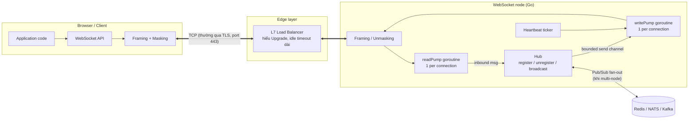
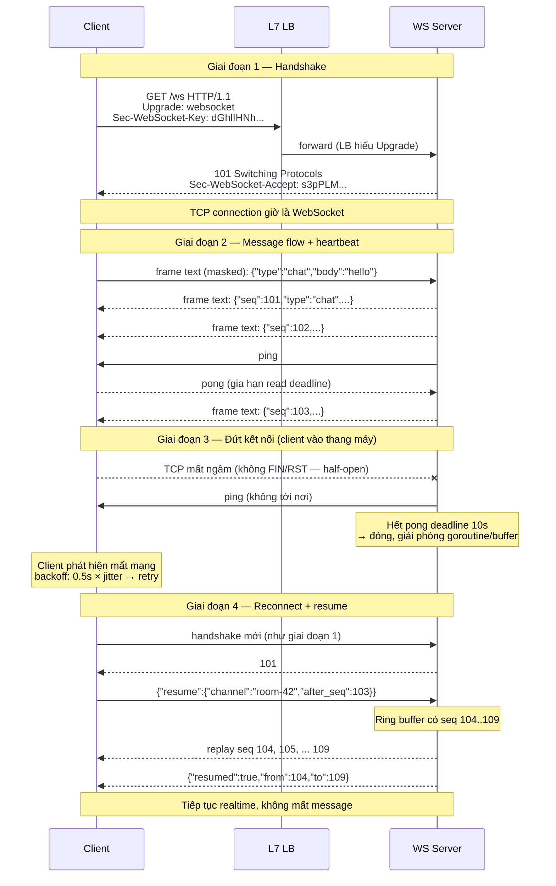
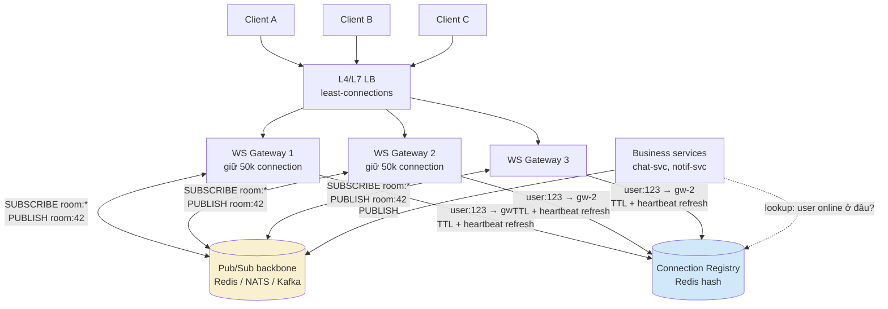

+++
title = "Chương 6: WebSocket — Kênh song công cho Realtime"
date = "2026-02-22T12:00:00+07:00"
draft = false
tags = ["backend", "communication", "api", "architecture"]
series = ["Backend Communication Architecture"]
+++

[← Chương trước](/series/backend-communication-architect/05-grpc/) | Mục lục | [Chương sau →](/series/backend-communication-architect/07-sse/)

---

## 1. Problem Statement

Bạn đang xây một collaboration app: chat nhóm, cursor tracking, comment realtime. Yêu cầu nghiệp vụ rất rõ ràng: khi user A gõ một tin nhắn, user B phải thấy nó trong vòng dưới 200ms; đồng thời client của B cũng liên tục gửi trạng thái của chính nó lên server (typing indicator, cursor position). Nghĩa là dữ liệu chảy **cả hai chiều, liên tục, với tần suất cao và độ trễ thấp**.

HTTP truyền thống được thiết kế theo mô hình request/response: client hỏi, server trả lời, kết nối coi như xong việc. Server **không có cách nào chủ động đẩy dữ liệu** xuống client. Giải pháp ngây thơ nhất là polling: client hỏi "có gì mới không?" mỗi 2 giây.

Hãy làm phép tính cụ thể với 10.000 client online:

```
10.000 client × 1 request / 2s = 5.000 request/giây

Mỗi request/response HTTP/1.1 (headers + TLS record overhead):
  - Request:  ~700 bytes (method, path, cookies, auth token, headers)
  - Response: ~300 bytes (headers) + body

→ Băng thông tối thiểu: 5.000 × 1KB ≈ 5 MB/s ≈ 40 Mbps
→ CPU: 5.000 lần parse HTTP header, check auth, query "có gì mới?" mỗi giây
```

Vấn đề nằm ở chỗ: trong một hệ thống chat điển hình, **trên 99% các poll trả về rỗng** — không có tin nhắn mới. Bạn đang đốt 40 Mbps băng thông và hàng nghìn query/giây chỉ để nhận về câu trả lời "chưa có gì". Tệ hơn, độ trễ trung bình để nhận một tin nhắn là *polling interval / 2* = 1 giây — không đạt yêu cầu 200ms. Giảm interval xuống 200ms? Nhân tải lên 10 lần: 50.000 req/s.

Long polling giảm được số request rỗng nhưng vẫn phải re-establish request sau mỗi event, vẫn mang đầy đủ header overhead, và chiều client → server vẫn cần một kênh riêng.

Bài toán kỹ thuật rút gọn: **cần một kết nối bền vững (persistent), song công (full-duplex), overhead per-message tối thiểu, mà server có thể push bất kỳ lúc nào**. Đó chính xác là những gì WebSocket (RFC 6455) giải quyết.

## 2. Tại sao WebSocket tồn tại

Từ first principles: TCP đã là một kênh song công, bền vững, đáng tin cậy. Vậy tại sao không dùng thẳng raw TCP từ browser?

1. **Browser sandbox không cho phép mở raw TCP socket** — vì lý do an ninh (một trang web bất kỳ có thể quét mạng nội bộ, giả làm SMTP client để gửi spam, tấn công các dịch vụ không được thiết kế cho traffic từ Internet).
2. **Hạ tầng Internet được xây quanh HTTP**: firewall doanh nghiệp thường chỉ mở port 80/443, proxy và load balancer hiểu HTTP. Một giao thức mới trên port lạ sẽ bị chặn ở phần lớn mạng doanh nghiệp.

WebSocket là câu trả lời cho cả hai ràng buộc: **bắt đầu như một HTTP request (đi lọt qua firewall, proxy, port 443), rồi "nâng cấp" kết nối TCP bên dưới thành một kênh song công với framing protocol riêng, tối giản**. Sau handshake, mỗi message chỉ tốn 2–14 bytes header thay vì hàng trăm bytes HTTP header.

So sánh overhead per-message:

| | HTTP/1.1 polling | WebSocket frame |
|---|---|---|
| Header per message | 300–900 bytes | 2–14 bytes |
| Thiết lập kết nối | mỗi request (hoặc keep-alive nhưng vẫn full header) | một lần duy nhất |
| Server push | không (phải chờ client hỏi) | bất kỳ lúc nào |
| Latency nhận event | ~interval/2 | ~RTT một chiều |

Cái giá phải trả — và đây là chủ đề xuyên suốt chương này — là **stateful connection**: server giờ phải "nhớ" hàng chục nghìn kết nối sống, và mọi bài toán vận hành (load balancing, deploy, scaling, failure recovery) đều trở nên khó hơn so với HTTP stateless. WebSocket không miễn phí; nó chuyển chi phí từ băng thông/latency sang độ phức tạp vận hành.

## 3. Internal Architecture

### 3.1 Handshake: HTTP Upgrade

WebSocket khởi đầu bằng một HTTP GET request đặc biệt:

```http
GET /ws/chat HTTP/1.1
Host: chat.example.com
Upgrade: websocket
Connection: Upgrade
Sec-WebSocket-Key: dGhlIHNhbXBsZSBub25jZQ==
Sec-WebSocket-Version: 13
Sec-WebSocket-Protocol: chat.v2, chat.v1
Origin: https://app.example.com
```

Server đồng ý bằng response `101 Switching Protocols`:

```http
HTTP/1.1 101 Switching Protocols
Upgrade: websocket
Connection: Upgrade
Sec-WebSocket-Accept: s3pPLMBiTxaQ9kYGzzhZRbK+xOo=
Sec-WebSocket-Protocol: chat.v2
```

Sau dòng response này, **kết nối TCP không còn là HTTP nữa** — cả hai phía chuyển sang trao đổi WebSocket frame trên chính TCP connection đó.

**Vì sao tồn tại `Sec-WebSocket-Key` / `Sec-WebSocket-Accept`?** Đây không phải cơ chế bảo mật (key gửi plaintext, thuật toán công khai). Nó tồn tại để chống hai lỗi hạ tầng:

- **Chống proxy/cache trả lời nhầm**: một cache hoặc proxy cũ không hiểu WebSocket có thể trả về một response 101 được cache từ trước, hoặc một server không phải WebSocket server có thể vô tình trả 101. Client sinh 16 bytes ngẫu nhiên (base64), server phải nối chuỗi đó với GUID cố định `258EAFA5-E914-47DA-95CA-C5AB0DC85B11`, SHA-1, rồi base64 trả lại. Chỉ một server *thực sự hiểu RFC 6455 và thực sự xử lý request này* mới trả đúng `Sec-WebSocket-Accept`. Nếu giá trị sai, client bắt buộc đóng kết nối.
- **Prefix `Sec-`**: browser cấm JavaScript tự set các header bắt đầu bằng `Sec-`, đảm bảo handshake chỉ có thể do chính browser thực hiện qua WebSocket API — script độc không thể giả mạo handshake bằng `fetch()`/`XMLHttpRequest`.

**Subprotocol negotiation** (`Sec-WebSocket-Protocol`): WebSocket chỉ định nghĩa framing, không định nghĩa ngữ nghĩa message. Client liệt kê các application protocol nó hiểu (`chat.v2, chat.v1`), server chọn một và echo lại. Đây là cơ chế versioning chính thống — dùng nó thay vì nhét version vào URL hoặc message đầu tiên, vì client có thể fail-fast ngay tại handshake nếu server không hỗ trợ version nào.

Lưu ý vận hành: trên HTTP/2, cơ chế Upgrade không tồn tại; RFC 8441 định nghĩa Extended CONNECT để chạy WebSocket trên một HTTP/2 stream, nhưng hỗ trợ trong hạ tầng (LB, proxy, thư viện) chưa đồng đều. Thực tế phổ biến năm 2026 vẫn là WebSocket trên HTTP/1.1 + TLS (wss://), mỗi kết nối chiếm trọn một TCP connection.

### 3.2 Frame structure

Sau handshake, mọi dữ liệu được đóng gói thành frame:

```
 0                   1                   2                   3
 0 1 2 3 4 5 6 7 8 9 0 1 2 3 4 5 6 7 8 9 0 1 2 3 4 5 6 7 8 9 0 1
+-+-+-+-+-------+-+-------------+-------------------------------+
|F|R|R|R| opcode|M| Payload len |    Extended payload length    |
|I|S|S|S|  (4)  |A|     (7)     |         (16/64 bits)          |
|N|V|V|V|       |S|             |  (nếu payload len = 126/127)  |
| |1|2|3|       |K|             |                               |
+-+-+-+-+-------+-+-------------+-------------------------------+
|     Masking-key (32 bits, chỉ có ở frame từ client)           |
+---------------------------------------------------------------+
|                     Payload Data ...                          |
+---------------------------------------------------------------+
```

Các thành phần quan trọng:

- **FIN bit**: đánh dấu frame cuối cùng của một message. Một message lớn có thể bị **fragment** thành nhiều frame: frame đầu mang opcode thật (text/binary), các frame tiếp theo mang opcode `0x0` (continuation), frame cuối set FIN=1. Fragmentation cho phép server bắt đầu gửi khi chưa biết tổng độ dài, và cho phép chen control frame vào giữa một message lớn.
- **Opcode**: `0x1` text (UTF-8, bắt buộc valid), `0x2` binary, `0x8` close, `0x9` ping, `0xA` pong, `0x0` continuation.
- **Control frame** (close/ping/pong): payload tối đa 125 bytes, **không được fragment**, và được phép chen vào giữa các fragment của data message — đây là lý do heartbeat vẫn hoạt động khi đang truyền file lớn.
- **Close frame**: mang status code 2 bytes (1000 normal, 1001 going away, 1008 policy violation, 1011 internal error...). Close handshake là hai chiều: bên nhận close frame phải echo lại close frame rồi mới đóng TCP — giúp phân biệt "đóng chủ động, sạch sẽ" với "TCP đứt đột ngột".

**Masking — vì sao client BẮT BUỘC mask, server BẮT BUỘC không mask?** Đây là quyết định thiết kế thú vị nhất của RFC 6455, sinh ra từ một tấn công thực tế: **cache poisoning lên transparent proxy cũ**. Kịch bản tấn công (được chứng minh trong paper "Talking to Yourself for Fun and Profit", Huang et al. 2011):

1. Kẻ tấn công dụ nạn nhân mở trang web chứa script mở WebSocket tới server của kẻ tấn công.
2. Script gửi qua WebSocket một payload *trông giống hệt* một HTTP request: `GET http://target-site.com/app.js HTTP/1.1 ...`.
3. Một transparent proxy cũ đứng giữa, không hiểu WebSocket framing, nhìn vào byte stream và **tưởng đó là một HTTP request mới trên keep-alive connection**.
4. Server của kẻ tấn công trả về "response" chứa JavaScript độc. Proxy cache response đó dưới key `target-site.com/app.js`.
5. Mọi user sau proxy đó khi tải `target-site.com/app.js` sẽ nhận mã độc.

Masking phá tấn công này tận gốc: client XOR toàn bộ payload với 4 bytes ngẫu nhiên (mới cho từng frame). Kẻ tấn công **không thể kiểm soát chuỗi byte xuất hiện trên đường truyền**, nên không thể "vẽ" một HTTP request giả trong byte stream. Server không cần mask vì server không phải là bên bị script không tin cậy điều khiển. Chi phí: một vòng XOR trên mỗi byte gửi từ client — không đáng kể trên CPU hiện đại (các thư viện tốt dùng XOR theo word 64-bit, SIMD).

### 3.3 Data Flow / Control Flow / Network Flow



- **Data flow**: application message → serialize (JSON/protobuf — WebSocket không quan tâm, nó chỉ chở bytes) → frame (kèm mask nếu là client) → TCP → TLS record → network. Chiều ngược lại tương tự.
- **Control flow**: ping/pong/close chạy chen kẽ trong cùng stream, được thư viện xử lý ở tầng framing, thường không lộ lên application (trừ khi bạn cần hook).
- **Serialization**: WebSocket là transport thuần. Text frame cho JSON, binary frame cho protobuf/MessagePack. Với hệ thống throughput cao, binary + protobuf tiết kiệm 30–60% payload so với JSON và bỏ được chi phí UTF-8 validation của text frame.
- **Connection management**: mỗi connection là một TCP socket sống hàng giờ. Server phải quản lý lifecycle: đăng ký khi handshake xong, hủy đăng ký khi đóng, phát hiện chết ngầm (mục 3.4), giới hạn tài nguyên per-connection (mục 3.6).

### 3.4 Heartbeat: ping/pong và bài toán half-open TCP

Câu hỏi first-principles: TCP là giao thức "reliable", tại sao phải tự phát hiện kết nối chết?

Vì **TCP chỉ phát hiện lỗi khi có dữ liệu đang gửi**. Một TCP connection ở trạng thái idle là hai đầu *im lặng chờ nhau* — không có bất kỳ gói tin nào trên đường truyền. Nếu client mất điện, rút cáp mạng, đổi từ WiFi sang 4G, hoặc một NAT/firewall ở giữa xóa entry vì idle quá lâu (NAT timeout phổ biến: 30–300 giây), **server không nhận được FIN hay RST nào cả**. Kết nối trở thành **half-open**: server vẫn giữ socket, vẫn giữ goroutine, vẫn giữ buffer — cho một client đã biến mất. TCP keepalive của kernel tồn tại nhưng mặc định là 2 giờ (Linux `tcp_keepalive_time`), quá chậm để hữu dụng, và không đi xuyên qua được application-level proxy.

WebSocket ping/pong giải quyết ở application layer: một bên gửi ping, bên kia **bắt buộc** (theo RFC) trả pong sớm nhất có thể. Nếu không nhận pong trong deadline → coi connection đã chết, đóng và giải phóng tài nguyên.

Ba quyết định thiết kế:

1. **Ai ping ai?** Server nên là bên ping. Lý do: (a) server là bên trả giá tài nguyên cho connection chết — nó có động cơ dọn dẹp; (b) browser WebSocket API **không expose ping/pong** cho JavaScript, client web không thể chủ động ping ở protocol level (chỉ có thể gửi application-level heartbeat message); (c) traffic từ server cũng giúp giữ NAT entry sống. Client có thể thêm một lớp phát hiện riêng (nếu không nhận gì từ server sau X giây → tự reconnect).
2. **Interval bao nhiêu?** Trade-off giữa tốc độ phát hiện và chi phí. Quá ngắn (5s) → với 100k connection là 20k ping/s vô ích và tốn pin thiết bị di động. Quá dài (5 phút) → NAT timeout cắt trước, tài nguyên bị giữ lâu. Điểm cân bằng phổ biến: **ping mỗi 20–30 giây, pong deadline 10 giây**. Con số 20–30s được chọn vì thấp hơn NAT UDP/TCP timeout phổ biến nhất (60s) và idle timeout mặc định của nhiều LB (60s — AWS ALB mặc định 60s).
3. **Deadline đo thế nào?** Pattern chuẩn trong Go: mỗi lần nhận pong (hoặc bất kỳ data nào) → gia hạn read deadline. Nếu deadline hết → read trả lỗi → readPump thoát → dọn dẹp. Không cần timer riêng cho từng connection.

### 3.5 Reconnect strategy và message gap recovery

Kết nối WebSocket **chắc chắn sẽ đứt** — mobile network chập chờn, LB deploy, server restart. Thiết kế phải coi reconnect là chuyện thường ngày, không phải exception.

**Exponential backoff + jitter phía client:**

```
delay = min(cap, base × 2^attempt) × random(0.5, 1.5)
ví dụ: base=500ms, cap=30s → 0.5s, 1s, 2s, 4s, 8s, 16s, 30s, 30s...
```

Jitter là bắt buộc, không phải tùy chọn. Khi server restart, 50.000 client mất kết nối **cùng một thời điểm**. Không có jitter, tất cả reconnect tại đúng các mốc 0.5s, 1s, 2s... tạo thành các đợt sóng thundering herd đánh sập server vừa mới dậy. Jitter trải đều các đợt sóng đó thành dòng chảy phẳng.

**Resume state — bài toán khó hơn reconnect**: kết nối lại thành công không có nghĩa là không mất dữ liệu. Trong khoảng 10 giây offline, có thể đã có 50 tin nhắn được broadcast. Giải pháp chuẩn:

1. Server đánh **sequence number tăng đơn điệu** cho mọi message trên mỗi kênh (per-room hoặc per-user stream).
2. Server giữ một **replay buffer** (ring buffer) N message gần nhất hoặc M giây gần nhất cho mỗi kênh.
3. Client nhớ `lastSeq` đã nhận. Khi reconnect, gửi `{resume: {channel: "room-42", after_seq: 1337}}`.
4. Server replay các message `seq > 1337` từ buffer. Nếu gap lớn hơn buffer (client offline quá lâu) → server trả `resume_failed`, client phải **full re-sync** qua REST API (fetch snapshot) rồi mới subscribe tiếp.

Đường "resume thất bại → full sync" là bắt buộc phải thiết kế từ đầu. Hệ thống chỉ có replay mà không có full sync sẽ gặp client desync vĩnh viễn khi buffer bị tràn.



### 3.6 Backpressure: khi client chậm hơn server

Đây là failure mode âm thầm nhất của mọi hệ thống push. Server broadcast 500 message/s vào một room. Một client trên 3G chỉ nhận nổi 50 message/s. Dữ liệu thừa đi đâu?

Chuỗi buffer sẽ đầy dần theo thứ tự: TCP send buffer của kernel phía server (mặc định ~256KB) → write bị block → buffer application phía server phình → **memory server tăng vô hạn vì một client chậm**. Nếu bạn dùng một goroutine ghi trực tiếp không buffer, goroutine broadcast bị block — **một client chậm làm nghẽn message cho tất cả client khác**.

Chiến lược xử lý — chọn theo loại message:

| Chiến lược | Cơ chế | Phù hợp với |
|---|---|---|
| **Bounded buffer + disconnect** | Send channel có giới hạn (vd 256). Đầy → đóng connection, client tự reconnect + resume | Message không được phép mất (chat, transaction) — vì reconnect+resume sẽ lấy lại từ replay buffer |
| **Bounded buffer + drop theo loại** | Đầy → drop message loại "ephemeral" (cursor position, typing indicator, giá tick), giữ message quan trọng | Hệ thống trộn cả hai loại traffic |
| **Conflation** | Giữ chỉ giá trị mới nhất per key (giá BTC mới nhất thay vì 100 tick cũ) | Market data, telemetry — nơi giá trị cũ vô nghĩa khi có giá trị mới |

Nguyên tắc thiết kế: **buffer phải bounded, và hành vi khi đầy phải là quyết định có chủ đích**, không phải hệ quả ngẫu nhiên của OOM. Slow consumer detection: đo độ đầy của send channel; vượt ngưỡng (vd 80% trong 30s liên tục) → log + metric + hành động. Trong Go, `select` với `default` trên channel đầy cho bạn cơ chế detect-and-drop chỉ vài dòng (xem code mục 5).

### 3.7 Scaling: bài toán khó nhất của WebSocket

HTTP stateless scale bằng cách thêm node sau LB — request nào vào node nào cũng được. WebSocket phá vỡ giả định đó: **connection sống trên đúng một node cụ thể**. User A nối vào node 1, user B nối vào node 2; khi A gửi tin cho B, node 1 phải biết cách đưa message sang node 2.

**Bước 1 — Sticky session (mức tối thiểu):** L7 LB phải giữ handshake và toàn bộ frame trên cùng backend. Với WebSocket, điều này tự nhiên đúng ở mức TCP connection (một connection chỉ tới một backend). Sticky session (cookie-based hoặc IP hash) chỉ thực sự cần khi bạn muốn **reconnect quay lại đúng node cũ** (để tận dụng state còn trên node đó). IP hash mong manh (mobile client đổi IP liên tục, nhiều user sau cùng NAT dồn vào một node); cookie-based ổn hơn. Nhưng sticky session không giải quyết cross-node messaging — nó chỉ trì hoãn bài toán.

**Bước 2 — Connection gateway + Pub/Sub backbone (kiến trúc chuẩn):**



- **Gateway layer**: các node chuyên trách *chỉ* giữ connection, auth, heartbeat, backpressure — không chứa business logic. Business service phía sau vẫn stateless. Tách như vậy để hai layer scale độc lập: gateway scale theo số connection, service scale theo throughput xử lý.
- **Pub/Sub backbone**: mỗi gateway subscribe các topic tương ứng với room/user mà nó đang giữ connection. Message publish một lần, backbone fan-out tới mọi gateway liên quan. Redis Pub/Sub đơn giản nhưng at-most-once (gateway rớt subscription là mất message — cần replay buffer bù); NATS nhẹ và nhanh, JetStream thêm persistence; Kafka bền vững + replay tốt nhưng latency và độ phức tạp cao hơn. Chọn theo yêu cầu mất mát dữ liệu, đừng chọn theo trend.
- **Connection registry**: map `user_id → gateway_id` trong Redis (TTL + heartbeat refresh từ gateway). Dùng cho direct message có target cụ thể (đỡ phải broadcast mọi message tới mọi gateway) và cho câu hỏi "user X có online không". Với hệ chỉ có room-based broadcast, subscribe theo topic là đủ, không cần registry.

**Bước 3 — Giới hạn hệ điều hành trên mỗi node:**

| Tài nguyên | Giới hạn mặc định | Cách xử lý |
|---|---|---|
| File descriptor | `ulimit -n` thường 1024 (soft) | Nâng lên 1M: `LimitNOFILE=1048576` trong systemd unit; mỗi connection = 1 fd |
| Memory per connection | Go: 2 goroutine × 8KB stack khởi điểm + read/write buffer (4–8KB mỗi chiều) + TLS record buffer (~30KB nếu terminate TLS tại app) ≈ 20–60KB | Terminate TLS ở LB; giảm buffer size; 100k conn ≈ 2–6GB — tính trước capacity |
| Ephemeral port | Chỉ giới hạn ở phía **client/proxy** đi ra: ~28k port mặc định (`ip_local_port_range`) per (src IP, dst IP, dst port) | Server lắng nghe không bị giới hạn này (định danh connection là 4-tuple). Nếu có reverse proxy đứng giữa, proxy là client → cần nhiều IP nguồn hoặc mở rộng port range |
| Conntrack (nếu qua NAT/iptables) | `nf_conntrack_max` mặc định vài trăm nghìn | Nâng limit hoặc bypass conntrack cho traffic WS |

### 3.8 Graceful deploy: drain connection

Deploy một bản mới của gateway đồng nghĩa cắt hàng chục nghìn connection. Làm ẩu → reconnect storm + user thấy gián đoạn. Quy trình drain có kiểm soát:

1. Node nhận SIGTERM → **ngừng nhận connection mới** (LB health check chuyển fail, hoặc deregister khỏi LB).
2. Gửi close frame với code `1001 Going Away` (hoặc application message `{"type":"reconnect_hint","after_ms":<random>}`) tới từng connection, **rải đều trong drain window** (vd 60–120 giây) thay vì đồng loạt — server chủ động tạo jitter thay vì phó mặc cho client.
3. Client nhận hint → reconnect (LB đưa sang node khác/node mới) → resume bằng sequence number → user không nhận ra gì.
4. Hết drain window → force close phần còn lại → process exit.

Kết hợp với rolling deploy từng node một, tổng lượng reconnect tại mọi thời điểm được giữ dưới ngưỡng an toàn.

## 4. Trade-off Analysis

| Trục | Đánh giá | Phân tích |
|---|---|---|
| **Latency** | Rất tốt | Sau handshake, một message = một frame trên TCP có sẵn: latency ≈ RTT một chiều + serialize. Không có TCP/TLS handshake, không có HTTP header parse per-message. |
| **Bandwidth** | Rất tốt | 2–14 bytes header/frame so với hàng trăm bytes HTTP. permessage-deflate (RFC 7692) nén thêm được nhưng ăn CPU + memory per connection (sliding window ~32KB × 2 chiều) — bật có cân nhắc. |
| **Complexity** | Cao | Phải tự xây: heartbeat, reconnect, resume, backpressure, message protocol, versioning. HTTP cho không tất cả những thứ tương đương (retry, cache, status code). |
| **Scalability** | Khó hơn HTTP đáng kể | Stateful connection → cần gateway layer, Pub/Sub backbone, connection registry, capacity planning theo connection thay vì theo RPS. |
| **DX** | Trung bình | Browser API đơn giản, nhưng debug khó hơn HTTP (không curl được dễ dàng, phải dùng wscat/websocat; trace một message qua nhiều hop cần tự gắn correlation ID). |
| **Operational cost** | Cao | LB phải hỗ trợ Upgrade + idle timeout dài; deploy cần drain; autoscaling theo connection count; monitoring riêng. |
| **Compatibility** | Tốt nhưng có góc khuất | Chạy trên 443/TLS đi lọt hầu hết firewall. Góc khuất: corporate proxy cũ, một số mobile carrier NAT hung hãn; RFC 8441 (WS over HTTP/2) hỗ trợ chưa đều. |
| **Observability** | Phải tự xây | Không có access log per-message tự nhiên. Metrics bắt buộc: connection count, connect/disconnect rate, message in/out rate, send-buffer depth, pong latency, close code distribution. |
| **Security** | Cần chú ý riêng | **Origin check bắt buộc** tại handshake (chống Cross-Site WebSocket Hijacking — WebSocket không bị SOP chặn như fetch, browser gửi kèm cookie!). Auth: token trong query string sẽ lộ vào access log — dùng cookie, hoặc token trong message đầu tiên, hoặc short-lived ticket lấy qua REST trước khi connect. Rate limit per-connection cho inbound message. |

**Bảng benchmark minh họa** (số liệu minh họa, phụ thuộc môi trường — đo lại trên hạ tầng của bạn trước khi quyết định):

*Polling vs WebSocket, 10.000 client, mỗi client nhận trung bình 1 message/30s:*

| Chỉ số | HTTP polling 2s | Long polling | WebSocket |
|---|---|---|---|
| Request hoặc frame/s tại server | 5.000 req/s | ~350 req/s | ~333 frame/s |
| Bandwidth (headers + overhead) | ~40 Mbps | ~4 Mbps | ~0,3 Mbps |
| Latency nhận event (median) | ~1.000 ms | ~50 ms | ~15 ms |
| CPU server (relative) | 100% | 15% | 4% |
| Connection đồng thời giữ | ~vài trăm (keep-alive pool) | 10.000 | 10.000 |

*Chi phí per-connection phía server Go (gorilla/websocket, TLS terminate ở LB, buffer 4KB):*

| Số connection | Goroutines | RSS memory | Ghi chú |
|---|---|---|---|
| 10.000 | ~20.000 (+ runtime) | ~450 MB (~45KB/conn) | 2 goroutine/conn (read+write pump) |
| 100.000 | ~200.000 | ~4,2 GB (~42KB/conn) | goroutine 8KB stack là chấp nhận được; GC pause vẫn <5ms |
| 500.000 | ~1.000.000 | ~21 GB | Cân nhắc epoll-based (gobwas/ws + netpoll) để bỏ goroutine-per-conn nếu connection đa số idle |

## 5. Production Implementation (Golang)

**Chọn thư viện — và vì sao:** ví dụ dưới dùng `github.com/coder/websocket` (tiền thân là `nhooyr.io/websocket`). Lý do chọn thay vì `gorilla/websocket`: (1) API nhỏ hơn và **context-aware toàn diện** — mọi Read/Write nhận `context.Context`, cắt được cả họ bug quên set deadline (nguyên nhân số một của goroutine leak, xem mục 6); (2) gorilla từng bị archive cuối 2022 — sau đó đã được cộng đồng tiếp quản và duy trì lại, và vẫn là lựa chọn hợp lệ, chín muồi, nhiều tài liệu — nhưng sự cố đó nhắc ta đánh giá cả *governance* của dependency chứ không chỉ code; (3) coder/websocket hỗ trợ wasm và có concurrency model đơn giản hơn (một writer tại một thời điểm được thư viện tự serialize cho control frame). Nếu team bạn đã có kinh nghiệm gorilla và cần permessage-deflate tinh chỉnh sâu, gorilla vẫn là lựa chọn tốt — điểm quan trọng là các pattern dưới đây (hub, pump, bounded buffer, drain) **độc lập với thư viện**.

```go
// Package chathub — WebSocket hub production-grade.
//
// Các quyết định thiết kế chính được chú thích tại chỗ.
package chathub

import (
	"context"
	"errors"
	"log/slog"
	"net/http"
	"sync"
	"time"

	"github.com/coder/websocket"
)

// ---------------------------------------------------------------------------
// Message với sequence number — nền tảng cho resume sau reconnect.
// ---------------------------------------------------------------------------

type Message struct {
	Seq       uint64 // gán bởi Hub, tăng đơn điệu per-hub (per-room trong bản multi-room)
	Kind      string // "chat" | "presence" | "cursor" ...
	Payload   []byte // đã serialize sẵn (JSON/protobuf) — hub không parse
	Ephemeral bool   // true → được phép drop khi client chậm (cursor, typing...)
}

// ---------------------------------------------------------------------------
// Client — một connection.
// ---------------------------------------------------------------------------

const (
	// sendBuf = 256: đủ hấp thụ burst ngắn (~256 message), đủ nhỏ để
	// một client chậm chỉ giữ tối đa vài trăm KB memory. Bounded buffer
	// là quyết định CHỦ ĐÍCH: hành vi khi đầy được định nghĩa rõ (drop
	// ephemeral / disconnect), thay vì để memory phình vô hạn.
	sendBuf = 256

	pingInterval = 25 * time.Second // < NAT/LB idle timeout phổ biến (60s)
	pongTimeout  = 10 * time.Second
	writeTimeout = 5 * time.Second // client không nhận nổi 1 frame trong 5s → chết
)

type Client struct {
	conn   *websocket.Conn
	hub    *Hub
	send   chan Message // bounded — trái tim của backpressure
	seq    uint64       // lastSeq client đã xác nhận (từ resume request)
	logger *slog.Logger

	closeOnce sync.Once
	done      chan struct{}
}

// ---------------------------------------------------------------------------
// Hub — registry trung tâm. Single goroutine sở hữu map clients
// (không cần mutex cho map: mọi mutation đi qua channel — mô hình
// "share memory by communicating").
// ---------------------------------------------------------------------------

type Hub struct {
	register   chan *Client
	unregister chan *Client
	broadcast  chan Message

	clients map[*Client]struct{}

	// Ring buffer replay: giữ replayN message gần nhất để phục vụ resume.
	replay  []Message
	replayN int
	nextSeq uint64

	logger *slog.Logger
}

func NewHub(logger *slog.Logger) *Hub {
	return &Hub{
		register:   make(chan *Client),
		unregister: make(chan *Client),
		// broadcast buffered: publisher (business logic) không bị block
		// bởi một vòng lặp hub đang bận — nhưng vẫn bounded.
		broadcast: make(chan Message, 1024),
		clients:   make(map[*Client]struct{}),
		replayN:   4096, // ~vài phút traffic; quá khứ xa hơn → client full re-sync
		logger:    logger,
	}
}

// Run là event loop duy nhất của hub. Chạy trong 1 goroutine.
func (h *Hub) Run(ctx context.Context) {
	for {
		select {
		case <-ctx.Done():
			return

		case c := <-h.register:
			h.clients[c] = struct{}{}
			// Replay các message client bị lỡ (resume theo sequence number).
			h.replayTo(c, c.seq)

		case c := <-h.unregister:
			if _, ok := h.clients[c]; ok {
				delete(h.clients, c)
				c.close() // idempotent nhờ sync.Once
			}

		case m := <-h.broadcast:
			h.nextSeq++
			m.Seq = h.nextSeq
			h.appendReplay(m)

			for c := range h.clients {
				select {
				case c.send <- m:
					// OK — writePump sẽ ghi ra socket.
				default:
					// Send buffer ĐẦY → client là slow consumer.
					if m.Ephemeral {
						// Drop có chủ đích: cursor/typing cũ vô giá trị.
						slowConsumerDrops.Inc() // metric Prometheus
						continue
					}
					// Message quan trọng không được xếp hàng → disconnect.
					// Client sẽ reconnect + resume từ replay buffer,
					// KHÔNG mất dữ liệu. Đây là lý do disconnect an toàn
					// hơn block: block một client = block broadcast loop
					// = nghẽn TOÀN BỘ hub.
					h.logger.Warn("slow consumer disconnected", "seq", m.Seq)
					delete(h.clients, c)
					c.close()
				}
			}
		}
	}
}

func (h *Hub) appendReplay(m Message) {
	if len(h.replay) >= h.replayN {
		h.replay = h.replay[1:] // đơn giản hóa; production dùng ring buffer index
	}
	h.replay = append(h.replay, m)
}

func (h *Hub) replayTo(c *Client, afterSeq uint64) {
	for _, m := range h.replay {
		if m.Seq > afterSeq {
			select {
			case c.send <- m:
			default:
				return // buffer đầy ngay khi replay → để client tự retry
			}
		}
	}
}

// ---------------------------------------------------------------------------
// HTTP handler — handshake, auth, khởi động pumps.
// ---------------------------------------------------------------------------

func (h *Hub) ServeWS(w http.ResponseWriter, r *http.Request) {
	// Auth TRƯỚC khi upgrade — từ chối bằng HTTP status rẻ hơn nhiều
	// so với upgrade xong rồi close.
	userID, err := authenticate(r) // cookie hoặc short-lived ticket
	if err != nil {
		http.Error(w, "unauthorized", http.StatusUnauthorized)
		return
	}

	conn, err := websocket.Accept(w, r, &websocket.AcceptOptions{
		// Origin check: chống Cross-Site WebSocket Hijacking.
		// KHÔNG BAO GIỜ dùng InsecureSkipVerify trong production.
		OriginPatterns: []string{"app.example.com"},
		Subprotocols:   []string{"chat.v2", "chat.v1"},
	})
	if err != nil {
		return // Accept đã tự trả HTTP error
	}

	c := &Client{
		conn:   conn,
		hub:    h,
		send:   make(chan Message, sendBuf),
		seq:    parseResumeSeq(r), // ?after_seq=... hoặc message đầu tiên
		done:   make(chan struct{}),
		logger: h.logger.With("user", userID),
	}

	h.register <- c

	// Read pump và write pump tách goroutine — vì sao:
	// 1. Read phải luôn chạy để nhận close frame + pong (thư viện xử lý
	//    control frame bên trong Read loop).
	// 2. Write có nhịp riêng (drain send channel + ticker heartbeat).
	// 3. Gộp một goroutine = hoặc bỏ lỡ control frame, hoặc block write.
	go c.writePump()
	c.readPump() // chạy trên goroutine của HTTP handler — tiết kiệm 1 goroutine
}

// ---------------------------------------------------------------------------
// readPump — nhận message từ client, phát hiện dead connection.
// ---------------------------------------------------------------------------

func (c *Client) readPump() {
	defer func() {
		c.hub.unregister <- c
	}()

	for {
		// Context có timeout = read deadline. Nếu client im lặng và
		// không trả pong, vòng ping trong writePump sẽ fail trước
		// và close connection → Read trả lỗi → thoát sạch.
		ctx, cancel := context.WithTimeout(context.Background(),
			pingInterval+pongTimeout)
		typ, data, err := c.conn.Read(ctx)
		cancel()
		if err != nil {
			return // close frame, timeout, hay TCP đứt — đều về đây
		}
		if typ != websocket.MessageText {
			continue
		}
		// Rate limit inbound per-connection ở đây (token bucket) trước
		// khi đẩy vào business logic — client bị compromise không thể
		// flood hub.
		c.hub.handleInbound(c, data)
	}
}

// ---------------------------------------------------------------------------
// writePump — drain send channel + heartbeat. MỌI write đi qua đây
// (single writer per connection — không cần mutex quanh conn).
// ---------------------------------------------------------------------------

func (c *Client) writePump() {
	ticker := time.NewTicker(pingInterval)
	defer ticker.Stop()

	for {
		select {
		case <-c.done:
			return

		case m, ok := <-c.send:
			if !ok {
				return
			}
			// writeTimeout là tuyến phòng thủ cuối cùng chống goroutine
			// leak: connection chết ngầm → Write treo tối đa 5s rồi lỗi.
			ctx, cancel := context.WithTimeout(context.Background(), writeTimeout)
			err := c.conn.Write(ctx, websocket.MessageText, encodeFrame(m))
			cancel()
			if err != nil {
				c.hub.unregister <- c
				return
			}

		case <-ticker.C:
			// Server là bên ping (browser JS không ping được ở protocol
			// level). Ping() của coder/websocket CHỜ pong hoặc ctx hết hạn
			// — đây chính là dead-connection detector.
			ctx, cancel := context.WithTimeout(context.Background(), pongTimeout)
			err := c.conn.Ping(ctx)
			cancel()
			if err != nil {
				c.logger.Info("pong timeout, closing half-open connection")
				c.hub.unregister <- c
				return
			}
		}
	}
}

func (c *Client) close() {
	c.closeOnce.Do(func() {
		close(c.done)
		// 1001 Going Away nếu drain; StatusNormalClosure nếu client chủ động.
		c.conn.Close(websocket.StatusGoingAway, "")
	})
}

// ---------------------------------------------------------------------------
// Graceful shutdown / drain — gọi khi nhận SIGTERM.
// ---------------------------------------------------------------------------

// Drain rải close hint đều trong window để tránh reconnect storm:
// server CHỦ ĐỘNG tạo jitter thay vì phó mặc cho client.
func (h *Hub) Drain(window time.Duration) {
	snapshot := make([]*Client, 0, len(h.clients))
	for c := range h.clients { // production: lấy snapshot qua hub loop
		snapshot = append(snapshot, c)
	}
	if len(snapshot) == 0 {
		return
	}
	interval := window / time.Duration(len(snapshot))
	for _, c := range snapshot {
		c.close() // gửi close frame 1001 → client reconnect sang node khác
		time.Sleep(interval)
	}
}
```

**Phía client — reconnect với exponential backoff + jitter và resume.** Với client Go (service nội bộ, CLI, mobile backend-for-frontend), vòng đời reconnect trông như sau; client browser (JavaScript) cùng cấu trúc logic:

```go
// RunClient duy trì connection vĩnh viễn: connect → consume → đứt →
// backoff có jitter → reconnect kèm after_seq để resume.
func RunClient(ctx context.Context, url string, handle func(Message)) {
	var lastSeq uint64
	attempt := 0

	for ctx.Err() == nil {
		// --- Backoff + full jitter (AWS Architecture Blog pattern) ---
		// delay = random(0, min(cap, base × 2^attempt)):
		// full jitter trải reconnect đều nhất, chống thundering herd
		// tốt hơn equal jitter khi hàng chục nghìn client cùng rớt.
		if attempt > 0 {
			base, cap := 500*time.Millisecond, 30*time.Second
			d := time.Duration(rand.Int64N(int64(min(cap, base<<attempt))))
			select {
			case <-time.After(d):
			case <-ctx.Done():
				return
			}
		}
		attempt++

		u := fmt.Sprintf("%s?after_seq=%d", url, lastSeq)
		conn, _, err := websocket.Dial(ctx, u, nil)
		if err != nil {
			continue // lỗi mạng/DNS/handshake → vòng backoff tiếp
		}

		// Kết nối thành công VÀ nhận được message đầu tiên mới reset
		// attempt — reset ngay khi dial xong sẽ biến "connect được
		// nhưng bị đá ngay" (server quá tải) thành hot loop.
		firstMsg := true
		for {
			readCtx, cancel := context.WithTimeout(ctx, 60*time.Second)
			_, data, err := conn.Read(readCtx)
			cancel()
			if err != nil {
				conn.Close(websocket.StatusGoingAway, "")
				break // ra vòng ngoài → backoff → reconnect + resume
			}
			var m Message
			if json.Unmarshal(data, &m) != nil {
				continue
			}
			if firstMsg {
				attempt, firstMsg = 0, false
			}
			// Gap detection: server replay phải liền mạch; nếu seq
			// nhảy cóc vượt quá replay buffer, server đã báo
			// resume_failed → client gọi full re-sync qua REST.
			lastSeq = m.Seq
			handle(m)
		}
	}
}
```

Hai quyết định đáng chú ý trong client: (1) **chỉ reset attempt sau khi nhận message đầu tiên**, không phải sau khi dial thành công — chống hot loop khi server accept rồi đá ngay do quá tải; (2) `lastSeq` chỉ cập nhật **sau khi `handle` xử lý xong** — nếu cập nhật trước và process crash giữa chừng, message đó mất vĩnh viễn (at-most-once); cập nhật sau cho at-least-once, và `handle` cần idempotent theo seq.

**Những điểm production-grade cần bổ sung ngoài khung code trên** (bỏ khỏi listing cho gọn nhưng bắt buộc trong hệ thật):

- **Metrics** (Prometheus): `ws_connections` (gauge), `ws_connects_total` / `ws_disconnects_total` phân theo close code, `ws_messages_{in,out}_total`, `ws_send_buffer_depth` (histogram — chỉ báo sớm nhất của slow consumer), `ws_slow_consumer_drops_total`, `ws_pong_latency_seconds`. Alert đáng giá nhất: disconnect rate tăng đột biến (deploy hỏng, LB đổi config) và send buffer depth p99 tiến gần capacity.
- **Admission control**: limit tổng connection per node (từ chối bằng HTTP 503 *trước khi* upgrade khi chạm ngưỡng — để LB đưa client sang node khác) và limit per-user (một user mở 500 tab hoặc một token bị leak không được ăn hết tài nguyên).
- **Max message size inbound** (`SetReadLimit` hoặc tương đương): chống client gửi frame khai báo payload khổng lồ.
- **Structured logging** với connection ID sinh lúc handshake, gắn vào mọi log line và trả về client (để support đối chiếu hai phía).
- **Capacity planning**: đo memory-per-connection thực tế của workload của bạn (buffer size + TLS + payload điển hình), nhân với connection đỉnh dự kiến × hệ số an toàn 2 — và load test bằng connection thật (vd `tcpkali`, custom Go client), không phải bằng RPS.

## 6. Anti-patterns và Failure Examples

### 6.1 Failure example: goroutine leak do write không timeout

Sự cố kinh điển, gặp ở gần như mọi team lần đầu vận hành WebSocket ở quy mô lớn. Triệu chứng: memory của gateway tăng đều đặn 24/7, `runtime.NumGoroutine()` tăng không giảm, sau 4–5 ngày node OOM. Restart thì hết — rồi lặp lại.

Code gây lỗi:

```go
// BUG: write không deadline vào connection half-open
func (c *Client) writePump() {
	for m := range c.send {
		// Client rút mạng đột ngột → không FIN/RST → TCP send buffer
		// của kernel đầy dần → Write BLOCK VĨNH VIỄN tại đây.
		if err := c.conn.Write(context.Background(), // <-- ctx không timeout!
			websocket.MessageText, m.Payload); err != nil {
			return
		}
	}
}
```

Chuỗi nhân quả: (1) client biến mất không lời từ biệt → half-open TCP; (2) server tiếp tục ghi, kernel buffer (~256KB) hấp thụ được vài trăm message; (3) buffer đầy → syscall write block; (4) `context.Background()` không có deadline → goroutine treo **vĩnh viễn**, giữ theo cả Client struct, send channel đầy message, và TCP socket; (5) hub tiếp tục nhét vào `c.send` → channel đầy → tùy code hub mà hub cũng block theo (thảm họa dây chuyền) hoặc chỉ leak client này. Mỗi client "biến mất" để lại một goroutine + vài trăm KB không bao giờ được thu hồi. Với churn 5.000 mobile client/ngày rơi vào trường hợp này, node chết sau chưa đầy một tuần.

Fix gồm ba lớp phòng thủ (đều có trong code mục 5): **write timeout** (deadline 5s trên mọi Write), **heartbeat** (pong timeout phát hiện connection chết trong ~35s và chủ động close — close làm Write đang block trả lỗi ngay), **bounded send channel với drop/disconnect** (kể cả khi hai lớp trên chậm chân, hub không bao giờ bị block). Bài học first-principles: **mọi thao tác I/O trên network không có deadline là một goroutine leak đang chờ ngày phát nổ** — network không bao giờ hứa sẽ trả lời.

### 6.2 Các anti-pattern khác

- **Dùng WebSocket như REST**: gửi request qua WS rồi tự chờ response bằng correlation ID, tự viết timeout, retry, error mapping — tức là tái phát minh HTTP, tệ hơn bản gốc (mất cache, mất status code chuẩn, mất tooling). WS cho event push; request/response cứ để HTTP làm.
- **Không giới hạn message size inbound**: client độc gửi một frame khai báo payload vài GB; server đọc vào memory → OOM. Luôn set read limit (vd 64KB–1MB tùy nghiệp vụ).
- **Auth token trong query string**: `wss://host/ws?token=eyJ...` — token rơi vào access log của LB, proxy, và server. Dùng cookie (kèm Origin check chống CSWSH), hoặc ticket ngắn hạn dùng một lần lấy qua REST.
- **Broadcast trực tiếp từ business logic tới từng connection** (không qua hub/send channel): mutex quanh map connection + write tuần tự → một client chậm block toàn bộ vòng lặp broadcast.
- **Skip Origin check** vì "để dev cho tiện" rồi lên production: mở toang cửa cho Cross-Site WebSocket Hijacking — trang web độc bất kỳ có thể mở WS tới server của bạn kèm cookie đăng nhập của nạn nhân.
- **Không có kịch bản full re-sync**: chỉ có replay buffer; client offline lâu hơn buffer là desync vĩnh viễn mà không ai phát hiện.

### 6.3 Refactoring example: single-node hub → Redis Pub/Sub backbone

Bối cảnh: hệ thống chat chạy ổn với một node và hub in-memory ở mục 5. Traffic tăng, cần 4 node. Vấn đề: user A (node 1) gửi message vào room 42, nhưng user B của room 42 đang nối vào node 3 — hub in-memory của node 1 không biết B tồn tại.

Thay đổi kiến trúc tối thiểu — **hub không đổi, chỉ đổi nguồn của kênh broadcast**: thay vì business logic publish thẳng vào `hub.broadcast`, mọi publish đi qua Redis; mỗi node subscribe và bơm message nhận được vào hub cục bộ của mình.

```go
// TRƯỚC (single node): business logic → hub trực tiếp
// hub.broadcast <- msg

// SAU (multi-node): mọi node đều publish qua Redis...
func PublishChat(ctx context.Context, rdb *redis.Client, room string, m Message) error {
	payload, _ := json.Marshal(m) // production: protobuf + kèm origin node ID
	return rdb.Publish(ctx, "room:"+room, payload).Err()
}

// ...và mỗi node chạy một subscriber bơm vào hub CỤC BỘ.
func RunBridge(ctx context.Context, rdb *redis.Client, hub *Hub, rooms []string) {
	channels := make([]string, len(rooms))
	for i, r := range rooms {
		channels[i] = "room:" + r
	}
	sub := rdb.Subscribe(ctx, channels...)
	defer sub.Close()

	for {
		msg, err := sub.ReceiveMessage(ctx)
		if err != nil {
			if ctx.Err() != nil {
				return
			}
			// Redis đứt = có thể ĐÃ MẤT message (Pub/Sub là at-most-once).
			// Đánh dấu epoch mới; client sẽ phát hiện gap qua sequence
			// number và tự resume/re-sync. Đây là lý do sequence number
			// thiết kế từ ngày đầu trả cổ tức ở đây.
			time.Sleep(time.Second) // + backoff & resubscribe
			continue
		}
		var m Message
		if err := json.Unmarshal([]byte(msg.Payload), &m); err != nil {
			continue
		}
		select {
		case hub.broadcast <- m:
		default:
			// Hub cục bộ quá tải — metric + quyết định drop có chủ đích,
			// không block subscriber (block = tụt lại so với Redis stream).
			bridgeDrops.Inc()
		}
	}
}
```

Ba hệ quả phải xử lý khi refactor: (1) **sequence number không thể gán per-node nữa** — chuyển sang gán tại publisher qua Redis `INCR room:{id}:seq`, hoặc chuyển hẳn sang Redis Streams/NATS JetStream nơi backbone tự gán ID và có replay bền vững; (2) Redis Pub/Sub là **at-most-once** — replay buffer giờ nên đọc từ một nguồn bền (Redis Streams `XRANGE`) thay vì memory node; (3) subscribe theo pattern `room:*` đơn giản nhưng mọi node nhận mọi message — với fan-out lớn, subscribe động theo danh sách room mà node đang giữ connection (kèm connection registry) để giảm traffic liên node. Điểm mấu chốt của refactoring: vì hub ban đầu được thiết kế quanh một channel `broadcast` duy nhất, việc "cắm" backbone vào là thay một producer — không phải viết lại tầng connection.

## 7. Khi nào KHÔNG nên dùng WebSocket

- **Chỉ cần push một chiều server → client** (dashboard, notification, LLM token streaming): SSE rẻ hơn hẳn về vận hành — HTTP thuần, auto-reconnect có sẵn, đi qua mọi proxy. Xem chương 7.
- **Tần suất update thấp** (event vài phút một lần): chi phí giữ connection sống + heartbeat + hạ tầng stateful không bõ; polling tử tế với ETag/If-Modified-Since hoặc long polling là đủ.
- **Request/response là mô hình chính**: REST/gRPC cho bạn status code, retry, timeout, cache, tooling miễn phí. Đừng tunnel RPC qua WS trừ khi có lý do đặc biệt (vd đã có sẵn kênh WS và muốn tiết kiệm connection trên mobile).
- **Server-to-server trong datacenter**: không có browser sandbox thì không cần WebSocket — gRPC streaming (HTTP/2) cho bạn multiplexing, flow control chuẩn, deadline propagation, load balancing tích hợp tốt hơn.
- **Client sau các mạng doanh nghiệp/carrier khắc nghiệt** mà bạn không kiểm soát: nếu tỷ lệ fail handshake cao, cần fallback (SSE/long polling) — lúc đó cân nhắc dùng luôn cơ chế fallback làm mặc định cho đơn giản.
- **Team chưa có năng lực vận hành hệ stateful**: WebSocket đòi hỏi drain khi deploy, capacity planning theo connection, debug half-open TCP. Nếu tổ chức chưa sẵn sàng, một giải pháp managed (Ably, Pusher, API Gateway WebSocket) hoặc SSE là lựa chọn thực dụng hơn.

Nguyên tắc chốt: **WebSocket là công cụ cho bài toán song công, tần suất cao, độ trễ thấp — và bạn trả giá bằng độ phức tạp vận hành của stateful connection.** Nếu bài toán của bạn thiếu một trong ba tính chất đầu, gần như chắc chắn có lựa chọn rẻ hơn.

---

[← Chương trước](/series/backend-communication-architect/05-grpc/) | Mục lục | [Chương sau →](/series/backend-communication-architect/07-sse/)
