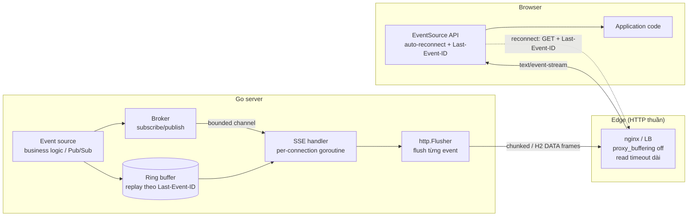
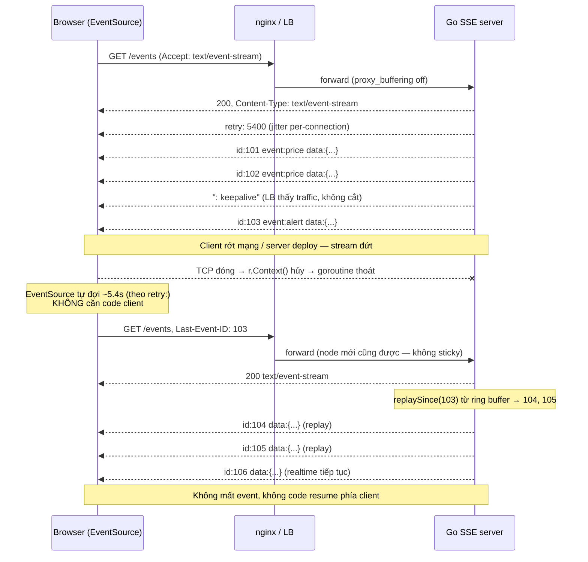

+++
title = "Chương 7: Server-Sent Events — Push đơn giản trên HTTP"
date = "2026-02-22T13:00:00+07:00"
draft = false
tags = ["backend", "communication", "api", "architecture"]
series = ["Backend Communication Architecture"]
+++

[← Chương trước](/series/backend-communication-architect/06-websocket/) | Mục lục | [Chương sau →](/series/backend-communication-architect/08-message-queue/)

---

## 1. Problem Statement

Ba bài toán rất phổ biến có chung một hình dạng:

- **Dashboard giá / telemetry**: server đẩy giá mới, số liệu mới xuống hàng nghìn màn hình. Client chỉ nhìn, không gửi gì (ngoài vài thao tác lọc hiếm hoi qua REST).
- **Notification feed**: "bạn có comment mới" — server phát, client nhận.
- **LLM token streaming**: model sinh token, server đẩy từng token xuống UI ngay khi có. Client gửi đúng một prompt lúc đầu (qua POST), sau đó chỉ nhận.

Điểm chung: **dữ liệu chảy một chiều, server → client**. Chiều ngược lại hoặc không tồn tại, hoặc thưa thớt tới mức một HTTP request bình thường phục vụ tốt.

Phản xạ của nhiều team là "realtime → WebSocket". Nhưng nhìn lại chương 6: WebSocket kéo theo cả một chuỗi chi phí — LB phải hiểu Upgrade và giữ idle timeout dài, deploy phải drain connection, reconnect + resume phải tự viết từ đầu (backoff, jitter, sequence number, replay), protocol trên frame phải tự định nghĩa, debug không dùng được tooling HTTP quen thuộc. Toàn bộ chi phí đó mua về một thứ: **kênh client → server tần suất cao** — thứ mà cả ba bài toán trên *không cần*.

Bài toán kỹ thuật rút gọn: cần server push với latency thấp, **nhưng muốn ở lại hoàn toàn trong thế giới HTTP** — đi qua proxy/LB/firewall như một HTTP response bình thường, tận dụng auth, TLS, observability, tooling sẵn có. Đó là Server-Sent Events (SSE) — chuẩn hóa trong HTML Living Standard (WHATWG), hiện diện trong mọi browser qua API `EventSource`.

## 2. Tại sao SSE tồn tại

Từ first principles: HTTP không cấm response kéo dài vô hạn. Một response với `Transfer-Encoding: chunked` (HTTP/1.1) hoặc một stream không kết thúc (HTTP/2) có thể nhả dữ liệu nhỏ giọt hàng giờ. Trick "giữ response mở để push" đã tồn tại từ thời Comet/long-polling (~2006), nhưng mỗi team tự chế một kiểu: tự định dạng event, tự viết reconnect, tự parse chunk boundary.

SSE là việc **chuẩn hóa trick đó thành một format + một browser API**:

1. Một **wire format** tối giản, text-based, tự phân định event (`data:`, `event:`, `id:`, `retry:`).
2. Một **client API có sẵn trong browser** (`EventSource`) với auto-reconnect và resume tích hợp — phần khó nhất của mọi hệ thống push được browser vendor viết hộ, test hộ, trên hàng tỷ thiết bị.

SSE không phát minh transport mới. Nó là HTTP response, chấm hết. Và chính vì thế, mọi thứ hiểu HTTP — nginx, HAProxy, ALB, CDN, corporate proxy, WAF, service mesh, `curl` — đều "hiểu" SSE ở mức transport mà không cần cấu hình đặc biệt nào về protocol (chỉ cần tắt buffering, xem mục 3.4).

## 3. Internal Architecture

### 3.1 Cơ chế: một HTTP response không bao giờ kết thúc

Client mở một GET request; server trả status 200 với `Content-Type: text/event-stream` và **không đóng response** — cứ có event mới thì ghi thêm và flush:

```http
GET /events?channel=prices HTTP/1.1
Accept: text/event-stream
Last-Event-ID: 1042        ← chỉ có khi reconnect

HTTP/1.1 200 OK
Content-Type: text/event-stream
Cache-Control: no-cache
X-Accel-Buffering: no

retry: 5000

id: 1043
event: price
data: {"symbol":"BTC","px":67890.5}

id: 1044
event: price
data: {"symbol":"ETH","px":3456.7}

: keepalive

id: 1045
event: alert
data: {"level":"warn",
data: "msg":"circuit breaker armed"}

```

Wire format — bốn field, phân tách event bằng **dòng trống**:

| Field | Ý nghĩa |
|---|---|
| `data:` | Payload. Nhiều dòng `data:` liên tiếp được client nối bằng `\n` — cách chở payload nhiều dòng |
| `event:` | Tên event type — client route bằng `addEventListener("price", ...)`; bỏ trống → event `message` mặc định |
| `id:` | Event ID. Client **tự động nhớ** và gửi lại qua header `Last-Event-ID` khi reconnect |
| `retry:` | Server chỉ thị client đợi bao nhiêu ms trước khi reconnect — server điều khiển được nhịp reconnect của toàn bộ client! |
| `: ...` | Dòng bắt đầu bằng `:` là comment — client bỏ qua; dùng làm heartbeat giữ kết nối sống |

Bên dưới, với HTTP/1.1 mỗi lần flush là một chunk của chunked encoding; với HTTP/2 là các DATA frame trên một stream. Application code không thấy khác biệt.

### 3.2 Auto-reconnect + Last-Event-ID — điểm ăn tiền so với WebSocket

Đặt hai cột cạnh nhau để thấy lượng code bạn *không phải viết*:

| Việc phải làm khi đứt kết nối | WebSocket | SSE (`EventSource`) |
|---|---|---|
| Phát hiện đứt | Tự viết (heartbeat + timeout) | Browser phát hiện (stream đóng/lỗi) |
| Reconnect + backoff | Tự viết (backoff, jitter, state machine) | Browser tự làm; nhịp điều khiển bởi `retry:` từ server |
| Nhớ vị trí đã đọc | Tự viết (sequence number protocol) | Browser tự nhớ `id:` cuối cùng |
| Báo server vị trí resume | Tự thiết kế resume message | Browser tự gửi header `Last-Event-ID` |
| Replay phần bị lỡ | Tự viết cả hai phía | **Chỉ phải viết phía server**: đọc `Last-Event-ID`, replay từ buffer |

Toàn bộ chương trình client tối giản:

```javascript
const es = new EventSource("/events?channel=prices");
es.addEventListener("price", (e) => render(JSON.parse(e.data)));
// Đứt kết nối? Browser tự reconnect với Last-Event-ID. Không thêm dòng nào.
```

Nửa client của bài toán "exactly-where-you-left-off delivery" được chuẩn hóa và cài sẵn. Server chỉ còn một nghĩa vụ: **gán `id:` tăng đơn điệu cho event và giữ replay buffer** đủ sâu để phủ thời gian mất kết nối điển hình (vài chục giây tới vài phút). Client offline lâu hơn buffer → như mọi hệ thống push, phải có đường full re-sync qua REST.

### 3.3 Data flow



- **Serialization**: payload là text — thực tế gần như luôn là JSON per-event. Binary phải base64 (+33% kích thước) — nếu bạn cần binary thường xuyên, đó là tín hiệu chọn nhầm công cụ (xem mục 7).
- **Transport**: HTTP nguyên bản. Auth dùng đúng middleware sẵn có (cookie; lưu ý `EventSource` API không cho set header tùy ý — token qua cookie hoặc dùng thư viện fetch-based như `fetch-event-source` khi cần `Authorization` header).
- **Connection management**: mỗi client là một HTTP request đang mở — trong Go là một goroutine handler đang chạy. Phát hiện client rớt qua `r.Context().Done()` (net/http hủy context khi TCP đóng).

### 3.4 Pitfall hạ tầng: buffering và idle timeout

SSE đi qua hạ tầng HTTP "như HTTP thường" — và đó vừa là điểm mạnh vừa là nguồn của hai pitfall kinh điển, đều xuất phát từ việc hạ tầng HTTP được tune cho response *ngắn*:

**Buffering**: reverse proxy mặc định gom response vào buffer để tối ưu (nginx `proxy_buffering on` mặc định). Kết quả: server flush từng event nhưng client chỉ nhận khi buffer đầy (32KB+) — "streaming" biến thành "batch mỗi 30 giây". Triệu chứng đặc trưng: chạy local thì mượt, lên staging sau nginx thì event tới theo cụm. Fix:

```nginx
location /events {
    proxy_pass http://backend;
    proxy_buffering off;         # điều kiện sống còn của SSE
    proxy_cache off;
    proxy_read_timeout 3600s;    # xem pitfall thứ hai
    proxy_http_version 1.1;
}
```

Hoặc từ phía application, không cần đụng config nginx: header `X-Accel-Buffering: no` (nginx tôn trọng per-response). Middleware nén (gzip) cũng là một dạng buffer — tắt nén cho endpoint SSE hoặc dùng nén flush-aware.

**Idle timeout của LB**: ALB/nginx/HAProxy cắt kết nối không có byte nào chạy qua trong N giây (ALB mặc định 60s). Kênh notification có thể im lặng hàng giờ → LB cắt đều đặn mỗi 60s → client reconnect liên tục (tự phục hồi được nhờ EventSource, nhưng tạo tải vô ích và làm nhiễu metric). Fix hai phía: server gửi **heartbeat comment** `: keepalive` mỗi 15–30 giây (client bỏ qua, LB thấy có traffic); đồng thời nâng idle timeout cho route SSE. Heartbeat còn có tác dụng thứ hai: là cách duy nhất server *phát hiện* client đã rớt trên kết nối im lặng — write vào TCP đã chết sẽ lỗi sau vài lần flush, giải phóng goroutine (cùng nguyên lý half-open TCP đã phân tích ở chương 6).

### 3.5 Vì sao SSE nên chạy trên HTTP/2

HTTP/1.1: browser giới hạn **~6 TCP connection đồng thời per origin**. Mỗi SSE stream chiếm trọn một connection. User mở app của bạn trong 3 tab, mỗi tab 2 stream (notifications + prices) = 6 — **mọi request HTTP khác tới origin đó bị đói connection**: ảnh không tải, API call treo. Đây là failure mode rất khó debug vì chẳng có lỗi nào được ném ra, mọi thứ chỉ... chậm bất thường.

HTTP/2 xóa vấn đề tận gốc: một TCP connection per origin, multiplex hàng trăm stream; mỗi SSE stream chỉ là một stream ID, giới hạn mặc định thường là 100+ concurrent stream (SETTINGS_MAX_CONCURRENT_STREAMS). Trong Go, bật TLS với `net/http` là có HTTP/2 tự động. Quy tắc thực dụng: **SSE trong production = SSE trên HTTP/2 (hoặc H2 tới LB, LB nói chuyện H1.1 với backend — giới hạn 6 connection là của browser với origin, nên chỉ cần hop browser→LB là H2)**. Cách khác (gom mọi stream vào một EventSource duy nhất, share qua SharedWorker/BroadcastChannel giữa các tab) hoạt động nhưng là độ phức tạp client mà HTTP/2 cho không.

### 3.6 Giới hạn cố hữu — biết trước khi chọn

- **Một chiều tuyệt đối**: client không gửi được gì trên stream. Mọi input của client đi qua HTTP request riêng (POST /messages). Với tần suất client-send thấp, đây là *ưu điểm* (tận dụng nguyên hạ tầng REST: auth, validation, rate limit); với tần suất cao (game, collab editing), round-trip từng POST giết chết bạn → WebSocket.
- **Chỉ text**: UTF-8. Binary → base64 (+33%).
- **Không có ack ở protocol level**: server không biết client đã *xử lý* tới event nào — chỉ biết TCP đã nhận. Cần ack nghiệp vụ (đánh dấu đã đọc) → client POST ack qua kênh riêng.
- **`EventSource` API hạn chế**: chỉ GET, không custom header, không đọc status code lỗi chi tiết. Các thư viện fetch-based khắc phục được, đổi lại tự quản reconnect (nhưng vẫn đơn giản hơn WebSocket nhiều).

### 3.7 So sánh SSE vs WebSocket vs Long Polling

| Tiêu chí | SSE | WebSocket | Long Polling |
|---|---|---|---|
| Transport | HTTP response giữ mở | TCP + framing riêng sau HTTP Upgrade | Chuỗi HTTP request lặp |
| Direction | Server → client | Song công | Server → client (chiều lên = request mới) |
| Reconnect + resume | **Built-in** (EventSource + Last-Event-ID) | Tự viết toàn bộ | Bản chất là reconnect liên tục; resume tự viết |
| Proxy / LB / firewall | Như HTTP thường (chỉ cần tắt buffering) | Cần LB hiểu Upgrade, idle timeout dài, đôi khi bị proxy cũ chặn | Như HTTP thường |
| Binary | Không (base64) | Có (binary frame) | Có (body) |
| Overhead per message | ~vài chục bytes (field names + `\n\n`) | 2–14 bytes header | Full HTTP headers mỗi event |
| Latency nhận event | ~RTT | ~RTT | RTT + chi phí re-establish giữa các event |
| Browser API | `EventSource` (có sẵn, tự reconnect) | `WebSocket` (có sẵn, không tự reconnect) | Tự viết trên fetch |
| Debug/tooling | `curl -N` là xong; access log chuẩn | wscat/websocat; log tự xây | curl; log chuẩn nhưng nhiễu (nhiều request) |
| Chi phí vận hành | Thấp (gần bằng REST + 2 config) | Cao (drain, sticky/gateway, capacity theo connection) | Thấp nhưng lãng phí tài nguyên theo scale |
| Số connection giữ tại server | 1/client (stream) | 1/client | 1/client (gần như liên tục) |

**Benchmark minh họa** (số liệu minh họa, phụ thuộc môi trường): 10.000 client nhận 1 event/10s, payload 200 bytes:

| Chỉ số | Long polling | SSE (HTTP/2) | WebSocket |
|---|---|---|---|
| Bandwidth tổng (gồm overhead) | ~9 Mbps | ~2,1 Mbps | ~1,8 Mbps |
| Goroutine tại server Go | ~10k (dao động) | ~10k (1/conn) | ~20k (2/conn) |
| RSS memory server | ~1,1 GB | ~350 MB (~35KB/conn) | ~450 MB (~45KB/conn) |
| Dòng code client cho reconnect+resume | ~80 | **0** | ~150 |
| Config hạ tầng thêm | 0 | 2 dòng nginx | LB Upgrade + timeout + drain script |

Điểm cần đọc đúng từ bảng: SSE và WebSocket **gần như hòa nhau về tài nguyên runtime** — khác biệt quyết định nằm ở hai dòng cuối, tức chi phí kỹ sư và vận hành.

**Vì sao các LLM API (OpenAI, Anthropic) đều chọn SSE cho token streaming?** Đối chiếu bài toán với bảng trên: (1) luồng dữ liệu thuần một chiều — client gửi đúng một prompt qua POST, rồi chỉ nhận token; (2) client đa dạng nhất có thể (mọi ngôn ngữ, mọi proxy doanh nghiệp, serverless function) — HTTP thuần đi qua tất cả, `curl -N` demo được ngay; (3) stream ngắn (giây tới phút) — reconnect/resume ít quan trọng, nhưng infrastructure-friendliness quan trọng tuyệt đối; (4) API gateway, billing, auth, rate limiting sẵn có của REST áp dụng nguyên vẹn. WebSocket ở đây không mua thêm được gì ngoài chi phí. Đây là case study điển hình của nguyên tắc: **chọn công cụ theo hướng chảy của dữ liệu, không theo độ "realtime" cảm nhận**.

## 4. Trade-off Analysis

| Trục | Đánh giá | Phân tích |
|---|---|---|
| **Latency** | Tốt (ngang WebSocket) | Sau khi stream mở, mỗi event = một chunk trên connection sẵn có: ~RTT. |
| **Bandwidth** | Tốt | Overhead vài chục bytes/event (field name + newline). Thua WebSocket vài bytes — không đáng kể trừ khi event cực nhỏ và cực dày. |
| **Complexity** | Thấp — điểm mạnh nhất | Server = HTTP handler + Flusher. Client = 3 dòng. Reconnect/resume browser lo. |
| **Scalability** | Tốt, cùng trần với WebSocket | Vẫn là persistent connection → vẫn cần fan-out backbone khi multi-node (chương 6 mục 3.7 áp dụng nguyên xi). Nhưng không cần sticky session: node nào cũng serve được reconnect nếu replay buffer nằm ở shared store (Redis Streams). |
| **DX** | Rất tốt | `curl -N https://host/events` thấy stream ngay. Toàn bộ tooling HTTP dùng được. |
| **Operational cost** | Thấp | Hai config (buffering, timeout) là xong; deploy không cần nghi lễ drain phức tạp — client tự reconnect với resume built-in (vẫn nên rải reconnect, xem mục 6). |
| **Compatibility** | Rất tốt | Mọi browser (trừ IE cổ — polyfill được vì chỉ là HTTP), mọi HTTP client mọi ngôn ngữ. |
| **Observability** | Tốt | Request nằm trong access log chuẩn; đo được connection duration, event rate bằng middleware HTTP quen thuộc. Điểm mù duy nhất: "connected" không có nghĩa "đang nhận tốt" — cần metric write error. |
| **Security** | Tốt, ít bề mặt riêng | Cùng model với HTTP: TLS, cookie + CSRF consideration cho GET (SSE là GET nên tránh side effect), CORS chuẩn (`EventSource` tuân thủ SOP, khác WebSocket!). Lưu ý rate limit số stream đồng thời per user. |

## 5. Production Implementation (Golang)

SSE server production-grade: heartbeat, replay từ ring buffer theo `Last-Event-ID`, phát hiện client rớt qua context, graceful shutdown. Chỉ dùng standard library — bản thân điều đó nói lên độ phức tạp của SSE so với WebSocket.

```go
// Package ssehub — SSE broker production-grade, chỉ dùng net/http.
package ssehub

import (
	"fmt"
	"net/http"
	"strconv"
	"sync"
	"time"
)

type Event struct {
	ID   uint64
	Type string // "price", "alert"... → dòng "event:"
	Data []byte // JSON đã serialize; SSE là text — không binary
}

// Broker giữ subscriber và ring buffer replay.
type Broker struct {
	mu     sync.RWMutex
	subs   map[chan Event]struct{}
	nextID uint64

	// Ring buffer cố định — replay cho Last-Event-ID. Kích thước chọn theo
	// công thức: event_rate × thời_gian_mất_kết_nối_muốn_phủ.
	// 10 ev/s × 120s = 1200 → 4096 là dư dả. Multi-node: thay bằng
	// Redis Streams (XADD/XRANGE) để node nào cũng replay được.
	ring  []Event
	head  int
	count int
}

func NewBroker(ringSize int) *Broker {
	return &Broker{
		subs: make(map[chan Event]struct{}),
		ring: make([]Event, ringSize),
	}
}

// Publish gán ID tăng đơn điệu, lưu vào ring, fan-out cho subscriber.
func (b *Broker) Publish(typ string, data []byte) {
	b.mu.Lock()
	b.nextID++
	ev := Event{ID: b.nextID, Type: typ, Data: data}
	b.ring[(b.head+b.count)%len(b.ring)] = ev
	if b.count < len(b.ring) {
		b.count++
	} else {
		b.head = (b.head + 1) % len(b.ring) // ghi đè event cũ nhất
	}
	for ch := range b.subs {
		select {
		case ch <- ev:
		default:
			// Subscriber chậm (buffer 64 đầy). Với SSE ta có quyền drop
			// mạnh tay: client sẽ nhận lại TOÀN BỘ phần thiếu khi
			// reconnect nhờ Last-Event-ID → đóng channel ép reconnect
			// cũng là một chiến lược hợp lệ. Ở đây: drop event này
			// cho subscriber này (đo bằng metric).
		}
	}
	b.mu.Unlock()
}

func (b *Broker) subscribe() chan Event {
	ch := make(chan Event, 64)
	b.mu.Lock()
	b.subs[ch] = struct{}{}
	b.mu.Unlock()
	return ch
}

func (b *Broker) unsubscribe(ch chan Event) {
	b.mu.Lock()
	delete(b.subs, ch)
	b.mu.Unlock()
}

// replaySince trả các event có ID > afterID còn trong ring.
// ok=false nghĩa là gap vượt quá buffer → client phải full re-sync.
func (b *Broker) replaySince(afterID uint64) (evs []Event, ok bool) {
	b.mu.RLock()
	defer b.mu.RUnlock()
	if b.count == 0 {
		return nil, true
	}
	oldest := b.ring[b.head].ID
	if afterID+1 < oldest {
		return nil, false // event client cần đã bị ghi đè
	}
	for i := 0; i < b.count; i++ {
		ev := b.ring[(b.head+i)%len(b.ring)]
		if ev.ID > afterID {
			evs = append(evs, ev)
		}
	}
	return evs, true
}

// ---------------------------------------------------------------------------
// HTTP handler
// ---------------------------------------------------------------------------

const heartbeatInterval = 20 * time.Second // < idle timeout LB (thường 60s)

func (b *Broker) ServeHTTP(w http.ResponseWriter, r *http.Request) {
	// http.Flusher là điều kiện tiên quyết: cho phép đẩy từng event
	// xuống socket ngay thay vì chờ buffer của net/http đầy.
	// (Middleware gzip/ghi đè ResponseWriter có thể che mất Flusher —
	// lỗi cấu hình phổ biến nhất.)
	fl, ok := w.(http.Flusher)
	if !ok {
		http.Error(w, "streaming unsupported", http.StatusInternalServerError)
		return
	}

	h := w.Header()
	h.Set("Content-Type", "text/event-stream")
	h.Set("Cache-Control", "no-cache")
	h.Set("X-Accel-Buffering", "no") // bảo nginx đừng buffer, khỏi sửa config

	// retry: server điều khiển nhịp reconnect của client. Randomize
	// per-connection = jitter do SERVER phát — vũ khí chống reconnect
	// storm khi deploy (xem mục 6.1).
	fmt.Fprintf(w, "retry: %d\n\n", 3000+randInt(4000)) // 3–7s

	// --- Replay theo Last-Event-ID (browser tự gửi khi reconnect) ---
	if lastID := r.Header.Get("Last-Event-ID"); lastID != "" {
		after, err := strconv.ParseUint(lastID, 10, 64)
		if err == nil {
			missed, ok := b.replaySince(after)
			if !ok {
				// Gap vượt buffer: phát tín hiệu để client full re-sync
				// qua REST rồi mở lại stream — đường thoát BẮT BUỘC
				// của mọi hệ replay-buffer.
				fmt.Fprintf(w, "event: resync_required\ndata: {}\n\n")
				fl.Flush()
				return
			}
			for _, ev := range missed {
				writeEvent(w, ev)
			}
			fl.Flush()
		}
	}

	ch := b.subscribe()
	defer b.unsubscribe(ch)

	ticker := time.NewTicker(heartbeatInterval)
	defer ticker.Stop()

	// r.Context() bị hủy khi: client đóng tab, TCP đứt, server shutdown
	// (net/http lo giùm) → goroutine này thoát sạch, không leak.
	ctx := r.Context()
	for {
		select {
		case <-ctx.Done():
			return

		case ev := <-ch:
			writeEvent(w, ev)
			fl.Flush()
			// Write vào connection chết trả lỗi sau vài lần flush;
			// vòng lặp sau ctx.Done() sẽ đóng — kết hợp heartbeat,
			// goroutine mồ côi sống tối đa ~1 chu kỳ heartbeat.

		case <-ticker.C:
			// Heartbeat comment: giữ LB/NAT thấy traffic + phát hiện
			// client chết trên kênh im ắng. Client bỏ qua dòng ":".
			if _, err := fmt.Fprint(w, ": keepalive\n\n"); err != nil {
				return
			}
			fl.Flush()
		}
	}
}

// writeEvent tuân đúng wire format: id / event / data, kết bằng dòng trống.
func writeEvent(w http.ResponseWriter, ev Event) {
	fmt.Fprintf(w, "id: %d\n", ev.ID)
	if ev.Type != "" {
		fmt.Fprintf(w, "event: %s\n", ev.Type)
	}
	// Payload nhiều dòng phải tách thành nhiều "data:" — ở đây giả định
	// JSON một dòng (không chứa \n), đúng với marshal mặc định.
	fmt.Fprintf(w, "data: %s\n\n", ev.Data)
}
```

Graceful shutdown: `http.Server.Shutdown(ctx)` mặc định **chờ** các request đang chạy — mà SSE stream thì chạy vô hạn. Pattern đúng: gọi `Shutdown` với context có timeout ngắn (vd 10s), đồng thời phát tín hiệu đóng các stream (hủy context cha của broker hoặc đóng các subscriber channel) để handler tự return; client mất stream sẽ reconnect theo `retry:` (đã có jitter) vào node mới. Vì resume là built-in, "graceful deploy" của SSE gần như chỉ là *tắt server một cách bình thường* — so với nghi lễ drain của WebSocket ở chương 6, đây là khác biệt vận hành lớn nhất.

**Client Go tiêu thụ SSE** — hữu ích khi consumer không phải browser (worker nội bộ đọc stream, SDK gọi LLM API). Lưu ý: các LLM API thực tế stream qua **POST** với body là prompt — không dùng được `EventSource` (chỉ GET), nhưng wire format vẫn là SSE nguyên bản, parse bằng vài chục dòng:

```go
// StreamSSE mở stream và gọi onEvent cho từng event — đủ dùng cho
// LLM token streaming. Reconnect/backoff bọc bên ngoài (cùng pattern
// full jitter như chương 6), kèm header Last-Event-ID nếu server hỗ trợ.
func StreamSSE(ctx context.Context, req *http.Request,
	onEvent func(id, typ, data string)) error {

	req.Header.Set("Accept", "text/event-stream")
	resp, err := http.DefaultClient.Do(req.WithContext(ctx))
	if err != nil {
		return err
	}
	defer resp.Body.Close()
	if resp.StatusCode != http.StatusOK {
		return fmt.Errorf("sse: unexpected status %d", resp.StatusCode)
	}

	var id, typ string
	var data strings.Builder
	sc := bufio.NewScanner(resp.Body)
	sc.Buffer(make([]byte, 0, 64*1024), 1<<20) // event tối đa 1MB

	for sc.Scan() {
		line := sc.Text()
		switch {
		case line == "": // dòng trống = kết thúc một event → dispatch
			if data.Len() > 0 {
				onEvent(id, typ, strings.TrimSuffix(data.String(), "\n"))
			}
			id, typ = "", ""
			data.Reset()
		case strings.HasPrefix(line, "data:"):
			data.WriteString(strings.TrimPrefix(
				strings.TrimPrefix(line, "data:"), " "))
			data.WriteByte('\n') // nhiều dòng data: nối bằng \n theo spec
		case strings.HasPrefix(line, "event:"):
			typ = strings.TrimSpace(strings.TrimPrefix(line, "event:"))
		case strings.HasPrefix(line, "id:"):
			id = strings.TrimSpace(strings.TrimPrefix(line, "id:"))
		case strings.HasPrefix(line, ":"): // heartbeat comment — bỏ qua
		}
	}
	return sc.Err() // io.EOF sạch = server đóng stream có chủ đích
}
```

Điểm thiết kế đáng lưu ý: scanner cần buffer đủ lớn (mặc định 64KB có thể thiếu với event to); và phân biệt "stream kết thúc sạch" (server gửi event kết thúc nghiệp vụ, vd `event: done` của LLM API, rồi đóng) với "đứt giữa chừng" (lỗi đọc) — chỉ trường hợp sau mới reconnect.



## 6. Anti-patterns và Failure Examples

### 6.1 Failure example: deploy → reconnect storm

Hệ thống notification, 80.000 client SSE trên 4 node. Deploy rolling nhưng script cũ `kill -9` từng node. Diễn biến:

1. Node 1 chết → 20.000 stream đứt **cùng một mili-giây**.
2. Team chưa từng gửi `retry:` → mọi browser dùng default (~3s, tùy browser nhưng **giống nhau trong cùng một browser**) → ~20.000 request GET /events đập vào 3 node còn lại trong cửa sổ vài trăm ms.
3. Mỗi reconnect mang `Last-Event-ID` → 20.000 lần replay đồng thời quét ring buffer + auth + subscribe → CPU spike, p99 các API khác trên cùng node vọt lên.
4. Node 2 đến lượt deploy trong khi node 3–4 còn đang gánh đợt sóng thứ nhất → sóng chồng sóng → health check fail → LB rút node → càng ít node càng quá tải: **metastable failure**, hệ chỉ hồi khi tạm chặn bớt traffic.

Ba fix, xếp theo hiệu quả:

- **`retry:` với jitter phía server** (đã có trong code mục 5): mỗi connection nhận giá trị ngẫu nhiên 3–7s → 20.000 reconnect trải đều trong 4 giây thay vì dồn một điểm. Đây là nét đẹp riêng của SSE: **server điều khiển backoff của client qua protocol**, không cần deploy lại client — WebSocket không có cơ chế tương đương chuẩn hóa.
- **Graceful shutdown**: SIGTERM → đóng dần các stream rải trong 30–60s trước khi process exit, thay vì cắt đồng loạt.
- **Rẻ hóa replay**: replay path không được đắt hơn serve path — ring buffer in-memory hoặc Redis Streams đọc range, tuyệt đối không query database per reconnect.

### 6.2 Các anti-pattern khác

- **Quên heartbeat**: kênh ít event bị LB idle-timeout cắt mỗi 60s → client reconnect vòng lặp vô tận; nhìn metric tưởng "user rất tích cực", thực ra là hạ tầng tự cắn đuôi. Mọi SSE endpoint phải có `: keepalive` định kỳ, không ngoại lệ.
- **Quên tắt buffering** (nginx/gzip middleware): mục 3.4 — streaming thành batch. Test SSE phải test *sau* proxy, không chỉ local.
- **Không gán `id:`**: vứt bỏ tính năng giá trị nhất của SSE; reconnect thành mất event mà không ai biết.
- **`id:` không phải chuỗi tăng đơn điệu / replay buffer không phủ nổi downtime thực tế** — và **thiếu đường `resync_required`**: client kẹt trong trạng thái thiếu dữ liệu vĩnh viễn.
- **Nhét SSE lên HTTP/1.1 mà app mở nhiều stream per tab**: cạn 6 connection per origin của browser (mục 3.5), mọi request khác nghẹt — bug "web chậm không rõ lý do".
- **Dùng SSE làm kênh hai chiều bằng cách POST dồn dập song song**: nếu chiều lên là dòng chảy liên tục, bạn đang mô phỏng WebSocket bằng hai kênh rời — nhận cả độ phức tạp lẫn overhead; chuyển hẳn sang WebSocket.

### 6.3 Refactoring example: WebSocket một chiều → SSE

Bối cảnh thật gặp nhiều lần khi review kiến trúc: dashboard vận hành nội bộ dùng WebSocket đẩy metric xuống UI. Audit code sáu tháng sau khi chạy production cho thấy: **100% message chảy một chiều server → client** (client chỉ gửi đúng một subscribe message lúc mở). Đổi lại, codebase đang gánh: client reconnect state machine ~150 dòng (từng có 2 bug production — một lần backoff không jitter gây bão reconnect, một lần quên resubscribe sau reconnect khiến dashboard "đứng hình" âm thầm); server hub + heartbeat ~300 dòng; một trang runbook cấu hình ALB cho Upgrade + script drain khi deploy.

Refactor: subscribe message → query param; hub WebSocket → broker SSE (mục 5); reconnect client → **xóa toàn bộ, EventSource lo**.

```go
// TRƯỚC: hub WebSocket (chương 6) — 2 goroutine/conn, ping/pong,
// bounded send channel, close handshake, drain script khi deploy...

// SAU: toàn bộ "protocol" còn lại phía server chỉ là:
mux.Handle("/metrics/stream", authMiddleware(broker)) // broker từ mục 5
// và publisher:
broker.Publish("cpu", payload)
```

```javascript
// TRƯỚC: ~150 dòng reconnect/backoff/resubscribe tự viết, 2 bug đã trả giá.
// SAU:
const es = new EventSource(`/metrics/stream?hosts=${ids}`);
es.addEventListener("cpu", (e) => chart.push(JSON.parse(e.data)));
```

Kết quả đo được sau refactor: ~450 dòng code sở hữu (owned code) bị xóa; runbook deploy bỏ bước drain; hai lớp bug (reconnect, resubscribe) biến mất theo code; latency và tài nguyên **không đổi trong sai số đo** — đúng như bảng benchmark mục 3.7 dự đoán. Bài học: chi phí của WebSocket không nằm ở runtime mà ở **code bạn phải sở hữu và vận hành**; khi chiều lên không tồn tại, chi phí đó mua về con số không.

## 7. Khi nào KHÔNG nên dùng SSE

- **Cần chiều client → server tần suất cao** (chat có typing indicator, game, collaborative editing, trading order entry): mô phỏng bằng POST song song vừa chậm vừa phức tạp hơn WebSocket thật. → Chương 6.
- **Cần binary hiệu quả** (audio/video chunk, protobuf dày đặc, file transfer): base64 +33% và ép mọi thứ thành text là đấu với công cụ. → WebSocket (binary frame) hoặc gRPC streaming.
- **Client không phải browser và bạn kiểm soát cả hai đầu trong datacenter**: gRPC server-streaming cho bạn schema, deadline, flow control HTTP/2, code-gen đa ngôn ngữ — SSE ở đây chỉ còn là format text tự parse.
- **Cần message dày đặc kích thước nhỏ với overhead tối thiểu tuyệt đối** (market data hàng chục nghìn tick/giây tới một client): overhead field-name per event của SSE bắt đầu đáng kể so với 2–14 bytes của WebSocket frame; và bạn sẽ cần conflation — thứ các hệ WebSocket market-data đã có pattern sẵn.
- **Cần delivery guarantee cấp message-queue** (ack, redelivery, exactly-once processing): SSE + Last-Event-ID cho resume tốt, nhưng không phải là message queue. Nhu cầu ack/consumer-group thật → chương 8.
- **Chạy sau hạ tầng buffering không kiểm soát được** (một số WAF/CDN buffer response mà không có tùy chọn tắt cho route riêng): SSE cần đường flush thông suốt từ handler tới client; nếu không đảm bảo được, long polling trớ trêu thay lại là lựa chọn ổn định hơn.

Nguyên tắc chốt, đối xứng với chương 6: **hướng chảy của dữ liệu quyết định công cụ**. Một chiều server → client, client là browser, hạ tầng là HTTP — SSE là mặc định đúng; chỉ rời khỏi nó khi có bằng chứng cụ thể về chiều ngược lại, binary, hay delivery guarantee mà nó không đáp ứng nổi.

---

[← Chương trước](/series/backend-communication-architect/06-websocket/) | Mục lục | [Chương sau →](/series/backend-communication-architect/08-message-queue/)
