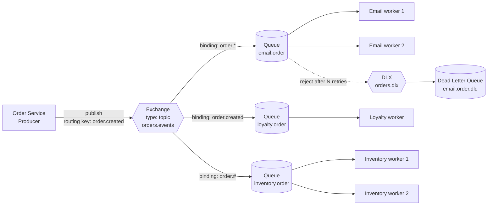
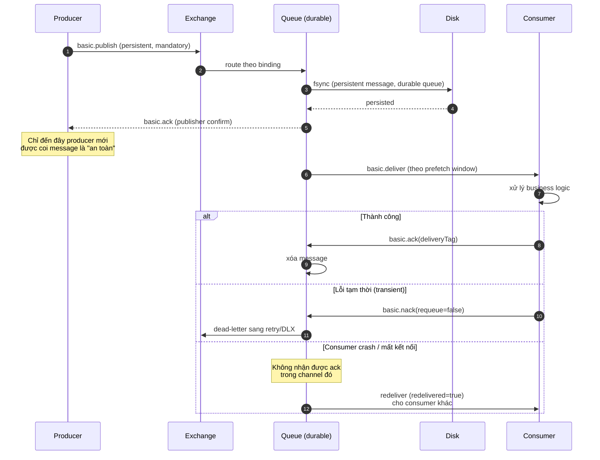
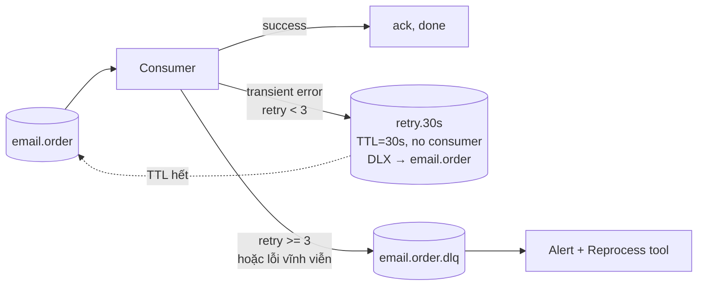

+++
title = "Chương 8: Message Queue — Tách rời thời gian giữa các hệ thống"
date = "2026-02-22T14:00:00+07:00"
draft = false
tags = ["backend", "communication", "api", "architecture"]
series = ["Backend Communication Architecture"]
+++

[← Chương trước](/series/backend-communication-architect/07-sse/) | Mục lục | [Chương sau →](/series/backend-communication-architect/09-event-streaming/)

---

## 1. Problem Statement

Hãy bắt đầu từ một luồng nghiệp vụ mà mọi hệ thống e-commerce đều có: **khách hàng đặt hàng thành công**.

Khi đơn hàng được tạo, hệ thống phải làm ít nhất bốn việc:

1. Gửi email xác nhận cho khách.
2. Cộng điểm tích lũy (loyalty).
3. Cập nhật tồn kho (inventory).
4. Đẩy dữ liệu sang hệ thống analytics.

Cách tiếp cận ngây thơ nhất — và cũng là cách hầu hết các hệ thống bắt đầu — là gọi synchronous tất cả trong cùng một request:

```go
// Anti-pattern: orchestration đồng bộ trong luồng chính
func (s *OrderService) PlaceOrder(ctx context.Context, req OrderRequest) error {
    order, err := s.repo.CreateOrder(ctx, req) // 20ms
    if err != nil {
        return err
    }
    if err := s.emailClient.SendConfirmation(ctx, order); err != nil { // 300ms, hay timeout
        return err // email chết -> đặt hàng thất bại?!
    }
    if err := s.loyaltyClient.AddPoints(ctx, order); err != nil { // 80ms
        return err
    }
    if err := s.inventoryClient.Reserve(ctx, order); err != nil { // 50ms
        return err
    }
    if err := s.analyticsClient.Track(ctx, order); err != nil { // 120ms
        return err
    }
    return nil
}
```

Thiết kế này có ba lỗi kiến trúc nghiêm trọng:

**Latency cộng dồn.** Latency của luồng chính là *tổng* latency của mọi downstream: 20 + 300 + 80 + 50 + 120 = 570ms, trong khi nghiệp vụ cốt lõi (tạo đơn) chỉ mất 20ms. Khách hàng phải chờ email service — thứ họ không hề quan tâm tại thời điểm bấm nút.

**Availability nhân với nhau.** Nếu mỗi service có availability 99.9%, thì luồng chính có availability xấp xỉ 0.999^5 ≈ 99.5% — tức là từ ~43 phút downtime/tháng lên ~3.6 giờ/tháng. Một service *phụ* (analytics) chết kéo sập luồng *chính* (đặt hàng). Đây là coupling về mặt vận hành: fate sharing.

**Coupling về thời gian (temporal coupling).** Order service chỉ hoạt động được khi *tất cả* downstream đang sống *tại đúng thời điểm đó*. Nhưng về mặt nghiệp vụ, email có thể gửi sau 5 giây, điểm loyalty có thể cộng sau 1 phút — không có lý do nào bắt chúng phải xảy ra trong cùng một HTTP request.

Vấn đề kỹ thuật cốt lõi: **chúng ta cần một cơ chế cho phép producer và consumer hoạt động ở những thời điểm khác nhau, với tốc độ khác nhau, mà không mất dữ liệu**. Đó chính xác là temporal decoupling — và message queue là hiện thân hạ tầng của nó.

## 2. Tại sao Message Queue tồn tại

### 2.1. Business problem

- **Nghiệp vụ chính không được phép chờ nghiệp vụ phụ.** Doanh thu phụ thuộc vào việc đặt hàng thành công nhanh; email chậm 10 giây không mất tiền, checkout chậm 10 giây thì mất.
- **Các team sở hữu service khác nhau, deploy độc lập.** Team loyalty deploy giữa giờ cao điểm không được phép làm team order rớt request.
- **Tải không đều theo thời gian.** Flash sale tạo 10.000 đơn/phút trong 5 phút; hệ thống gửi email chỉ xử lý được 1.000/phút. Nếu gọi sync, 90% request fail. Nếu có queue, backlog được hấp thụ và tiêu hóa dần — queue là **bộ giảm xóc (shock absorber)** giữa hai hệ thống có công suất khác nhau.

### 2.2. Technical problem

Message queue giải quyết đồng thời ba loại decoupling:

| Loại decoupling | Không có queue | Có queue |
|---|---|---|
| **Temporal** | Consumer phải sống tại thời điểm producer gọi | Consumer có thể offline, xử lý sau |
| **Load** | Producer bị giới hạn bởi throughput của consumer | Queue hấp thụ burst, consumer xử lý theo tốc độ của mình |
| **Topology** | Producer phải biết địa chỉ, số lượng, giao thức của từng consumer | Producer chỉ biết broker; thêm consumer không cần sửa producer |

### 2.3. Scale problem

Khi số lượng service tăng từ N lên N+1, mô hình point-to-point sync tạo ra O(N²) kết nối và dependency. Broker đưa topology về hình sao: O(N) kết nối, và quan trọng hơn — **dependency graph trở thành dữ liệu cấu hình (binding) thay vì code**. Thêm một consumer mới cho event "order.created" là thao tác khai báo trên broker, không phải một pull request vào order service.

## 3. Internal Architecture

### 3.1. Hai mô hình gốc: Queue (point-to-point) vs Pub/Sub (fan-out)

Mọi messaging system đều là biến thể của hai mô hình:

**Point-to-point (Queue):** một message được deliver cho **đúng một** consumer trong nhóm. Nhiều consumer cùng đọc một queue tạo thành mô hình **competing consumers** — broker phân phối message theo round-robin (có điều chỉnh bởi prefetch). Đây là mô hình cho *work distribution*: "việc này cần được làm một lần, ai làm cũng được".

**Publish/Subscribe (fan-out):** một message được deliver cho **tất cả** subscriber. Đây là mô hình cho *event notification*: "chuyện này đã xảy ra, ai quan tâm thì biết".

Điểm tinh tế mà nhiều thiết kế bỏ qua: bài toán thực tế hầu như luôn là **kết hợp cả hai** — mỗi *loại* consumer (email, loyalty, inventory) đều cần nhận event (pub/sub giữa các nhóm), nhưng trong mỗi nhóm chỉ một instance xử lý (competing consumers trong nhóm). AMQP giải quyết bằng cách tách khái niệm **exchange** (điểm fan-out) khỏi **queue** (điểm competing): mỗi nhóm consumer có queue riêng, tất cả queue cùng bind vào một exchange.



Mỗi message `order.created` được **nhân bản** vào 3 queue (pub/sub), nhưng trong queue `email.order`, chỉ **một** trong hai worker nhận nó (competing consumers). Fan-out và load balancing là hai tầng độc lập.

### 3.2. Broker architecture trong AMQP: exchange, queue, binding

AMQP 0-9-1 (RabbitMQ) mô hình hóa routing như một bảng định tuyến khai báo:

- **Exchange**: điểm nhận message từ producer. Producer *không bao giờ* publish thẳng vào queue — producer chỉ biết exchange và routing key. Đây là điểm decoupling topology.
- **Queue**: buffer FIFO (gần đúng) lưu message chờ consumer. Queue có các thuộc tính quan trọng: `durable` (metadata sống sót qua broker restart), `exclusive`, `auto-delete`, và các argument như `x-max-length`, `x-overflow`, `x-dead-letter-exchange`, `x-queue-type` (classic vs quorum).
- **Binding**: quy tắc nối exchange với queue, kèm binding key.

Bốn loại exchange, xếp theo mức độ "thông minh" của routing:

| Exchange type | Routing logic | Use case |
|---|---|---|
| `direct` | routing key == binding key (so khớp chính xác) | Work queue, routing theo loại task |
| `fanout` | Bỏ qua routing key, gửi mọi queue đã bind | Broadcast thuần |
| `topic` | Khớp pattern: `*` = đúng 1 từ, `#` = 0..n từ, phân tách bởi `.` | Event routing theo taxonomy (`order.created`, `order.*`, `payment.#`) |
| `headers` | Khớp theo message headers (`x-match: all/any`) | Routing đa chiều, ít dùng vì chậm hơn |

Routing key nên được thiết kế như một **taxonomy có chủ đích**: `<domain>.<entity>.<action>` — ví dụ `commerce.order.created`, `commerce.order.cancelled`. Consumer bind `commerce.order.*` nhận mọi biến động của order; consumer bind `commerce.#` nhận toàn bộ domain. Đây là hợp đồng public — đổi routing key là breaking change tương đương đổi URL của API.

Triết lý của mô hình này: **smart broker, dumb consumer**. Broker giữ toàn bộ logic routing, filtering, TTL, priority, dead-lettering; consumer chỉ việc nhận và xử lý. Trái ngược với Kafka (smart consumer, dumb broker) — sẽ phân tích ở chương 9.

### 3.3. Delivery lifecycle: publish → persist → deliver → ACK/NACK → redelivery

Vòng đời một message qua broker gồm các trạng thái chuyển tiếp, và **mỗi mũi tên là một điểm có thể mất hoặc nhân đôi message**:



Phân tích từng điểm mất mát:

1. **Publish → Exchange**: nếu connection đứt giữa chừng, producer không biết message đã đến chưa. Giải pháp: **publisher confirm** (mục 3.9).
2. **Exchange → Queue**: nếu routing key không khớp binding nào, mặc định message bị **âm thầm vứt bỏ**. Giải pháp: flag `mandatory` + xử lý `basic.return`, hoặc alternate exchange.
3. **Queue → Disk**: message phải có `DeliveryMode=Persistent` **và** queue phải `durable`; thiếu một trong hai thì restart broker là mất. Với classic queue, fsync là best-effort theo batch; với **quorum queue** (Raft-based), confirm chỉ trả về khi majority replica đã ghi — đây là lựa chọn mặc định cho dữ liệu quan trọng từ RabbitMQ 3.8+.
4. **Deliver → ACK**: nếu consumer nhận rồi crash trước khi ack, broker redeliver — dẫn tới **at-least-once** và bắt buộc consumer idempotent (mục 3.8).

### 3.4. ACK modes: auto vs manual, và prefetch/QoS

**Auto-ack** (`autoAck=true`): broker coi message là "đã xử lý xong" ngay khi ghi ra TCP socket về phía consumer. Consumer crash giữa chừng → message mất vĩnh viễn. Đây là at-most-once. Auto-ack chỉ hợp lệ khi mất message là chấp nhận được (metrics, log gợi ý, presence).

**Manual ack**: consumer gọi `Ack` sau khi *hoàn tất* xử lý (bao gồm cả ghi DB). Semantics trở thành at-least-once. Ba động từ:

- `Ack(deliveryTag, multiple)` — xác nhận thành công. `multiple=true` ack tất cả deliveryTag ≤ tag (giảm số round-trip, nhưng nguy hiểm nếu xử lý out-of-order).
- `Nack(deliveryTag, multiple, requeue)` — từ chối. `requeue=true` đẩy lại **đầu** queue (cẩn thận: tạo hot-loop nếu message là poison), `requeue=false` chuyển sang DLX nếu có cấu hình, không thì vứt.
- `Reject` — như Nack nhưng không có `multiple`.

**Prefetch (QoS)** là tham số vận hành quan trọng nhất phía consumer, và bị hiểu sai nhiều nhất. `basic.qos(prefetchCount=N)` nghĩa là: broker được phép giữ tối đa N message **đã deliver nhưng chưa ack** trên channel đó.

- **Prefetch quá thấp (1)**: mỗi message là một round-trip deliver→ack. Với latency mạng 1ms, một consumer chỉ đạt tối đa ~1000 msg/s bất kể xử lý nhanh cỡ nào. Được cái **fairness tuyệt đối**: message luôn đến consumer đang rảnh.
- **Prefetch quá cao (10.000)**: broker dồn 10.000 message vào consumer đầu tiên kết nối. Consumer đó thành điểm nghẽn, các consumer khác đói việc; nếu nó crash, 10.000 message bị redeliver cùng lúc. Ngoài ra memory phía client phình theo prefetch × message size.
- **Quy tắc thực dụng**: `prefetch ≈ (thời gian xử lý 1 msg / round-trip time) × hệ số an toàn 2`. Task nhanh (1ms) → prefetch 100–300. Task chậm (5s, ví dụ render PDF) → prefetch 1–2 để giữ fairness. Đo lại bằng metric queue depth và consumer utilisation.

### 3.5. Retry: immediate vs delayed, TTL + DLX trick, retry topic pattern

Retry ngay lập tức (`nack requeue=true`) hầu như luôn sai với lỗi hạ tầng: downstream đang chết, retry sau 2ms vẫn chết, và bạn vừa tạo một vòng lặp đốt CPU broker + spam log. Lỗi transient cần **delayed retry với backoff**.

RabbitMQ không có delay retry native (không tính plugin `delayed-message-exchange` vốn có giới hạn về scale). Pattern chuẩn là **TTL + DLX trick**:

1. Tạo queue `email.order.retry.30s` với hai argument: `x-message-ttl: 30000` và `x-dead-letter-exchange: orders.events` (trỏ **ngược về** exchange chính), `x-dead-letter-routing-key: email.order`.
2. Queue này **không có consumer nào**. Message vào đó nằm chờ đúng 30 giây, hết TTL thì bị dead-letter — tức là được bơm ngược lại queue chính.
3. Consumer khi gặp lỗi transient: publish message sang retry queue (kèm header đếm số lần retry), rồi `Ack` message gốc.

Nhiều tầng retry tạo thành **retry topic pattern** (mượn từ thế giới Kafka): `retry.30s` → `retry.5m` → `retry.30m` → DLQ. Số lần retry đọc từ header `x-retry-count`; vượt ngưỡng thì đi thẳng DLQ.



**Cạm bẫy kinh điển của TTL queue**: RabbitMQ chỉ expire message ở **đầu queue**. Nếu bạn trộn nhiều TTL khác nhau trong một queue (set TTL per-message thay vì per-queue), message TTL 5 phút đứng đầu sẽ **chặn** message TTL 10 giây đứng sau. Vì vậy: mỗi mức delay là một queue riêng với TTL cố định ở mức queue.

Phân loại lỗi trước khi retry — đây là quyết định thiết kế, không phải chi tiết cài đặt:

| Loại lỗi | Ví dụ | Hành động |
|---|---|---|
| Transient | Timeout, connection refused, 503, deadlock | Retry với backoff |
| Permanent | Validation fail, business rule vi phạm, 400 | DLQ ngay, retry là vô nghĩa |
| Poison message | Payload malformed, gây panic consumer | DLQ ngay + alert, vì nó sẽ giết mọi consumer chạm vào |

### 3.6. Dead Letter Queue: thiết kế, monitoring, reprocessing

DLQ không phải thùng rác — nó là **hàng đợi sự cố cần con người (hoặc tool) xử lý**. Ba nguyên tắc thiết kế:

1. **Bảo toàn ngữ cảnh.** Khi đưa message vào DLQ, đính kèm header: lý do lỗi (`x-death` do RabbitMQ tự thêm, cộng thêm `x-error-message`, `x-error-stacktrace-hash`, `x-failed-at`, `x-original-routing-key`, `x-retry-count`). Sáu tháng sau, người debug chỉ có message này để hiểu chuyện gì xảy ra.
2. **DLQ theo từng consumer group, không dùng chung.** Một DLQ chung `global.dlq` trộn lỗi email với lỗi inventory khiến reprocess phải phân loại lại — thông tin routing đã bị vứt đúng lúc cần nhất.
3. **DLQ có retention và giới hạn.** DLQ không có consumer thường xuyên, nên phải set `x-max-length` hoặc TTL dài (ví dụ 14 ngày) để không phình vô hạn khi có sự cố kéo dài.

**Monitoring**: metric quan trọng nhất là `dlq_depth > 0` kéo dài — alert ngay, vì mỗi message trong DLQ là một nghiệp vụ chưa hoàn thành (một khách chưa nhận email, một kho chưa trừ hàng). Kèm theo `dlq_ingress_rate` để phát hiện sự cố hàng loạt.

**Reprocessing flow** phải được thiết kế *trước khi* sự cố xảy ra:

1. Tool đọc DLQ (không auto-ack), hiển thị payload + error context.
2. Người vận hành chọn: **replay** (publish lại về exchange gốc với routing key gốc, sau khi fix bug/downstream đã sống lại), **skip** (ack bỏ, có audit log), hoặc **patch & replay** (sửa payload — cần cẩn trọng và có phê duyệt).
3. Replay hàng loạt phải có **rate limit** — 50.000 message DLQ bơm lại cùng lúc sẽ đánh sập downstream vừa mới hồi phục, tạo sự cố lần hai.

### 3.7. Ordering: vì sao ordering toàn cục gần như bất khả thi

Trong một queue với **một consumer, một channel, prefetch tuần tự**, message được deliver theo thứ tự FIFO. Nhưng điều kiện đó vỡ ngay khi bạn scale:

- **Nhiều competing consumer**: message 1 đến consumer A, message 2 đến consumer B. B xử lý xong trước A → hiệu ứng quan sát được ở downstream là 2 trước 1. Broker deliver đúng thứ tự, nhưng **thứ tự hoàn thành** không được đảm bảo.
- **Retry/redelivery**: message 1 fail, đi vòng qua retry queue 30 giây; message 2, 3, 4 đã xử lý xong từ lâu. Bất kỳ cơ chế retry nào cũng phá ordering.
- **Nhiều producer**: hai instance của order service publish gần như đồng thời; thứ tự đến broker phụ thuộc network scheduling, vốn không xác định.

Từ first principles: **ordering toàn cục và parallelism là hai mục tiêu loại trừ nhau**. Muốn thứ tự tuyệt đối, phải xử lý tuần tự tại một điểm — tức throughput bị chặn bởi một consumer. Mọi hệ thống thực tế đều chọn thỏa hiệp: **ordering theo key** — chỉ các message cùng thực thể (cùng `order_id`) cần đúng thứ tự với nhau; hai đơn hàng khác nhau thì không.

RabbitMQ triển khai ordering theo key bằng **consistent hash exchange** (plugin) hoặc **x-single-active-consumer** (chỉ một consumer active trên queue, số còn lại standby — ordering tốt, throughput của một consumer). Kafka thiết kế partition-by-key ngay từ nền móng — đây là một trong những lý do chọn Kafka khi ordering theo key là yêu cầu cứng (chương 9).

Một hướng khác ở tầng application: làm event **tự mang thứ tự** — kèm `version`/`sequence_number` trong payload, consumer bỏ qua event có version cũ hơn trạng thái hiện tại. Khi đó hệ thống chịu được out-of-order delivery thay vì cố ngăn nó.

### 3.8. Delivery semantics: At Most Once / At Least Once / Exactly Once

Đây là phần quan trọng nhất chương, vì mọi quyết định retry, ack, idempotency đều quy về nó.

| Semantics | Cơ chế | Hệ quả | Chi phí |
|---|---|---|---|
| **At most once** | Fire-and-forget: không confirm, auto-ack | Có thể mất message, không bao giờ trùng | Rẻ nhất, nhanh nhất |
| **At least once** | Publisher confirm + manual ack + retry | Không mất, nhưng có thể trùng | Consumer phải idempotent |
| **Exactly once** | Không tồn tại ở tầng transport (xem dưới) | — | — |

**Vì sao exactly-once end-to-end là bất khả thi ở tầng transport** — lập luận first principles:

Xét bước cuối: consumer nhận message, thực hiện side effect (ghi DB, gọi API bên thứ ba), rồi gửi ack. Có hai thứ tự khả dĩ, và cả hai đều hỏng:

- **Xử lý trước, ack sau**: crash giữa hai bước → broker không thấy ack, redeliver → side effect chạy **hai lần**. (At-least-once.)
- **Ack trước, xử lý sau**: crash giữa hai bước → broker đã xóa message, side effect **không bao giờ chạy**. (At-most-once.)

Muốn cả hai xảy ra "cùng lúc" cần một **atomic commit phân tán giữa broker và hệ thống side effect** — tức two-phase commit qua network. Nhưng 2PC lại đối mặt đúng vấn đề gốc: gói tin cuối cùng ("commit") có thể mất, và bên nhận không thể phân biệt "coordinator chết" với "mạng chậm" (hệ quả của Two Generals Problem / FLP impossibility). Không có protocol nào trên một kênh không tin cậy đảm bảo hai bên *chắc chắn cùng biết* một sự kiện đã xảy ra đúng một lần.

Kết luận thực dụng: **transport chỉ có thể cho at-least-once; "exactly-once" thực chất là at-least-once delivery + exactly-once *processing*, đạt được bằng idempotency ở tầng application.** (Kafka transactions cũng không thoát khỏi định luật này — nó chỉ chuyển bài toán vào trong phạm vi Kafka-to-Kafka; phân tích ở chương 9.)

Hai kỹ thuật nền tảng:

**Dedup key**: mỗi message mang một ID duy nhất, bất biến qua các lần retry (`message_id = hash(order_id + event_type + version)` — sinh từ dữ liệu nghiệp vụ, *không phải* UUID sinh mới mỗi lần publish, vì retry của producer sẽ tạo UUID khác và dedup vô dụng). Consumer ghi ID vào dedup store trước/cùng transaction xử lý; gặp ID đã có → ack và bỏ qua.

**Transactional outbox** — giải quyết nửa còn lại của bài toán, phía producer. Xét đoạn code sai kinh điển:

```go
// SAI: dual-write không nguyên tử
tx.Commit()                    // (1) ghi DB thành công
ch.PublishWithContext(...)     // (2) crash trước dòng này -> event mất vĩnh viễn
```

Hoặc đảo thứ tự: publish trước, commit DB fail → downstream nhận event về một đơn hàng không tồn tại. Không có thứ tự nào đúng, vì DB và broker là hai hệ thống không chia sẻ transaction. Outbox pattern đưa cả hai về **một** transaction:

1. Trong cùng DB transaction tạo order, `INSERT` event vào bảng `outbox` (payload, routing key, message_id).
2. Một tiến trình **relay** (polling hoặc CDC/Debezium) đọc `outbox`, publish lên broker với publisher confirm, rồi đánh dấu đã gửi.
3. Relay crash giữa chừng → lần chạy sau publish lại → trùng, nhưng không mất. At-least-once, đúng như kỳ vọng, và dedup key xử lý phần trùng.

### 3.9. Producer confirm, publisher return, mandatory flag

Ba cơ chế để producer *biết* điều gì xảy ra với message của mình:

- **Publisher confirm** (`Channel.Confirm`): broker gửi `basic.ack` khi message đã an toàn (với durable queue + persistent message: đã ghi disk; với quorum queue: majority đã replicate). Confirm là **bất đồng bộ và theo batch** — chờ confirm từng message một (sync) giết throughput (xuống còn vài trăm msg/s); pipeline confirm giữ được hàng chục nghìn msg/s.
- **Mandatory flag**: nếu message không route được vào queue nào, broker trả lại qua `basic.return` thay vì âm thầm vứt. Bắt buộc bật cho message nghiệp vụ — lỗi cấu hình binding phải hiện ra ở producer, không phải "mất tích không dấu vết".
- **Alternate exchange**: phương án thay thế mandatory — message không route được sẽ chảy vào một exchange dự phòng nối với queue "unrouted" để audit.

### 3.10. Code Golang: production-grade với amqp091-go

**Topology + Producer với publisher confirm:**

```go
// Package orderevents: producer với publisher confirm, mandatory flag,
// và topology retry/DLQ khai báo idempotent (declare nhiều lần vô hại).
package orderevents

import (
	"context"
	"encoding/json"
	"fmt"
	"time"

	amqp "github.com/rabbitmq/amqp091-go"
)

const (
	MainExchange = "orders.events" // topic exchange chính
	DLXExchange  = "orders.dlx"    // dead letter exchange
)

// DeclareTopology khai báo toàn bộ exchange/queue/binding.
// Quyết định thiết kế: topology sống trong code (infra-as-code), được gọi
// khi service khởi động. Declare là idempotent nếu tham số không đổi;
// nếu đổi tham số (vd durable), RabbitMQ trả lỗi 406 — đó là tính năng,
// không phải bug: nó ngăn hai service khai báo topology mâu thuẫn nhau.
func DeclareTopology(ch *amqp.Channel) error {
	if err := ch.ExchangeDeclare(MainExchange, "topic", true, false, false, false, nil); err != nil {
		return fmt.Errorf("declare main exchange: %w", err)
	}
	if err := ch.ExchangeDeclare(DLXExchange, "topic", true, false, false, false, nil); err != nil {
		return fmt.Errorf("declare dlx: %w", err)
	}

	// Queue chính: quorum queue cho durability, giới hạn độ dài để
	// broker không chết vì backlog vô hạn (xem failure example, mục 5.4).
	_, err := ch.QueueDeclare("email.order", true, false, false, false, amqp.Table{
		"x-queue-type":              "quorum",
		"x-dead-letter-exchange":    DLXExchange,
		"x-dead-letter-routing-key": "email.order.dead",
		"x-delivery-limit":          5, // quorum queue: tự DLQ sau 5 lần redeliver (chống poison message)
	})
	if err != nil {
		return fmt.Errorf("declare main queue: %w", err)
	}
	if err := ch.QueueBind("email.order", "order.*", MainExchange, false, nil); err != nil {
		return fmt.Errorf("bind main queue: %w", err)
	}

	// Retry queue theo TTL+DLX trick: không có consumer, TTL hết thì
	// message tự chảy ngược về exchange chính với routing key gốc.
	_, err = ch.QueueDeclare("email.order.retry.30s", true, false, false, false, amqp.Table{
		"x-queue-type":              "quorum",
		"x-message-ttl":             int32(30_000),
		"x-dead-letter-exchange":    MainExchange,
		"x-dead-letter-routing-key": "order.retry.email",
	})
	if err != nil {
		return fmt.Errorf("declare retry queue: %w", err)
	}
	// Queue chính cũng nhận message quay về từ retry queue.
	if err := ch.QueueBind("email.order", "order.retry.email", MainExchange, false, nil); err != nil {
		return fmt.Errorf("bind retry return: %w", err)
	}

	// DLQ: TTL 14 ngày để không phình vô hạn.
	_, err = ch.QueueDeclare("email.order.dlq", true, false, false, false, amqp.Table{
		"x-queue-type":  "quorum",
		"x-message-ttl": int32(14 * 24 * time.Hour / time.Millisecond),
	})
	if err != nil {
		return fmt.Errorf("declare dlq: %w", err)
	}
	return ch.QueueBind("email.order.dlq", "email.order.dead", DLXExchange, false, nil)
}

// Publisher gói channel ở chế độ confirm.
// Quyết định thiết kế: một channel confirm cho một publisher goroutine.
// Channel của amqp091 KHÔNG thread-safe cho publish đồng thời — nhiều
// goroutine publish thì mỗi goroutine một channel, hoặc serialize qua mutex.
type Publisher struct {
	ch *amqp.Channel
}

func NewPublisher(conn *amqp.Connection) (*Publisher, error) {
	ch, err := conn.Channel()
	if err != nil {
		return nil, err
	}
	if err := ch.Confirm(false); err != nil { // bật confirm mode
		return nil, fmt.Errorf("enable confirm: %w", err)
	}
	if err := DeclareTopology(ch); err != nil {
		return nil, err
	}
	// Bắt basic.return: message mandatory không route được sẽ về đây.
	returns := ch.NotifyReturn(make(chan amqp.Return, 16))
	go func() {
		for r := range returns {
			// Trong production: đẩy metric + log cấu trúc, có thể ghi
			// vào bảng unrouted để điều tra. Đây là lỗi cấu hình binding.
			fmt.Printf("UNROUTABLE: key=%s msgID=%s reply=%s\n",
				r.RoutingKey, r.MessageId, r.ReplyText)
		}
	}()
	return &Publisher{ch: ch}, nil
}

type OrderCreated struct {
	OrderID string `json:"order_id"`
	UserID  string `json:"user_id"`
	Amount  int64  `json:"amount_cents"`
	Version int64  `json:"version"`
}

// Publish với confirm: deferred confirmation, chờ có timeout.
// MessageId sinh từ dữ liệu nghiệp vụ -> bất biến qua retry -> dedup được.
func (p *Publisher) PublishOrderCreated(ctx context.Context, evt OrderCreated) error {
	body, err := json.Marshal(evt)
	if err != nil {
		return err
	}
	msgID := fmt.Sprintf("order-created-%s-v%d", evt.OrderID, evt.Version)

	conf, err := p.ch.PublishWithDeferredConfirmWithContext(ctx,
		MainExchange,
		"order.created", // routing key theo taxonomy domain.entity.action
		true,            // mandatory: không route được thì basic.return, không âm thầm vứt
		false,           // immediate: deprecated, luôn false
		amqp.Publishing{
			ContentType:  "application/json",
			DeliveryMode: amqp.Persistent, // bắt buộc, cùng với durable queue
			MessageId:    msgID,
			Timestamp:    time.Now(),
			Body:         body,
		})
	if err != nil {
		return fmt.Errorf("publish: %w", err)
	}

	// WaitContext: block đến khi broker ack/nack hoặc ctx hết hạn.
	// Trade-off: chờ từng message thì an toàn nhưng chậm (~vài trăm msg/s).
	// Cần throughput cao: publish pipeline N message rồi chờ confirm theo
	// batch — đổi độ phức tạp lấy throughput (xem benchmark 5.3).
	ok, err := conf.WaitContext(ctx)
	if err != nil {
		return fmt.Errorf("confirm wait: %w", err) // KHÔNG biết trạng thái -> caller retry -> có thể trùng -> dedup lo
	}
	if !ok {
		return fmt.Errorf("broker nack: message %s not persisted", msgID)
	}
	return nil
}
```

**Consumer với manual ack + prefetch + retry/DLQ + idempotency:**

```go
package orderevents

import (
	"context"
	"encoding/json"
	"errors"
	"fmt"
	"time"

	amqp "github.com/rabbitmq/amqp091-go"
	"github.com/redis/go-redis/v9"
)

// ErrTransient đánh dấu lỗi đáng retry; mọi lỗi khác coi là permanent.
// Quyết định thiết kế: phân loại lỗi là trách nhiệm của business handler,
// vì chỉ nó biết "SMTP timeout" khác "địa chỉ email không hợp lệ" thế nào.
var ErrTransient = errors.New("transient")

type Deduper struct{ rdb *redis.Client }

// Seen: SETNX với TTL — trả về true nếu message ID đã xử lý trước đó.
// TTL 7 ngày = cửa sổ dedup; phải DÀI HƠN thời gian redelivery tối đa
// (tổng mọi tầng retry + thời gian message nằm trong queue).
// Trade-off của Redis dedup: nếu Redis mất dữ liệu (failover, eviction),
// cửa sổ dedup thủng -> có thể xử lý trùng. Với nghiệp vụ tiền bạc, dùng
// unique constraint trong CÙNG transaction DB với side effect (mục 3.8).
func (d *Deduper) Seen(ctx context.Context, msgID string) (bool, error) {
	ok, err := d.rdb.SetNX(ctx, "dedup:"+msgID, 1, 7*24*time.Hour).Result()
	return !ok, err
}

func (d *Deduper) Forget(ctx context.Context, msgID string) {
	d.rdb.Del(ctx, "dedup:"+msgID) // rollback marker khi xử lý fail
}

type EmailConsumer struct {
	ch     *amqp.Channel
	dedup  *Deduper
	handle func(ctx context.Context, evt OrderCreated) error
}

func (c *EmailConsumer) Run(ctx context.Context) error {
	// Prefetch 32: email handler mất ~100ms/msg, RTT ~1ms.
	// 32 đủ giữ pipeline đầy mà không hoarding message khi scale consumer.
	if err := c.ch.Qos(32, 0, false); err != nil {
		return fmt.Errorf("set qos: %w", err)
	}
	deliveries, err := c.ch.Consume("email.order",
		"email-consumer", // consumer tag định danh để debug trên management UI
		false,            // autoAck=false: manual ack, at-least-once
		false, false, false, nil)
	if err != nil {
		return fmt.Errorf("consume: %w", err)
	}

	for {
		select {
		case <-ctx.Done():
			return ctx.Err()
		case d, open := <-deliveries:
			if !open {
				return errors.New("delivery channel closed") // connection lost -> tầng ngoài reconnect
			}
			c.process(ctx, d)
		}
	}
}

func (c *EmailConsumer) process(ctx context.Context, d amqp.Delivery) {
	msgID := d.MessageId

	// (1) Idempotency check TRƯỚC side effect.
	seen, err := c.dedup.Seen(ctx, msgID)
	if err != nil {
		// Dedup store chết: nack không requeue -> đi retry topology,
		// KHÔNG xử lý bừa (thà chậm còn hơn double-send email).
		_ = d.Nack(false, false)
		return
	}
	if seen {
		_ = d.Ack(false) // đã xử lý rồi: ack cho qua, đây là điều bình thường ở at-least-once
		return
	}

	var evt OrderCreated
	if err := json.Unmarshal(d.Body, &evt); err != nil {
		// (2) Poison message: retry vô nghĩa, đẩy thẳng DLQ.
		c.dedup.Forget(ctx, msgID)
		_ = c.publishTo(ctx, DLXExchange, "email.order.dead", d, "unmarshal: "+err.Error())
		_ = d.Ack(false)
		return
	}

	// (3) Business logic với timeout riêng — không để một message treo
	// chiếm slot prefetch vô hạn.
	hctx, cancel := context.WithTimeout(ctx, 15*time.Second)
	err = c.handle(hctx, evt)
	cancel()

	switch {
	case err == nil:
		_ = d.Ack(false) // ack CUỐI CÙNG, sau khi side effect hoàn tất

	case errors.Is(err, ErrTransient):
		c.dedup.Forget(ctx, msgID) // cho phép lần retry sau xử lý lại
		retries := retryCount(d)
		if retries >= 3 {
			_ = c.publishTo(ctx, DLXExchange, "email.order.dead", d,
				fmt.Sprintf("exhausted %d retries: %v", retries, err))
		} else {
			_ = c.publishRetry(ctx, d, retries+1) // sang queue retry.30s
		}
		_ = d.Ack(false) // ack bản gốc vì đã re-publish; KHÔNG nack requeue (hot-loop)

	default: // permanent error
		c.dedup.Forget(ctx, msgID)
		_ = c.publishTo(ctx, DLXExchange, "email.order.dead", d, "permanent: "+err.Error())
		_ = d.Ack(false)
	}
}

func retryCount(d amqp.Delivery) int {
	if v, ok := d.Headers["x-retry-count"].(int32); ok {
		return int(v)
	}
	return 0
}

func (c *EmailConsumer) publishRetry(ctx context.Context, d amqp.Delivery, n int) error {
	h := amqp.Table{}
	for k, v := range d.Headers {
		h[k] = v
	}
	h["x-retry-count"] = int32(n)
	// Publish thẳng vào retry queue qua default exchange (routing key = tên queue).
	return c.ch.PublishWithContext(ctx, "", "email.order.retry.30s", false, false,
		amqp.Publishing{
			ContentType:  d.ContentType,
			DeliveryMode: amqp.Persistent,
			MessageId:    d.MessageId, // GIỮ NGUYÊN message ID qua các lần retry
			Headers:      h,
			Body:         d.Body,
		})
}

func (c *EmailConsumer) publishTo(ctx context.Context, exchange, key string, d amqp.Delivery, reason string) error {
	h := amqp.Table{}
	for k, v := range d.Headers {
		h[k] = v
	}
	h["x-error-message"] = reason
	h["x-failed-at"] = time.Now().Format(time.RFC3339)
	h["x-original-routing-key"] = d.RoutingKey
	return c.ch.PublishWithContext(ctx, exchange, key, false, false, amqp.Publishing{
		ContentType:  d.ContentType,
		DeliveryMode: amqp.Persistent,
		MessageId:    d.MessageId,
		Headers:      h,
		Body:         d.Body,
	})
}
```

Ba quyết định thiết kế đáng nhấn mạnh trong code trên:

1. **Retry bằng re-publish + ack, không phải nack requeue.** Nack requeue đưa message về đầu queue ngay lập tức — không có delay, không đếm được số lần (trước khi có `x-delivery-limit`), và poison message sẽ ping-pong vô hạn.
2. **Ack luôn là thao tác cuối cùng**, sau mọi side effect (kể cả re-publish sang retry/DLQ). Nếu crash giữa chừng, message gốc redeliver — trùng thì dedup lo, còn hơn mất.
3. **Dedup marker được ghi trước, rollback khi fail.** Thứ tự ngược lại (xử lý xong mới ghi marker) tạo cửa sổ trùng giữa "side effect xong" và "marker ghi xong". Không thứ tự nào hoàn hảo — ghi trước + rollback nghiêng về "thà bỏ sót dedup khi Redis fail còn hơn double-process khi consumer crash", phù hợp cho email; với ledger tài chính, phải dùng unique constraint trong cùng DB transaction.

## 4. Trade-off

| Chiều | Đánh giá | Phân tích |
|---|---|---|
| **Latency** | End-to-end tăng | Sync call 50ms trở thành publish 2ms + queue wait (0ms–∞) + process. Latency *luồng chính* giảm mạnh, latency *hoàn thành nghiệp vụ phụ* tăng và **không còn bounded** — SLA phải chuyển từ "xong trong request" sang "xong trong X giây, p99". |
| **Bandwidth** | Trung tính đến tốn hơn | Mỗi message đi 2 chặng (producer→broker→consumer) thay vì 1; persistent message tốn thêm disk IO. Đổi lại batch/pipeline hiệu quả hơn N lần HTTP call lẻ. |
| **Complexity** | Tăng đáng kể | Thêm một hệ phân tán stateful phải vận hành; thêm các khái niệm consistency mới (eventual, at-least-once, out-of-order) mà *mọi* engineer trong team phải hiểu, không chỉ người viết consumer. |
| **Scalability** | Điểm mạnh nhất | Scale consumer bằng cách thêm instance (competing consumers), không đụng producer. Burst được hấp thụ. Giới hạn: một queue RabbitMQ về bản chất chạy trên một leader node — throughput trần của *một queue* là hữu hạn (sharding qua nhiều queue nếu cần). |
| **Developer Experience** | Hai mặt | Producer/consumer viết đơn giản hơn orchestration sync. Nhưng debug "message của tôi đâu?" khó hơn nhiều so với đọc một stack trace; luồng nghiệp vụ trải qua nhiều service không còn nhìn thấy trong code một chỗ. |
| **Operational Cost** | Tăng | Cluster RabbitMQ HA (3 node quorum), monitoring, capacity planning cho disk, on-call runbook cho queue depth/DLQ. Managed service (Amazon MQ, CloudAMQP) giảm gánh nặng đổi lấy chi phí và ít quyền kiểm soát hơn. |
| **Compatibility** | Tốt | AMQP 0-9-1 có client mọi ngôn ngữ chính; RabbitMQ còn nói MQTT, STOMP, AMQP 1.0. Schema payload là hợp đồng riêng phải tự quản (JSON Schema/Avro/Protobuf + version). |
| **Observability** | Cần đầu tư | Trace context phải được propagate thủ công qua message headers (W3C traceparent); mất nó là mất khả năng nối trace xuyên async boundary. Metric queue depth/consumer lag/DLQ là bắt buộc. |
| **Security** | Bề mặt mới | TLS + user/vhost/permission per service; broker là điểm tập trung dữ liệu nghiệp vụ — payload nhạy cảm cần cân nhắc encryption at rest và không log payload. |

## 5. Production

### 5.1. Deployment

- **Quorum queue là mặc định** cho dữ liệu quan trọng (Raft, replicate 3 node, không mất message khi 1 node chết). Classic mirrored queue đã deprecated.
- Cluster 3 node, `pause_minority` cho network partition; đặt các node khác AZ.
- **Luôn set giới hạn tài nguyên**: `x-max-length` / `x-max-length-bytes` + `x-overflow: reject-publish` cho từng queue; `memory high watermark` và `disk_free_limit` ở mức broker. Broker không giới hạn sẽ chết cùng backlog (xem 5.4).
- Connection churn là kẻ thù: dùng connection dài hạn + channel per goroutine, có reconnect loop với backoff và re-declare topology sau reconnect (amqp091-go không tự reconnect — phải tự viết hoặc dùng wrapper).

### 5.2. Monitoring và Tracing

Bốn nhóm metric, theo thứ tự ưu tiên alert:

1. **DLQ depth > 0** kéo dài — nghiệp vụ đang thất bại.
2. **Queue depth tăng đơn điệu** (`messages_ready` trend) — consumer không theo kịp producer; kết hợp `consumer_utilisation` để biết nghẽn ở consumer hay ở prefetch/network.
3. **Publisher confirm latency & nack rate** — broker đang nghẹt disk hoặc bị flow control (`connection.blocked`).
4. **Redelivery rate** — cao bất thường nghĩa là consumer crash-loop hoặc poison message.

Tracing: inject `traceparent` vào `amqp.Publishing.Headers` ở producer, extract ở consumer và tạo span mới với link về span publish. Thiếu bước này, mọi dashboard tracing đứt gãy đúng tại async boundary — nơi hay có bug nhất.

### 5.3. Benchmark minh họa

*Số liệu minh họa, phụ thuộc môi trường (phần cứng, network, kích thước message ~1KB, RabbitMQ 3.13, 3-node quorum, client cùng DC). Chỉ dùng để cảm nhận bậc độ lớn — luôn tự benchmark trên môi trường của bạn.*

| Cấu hình | Throughput (msg/s) | p99 latency publish→consume | Ghi chú |
|---|---|---|---|
| Transient msg, auto-ack, classic queue | ~55.000 | ~4ms | Mất message khi crash — chỉ cho dữ liệu vứt được |
| Persistent, manual ack, confirm từng message (sync) | ~350 | ~9ms | Round-trip confirm giết throughput |
| Persistent, manual ack, confirm pipeline (batch 100) | ~14.000 | ~18ms | Điểm cân bằng phổ biến |
| Quorum queue, confirm pipeline, prefetch 32 | ~9.000 | ~28ms | Giá của replication Raft |
| Quorum queue, prefetch 1 | ~900/consumer | ~30ms | Fairness tối đa, throughput tối thiểu |

Bài học từ bảng: **cấu hình an toàn hơn chậm hơn một bậc độ lớn** — chọn theo giá trị dữ liệu, không chọn "an toàn nhất cho mọi thứ".

### 5.4. Failure example: queue full + consumer chậm — sự cố dây chuyền

Bối cảnh production điển hình: hệ thống email consumer phụ thuộc SMTP provider bên thứ ba. Provider bị sự cố, latency mỗi email từ 100ms lên 20s.

Diễn biến theo giờ:

1. **T+0**: throughput consumer rơi từ 300 msg/s xuống 1.5 msg/s. Producer vẫn bơm 200 msg/s. Queue depth tăng ~715.000 message/giờ.
2. **T+2h**: queue chứa 1.4 triệu persistent message. RabbitMQ memory vượt **high watermark** → broker kích hoạt **flow control: block toàn bộ publisher trên các connection publish**.
3. **T+2h05**: đây là điểm chí mạng — order service dùng **chung connection** cho publish. `PublishWithContext` block (hoặc timeout), goroutine handler dồn ứ, HTTP worker pool cạn → **checkout bắt đầu timeout**. Message queue được đưa vào để cách ly email khỏi checkout, nhưng backpressure của broker đã kéo sập đúng luồng nó phải bảo vệ.
4. **T+2h30**: on-call restart order service — vô ích, vì broker vẫn block. Người ta purge nhầm queue chính → mất 1.4 triệu email thật.

Nguyên nhân gốc và bài học:

- **Không có giới hạn queue**: phải set `x-max-length` + `x-overflow: reject-publish`. Khi queue đầy, publisher nhận **nack tức thì** (quyết định rõ ràng: log + metric + degrade có kiểm soát) thay vì bị block ngầm (sự cố lan truyền).
- **Producer phải xử lý confirm nack và `NotifyBlocked`** như một tín hiệu circuit breaker: mở circuit, ghi event vào outbox/local buffer, trả checkout thành công (email là nghiệp vụ phụ — degrade nó, đừng degrade checkout).
- **Consumer phải có timeout + circuit breaker quanh SMTP call**: fail nhanh 20s→2s, đẩy sang retry queue với backoff, giữ throughput tiêu hóa backlog.
- **Runbook trước sự cố**: pause consumer khác vhost? shovel message sang queue tạm? scale consumer? — quyết định lúc 3 giờ sáng không được là lần đầu tiên nghĩ về nó.

### 5.5. Refactoring example: từ sync call sang queue

Trạng thái đầu — `PlaceOrder` gọi sync 4 downstream (code ở mục 1). Refactor theo bốn bước, mỗi bước deploy được độc lập:

**Bước 1 — Tách nghiệp vụ cốt lõi khỏi nghiệp vụ phụ.** Chỉ inventory reservation là *cần* trong luồng chính (không giữ được hàng thì không được xác nhận đơn — đây là quyết định nghiệp vụ, phải hỏi product owner, không tự quyết). Email, loyalty, analytics là hậu quả (consequence), không phải điều kiện (precondition).

**Bước 2 — Outbox trong transaction tạo đơn.**

```go
func (s *OrderService) PlaceOrder(ctx context.Context, req OrderRequest) (*Order, error) {
	// Nghiệp vụ cốt lõi, vẫn sync vì là precondition
	if err := s.inventoryClient.Reserve(ctx, req); err != nil {
		return nil, fmt.Errorf("reserve inventory: %w", err)
	}

	var order *Order
	err := s.db.WithTx(ctx, func(tx *sql.Tx) error {
		var err error
		if order, err = createOrder(tx, req); err != nil {
			return err
		}
		evt := OrderCreated{OrderID: order.ID, UserID: order.UserID,
			Amount: order.Amount, Version: 1}
		payload, _ := json.Marshal(evt)
		// Cùng transaction với createOrder -> nguyên tử: có đơn thì chắc chắn có event
		_, err = tx.ExecContext(ctx,
			`INSERT INTO outbox (message_id, exchange, routing_key, payload)
			 VALUES ($1, $2, $3, $4)`,
			fmt.Sprintf("order-created-%s-v1", order.ID),
			MainExchange, "order.created", payload)
		return err
	})
	return order, err // ~25ms thay vì 570ms; email/loyalty/analytics sẽ theo sau
}
```

**Bước 3 — Relay + consumer chạy song song với code cũ** (dual-run): consumer mới ghi kết quả, code sync cũ vẫn chạy, so sánh output qua metric trong 1–2 tuần. Consumer bắt buộc idempotent ngay từ ngày đầu — dual-run chính là môi trường sinh duplicate tự nhiên để kiểm chứng.

**Bước 4 — Cắt sync call**, giữ feature flag rollback trong một chu kỳ release.

Kết quả đo được (số liệu minh họa): p99 checkout 720ms → 95ms; availability checkout không còn phụ thuộc email/loyalty/analytics; sự cố SMTP provider sau đó chỉ tạo backlog + alert, không tạo incident checkout.

Cái giá phải trả (nói rõ với stakeholder trước khi làm): email từ "ngay lập tức" thành "trong vòng X giây, p99"; hệ thống có thêm hai thành phần vận hành (broker, relay); mọi consumer phải viết theo kỷ luật idempotent.

## 6. Anti-pattern

1. **Dual-write không outbox** — ghi DB rồi publish (hoặc ngược lại) ngoài transaction. Sự cố chỉ xuất hiện khi crash đúng khe hở, tức là hiếm, tức là khó debug, tức là tồi tệ nhất.
2. **Nack requeue=true làm cơ chế retry** — không delay, không đếm, poison message loop vô hạn chiếm 100% CPU consumer.
3. **Queue không giới hạn độ dài** — "queue hấp thụ mọi thứ" đúng cho burst, sai cho outage kéo dài; broker chết kéo theo mọi luồng dùng chung nó.
4. **Message chứa cả object thay vì fact** — payload 200KB serialize nguyên entity khiến mọi consumer coupling vào schema nội bộ của producer. Event nên chứa fact nghiệp vụ (ID + các trường downstream cần) với schema có version; cân nhắc claim-check pattern cho payload lớn.
5. **Dùng queue làm database** — "cứ để trong queue, lúc nào cần thì đọc". Queue là dữ liệu đang di chuyển; message nằm quá lâu là dấu hiệu thiết kế sai (Kafka với retention là câu chuyện khác — chương 9).
6. **RPC-over-queue cho luồng user-facing** — request/reply qua queue (reply-to + correlation-id) cộng thêm 2 chặng broker vào latency và biến backpressure thành timeout người dùng. Cần sync thì dùng gRPC/HTTP.
7. **Một vhost/user cho mọi service** — không cô lập được sự cố, không audit được ai publish gì, một service rò credential là lộ toàn bộ.
8. **Bỏ qua redelivered flag** — `d.Redelivered == true` là tín hiệu "message này từng làm một consumer chết" — ít nhất phải log, tốt hơn là đếm và cách ly sớm.

## 7. Khi nào KHÔNG nên dùng Message Queue

- **Caller cần kết quả để đi tiếp.** Tính giá, check tồn kho, authorize thanh toán trong luồng checkout — đây là request/response bản chất; nhét queue vào chỉ thêm latency và độ phức tạp mô phỏng lại sync trên nền async.
- **Yêu cầu strong consistency đọc-sau-ghi.** Queue mang nghĩa eventual consistency. Nếu user tạo xong phải *thấy ngay* ở màn hình kế tiếp qua một service khác, hãy xem lại ranh giới service trước khi xem xét queue.
- **Cần replay và multi-subscriber đọc lại lịch sử.** Queue xóa message sau ack; audit trail, event sourcing, analytics pipeline cần append-only log — đó là Kafka (chương 9), không phải RabbitMQ.
- **Hệ thống nhỏ, một team, một codebase.** Monolith với bảng job + worker (hoặc `river`/`asynq` trên Postgres/Redis) cho 80% lợi ích với 20% chi phí vận hành. Đưa RabbitMQ vào hệ 3 service là mua độ phức tạp trước khi cần.
- **Throughput cực lớn, hàng triệu event/giây, consumer đọc theo tốc độ riêng.** Đây là địa hạt của distributed log — chương tiếp theo.
- **Team chưa sẵn sàng vận hành.** Nếu chưa trả lời được "queue depth tăng thì làm gì, DLQ có message thì ai xử lý, broker chết thì failover ra sao" — hoãn lại, dùng managed service, hoặc dùng giải pháp đơn giản hơn. Message queue không xóa độ phức tạp của hệ phân tán; nó chuyển độ phức tạp từ latency-coupling (nhìn thấy ngay) sang consistency-và-vận-hành (nhìn thấy lúc 3 giờ sáng).

---

Chương tiếp theo đi vào câu hỏi mà queue truyền thống không trả lời được: điều gì xảy ra khi *nhiều* hệ thống cần đọc *cùng một* dòng sự kiện, với tốc độ khác nhau, và cần tua lại quá khứ — distributed log và Kafka.

[← Chương trước](/series/backend-communication-architect/07-sse/) | Mục lục | [Chương sau →](/series/backend-communication-architect/09-event-streaming/)
