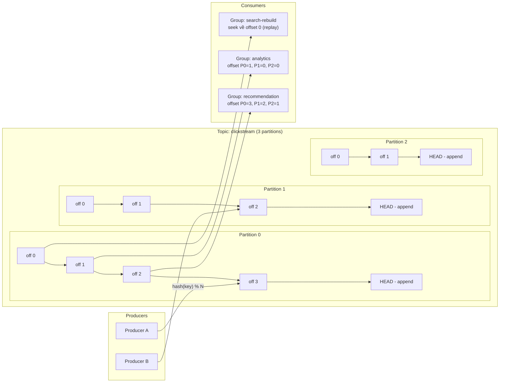
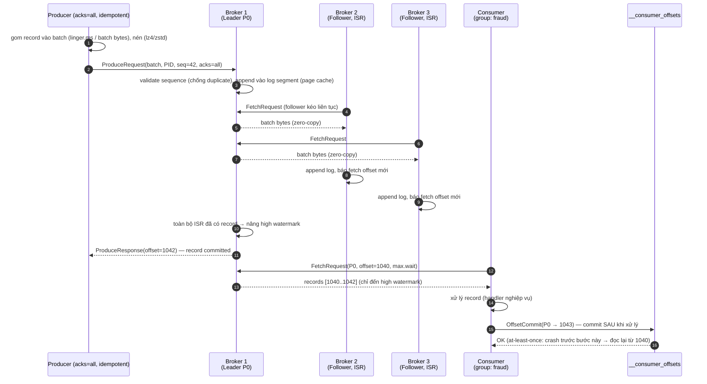

+++
title = "Chương 9: Event Streaming — Log phân tán và xử lý sự kiện quy mô lớn"
date = "2026-02-22T15:00:00+07:00"
draft = false
tags = ["backend", "communication", "api", "architecture"]
series = ["Backend Communication Architecture"]
+++

[← Chương trước](/series/backend-communication-architect/08-message-queue/) | Mục lục | [Chương sau →](/series/backend-communication-architect/10-so-sanh-communication-pattern/)

---

## 1. Problem Statement

Hãy bắt đầu bằng một bài toán thật, không phải định nghĩa sách giáo khoa.

Bạn vận hành một nền tảng thương mại điện tử. Mỗi hành động của người dùng — xem sản phẩm, thêm vào giỏ, tìm kiếm, click banner — sinh ra một event. Ở quy mô 10 triệu người dùng hoạt động, hệ thống của bạn sinh **2–5 triệu event mỗi giây** vào giờ cao điểm. Và đây là danh sách những bên muốn tiêu thụ dòng event đó:

1. **Team Recommendation** cần đọc clickstream gần realtime (độ trễ vài trăm ms) để cập nhật model gợi ý.
2. **Team Analytics** đọc theo batch mỗi 5 phút, đổ vào data warehouse.
3. **Team Fraud** đọc realtime nhưng xử lý chậm hơn (mỗi event phải chạy qua rule engine nặng).
4. **Team Search** cần rebuild lại index — nghĩa là đọc lại **toàn bộ event của 7 ngày qua** từ đầu.
5. Tháng sau, một team mới xuất hiện và muốn backfill dữ liệu lịch sử để train model.

Bây giờ thử giải bài toán này bằng message queue truyền thống (RabbitMQ classic queue, SQS, ActiveMQ) — mô hình bạn đã nắm ở Chương 8:

- **Queue xóa message sau khi ACK.** Message được deliver, consumer ACK, broker xóa. Team Search muốn "đọc lại 7 ngày" — dữ liệu không còn tồn tại. Bạn phải publish mỗi event vào N queue (fan-out exchange), mỗi team một bản copy. Storage nhân N, và team thứ N+1 xuất hiện sau vẫn không có dữ liệu lịch sử.
- **Consumer nhanh chậm khác nhau phá vỡ mô hình.** Team Fraud xử lý chậm → queue của họ phình ra hàng chục triệu message → memory/disk pressure trên broker → ảnh hưởng lây sang các queue khác (broker truyền thống giữ trạng thái delivery per-message: đã deliver chưa, đã ACK chưa, redeliver bao nhiêu lần — chi phí này tăng tuyến tính theo số message đang "bay").
- **Throughput per-queue có trần.** Broker phải làm việc per-message: routing, tracking ACK, quản lý redelivery. Ở 2–5 triệu msg/s, mô hình "smart broker" trở thành nghẽn cổ chai, scale bằng cách chẻ nhỏ queue thủ công là ác mộng vận hành.
- **Replay để sửa bug là bất khả thi.** Consumer có bug, xử lý sai 3 giờ dữ liệu. Với queue, dữ liệu đã bị xóa sau ACK. Bạn mất nó vĩnh viễn, trừ khi tự build một tầng lưu trữ song song — mà lúc đó bạn đang tự tay viết lại... một distributed log.

**Bài toán kỹ thuật cốt lõi:** cần một hệ thống mà (a) ghi hàng triệu event/giây bền vững, (b) **nhiều consumer độc lập đọc cùng một dữ liệu với tốc độ khác nhau** mà không ảnh hưởng lẫn nhau và không nhân bản storage, (c) dữ liệu tồn tại theo **chính sách retention** chứ không theo trạng thái tiêu thụ, (d) hỗ trợ **replay** — tua lại thời gian để backfill, sửa bug, dựng lại state.

**Giải pháp:** đảo ngược mô hình. Thay vì broker "thông minh" quản lý delivery per-message, hãy dùng cấu trúc dữ liệu đơn giản nhất có thể: **append-only distributed log**. Broker chỉ ghi tuần tự và phục vụ đọc tuần tự. Trạng thái tiêu thụ (đọc đến đâu) chuyển về phía consumer — chỉ là một con số: **offset**. Đó chính là Kafka, và là chủ đề của chương này.

## 2. Tại sao Event Streaming tồn tại

### 2.1. Từ First Principles: log là cấu trúc dữ liệu cổ nhất và bền nhất

Trước khi có Kafka, ý tưởng "append-only log" đã là xương sống của mọi hệ thống lưu trữ đáng tin cậy:

- **Write-ahead log (WAL)** trong PostgreSQL/MySQL: mọi thay đổi ghi vào log trước, rồi mới apply vào data file. Crash recovery = replay log.
- **Replication log** (MySQL binlog): replica đồng bộ bằng cách đọc log của primary, theo đúng thứ tự.
- **Event sourcing**: state của aggregate = fold toàn bộ event trong log.

Nhận xét then chốt của những người thiết kế Kafka tại LinkedIn (2010): *cái log vốn là chi tiết cài đặt nội bộ của database hoàn toàn có thể trở thành một dịch vụ hạ tầng độc lập, dùng chung cho toàn tổ chức.* Khi log trở thành first-class citizen:

- **Ghi tuần tự** → tận dụng tối đa sequential IO của disk (nhanh hơn random IO hàng trăm lần trên HDD, và vẫn nhanh hơn đáng kể trên SSD do giảm write amplification).
- **Đọc tuần tự từ một vị trí (offset)** → không cần index phức tạp, không cần tracking per-message.
- **Bất biến (immutable)** → không có update/delete per-record → không có lock contention, cache cực kỳ hiệu quả, replication đơn giản (chỉ là copy byte tuần tự).
- **Nhiều reader độc lập** → mỗi reader chỉ là một con trỏ (offset) trên cùng một log. Thêm consumer thứ 100 không tốn thêm storage, không ảnh hưởng consumer khác.

### 2.2. Khác biệt bản chất với message queue

Đây là điểm nhiều engineer nhầm lẫn nhất, nên cần nói thẳng: **Kafka không phải là "message queue nhanh hơn"**. Nó là một mô hình dữ liệu khác.

| Khía cạnh | Message Queue (Ch.8) | Distributed Log (Kafka) |
|---|---|---|
| Vòng đời message | Xóa sau ACK | Giữ theo retention (thời gian/kích thước), bất kể đã đọc hay chưa |
| Ai giữ trạng thái đọc | Broker (per-message delivery state) | Consumer (một offset per partition) |
| Nhiều consumer đọc cùng dữ liệu | Phải fan-out ra nhiều queue (copy dữ liệu) | Tự nhiên — mỗi consumer group một bộ offset trên cùng log |
| Replay | Không (dữ liệu đã xóa) | Có — seek offset về quá khứ |
| Ordering | Thường ở mức queue, dễ vỡ khi có redelivery/priority | Đảm bảo chặt chẽ per-partition |
| Routing | Linh hoạt (exchange, binding, header) | Thô sơ (topic + partition key) |
| Đơn vị scale | Queue + thêm consumer | Partition |

Hệ quả kiến trúc: queue tối ưu cho **task distribution** (mỗi job xử lý đúng một lần bởi một worker, rồi biến mất); log tối ưu cho **data distribution** (một dòng sự kiện, nhiều hệ thống hạ nguồn tiêu thụ theo cách riêng, và dữ liệu là tài sản có thể đọc lại).

## 3. Internal Architecture — Kafka đi sâu

### 3.1. Data Flow: append-only log, offset, retention, replay

Một **topic** trong Kafka là một cái tên logic. Vật lý, topic được chia thành nhiều **partition**; mỗi partition là một append-only log độc lập nằm trên disk của broker, cài đặt bằng một chuỗi **segment file** (mặc định 1GB/segment) kèm index file thưa (sparse index: offset → vị trí byte).

- Producer append record vào cuối partition. Record nhận một **offset** — số nguyên tăng đơn điệu, là định danh vị trí bất biến trong partition đó.
- Consumer đọc từ một offset và tự tăng con trỏ. **Broker không biết và không cần biết consumer đã "xử lý xong" record nào.** Việc đọc là một thao tác không phá hủy (non-destructive read).
- **Retention** quyết định khi nào dữ liệu bị xóa, hoàn toàn độc lập với việc tiêu thụ: `retention.ms` (ví dụ 7 ngày) hoặc `retention.bytes` per-partition. Xóa theo đơn vị segment file — rẻ, chỉ là delete file, không phải xóa từng record.
- **Replay** = set lại offset. Consumer group có thể seek về offset bất kỳ, hoặc theo timestamp (`offsetsForTimes`). Đây là thao tác O(1) về phía broker — không có "re-enqueue", không copy dữ liệu.



Ba consumer group đọc **cùng một dữ liệu vật lý** ở ba vị trí khác nhau. Đây là điều mà queue truyền thống không làm được nếu không nhân bản dữ liệu.

### 3.2. Partition: unit of parallelism và những hệ quả không thể né

**Partition là đơn vị của mọi thứ trong Kafka**: đơn vị song song hóa, đơn vị ordering, đơn vị replication, đơn vị phân bổ cho consumer.

**Ordering chỉ tồn tại per-partition.** Kafka không có ordering toàn topic. Hai record vào hai partition khác nhau không có quan hệ thứ tự nào. Đây không phải hạn chế mà là trade-off có chủ đích: ordering toàn cục đòi hỏi một điểm serialize duy nhất → giết chết khả năng scale. Bài học thiết kế: **chọn partition key sao cho những event cần thứ tự với nhau rơi vào cùng partition**. Với domain nghiệp vụ, key gần như luôn là aggregate id: `order_id`, `user_id`, `device_id`. Producer tính `partition = hash(key) % numPartitions` (murmur2 trong Java client; franz-go mặc định tương thích).

Hệ quả của hashing:
- **Key skew**: nếu 5% traffic đến từ một key nóng (user bot, tenant lớn), partition chứa key đó thành hot partition — consumer đọc partition đó tụt hậu trong khi các partition khác nhàn rỗi. Không có cách "chia nhỏ một key" mà vẫn giữ ordering; phải giải ở tầng nghiệp vụ (composite key, tách tenant lớn ra topic riêng).
- **Record không có key** được phân bổ theo sticky partitioner (batch đầy thì đổi partition) — tối ưu batching, nhưng đừng kỳ vọng thứ tự.

**Chọn số partition — quyết định khó đảo ngược.** Vì sao khó đổi về sau:

1. **Tăng partition phá vỡ mapping của key.** `hash(key) % 12` khác `hash(key) % 24`. Sau khi tăng, event mới của `order_123` rơi vào partition khác event cũ → **mất ordering tại thời điểm chuyển đổi**, và mọi state store partition-local (Kafka Streams, consumer tự giữ cache theo partition) bị sai.
2. **Không thể giảm số partition.** Kafka không hỗ trợ.
3. **Quá nhiều partition có chi phí thật**: mỗi partition là file handle + memory cho index + một entry trong replication protocol + kéo dài leader election khi broker chết. Cluster hàng trăm nghìn partition từng là lý do chính ZooKeeper trở thành nghẽn (KRaft cải thiện đáng kể, xem 3.8, nhưng chi phí per-partition không biến mất).

Kinh nghiệm thực chiến: ước lượng throughput đích 2–3 năm tới, chia cho throughput an toàn per-partition (thường 5–10 MB/s ghi tùy phần cứng), cộng headroom, và chọn số **chia hết cho nhiều số** (12, 24, 48) để dễ chia đều cho consumer. Thà thừa một chút còn hơn thiếu.

**Rebalancing — cái giá của consumer group co giãn.** Khi consumer join/leave group (deploy, crash, scale), broker phải phân bổ lại partition. Hai chiến lược:

- **Eager (stop-the-world)** — mặc định lịch sử: *mọi* consumer nhả *toàn bộ* partition, chờ phân bổ lại, rồi nhận partition mới. Trong khoảng đó (có thể vài giây đến hàng chục giây với group lớn), **toàn bộ group ngừng xử lý**. Deploy rolling 50 instance = 50 lần stop-the-world nối tiếp.
- **Cooperative sticky (incremental)** — từ Kafka 2.4: chỉ những partition thực sự cần di chuyển mới bị thu hồi, phần còn lại xử lý tiếp bình thường. Rebalance diễn ra qua hai vòng nhưng phần lớn group không dừng. Với production hiện đại, **cooperative sticky nên là mặc định** (franz-go: `kgo.Balancers(kgo.CooperativeStickyBalancer())`).

Liên quan: `session.timeout.ms` (bao lâu không heartbeat thì coi là chết), `max.poll.interval.ms` (bao lâu không poll thì coi là treo — handler chậm quá ngưỡng này sẽ **tự gây rebalance**, xem failure example ở mục 5.3), và static membership (`group.instance.id`) để restart nhanh không kích hoạt rebalance.

### 3.3. Consumer group: offset commit và ngữ nghĩa delivery

Consumer group là cơ chế chia việc: N partition chia cho M consumer trong group (mỗi partition thuộc đúng một consumer tại một thời điểm; nếu M > N thì có consumer ngồi không — lý do nữa để không chọn số partition quá nhỏ).

Trạng thái duy nhất group cần lưu là **committed offset** per partition — ghi vào topic nội bộ `__consumer_offsets`. Committed offset nghĩa là: "nếu tôi chết và restart, hãy bắt đầu đọc từ đây". Và đây là nơi ngữ nghĩa delivery được quyết định — **không phải bởi broker, mà bởi thứ tự bạn commit so với xử lý**:

| Chiến lược | Trình tự | Khi crash giữa chừng | Ngữ nghĩa |
|---|---|---|---|
| Commit **trước** khi xử lý | commit → process | Offset đã tiến nhưng record chưa xử lý → **mất** record | At-most-once |
| Commit **sau** khi xử lý | process → commit | Record đã xử lý nhưng offset chưa tiến → xử lý **lại** | At-least-once |
| Auto-commit (`enable.auto.commit`, mặc định 5s) | Commit nền theo chu kỳ, không đồng bộ với xử lý | Cả hai hướng đều có thể xảy ra, tùy thời điểm crash | Không xác định — tệ nhất của cả hai |

Nguyên tắc production: **manual commit sau khi xử lý xong** (at-least-once) + **handler idempotent**. Duplicate là chuyện chắc chắn xảy ra (crash, rebalance, retry) — hệ thống hạ nguồn phải chịu được. Idempotency thường rẻ hơn nhiều so với đuổi theo exactly-once (mục 3.6).

**Consumer lag** = log-end-offset − committed-offset, per partition. Đây là **metric quan trọng nhất của toàn hệ thống streaming**: lag tăng đơn điệu nghĩa là tốc độ tiêu thụ < tốc độ sản xuất — hoặc scale consumer, hoặc tối ưu handler, hoặc chấp nhận mất dữ liệu khi lag vượt retention (record chưa kịp đọc đã bị xóa — tình huống âm thầm và chết người).

### 3.4. Replication: leader, ISR, và các nút vặn durability

Mỗi partition có `replication.factor` bản sao (production: 3) đặt trên các broker khác nhau. Một replica là **leader** — mọi ghi/đọc mặc định đi qua leader; các **follower** kéo (fetch) dữ liệu từ leader, y hệt một consumer.

**ISR (In-Sync Replicas)** = tập replica đang "đuổi kịp" leader (fetch trong vòng `replica.lag.time.max.ms`, mặc định 30s). Record được coi là **committed** khi mọi replica trong ISR đã có nó; consumer chỉ đọc được đến **high watermark** — offset committed cao nhất. Khi leader chết, controller chọn leader mới **từ trong ISR** → không mất record đã committed.

Ba nút vặn quyết định bạn đứng đâu trên trục durability ↔ latency ↔ availability:

- **`acks` (producer)**:
  - `acks=0`: bắn và quên. Nhanh nhất, mất dữ liệu khi có bất kỳ trục trặc nào. Chỉ hợp lý cho metrics/telemetry chấp nhận mất.
  - `acks=1`: leader ghi xong là ACK. Leader chết trước khi follower kịp fetch → mất record đã ACK. Đây là cái bẫy phổ biến: "tôi đã nhận ACK mà dữ liệu vẫn mất".
  - `acks=all` (`-1`): chờ toàn bộ ISR. Kết hợp với nút thứ hai mới có ý nghĩa.
- **`min.insync.replicas`** (topic/broker): số replica tối thiểu trong ISR để chấp nhận ghi `acks=all`. Cấu hình chuẩn production: `replication.factor=3`, `min.insync.replicas=2` → chịu được 1 broker chết mà vẫn ghi được, và mọi record ACK tồn tại trên ≥2 máy. Nếu để `min.insync.replicas=1` (mặc định!), `acks=all` có thể suy biến thành `acks=1` khi ISR co lại còn mình leader — durability ảo.
- **`unclean.leader.election.enable`**: khi toàn bộ ISR chết, có cho phép một replica *ngoài* ISR (thiếu dữ liệu) lên làm leader không?
  - `false` (mặc định từ 0.11): partition **unavailable** cho đến khi một ISR member sống lại → chọn **durability, hy sinh availability**.
  - `true`: partition sống lại ngay nhưng **mất mọi record chưa replicate** sang leader mới, và có thể gây log divergence → chọn **availability, hy sinh durability**. Chấp nhận được cho clickstream, không bao giờ chấp nhận được cho payment.

Đây là CAP theorem hiện hình trong ba dòng config — và là câu hỏi phỏng vấn architect kinh điển vì nó không có đáp án đúng tuyệt đối, chỉ có đáp án đúng theo nghiệp vụ.



### 3.5. Vì sao Kafka nhanh — cơ chế, không phép màu

Kafka đạt hàng triệu record/giây trên phần cứng thường không phải nhờ code "tối ưu thần thánh" mà nhờ **né tránh có hệ thống những việc đắt đỏ**:

1. **Sequential IO.** Append vào cuối file, đọc quét tuần tự. Disk (kể cả SSD) và hệ điều hành được tối ưu hàng chục năm cho pattern này: read-ahead, write coalescing. Kafka không cần fsync mỗi record (durability đến từ replication, không từ fsync — một quyết định thiết kế táo bạo và đúng).
2. **Page cache thay vì heap cache.** Kafka không tự cache dữ liệu trong JVM heap; nó ghi vào file và để **OS page cache** làm việc. Lợi ích kép: không GC pressure, và cache "ấm" sống sót qua restart process. Consumer đọc dữ liệu mới ghi (trường hợp phổ biến nhất — tail read) gần như luôn hit page cache, không chạm disk.
3. **Zero-copy (`sendfile`).** Đường đọc truyền thống: disk → page cache → user buffer → socket buffer → NIC (4 lần copy, 2 lần context switch). Với `sendfile()`, dữ liệu đi thẳng page cache → NIC. Khả thi vì broker **không cần nhìn vào nội dung record** — format trên disk giống hệt format trên wire, kể cả phần nén. Broker chỉ là người vận chuyển byte. (Lưu ý: bật TLS làm mất zero-copy vì phải mã hóa trong user space — một trade-off security vs throughput có thật.)
4. **Batching xuyên suốt.** Producer gom record thành batch (`linger.ms`, `batch.size`); batch là đơn vị nén, đơn vị ghi, đơn vị replicate, đơn vị deliver. Chi phí per-request được khấu hao cho hàng trăm record. Đây là trade-off latency-vs-throughput tường minh: `linger.ms=0` cho latency thấp nhất, `linger.ms=5-20` cho throughput cao hơn nhiều lần.
5. **Compression per-batch** (lz4, zstd, snappy, gzip): nén cả batch một lần hiệu quả hơn nén từng record; broker lưu và chuyển tiếp nguyên khối nén — CPU nén trả bởi producer, giải nén bởi consumer, broker đứng ngoài.

Điểm mấu chốt cho architect: những tối ưu này **chỉ hoạt động vì mô hình dữ liệu là immutable log**. Nếu broker phải sửa message, track ACK per-message, re-order theo priority — toàn bộ chuỗi zero-copy/page-cache/batching sụp đổ. Tốc độ của Kafka là *hệ quả của sự đơn giản có kỷ luật*, không phải của sự phức tạp.

### 3.6. Exactly-once semantics — có thật, nhưng có biên giới

**Idempotent producer.** Vấn đề: producer gửi batch, không nhận ACK (timeout mạng), retry → duplicate trong log. Giải pháp (mặc định bật từ Kafka 3.0): mỗi producer nhận **PID (Producer ID)** khi khởi tạo; mỗi batch mang **sequence number** tăng dần per (PID, partition). Broker giữ sequence cuối cùng đã ghi; nhận batch có sequence trùng/cũ → từ chối lặng lẽ, trả ACK. Kết quả: **retry không tạo duplicate trong partition**, gần như miễn phí về hiệu năng. Luôn bật.

**Transactions.** Idempotent producer chỉ chống duplicate do retry trên *một* partition. Bài toán lớn hơn là **read-process-write**: consume từ topic A, xử lý, produce sang topic B, commit offset — ba thao tác phải nguyên tử. Kafka transactions cho phép: producer với `transactional.id` mở transaction, ghi vào nhiều partition + gửi offset commit vào cùng transaction, rồi commit/abort qua **transaction coordinator** (two-phase commit nội bộ, đánh dấu bằng control record trong log). Consumer hạ nguồn đặt `isolation.level=read_committed` sẽ không thấy record của transaction bị abort. Đây là nền tảng của Kafka Streams EOS.

**Và đây là phần quan trọng nhất — giới hạn:**

1. **Exactly-once chỉ trong biên giới Kafka.** Read-process-write từ Kafka sang Kafka: có. Nhưng nếu bước "process" gọi REST API, ghi PostgreSQL, gửi email — **Kafka transaction không bao trùm side effect đó**. Transaction abort rồi retry → email gửi hai lần. Không có cách nào Kafka "rút lại" một side effect bên ngoài.
2. **Với hệ thống ngoài, exactly-once thực chất là at-least-once + idempotency** (idempotency key trong DB, upsert theo event id, outbox/inbox pattern) hoặc CDC hai chiều. Đây là định luật của distributed systems, không phải thiếu sót của Kafka: *exactly-once delivery giữa hai hệ thống độc lập là bất khả thi; exactly-once processing (hiệu ứng như xử lý đúng một lần) là thứ đạt được — bằng idempotency.*
3. **Chi phí:** transactions thêm latency (coordinator round-trip, chờ commit marker), thêm độ phức tạp vận hành (transactional.id phải ổn định để fence zombie producer), và `read_committed` tăng end-to-end latency vì consumer chờ transaction đóng.

Lời khuyên thẳng: đa số hệ thống nên dừng ở **idempotent producer + at-least-once consumer + idempotent handler**. Chỉ dùng transactions khi pipeline thuần Kafka-to-Kafka và duplicate thực sự không chấp nhận được (ví dụ tính toán aggregate tài chính trong Kafka Streams).

### 3.7. Compacted topic — log như một database

Retention theo thời gian phù hợp cho event stream ("chuyện gì đã xảy ra"). Nhưng có lớp dữ liệu khác: **trạng thái mới nhất per key** — profile người dùng, giá sản phẩm, config, vị trí thiết bị. Với `cleanup.policy=compact`, Kafka chạy log compaction ở nền: **giữ lại ít nhất record mới nhất cho mỗi key**, xóa các phiên bản cũ; record với value = null (**tombstone**) đánh dấu xóa key.

Compacted topic biến Kafka thành một **changelog store**:

- Consumer mới đọc từ đầu topic → dựng lại **toàn bộ state hiện hành** (materialized view) mà không cần đọc lịch sử vô hạn.
- Kafka Streams dùng compacted topic làm changelog cho state store — restore state sau crash bằng replay.
- Pattern CDC (Debezium): mỗi bảng DB → một compacted topic keyed theo primary key; hạ nguồn luôn rebuild được bản sao của bảng.
- Event sourcing thực dụng: event stream (retention theo thời gian) + snapshot/state topic (compacted) song song.

Lưu ý vận hành: compaction chạy trễ (chỉ trên segment đã đóng), nên topic compacted vẫn có thể chứa duplicate tạm thời per key — consumer vẫn phải chịu được điều đó; và ordering per-key vẫn được giữ.

### 3.8. KRaft — bỏ ZooKeeper

Nhắc ngắn gọn vì đây là câu chuyện vận hành hơn là mô hình dữ liệu: Kafka lịch sử dùng ZooKeeper lưu metadata (broker membership, controller election, topic config). Đó là hệ thống thứ hai phải vận hành, và là nghẽn khi cluster có hàng trăm nghìn partition (controller failover phải đọc lại toàn bộ metadata từ ZK). **KRaft** (Kafka Raft, production-ready từ 3.3, bắt buộc từ Kafka 4.0) đưa metadata vào chính Kafka: một quorum controller chạy Raft, metadata chính là một event log (rất Kafka!) mà mọi broker replicate. Kết quả: một hệ thống duy nhất để vận hành, controller failover gần như tức thời, trần số partition cao hơn hàng chục lần. Với deployment mới: KRaft, không có lý do gì để bàn thêm.

### 3.9. Network Flow, Serialization, Transport, Connection Management

- **Transport:** binary protocol riêng của Kafka trên TCP dài hạn (long-lived connection), multiplexing request theo correlation id. Client duy trì connection tới *mọi* broker có partition liên quan — vì produce/fetch phải đi thẳng tới leader của từng partition (client-side routing dựa trên metadata cache; metadata refresh khi gặp `NOT_LEADER`).
- **Serialization:** Kafka chở byte thuần — schema là trách nhiệm của bạn. Production nghiêm túc dùng **Schema Registry** (Avro/Protobuf/JSON Schema) với compatibility mode (BACKWARD là mặc định hợp lý: consumer mới đọc được data cũ) để tránh thảm họa "producer đổi field, 12 consumer hạ nguồn sập lúc 2 giờ sáng". Contract của event stream còn quan trọng hơn contract của API — vì dữ liệu sống hàng tuần trong log, mọi consumer tương lai đều đọc lại nó.
- **Fetch model:** consumer **pull**, không phải broker push. Pull cho phép consumer tự điều tiết (backpressure tự nhiên), batch đọc hiệu quả, và replay đơn giản. Long-poll (`fetch.max.wait.ms` + `fetch.min.bytes`) giải quyết vấn đề "pull rỗng liên tục".
- **Connection management phía application:** producer là đối tượng nặng, thread-safe — **một producer cho cả process**, đừng tạo per-request (lỗi kinh điển làm chết cả app lẫn broker vì bão connection + mất sạch lợi ích batching).

## 4. Trade-off Analysis

| Trục | Đánh giá | Phân tích |
|---|---|---|
| **Latency** | Trung bình (ms → chục ms end-to-end) | Batching + replication (`acks=all`) + pull model đánh đổi latency lấy throughput. p99 end-to-end 10–100ms là bình thường. Cần sub-ms per-message → RabbitMQ/NATS phù hợp hơn. |
| **Bandwidth** | Xuất sắc | Batching + compression per-batch + zero-copy. Chi phí byte/record thấp nhất trong các hệ messaging. |
| **Complexity** | Cao | Partition, offset, rebalance, ISR, schema evolution — đường cong học tập dốc. Vô số nút vặn tương tác với nhau (acks × min.insync × unclean.election). |
| **Scalability** | Xuất sắc (theo partition) | Scale ghi/đọc tuyến tính bằng thêm partition + broker. Nhưng số partition là quyết định gần như một chiều. |
| **DX** | Trung bình | Client library trưởng thành (franz-go rất tốt cho Go), nhưng mô hình tư duy khác queue — team quen queue sẽ vấp (offset, rebalance, ordering per-partition). |
| **Operational Cost** | Cao | Cluster stateful, capacity planning disk/retention, monitoring lag + ISR, nâng cấp rolling cẩn thận. Managed service (MSK, Confluent Cloud) giảm mạnh nhưng đắt tiền. |
| **Compatibility** | Tốt | Protocol ổn định nhiều năm, ecosystem khổng lồ (Connect, Streams, Flink, Debezium, ksqlDB). Nhiều hệ thống khác nói "Kafka protocol" (Redpanda, WarpStream). |
| **Observability** | Tốt nhưng bắt buộc đầu tư | Lag, ISR shrink, under-replicated partitions, request latency per-broker — phải có dashboard từ ngày đầu, không phải khi cháy. |
| **Security** | Đầy đủ nhưng tốn kém | TLS (mất zero-copy), SASL, ACL per-topic. Multi-tenant cần quota để một team không nuốt cả cluster. |

## 5. Production

### 5.1. Production example — pipeline clickstream với franz-go

Bối cảnh: service ingest nhận event từ API gateway, produce vào topic `clickstream` (48 partition, RF=3, `min.insync.replicas=2`, retention 7 ngày); consumer group `fraud-detector` xử lý với manual commit sau xử lý.

**Producer — acks=all, idempotent, key theo aggregate id:**

```go
package main

import (
	"context"
	"encoding/json"
	"fmt"
	"time"

	"github.com/twmb/franz-go/pkg/kgo"
)

type ClickEvent struct {
	EventID   string    `json:"event_id"`   // UUID — idempotency key cho hạ nguồn
	UserID    string    `json:"user_id"`
	Action    string    `json:"action"`
	OccurredAt time.Time `json:"occurred_at"`
}

func newProducer(brokers []string) (*kgo.Client, error) {
	return kgo.NewClient(
		kgo.SeedBrokers(brokers...),
		// Durability: chờ toàn bộ ISR. Kết hợp min.insync.replicas=2 phía topic.
		kgo.RequiredAcks(kgo.AllISRAcks()),
		// franz-go bật idempotent producer mặc định khi acks=all;
		// KHÔNG gọi kgo.DisableIdempotentWrite().
		// Throughput: gom batch 20ms, nén zstd.
		kgo.ProducerLinger(20*time.Millisecond),
		kgo.ProducerBatchCompression(kgo.ZstdCompression()),
		kgo.ProducerBatchMaxBytes(1<<20), // 1 MiB
		// Retry an toàn vì idempotent: không tạo duplicate trong partition.
		kgo.RecordRetries(10),
		kgo.RecordDeliveryTimeout(30*time.Second),
	)
}

func produceClick(ctx context.Context, cl *kgo.Client, ev ClickEvent) error {
	val, err := json.Marshal(ev)
	if err != nil {
		return fmt.Errorf("marshal: %w", err)
	}
	rec := &kgo.Record{
		Topic: "clickstream",
		// Key = aggregate id: mọi event của một user vào cùng partition
		// → ordering per-user được đảm bảo.
		Key:   []byte(ev.UserID),
		Value: val,
	}
	// Produce async + callback là đường throughput cao;
	// ProduceSync chỉ dùng khi caller thật sự cần chờ.
	res := cl.ProduceSync(ctx, rec)
	if err := res.FirstErr(); err != nil {
		return fmt.Errorf("produce clickstream key=%s: %w", ev.UserID, err)
	}
	return nil
}
```

**Consumer group — manual commit sau xử lý, graceful shutdown, rebalance callback:**

```go
package main

import (
	"context"
	"log/slog"
	"os"
	"os/signal"
	"syscall"
	"time"

	"github.com/twmb/franz-go/pkg/kgo"
)

func newConsumer(brokers []string) (*kgo.Client, error) {
	return kgo.NewClient(
		kgo.SeedBrokers(brokers...),
		kgo.ConsumerGroup("fraud-detector"),
		kgo.ConsumeTopics("clickstream"),
		// Cooperative sticky: rebalance không stop-the-world.
		kgo.Balancers(kgo.CooperativeStickyBalancer()),
		// TẮT auto-commit: ta commit thủ công SAU khi xử lý (at-least-once).
		kgo.DisableAutoCommit(),
		// Rebalance callback: partition bị thu hồi → commit nốt phần đã
		// xử lý TRƯỚC KHI nhả, giảm tối đa duplicate cho chủ mới.
		kgo.OnPartitionsRevoked(func(ctx context.Context, cl *kgo.Client, revoked map[string][]int32) {
			slog.Info("partitions revoked, committing before handoff", "revoked", revoked)
			if err := cl.CommitMarkedOffsets(ctx); err != nil {
				slog.Error("commit on revoke failed", "err", err)
				// Không panic: hậu quả chỉ là duplicate — handler đã idempotent.
			}
		}),
		kgo.OnPartitionsAssigned(func(_ context.Context, _ *kgo.Client, assigned map[string][]int32) {
			slog.Info("partitions assigned", "assigned", assigned)
		}),
	)
}

func runConsumer(cl *kgo.Client, handle func(context.Context, *kgo.Record) error) {
	ctx, stop := signal.NotifyContext(context.Background(), syscall.SIGINT, syscall.SIGTERM)
	defer stop()

	for {
		fetches := cl.PollFetches(ctx)
		if fetches.IsClientClosed() || ctx.Err() != nil {
			break
		}
		fetches.EachError(func(topic string, p int32, err error) {
			slog.Error("fetch error", "topic", topic, "partition", p, "err", err)
		})

		fetches.EachRecord(func(rec *kgo.Record) {
			// Xử lý TRƯỚC...
			if err := handle(ctx, rec); err != nil {
				// Lỗi xử lý: KHÔNG mark → offset không tiến → sẽ đọc lại.
				// Production: phân loại lỗi, retry có giới hạn, rồi đẩy DLQ topic.
				slog.Error("handle failed", "partition", rec.Partition,
					"offset", rec.Offset, "err", err)
				return
			}
			// ...mark SAU. Mark chỉ ghi nhận trong bộ nhớ client.
			cl.MarkCommitRecords(rec)
		})

		// Commit theo batch sau mỗi vòng poll — cân bằng giữa
		// tần suất commit (chi phí) và cửa sổ duplicate khi crash.
		if err := cl.CommitMarkedOffsets(ctx); err != nil {
			slog.Error("commit failed", "err", err)
		}
	}

	// Graceful shutdown: commit nốt rồi mới rời group.
	shutdownCtx, cancel := context.WithTimeout(context.Background(), 10*time.Second)
	defer cancel()
	if err := cl.CommitMarkedOffsets(shutdownCtx); err != nil {
		slog.Error("final commit failed", "err", err)
	}
	cl.Close() // LeaveGroup → rebalance ngay thay vì chờ session timeout
	slog.Info("consumer stopped cleanly")
	os.Exit(0)
}
```

Những quyết định đáng chú ý trong code trên — vì chúng là nơi ngữ nghĩa được quyết định chứ không phải chi tiết vặt: (1) key theo `UserID` giữ ordering per-user; (2) `DisableAutoCommit` + mark-sau-xử-lý = at-least-once; (3) commit trong `OnPartitionsRevoked` thu hẹp cửa sổ duplicate khi rebalance; (4) `Close()` chủ động khi shutdown để group rebalance ngay lập tức thay vì đợi session timeout (mặc định 45s — 45 giây partition "mồ côi" mỗi lần deploy nếu bạn quên).

### 5.2. Benchmark minh họa

*Số liệu minh họa, phụ thuộc rất mạnh vào phần cứng, cấu hình, kích thước message, và cách đo — chỉ dùng để cảm nhận bậc độ lớn (order of magnitude), tuyệt đối không dùng để ra quyết định thay cho benchmark trên workload thật của bạn.*

Kịch bản: message 1KB, 3 node cluster, replication factor 3 (Kafka: `acks=all`, `min.insync.replicas=2`; RabbitMQ: quorum queue; NATS JetStream: replicas=3), producer/consumer cân bằng.

| Chỉ số | Kafka | RabbitMQ (quorum) | NATS JetStream | NATS Core (không persist) |
|---|---|---|---|---|
| Throughput ghi (msg/s, 1KB) | ~800K–2M | ~30K–60K | ~200K–400K | ~5M–10M+ |
| Throughput đọc tổng (nhiều consumer đọc cùng data) | Không tăng chi phí ghi (log dùng chung) | Nhân theo số queue fan-out | Log dùng chung | Fan-out trong RAM |
| p50 latency end-to-end | 5–15 ms | 1–3 ms | 2–5 ms | < 0.5 ms |
| p99 latency | 20–80 ms | 5–20 ms | 10–40 ms | 1–3 ms |
| Replay 1TB dữ liệu lịch sử | Có, tốc độ gần disk/network line-rate | Không (stream type mới: có, giới hạn) | Có (trong retention) | Không |
| Suy giảm khi backlog 100M message | Không đáng kể (backlog chỉ là byte trên disk) | Đáng kể (per-message state) | Trung bình | N/A (không backlog) |

Đọc bảng này đúng cách: khoảng cách throughput Kafka vs RabbitMQ không nói rằng RabbitMQ "chậm" — nó nói rằng hai hệ trả chi phí cho những việc khác nhau. RabbitMQ trả chi phí per-message cho routing thông minh và delivery tracking; Kafka khấu hao mọi chi phí vào batch và từ chối làm việc per-message. Chọn theo việc bạn cần, không theo con số to nhất.

### 5.3. Failure example — consumer lag tăng không kiểm soát do slow handler

Sự cố có thật về mặt cấu trúc (đã ẩn danh hóa), và là sự cố Kafka phổ biến số một trong thực tế:

**Bối cảnh.** Group `fraud-detector`, 48 partition, 16 consumer pod. Handler gọi thêm một rule mới: lookup sang service scoring qua HTTP, bình thường mất 5ms.

**Diễn biến.**
1. 14:00 — service scoring bị chậm (GC, hoặc DB của nó chậm): p99 từ 5ms lên 2s. Handler xử lý tuần tự từng record trong vòng poll → mỗi vòng poll 500 record giờ mất ~1000s thay vì ~3s.
2. 14:03 — vượt `max.poll.interval.ms` (5 phút): broker coi consumer là **treo**, đá khỏi group → rebalance. Partition của pod đó chuyển sang pod khác — pod đó cũng đang chậm y hệt → lại bị đá → **rebalance dây chuyền (rebalance storm)**. Group dành phần lớn thời gian để... rebalance thay vì xử lý.
3. 14:10 — lag từ vài nghìn lên 40 triệu và tăng tuyến tính theo producer rate. Dashboard đỏ. On-call scale từ 16 lên 48 pod — **không giúp gì thêm nữa** vì 48 partition = tối đa 48 consumer hoạt động, và nghẽn nằm ở service scoring chứ không ở số consumer.
4. 14:30 — mỗi lần record được xử lý lại (do rebalance làm mất commit) lại gọi scoring service thêm lần nữa → **retry amplification** đẩy scoring service chết hẳn. Hai sự cố ghép thành một.
5. Nguy cơ tiếp theo (may mắn chưa tới): nếu tình trạng kéo dài quá retention của topic, record chưa xử lý bị xóa — mất dữ liệu vĩnh viễn mà không có lỗi nào được ném ra.

**Mổ xẻ nguyên nhân gốc:**
- Handler **blocking tuần tự** trong poll loop — throughput của partition bị trói vào latency của dependency chậm nhất.
- Không có **timeout + circuit breaker** quanh HTTP call → một dependency chậm kéo sập consumer.
- Không alert trên **lag tăng theo đạo hàm** (chỉ alert trên ngưỡng tuyệt đối, khi bắn thì đã quá muộn) và không alert trên tần suất rebalance.
- Không hiểu ràng buộc **consumer ≤ partition** khi scale.

### 5.4. Refactoring example — worker pool per-partition, giữ ordering theo key

Cách sửa sai lầm thường thấy: "cứ ném mỗi record vào một goroutine". Sai, vì mất ordering (event `user_A/add_to_cart` có thể xử lý sau `user_A/checkout`) và mất kiểm soát commit (commit offset 105 khi 103 chưa xong → crash là mất 103).

Cách sửa đúng, dựa trên nhận xét: **ordering chỉ cần per-key, mà Kafka đã gom key vào partition** — vậy đơn vị tuần tự hóa đúng là partition (hoặc mịn hơn: key), và các partition được xử lý song song với nhau:

```go
package main

import (
	"context"
	"log/slog"
	"sync"
	"time"

	"github.com/twmb/franz-go/pkg/kgo"
)

// partitionWorker: MỘT goroutine per partition. Trong một partition,
// record xử lý tuần tự → ordering per-key được bảo toàn (vì mọi record
// cùng key nằm cùng partition). Các partition chạy song song.
type partitionWorker struct {
	recs   chan []*kgo.Record
	quit   chan struct{}
	done   chan struct{}
}

type consumerApp struct {
	cl      *kgo.Client
	handle  func(context.Context, *kgo.Record) error
	mu      sync.Mutex
	workers map[tp]*partitionWorker // key: topic+partition
}

type tp struct {
	topic     string
	partition int32
}

func newConsumerApp(brokers []string, handle func(context.Context, *kgo.Record) error) (*consumerApp, error) {
	app := &consumerApp{
		handle:  handle,
		workers: make(map[tp]*partitionWorker),
	}
	cl, err := kgo.NewClient(
		kgo.SeedBrokers(brokers...),
		kgo.ConsumerGroup("fraud-detector"),
		kgo.ConsumeTopics("clickstream"),
		kgo.Balancers(kgo.CooperativeStickyBalancer()),
		kgo.DisableAutoCommit(),
		// Lifecycle worker gắn với lifecycle partition assignment:
		kgo.OnPartitionsAssigned(app.assigned),
		kgo.OnPartitionsRevoked(app.revoked),
		// Tạm dừng fetch partition đang backlog cục bộ được xử lý
		// qua PauseFetchPartitions nếu cần backpressure mịn hơn.
	)
	if err != nil {
		return nil, err
	}
	app.cl = cl
	return app, nil
}

func (a *consumerApp) assigned(_ context.Context, _ *kgo.Client, m map[string][]int32) {
	a.mu.Lock()
	defer a.mu.Unlock()
	for topic, parts := range m {
		for _, p := range parts {
			w := &partitionWorker{
				recs: make(chan []*kgo.Record, 4), // bounded → backpressure
				quit: make(chan struct{}),
				done: make(chan struct{}),
			}
			a.workers[tp{topic, p}] = w
			go a.runWorker(w)
		}
	}
}

func (a *consumerApp) revoked(ctx context.Context, cl *kgo.Client, m map[string][]int32) {
	a.mu.Lock()
	for topic, parts := range m {
		for _, p := range parts {
			key := tp{topic, p}
			if w, ok := a.workers[key]; ok {
				close(w.quit)
				<-w.done // chờ worker xử lý nốt batch dở — KHÔNG bỏ ngang
				delete(a.workers, key)
			}
		}
	}
	a.mu.Unlock()
	// Commit phần đã xử lý trước khi nhả partition cho chủ mới.
	if err := cl.CommitMarkedOffsets(ctx); err != nil {
		slog.Error("commit on revoke failed", "err", err)
	}
}

func (a *consumerApp) runWorker(w *partitionWorker) {
	defer close(w.done)
	for {
		select {
		case <-w.quit:
			return
		case batch := <-w.recs:
			for _, rec := range batch {
				// Timeout per-record: dependency chậm không còn treo
				// vòng poll — max.poll.interval không bao giờ bị vượt
				// vì poll loop không chờ xử lý nữa.
				ctx, cancel := context.WithTimeout(context.Background(), 3*time.Second)
				err := a.handle(ctx, rec)
				cancel()
				if err != nil {
					// Retry tại chỗ có giới hạn; quá ngưỡng → DLQ topic
					// rồi VẪN mark để partition không kẹt vĩnh viễn.
					slog.Error("handle failed, routing to DLQ",
						"offset", rec.Offset, "err", err)
					// produceDLQ(rec) — lược bớt cho gọn
				}
				a.cl.MarkCommitRecords(rec) // mark theo đúng thứ tự partition
			}
		}
	}
}

func (a *consumerApp) run(ctx context.Context) {
	commitTicker := time.NewTicker(2 * time.Second)
	defer commitTicker.Stop()
	for {
		select {
		case <-ctx.Done():
			return
		case <-commitTicker.C:
			if err := a.cl.CommitMarkedOffsets(ctx); err != nil {
				slog.Error("periodic commit failed", "err", err)
			}
		default:
		}
		fetches := a.cl.PollFetches(ctx)
		if fetches.IsClientClosed() {
			return
		}
		// Poll loop giờ CHỈ phân phối — không xử lý, không block:
		fetches.EachPartition(func(p kgo.FetchTopicPartition) {
			a.mu.Lock()
			w, ok := a.workers[tp{p.Topic, p.Partition}]
			a.mu.Unlock()
			if ok && len(p.Records) > 0 {
				w.recs <- p.Records // channel đầy → block → backpressure tự nhiên
			}
		})
	}
}
```

Kết quả của lần refactor này trong sự cố kể trên:

- Poll loop không còn bị handler chặn → không bao giờ vượt `max.poll.interval.ms` → **hết rebalance storm**.
- Dependency chậm chỉ làm chậm *các partition đang chờ nó*, kèm timeout 3s + (nên thêm) circuit breaker → sự cố được cô lập.
- Ordering per-key nguyên vẹn vì mỗi partition vẫn tuần tự. Nếu cần song song mịn hơn nữa trong một partition, chia tiếp theo `hash(key) % K` vào K worker con — ordering per-key vẫn giữ, nhưng lưu ý commit phải theo offset thấp nhất chưa hoàn thành (low-watermark commit), phức tạp hơn đáng kể; chỉ làm khi đo đạc chứng minh cần.
- Bounded channel tạo backpressure: consumer chậm thì fetch chậm lại, backlog nằm an toàn trên disk của Kafka (nơi nó rẻ) thay vì trong RAM của consumer (nơi nó gây OOM).

Kèm theo về vận hành: alert theo **tốc độ tăng của lag** (derivative) chứ không chỉ ngưỡng tuyệt đối; alert khi `join-rate`/`rebalance-rate` bất thường; dashboard lag per-partition để nhìn thấy key skew.

## 6. So sánh bản chất các nền tảng streaming/messaging

Nguyên tắc đọc phần này: đừng hỏi "cái nào tốt nhất" — hãy hỏi "kiến trúc này trả chi phí ở đâu để mua cái gì". Mỗi hệ dưới đây là một lời giải *đúng* cho một bài toán *khác nhau*.

### 6.1. Kafka — distributed log thuần chất

**Kiến trúc:** như toàn bộ phần 3. Broker gắn chặt với storage cục bộ (mỗi partition sống trên disk của broker cụ thể). Đơn giản hóa triệt để phía broker, đẩy sự thông minh ra client.

**Điểm mạnh có tính kiến trúc:** throughput/chi phí tốt nhất khi workload là dòng event lớn, tuần tự; replay hạng nhất; ecosystem không đối thủ (Connect, Streams, Flink, Debezium, schema registry, kỹ năng tuyển dụng được).

**Chi phí phải trả:** storage gắn broker → scale storage = thêm broker hoặc rebalance partition (di chuyển dữ liệu thật, tốn network và thời gian); số partition gần như bất biến; latency per-message không phải thế mạnh; vận hành stateful cluster nghiêm túc.

**Chọn khi:** event backbone của tổ chức, analytics/CDC pipeline, event sourcing, throughput từ hàng chục nghìn msg/s trở lên, cần replay và nhiều consumer độc lập, team đủ sức vận hành (hoặc đủ ngân sách managed).

### 6.2. Pulsar — tách compute khỏi storage

**Kiến trúc — và vì sao nó tồn tại:** Pulsar (Yahoo) sinh ra từ chính nỗi đau vận hành của mô hình Kafka ở quy mô rất lớn: *broker gắn storage nghĩa là mọi thao tác vận hành (thêm node, thay node hỏng, cân lại tải) đều kéo theo di chuyển dữ liệu*. Pulsar cắt đôi:

- **Broker layer — stateless**: nhận produce/consume, cache, không sở hữu dữ liệu. Broker chết? Topic chuyển sang broker khác trong *giây* — không copy byte nào.
- **Storage layer — Apache BookKeeper**: các node "bookie" lưu **segment (ledger)**. Một partition không phải là một log liền mạch trên một máy, mà là **chuỗi segment rải đều trên nhiều bookie**. Segment đầy → mở segment mới, có thể trên bộ bookie khác. Thêm bookie → segment mới tự động dùng nó, **không cần rebalance dữ liệu cũ**.
- **Tiered storage**: segment cũ đẩy xuống S3/GCS tự động; retention hàng năm với chi phí object storage; replay đọc xuyên qua tier trong suốt với client.

Đổi lại: **ba hệ phân tán trong một** (broker + BookKeeper + ZooKeeper/metadata) — chi phí vận hành và độ khó troubleshooting cao hơn Kafka rõ rệt; ecosystem, tooling, cộng đồng, và mặt bằng kỹ năng tuyển dụng mỏng hơn nhiều; path ghi qua hai lớp (broker → bookie) thêm một network hop. Pulsar cũng gộp cả ngữ nghĩa queue (shared subscription, per-message ACK, delay message, DLQ tích hợp) lẫn streaming — hấp dẫn trên giấy, nhưng "một hệ làm cả hai" cũng nghĩa là một hệ phải vận hành giỏi cả hai.

**Chọn khi:** rất nhiều topic/tenant (multi-tenancy là thiết kế gốc: namespace, quota, isolation), retention rất dài với tiered storage là yêu cầu hạng nhất, cần cả ngữ nghĩa queue lẫn stream trong một nền tảng, geo-replication tích hợp — **và** tổ chức đủ trưởng thành vận hành để trả chi phí phức tạp đó. Nếu không có các yêu cầu đó, Kafka đơn giản hơn để sống cùng. (Đáng chú ý: chính Kafka cũng đang đi về hướng này — KIP-405 tiered storage — xác nhận rằng hướng kiến trúc của Pulsar đúng về storage, dù cái giá tổng thể còn tranh luận.)

### 6.3. RabbitMQ — smart broker, dumb consumer

**Kiến trúc:** đối cực của Kafka. Broker sở hữu sự thông minh: **exchange** (direct, topic, fanout, headers) định tuyến message vào queue theo binding rule; broker theo dõi từng message (delivered? acked? requeue?), hỗ trợ priority, TTL per-message, dead-letter exchange, consumer prefetch. Consumer chỉ việc nhận và ACK. Truyền thống dùng mirrored queue (nay deprecated); hiện đại dùng **quorum queue** (Raft-based, durability nghiêm túc) và **stream** (kiểu log, append-only, có replay — RabbitMQ thừa nhận mô hình log bằng cách... thêm nó vào).

**Vì sao tồn tại:** rất nhiều bài toán là **task routing** chứ không phải data streaming: "đơn hàng vùng EU khớp rule X → queue của worker EU, ưu tiên cao xử lý trước, thất bại 3 lần thì vào DLQ, mỗi task đúng một worker xử lý rồi biến mất". Mô hình log làm việc này rất vụng (consumer phải tự lọc, không có priority, không có per-message TTL); smart broker làm nó tự nhiên.

**Chi phí:** per-message state là trần throughput (hàng chục nghìn msg/s per queue là thực tế, so với hàng trăm nghìn+ per partition set của Kafka); backlog lớn làm broker khổ sở; replay không phải công dân hạng nhất (trừ stream type). Bù lại **latency per-message thấp hơn Kafka** (không chờ batch, push model) — 1–5ms là bình thường.

**Chọn khi:** task queue, routing phức tạp theo nội dung/topology, RPC-over-messaging, delay/priority/TTL per-message, throughput vừa phải (< ~50K msg/s), muốn latency thấp per-message, team muốn thứ dễ vận hành hơn Kafka. Đây vẫn là lựa chọn *đúng* cho đa số bài toán background job — đừng để hào quang Kafka che mất điều đó.

### 6.4. NATS — nhẹ đến mức triệt để

**Kiến trúc:** một binary Go duy nhất, vài MB, khởi động trong ms. **NATS Core**: pub/sub subject-based (`orders.eu.created`, wildcard `orders.*.created`), **at-most-once, trong RAM, không persistence** — subscriber offline là mất message, và đó là *tính năng*: không state nghĩa là nhanh khủng khiếp (hàng triệu msg/s một node, latency µs–sub-ms) và vận hành gần như bằng không. Request-reply là first-class. Clustering + supercluster + **leaf node** cho topology edge.

**JetStream** (tích hợp sẵn): tầng persistence opt-in — stream lưu message theo Raft replication, consumer có ACK, replay, retention theo limit/interest/workqueue. Đưa NATS vào lãnh thổ "streaming nhẹ", nhưng đừng nhầm: về throughput bền vững, độ chín của ecosystem xử lý stream (Connect/Streams/Flink tương đương), và tooling vận hành ở quy mô rất lớn, JetStream chưa phải đối trọng của Kafka — nó không cố trở thành.

**Vì sao tồn tại:** có một lớp bài toán mà cả Kafka lẫn RabbitMQ đều quá nặng: **control plane messaging** (service discovery, command/response giữa service, health signal), **IoT/edge** (chạy trên gateway ARM vài trăm MB RAM, leaf node đồng bộ về trung tâm khi có mạng), telemetry chấp nhận mất. Ở đó, "không có gì để vận hành" là tính năng ăn tiền nhất.

**Chọn khi:** IoT/edge, control plane, service mesh messaging nội bộ, latency sub-ms, footprint nhỏ; JetStream khi cần persistence mức vừa mà không muốn nuôi Kafka. **Không chọn** làm analytics backbone hàng TB/ngày.

### 6.5. Redis Streams — streaming cho người đã có Redis

**Kiến trúc:** stream là một data type của Redis (radix tree trong RAM): `XADD` append entry (ID = timestamp-sequence, chính là offset), `XREAD` đọc theo vị trí, `XREADGROUP` + consumer group với **PEL (Pending Entries List)** theo dõi entry đã deliver chưa ACK, `XAUTOCLAIM` nhận lại entry của consumer chết, `MAXLEN`/`MINID` cắt tỉa stream.

**Vì sao tồn tại:** nếu bạn **đã có Redis** trong stack và cần một event stream khiêm tốn (vài nghìn–vài chục nghìn msg/s, retention ngắn, vài consumer group), Redis Streams cho bạn 70% ngữ nghĩa Kafka với **0% hạ tầng mới**. Đó là một trade-off rất hợp lý ở giai đoạn đầu.

**Giới hạn phải nói thẳng:** (1) **RAM-bound** — retention dài đồng nghĩa RAM đắt đỏ, stream lớn hơn RAM là hết chuyện; (2) **durability** phụ thuộc AOF/RDB — `everysec` mất tới 1s dữ liệu khi crash, replication mặc định async → failover có thể mất dữ liệu đã ACK; (3) **scale ngang thủ công** — một stream sống trên một shard, muốn parallelism kiểu partition phải tự chẻ N stream và tự làm hashing, tự làm rebalancing... tức là tự cài đặt lại phần khó nhất của Kafka bằng tay; (4) không tiered storage, không schema ecosystem. Redis Streams là **bậc thang**, không phải đích đến: thiết kế để pattern (append, offset, consumer group, idempotent handler) di chuyển được sang Kafka khi quy mô đòi hỏi.

### 6.6. Bảng so sánh tổng hợp

*Đánh giá mang tính tương đối giữa các hệ trong bảng, cho cấu hình production điển hình; luôn kiểm chứng trên workload của bạn.*

| Tiêu chí | Kafka | Pulsar | RabbitMQ | NATS (Core / JetStream) | Redis Streams |
|---|---|---|---|---|---|
| Model | Distributed partitioned log | Segment-based log (BookKeeper), compute/storage tách rời | Smart broker, exchange/queue (+ quorum, stream type) | Subject pub/sub / log-lite (JetStream) | In-memory log trong Redis |
| Throughput | Rất cao | Rất cao | Trung bình | Cực cao (Core) / Cao (JS) | Trung bình (RAM-bound) |
| Latency per-message | ms–chục ms | ms–chục ms | Thấp (1–5ms) | Cực thấp (µs) / Thấp | Rất thấp (in-memory) |
| Durability | Rất cao (ISR, acks=all) | Rất cao (BookKeeper quorum write) | Cao (quorum queue) | Không (Core) / Cao (JS Raft) | Trung bình (AOF/async repl) |
| Ordering | Per-partition | Per-partition (per-key với Key_Shared có ràng buộc) | Per-queue, dễ vỡ khi redelivery | Per-subject (JS) | Per-stream |
| Replay | Hạng nhất | Hạng nhất (+ tiered, rất dài) | Chỉ stream type | JetStream: có | Có, trong giới hạn RAM |
| Routing | Thô (topic/key) | Trung bình (namespace, regex sub) | Xuất sắc (exchange/binding/header) | Tốt (subject wildcard) | Thô |
| Delivery semantics | At-least-once; EOS trong ecosystem | At-least-once; dedup + txn | At-least-once / at-most-once | At-most-once (Core); at-least-once, dedup (JS) | At-least-once (PEL) |
| Operational cost | Cao | Rất cao (3 hệ trong 1) | Trung bình | Rất thấp / Thấp | Rất thấp nếu đã có Redis |
| Ecosystem | Không đối thủ | Khá, mỏng hơn nhiều | Trưởng thành (AMQP) | Gọn, đang lớn | Là một phần Redis |
| Sweet spot | Event backbone, analytics, CDC | Multi-tenant lớn, retention rất dài | Task queue, routing phức tạp | Edge/IoT, control plane | Stream nhỏ khi đã có Redis |

## 7. Anti-pattern

1. **Dùng Kafka làm request-response.** Produce request vào topic A, chờ response ở topic B với correlation id. Latency chồng chất (batch, poll), timeout semantics tự chế, scale consumer làm response lạc chỗ. Cần RPC thì dùng gRPC/HTTP; Kafka là dòng chảy một chiều. (Chi tiết ở Chương 10.)
2. **Topic per entity / topic bùng nổ.** Tạo topic per-user, per-order. Hàng trăm nghìn topic × partition × replica đè chết metadata layer. Đúng: ít topic, key theo entity.
3. **Coi Kafka là database chính.** "Dữ liệu đã ở trong Kafka rồi, query luôn ở đó" — Kafka không có index, không có query per-key (trừ compacted + full scan). Kafka là hệ tuần hoàn, không phải hệ lưu trữ truy vấn; materialize vào DB/cache để đọc.
4. **Auto-commit + xử lý bất đồng bộ.** Cửa sổ mất message vô hình. Đã dùng consumer group nghiêm túc thì commit thủ công, sau xử lý.
5. **`acks=all` mà `min.insync.replicas=1`.** Durability ảo — ISR co về 1 là acks=all thành acks=1. Cặp config này phải đi cùng nhau.
6. **Một consumer group cho nhiều mục đích xử lý khác nhau.** Hai luồng logic (ghi DB + gửi notification) trong một handler: một bên chậm kéo lag cả hai, retry bên này gây duplicate bên kia. Tách group — đó chính là lý do consumer group độc lập tồn tại.
7. **Producer per-request.** Tạo `kgo.Client` mỗi HTTP request: bão connection, mất batching, mất idempotency session. Producer là singleton của process.
8. **Message khổng lồ trong log.** Nhét file 50MB vào record. Đúng: claim-check pattern — file vào S3, record chở reference.
9. **Bỏ qua schema management.** JSON tự do không registry: mỗi lần đổi field là một canh bạc với mọi consumer hiện tại *và tương lai* (vì replay đọc lại data cũ).

## 8. Khi nào KHÔNG nên dùng Kafka / Event Streaming

- **Throughput thấp (< vài nghìn msg/s) và không cần replay/multi-consumer:** RabbitMQ, SQS, hay PostgreSQL `LISTEN/NOTIFY` + bảng outbox rẻ hơn cả về vận hành lẫn nhận thức. Kafka cho 200 msg/s là dùng xe container đi chợ.
- **Cần request-response đồng bộ:** gRPC/HTTP. Đừng uốn log thành RPC.
- **Task queue với routing/priority/delay per-message:** RabbitMQ làm tự nhiên, Kafka làm gượng gạo (delay queue trên Kafka là cả một dự án).
- **Team chưa có năng lực vận hành stateful cluster và không có ngân sách managed service:** Kafka tự vận hành nửa vời nguy hiểm hơn không dùng — mất dữ liệu do config sai (unclean election, min.insync=1) tệ hơn là chậm.
- **Edge/thiết bị tài nguyên thấp:** NATS/MQTT ở edge, Kafka chỉ ở tầng ingest trung tâm.
- **Yêu cầu ordering toàn cục tuyệt đối với throughput cao:** không hệ nào trong chương này cho bạn cả hai; xem lại yêu cầu nghiệp vụ trước khi xem công nghệ — thường "ordering toàn cục" thật ra chỉ là "ordering per-aggregate", và cái đó Kafka làm được.
- **Dữ liệu cần query ad-hoc, update, delete per-record (kể cả vì GDPR right-to-erasure):** log bất biến là trở ngại, không phải lợi thế. (Workaround như crypto-shredding tồn tại nhưng là gánh nặng.)

Câu hỏi kiểm tra cuối cùng trước khi chọn Kafka, theo đúng tinh thần chương này: **"Dữ liệu của tôi có phải là một dòng sự kiện mà nhiều hệ thống sẽ đọc theo cách riêng, hôm nay và cả sau này?"** Nếu có — distributed log là mô hình đúng và Kafka là mặc định hợp lý. Nếu không — bạn đang tìm một cái queue, một cái RPC, hoặc một cái database, và chương 8, 5, hoặc một cuốn sách khác sẽ phục vụ bạn tốt hơn.

---

[← Chương trước](/series/backend-communication-architect/08-message-queue/) | Mục lục | [Chương sau →](/series/backend-communication-architect/10-so-sanh-communication-pattern/)
