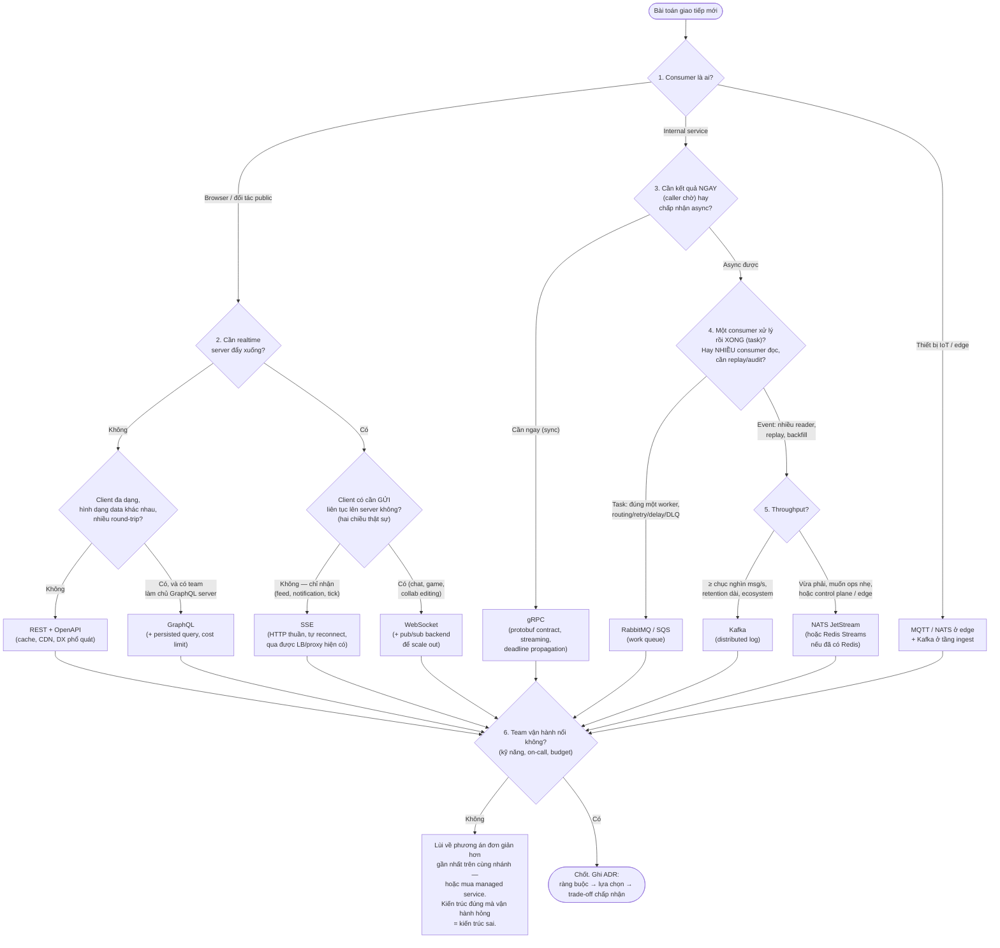

+++
title = "Chương 10: So sánh Communication Pattern và Framework quyết định"
date = "2026-02-22T16:00:00+07:00"
draft = false
tags = ["backend", "communication", "api", "architecture"]
series = ["Backend Communication Architecture"]
+++

[← Chương trước](/series/backend-communication-architect/09-event-streaming/) | Mục lục | [Chương sau →](/series/backend-communication-architect/11-api-design/)

---

## 1. Problem Statement

Chín chương vừa qua đã mổ xẻ từng công nghệ. Bây giờ là câu hỏi mà mọi architect phải trả lời hàng tuần, và là câu hỏi bị trả lời sai nhiều nhất:

> "Service A cần nói chuyện với Service B / với client. Dùng cái gì?"

Cách câu hỏi này thường bị trả lời sai trong thực tế:

- **Theo trào lưu:** "Netflix dùng gRPC nên mình dùng gRPC" — trong khi consumer của bạn là browser của khách hàng bên thứ ba.
- **Theo quán tính:** "Team mình biết REST nên mọi thứ là REST" — kể cả đường internal 50K req/s đang đốt 40% CPU vào JSON marshal.
- **Theo cú pháp thay vì ngữ nghĩa:** "WebSocket và SSE đều là realtime, chọn đại một cái" — bỏ qua việc một cái là hai chiều stateful, một cái là một chiều trên hạ tầng HTTP sẵn có.
- **Theo một chiều của trade-off:** "Kafka throughput cao nhất → dùng Kafka cho mọi giao tiếp" — kể cả chỗ cần câu trả lời trong 5ms.

**Luận điểm trung tâm của chương này:** REST, GraphQL, gRPC, WebSocket, SSE, RabbitMQ, Kafka, NATS **không phải là các công nghệ cạnh tranh trực tiếp**. Chúng là các **mô hình giao tiếp (communication model)** khác nhau, mỗi mô hình được thiết kế để giải một lớp bài toán khác nhau trên các trục: latency, bandwidth, scalability, consistency, data model, và developer experience. So sánh "REST vs Kafka" cũng vô nghĩa như so sánh "ổ cứng vs dây mạng" — chúng nằm ở những vị trí khác nhau trong kiến trúc.

Câu hỏi đúng không phải "công nghệ nào tốt nhất" mà là: **"bài toán giao tiếp này có hình dạng gì?"** — ai tiêu thụ, cần kết quả ngay hay chấp nhận trễ, một chiều hay hai chiều, dữ liệu có cần sống lại (replay) không, throughput cỡ nào, và team của tôi vận hành nổi cái gì. Chương này xây framework để trả lời câu hỏi đó một cách có kỷ luật.

## 2. Tại sao cần một framework quyết định

Hai lý do, cả hai đều là bài học trả giá bằng sự cố:

**Thứ nhất, chi phí chọn sai là chi phí kiến trúc, không phải chi phí code.** Chọn sai một thư viện thì refactor một tuần. Chọn sai communication model thì ngữ nghĩa sai lan ra toàn hệ thống: dùng Kafka làm request-response nghĩa là bạn tự chế timeout, correlation, backpressure ngược — những thứ RPC cho không; dùng REST polling thay cho stream nghĩa là bạn scale chi phí theo *số lần hỏi* thay vì *số lần có tin*. Những sai lầm này không lộ ra ở prototype — chúng lộ ra ở 100x tải, khi việc đổi model đồng nghĩa viết lại contract của hàng chục service.

**Thứ hai, mỗi model là một tập trade-off đã được đóng gói sẵn.** Ở các chương trước ta thấy: REST đổi hiệu năng lấy tính phổ quát và cache; gRPC đổi tính phổ quát lấy hiệu năng và type safety; GraphQL đổi độ phức tạp server lấy sự linh hoạt của client; message queue đổi tính tức thời lấy decoupling và độ bền; distributed log đổi latency và sự đơn giản lấy throughput, replay và fan-out. **Không model nào thắng trên mọi trục — đó là định lý, không phải quan sát.** Vì vậy quyết định đúng luôn bắt đầu từ ràng buộc của bài toán, và framework tồn tại để ép bạn liệt kê ràng buộc *trước khi* nhìn công nghệ.

## 3. Bảng so sánh tổng hợp

Quy ước: đánh giá tương đối giữa các cột, cho triển khai production điển hình. "Cao/Thấp" là so với các model còn lại, không phải tuyệt đối.

| Tiêu chí | REST | GraphQL | gRPC | WebSocket | SSE | RabbitMQ | Kafka | NATS |
|---|---|---|---|---|---|---|---|---|
| **Communication Model** | Request-response, resource-based | Request-response, query-based (client định hình data) | RPC, contract-first | Bidirectional message channel | Server → client event stream | Message broker (queue/routing) | Distributed log (append + replay) | Subject pub/sub (+ JetStream log-lite) |
| **Sync/Async** | Sync | Sync (subscription: async) | Sync (streaming: semi-async) | Async, hai chiều | Async, một chiều | Async | Async | Async (request-reply: sync được) |
| **Request-Response** | Bản chất | Bản chất | Bản chất | Tự chế trên message | Không | Có (RPC pattern, không tự nhiên) | Anti-pattern | Có, first-class |
| **Streaming** | Không (workaround: chunked/polling) | Subscription (thường cưỡi WS/SSE) | Có: unary/server/client/bidi | Bản chất | Server→client, bản chất | Không đúng nghĩa (push liên tục per-consumer) | Bản chất (consumer pull liên tục) | Bản chất |
| **Performance (throughput/overhead)** | Trung bình (JSON, header lặp; HTTP/2 đỡ) | Trung bình-thấp (resolver, parse query) | Cao (protobuf, HTTP/2 multiplexing) | Cao sau handshake (frame nhỏ) | Trung bình-cao | Trung bình (per-message state) | Rất cao (batch, sequential IO, zero-copy) | Rất cao (Core in-memory) |
| **Serialization** | JSON (phổ biến), tùy chọn | JSON | Protobuf (binary, schema bắt buộc) | Tùy bạn (JSON/binary) | Text (event stream format) | Tùy bạn (AMQP chở byte) | Tùy bạn (byte + Schema Registry) | Tùy bạn (byte) |
| **Type Safety** | Yếu (OpenAPI bổ cứu, opt-in) | Mạnh ở schema (SDL, codegen) | Mạnh nhất (proto, codegen bắt buộc) | Không có sẵn | Không có sẵn | Không có sẵn (schema tự quản) | Không có sẵn (Registry bổ cứu) | Không có sẵn |
| **Cache** | Xuất sắc (HTTP cache, CDN, ETag) | Khó (POST, query đa dạng; persisted query bổ cứu) | Khó (ít chuẩn hạ tầng) | Không áp dụng | Không áp dụng | Không áp dụng | Không (nhưng replay ≈ "cache" dữ liệu nguồn) | Không áp dụng |
| **Browser Support** | Hoàn hảo | Hoàn hảo | Cần grpc-web + proxy | Native | Native (tự reconnect) | Không trực tiếp (cần gateway) | Không trực tiếp (cần gateway) | Có qua WS bridge |
| **Mobile** | Tốt (đơn giản, cache) | Tốt (giảm round-trip, tiết kiệm data) | Tốt (pin/băng thông, codegen), phải tự quản connection | Tốn pin nếu giữ connection | Tốt cho feed một chiều | Không trực tiếp | Không trực tiếp | Tốt cho IoT (client nhẹ) |
| **Internal Service** | Được nhưng lãng phí ở tải cao | Sai công cụ (xem anti-pattern) | Mặc định đúng | Hiếm khi đúng | Hiếm khi đúng | Tốt (task, event) | Tốt (event backbone) | Tốt (control plane) |
| **Public API** | Mặc định đúng | Tốt cho client đa dạng, cần kiểm soát chặt | Khó (yêu cầu client đặc thù) | Cho tính năng realtime | Cho feed realtime | Không | Không (expose qua gateway nếu cần) | Không |
| **Load Balancer thân thiện** | Hoàn hảo (stateless) | Hoàn hảo | Cần L7/client-side LB (HTTP/2 dồn connection) | Khó (sticky, stateful, drain khi deploy) | Trung bình (connection dài) | N/A (broker tự phân phối) | N/A (partition assignment) | N/A (cluster tự route) |
| **Debug** | Dễ nhất (curl, đọc được bằng mắt) | Trung bình (introspection tốt, lỗi resolver sâu) | Trung bình (cần grpcurl, binary) | Khó (state theo connection) | Dễ (curl xem được stream) | Trung bình (management UI tốt) | Khó (offset, partition, lag, rebalance) | Trung bình (CLI tốt) |
| **Monitoring** | Trưởng thành nhất (status code, RED chuẩn) | Cần đo per-resolver (một endpoint, nghìn hình dạng) | Tốt (interceptor, status code chuẩn) | Tự xây (connection count, message rate) | Tự xây, đơn giản hơn WS | Tốt (queue depth, ack rate) | Tốt nhưng nhiều chiều (lag, ISR, skew) | Tốt, gọn |
| **Operational Complexity** | Thấp nhất | Trung bình (server phức tạp: N+1, depth limit, cost) | Trung bình (proxy, LB, codegen pipeline) | Trung bình-cao (state, scale-out cần pub/sub sau lưng) | Thấp-trung bình | Trung bình (broker stateful) | Cao (cluster, partition, capacity) | Thấp |

Ba quan sát rút từ bảng, quan trọng hơn bản thân bảng:

1. **Cột dọc không cộng điểm được.** REST thắng ở cache + debug + LB + ops; Kafka thắng ở throughput + replay. Chúng thắng ở những hàng *khác nhau vì phục vụ bài toán khác nhau* — cộng tổng điểm là vô nghĩa.
2. **Hàng "Type Safety" và "Operational Complexity" thường bị bỏ qua nhất nhưng quyết định chi phí dài hạn nhất.** Contract lỏng lẻo giết bạn ở tháng 18; ops phức tạp giết bạn ở lần on-call thứ ba.
3. **Nhóm 5 cột trái (API/realtime) và 3 cột phải (messaging) hiếm khi thay thế nhau** — chúng *kết hợp* với nhau. Kiến trúc thật gần như luôn là tổ hợp: gRPC bên trong, REST ra ngoài, Kafka chở event, SSE đẩy xuống browser.

## 4. Decision Framework

Trình tự câu hỏi dưới đây được sắp theo mức độ "khó đảo ngược" của hệ quả: consumer là ai quyết định nhiều nhất, team maturity là van an toàn cuối cùng.

Diễn giải từng câu hỏi — vì flowchart chỉ là bản nén của lập luận:

1. **Consumer là ai?** Câu hỏi loại trừ mạnh nhất. Browser loại gRPC thuần (cần grpc-web + proxy) và loại kết nối trực tiếp vào broker. Đối tác public loại mọi thứ đòi client đặc thù. Internal service mở ra toàn bộ phổ lựa chọn. Thiết bị IoT (RAM ít, mạng chập chờn, NAT) đòi protocol nhẹ có QoS kiểu MQTT/NATS.
2. **Cần kết quả ngay hay chấp nhận async?** Ranh giới lớn nhất về ngữ nghĩa. Caller *chờ để làm gì tiếp* → request-response (REST/GraphQL/gRPC). Caller chỉ cần *bảo đảm việc sẽ được làm* → messaging, và bạn nhận về decoupling + độ bền + hấp thụ tải đột biến, trả giá bằng eventual consistency và độ khó debug.
3. **Một chiều hay hai chiều?** Trong nhánh realtime: chỉ server đẩy xuống → SSE (rẻ hơn hẳn về ops); hai chiều thật sự → WebSocket. Đảo lại cũng đúng: chọn WebSocket cho việc một chiều là mua độ phức tạp không dùng đến (xem anti-pattern 5).
4. **Task hay event? Cần replay/audit không?** Message "tiêu thụ xong biến mất" (gửi email, resize ảnh) → queue. Message là *dữ kiện* nhiều bên đọc, đọc lại được để backfill/sửa bug/audit → log. Đây là ranh giới RabbitMQ/Kafka đã phân tích sâu ở Chương 8–9.
5. **Throughput cỡ nào?** Đo hoặc ước lượng có căn cứ, cho 2–3 năm. Dưới vài nghìn msg/s, gần như mọi lựa chọn đều chạy — hãy chọn cái *rẻ nhất để vận hành*. Trên vài chục nghìn msg/s với retention, phổ lựa chọn co về Kafka (hoặc hệ nói Kafka protocol).
6. **Team maturity — van an toàn cuối.** Công nghệ đúng mà team không vận hành nổi là công nghệ sai. Lối thoát luôn có hai cửa: lùi về phương án đơn giản hơn, hoặc giữ phương án và mua managed service. Điều duy nhất không được làm là tự vận hành nửa vời một hệ stateful phức tạp.

## 5. Khi nào nên dùng gì — theo scenario

Mỗi scenario dưới đây trả lời hai câu: **vì sao chọn** và — quan trọng không kém — **vì sao KHÔNG chọn các phương án còn lại**.

### 5.1. Public API cho đối tác → REST (+ OpenAPI)

**Vì sao REST:** đối tác của bạn dùng mọi ngôn ngữ, mọi trình độ, mọi firewall. REST/JSON chạy được từ curl đến mainframe; HTTP cache + CDN giảm tải miễn phí; hạ tầng debug/monitoring/gateway/rate-limit cho REST trưởng thành hơn mọi thứ khác cộng lại. Với public API, **tính phổ quát và độ ổn định của contract quan trọng hơn hiệu năng** — bạn không kiểm soát client, nên hãy chọn thứ không đòi hỏi gì từ client.

**Vì sao không:** *gRPC* — bắt đối tác cài toolchain protobuf và xuyên proxy HTTP/2 là rào cản thương mại, không chỉ kỹ thuật. *GraphQL* — trao quyền query tùy ý cho client *bên ngoài* là trao luôn bề mặt tấn công (query độc, cost khó lường) và làm rate-limiting/billing theo "request" mất nghĩa; chỉ hợp lý khi bạn đầu tư nghiêm túc vào persisted query + cost analysis. *Kafka/AMQP ra ngoài* — expose broker cho bên thứ ba là ác mộng bảo mật và versioning; nếu đối tác cần event, dùng webhook (REST đảo chiều) hoặc gateway chuyên biệt.

### 5.2. Dashboard realtime → SSE hoặc WebSocket (hoặc GraphQL Subscription)

**Vì sao SSE trước tiên:** dashboard là dòng chảy một chiều — server có số liệu mới thì đẩy xuống. SSE chạy trên HTTP thuần: qua được LB, proxy, auth middleware hiện có; browser tự reconnect kèm `Last-Event-ID`; debug bằng curl. Chi phí vận hành thấp hơn WebSocket một bậc.

**Khi nào nâng lên WebSocket:** client tương tác ngược liên tục (filter đẩy lên server theo từng thao tác, collaborative cursor) — tức hai chiều *thật sự*. **GraphQL Subscription** hợp lý khi hệ đã dùng GraphQL: client giữ một ngôn ngữ query duy nhất cho cả fetch lẫn stream (bên dưới nó vẫn cưỡi WS/SSE — bạn vẫn trả chi phí vận hành của tầng transport đó).

**Vì sao không:** *REST polling* — chi phí scale theo tần suất hỏi chứ không theo tần suất có tin: 10K dashboard × poll 2s = 5K req/s để chở phần lớn câu trả lời "chưa có gì mới". *Kafka trực tiếp xuống browser* — không có client browser tử tế, không có mô hình auth per-user hợp lý; đúng bài là consumer phía server đọc Kafka rồi phân phối qua SSE/WS.

### 5.3. Internal microservice, đường sync → gRPC

**Vì sao gRPC:** bạn kiểm soát cả hai đầu — tính phổ quát của REST không mua được gì, còn cái giá của nó (JSON marshal, header lặp, contract lỏng) thì vẫn phải trả ở mọi request. gRPC cho protobuf (nhỏ, nhanh, schema bắt buộc + codegen đa ngôn ngữ → contract là code, lệch là fail lúc build chứ không phải 2 giờ sáng), HTTP/2 multiplexing, deadline propagation xuyên call-chain (điều REST phải tự chế) và streaming sẵn có.

**Vì sao không:** *REST internal* — chấp nhận được ở tải thấp, nhưng ở hàng chục nghìn req/s, chi phí JSON và thiếu deadline/streaming là tiền thật (xem anti-pattern 3). *GraphQL service-to-service* — xem anti-pattern 4. *Message queue* — nếu caller cần kết quả để đi tiếp thì bọc async chỉ là giả trang cho sync với latency và độ phức tạp cộng thêm. Lưu ý vận hành duy nhất phải nhớ: HTTP/2 dồn request vào ít connection → L4 LB mất tác dụng, cần L7 LB (Envoy/mesh) hoặc client-side LB ngay từ đầu.

### 5.4. Analytics / clickstream pipeline → Kafka

**Vì sao Kafka:** đúng nguyên bài toán mở đầu Chương 9 — hàng triệu event/s, nhiều consumer đọc cùng dữ liệu với tốc độ khác nhau, cần replay để backfill. Distributed log là *mô hình* đúng; Kafka là hiện thân trưởng thành nhất (ecosystem Connect/Flink/Debezium, kỹ năng thị trường).

**Vì sao không:** *RabbitMQ* — fan-out N consumer là N bản copy dữ liệu, backlog lớn đè chết broker giữ per-message state, không replay (chi tiết Chương 9 mục 6.3). *REST/gRPC bắn thẳng vào warehouse* — mất buffer hấp thụ tải, mất fan-out, mọi consumer hạ nguồn coupling trực tiếp vào producer. *NATS Core* — at-most-once, mất là mất; analytics cần bảo toàn dữ liệu.

### 5.5. Notification (email, push, SMS) → RabbitMQ (hoặc SQS)

**Vì sao queue:** notification là *task*: mỗi cái đúng một worker xử lý, cần retry có kiểm soát, DLQ cho cái hỏng, delay ("gửi sau 30 phút"), priority (OTP trước newsletter) — toàn bộ là ngữ nghĩa first-class của smart broker. Latency deliver per-message thấp, ops nhẹ hơn Kafka rõ rệt.

**Vì sao không:** *Kafka* — delay per-message và priority là thứ Kafka làm rất gượng (đắp topic-per-delay-bucket, tự viết scheduler); retention + replay chẳng để làm gì với task "gửi xong là xong"; bạn trả chi phí vận hành cụm log phân tán để mua những tính năng không dùng. *Gọi provider trực tiếp bằng REST từ request path* — provider chậm/hỏng kéo sập luồng chính của bạn; queue là tấm đệm cách ly đúng nghĩa.

### 5.6. Video streaming → gRPC/WebSocket cho control plane + HLS/DASH qua CDN cho media

Scenario này đáng một mục riêng vì nó minh họa nguyên lý **tách control plane khỏi data plane** — và vì "stream video qua WebSocket/gRPC" là ý tưởng nghe hợp lý một cách nguy hiểm.

**Kiến trúc đúng:** tín hiệu điều khiển (play/pause/seek, DRM license, analytics, adaptive bitrate signaling) đi qua gRPC/WebSocket/REST — nhỏ, cần latency thấp, stateful. Còn **media bytes** đi qua **HLS/DASH**: video cắt thành segment vài giây, phát qua **HTTP GET tĩnh trên CDN**.

**Vì sao KHÔNG stream video qua gRPC/WebSocket cho end-user:** (1) media chiếm >99% băng thông — đẩy nó qua connection stateful nghĩa là *server của bạn* gánh toàn bộ băng thông đó, trong khi segment HTTP tĩnh được CDN cache ở edge: một segment phổ biến phát cho một triệu người mà origin trả bytes đúng một lần; (2) connection dài xuyên qua LB/proxy/mobile network mong manh — HTTP range request + retry per-segment tự phục hồi, còn đứt WebSocket là dựng lại state; (3) adaptive bitrate (client tự đổi độ phân giải theo mạng) là thiết kế gốc của HLS/DASH, tự chế trên gRPC là viết lại nửa giao thức. Ngoại lệ tồn tại và nên biết tên: **WebRTC** cho hội thoại hai chiều latency < 500ms (video call) — một bài toán khác hẳn video-on-demand/live broadcast.

### 5.7. IoT → MQTT/NATS ở edge + Kafka ở tầng ingest

**Vì sao kiến trúc hai tầng:** thiết bị IoT có RAM tính bằng KB–MB, mạng chập chờn, nằm sau NAT. MQTT/NATS được thiết kế đúng cho điều đó: client footprint vài chục KB, QoS level, last-will message, broker/leaf node chạy được trên gateway ở hiện trường, hoạt động ngắt mạng rồi đồng bộ lại. Kafka client thì nặng, giao thức đòi kết nối tới nhiều broker, hoàn toàn sai cỡ cho thiết bị. Ngược lại ở trung tâm, khi 500K thiết bị đổ telemetry về, bạn cần đúng thứ Kafka giỏi: buffer khổng lồ, fan-out cho nhiều pipeline, replay. Bridge MQTT→Kafka (hoặc NATS leaf → JetStream → Kafka Connect) là pattern chuẩn ngành.

**Vì sao không:** *Kafka đến tận thiết bị* — sai footprint, sai mô hình mạng. *Chỉ MQTT toàn hệ* — broker MQTT không phải backbone phân tích: retention, partition parallelism, ecosystem xử lý stream đều thiếu. *REST từ thiết bị* — chi phí TLS handshake + header per-reading đắt gấp nhiều lần payload vài chục byte, và không có ngữ nghĩa offline-queue.

## 6. Anti-pattern chung

1. **Một công nghệ cho mọi thứ ("golden hammer").** Tổ chức "all-in Kafka" bắt cả notification, RPC, config distribution chui qua log; tổ chức "all-in REST" polling nhau tới chết. Dấu hiệu nhận biết: nghe thấy câu "mình đã có X rồi, cứ dùng X" trong buổi design review mà không ai liệt kê ràng buộc của bài toán. Một hệ thống trưởng thành có 3–4 model cùng tồn tại, mỗi cái đúng chỗ — đó không phải là thiếu kỷ luật, đó *là* kỷ luật.
2. **Kafka làm request-response.** Produce request vào topic A, block chờ reply trên topic B với correlation id. Bạn vừa tự chế: timeout semantics, mapping reply-về-đúng-instance (khi service scale ra N pod, reply partition rơi vào pod khác), cleanup khi caller chết. Latency = produce batch + fetch poll + produce reply + fetch poll — hàng chục ms cho việc gRPC làm trong 2ms. Nếu cần audit trail của request, log nó *bên cạnh* đường RPC, đừng biến log *thành* đường RPC.
3. **REST cho internal high-throughput.** Đường nội bộ 50K req/s bằng JSON-over-HTTP/1.1: 30–40% CPU cho marshal/unmarshal, connection pool phình, không deadline propagation nên một dependency chậm rụng dây chuyền không kiểm soát. Đây là loại nợ âm thầm nhất vì *nó chạy được* — chỉ là đắt gấp ba và mong manh gấp đôi mức cần thiết.
4. **GraphQL cho service-to-service.** Hai service backend nói chuyện qua GraphQL: bạn trả chi phí parse query, resolver indirection, và N+1 tiềm ẩn để mua sự linh hoạt "client tự chọn field" — thứ vô nghĩa khi cả hai đầu do một tổ chức kiểm soát và có thể định nghĩa contract chính xác bằng protobuf. GraphQL giải bài toán *nhiều loại client bên ngoài với nhu cầu data khác nhau*; giữa hai service, bài toán đó không tồn tại.
5. **WebSocket cho thứ SSE làm được.** Feed một chiều (notification, price tick, progress bar) chạy WebSocket: bạn ôm vào sticky session, custom heartbeat, tự viết reconnect + resume, proxy/firewall traversal — để dùng đúng một nửa chiều của giao thức. SSE cho tất cả những thứ đó bằng hạ tầng HTTP sẵn có. Quy tắc: **hai chiều thật sự mới WebSocket; còn lại SSE trước, nâng cấp khi bị chứng minh là thiếu.**
6. **Chọn model theo benchmark thay vì theo ngữ nghĩa.** "NATS 10 triệu msg/s" không liên quan khi bài toán của bạn cần durability mà NATS Core không hứa. Ngữ nghĩa (delivery guarantee, ordering, replay) là ràng buộc cứng; hiệu năng chỉ là ràng buộc khi *đo được* là thiếu.
7. **Thêm tầng messaging để "decouple" hai service vốn dĩ coupling về nghiệp vụ.** Nếu A không thể hoàn thành việc của nó khi chưa biết kết quả từ B, chèn queue vào giữa không xóa được sự phụ thuộc — chỉ giấu nó sau một tầng latency và một chế độ hỏng hóc mới (message kẹt, DLQ đầy). Decoupling bằng hạ tầng chỉ có tác dụng khi nghiệp vụ đã cho phép async.

## 7. Khi nào KHÔNG cần framework này — và checklist cuối

Nói thẳng cho đủ hai mặt: nếu hệ của bạn là một monolith với 5K user, hai service và một background job — **REST + một work queue quản lý (SQS/RabbitMQ) là đủ**, và việc dừng ở đó là quyết định kiến trúc *tốt*, không phải thiếu tầm nhìn. Framework này dành cho lúc ràng buộc thật xuất hiện: consumer đa dạng, throughput có số liệu, realtime có yêu cầu cụ thể. Đừng nhập khẩu độ phức tạp trước khi bài toán nhập khẩu nó cho bạn.

### Checklist — architect phải tự trả lời TRƯỚC khi chọn công nghệ

Ghi câu trả lời vào ADR (Architecture Decision Record). Câu nào trả lời "chưa biết" thì đi tìm số liệu, đừng đoán.

**Về consumer và contract**
- [ ] Ai tiêu thụ: browser, mobile, internal service, thiết bị, đối tác bên ngoài? Tôi có kiểm soát được client không?
- [ ] Contract sẽ tiến hóa thế nào? Ai bị vỡ khi tôi đổi schema, và tôi phát hiện điều đó lúc build hay lúc runtime?

**Về ngữ nghĩa giao tiếp**
- [ ] Caller có cần kết quả để đi tiếp không (sync), hay chỉ cần bảo đảm việc sẽ xảy ra (async)?
- [ ] Một chiều hay hai chiều? Nếu tôi nghĩ là hai chiều — chiều ngược lại có *thật sự* tồn tại hay chỉ là ACK?
- [ ] Delivery guarantee nào là ràng buộc nghiệp vụ: mất được không (at-most-once)? trùng được không (at-least-once + idempotency)? Ai trả tiền cho idempotency?
- [ ] Ordering cần ở phạm vi nào — toàn cục (nghi ngờ lại đi), per-aggregate, hay không cần?
- [ ] Có cần đọc lại quá khứ không: replay, backfill, audit, thêm consumer mới sau 6 tháng?

**Về tải và vận hành**
- [ ] Throughput hiện tại và ước lượng 2–3 năm (số, không phải cảm giác)? Peak gấp mấy lần trung bình?
- [ ] Latency budget end-to-end là bao nhiêu, đo ở percentile nào?
- [ ] Team đã vận hành hệ stateful nào chưa? Ai on-call cho broker lúc 3 giờ sáng? Ngân sách managed service có không?
- [ ] Khi hệ này hỏng, blast radius là gì — và tôi sẽ *nhìn thấy* nó hỏng bằng metric nào ngay từ ngày đầu?
- [ ] Phương án đơn giản hơn gần nhất là gì, và chính xác thì nó thiếu điều kiện nào nên tôi mới phải phức tạp hơn?

Câu cuối cùng là câu quan trọng nhất trong toàn bộ chương. Nếu bạn không nêu được *điều kiện cụ thể* mà phương án đơn giản hơn không thỏa mãn, bạn chưa có lý do để chọn phương án phức tạp — bạn chỉ đang có hứng thú với nó. Kiến trúc tốt không phải là chọn công nghệ mạnh nhất; là chọn công nghệ *vừa đúng* với hình dạng bài toán, rồi ghi lại lý do để người kế nhiệm (thường là chính bạn, 18 tháng sau) hiểu vì sao.

---

[← Chương trước](/series/backend-communication-architect/09-event-streaming/) | Mục lục | [Chương sau →](/series/backend-communication-architect/11-api-design/)
