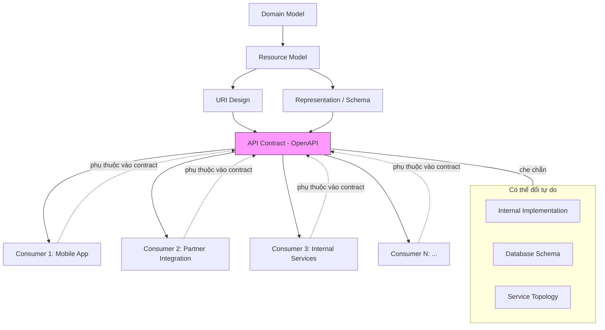
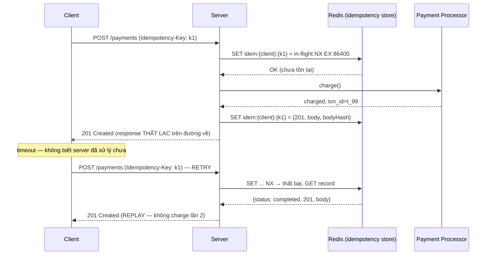
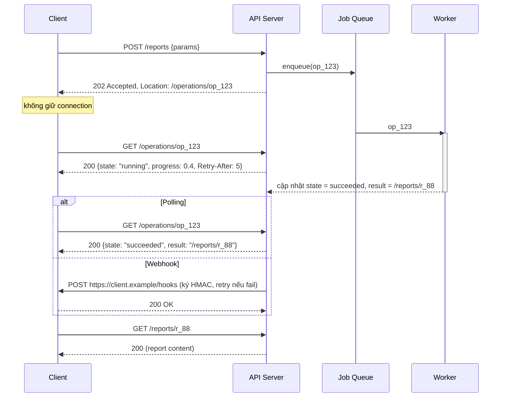
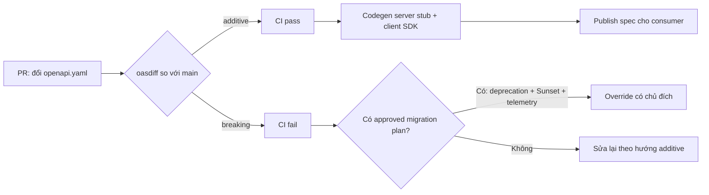

+++
title = "Chương 11: API Design — Thiết kế API cho tuổi thọ 10 năm"
date = "2026-02-22T17:00:00+07:00"
draft = false
tags = ["backend", "communication", "api", "architecture"]
series = ["Backend Communication Architecture"]
+++

[← Chương trước](/series/backend-communication-architect/10-so-sanh-communication-pattern/) | Mục lục | [Chương sau →](/series/backend-communication-architect/12-resilience-patterns/)

---

## 11.1. Vì sao API design là quyết định khó đảo ngược nhất

Bắt đầu từ một sự thật mà mọi engineer đều học được theo cách đau đớn: **code là tài sản riêng của bạn, còn API là hợp đồng công khai với người khác**. Bạn có thể refactor toàn bộ internal implementation vào thứ Ba tuần sau mà không ai hay biết. Nhưng một field đã xuất hiện trong response, một URI đã có người gọi, một status code đã có người viết `if` để bắt — những thứ đó không còn thuộc về bạn nữa. Chúng thuộc về mọi consumer đang phụ thuộc vào chúng.

Business problem cụ thể: một công ty fintech phát hành API cho 200 đối tác tích hợp. Mỗi thay đổi breaking trên API đồng nghĩa với 200 cuộc đàm phán, 200 lịch deploy của người khác mà bạn không kiểm soát, và một khoảng thời gian dài phải vận hành song song hai phiên bản. Chi phí của một quyết định thiết kế sai **không cố định — nó tăng tuyến tính (hoặc tệ hơn) theo số consumer**, và consumer chỉ tăng theo thời gian nếu sản phẩm thành công. Nghịch lý của API design: sản phẩm càng thành công, sai lầm thiết kế càng đắt.

Technical problem rút ra: chúng ta cần thiết kế API sao cho (1) phần lớn thay đổi tương lai là **additive** — thêm mà không phá, (2) những quyết định khó đảo ngược nhất (resource model, URI structure, error format, pagination scheme) được đưa ra có chủ đích ngay từ đầu, và (3) khi bất đắc dĩ phải breaking, có một quy trình deprecation đo lường được thay vì "gửi email rồi cầu nguyện".

Chương này độc lập với REST hay GraphQL cụ thể — các nguyên tắc (resource modeling, idempotency, error contract, versioning, pagination) áp dụng cho mọi kiểu API — nhưng ví dụ chủ yếu dùng REST/HTTP vì đó là mẫu số chung.



Điểm mấu chốt của diagram: contract là **lớp cách ly** giữa thế giới bạn kiểm soát (implementation, DB schema, service topology) và thế giới bạn không kiểm soát (consumer). Mọi kỹ thuật trong chương này phục vụ một mục tiêu: giữ cho lớp cách ly đó ổn định càng lâu càng tốt.

---

## 11.2. Resource Modeling — từ domain model đến resource

### 11.2.1. Resource không phải bảng database

Anti-pattern phổ biến nhất trong API design: mở schema database, mỗi bảng sinh một endpoint CRUD. Cách này nhanh — có tool sinh tự động — và nó chính là cách để database schema **rò rỉ vào contract công khai**. Từ thời điểm đó, mọi thay đổi schema đều là thay đổi API. Bạn vừa đánh mất lớp cách ly ở diagram trên.

Cơ chế đúng: resource được suy ra từ **domain model và use case của consumer**, không phải từ storage model. Một ví dụ cụ thể — hệ thống đặt hàng có các bảng: `orders`, `order_items`, `order_status_history`, `order_payments`, `order_shipping_info`. Consumer không quan tâm đến 5 bảng. Consumer quan tâm đến khái niệm **Order** — một aggregate. API đúng:

```
GET /orders/{orderId}
```

trả về một representation gộp: order kèm items, trạng thái hiện tại, thông tin thanh toán tóm tắt. Còn `order_status_history` — nếu có use case xem lịch sử — là một sub-resource:

```
GET /orders/{orderId}/status-history
```

Trade-off cần cân nhắc: representation gộp tiện cho consumer (một round-trip) nhưng nặng hơn và khó cache theo từng phần. Representation tách nhỏ nhẹ và cache tốt nhưng đẩy consumer vào N+1 request. Quy tắc thực dụng: **gộp những gì luôn được đọc cùng nhau** (order + items), **tách những gì có vòng đời đọc khác nhau** (status history, audit log).

### 11.2.2. Quan hệ: sub-resource hay link?

Hai lựa chọn khi model quan hệ giữa resource:

**Sub-resource** (`/orders/{id}/items`): dùng khi quan hệ là **sở hữu** (composition) — item không tồn tại ngoài order, vòng đời gắn chặt. URI thể hiện đúng ngữ nghĩa: xoá order thì items vô nghĩa.

**Link / reference** (`/orders/{id}` trả về `"customerId": "c_123"` hoặc `"customer": {"href": "/customers/c_123"}`): dùng khi quan hệ là **tham chiếu** (association) — customer tồn tại độc lập, được nhiều order tham chiếu. Nếu bạn model customer như sub-resource của order (`/orders/{id}/customer`), bạn tạo ra nhiều URI cho cùng một thực thể — cache key phân mảnh, quyền truy cập khó reasoning, và consumer không biết `/orders/1/customer` với `/orders/2/customer` có phải cùng một người.

Quy tắc: **hỏi vòng đời**. Con chết theo cha → sub-resource. Con sống độc lập → link.

Về độ sâu: giới hạn nesting ở **2 cấp** (`/orders/{id}/items/{itemId}`). Từ cấp 3 trở đi (`/customers/{cid}/orders/{oid}/items/{iid}`), URI vừa dài vừa dư thừa — `orderId` đã đủ định danh, kéo theo `customerId` chỉ tạo thêm một điều kiện phải validate và một cách nữa để consumer gọi sai. Nếu item có id toàn cục, `/order-items/{itemId}` phẳng hoàn toàn hợp lệ.

### 11.2.3. Hành động không phải CRUD — hai trường phái

Đây là chỗ REST thuần túy va chạm với thực tế. Domain có những hành động không map sạch vào CRUD: hủy đơn, phê duyệt khoản vay, gửi lại email xác nhận, tính lại giá. Hai trường phái:

**Trường phái 1 — State transition qua PATCH:**

```
PATCH /orders/{id}
{"status": "cancelled"}
```

Lý lẽ: hủy đơn thực chất là chuyển trạng thái của resource, PATCH thể hiện đúng điều đó, giữ API "thuần resource". 

Vấn đề trong thực tế: (1) hủy đơn thường cần **tham số riêng của hành động** — lý do hủy, có hoàn tiền không — nhét vào PATCH body của order làm schema của order phình ra những field chỉ có nghĩa lúc hủy; (2) server phải suy luận **ý định** từ diff trạng thái: PATCH `{"status": "cancelled"}` và PATCH `{"status": "cancelled", "shippingAddress": {...}}` — cái sau nghĩa là gì, hủy và đổi địa chỉ cùng lúc? (3) validation ma trận chuyển trạng thái trộn lẫn với validation field thông thường, code server thành một mớ `if`.

**Trường phái 2 — Action như verb resource:**

```
POST /orders/{id}/cancel
{"reason": "customer_request", "refund": true}
```

Lý lẽ: hành động domain quan trọng xứng đáng có endpoint riêng — schema riêng, validation riêng, quyền riêng (ai được hủy khác ai được sửa), audit riêng, rate limit riêng. Trong domain-driven design, đây chính là **command**.

Vấn đề: URI chứa động từ làm mất tính đồng nhất; nếu lạm dụng, API biến thành RPC trá hình với hàng chục endpoint `/do-something`.

Bảng trade-off:

| Tiêu chí | PATCH state transition | POST verb resource |
|---|---|---|
| Tính thuần resource | Cao | Thấp hơn |
| Schema riêng cho tham số hành động | Không — nhét vào resource schema | Có — schema riêng, rõ ràng |
| Phân quyền theo hành động | Khó (phải nhìn vào body) | Dễ (theo URI) |
| Idempotency tự nhiên | PATCH không được định nghĩa idempotent | POST cần Idempotency-Key (mục 11.8) |
| Suy luận ý định phía server | Phải diff trạng thái | Tường minh |
| Số endpoint | Ít | Nhiều hơn |

Khuyến nghị của tôi sau nhiều năm vận hành cả hai: **PATCH cho thay đổi thuộc tính thông thường, POST verb resource cho hành động domain có nghiệp vụ riêng** (side effect, tham số riêng, quyền riêng). Đừng giáo điều — consumer của bạn cần API dễ dùng đúng, không cần API đạt điểm REST maturity cao.

---

## 11.3. URI Design & Naming Convention

URI là phần "khó đổi nhất trong những thứ khó đổi" — nó nằm trong code của consumer, trong bookmark, trong log, trong tài liệu của người khác. Bộ quy tắc tối thiểu, áp dụng nhất quán toàn bộ API surface:

1. **Danh từ số nhiều cho collection**: `/orders`, `/customers`, `/payment-methods`. Không trộn `/order` chỗ này `/customers` chỗ kia — sự nhất quán quan trọng hơn lựa chọn cụ thể.
2. **Không động từ trong URI** — trừ verb resource có chủ đích (mục 11.2.3). `/getOrders`, `/createUser` là RPC đội lốt HTTP; method đã nói lên hành động.
3. **kebab-case cho path segment** (`/payment-methods`), **camelCase hoặc snake_case cho query param và JSON field — chọn một và không bao giờ đổi**. Casing không nhất quán là loại lỗi khiến consumer phải thử-sai từng endpoint.
4. **Path param cho định danh, query param cho lựa chọn**: cái gì xác định *resource nào* nằm ở path (`/orders/{id}`); cái gì xác định *xem resource ra sao* nằm ở query (`?fields=`, `?sort=`, `?page[size]=`). Kiểm tra nhanh: nếu bỏ tham số đi mà request vẫn có nghĩa (trả mặc định) → query param. Nếu bỏ đi thì không biết đang nói về cái gì → path param.
5. **Độ sâu tối đa 2 cấp resource** như đã phân tích ở 11.2.2.
6. **ID là chuỗi opaque với consumer**: đừng cam kết ID là số tăng dần — bạn sẽ muốn đổi sang UUID/ULID khi shard, và ID tăng dần còn rò rỉ thông tin nghiệp vụ (đối thủ đếm được số đơn hàng mỗi ngày bằng cách tạo hai đơn cách nhau 24 giờ).
7. **Trailing slash: chọn một hành vi** (thường là không có, redirect hoặc 404 cho biến thể còn lại) và ghi vào tài liệu.

---

## 11.4. Pagination — nơi API "chạy tốt trên staging" chết trên production

### 11.4.1. Offset pagination: đơn giản, và chết ở bảng lớn

```
GET /orders?offset=100000&limit=20
```

Cơ chế: map thẳng xuống SQL `... ORDER BY created_at DESC LIMIT 20 OFFSET 100000`. Vì sao nó chết ở bảng lớn — cần hiểu tận gốc, không phải "vì chậm":

**Database không có cách nào nhảy thẳng đến hàng thứ 100.001.** `OFFSET n` nghĩa là: thực thi query, duyệt index (hoặc heap) theo thứ tự sort, **đọc và vứt bỏ n hàng đầu tiên**, rồi mới trả 20 hàng tiếp theo. Chi phí của trang thứ k là O(k × page_size). Trang 1 đọc 20 hàng; trang 50.000 đọc 1.000.020 hàng để trả về 20. Với B-tree index, engine vẫn phải walk qua từng entry — offset không được encode trong cấu trúc cây. Hệ quả production: latency tăng tuyến tính theo số trang, và một crawler ngoan ngoãn duyệt tuần tự đến trang sâu sẽ tạo tải I/O tương đương một full table scan.

| Trang (limit=20) | Số hàng DB phải đọc | Latency p50 (minh họa) |
|---|---|---|
| 1 (offset 0) | 20 | 4 ms |
| 100 (offset 2.000) | 2.020 | 9 ms |
| 10.000 (offset 200.000) | 200.020 | 320 ms |
| 50.000 (offset 1.000.000) | 1.000.020 | 1.900 ms |

*Số liệu minh họa, phụ thuộc môi trường (kích thước hàng, index, buffer pool, storage).*

**Vấn đề thứ hai — drift khi dữ liệu thay đổi.** Offset là vị trí tương đối trong một danh sách *đang biến động*. Consumer đang ở trang 3 (offset 40). Trong lúc họ đọc, 5 order mới được insert vào đầu danh sách (sort by `created_at DESC`). Khi họ gọi trang 4 (offset 60), toàn bộ danh sách đã dịch xuống 5 vị trí: 5 phần tử cuối trang 3 xuất hiện lại ở đầu trang 4 (**duplicate**), hoặc ngược lại với delete, phần tử bị **bỏ sót** vĩnh viễn. Với UI người dùng thì khó chịu; với batch job đồng bộ dữ liệu qua pagination thì đây là **data corruption âm thầm**.

### 11.4.2. Cursor pagination: keyset ổn định, đổi lại mất random access

Cơ chế: thay vì "cho tôi 20 hàng bắt đầu từ vị trí thứ n", nói "cho tôi 20 hàng **sau hàng này**" — trong đó "hàng này" được xác định bằng giá trị của các cột sort (keyset), không phải vị trí:

```sql
SELECT * FROM orders
WHERE (created_at, id) < ($1, $2)   -- keyset của phần tử cuối trang trước
ORDER BY created_at DESC, id DESC
LIMIT 20;
```

Ba tính chất quan trọng:

1. **O(log n) mọi trang**: điều kiện `(created_at, id) < (...)` là range scan trên composite index — engine seek thẳng đến vị trí trong B-tree, không đọc-bỏ hàng nào.
2. **Ổn định dưới insert/delete**: keyset trỏ vào một *giá trị*, không phải *vị trí*. Insert mới ở đầu danh sách không làm dịch trang tiếp theo.
3. **Cần tie-breaker**: nếu sort theo cột không unique (`created_at` có thể trùng), phải thêm cột unique (`id`) vào keyset, nếu không sẽ mất/lặp hàng tại ranh giới trang.

Trade-off — cursor không miễn phí:

| Tiêu chí | Offset | Cursor (keyset) |
|---|---|---|
| Chi phí trang sâu | O(offset) — tăng tuyến tính | O(log n) — hằng định |
| Ổn định khi insert/delete | Không — duplicate/skip | Có |
| Nhảy thẳng đến trang k | Có | **Không** — chỉ next/prev |
| Hiển thị tổng số trang | Dễ (COUNT) | Không tự nhiên (COUNT riêng, thường bỏ) |
| Đổi tiêu chí sort giữa chừng | Được | Cursor vô hiệu, phải bắt đầu lại |
| Độ phức tạp implement | Thấp | Trung bình (encode, multi-column, hai chiều) |
| Sort theo cột không index | "Chạy được" (chậm) | Không nên — mất toàn bộ lợi ích |

Khuyến nghị: **cursor là mặc định cho mọi API list** có khả năng lớn hơn vài nghìn phần tử hoặc được dùng để đồng bộ dữ liệu. Offset chấp nhận được cho admin UI nội bộ, dataset nhỏ, hoặc khi nghiệp vụ thật sự cần "nhảy đến trang 7".

### 11.4.3. Encode cursor an toàn: opaque token + HMAC

Cursor lộ keyset thô (`?after_created_at=...&after_id=...`) là một anti-pattern vì hai lý do: (1) bạn vừa đưa **cấu trúc index nội bộ vào contract** — muốn đổi cột sort là breaking change; (2) consumer sẽ **tự chế cursor**, truyền giá trị bất kỳ, và code parse của bạn thành attack surface.

Giải pháp: cursor là **opaque token** — base64 của keyset đã serialize, kèm **HMAC** để chống giả mạo và một timestamp để hết hạn. Consumer chỉ được cam kết một điều: "chuỗi này, đưa lại nguyên vẹn cho tôi ở request sau". Nội dung bên trong là chuyện riêng của server, đổi lúc nào cũng được (miễn giữ khả năng decode phiên bản cũ trong TTL).

Code Go đầy đủ:

```go
// Package pagination cung cấp cursor opaque, ký HMAC, cho keyset pagination.
package pagination

import (
	"crypto/hmac"
	"crypto/sha256"
	"encoding/base64"
	"encoding/json"
	"errors"
	"fmt"
	"time"
)

// Cursor chứa keyset của phần tử cuối trang trước.
// Version cho phép đổi cấu trúc về sau mà vẫn decode được cursor cũ.
type Cursor struct {
	Version   int       `json:"v"`
	CreatedAt time.Time `json:"ca"` // cột sort chính
	ID        string    `json:"id"` // tie-breaker, unique
	IssuedAt  int64     `json:"ia"` // unix seconds — để enforce TTL
}

var (
	ErrInvalidCursor = errors.New("pagination: invalid cursor")
	ErrExpiredCursor = errors.New("pagination: cursor expired")
)

type Codec struct {
	secret []byte        // key HMAC — quản lý như secret, rotate được (giữ key cũ để verify)
	ttl    time.Duration // cursor quá hạn bị từ chối, tránh replay keyset cổ
}

func NewCodec(secret []byte, ttl time.Duration) *Codec {
	return &Codec{secret: secret, ttl: ttl}
}

// Encode: JSON -> HMAC -> base64url(payload || mac).
// Quyết định thiết kế: MAC nối sau payload thay vì JWT đầy đủ —
// cursor không cần header/claims chuẩn, gọn hơn và không kéo dependency.
func (c *Codec) Encode(cur Cursor) (string, error) {
	cur.IssuedAt = time.Now().Unix()
	payload, err := json.Marshal(cur)
	if err != nil {
		return "", fmt.Errorf("pagination: marshal: %w", err)
	}
	mac := hmac.New(sha256.New, c.secret)
	mac.Write(payload)
	token := append(payload, mac.Sum(nil)...) // payload || 32-byte MAC
	return base64.RawURLEncoding.EncodeToString(token), nil
}

// Decode xác thực MAC TRƯỚC khi parse JSON — không bao giờ parse dữ liệu chưa xác thực.
func (c *Codec) Decode(s string) (Cursor, error) {
	raw, err := base64.RawURLEncoding.DecodeString(s)
	if err != nil || len(raw) <= sha256.Size {
		return Cursor{}, ErrInvalidCursor
	}
	payload, gotMAC := raw[:len(raw)-sha256.Size], raw[len(raw)-sha256.Size:]

	mac := hmac.New(sha256.New, c.secret)
	mac.Write(payload)
	// hmac.Equal là so sánh constant-time — chống timing attack dò MAC.
	if !hmac.Equal(gotMAC, mac.Sum(nil)) {
		return Cursor{}, ErrInvalidCursor
	}

	var cur Cursor
	if err := json.Unmarshal(payload, &cur); err != nil {
		return Cursor{}, ErrInvalidCursor
	}
	if time.Since(time.Unix(cur.IssuedAt, 0)) > c.ttl {
		return Cursor{}, ErrExpiredCursor
	}
	return cur, nil
}
```

Sử dụng trong handler:

```go
func (h *OrderHandler) List(w http.ResponseWriter, r *http.Request) {
	limit := clampLimit(r.URL.Query().Get("limit"), 20, 100) // luôn có trần limit

	var after *pagination.Cursor
	if raw := r.URL.Query().Get("cursor"); raw != "" {
		cur, err := h.codec.Decode(raw)
		if err != nil {
			// RFC 9457 writer — xem mục 11.6
			writeProblem(w, r, problemInvalidCursor(err))
			return
		}
		after = &cur
	}

	orders, err := h.repo.ListAfter(r.Context(), after, limit+1) // lấy dư 1 để biết còn trang sau
	if err != nil {
		writeProblem(w, r, problemInternal())
		return
	}

	resp := ListResponse{Data: orders}
	if len(orders) > limit {
		resp.Data = orders[:limit]
		last := resp.Data[len(resp.Data)-1]
		next, _ := h.codec.Encode(pagination.Cursor{
			Version: 1, CreatedAt: last.CreatedAt, ID: last.ID,
		})
		resp.NextCursor = &next
	}
	writeJSON(w, http.StatusOK, resp)
}
```

Chi tiết đáng chú ý: **lấy `limit+1` hàng** — kỹ thuật chuẩn để biết còn trang tiếp theo hay không mà không cần COUNT; và **trần limit bắt buộc** — không có trần, một consumer gửi `limit=1000000` là đủ đánh sập một instance.

### 11.4.4. Refactoring example: offset → cursor không gãy consumer

Tình huống production thật: API `/transactions?page=&per_page=` chạy 3 năm, bảng đạt 400 triệu hàng, các batch job đối tác duyệt đến trang sâu làm replica lag mỗi đêm. Không thể bắt tất cả đối tác đổi ngay. Lộ trình migration:

1. **Thêm cursor song song, không đụng offset**: response của mọi trang (kể cả trang gọi bằng offset) bắt đầu trả thêm `next_cursor`. Request chấp nhận cả `page` lẫn `cursor`; nếu có cả hai, `cursor` thắng. Đây là additive change — không consumer nào gãy.
2. **Giới hạn độ sâu offset**: `page × per_page > 10.000` trả `400` với Problem Details trỏ đến tài liệu cursor (kèm thời hạn ân hạn thông báo trước). Điều này chặn đúng phần gây hại mà không ảnh hưởng 95% traffic ở trang nông.
3. **Đo lường**: metric `pagination_mode{mode="offset|cursor"}` theo API key, dashboard xem đối tác nào còn dùng offset, chủ động liên hệ nhóm cuối cùng.
4. **Sunset offset** ở version tài liệu tiếp theo — lúc này chỉ còn vài consumer, chi phí đàm phán thấp.

Bài học: refactoring API không phải bài toán kỹ thuật, nó là bài toán **di dân** — luôn cần giai đoạn song song và số liệu ai-còn-ở-lại.

---

## 11.5. Filtering & Sorting — whitelist hay là chết

Business problem: consumer muốn lọc danh sách theo đủ loại tiêu chí. Cám dỗ lớn nhất của server là làm một cơ chế filter "tổng quát" — nhận tên field bất kỳ, map thẳng vào WHERE clause. Đây là cách sinh ra hai loại sự cố:

1. **Injection bề mặt rộng**: kể cả khi dùng parameterized query cho *giá trị*, tên field và hướng sort thường bị nối chuỗi vào SQL (`ORDER BY ` + userInput). Một `?sort=(CASE WHEN ...)` là đủ để dò dữ liệu.
2. **Query không index — DoS hợp pháp**: consumer lọc theo field không có index trên bảng 100 triệu hàng. Không cần ác ý; một dashboard nội bộ của chính đối tác refresh 30 giây một lần là đủ full-scan liên tục.

Nguyên tắc: **filter/sort là một phần của contract, không phải tính năng tự do**. Cụ thể:

- **Whitelist field được filter và sort** — khai báo tường minh trong code và trong OpenAPI. Field ngoài danh sách → `400` kèm danh sách field hợp lệ trong Problem Details. Điều kiện để một field vào whitelist: **có index phục vụ nó**.
- **Cú pháp đơn giản, nhất quán**: `?status=shipped&created_after=2026-01-01&sort=-created_at,+id` (dấu `-`/`+` cho hướng). Tránh phát minh mini-language (`?filter=(status eq 'shipped') and ...`) trừ khi bạn thật sự cần và sẵn sàng maintain parser + planner cho nó.
- **Giới hạn kết hợp**: mỗi tổ hợp filter+sort là một query shape cần index. Không index nào phục vụ được mọi tổ hợp của 10 field. Hoặc giới hạn số filter đồng thời, hoặc chỉ cho phép các tổ hợp đã định trước, hoặc route tổ hợp phức tạp sang search engine (Elasticsearch/OpenSearch) — nhưng đó là quyết định kiến trúc có chủ đích, không phải hệ quả ngẫu nhiên của một filter API quá tự do.

```go
// Whitelist tường minh: field -> cột SQL. Không có trong map = từ chối.
var sortableFields = map[string]string{
	"created_at": "created_at",
	"amount":     "amount_cents",
	"status":     "status",
}

func parseSort(raw string) (string, error) {
	col, dir := raw, "ASC"
	if strings.HasPrefix(raw, "-") {
		col, dir = raw[1:], "DESC"
	}
	sqlCol, ok := sortableFields[col]
	if !ok {
		return "", fmt.Errorf("field %q is not sortable", col)
	}
	return sqlCol + " " + dir, nil // an toàn: cả hai vế đều từ whitelist, không có user input
}
```

---

## 11.6. Error Handling theo RFC 9457 Problem Details

### 11.6.1. Vì sao cần một error contract

Failure mode kinh điển: mỗi endpoint trả lỗi một kiểu — chỗ `{"error": "..."}`, chỗ `{"message": "...", "code": 42}`, chỗ HTML từ reverse proxy. Consumer buộc phải viết code parse lỗi riêng cho từng endpoint, và phần lớn sẽ bỏ cuộc, chỉ nhìn status code — mất toàn bộ thông tin bạn định truyền đạt. **Error response cũng là contract**, thậm chí quan trọng hơn success response vì nó được đọc lúc con người đang debug dưới áp lực.

RFC 9457 (thay thế RFC 7807, tương thích ngược) chuẩn hóa cấu trúc, media type `application/problem+json`:

```json
{
  "type": "https://api.example.com/problems/insufficient-balance",
  "title": "Insufficient balance",
  "status": 422,
  "detail": "Account balance is 30,000 VND but the transfer requires 500,000 VND.",
  "instance": "/transfers/tr_9f8a7b",
  "balance": 30000,
  "required": 500000
}
```

Ngữ nghĩa từng field — hiểu đúng để dùng đúng:

- **`type`**: URI định danh **loại lỗi** — đây là field máy đọc, là thứ consumer viết `switch` lên. Nên là URL dereference được, trỏ đến trang tài liệu của lỗi đó. `type` **ổn định vĩnh viễn** — đổi `type` của một lỗi là breaking change.
- **`title`**: mô tả ngắn của loại lỗi, giống nhau cho mọi occurrence, dành cho con người.
- **`status`**: lặp lại HTTP status — hữu ích khi problem document bị forward qua tầng trung gian làm mất status gốc.
- **`detail`**: mô tả riêng của *lần xảy ra này*, dành cho con người. Consumer **không được parse** `detail` — mọi thứ máy cần đọc phải nằm ở `type` hoặc extension members.
- **`instance`**: URI của lần xảy ra cụ thể — thường trỏ đến resource liên quan hoặc một error occurrence tra cứu được.
- **Extension members** (`balance`, `required` ở trên): dữ liệu có cấu trúc riêng của từng loại lỗi. Đây là chỗ đặt validation errors:

```json
{
  "type": "https://api.example.com/problems/validation-error",
  "title": "Request validation failed",
  "status": 400,
  "errors": [
    {"field": "email", "rule": "format", "message": "must be a valid email"},
    {"field": "amount", "rule": "min", "message": "must be >= 1000"}
  ]
}
```

### 11.6.2. Error catalog và nguyên tắc không leak internal

Hai kỷ luật vận hành:

**Error catalog**: tập trung mọi problem `type` vào một registry duy nhất (một package Go + một trang tài liệu). Lợi ích: consumer có một trang để tra mọi lỗi; team của bạn không phát minh 5 biến thể của cùng một lỗi; CI có thể kiểm tra lỗi mới có tài liệu chưa.

**Không leak internal**: `detail` và extension members đi thẳng đến người ngoài. Những thứ tuyệt đối không được xuất hiện: stack trace, SQL/query text, tên bảng/cột, tên host/IP nội bộ, phiên bản thư viện, message gốc của lỗi hạ tầng (`dial tcp 10.0.3.7:5432: connection refused` — vừa lộ topology vừa vô nghĩa với consumer). Quy tắc: lỗi 5xx trả về problem **generic** kèm một correlation id để consumer báo lại cho bạn; chi tiết thật nằm trong log của bạn, tra bằng chính correlation id đó.

Code Go — RFC 9457 error writer hoàn chỉnh:

```go
// Package problem hiện thực RFC 9457 Problem Details.
package problem

import (
	"encoding/json"
	"log/slog"
	"net/http"
)

const ContentType = "application/problem+json"

// Problem là một RFC 9457 document. Extensions được flatten vào JSON cùng cấp.
type Problem struct {
	Type     string         `json:"type"`
	Title    string         `json:"title"`
	Status   int            `json:"status"`
	Detail   string         `json:"detail,omitempty"`
	Instance string         `json:"instance,omitempty"`
	Ext      map[string]any `json:"-"`
}

// MarshalJSON flatten extension members vào top level theo đúng RFC.
func (p Problem) MarshalJSON() ([]byte, error) {
	m := map[string]any{"type": p.Type, "title": p.Title, "status": p.Status}
	if p.Detail != "" {
		m["detail"] = p.Detail
	}
	if p.Instance != "" {
		m["instance"] = p.Instance
	}
	for k, v := range p.Ext {
		switch k {
		case "type", "title", "status", "detail", "instance":
			continue // extension không được đè field chuẩn
		default:
			m[k] = v
		}
	}
	return json.Marshal(m)
}

// ---- Error catalog: nơi DUY NHẤT định nghĩa problem type ----

const baseURL = "https://api.example.com/problems/"

func ValidationError(errs []FieldError) Problem {
	return Problem{
		Type: baseURL + "validation-error", Title: "Request validation failed",
		Status: http.StatusBadRequest, Ext: map[string]any{"errors": errs},
	}
}

func NotFound(resource string) Problem {
	return Problem{
		Type: baseURL + "not-found", Title: "Resource not found",
		Status: http.StatusNotFound,
		Detail: resource + " does not exist or you do not have access to it",
	}
}

// Internal cố tình KHÔNG nhận error gốc làm detail — chống leak.
// Chi tiết thật đi vào log, nối với consumer bằng requestID.
func Internal(requestID string) Problem {
	return Problem{
		Type: baseURL + "internal", Title: "Internal server error",
		Status: http.StatusInternalServerError,
		Detail: "An unexpected error occurred. Contact support with the requestId.",
		Ext:    map[string]any{"requestId": requestID},
	}
}

type FieldError struct {
	Field   string `json:"field"`
	Rule    string `json:"rule"`
	Message string `json:"message"`
}

// Write serialize problem ra response. Instance mặc định là URI của request.
func Write(w http.ResponseWriter, r *http.Request, p Problem) {
	if p.Instance == "" {
		p.Instance = r.URL.Path
	}
	w.Header().Set("Content-Type", ContentType)
	// Lỗi không được cache lẫn giữa các user.
	w.Header().Set("Cache-Control", "no-store")
	w.WriteHeader(p.Status)
	if err := json.NewEncoder(w).Encode(p); err != nil {
		slog.ErrorContext(r.Context(), "problem: encode failed", "err", err)
	}
}
```

Quyết định thiết kế đáng nói: catalog là **hàm constructor, không phải hằng số** — buộc caller cung cấp đúng tham số của từng loại lỗi, compiler bắt lỗi thiếu field thay vì để lỗi trống ra production.

---

## 11.7. Versioning — và nghệ thuật không cần đến nó

### 11.7.1. Ba cơ chế, một bảng trade-off

| Tiêu chí | URI (`/v1/orders`) | Header (`X-API-Version: 2`) | Media type (`Accept: application/vnd.example.v2+json`) |
|---|---|---|---|
| Dễ thấy, dễ debug (curl, log, bookmark) | Tốt nhất | Kém — version vô hình trong URL | Kém |
| "Thuần REST" (URI định danh resource, không phải phiên bản representation) | Vi phạm — `/v1/orders/1` và `/v2/orders/1` là hai URI cho một resource | Ổn | Đúng tinh thần nhất |
| Routing/caching ở gateway, CDN | Dễ (theo path) | Cần cấu hình `Vary` | Cần `Vary: Accept`, nhiều CDN xử lý kém |
| Consumer quên chỉ định version | Không thể quên (nằm trong URL) | Rơi vào default — default là gì? | Rơi vào default |
| Version từng resource riêng lẻ | Khó (version cả API surface) | Được | Được |

Thực tế ngành: **URI versioning thắng áp đảo** không phải vì thanh lịch mà vì **vận hành được** — mọi tầng hạ tầng (LB, gateway, CDN, log pipeline, dashboard) hiểu path mà không cần cấu hình gì thêm, và không tồn tại trạng thái "consumer quên gửi header". Media type versioning đúng lý thuyết nhất và gần như không ai chịu nổi trong thực tế. Chọn URI versioning, và dồn năng lượng vào việc **không bao giờ phải tăng số version**.

### 11.7.2. Chiến lược tốt nhất: tránh versioning

Mỗi version mới là một API surface phải maintain, test, bảo mật song song — v1 không chết ngay khi v2 ra đời, nó sống thêm nhiều năm. Cách rẻ nhất để version là không version. Hai kỷ luật, một cho mỗi phía:

**Phía producer — additive change only.** Các thay đổi an toàn: thêm field mới vào response; thêm optional field vào request; thêm endpoint mới; thêm giá trị mới vào query param; nới lỏng validation. Các thay đổi breaking: xóa/đổi tên field; đổi kiểu dữ liệu (`"amount": 100` → `"amount": "100"`); đổi ngữ nghĩa mà giữ nguyên tên (amount từ VND sang cents — loại này nguy hiểm nhất vì không tool nào phát hiện được); siết validation; đổi status code; thêm required field vào request. Danh sách này phải nằm trong CI (mục 11.12).

**Phía consumer — tolerant reader.** Consumer chỉ đọc field mình cần, **bỏ qua field lạ** thay vì reject, không phụ thuộc thứ tự field, không giả định enum là tập đóng (giá trị enum lạ → nhánh default, không crash). Nếu bạn kiểm soát cả hai phía (internal API), enforce tolerant reader trong client SDK. Nếu không, hãy **giả định consumer làm điều tệ nhất** — đó là nguồn gốc failure example ở mục 11.13.

### 11.7.3. Deprecation process — Sunset header và telemetry

Khi bất đắc dĩ phải bỏ một endpoint/field, "gửi email thông báo" không phải quy trình. Quy trình đo lường được:

1. **Đánh dấu trong contract**: `deprecated: true` trong OpenAPI, ghi rõ thay thế bằng gì.
2. **Đánh dấu trong runtime**: response kèm header `Deprecation: true` (draft chuẩn IETF) và **`Sunset: Sat, 01 Aug 2026 00:00:00 GMT`** (RFC 8594) — thời điểm endpoint ngừng hoạt động, máy đọc được. Client SDK và gateway của consumer có thể tự cảnh báo.
3. **Telemetry**: metric đếm lượt gọi endpoint deprecated **theo consumer identity** (API key/client id). Đây là bước bị bỏ qua nhiều nhất và quan trọng nhất — không có nó, ngày sunset là ngày bạn khám phá ra ai còn phụ thuộc vào mình bằng cách làm họ outage.
4. **Chặn dần**: gần sunset, áp dụng brownout — trả lỗi có chủ đích trong các khung giờ ngắn báo trước (ví dụ 5 phút mỗi ngày) để đánh thức những consumer không đọc email nhưng có alert. Kỹ thuật này nghe tàn nhẫn nhưng nhân đạo hơn nhiều so với tắt hẳn vào ngày S.

---

## 11.8. Idempotency — nền tảng của retry an toàn

### 11.8.1. Bảng method và vấn đề của POST

| Method | Safe (không side effect) | Idempotent (gọi N lần = gọi 1 lần) |
|---|---|---|
| GET / HEAD / OPTIONS | Có | Có |
| PUT | Không | Có (replace toàn bộ — kết quả cuối như nhau) |
| DELETE | Không | Có (xóa cái đã xóa vẫn là đã xóa)* |
| POST | Không | **Không** |
| PATCH | Không | **Không được đảm bảo** (phụ thuộc ngữ nghĩa patch) |

*Idempotent về trạng thái, không nhất thiết về response (lần 2 có thể trả 404) — điều consumer cần nhớ khi retry DELETE.*

Vấn đề nằm ở POST — và POST lại chính là method của các hành động quan trọng nhất: tạo đơn, tạo giao dịch, **thanh toán**. Chuỗi sự kiện kinh điển: client gửi `POST /payments`, server xử lý xong, trừ tiền thành công, nhưng response bị mất trên đường về (timeout, connection reset). Client không thể phân biệt "server chưa nhận request" với "server xử lý xong nhưng response thất lạc". Client retry — và khách hàng bị trừ tiền hai lần. **Với payment API, idempotency không phải tính năng, nó là điều kiện tồn tại**: không có nó, mọi timeout đều là một quyết định giữa rủi ro double-charge (retry) và rủi ro mất giao dịch (không retry). Đây cũng là lý do mọi payment gateway lớn đều bắt buộc Idempotency-Key.

### 11.8.2. Cơ chế Idempotency-Key

Client sinh một key duy nhất cho mỗi **ý định nghiệp vụ** (không phải mỗi request) — thường là UUID v4 — gửi trong header `Idempotency-Key`. Retry của cùng ý định dùng **cùng key**. Phía server:

1. Nhận request, tính `scope = clientID + key` — **scope theo client** để key của client A không đụng key của client B (và để client này không dò được key của client kia).
2. Tra store: 
   - **Chưa có** → ghi record trạng thái `in-flight` (bằng thao tác atomic — SETNX), xử lý request, lưu response (status + body) vào record, trả về.
   - **Đã có, trạng thái `completed`** → trả lại **đúng response đã lưu** (replay), không xử lý lại.
   - **Đã có, trạng thái `in-flight`** → một request cùng key đang chạy (retry đến sớm hơn lần đầu xong — hoàn toàn xảy ra khi client timeout ngắn hơn thời gian xử lý). Trả `409 Conflict` kèm `Retry-After`, **tuyệt đối không xử lý song song**.
3. Record có **TTL** (thường 24–72 giờ): idempotency bảo vệ khỏi retry, không phải khỏi replay vô hạn; store phải dọn được.
4. Chi tiết tinh tế: nên lưu kèm **hash của request body** — nếu cùng key mà body khác, trả `422`; đó là bug phía client (tái sử dụng key cho ý định khác) và trả response cũ cho request mới là data corruption.



### 11.8.3. Code Go: middleware Idempotency-Key hoàn chỉnh với Redis

```go
// Package idempotency: middleware HTTP hiện thực Idempotency-Key với Redis.
package idempotency

import (
	"bytes"
	"context"
	"crypto/sha256"
	"encoding/hex"
	"encoding/json"
	"errors"
	"io"
	"net/http"
	"time"

	"github.com/redis/go-redis/v9"
)

type recordState string

const (
	stateInFlight  recordState = "in-flight"
	stateCompleted recordState = "completed"
)

// record là những gì được lưu trong Redis cho mỗi key.
type record struct {
	State    recordState         `json:"state"`
	BodyHash string              `json:"bodyHash"`
	Status   int                 `json:"status,omitempty"`
	Header   map[string][]string `json:"header,omitempty"`
	Body     []byte              `json:"body,omitempty"`
}

type Middleware struct {
	rdb *redis.Client
	ttl time.Duration
	// inFlightTTL ngắn hơn ttl: nếu process chết giữa chừng, khóa in-flight
	// tự hết hạn để retry sau đó không bị kẹt vĩnh viễn.
	inFlightTTL time.Duration
	maxBody     int64
}

func New(rdb *redis.Client) *Middleware {
	return &Middleware{
		rdb: rdb, ttl: 24 * time.Hour,
		inFlightTTL: 60 * time.Second, maxBody: 1 << 20,
	}
}

// responseRecorder chặn response để lưu lại trước khi ghi ra client.
type responseRecorder struct {
	http.ResponseWriter
	status int
	buf    bytes.Buffer
}

func (r *responseRecorder) WriteHeader(code int) { r.status = code; r.ResponseWriter.WriteHeader(code) }
func (r *responseRecorder) Write(b []byte) (int, error) {
	r.buf.Write(b)
	return r.ResponseWriter.Write(b)
}

func (m *Middleware) Wrap(next http.Handler) http.Handler {
	return http.HandlerFunc(func(w http.ResponseWriter, r *http.Request) {
		// Chỉ áp dụng cho method không idempotent tự nhiên.
		if r.Method != http.MethodPost && r.Method != http.MethodPatch {
			next.ServeHTTP(w, r)
			return
		}
		key := r.Header.Get("Idempotency-Key")
		if key == "" {
			// Quyết định thiết kế: với payment API, key là BẮT BUỘC — từ chối
			// thay vì âm thầm xử lý không có bảo vệ.
			writeProblemJSON(w, http.StatusBadRequest,
				"missing-idempotency-key", "Idempotency-Key header is required")
			return
		}
		clientID := clientIDFromAuth(r) // từ API key / JWT — scope per-client
		redisKey := "idem:" + clientID + ":" + key

		// Đọc body để hash (giới hạn kích thước), rồi khôi phục cho handler.
		body, err := io.ReadAll(io.LimitReader(r.Body, m.maxBody))
		if err != nil {
			writeProblemJSON(w, http.StatusBadRequest, "unreadable-body", "cannot read request body")
			return
		}
		r.Body = io.NopCloser(bytes.NewReader(body))
		h := sha256.Sum256(body)
		bodyHash := hex.EncodeToString(h[:])

		// Bước 1: cố gắng chiếm khóa in-flight bằng SET NX — atomic,
		// đây là điểm quyết định chống double-processing khi 2 retry đến đồng thời.
		newRec, _ := json.Marshal(record{State: stateInFlight, BodyHash: bodyHash})
		ok, err := m.rdb.SetNX(r.Context(), redisKey, newRec, m.inFlightTTL).Result()
		if err != nil {
			// Redis hỏng: fail CLOSED cho payment (từ chối) — an toàn hơn fail open.
			writeProblemJSON(w, http.StatusServiceUnavailable,
				"idempotency-store-unavailable", "try again later")
			return
		}

		if !ok { // key đã tồn tại — replay hoặc conflict
			raw, err := m.rdb.Get(r.Context(), redisKey).Bytes()
			if err != nil {
				writeProblemJSON(w, http.StatusServiceUnavailable,
					"idempotency-store-unavailable", "try again later")
				return
			}
			var rec record
			_ = json.Unmarshal(raw, &rec)

			if rec.BodyHash != bodyHash {
				// Cùng key, khác payload = bug client. Không được replay.
				writeProblemJSON(w, http.StatusUnprocessableEntity,
					"idempotency-key-reuse", "same Idempotency-Key used with a different payload")
				return
			}
			switch rec.State {
			case stateInFlight:
				w.Header().Set("Retry-After", "2")
				writeProblemJSON(w, http.StatusConflict,
					"request-in-flight", "a request with this Idempotency-Key is being processed")
			case stateCompleted:
				for k, vs := range rec.Header {
					for _, v := range vs {
						w.Header().Add(k, v)
					}
				}
				w.Header().Set("Idempotency-Replayed", "true")
				w.WriteHeader(rec.Status)
				w.Write(rec.Body)
			}
			return
		}

		// Bước 2: chúng ta giữ khóa — xử lý thật, ghi lại response.
		rec := &responseRecorder{ResponseWriter: w, status: http.StatusOK}
		next.ServeHTTP(rec, r)

		// Chỉ lưu response "có kết luận". 5xx không lưu — retry sau NÊN được xử lý lại.
		if rec.status < 500 {
			done, _ := json.Marshal(record{
				State: stateCompleted, BodyHash: bodyHash,
				Status: rec.status, Header: pickHeaders(rec.Header()),
				Body: rec.buf.Bytes(),
			})
			if err := m.rdb.Set(context.WithoutCancel(r.Context()), redisKey, done, m.ttl).Err(); err != nil {
				// Lưu thất bại: request ĐÃ xử lý nhưng replay sẽ không có.
				// Log to; khóa in-flight sẽ tự hết hạn. Đây là trade-off có ý thức.
			}
		} else {
			// Giải phóng khóa để retry được xử lý lại.
			_ = m.rdb.Del(context.WithoutCancel(r.Context()), redisKey).Err()
		}
	})
}
```

Ba quyết định thiết kế đáng phân tích:

1. **`SetNX` là trái tim của toàn bộ cơ chế** — nó biến "kiểm tra rồi ghi" (race condition) thành một thao tác atomic. Không có nó, hai retry đến cách nhau 1ms đều thấy "chưa có key" và đều charge.
2. **5xx không được lưu để replay** — nếu lần đầu fail vì lỗi tạm thời của downstream, replay mãi mãi lỗi đó là tự bắn vào chân. Chỉ kết quả có tính kết luận (2xx, 4xx) mới đáng replay.
3. **Fail closed khi Redis hỏng** — với payment. Với API ít nhạy cảm hơn, fail open (xử lý không có bảo vệ, log warning) có thể là trade-off đúng. Đây là quyết định nghiệp vụ, không phải kỹ thuật; hãy đưa nó cho product owner quyết một cách tường minh.

Lưu ý vận hành: response body lớn làm record Redis phình — đặt trần kích thước response được lưu, và với body quá lớn thì lưu con trỏ (ví dụ id của resource đã tạo) thay vì toàn bộ body.

---

## 11.9. Long-running Operations — 202 Accepted và operation resource

Business problem: một số thao tác không xong trong một request — sinh báo cáo 5 phút, encode video, import 1 triệu bản ghi. Giữ HTTP connection mở 5 phút là thiết kế tồi: timeout ở mọi tầng trung gian (LB thường cắt ở 60s), connection chiếm tài nguyên, client mobile rớt mạng là mất kết quả.

Pattern chuẩn: **202 Accepted + operation resource**:

1. `POST /reports` → server validate, ghi nhận job, trả ngay `202 Accepted` với `Location: /operations/op_123` và body chứa trạng thái ban đầu.
2. Operation là một **resource thực thụ** có vòng đời: `pending → running → succeeded | failed`, có `GET /operations/op_123` để poll, có kết quả (link đến resource đầu ra) hoặc Problem Details khi fail.
3. Ba kênh nhận kết quả, chọn theo consumer:
   - **Polling**: đơn giản nhất, hoạt động mọi nơi; server trả `Retry-After` gợi ý nhịp poll để consumer không poll dồn dập.
   - **Webhook**: server gọi ngược về URL consumer đăng ký — tốt cho server-to-server, nhưng bạn phải xây hệ thống delivery có retry + ký payload (HMAC) + consumer phải có endpoint public.
   - **SSE / streaming progress**: cho UI cần progress bar thời gian thực.



Chi tiết hay bị bỏ sót: **POST khởi tạo long-running operation cũng cần Idempotency-Key** — retry của nó phải trả lại cùng operation resource, không tạo hai job; operation resource cần **TTL/retention policy** công bố rõ (kết quả giữ 7 ngày chẳng hạn); và trạng thái `failed` phải chứa Problem Details đầy đủ như một error response đồng bộ.

---

## 11.10. File Upload/Download

### 11.10.1. Multipart qua API server vs presigned URL

**Multipart upload qua API server** (`POST /documents` với `multipart/form-data`): đơn giản, một request, server kiểm soát toàn bộ. Nhưng nhìn vào dòng chảy byte: file 500MB đi từ client → LB → API server (chiếm RAM/goroutine/băng thông) → object storage. API server trở thành **proxy trung chuyển vô nghĩa** cho một khối dữ liệu nó không cần đọc — mỗi upload lớn chiếm một connection và bộ đệm trong suốt thời gian truyền, và fleet API của bạn giờ phải scale theo **băng thông upload** thay vì theo request rate. Đó là lý do presigned thắng ở scale.

**Direct-to-storage presigned URL**: 

1. `POST /documents` (metadata: tên, kích thước, content-type) → server validate, sinh **presigned URL** (URL của object storage được ký sẵn, TTL ngắn, chỉ cho phép PUT đúng key với đúng ràng buộc), trả về cùng document id ở trạng thái `pending`.
2. Client PUT thẳng file lên storage bằng presigned URL — byte không đi qua API server.
3. Client gọi `POST /documents/{id}/complete` (hoặc storage bắn event) → server verify (kích thước, checksum, scan) → trạng thái `available`.

Trade-off: nhiều bước hơn, client phức tạp hơn, và cần xử lý trường hợp "bước 1 xong nhưng bước 2/3 không bao giờ đến" (job dọn document `pending` quá hạn). Đổi lại API server không chạm vào byte nào.

### 11.10.2. Resumable upload và download

Upload lớn qua mạng không ổn định (mobile) cần **resumable upload**: chia file thành chunk, mỗi chunk upload độc lập, đứt ở đâu nối lại ở đó. Đừng tự phát minh giao thức — **tus** (tus.io) là giao thức mở dựa trên HTTP (`Upload-Offset`, `PATCH` từng đoạn) có client/server library sẵn; các cloud storage lớn đều có multipart/resumable API tương đương. Điều bạn thiết kế là phần *quanh* nó: định danh upload session, TTL của session dở dang, ráp chunk và verify checksum khi hoàn tất.

**Download**: (1) hỗ trợ **Range request** (`Accept-Ranges: bytes`, trả `206 Partial Content`) — không có nó, download 2GB đứt ở 99% là làm lại từ đầu, và video streaming không hoạt động; (2) file private trả về qua **signed URL có TTL ngắn** (phút, không phải ngày) — URL là bearer credential, lọt vào log/chat/browser history là lọt quyền truy cập; TTL ngắn giới hạn thiệt hại. Nếu cần thu hồi tức thời, signed URL không đủ — phải proxy qua tầng có kiểm tra quyền, chấp nhận chi phí băng thông.

---

## 11.11. HATEOAS — lời hứa lớn, hóa đơn lớn hơn

Cơ chế: response chứa **link đến các hành động/resource khả dụng từ trạng thái hiện tại**:

```json
{
  "id": "ord_1", "status": "confirmed",
  "_links": {
    "self":   {"href": "/orders/ord_1"},
    "cancel": {"href": "/orders/ord_1/cancel", "method": "POST"},
    "items":  {"href": "/orders/ord_1/items"}
  }
}
```

Lời hứa gồm hai vế: (1) client **không hardcode URI** — chỉ biết entry point, mọi URI khác đi theo link, server đổi URI thoải mái; (2) **state machine qua link** — order hủy được hay không thể hiện bằng sự có mặt của link `cancel`; client không cần tự hiện thực lại business rule "trạng thái nào hủy được".

Vì sao thực tế ít dùng — phân tích thẳng thắn:

- **Client vẫn phải biết ngữ nghĩa anyway.** Link tên `cancel` chỉ có nghĩa khi developer của client đã đọc tài liệu và viết code xử lý "cancel". Cái được tự động hóa là *địa chỉ*, không phải *ý nghĩa* — mà địa chỉ vốn là phần rẻ nhất của coupling. Đổi ngữ nghĩa vẫn breaking như thường.
- **Tooling yếu**: OpenAPI codegen sinh client theo URI template tốt hơn nhiều so với theo link relation; đa số framework client không có khái niệm "follow link".
- **Chi phí runtime**: sinh link đúng theo trạng thái + quyền của từng user cho từng response là logic thật, phải viết, phải test, làm response phình.
- **Với internal API, lợi ích gần bằng không**: bạn kiểm soát cả hai phía, đổi URI thì đổi luôn client trong cùng PR — lớp gián tiếp của HATEOAS không mua được gì.

Khi nào **đáng** dùng: (1) vế state machine — trả về danh sách hành động khả dụng (`"available_actions": ["cancel", "refund"]`) để UI ẩn/hiện nút mà không nhân bản business rule — vế này hữu ích ngay cả khi bạn không theo HATEOAS đầy đủ, và nhiều API lớn dùng đúng mức này; (2) API public cực kỳ dài hạn nơi bạn thật sự cần tự do đổi URI dưới chân hàng nghìn consumer không thể phối hợp; (3) pagination — `next`/`prev` link chính là HATEOAS thu nhỏ mà mọi người đều dùng mà không gọi tên.

---

## 11.12. OpenAPI — contract như code

**Contract-first vs code-first.** Code-first (viết handler, sinh spec từ annotation): spec luôn khớp code, nhưng contract trở thành *hệ quả* của implementation — thay đổi tình cờ trong code âm thầm đổi contract, và việc review thiết kế API xảy ra sau khi code đã viết xong, tức là quá muộn. Contract-first (viết spec trước, review như review thiết kế, sinh code stub/client từ spec): contract là *quyết định*, được review bởi cả producer và consumer trước khi tốn công implement; đổi lại phải giữ kỷ luật spec-là-nguồn-sự-thật. Với API có nhiều consumer hoặc nhiều team, contract-first gần như luôn đúng; với internal API nhỏ do một team sở hữu cả hai đầu, code-first chấp nhận được.

**Codegen**: sinh server stub (router + kiểu request/response) và client SDK từ spec (`oapi-codegen` cho Go). Giá trị lớn nhất không phải tiết kiệm gõ phím — mà là **loại bỏ khả năng drift**: kiểu dữ liệu trong code được sinh từ contract, sai lệch là lỗi compile chứ không phải lỗi runtime ở nhà consumer.

**Breaking change detection trong CI** — mảnh ghép biến mọi quy tắc ở mục 11.7 thành thứ máy enforce được: pipeline so sánh spec của PR với spec trên main (tool: `oasdiff`, `openapi-diff`), phân loại thay đổi; breaking change làm fail build, muốn merge phải có approve tường minh kèm migration plan. Không có bước này, "additive change only" chỉ là văn hóa — và văn hóa không sống sót qua deadline.



---

## 11.13. Failure example: đổi format một field, vỡ mobile app cũ

Case thật (đã ẩn danh) — đáng mổ xẻ vì mọi bước đều "có vẻ hợp lý":

**Bối cảnh**: API nội bộ `/v1/accounts/{id}` trả `"balance": 1250000` (number, đơn vị VND). Team backend gặp bug làm tròn float ở một consumer, quyết định "sửa tận gốc": đổi sang chuỗi decimal `"balance": "1250000.00"` — thực hành tốt cho tiền tệ. Đổi kiểu là breaking, team biết, nên đã kiểm tra... tất cả các service backend, và cập nhật chúng cùng lúc. Deploy.

**Sự cố**: 40 phút sau, crash rate của mobile app tăng vọt — nhưng chỉ trên các **phiên bản cũ** phát hành hơn 6 tháng trước. Model class của app khai báo `balance` là `Double`; parser gặp string, ném exception ngay ở tầng deserialization, màn hình chính crash khi mở. Người dùng đã tắt auto-update — chiếm 18% MAU — không mở được app.

**Vì sao mọi lớp phòng thủ đều thủng**: (1) team chỉ kiểm kê consumer *server-side* — quên rằng mobile app là consumer có **vòng đời deploy không kiểm soát được**: bạn không thể "cập nhật tất cả client cùng lúc" khi client nằm trên máy người dùng; (2) không có breaking change detection trong CI — thay đổi đi qua review như một bug fix; (3) mobile client không phải tolerant reader ở mức kiểu dữ liệu — nhưng đó là chuyện đã rồi, không sửa ngược được cho các bản đã phát hành; (4) rollback bị chần chừ 30 phút vì các service backend *mới* lại đã kịp phụ thuộc format string.

**Xử lý**: rollback response format, giữ thay đổi phía backend consumer ở chế độ chấp nhận cả hai kiểu (tolerant reader đúng nghĩa), sau đó thêm field mới **`"balanceDecimal": "1250000.00"`** song song với `balance` cũ — additive change; app version mới dùng field mới; field cũ chỉ được xem xét gỡ khi telemetry cho thấy lượng app cũ dưới ngưỡng chấp nhận — mất 14 tháng.

**Bài học rút thành quy tắc**: *đổi ý nghĩa/kiểu của field đang tồn tại là điều cấm tuyệt đối khi có client không kiểm soát được vòng đời deploy; con đường đúng luôn là thêm field mới*. Và: danh sách consumer của bạn luôn dài hơn bạn nghĩ — nếu không đo (telemetry theo client version), bạn không biết.

---

## 11.14. Checklist thiết kế API cho 10 năm

Tổng hợp chương thành danh sách kiểm tra trước khi publish bất kỳ endpoint nào:

**Contract & Model**
- [ ] Resource suy từ domain/use case, không phải từ bảng DB; quan hệ sở hữu → sub-resource, tham chiếu → link
- [ ] Hành động domain phức tạp có endpoint riêng (verb resource) với schema/quyền riêng
- [ ] URI: danh từ số nhiều, tối đa 2 cấp, casing nhất quán, ID opaque

**Data plane**
- [ ] List endpoint: cursor pagination (opaque + HMAC + TTL), trần limit
- [ ] Filter/sort: whitelist field có index, giới hạn tổ hợp
- [ ] Error: RFC 9457, error catalog tập trung, không leak internal, 5xx kèm correlation id

**Tiến hóa**
- [ ] Versioning URI, nhưng chiến lược chính là additive change + tolerant reader
- [ ] Breaking change detection (oasdiff) trong CI, fail mặc định
- [ ] Deprecation: OpenAPI flag + `Deprecation`/`Sunset` header + telemetry theo consumer + brownout

**Độ tin cậy**
- [ ] POST quan trọng (đặc biệt payment) bắt buộc Idempotency-Key: SetNX in-flight, replay completed, body-hash check, TTL, không lưu 5xx
- [ ] Thao tác dài: 202 + operation resource + polling/webhook/SSE
- [ ] File: presigned URL cho upload lớn, tus cho resumable, Range + signed URL TTL ngắn cho download

Chương tiếp theo giải quyết nửa còn lại của bài toán: contract tốt đến đâu cũng vô nghĩa nếu network giữa hai bên fail — và network *luôn* fail.

---

[← Chương trước](/series/backend-communication-architect/10-so-sanh-communication-pattern/) | Mục lục | [Chương sau →](/series/backend-communication-architect/12-resilience-patterns/)
