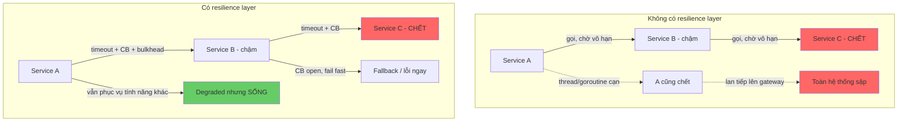
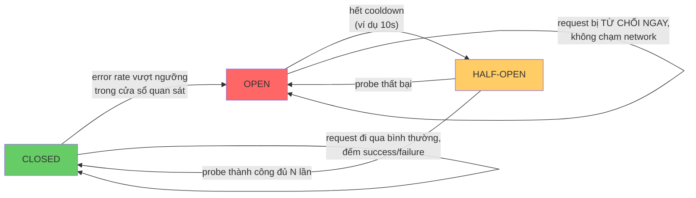
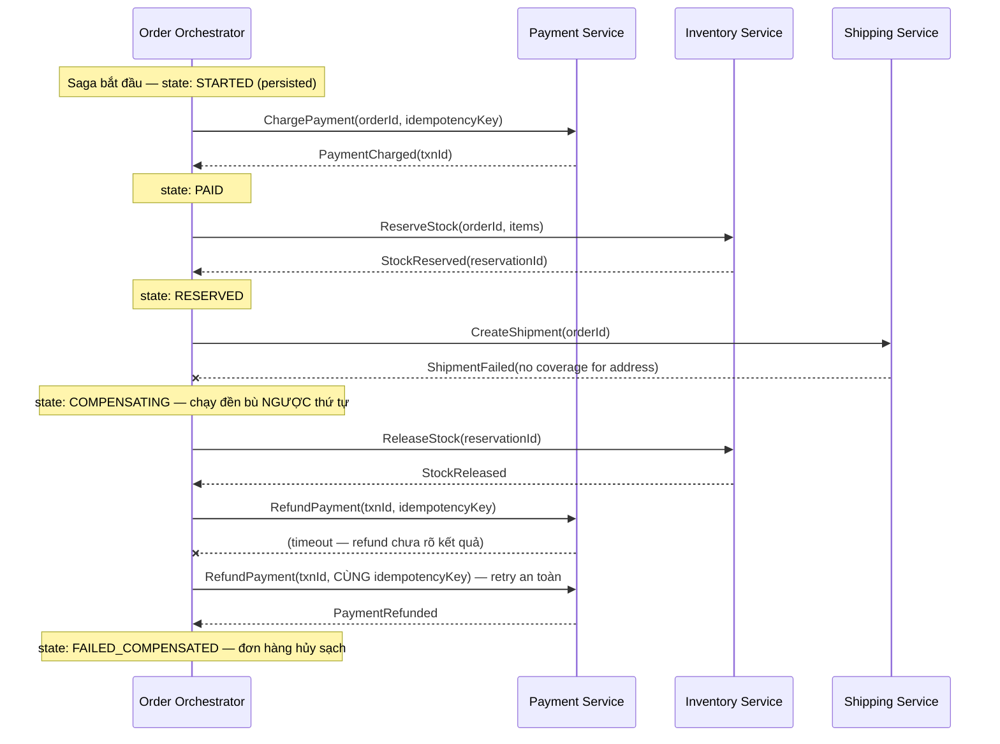
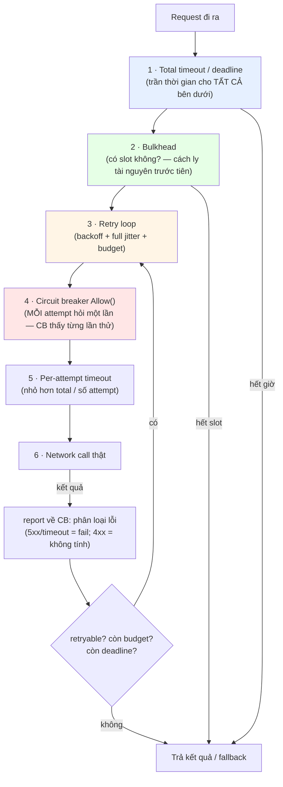

+++
title = "Chương 12: Resilience Patterns — Giao tiếp ổn định trong hệ thống không ổn định"
date = "2026-02-22T18:00:00+07:00"
draft = false
tags = ["backend", "communication", "api", "architecture"]
series = ["Backend Communication Architecture"]
+++

[← Chương trước](/series/backend-communication-architect/11-api-design/) | Mục lục | Chương sau →

---

## 12.1. First principles: partial failure là trạng thái bình thường

Trong monolith, một lời gọi hàm hoặc thành công hoặc ném exception — và cả hai đều xảy ra trong cùng một process, cùng một số phận. Khoảnh khắc bạn tách hàm đó ra sau một network call, bạn nhận về một tập kết quả hoàn toàn mới: thành công, thất bại, **và mọi trạng thái lửng lơ ở giữa** — request đến nơi nhưng response thất lạc, request đang xếp hàng ở đâu đó và sẽ được xử lý sau 30 giây nữa, downstream đã xử lý xong nhưng bạn đã bỏ đi.

Tám ngộ nhận kinh điển của distributed computing (8 fallacies) tồn tại vì chúng đúng... hầu hết thời gian: *network đáng tin cậy; latency bằng không; băng thông vô hạn; network an toàn; topology không đổi; có một admin; chi phí truyền bằng không; network đồng nhất*. Hệ thống chết không phải vì engineer tin tám điều này một cách ngây thơ — mà vì code được viết trong những ngày network *tỏ ra* đáng tin, rồi vận hành trong những đêm nó không như thế.

Làm phép tính để thấy "hiếm" nghĩa là gì ở scale: một hệ thống 30 service, mỗi request đi qua trung bình 5 hop, 2.000 request/giây → 10.000 network call/giây. Nếu mỗi call có xác suất fail 0,01% (một phần vạn — network "rất tốt"), bạn có **1 failure mỗi giây, mọi giây, mãi mãi**. Partial failure không phải sự kiện; nó là **nhiễu nền thường trực**.

Từ đó rút ra mục tiêu đúng của resilience engineering — và đây là điểm nhiều team hiểu sai: **mục tiêu không phải là tránh failure** (bất khả thi), mà là **chặn failure lan truyền** — một downstream chậm không được kéo sập caller, một dependency chết không được ăn hết tài nguyên dùng chung, một đợt retry không được biến sự cố nhỏ thành sự cố lớn. Mọi pattern trong chương này là một dạng **cách ly hoặc kiểm soát lan truyền**.



Cấu trúc chương: từng pattern theo trình tự cơ chế → trade-off → production impact → code Go, sau đó ghép chúng lại thành một stack có thứ tự (mục 12.12) — vì các pattern này **không độc lập**, và ghép sai thứ tự còn tệ hơn không dùng.

---

## 12.2. Timeout — pattern rẻ nhất, bị bỏ quên nhiều nhất

### 12.2.1. Cơ chế: timeout ở mọi tầng, không chỉ một

Một HTTP call có nhiều pha, mỗi pha fail theo cách riêng, và **một timeout tổng không thay được timeout từng pha**: DNS resolve có thể treo; TCP connect có thể treo (SYN rơi vào hố đen — host chết mà không kịp gửi RST); TLS handshake có thể treo; server có thể nhận request rồi im lặng; server có thể trả header rồi nhỏ giọt body. Client Go mặc định — `http.Client{}` — **không có timeout nào cả**: một downstream treo là goroutine của bạn treo vĩnh viễn, kèm theo connection, buffer, và mọi thứ nó giữ.

```go
// HTTP client production-grade: timeout TƯỜNG MINH ở từng tầng.
func newHTTPClient() *http.Client {
	dialer := &net.Dialer{
		Timeout:   2 * time.Second, // TCP connect: nhanh — connect chậm gần như luôn nghĩa là chết
		KeepAlive: 30 * time.Second,
	}
	transport := &http.Transport{
		DialContext:           dialer.DialContext,
		TLSHandshakeTimeout:   2 * time.Second,
		ResponseHeaderTimeout: 3 * time.Second,  // từ lúc gửi xong request đến byte header đầu tiên
		IdleConnTimeout:       90 * time.Second,
		MaxIdleConnsPerHost:   50,               // liên quan bulkhead — mục 12.5
		ExpectContinueTimeout: 1 * time.Second,
	}
	return &http.Client{
		Transport: transport,
		Timeout:   5 * time.Second, // trần TỔNG cho cả request, gồm cả đọc body
	}
}
```

Nguyên tắc chọn số: timeout không phải cấu hình tùy hứng — nó suy từ **latency distribution thực tế của downstream** (thường p99 × hệ số an toàn 2–3) và từ **giá trị nghiệp vụ của việc chờ**: sau X ms, người dùng đã bỏ đi / caller đã timeout — chờ tiếp chỉ là đốt tài nguyên cho một kết quả không ai nhận.

### 12.2.2. Timeout budget và deadline propagation

Vấn đề xuất hiện khi có chuỗi gọi: Gateway (timeout 10s) → A (?) → B (?) → C (?). Nếu mỗi tầng tự đặt timeout độc lập không nhìn nhau, hai lỗi cấu trúc xảy ra:

**Lỗi 1 — tầng dưới timeout dài hơn tầng trên → orphan work.** Gateway timeout 3s, nhưng A gọi B với timeout 10s. Giây thứ 3, gateway cắt, trả lỗi cho user — user bấm lại. Trong khi đó A vẫn miệt mài chờ B thêm 7 giây, chiếm goroutine, connection, và có thể **hoàn tất một side effect mà không ai còn nhận kết quả** — với request ghi, đó là mầm của dữ liệu trùng (kết hợp với retry của user, chính là kịch bản double-charge của chương 11). Orphan work còn có tính chất khuếch đại: hệ thống đang quá tải là lúc timeout xảy ra nhiều nhất, tức là lúc tỷ lệ công-sức-bỏ-đi cao nhất — bạn bận nhất đúng lúc phần lớn việc đang làm là vô ích.

**Lỗi 2 — không trừ hao thời gian đã tiêu.** A nhận budget 3s, xử lý nội bộ mất 1s, rồi gọi B "với timeout 3s" — tổng 4s, vượt lời hứa với gateway.

Giải pháp: **deadline propagation** — tầng ngoài cùng quyết định một deadline tuyệt đối, truyền xuống theo request; mỗi tầng chỉ được dùng phần còn lại. Trong Go, đây chính là việc `context.Context` sinh ra để làm:

```go
// Tầng ngoài cùng đặt deadline TUYỆT ĐỐI một lần.
ctx, cancel := context.WithTimeout(r.Context(), 3*time.Second)
defer cancel()

// Mọi tầng dưới NHẬN ctx và truyền tiếp — không tự bịa timeout dài hơn.
// http.NewRequestWithContext làm deadline đi theo request;
// database/sql, redis client, grpc đều nhận ctx tương tự.
req, _ := http.NewRequestWithContext(ctx, http.MethodGet, url, nil)
resp, err := client.Do(req)

// Trước một bước tốn kém, kiểm tra budget còn lại có đáng không:
if dl, ok := ctx.Deadline(); ok && time.Until(dl) < 200*time.Millisecond {
	return ErrInsufficientBudget // fail fast: 200ms không đủ cho call này, đừng bắt đầu
}
```

Qua ranh giới process: gRPC tự động propagate deadline qua metadata (`grpc-timeout`) — một trong những lý do chọn gRPC cho internal call. Với HTTP thuần, tự truyền qua header (ví dụ `X-Request-Deadline` chứa unix millis) và middleware phía nhận dựng lại `context.WithDeadline`. Quy tắc bất biến rút ra: **timeout của caller phải lớn hơn tổng thời gian tệ nhất của mọi downstream nó chờ** (kể cả retry! — xem 12.3), nếu không mọi thứ dưới đường cắt đều thành orphan work.

---

## 12.3. Retry — con dao hai lưỡi sắc nhất

### 12.3.1. Điều kiện được retry: transient và idempotent

Retry là pattern duy nhất trong chương này **có khả năng chủ động gây ra outage** thay vì chỉ thất bại trong việc ngăn outage. Trước khi bàn cách retry, phải bàn *khi nào được phép*:

1. **Chỉ retry lỗi transient** — lỗi mà lần thử sau có cơ may khác lần trước: connection refused/reset, timeout, 503, 429 (sau `Retry-After`). **Không bao giờ** retry 400/401/403/404/422 — request sai thì gửi lại vẫn sai, bạn chỉ nhân đôi tải và làm bẩn log. Danh sách lỗi retryable phải là **whitelist tường minh** trong code, không phải "retry mọi err != nil".
2. **Chỉ retry request idempotent** — hoặc idempotent tự nhiên (GET, PUT, DELETE) hoặc được làm cho idempotent bằng Idempotency-Key (chương 11, mục 11.8). Retry một POST không có key sau timeout là đánh bạc với dữ liệu: timeout không có nghĩa là "chưa xử lý", nó nghĩa là "**không biết** đã xử lý chưa".

### 12.3.2. Exponential backoff + full jitter — vì sao jitter là bắt buộc

Backoff tuyến tính hoặc cố định không đủ: nếu downstream cần 30 giây hồi phục mà bạn retry mỗi 1 giây, bạn đấm nó 30 lần. Exponential backoff (1s, 2s, 4s, 8s...) giải quyết chuyện đó — nhưng exponential backoff **không có jitter** lại tạo ra một vấn đề mới, tinh vi hơn: **đồng bộ hóa vô tình**.

Hình dung bằng "đồ thị chữ": downstream sập lúc t=0. 10.000 client đang gọi nó đều fail gần như cùng lúc. Tất cả cùng backoff 1 giây — và lúc t=1s, **10.000 retry đến cùng một khoảnh khắc**, như một nhịp tim khổng lồ:

```
Tải lên downstream (không jitter):        Tải (full jitter):
t=0s  ██████████ 10.000 (sập)             t=0s    ██████████ 10.000 (sập)
t=1s  ██████████ 10.000 (đấm nhịp 1)      t=0..1s ███ ~trải đều vài trăm/100ms
t=3s  ██████████ 10.000 (đấm nhịp 2)      t=1..3s ██ thưa dần
t=7s  ██████████ 10.000 (đấm nhịp 3)      t=3..7s █ downstream THỞ được và hồi phục
```

Downstream vừa ngóc đầu dậy sau mỗi nhịp lại bị cả đàn client giẫm xuống — **thundering herd**. Nó không bao giờ có một khoảng lặng đủ dài để warm up cache, chạy hết backlog, qua health check. Giải pháp là **full jitter** (khuyến nghị từ phân tích nổi tiếng của AWS): thay vì sleep đúng `base × 2^attempt`, sleep một khoảng **ngẫu nhiên trong [0, base × 2^attempt]**. Điều này phá vỡ sự đồng bộ — cùng tổng lượng retry nhưng trải mỏng theo thời gian, và mô phỏng cho thấy full jitter vừa giảm tải đỉnh vừa giảm tổng thời gian hồi phục so với equal jitter hay không jitter.

### 12.3.3. Retry budget và retry amplification

Hai cơ chế an toàn còn thiếu, và đều là vũ khí chống **metastable failure** (mục 12.13):

**Retry budget**: giới hạn *tỷ lệ* traffic được phép là retry — ví dụ retry ≤ 10% số request gốc trong cửa sổ trượt. Khi downstream khỏe, 10% thừa đủ. Khi downstream sập diện rộng, budget cạn ngay và **retry ngừng hoàn toàn** — bạn không đổ thêm dầu. Đây là khác biệt bản chất với max-attempts: max-attempts giới hạn từng request; budget giới hạn **hành vi tập thể** — thứ thực sự giết downstream.

**Retry amplification qua nhiều tầng**: gateway retry 3 lần, gọi A cũng retry 3 lần, A gọi B cũng retry 3 lần. Khi B sập, mỗi request người dùng biến thành 3 × 3 × 3 = **27 request** đập vào B — hệ thống tự khuếch đại tải lên 27 lần đúng lúc yếu nhất. Quy tắc kiến trúc: **retry ở một tầng duy nhất** — thường là tầng gần failure nhất (nơi biết lỗi có transient không) hoặc tầng ngoài cùng (nơi biết giá trị nghiệp vụ) — chọn một, và các tầng còn lại fail fast. Đây là quyết định *toàn hệ thống*, không phải của từng team; nó phải nằm trong tài liệu kiến trúc chung.

```go
// Retry với exponential backoff + full jitter + budget. Đầy đủ, dùng được ngay.
package retry

import (
	"context"
	"errors"
	"math/rand/v2"
	"sync"
	"time"
)

// Budget: token bucket cho retry — refill theo tỷ lệ request thành công/gốc.
type Budget struct {
	mu     sync.Mutex
	tokens float64
	max    float64
	ratio  float64 // mỗi request gốc nạp `ratio` token; 0.1 = retry tối đa ~10% traffic
}

func NewBudget(max, ratio float64) *Budget { return &Budget{tokens: max, max: max, ratio: ratio} }

func (b *Budget) OnRequest() { // gọi cho MỖI request gốc
	b.mu.Lock(); defer b.mu.Unlock()
	b.tokens = min(b.max, b.tokens+b.ratio)
}
func (b *Budget) TrySpend() bool { // gọi trước MỖI retry
	b.mu.Lock(); defer b.mu.Unlock()
	if b.tokens >= 1 {
		b.tokens--
		return true
	}
	return false
}

type Policy struct {
	MaxAttempts int           // tổng số lần thử, kể cả lần đầu
	BaseDelay   time.Duration // ví dụ 100ms
	MaxDelay    time.Duration // trần cho backoff, ví dụ 5s
	Budget      *Budget
	Retryable   func(error) bool // WHITELIST lỗi transient — bắt buộc cung cấp
}

var ErrBudgetExhausted = errors.New("retry: budget exhausted")

func (p Policy) Do(ctx context.Context, op func(ctx context.Context) error) error {
	p.Budget.OnRequest()
	var lastErr error
	for attempt := 0; attempt < p.MaxAttempts; attempt++ {
		if attempt > 0 {
			// Full jitter: sleep ngẫu nhiên trong [0, base*2^attempt], có trần.
			backoff := min(p.MaxDelay, p.BaseDelay<<uint(attempt-1))
			sleep := time.Duration(rand.Int64N(int64(backoff) + 1))
			select {
			case <-time.After(sleep):
			case <-ctx.Done(): // deadline propagation thắng retry:
				return ctx.Err() // hết budget thời gian thì thôi, dù còn attempt
			}
			if !p.Budget.TrySpend() {
				return errors.Join(ErrBudgetExhausted, lastErr)
			}
		}
		lastErr = op(ctx)
		if lastErr == nil || !p.Retryable(lastErr) {
			return lastErr
		}
	}
	return lastErr
}
```

Hai quyết định thiết kế cần chỉ ra: (1) **`ctx.Done()` được kiểm tra trong lúc sleep** — retry phải phục tùng deadline; retry lần 3 khi caller đã bỏ đi chỉ tạo orphan work; hệ quả thực hành: *timeout tổng của caller phải ≥ tổng (timeout mỗi lần thử + backoff)* — nếu không, các attempt cuối không bao giờ có cơ hội chạy trọn; (2) `Retryable` là tham số **bắt buộc không có default** — buộc người dùng suy nghĩ về whitelist thay vì thừa hưởng một default nguy hiểm.

---

## 12.4. Circuit Breaker — fail fast khi thất bại là chắc chắn

### 12.4.1. Cơ chế: state machine ba trạng thái

Retry trả lời "lỗi *này* có đáng thử lại không". Circuit breaker (CB) trả lời câu hỏi ở tầng trên: "**downstream này** còn đáng gọi không". Khi một dependency đã chết rõ ràng, tiếp tục gửi request cho nó có ba tác hại: mỗi request tốn một timeout đầy đủ (caller chậm theo), chiếm tài nguyên (goroutine, connection) suốt thời gian chờ, và đè thêm tải lên thứ đang cố hồi phục.



- **Closed** (bình thường): request đi qua, CB đếm kết quả trong cửa sổ trượt. Vượt ngưỡng → **Open**.
- **Open**: mọi request bị từ chối **ngay lập tức** với lỗi riêng (`ErrCircuitOpen`) — không chạm network. Caller nhận lỗi sau micro giây thay vì sau 5 giây timeout. Sau thời gian cooldown → **Half-open**.
- **Half-open**: cho **một số lượng giới hạn** request thật đi qua làm probe. Thành công đủ → Closed. Thất bại → quay lại Open, reset cooldown. Điểm chết người hay bị code sai: half-open phải **giới hạn số probe đồng thời** — nếu mở van cho toàn bộ traffic dồn ứ tràn qua cùng lúc, chính cú "thử lại" đó đánh gục downstream vừa ngóc dậy, hệt thundering herd thu nhỏ.

### 12.4.2. Các quyết định thiết kế

**Ngưỡng: error rate hay consecutive failures?** Consecutive failures (mở sau N lỗi liên tiếp) đơn giản nhưng dễ nhiễu ở traffic thấp và dễ "được cứu" bởi một success lẻ giữa chuỗi lỗi. Error rate trên cửa sổ trượt (ví dụ ≥ 50% lỗi trong 10s, với tối thiểu 20 request để có ý nghĩa thống kê) phản ánh sức khỏe thật tốt hơn — là lựa chọn mặc định cho service có traffic ổn định; consecutive phù hợp cho traffic thưa (cron, batch).

**Đếm gì là failure?** Timeout và 5xx: có. 4xx: **không** — 400 là lỗi của caller, không nói gì về sức khỏe downstream; đếm 4xx vào CB là để một client hỏng làm cả fleet ngừng gọi một service khỏe mạnh.

**Per-endpoint hay per-host?** CB per-host (cả service downstream chung một breaker): một endpoint chậm (report nặng) làm mở breaker chặn luôn endpoint khỏe (health check, lookup nhẹ) — blast radius sai. CB per-endpoint: cách ly đúng hơn nhưng nhiều state, và khi cả host chết thì mỗi endpoint phải tự khám phá điều đó. Thực dụng: **per-host làm mặc định, tách breaker riêng cho endpoint có latency profile khác biệt rõ rệt** — cùng logic với bulkhead pool ở mục 12.5.

**Fallback**: CB mở rồi làm gì là quyết định *nghiệp vụ*: trả cache cũ (stale-while-error) cho dữ liệu đọc; giá trị mặc định an toàn (recommendation service chết → trả danh sách phổ biến); degrade tính năng (ẩn widget); hoặc lỗi tường minh cho thao tác ghi — **không bao giờ đoán bừa cho thao tác có tiền**.

### 12.4.3. Code Go: CB tối giản tự viết

Trong production hãy dùng thư viện đã được tôi luyện — `github.com/sony/gobreaker` là lựa chọn phổ biến và đủ tốt cho đa số trường hợp (`failsafe-go` nếu cần bộ pattern đầy đủ hơn). Nhưng tự viết một CB tối giản một lần là cách chắc chắn nhất để hiểu các race condition bên trong:

```go
package breaker

import (
	"errors"
	"sync"
	"time"
)

type State int

const (
	Closed State = iota
	Open
	HalfOpen
)

var ErrOpen = errors.New("breaker: circuit open")

type Breaker struct {
	mu               sync.Mutex
	state            State
	failures         int       // consecutive failures (bản tối giản; production: sliding window error rate)
	failureThreshold int
	cooldown         time.Duration
	openedAt         time.Time
	halfOpenInFlight int // giới hạn probe đồng thời ở half-open
	maxProbes        int
	probeSuccesses   int
	probesToClose    int
}

func New(failureThreshold int, cooldown time.Duration) *Breaker {
	return &Breaker{
		failureThreshold: failureThreshold, cooldown: cooldown,
		maxProbes: 1, probesToClose: 3,
	}
}

// Allow hỏi quyền TRƯỚC khi gọi downstream. Trả về hàm report kết quả.
func (b *Breaker) Allow() (report func(err error), allowed error) {
	b.mu.Lock()
	defer b.mu.Unlock()

	switch b.state {
	case Open:
		if time.Since(b.openedAt) < b.cooldown {
			return nil, ErrOpen
		}
		b.state = HalfOpen // hết cooldown: chuyển half-open ngay trong lock
		b.probeSuccesses = 0
		b.halfOpenInFlight = 0
		fallthrough
	case HalfOpen:
		if b.halfOpenInFlight >= b.maxProbes {
			return nil, ErrOpen // van chỉ hé — quá số probe thì vẫn từ chối
		}
		b.halfOpenInFlight++
	case Closed:
		// đi qua tự do
	}
	return b.report, nil
}

func (b *Breaker) report(err error) {
	b.mu.Lock()
	defer b.mu.Unlock()

	switch b.state {
	case HalfOpen:
		b.halfOpenInFlight--
		if err != nil {
			b.trip() // probe fail: đóng sập lại, reset cooldown
			return
		}
		b.probeSuccesses++
		if b.probeSuccesses >= b.probesToClose {
			b.state = Closed
			b.failures = 0
		}
	case Closed:
		if err != nil {
			b.failures++
			if b.failures >= b.failureThreshold {
				b.trip()
			}
		} else {
			b.failures = 0
		}
	}
}

func (b *Breaker) trip() {
	b.state = Open
	b.openedAt = time.Now()
}

// Cách dùng — caller phân loại lỗi TRƯỚC khi báo cáo (4xx không tính):
//
//	report, err := br.Allow()
//	if err != nil { return fallbackOrFail() }
//	resp, callErr := doCall(ctx)
//	report(classify(resp, callErr)) // nil nếu thành công HOẶC 4xx
```

Chi tiết đáng chú ý: `Allow` trả về closure `report` — buộc mỗi lượt "xin phép" phải đi kèm một lượt "báo cáo", và giúp đếm `halfOpenInFlight` chính xác kể cả khi nhiều goroutine đan xen. Quên report là leak probe slot — trong production, wrap bằng helper để không thể quên.

Một điều CB **không** làm được: nó chỉ quan sát traffic của *chính instance đó*. 50 instance của service A là 50 CB độc lập, mỗi cái tự học rằng B đã chết — nghĩa là 50 lượt "học phí". Đó là chấp nhận được; đồng bộ CB state qua network để "học chung" nghe hay nhưng tạo thêm một dependency vào đúng lúc hệ thống đang cháy — đừng làm.

---

## 12.5. Bulkhead — một downstream chậm không được ăn cả con tàu

Tên pattern lấy từ vách ngăn kín nước của tàu thủy: thủng một khoang, chìm một khoang. Trong service, các "khoang" là **tài nguyên hữu hạn dùng chung**: goroutine, connection pool, worker, memory. Failure mode kinh điển — và là cơ chế lan truyền số một trong thực tế:

Service A gọi hai downstream: B (payment, quan trọng) và C (recommendation, phụ). C bắt đầu chậm — chưa chết, chỉ chậm: mỗi call mất 10s thay vì 100ms. Mỗi request đến A đụng C sẽ **giữ một goroutine và một connection trong 10 giây**. Với 500 request/giây đụng C, sau vài giây A có 5.000 goroutine treo, connection pool (dùng chung!) cạn sạch — và giờ **request đi đường B cũng không lấy được connection**. Tính năng phụ vừa giết tính năng chính. Ghi chú quan trọng: goroutine rẻ hơn thread nhiều nên Go "chịu đựng" lâu hơn — nhưng điều đó chỉ dời điểm gãy sang connection pool, memory, và file descriptor; vấn đề cấu trúc y nguyên.

Cơ chế cách ly, ba mức từ nhẹ đến nặng:

1. **Connection pool riêng per downstream**: mỗi downstream một `http.Transport` riêng với `MaxConnsPerHost` riêng — C chậm chỉ cạn pool của C.
2. **Semaphore giới hạn concurrency per downstream**: trần số call đồng thời; vượt trần thì fail fast (hoặc chờ có deadline) thay vì xếp hàng vô hạn. Đơn giản, hiệu quả, đủ cho đa số trường hợp.
3. **Worker pool riêng**: hàng đợi + số worker cố định cho mỗi loại công việc — cách ly mạnh nhất, chi phí cấu trúc cao nhất, hợp với xử lý nền.

```go
// Bulkhead bằng semaphore có deadline — mức 2, điểm cân bằng tốt nhất.
package bulkhead

import (
	"context"
	"errors"
)

var ErrFull = errors.New("bulkhead: at capacity")

type Bulkhead struct {
	sem chan struct{}
}

func New(capacity int) *Bulkhead {
	return &Bulkhead{sem: make(chan struct{}, capacity)}
}

// Do chạy op nếu còn chỗ. KHÔNG chờ vô hạn: hoặc lấy được slot,
// hoặc fail theo ctx — hàng đợi vô hạn chính là thứ bulkhead sinh ra để tránh.
func (b *Bulkhead) Do(ctx context.Context, op func(context.Context) error) error {
	select {
	case b.sem <- struct{}{}:
		defer func() { <-b.sem }()
		return op(ctx)
	case <-ctx.Done():
		return errors.Join(ErrFull, ctx.Err())
	default:
		// Quyết định thiết kế: thử non-blocking trước? Ở đây chọn chờ-có-deadline.
		// Với downstream phụ (recommendation), đổi sang fail fast ngay:
		// return ErrFull
		select {
		case b.sem <- struct{}{}:
			defer func() { <-b.sem }()
			return op(ctx)
		case <-ctx.Done():
			return errors.Join(ErrFull, ctx.Err())
		}
	}
}

// Cấu hình per-downstream — kích thước phản ánh mức độ quan trọng:
//   payment:        New(200)
//   recommendation: New(50)   // C có chậm cũng chỉ giam được 50 goroutine
```

Chọn kích thước bằng **Little's Law**: concurrency ≈ throughput × latency. Downstream 500 req/s với p99 200ms cần ~100 slot lúc bình thường; đặt trần 150 là dư cho bình thường nhưng chặn được thảm họa (khi latency thành 10s, nhu cầu "tự nhiên" là 5.000 — trần 150 chính là vách ngăn). Trade-off cần nói thẳng: trần đặt quá thấp tự gây lỗi khi traffic tăng lành mạnh — kích thước bulkhead phải có metric (saturation, số lần ErrFull) và được xem lại theo tải thực tế.

---

## 12.6. Rate Limiting — bảo vệ mình và tôn trọng người khác

Rate limiting xuất hiện ở hai phía với hai mục đích khác nhau, đừng nhầm:

- **Server-side (bảo vệ mình)**: chặn client vượt hạn mức để một client tham lam/hỏng không ăn hết công suất của mọi người. Đây là **load shedding có chủ đích** — từ chối sớm một phần để phần còn lại sống.
- **Client-side (tôn trọng downstream)**: tự giới hạn nhịp gọi theo hạn mức đã cam kết với downstream — đặc biệt với third-party API — để không bao giờ *nhận* 429 thay vì xử lý 429.

Ba thuật toán chính:

| Thuật toán | Cơ chế | Burst | Đặc điểm |
|---|---|---|---|
| Token bucket | Bucket chứa token, refill đều r/s, mỗi request tiêu 1 token | Cho phép burst tới kích thước bucket | Mặc định tốt nhất: mềm dẻo, rẻ, `golang.org/x/time/rate` có sẵn |
| Leaky bucket | Hàng đợi xả ra với tốc độ cố định | Làm phẳng burst thành dòng đều | Hợp khi downstream cần nhịp đều tuyệt đối; thêm queueing delay |
| Sliding window (counter/log) | Đếm request trong cửa sổ trượt | Chính xác theo cửa sổ | Sliding log chính xác nhưng tốn bộ nhớ; sliding counter là thỏa hiệp phổ biến cho distributed |

Fixed window (đếm theo phút lịch) có lỗi biên kinh điển — 100 req ở giây 59 + 100 req ở giây 61 = 200 req trong 2 giây mà vẫn "đúng luật" — chỉ dùng khi sự thô đó chấp nhận được.

**Distributed rate limit**: limiter in-memory nhân theo số instance (10 instance × 100 req/s = 1000 req/s thực tế — có khi thế là đủ và bạn nên dừng ở đó vì nó rẻ). Khi cần hạn mức *toàn cục* chính xác (billing, hợp đồng API), cần store chung — Redis với script Lua để "đọc-tính-ghi" atomic:

```lua
-- Sliding window counter trên Redis (chạy bằng EVALSHA — atomic).
-- KEYS[1]=key; ARGV[1]=limit, ARGV[2]=window_sec, ARGV[3]=now_ms
local current = redis.call('INCR', KEYS[1])
if current == 1 then
  redis.call('PEXPIRE', KEYS[1], ARGV[2] * 1000)
end
if current > tonumber(ARGV[1]) then
  return {0, redis.call('PTTL', KEYS[1])} -- {denied, retry_after_ms}
end
return {1, 0}
```

Trade-off: mỗi request thêm một round-trip Redis (~0,5–1ms nội DC) và Redis thành dependency của mọi request — cần quyết định fail-open hay fail-closed khi Redis chết (thường fail-open cho rate limit, ngược với idempotency store). Tối ưu phổ biến: mỗi instance xin **batch token** (lấy 100 token một lần) — đổi một chút chính xác lấy 99% số round-trip.

**Hành vi khi từ chối**: trả `429 Too Many Requests` kèm **`Retry-After`** (giây) — bạn đang *dạy* client cách cư xử; client tốt sẽ nghe theo thay vì retry bừa. Kèm các header `RateLimit-Limit`, `RateLimit-Remaining`, `RateLimit-Reset` để client chủ động giãn nhịp trước khi đụng trần. Và phía client: **429 + Retry-After là lệnh, không phải gợi ý** — retry policy (mục 12.3) phải ưu tiên giá trị này hơn backoff tự tính.

---

## 12.7. Hedged Requests — mua tail latency bằng tải

Vấn đề: latency phân phối đuôi dài. p50 = 10ms nhưng p99 = 500ms (GC pause, page cache miss, một replica nóng). Với fan-out — một request người dùng chạm 20 backend — xác suất *không* đụng p99 của backend nào là 0,99²⁰ ≈ 82%: **gần 1/5 request người dùng bị đuôi của ai đó**, dù mỗi backend đều "khỏe".

Cơ chế hedging: gửi request; nếu sau một ngưỡng (thường chọn **p95 latency** hiện hành) chưa có response, gửi **bản sao thứ hai** đến replica khác; lấy response nào về trước, hủy cái còn lại. Vì ngưỡng là p95, chỉ ~5% request bị hedge → tải tăng ~5%, nhưng tail latency giảm mạnh — bạn đổi phần chậm nhất của replica này lấy phần bình thường của replica kia.

| Chiến lược | Tải thêm | p99 (minh họa) |
|---|---|---|
| Không hedge | 0% | 480 ms |
| Hedge ngay lập tức (gửi đôi mọi request) | +100% | 45 ms |
| Hedge sau p95 | ~+5% | 70 ms |

*Số liệu minh họa, phụ thuộc môi trường; mô hình theo kết quả "The Tail at Scale" (Dean & Barroso).*

Điều kiện sử dụng — nghiêm ngặt: (1) **chỉ cho idempotent read** — hedge một thao tác ghi không có idempotency key là cố tình tạo double-write; (2) ngưỡng hedge phải **thích ứng** (đo p95 trượt), vì p95 cố định sẽ sai khi hệ thống đổi tải; (3) **phải có phanh**: khi downstream quá tải, latency tăng → nhiều request vượt p95 cũ → hedge nhiều hơn → tải tăng thêm — hedging không phanh là một vòng khuếch đại; giải pháp là tắt hedge khi tỷ lệ hedge vượt ngưỡng (một dạng retry budget) và hủy bản sao còn lại ngay khi có kết quả (`context.WithCancel` cho từng nhánh).

```go
// Hedged GET: gửi bản 2 sau ngưỡng, lấy kết quả đầu tiên, hủy phần còn lại.
func hedgedDo(ctx context.Context, c *http.Client, mkReq func() *http.Request, after time.Duration) (*http.Response, error) {
	ctx, cancel := context.WithCancel(ctx)
	// KHÔNG defer cancel() ở đây: cancel khi có kết quả, để body của winner còn đọc được
	type result struct {
		resp *http.Response
		err  error
	}
	ch := make(chan result, 2)
	launch := func() {
		req := mkReq().WithContext(ctx)
		resp, err := c.Do(req)
		ch <- result{resp, err}
	}
	go launch()
	timer := time.NewTimer(after)
	defer timer.Stop()

	outstanding := 1
	for {
		select {
		case <-timer.C:
			outstanding++
			go launch() // bản hedge
		case r := <-ch:
			outstanding--
			if r.err == nil {
				go drainLosers(ch, outstanding, cancel) // hủy + dọn nhánh thua
				return r.resp, nil
			}
			if outstanding == 0 {
				cancel()
				return nil, r.err
			}
			// nhánh này fail nhưng nhánh kia còn chạy — chờ tiếp
		}
	}
}
```

---

## 12.8. Request Coalescing / singleflight — gộp những câu hỏi trùng nhau

Vấn đề: **cache stampede**. Cache key nóng (trang chủ, config, profile của celebrity) hết hạn. Trong khoảnh khắc đó, 5.000 request cùng miss, và **cả 5.000 cùng đi tính lại** — 5.000 query giống hệt nhau đập vào DB cho cùng một câu trả lời. DB khựng, latency tăng, thêm request dồn vào — một cú hắt hơi của cache thành cơn co giật của DB.

Cơ chế coalescing: các request **trùng key đang in-flight** không tự đi tính — chúng *đăng ký chờ* kết quả của request đầu tiên. 5.000 miss → **1** query → 5.000 response. Trong Go, đây là `golang.org/x/sync/singleflight`:

```go
import "golang.org/x/sync/singleflight"

type ProductCache struct {
	sf    singleflight.Group
	cache Cache
	repo  ProductRepo
}

func (p *ProductCache) Get(ctx context.Context, id string) (*Product, error) {
	if v, ok := p.cache.Get(id); ok {
		return v, nil
	}
	// Mọi goroutine cùng key ở đây sẽ CHỜ chung một lần thực thi.
	v, err, _ := p.sf.Do(id, func() (any, error) {
		// Cẩn trọng #1: KHÔNG dùng ctx của request đầu tiên cho công việc chung —
		// nếu request đó bị cancel, 4.999 người chờ chết oan theo.
		// Tách context: giữ trace/values, bỏ cancel, tự đặt trần thời gian.
		wctx, cancel := context.WithTimeout(context.WithoutCancel(ctx), 3*time.Second)
		defer cancel()
		prod, err := p.repo.Load(wctx, id)
		if err != nil {
			return nil, err
		}
		p.cache.Set(id, prod, 5*time.Minute)
		return prod, nil
	})
	if err != nil {
		return nil, err
	}
	return v.(*Product), nil
}
```

Hai điểm cẩn trọng còn lại: **(2) lỗi cũng được chia sẻ** — một lần load fail là 5.000 caller cùng nhận lỗi đó; đó thường là điều đúng (fail nhanh đồng loạt còn hơn 5.000 lần thử), nhưng nếu không muốn, dùng `sf.Forget(key)` sau lỗi để lần gọi kế tiếp thử lại; **(3) singleflight là per-process** — 50 instance vẫn là 50 query khi key hết hạn; thường thế là đủ tốt (giảm 5.000 → 50). Nếu cần đúng 1 toàn cluster, thêm distributed lock hoặc tốt hơn: **stale-while-revalidate** — trả giá trị cũ trong lúc một goroutine làm mới nền, biến stampede thành non-event.

---

## 12.9. Idempotency Key nhìn từ góc resilience

Chương 11 (mục 11.8) đã trình bày cơ chế và code đầy đủ của Idempotency-Key từ góc độ API contract. Ở đây chỉ cần đặt nó vào đúng vị trí trong bức tranh resilience: **idempotency là điều kiện tiên quyết cấp phép cho retry**. Toàn bộ mục 12.3 — backoff, jitter, budget — trả lời câu hỏi *retry thế nào cho an toàn với downstream*; idempotency key trả lời câu hỏi *retry thế nào cho an toàn với dữ liệu*. Thiếu vế sau, retry trên thao tác ghi là bất hợp pháp, và bạn buộc phải chọn giữa hai cái tệ: không retry (mất giao dịch khi lỗi transient) hoặc retry mù (double-write).

Hệ quả kiến trúc đáng ghi nhớ: **khả năng resilience của caller bị chặn trên bởi thiết kế API của callee**. Một downstream không hỗ trợ idempotency key đang âm thầm cấm mọi caller của nó retry thao tác ghi — đó là lý do idempotency phải nằm trong *tiêu chuẩn API nội bộ* của tổ chức, không phải lựa chọn của từng team. Nguyên tắc tương tự áp cho consumer trong hệ message: at-least-once delivery + **idempotent consumer** (mục 12.11) chính là idempotency key mặc bộ đồ khác.

---

## 12.10. Saga — distributed transaction không có 2PC

### 12.10.1. Vì sao không dùng 2PC và saga hoạt động thế nào

Business problem: đặt hàng cần trừ tiền (payment service), giữ hàng (inventory service), tạo vận đơn (shipping service) — ba DB khác nhau, và nghiệp vụ muốn "tất cả hoặc không gì cả". Two-phase commit trên lý thuyết giải quyết được, nhưng trong hệ microservice thực tế nó gần như không được dùng: coordinator là single point of failure giữ lock trên *tất cả* participant trong suốt hai pha (một participant chậm là mọi người cùng giữ lock — phản resilience tận gốc), và phần lớn hạ tầng hiện đại (message broker, NoSQL, API của đối tác) không tham gia XA được.

Saga đổi **atomicity** lấy **availability**: chuỗi transaction *cục bộ* — mỗi bước commit thật sự vào DB của service đó — và nếu bước sau fail, chạy **compensating action** để *đảo nghiệp vụ* các bước đã commit. Ba điều phải chấp nhận, nói thẳng với product owner:

1. **Không có isolation**: giữa các bước, trạng thái trung gian **nhìn thấy được** (tiền đã trừ, đơn chưa xác nhận). Nghiệp vụ phải định nghĩa trạng thái trung gian đó có nghĩa gì với người dùng (`PENDING`, tiền "đang tạm giữ").
2. **Compensation là nghiệp vụ, không phải rollback kỹ thuật**: refund không làm giao dịch trừ tiền biến mất — nó tạo một giao dịch ngược, có phí, có độ trễ, có thể *cũng fail* (khi đó cần retry + hàng đợi can thiệp tay). Có những bước **không đền bù được** (email đã gửi) — xếp chúng cuối chuỗi.
3. **Mỗi bước phải idempotent** — vì hạ tầng bên dưới là at-least-once.

### 12.10.2. Choreography vs Orchestration

**Choreography**: không có nhạc trưởng — mỗi service nghe event và tự phản ứng. Order phát `OrderCreated`; Payment nghe, trừ tiền, phát `PaymentCompleted`; Inventory nghe, giữ hàng, phát `StockReserved`... Fail thì phát event lỗi (`PaymentFailed`) và các service *trước đó* phải nghe để tự đền bù. Ưu: không có điểm trung tâm, coupling lỏng, thêm bước mới không sửa ai. Nhược chí mạng: **logic của saga không nằm ở đâu cả** — muốn biết "đặt hàng gồm những bước nào, fail ở bước 4 thì chuyện gì xảy ra" phải đọc 5 codebase; với 3 bước còn ổn, với 8 bước và các nhánh điều kiện thì không ai còn vẽ nổi sơ đồ đúng, và bug điển hình là *quên đăng ký một compensation cho một nhánh lỗi hiếm*.

**Orchestration**: một orchestrator (thường trong service khởi phát, hoặc engine chuyên dụng như Temporal) giữ **state machine tường minh** của saga: gọi từng participant (command qua queue hoặc API), nhận kết quả, quyết bước kế, và khi fail thì **chạy chuỗi compensation theo thứ tự ngược** cho các bước đã xong. Ưu: toàn bộ flow đọc được ở một nơi, test được như unit, timeout/retry per-step tập trung, trạng thái từng saga instance query được ("đơn 123 đang kẹt ở bước nào?"). Nhược: orchestrator là điểm coupling (mọi thay đổi flow sửa nó) và phải được thiết kế HA + persistent state — nó không được phép quên một saga đang chạy dở khi restart.

Khuyến nghị thực dụng: **choreography cho phản ứng phụ trợ** (gửi email, cập nhật analytics — những thứ "nghe rồi làm", không cần đền bù chéo); **orchestration cho business flow có tiền và có compensation** — sự tường minh đáng giá hơn sự lỏng lẻo khi hậu quả của bug là tiền.



Chú ý hai chi tiết trong diagram: compensation chạy **ngược thứ tự** các bước đã hoàn thành; và bước refund timeout được retry với **cùng idempotency key** — saga không đứng vững nếu thiếu nền idempotency (mục 12.9). Cuối cùng: state của orchestrator phải được **persist trước mỗi bước** — orchestrator restart giữa chừng phải tiếp tục đúng chỗ dừng, và đó là lúc bạn cần pattern kế tiếp.

---

## 12.11. Outbox Pattern — giải bài toán dual-write

### 12.11.1. Dual-write problem

Hầu hết service có nhu cầu này: *ghi DB và publish event, và hai việc phải cùng xảy ra*. Ví dụ: lưu order vào Postgres, publish `OrderCreated` lên Kafka. Viết ngây thơ:

```go
tx.Commit()                 // (1) ghi DB — thành công
producer.Publish(event)     // (2) publish — process crash ngay TẠI ĐÂY?
```

Crash giữa (1) và (2): order tồn tại nhưng event không bao giờ phát — mọi hệ downstream (fulfillment, notification, search index) vĩnh viễn không biết đơn hàng này tồn tại. Đảo thứ tự? Publish trước, commit fail — event ma cho một order không tồn tại. **Không có thứ tự nào đúng**, vì DB và broker là hai hệ thống không chung transaction — đây là dual-write problem, và nó không sửa được bằng try/catch hay retry: retry publish sau khi process đã chết là điều bất khả.

### 12.11.2. Cơ chế outbox: mượn transaction của DB

Ý tưởng: đừng dual-write — **single-write vào DB**, và để một tiến trình khác chuyển tiếp. Trong *cùng transaction* với business data, ghi event vào bảng `outbox`:

```sql
BEGIN;
INSERT INTO orders (...) VALUES (...);
INSERT INTO outbox (id, aggregate_id, topic, payload, created_at)
       VALUES (gen_random_uuid(), $orderId, 'orders.created', $json, now());
COMMIT;  -- atomic: order và event cùng sống hoặc cùng chết
```

Một **relay** đọc outbox và publish lên broker, đánh dấu/xóa sau khi broker xác nhận. Hai cách hiện thực relay:

| | Polling relay | CDC (Debezium đọc WAL/binlog) |
|---|---|---|
| Cơ chế | Query định kỳ `WHERE published_at IS NULL` | Tail transaction log của DB, đẩy thẳng ra Kafka |
| Độ trễ | = chu kỳ poll (100ms–vài giây) | Gần realtime (ms) |
| Tải lên DB | Query lặp liên tục (index tốt thì rẻ) | Đọc log, gần như không chạm bảng |
| Hạ tầng thêm | Không — một goroutine/job | Kafka Connect + Debezium: cả một hệ phải vận hành |
| Thứ tự | Tự quản (ORDER BY + khóa) | Theo thứ tự commit log — tốt |
| Phù hợp | Đa số team, đa số scale | Volume lớn, đã có sẵn hệ Kafka Connect |

Bắt đầu bằng polling — nó *đủ* cho đa số hệ thống và bạn hiểu được từng dòng của nó; chuyển CDC khi độ trễ hoặc tải poll thành vấn đề đo được.

**Hệ quả bắt buộc phải hiểu**: outbox cho bạn at-least-once, **không phải** exactly-once — relay có thể publish xong rồi crash trước khi đánh dấu, và sẽ publish lại. Vì vậy mọi **consumer phải idempotent**: dedupe theo `event_id` (bảng `processed_events` với unique constraint, hoặc upsert theo khóa nghiệp vụ). Chuỗi đầy đủ là: *transactional outbox + at-least-once relay + idempotent consumer* — thiếu mắt xích cuối, hai mắt đầu chỉ chuyển vấn đề đi chỗ khác.

```go
// Outbox relay tối giản: polling, batch, giữ thứ tự, an toàn khi chạy nhiều bản.
package outbox

import (
	"context"
	"database/sql"
	"log/slog"
	"time"
)

type Publisher interface {
	Publish(ctx context.Context, topic string, key string, payload []byte) error
}

type Relay struct {
	db       *sql.DB
	pub      Publisher
	interval time.Duration
	batch    int
}

func (r *Relay) Run(ctx context.Context) {
	t := time.NewTicker(r.interval)
	defer t.Stop()
	for {
		select {
		case <-ctx.Done():
			return
		case <-t.C:
			if err := r.drainOnce(ctx); err != nil {
				slog.ErrorContext(ctx, "outbox: drain failed", "err", err)
				// Không panic: lượt poll sau thử lại — outbox vốn là bộ đệm bền.
			}
		}
	}
}

func (r *Relay) drainOnce(ctx context.Context) error {
	tx, err := r.db.BeginTx(ctx, nil)
	if err != nil {
		return err
	}
	defer tx.Rollback()

	// FOR UPDATE SKIP LOCKED: nhiều bản relay chạy song song không giẫm nhau —
	// mỗi bản khóa một lô hàng khác nhau. ORDER BY id giữ thứ tự per-relay;
	// thứ tự per-aggregate được Kafka partition key (aggregate_id) đảm bảo nốt.
	rows, err := tx.QueryContext(ctx, `
		SELECT id, aggregate_id, topic, payload FROM outbox
		WHERE published_at IS NULL
		ORDER BY id
		LIMIT $1
		FOR UPDATE SKIP LOCKED`, r.batch)
	if err != nil {
		return err
	}
	type row struct{ id, aggID, topic string; payload []byte }
	var pending []row
	for rows.Next() {
		var x row
		if err := rows.Scan(&x.id, &x.aggID, &x.topic, &x.payload); err != nil {
			rows.Close()
			return err
		}
		pending = append(pending, x)
	}
	rows.Close()

	for _, x := range pending {
		// Key = aggregate_id: mọi event của một order vào cùng partition, giữ thứ tự.
		if err := r.pub.Publish(ctx, x.topic, x.aggID, x.payload); err != nil {
			return err // dừng lô: giữ thứ tự quan trọng hơn tiến độ
		}
		if _, err := tx.ExecContext(ctx,
			`UPDATE outbox SET published_at = now() WHERE id = $1`, x.id); err != nil {
			return err
			// Crash giữa Publish và UPDATE → publish lại lượt sau = at-least-once.
			// Đó là lý do consumer PHẢI idempotent.
		}
	}
	return tx.Commit()
}
```

Vận hành: bảng outbox chỉ tăng — cần job dọn hàng đã publish quá N ngày; và **metric quan trọng nhất là outbox lag** (tuổi của hàng chưa publish cũ nhất) — lag tăng nghĩa là relay chết hoặc broker nghẽn, và downstream đang mù dần mà không ai kêu.

---

## 12.12. Ghép các pattern: thứ tự lớp quyết định tất cả

Các pattern trên không phải menu chọn món — chúng là **các lớp lồng nhau**, và thứ tự lồng sai làm chúng phản tác dụng. Ví dụ kinh điển của lồng sai: đặt retry *ngoài* circuit breaker thì CB mở là retry đập tiếp N lần vào cánh cửa đóng (ổn, rẻ) — nhưng đặt retry *ngoài* mà quên rằng mỗi attempt phải là một lượt `Allow()` riêng của CB thì CB không bao giờ học đủ nhanh; còn đặt timeout *ngoài* retry thì attempt đầu ăn hết budget, các attempt sau chết non.

Thứ tự chuẩn, từ ngoài vào trong, cho một call đi ra downstream:



Đọc thứ tự này bằng lý lẽ: **total deadline ngoài cùng** vì không lớp nào được sống lâu hơn lời hứa với caller; **bulkhead trước retry** vì một request không có slot thì không được quyền tốn N attempt; **CB trong retry loop** để mỗi attempt là một quan sát của CB (và khi CB mở, retry nhận `ErrOpen` — lỗi *không retryable* → thoát vòng ngay, hai pattern bắt tay nhau tự nhiên); **per-attempt timeout trong cùng** vì nó bảo vệ từng lần thử riêng lẻ. Idempotency key sống ở tầng request (sinh một lần, dùng cho mọi attempt); rate limiter client-side đứng cạnh bulkhead; hedging — nếu dùng — thay thế retry cho read path chứ không chồng lên nó.

### Refactoring example: thêm resilience layer cho HTTP client Go hiện có

Hiện trạng thường gặp — client "mộc" rải khắp codebase:

```go
// TRƯỚC: gọi trực tiếp, không tầng bảo vệ nào.
resp, err := http.Get("http://inventory/api/stock/" + id) // client mặc định: KHÔNG timeout
```

Cách refactor đúng không phải sửa 200 call-site, mà là gói toàn bộ stack vào **một `http.RoundTripper`** — điểm chặn chuẩn của Go, để mọi call-site chỉ đổi cách khởi tạo client:

```go
// SAU: resilient RoundTripper — lắp một lần, mọi call-site hưởng.
type resilientTransport struct {
	next    http.RoundTripper // transport thật, đã cấu hình timeout từng tầng (mục 12.2)
	bh      *bulkhead.Bulkhead
	br      *breaker.Breaker
	rt      retry.Policy
	perTry  time.Duration
}

func (t *resilientTransport) RoundTrip(req *http.Request) (*http.Response, error) {
	var resp *http.Response
	err := t.bh.Do(req.Context(), func(ctx context.Context) error { // 2. bulkhead
		return t.rt.Do(ctx, func(ctx context.Context) error { // 3. retry (jitter+budget)
			report, allowErr := t.br.Allow() // 4. CB — mỗi attempt một lượt
			if allowErr != nil {
				return allowErr // ErrOpen: non-retryable → retry loop thoát ngay
			}
			actx, cancel := context.WithTimeout(ctx, t.perTry) // 5. per-attempt timeout
			defer cancel()

			r2 := req.Clone(actx)
			if req.GetBody != nil { // retry cần body đọc lại được
				body, err := req.GetBody()
				if err != nil { report(nil); return err }
				r2.Body = body
			}
			res, err := t.next.RoundTrip(r2) // 6. call thật
			report(classify(res, err))       // 4xx không tính vào CB
			if err != nil {
				return err
			}
			if res.StatusCode >= 500 || res.StatusCode == 429 {
				drainAndClose(res.Body) // trả connection về pool trước khi retry
				return &httpError{status: res.StatusCode, retryAfter: res.Header.Get("Retry-After")}
			}
			resp = res
			return nil
		})
	})
	return resp, err
}
```

Ba điểm dễ sai khi làm thật: (1) **body của request POST/PUT phải replay được** — dùng `req.GetBody` (tự có khi tạo request từ `bytes.Reader`), nếu không attempt 2 gửi body rỗng; (2) **response body của attempt fail phải drain + close** trước khi retry, nếu không connection không về pool và bạn leak connection đúng lúc đang lỗi; (3) tầng 1 (total deadline) **không nằm trong transport** — nó là `context.WithTimeout` ở handler, đi vào qua `req.Context()`; transport chỉ tôn trọng nó. Cuối cùng: mỗi tầng phải **xuất metric** (CB state, bulkhead saturation, retry count, budget remaining) — resilience layer không quan sát được là resilience layer bạn chỉ biết đến khi nó làm điều bất ngờ.

---

## 12.13. Failure example: retry không jitter, không budget → metastable failure

Case đáng mổ xẻ nhất trong sự nghiệp của nhiều SRE, vì nó minh họa loại sự cố mà **nguyên nhân đã biến mất nhưng sự cố ở lại**:

**Bối cảnh**: hệ e-commerce, service Catalog được ~20 service khác gọi, tổng 8.000 req/s. Mọi client dùng chung một HTTP wrapper nội bộ: retry 3 lần, backoff cố định 500ms, **không jitter, không budget**. Catalog chạy 60% CPU lúc bình thường — "thoải mái".

**Diễn biến**:

- **T+0**: một deploy của Catalog có bug làm p99 tăng từ 80ms lên 2s (một query mất index). Team phát hiện nhanh, rollback ở **T+6 phút**. Theo mọi lý thuyết, sự cố phải kết thúc ở đây.
- **T+1 đến T+6**: trong 6 phút đó, một tỷ lệ lớn request vượt client timeout (1s) → fail → **retry ×3**. Tải thực lên Catalog từ 8.000 lên ~25.000 req/s. Backoff 500ms cố định làm các đợt retry **đồng pha** — tải đến theo nhịp sóng, mỗi đỉnh sóng đẩy thêm request vào queue của Catalog.
- **T+6, rollback xong** — và đây là phần quan trọng: Catalog code đã tốt trở lại, nhưng nó đang đối mặt 25.000 req/s với queue đầy ứ. Request mới xếp sau hàng nghìn request cũ (mà caller của chúng **đã timeout bỏ đi** — thuần orphan work), nên request mới *cũng* timeout → *cũng* sinh retry. **Hệ thống tự duy trì trạng thái quá tải bằng chính retry của mình.** Nguyên nhân gốc đã hết; vòng lặp retry → timeout → retry trở thành nguồn tải tự cấp. Đây là định nghĩa của **metastable failure**: một trạng thái xấu *ổn định*, tự nuôi, không tự thoát dù trigger đã biến mất.
- **T+6 đến T+41**: team hoang mang vì "đã rollback mà vẫn cháy". Scale thêm instance Catalog — đỡ một phần nhưng vòng lặp vẫn tự cấp đủ tải. Sự cố chỉ kết thúc khi họ làm điều phản trực giác: **giảm tải chủ động** — tắt retry ở gateway (đẩy config khẩn) và tạm drop 30% traffic ở LB trong 2 phút. Queue của Catalog xả hết, latency về bình thường, bật lại traffic — hệ thống *nhảy* về trạng thái tốt và ở lại đó.

**Phân tích hậu kỳ — từng cơ chế phòng ngự bị thiếu ở đâu**: *jitter* sẽ làm 5 phút quá tải bớt nhọn nhưng không tự cứu được; **retry budget là thứ chặn đứng kịch bản này** — với budget 10%, tải tối đa là 8.800 req/s thay vì 25.000, vòng tự cấp không đủ dinh dưỡng để tồn tại; *deadline propagation + load shedding phía server* (Catalog chủ động drop request đã quá deadline của caller thay vì xử lý orphan work) sẽ xả queue tự động; *circuit breaker* phía client sẽ cho Catalog những khoảng thở. Bốn lớp, thiếu cả bốn. Bài học cấp tổ chức: retry policy không phải chi tiết trong wrapper HTTP của mỗi team — nó là **hành vi tập thể của toàn hệ thống** và phải được thiết kế, review, và diễn tập (load test có kịch bản downstream chậm) như một phần của kiến trúc.

---

## 12.14. Tóm tắt chương

| Pattern | Chặn lan truyền theo trục | Câu hỏi nó trả lời | Sai lầm phổ biến nhất |
|---|---|---|---|
| Timeout + deadline propagation | Thời gian | Chờ đến bao giờ thì vô nghĩa? | Client mặc định không timeout; tầng dưới timeout dài hơn tầng trên |
| Retry (backoff + jitter + budget) | Lỗi transient | Lỗi này có đáng thử lại? | Retry mọi lỗi, không jitter, không budget, retry chồng tầng ×27 |
| Circuit breaker | Dependency chết | Downstream này còn đáng gọi? | Đếm 4xx vào failure; half-open mở van cho cả đàn |
| Bulkhead | Tài nguyên chung | Downstream chậm được ăn tối đa bao nhiêu? | Pool dùng chung; hàng đợi vô hạn trước semaphore |
| Rate limiting | Công suất | Ai được dùng bao nhiêu? | Không trả Retry-After; fixed window lỗi biên |
| Hedged request | Tail latency | Đuôi p99 mua được bằng bao nhiêu tải? | Hedge thao tác ghi; ngưỡng tĩnh không phanh |
| Singleflight | Tải trùng lặp | Bao nhiêu người đang hỏi cùng một câu? | Dùng ctx của caller đầu cho công việc chung |
| Idempotency key | Tính đúng của dữ liệu | Retry ghi có an toàn không? | Coi là tính năng tùy chọn thay vì tiêu chuẩn |
| Saga | Consistency đa service | Fail giữa chừng thì đền bù thế nào? | Choreography cho flow phức tạp; quên compensation cũng fail được |
| Outbox | Atomic DB + event | Làm sao ghi và publish cùng sống chết? | Tin rằng nó cho exactly-once; consumer không idempotent |

Sợi chỉ đỏ xuyên suốt: mọi pattern đều là một dạng trả lời cho câu hỏi *"khi phần kia của hệ thống không như kỳ vọng, phần này hy sinh cái gì để sống?"* — hy sinh thời gian chờ (timeout), độ mới của dữ liệu (fallback/stale), một phần traffic (shedding/budget), hay tính atomic (saga). Resilience engineering là môn học về **chọn thứ để mất một cách có chủ đích**. Và toàn bộ những lựa chọn đó chỉ vận hành được khi bạn *nhìn thấy* chúng đang xảy ra — đó là chủ đề của chương tiếp theo: observability.

---

[← Chương trước](/series/backend-communication-architect/11-api-design/) | Mục lục | Chương sau →
