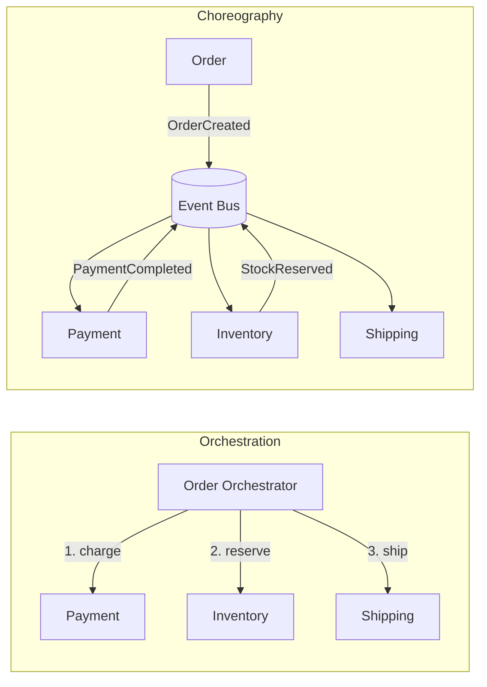
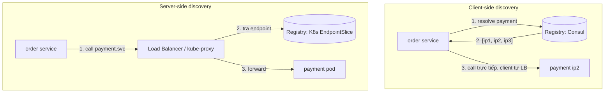
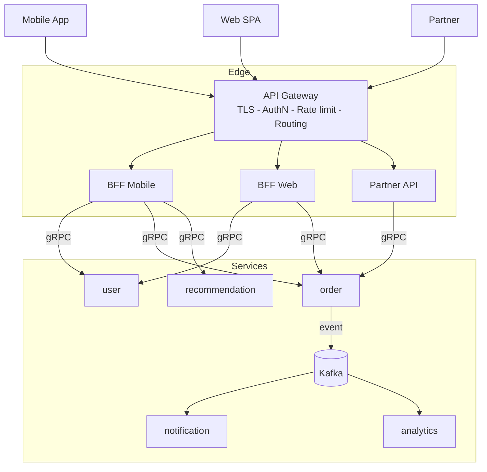
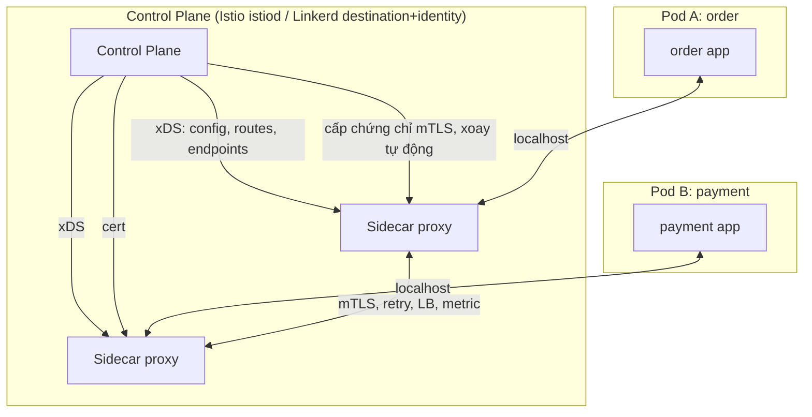
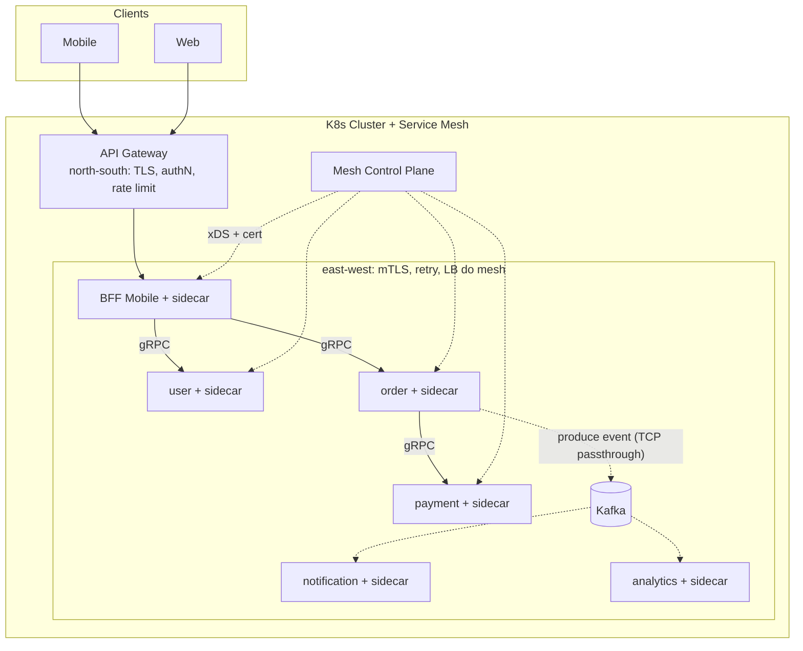
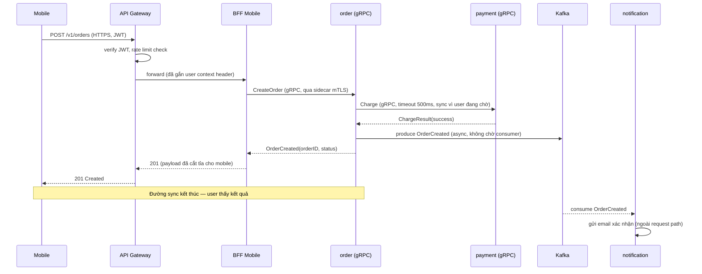
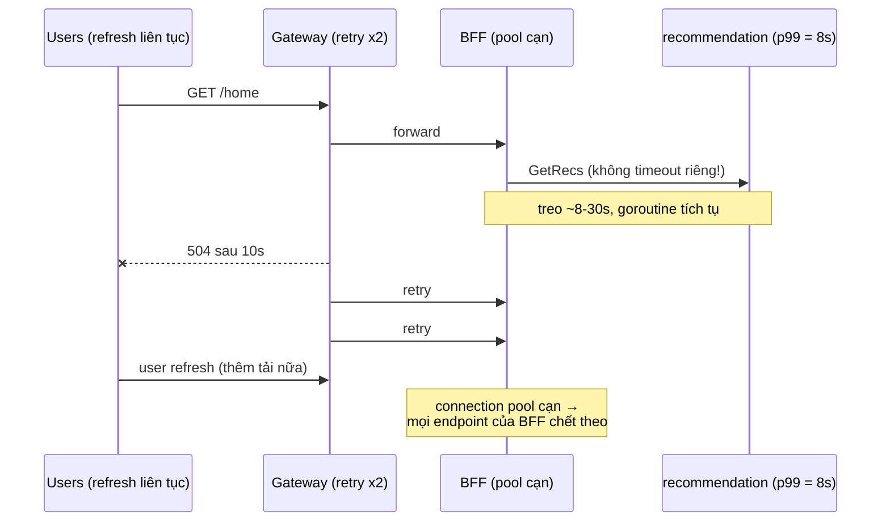

+++
title = "Chương 14 — Microservices Communication: API Gateway và Service Mesh"
date = "2026-02-22T19:00:00+07:00"
draft = false
tags = ["backend", "communication", "api", "architecture"]
series = ["Backend Communication Architecture"]
+++

← Chương trước | Mục lục | [Chương sau →](/series/backend-communication-architect/15-principal-architecture/)

---

## Mở đầu: Bài toán kinh doanh

Hãy bắt đầu từ một câu chuyện quen thuộc. Công ty của bạn có một monolith, 50 developer, deploy 1 lần/tuần. Mỗi lần deploy là một "sự kiện": freeze code từ thứ Tư, QA regression 2 ngày, deploy đêm thứ Sáu, và cả team on-call cuối tuần. Feature nhỏ nhất cũng mất 2 tuần để ra production vì phải xếp hàng chung chuyến tàu release. Ban lãnh đạo hỏi: "Đối thủ ship feature mỗi ngày, tại sao chúng ta mất 2 tuần?"

Câu trả lời kinh điển: tách microservices. Mỗi team sở hữu vài service, deploy độc lập, tự chọn công nghệ. Sau 18 tháng, bạn có 40 service. Tốc độ ship tăng thật. Nhưng một loạt vấn đề mới xuất hiện — và tất cả đều là vấn đề **communication**:

- **Ai gọi ai?** Không ai còn nắm được topology. Một request từ mobile đi qua 7 service, không ai vẽ nổi sơ đồ đầy đủ. Khi service `pricing` chậm, 5 service khác timeout theo và không ai biết tại sao.
- **Bảo mật thế nào?** Trong monolith, mọi "call" là function call trong cùng process — không cần authenticate. Giờ đây 40 service nói chuyện qua network. Ai được gọi ai? Traffic giữa các service có mã hóa không? Một service bị compromise thì attacker đi được bao xa?
- **Client mobile gọi 15 endpoint?** Màn hình home của app cần data từ `user`, `order`, `recommendation`, `promotion`, `inventory`... Mobile trên mạng 4G, mỗi round-trip 100–300ms. 15 sequential call là 2–4 giây chỉ để render một màn hình. Chưa kể mỗi service một kiểu auth, một kiểu error format.

Bài toán kỹ thuật rút ra từ bài toán kinh doanh: **khi tách một process thành N process nói chuyện qua network, bạn đã đổi độ phức tạp deploy lấy độ phức tạp communication**. Chương này giải quyết độ phức tạp đó theo từng lớp: chọn sync/async, service discovery, API Gateway (kèm BFF), và service mesh — cùng ranh giới east-west/north-south để biết công cụ nào giải bài toán nào.

Nguyên tắc first principles xuyên suốt chương: **network call khác function call ở ba điểm không thể xóa bỏ — latency, failure độc lập, và ranh giới trust**. Mọi pattern trong chương này (gateway, mesh, discovery, async) đều là cách quản lý ba điểm đó, không phải xóa bỏ chúng.

---

## 14.1. Sync vs Async giữa các service

### 14.1.1. Problem Statement

Service `order` cần `payment` xử lý thanh toán, `inventory` giữ hàng, `notification` gửi email. Bạn gọi thẳng (sync RPC) hay bắn event (async messaging)? Quyết định này lặp lại hàng trăm lần trong một hệ thống 40 service, và tổng của các quyết định đó quyết định hệ thống của bạn resilient hay fragile.

### 14.1.2. Tại sao vấn đề này tồn tại

**Business problem:** Nghiệp vụ vốn có hai loại quan hệ. "Tôi cần kết quả ngay để trả lời user" (kiểm tra tồn kho trước khi cho đặt hàng) và "việc này phải xảy ra, nhưng không cần ngay" (gửi email xác nhận). Ép cả hai vào một mô hình communication là nguồn gốc của phần lớn incident.

**Technical problem:** Sync call tạo **temporal coupling** — hai service phải cùng sống, cùng khỏe tại cùng thời điểm. Async tạo **eventual consistency** — trạng thái hệ thống có khoảng thời gian không nhất quán. Không có lựa chọn nào miễn phí.

**Scale problem:** Ở 5 service, chuỗi sync call vẫn chạy tốt. Ở 40 service, chuỗi call sâu 6–7 tầng khiến cả latency lẫn failure probability **nhân lũy thừa** — xem phân tích dưới đây.

### 14.1.3. Phân tích cốt lõi: chuỗi sync call và toán học của sự mong manh

Đây là công thức quan trọng nhất chương. Nếu request phải đi qua n service **nối tiếp**, mỗi service có availability aᵢ, thì availability của cả chuỗi là:

```
A_chain = a1 × a2 × ... × an
```

Availability chỉ nhân vào, không bao giờ cộng thêm. Bảng minh họa (số liệu minh họa, phụ thuộc môi trường):

| Số service trong chuỗi | Availability mỗi service | Availability chuỗi | Downtime/tháng (xấp xỉ) |
|---|---|---|---|
| 1 | 99.9% | 99.9% | ~43 phút |
| 3 | 99.9% | 99.7% | ~2.2 giờ |
| 5 | 99.9% | 99.5% | ~3.6 giờ |
| 7 | 99.9% | 99.3% | ~5 giờ |
| 10 | 99.9% | 99.0% | ~7.2 giờ |
| 10 | 99.99% | 99.9% | ~43 phút |

Hai hệ quả trực tiếp:

1. **Muốn chuỗi đạt 99.9%, mỗi mắt xích phải tốt hơn 99.9% đáng kể** — hoặc chuỗi phải ngắn lại. Rút ngắn chuỗi (bằng async, caching, hoặc data duplication) thường rẻ hơn nâng từng service lên 99.99%.
2. **Latency cũng tích lũy tương tự nhưng tệ hơn ở tail.** p50 cộng dồn tuyến tính, nhưng p99 của chuỗi bị chi phối bởi xác suất "ít nhất một hop chậm". Nếu mỗi hop có 1% khả năng chậm, chuỗi 7 hop có ~6.8% khả năng dính ít nhất một hop chậm — p99 của bạn giờ là chuyện xảy ra với gần 7% request.

Bảng tích lũy latency (số liệu minh họa, phụ thuộc môi trường):

| Chuỗi | p50 mỗi hop | p99 mỗi hop | p50 chuỗi | p99 chuỗi (thực đo thường gặp) |
|---|---|---|---|---|
| 2 hop | 10ms | 80ms | ~20ms | ~110ms |
| 4 hop | 10ms | 80ms | ~40ms | ~190ms |
| 7 hop | 10ms | 80ms | ~70ms | ~320ms |

### 14.1.4. Orchestration vs Choreography

Khi một nghiệp vụ chạm nhiều service (đặt hàng: payment + inventory + shipping), có hai cách phối hợp:

**Orchestration:** một service (hoặc workflow engine) làm "nhạc trưởng", gọi tuần tự/song song các service khác và giữ state của flow.

**Choreography:** không có nhạc trưởng. Mỗi service phản ứng với event của service khác: `order` phát `OrderCreated`, `payment` nghe và phát `PaymentCompleted`, `inventory` nghe và phát `StockReserved`...



So sánh không thiên vị:

| Tiêu chí | Orchestration | Choreography |
|---|---|---|
| Nhìn thấy flow | Tập trung một chỗ, dễ đọc | Phân tán, phải ghép từ nhiều service |
| Coupling | Orchestrator biết mọi service (coupling hướng tâm) | Service chỉ biết event (coupling qua schema event) |
| Thêm bước mới | Sửa orchestrator | Thêm consumer mới, không sửa ai |
| Xử lý lỗi/compensation | Rõ ràng: orchestrator điều khiển saga | Khó: compensation phân tán, dễ sót |
| Debug production | Dễ hơn (state tập trung) | Cần distributed tracing tốt, nếu không là "event soup" |
| Single point of failure | Orchestrator (phải HA) | Event bus (phải HA) |

Kinh nghiệm thực chiến: **flow có tính giao dịch, cần compensation rõ ràng (thanh toán, booking) → orchestration. Flow dạng "fan-out phản ứng" (sau khi đặt hàng: gửi email, cập nhật analytics, tính điểm loyalty) → choreography.** Hệ thống lớn dùng cả hai, ở đúng chỗ.

### 14.1.5. Coupling analysis — khung ra quyết định

Trước mỗi lời gọi giữa hai service, hỏi bốn câu:

1. **User có đang chờ kết quả này không?** Có → sync là ứng viên. Không → mặc định async.
2. **Nếu callee chết 10 phút, caller có được phép tiếp tục không?** Được → async hoặc sync + fallback. Không được → hai service này coupling chặt; cân nhắc liệu chúng có nên là một service.
3. **Dữ liệu cần read-after-write ngay không?** Có → sync hoặc read-your-writes có chủ đích. Không → async thoải mái.
4. **Chuỗi hiện tại sâu bao nhiêu?** Nếu thêm hop này khiến chuỗi sync sâu quá 3–4 tầng, dừng lại và thiết kế lại (duplication data, materialized view, hoặc async).

Ví dụ Golang — sync call có timeout, circuit breaker và fallback (những thứ bắt buộc khi đã chọn sync):

```go
// Client gọi pricing service: sync nhưng có ngân sách thời gian và fallback.
func (s *OrderService) GetPrice(ctx context.Context, sku string) (Price, error) {
    // Ngân sách latency: hop này chỉ được tiêu 150ms trong tổng budget của request.
    ctx, cancel := context.WithTimeout(ctx, 150*time.Millisecond)
    defer cancel()

    price, err := s.breaker.Execute(func() (Price, error) {
        return s.pricingClient.GetPrice(ctx, sku)
    })
    if err != nil {
        // Fallback: giá cache (có thể cũ vài phút) tốt hơn lỗi 500.
        if cached, ok := s.priceCache.Get(sku); ok {
            s.metrics.Inc("pricing_fallback_cache_hit")
            return cached, nil
        }
        return Price{}, fmt.Errorf("pricing unavailable, no fallback: %w", err)
    }
    s.priceCache.Set(sku, price, 5*time.Minute)
    return price, nil
}
```

### 14.1.6. Trade-off tổng hợp sync vs async

| Chiều | Sync (gRPC/REST) | Async (Kafka/NATS/RabbitMQ) |
|---|---|---|
| Latency (user-facing) | Thấp cho 1 hop; tích lũy theo chuỗi | Ẩn khỏi request path; end-to-end lag khó đoán |
| Bandwidth | Request/response gọn | Event thường to hơn (mang state), có overhead broker |
| Complexity | Thấp lúc đầu; cao khi phải thêm retry/breaker/timeout khắp nơi | Cao lúc đầu (broker, schema, idempotency); ổn định về sau |
| Scalability | Bị giới hạn bởi mắt xích yếu nhất | Buffer hấp thụ burst; consumer scale độc lập |
| Developer Experience | Quen thuộc, dễ debug local | Cần tư duy event, test khó hơn |
| Operational Cost | Không thêm hạ tầng | Vận hành broker (không rẻ, không dễ) |
| Compatibility | Breaking change API thấy ngay | Schema evolution cần kỷ luật (schema registry) |
| Observability | Tracing tự nhiên theo request | Cần propagate trace context qua message header |
| Security | AuthN/Z per-call rõ ràng | Quyền produce/consume theo topic, dễ bị buông lỏng |

### 14.1.7. Anti-pattern

- **Distributed monolith:** tách service nhưng mọi thứ gọi sync lẫn nhau, chuỗi sâu 8 tầng, deploy vẫn phải phối hợp. Bạn nhận toàn bộ chi phí của microservices mà không nhận lợi ích nào.
- **Async giả:** bắn event rồi... đứng chờ event trả lời với timeout (request-reply qua Kafka cho flow user-facing). Bạn có latency của async và coupling của sync.
- **Event carried quá ít state:** event chỉ chứa `orderID`, mọi consumer phải gọi ngược lại `order` service để lấy chi tiết → biến choreography thành N+1 sync call trá hình.

### 14.1.8. Khi nào KHÔNG dùng async

- Flow user đang chờ và cần kết quả xác định (kiểm tra fraud trước khi hiện nút "Thanh toán thành công").
- Team chưa có nền tảng vận hành broker, chưa có schema registry, chưa có dead-letter queue process — async khi đó là nguồn incident mới, không phải giải pháp.
- Hệ thống nhỏ (< 5–7 service): chuỗi sync ngắn, chưa chạm ngưỡng toán học ở 14.1.3.

---

## 14.2. Service Discovery

### 14.2.1. Problem Statement

Service `order` cần gọi `payment`. Nhưng `payment` có 12 instance, IP thay đổi mỗi lần deploy, instance chết và sinh ra liên tục khi autoscale. Hardcode IP là tự sát. Ai giữ danh sách "payment hiện đang sống ở đâu", và ai quyết định request đi đến instance nào?

### 14.2.2. Tại sao tồn tại

**Business problem:** autoscaling và deploy liên tục là lý do bạn tách microservices; cả hai đều khiến địa chỉ instance trở nên phù du (ephemeral). **Technical problem:** cần một nguồn sự thật (source of truth) về membership — instance nào đang sống, đang healthy — và cơ chế đẩy thông tin đó đến caller đủ nhanh. **Scale problem:** 40 service × ~10 instance × deploy chục lần/ngày = hàng nghìn thay đổi membership mỗi ngày. Con người không quản lý nổi; hệ thống phải tự quản.

### 14.2.3. Internal Architecture: hai mô hình

**Client-side discovery:** client hỏi registry (Consul, etcd, Eureka) lấy danh sách instance, tự chọn (load balancing tại client), gọi thẳng.

**Server-side discovery:** client gọi một địa chỉ ổn định (VIP, DNS name, load balancer); LB tra registry và forward.



**DNS vs Registry chuyên dụng:**

| Tiêu chí | DNS thuần | Registry (Consul/etcd) | K8s Service + EndpointSlice |
|---|---|---|---|
| Tốc độ lan truyền thay đổi | Chậm (TTL cache, resolver cache nhiều tầng) | Nhanh (watch/long-poll, thường < 1s) | Nhanh (watch API; kube-proxy/CNI cập nhật) |
| Health check | Không có sẵn | Tích hợp (Consul health check) | Tích hợp (readiness probe) |
| Metadata (version, zone, weight) | Rất hạn chế (SRV ít được dùng đúng) | Phong phú (tags, KV) | Labels, topology hints |
| Hạ tầng thêm | Không | Cluster registry riêng (phải HA — chính nó cần quorum) | Có sẵn trong K8s |
| Client cần lib? | Không | Có (hoặc sidecar/agent) | Không (trong cluster) |

Ghi chú thực chiến về **K8s**: `Service` cho bạn một virtual IP ổn định; `EndpointSlice` là danh sách endpoint thật, cập nhật theo readiness probe. Với **gRPC**, chú ý cái bẫy kinh điển: gRPC dùng HTTP/2 connection dài hạn, nên nếu trỏ vào ClusterIP, toàn bộ request dồn vào đúng một pod sau connection đầu tiên. Giải pháp: headless Service + client-side LB (`round_robin` trong gRPC), hoặc đẩy việc LB xuống service mesh (xem 14.4).

```go
// gRPC client-side LB qua headless service trong K8s.
conn, err := grpc.NewClient(
    "dns:///payment-headless.default.svc.cluster.local:50051",
    grpc.WithDefaultServiceConfig(`{"loadBalancingConfig": [{"round_robin":{}}]}`),
    grpc.WithTransportCredentials(creds),
)
```

### 14.2.4. Trade-off

| Chiều | Client-side | Server-side |
|---|---|---|
| Latency | Ít hơn 1 hop (gọi thẳng) | Thêm 1 hop qua LB (~0.1–1ms nội bộ, số liệu minh họa) |
| Complexity | Logic LB/health nằm trong mọi client (đa ngôn ngữ = đau) | Tập trung ở LB; client ngu ngốc, đơn giản |
| Scalability | Không có LB bottleneck | LB phải scale theo tổng traffic |
| Observability | Phân tán theo client | Tập trung tại LB |
| Failure mode | Registry chết → client dùng cache cũ, thường vẫn chạy | LB chết → mọi thứ chết (phải HA) |

### 14.2.5. Production, Anti-pattern, khi nào không cần

**Production:** trong K8s, đừng tự xây — dùng Service/EndpointSlice, chỉ xử lý riêng bài toán gRPC LB. Ngoài K8s (VM, bare metal, multi-runtime), Consul là lựa chọn trưởng thành; nhớ rằng bản thân Consul server cần quorum (3 hoặc 5 node) và mất quorum nghĩa là mất khả năng ghi registry.

**Anti-pattern:** (1) TTL DNS 300s cho service deploy 20 lần/ngày — client giữ IP chết 5 phút; (2) registry không gắn health check — discovery trả về instance "sống" nhưng đang OOM; (3) hai nguồn sự thật (vừa Consul vừa config file) — không ai biết cái nào đúng.

**Khi nào không cần đầu tư riêng:** hệ thống nhỏ chạy hoàn toàn trong một K8s cluster — discovery có sẵn là đủ, đừng dựng thêm Consul chỉ vì "chuẩn bị cho tương lai".

---

## 14.3. API Gateway và BFF

### 14.3.1. Problem Statement

Quay lại bài toán mở đầu: client mobile gọi 15 endpoint để render màn hình home. Mỗi service tự lo auth, rate limit, TLS, CORS, versioning. 40 service × 6 mối lo cross-cutting = 240 chỗ để làm sai. Và khi security team yêu cầu "đổi thuật toán ký JWT trong 2 tuần", bạn phải sửa 40 chỗ.

### 14.3.2. Tại sao API Gateway tồn tại

**Business problem:** trải nghiệm client (đặc biệt mobile) không được phép suy giảm chỉ vì backend tách nhỏ. **Technical problem:** cross-cutting concern (authN/Z, rate limit, TLS termination, logging) lặp lại ở mọi service là vi phạm DRY ở tầng kiến trúc, và mỗi bản sao là một bề mặt lỗi/bề mặt tấn công. **Scale problem:** số client (web, iOS, Android, partner API, internal tool) × số service tạo ra ma trận tích hợp N×M; gateway đưa nó về N+M.

Chức năng cốt lõi và lý do tồn tại của từng chức năng:

| Chức năng | Bài toán nó giải |
|---|---|
| Single entry point | Client chỉ cần biết 1 domain; backend tự do tái cấu trúc phía sau |
| AuthN/Z offload | Xác thực JWT/OAuth một lần tại biên; service phía sau tin header đã verify (kèm mTLS nội bộ) |
| Rate limiting | Bảo vệ backend khỏi abuse và thundering herd, per-client/per-route |
| Routing & versioning | `/v1/orders` → order-service; canary 5% traffic sang version mới |
| Aggregation | Gom nhiều backend call thành 1 response cho client |
| Protocol translation | Client nói HTTP/JSON; nội bộ nói gRPC; gateway dịch |

### 14.3.3. Internal Architecture



Pipeline xử lý một request trong gateway điển hình: `TLS termination → parse → authN (JWT verify) → authZ (route policy) → rate limit check → route match → transform → upstream call (với timeout/retry/circuit breaker) → response transform → log/metric/trace`. Mỗi bước là một filter/plugin — đây chính là kiến trúc filter chain của Envoy, plugin của Kong, middleware của Traefik.

### 14.3.4. BFF — Backend for Frontend

Aggregation đặt ra câu hỏi: aggregate **cho ai**? Màn hình home của mobile cần payload gọn (mạng 4G, pin, parse cost), field đã được cắt tỉa, 1 round-trip. Web dashboard cần data giàu hơn, phân trang khác, và chấp nhận nhiều round-trip hơn vì latency thấp. Partner API cần contract ổn định nhiều năm.

Ép cả ba vào một API "chung chung" tạo ra **lowest common denominator API**: mobile tải thừa 80% payload, web thiếu field phải gọi thêm, partner bị breaking change vì nhu cầu của mobile. BFF giải bằng cách cho **mỗi loại client một backend riêng, do chính team frontend đó sở hữu**:

- BFF Mobile: response nhỏ, aggregate mạnh tay, field đặt tên theo màn hình.
- BFF Web: response giàu, hỗ trợ query linh hoạt hơn (nhiều team chọn GraphQL ở đây).
- BFF thay đổi theo tốc độ của UI; service phía sau thay đổi theo tốc độ của domain. Tách hai tốc độ đó là giá trị chính của BFF.

Ví dụ Golang — BFF aggregate song song với timeout budget và degrade từng phần:

```go
// BFF mobile: gom 3 nguồn cho màn hình home trong 1 response.
// Nguyên tắc: phần nào chậm/lỗi thì degrade phần đó, không fail cả màn hình.
func (b *MobileBFF) HomeScreen(ctx context.Context, userID string) HomeResponse {
    ctx, cancel := context.WithTimeout(ctx, 300*time.Millisecond)
    defer cancel()

    var (
        wg   sync.WaitGroup
        resp HomeResponse
    )
    wg.Add(3)

    go func() { // Bắt buộc: không có user thì không render được gì.
        defer wg.Done()
        u, err := b.userClient.GetProfile(ctx, userID)
        if err != nil {
            resp.Err = err // lỗi phần bắt buộc → fail request
            return
        }
        resp.User = trimForMobile(u)
    }()
    go func() { // Tùy chọn: recommendation lỗi → trả list rỗng.
        defer wg.Done()
        if recs, err := b.recClient.GetRecs(ctx, userID); err == nil {
            resp.Recommendations = recs[:min(len(recs), 10)]
        } else {
            b.metrics.Inc("home_recs_degraded")
        }
    }()
    go func() { // Tùy chọn: order gần nhất lỗi → ẩn section.
        defer wg.Done()
        if o, err := b.orderClient.LatestOrder(ctx, userID); err == nil {
            resp.LatestOrder = &o
        }
    }()

    wg.Wait()
    return resp
}
```

### 14.3.5. Gateway là bottleneck / SPOF — và cách scale

Mọi request đi qua gateway, vậy gateway chết là toàn hệ thống chết, và gateway chậm là mọi thứ chậm. Đây không phải lý do bỏ gateway — mà là lý do thiết kế nó đúng:

1. **Stateless bắt buộc.** Không session in-memory. Rate limit counter đẩy ra Redis/local-with-sync. Khi stateless, scale ngang chỉ là thêm replica sau L4 LB.
2. **Nhiều replica, nhiều AZ**, health check ở LB phía trước, PodDisruptionBudget để deploy không làm giảm capacity đột ngột.
3. **Gateway phải "mỏng".** Logic nghiệp vụ trong gateway là nợ kỹ thuật lãi kép (xem anti-pattern). Gateway càng mỏng càng dễ scale và càng ít lý do để chết.
4. **Bulkhead theo route:** connection pool và worker tách riêng cho từng upstream, để một upstream chậm không ăn hết resource của gateway (xem failure example 14.6).
5. **Kiểm soát blast radius của config:** một dòng config routing sai có thể hạ toàn bộ traffic. Config gateway phải qua review + canary như code.

### 14.3.6. So sánh triết lý: Kong, Envoy Gateway, Traefik, tự viết bằng Go

Không có lựa chọn "tốt nhất", chỉ có lựa chọn khớp với ràng buộc của bạn:

| Tiêu chí | Kong | Envoy Gateway | Traefik | Tự viết (Go) |
|---|---|---|---|---|
| Triết lý | Platform quản lý API: plugin ecosystem, admin API, portal | Data plane chuẩn CNCF, cấu hình qua K8s Gateway API, hiệu năng và khả năng mở rộng của Envoy | Đơn giản, auto-discovery từ label/annotation, "chạy được ngay" | Kiểm soát tuyệt đối, chỉ build đúng thứ cần |
| Mở rộng | Plugin Lua/Go/WASM, ecosystem lớn | Envoy filter, WASM, ext_proc | Middleware có sẵn, plugin hạn chế hơn | Code của bạn, không giới hạn |
| Độ phức tạp vận hành | Trung bình–cao (thêm DB ở chế độ truyền thống, hoặc DB-less) | Trung bình (khái niệm Envoy/xDS cần học) | Thấp | Toàn bộ về tay bạn: HTTP/2 edge case, connection draining, CVE |
| Khớp với ai | Tổ chức cần API management đầy đủ (key, quota, portal cho partner) | Tổ chức đã/sẽ dùng Envoy-based mesh, muốn một data plane thống nhất | Team nhỏ, K8s, cần ingress nhanh gọn | Nhu cầu rất đặc thù (protocol lạ, logic routing độc quyền) và có team platform đủ mạnh |

Lưu ý về **tự viết**: viết reverse proxy Go "chạy demo" mất một buổi chiều (`net/http/httputil.ReverseProxy`). Viết proxy production-grade — connection draining khi deploy, HTTP/2 flow control, retry budget, header smuggling, slowloris — mất nhiều năm-người và bạn tự gánh mọi CVE. Chọn đường này khi lợi thế đặc thù đủ lớn, không phải vì "muốn kiểm soát".

### 14.3.7. Trade-off tổng hợp của API Gateway

| Chiều | Ảnh hưởng | Ghi chú |
|---|---|---|
| Latency | +0.5–5ms mỗi request (số liệu minh họa) | Đổi lại tiết kiệm nhiều round-trip nhờ aggregation |
| Bandwidth | Giảm cho client (payload cắt tỉa) | Tăng nội bộ (gateway fan-out) |
| Complexity | Thêm một hệ thống phải giỏi | Bớt N bản sao cross-cutting logic |
| Scalability | Điểm scale tập trung — dễ scale nếu stateless | Nhưng là điểm nghẽn nếu làm sai |
| Developer Experience | Client teams sướng hơn rõ rệt | Platform team gánh thêm |
| Operational Cost | Node/license/vận hành gateway | Bù lại bằng chi phí bớt ở 40 service |
| Compatibility | Nơi lý tưởng làm versioning/translation | Config drift là rủi ro |
| Observability | Điểm vàng: mọi north-south traffic đi qua đây | Log/metric tại gateway là baseline SLO |
| Security | Thu hẹp bề mặt tấn công về một biên được canh kỹ | Nhưng biên đó bị thủng là thủng lớn — defense in depth vẫn bắt buộc |

### 14.3.8. Anti-pattern

- **Gateway thành "monolith mới":** nhét business logic (tính giá, validate nghiệp vụ) vào plugin gateway. Sau 2 năm, không ai dám deploy gateway vì nó chứa logic của 15 team. Gateway chỉ được chứa cross-cutting concern.
- **BFF dùng chung:** hai team frontend chia sẻ một BFF → BFF trở lại thành lowest common denominator, mất lý do tồn tại.
- **Gọi gateway từ nội bộ:** service A gọi service B vòng qua public gateway — thêm latency, thêm tải cho biên, sai ranh giới trust. East-west đi đường east-west (xem 14.5).
- **Retry tại mọi tầng:** client retry 3, gateway retry 3, service retry 3 → 27 request thật cho 1 request logic khi backend hắt hơi. Chọn một tầng làm chủ retry (thường là gateway hoặc mesh) với retry budget.

### 14.3.9. Khi nào KHÔNG nên dùng

- Hệ thống 3–5 service, một loại client: một reverse proxy/ingress đơn giản là đủ; full-blown gateway platform là over-engineering.
- Internal tool ít traffic, không có yêu cầu partner/quota: chi phí vận hành gateway vượt lợi ích.
- BFF: đừng tạo BFF khi chỉ có một loại client, hoặc khi các client có nhu cầu gần như trùng nhau — mỗi BFF là một service phải nuôi.

---

## 14.4. Service Mesh

### 14.4.1. Problem Statement

Security team yêu cầu: mọi traffic giữa service phải mTLS. Platform team yêu cầu: mọi call phải có retry với backoff, timeout chuẩn, circuit breaker, và metric latency đồng nhất để dựng SLO. Bạn có 40 service viết bằng Go, Java, Python, Node. Ai implement những thứ đó, bao nhiêu lần, và làm sao đảm bảo 40 bản implement giống hệt nhau?

### 14.4.2. Tại sao tồn tại — cái chết của library approach

Cách tiếp cận đầu tiên trong lịch sử là **library**: Netflix OSS (Hystrix, Ribbon, Eureka client) nhúng resilience vào từng service. Nó chết vì ba lý do:

1. **Đa ngôn ngữ:** mỗi ngôn ngữ cần một bản port. Bản Go và bản Java lệch behavior; bản Python không ai maintain. Chi phí = số ngôn ngữ × số feature.
2. **Upgrade là chiến dịch:** vá một CVE trong library đồng nghĩa 40 team phải bump dependency và redeploy. Trong thực tế, 6 tháng sau vẫn còn service chạy bản cũ.
3. **Coupling vòng đời:** logic hạ tầng (retry, mTLS) bị ghim vào vòng đời deploy của ứng dụng.

Lời giải: kéo toàn bộ logic đó **ra khỏi process** vào một **sidecar proxy** đứng cạnh mỗi instance, chặn mọi traffic vào/ra. Ứng dụng nói plaintext với localhost; sidecar lo mTLS, retry, LB, telemetry. Ngôn ngữ nào cũng hưởng chung một implementation, upgrade mesh không cần redeploy app.

### 14.4.3. Internal Architecture: data plane vs control plane



- **Data plane:** các proxy (Envoy trong Istio; linkerd2-proxy viết bằng Rust trong Linkerd) nằm trên đường đi của mọi packet. Chúng thực thi: mTLS (SPIFFE identity, xoay cert tự động), load balancing (EWMA/least-request thay vì round-robin ngây thơ), retry/timeout/circuit breaking, traffic splitting (canary 5%), và phát telemetry đồng nhất (golden metrics cho mọi service mà không sửa một dòng code app).
- **Control plane:** không nằm trên đường đi của request. Nó phân phối config và certificate xuống data plane qua API (xDS với Envoy). Hệ quả quan trọng cho vận hành: **control plane chết, traffic vẫn chạy** với config cuối cùng — nhưng không đổi được route, không cấp cert mới (và cert hết hạn là bom hẹn giờ).

**Istio vs Linkerd — khác biệt triết lý, không thiên vị:** Istio chọn Envoy và tối đa tính năng/khả năng cấu hình (VirtualService, EnvoyFilter, WASM) — mạnh mẽ, đổi lại bề mặt phức tạp lớn. Linkerd chọn micro-proxy chuyên dụng và tối giản — "ít tính năng hơn, ít thứ hỏng hơn", đổi lại khi cần tính năng ngoài phạm vi thì không có chỗ mở rộng tương đương. Chọn theo khẩu vị vận hành của team, không theo hype.

### 14.4.4. Chi phí thật của mesh

Đây là phần nhiều bài giới thiệu bỏ qua. Số liệu minh họa, phụ thuộc môi trường:

| Khoản chi | Mức điển hình | Ghi chú |
|---|---|---|
| Latency thêm mỗi hop | +0.3–3ms (2 proxy: egress caller + ingress callee) | Chuỗi 5 hop = 10 lần qua proxy; p99 chịu ảnh hưởng rõ hơn p50 |
| Memory mỗi sidecar | 40–200MB | × số pod. 500 pod ≈ 20–100GB RAM chỉ cho proxy |
| CPU mỗi sidecar | 0.05–0.5 core dưới tải | mTLS handshake + parse HTTP/2 không miễn phí |
| Control plane | Vài pod, không đáng kể về tài nguyên | Nhưng đáng kể về kiến thức vận hành |
| Chi phí con người | 1–2 kỹ sư platform hiểu sâu mesh | Khoản đắt nhất và hay bị quên nhất |

**Khi nào mesh là overkill:** dưới ~10–15 service; một ngôn ngữ duy nhất (một library nội bộ tốt có thể đủ); không có yêu cầu mTLS/zero-trust từ compliance; team chưa vững K8s (mesh chồng phức tạp lên nền chưa vững là công thức thảm họa). Câu hỏi kiểm tra: "nếu không có mesh, chúng ta phải tự viết những gì, tốn bao nhiêu?" — nếu câu trả lời là "chỉ cần mTLS", có thể chỉ cần cert-manager + TLS trong app, chưa cần cả một mesh.

**Sidecar-less / ambient mesh (xu hướng):** chi phí per-pod của sidecar dẫn đến kiến trúc ambient của Istio — tách hai tầng: **ztunnel** (proxy L4 per-node, lo mTLS/identity cho mọi pod trên node) và **waypoint proxy** (L7, chỉ deploy cho namespace/service thật sự cần policy L7). eBPF cũng được dùng (Cilium) để kéo一 phần việc xuống kernel. Ý tưởng chung: trả chi phí L7 chỉ ở nơi cần L7, thay vì mọi pod. Đây là hướng đi đúng về mặt kinh tế, nhưng độ chín vận hành cần được đánh giá tại thời điểm bạn triển khai — đừng chọn chỉ vì mới.

### 14.4.5. Trade-off tổng hợp của service mesh

| Chiều | Được | Mất |
|---|---|---|
| Latency | LB thông minh giảm tail latency | +2 proxy hop mỗi call |
| Complexity | App code sạch, không còn resilience boilerplate | Cả một hệ phân tán mới phải vận hành |
| Scalability | Policy/telemetry scale theo platform, không theo số team | Sidecar resource scale theo số pod |
| Developer Experience | Dev không phải nghĩ về mTLS/retry | Debug thêm một lớp: "lỗi ở app hay ở proxy?" |
| Operational Cost | Chuẩn hóa một chỗ | RAM/CPU sidecar + kỹ sư platform |
| Compatibility | Đa ngôn ngữ hưởng chung | Protocol lạ (non-HTTP/gRPC) hỗ trợ kém hơn |
| Observability | Golden metrics đồng nhất mọi service, miễn phí với app | Trace vẫn cần app propagate context — mesh không thay được việc này |
| Security | mTLS + identity + policy mọi nơi, xoay cert tự động | Control plane trở thành mục tiêu giá trị cao |

### 14.4.6. Anti-pattern

- **Cài mesh để lấy 1 tính năng:** deploy Istio chỉ để canary routing trong khi ingress controller đã làm được — trả toàn bộ chi phí mesh cho một tính năng lẻ.
- **Retry storm hai tầng:** app tự retry (library cũ còn sót) + mesh retry → khuếch đại tải như anti-pattern 14.3.8. Khi có mesh, tắt retry trong app, dùng retry budget của mesh.
- **EnvoyFilter rải rác:** vá behavior bằng EnvoyFilter tùy tiện ở 20 namespace — sau này không ai upgrade nổi Istio vì không biết filter nào sẽ vỡ.
- **Mesh mù protocol:** ép traffic Kafka/database qua sidecar L7 parsing kỳ vọng HTTP — chỉ nhận overhead mà không nhận giá trị; đánh dấu các port đó là TCP passthrough.

### 14.4.7. Khi nào KHÔNG nên dùng

Đã nêu ở 14.4.4 — tóm tắt quy tắc: **mesh trả lời bài toán "chuẩn hóa communication concern trên nhiều service, nhiều ngôn ngữ, nhiều team". Nếu bạn không có đủ ba chữ "nhiều" đó, gần như chắc chắn chưa cần mesh.**

---

## 14.5. East-west vs North-south traffic

Hai khái niệm định hình việc chọn công cụ:

- **North-south:** traffic vào/ra hệ thống (client ↔ backend). Đặc trưng: untrusted, đa dạng client, cần authN mạnh, rate limit, WAF. **Công cụ: API Gateway / BFF.**
- **East-west:** traffic giữa các service nội bộ. Đặc trưng: volume lớn hơn nhiều lần (một request north-south sinh 5–20 call east-west), latency-sensitive, cần mTLS + authZ service-to-service + LB + resilience. **Công cụ: service mesh (hoặc library/K8s primitives khi chưa tới ngưỡng mesh).**

| Tiêu chí | North-south | East-west |
|---|---|---|
| Trust | Zero — client là untrusted | Semi-trusted, nhưng zero-trust nội bộ là chuẩn hiện đại |
| Volume | 1x | 5–20x (số liệu minh họa) |
| AuthN | User identity (JWT/OAuth) | Service identity (mTLS/SPIFFE) |
| Ưu tiên | Bảo vệ biên, trải nghiệm client | Latency, resilience, observability |

Sai lầm phổ biến là dùng một công cụ cho cả hai: bắt east-west vòng qua gateway (thêm hop, sai trust model), hoặc lôi mesh ra biên xử lý public client mà thiếu WAF/bot protection. Gateway và mesh **bổ sung nhau, không thay thế nhau** — sơ đồ ở 14.3.3 và 14.6 thể hiện cách chúng ghép.

---

## 14.6. Bức tranh đầy đủ và sequence diagram

Kiến trúc tổng hợp gateway + mesh:



Sequence diagram một request đặt hàng từ mobile — mix sync gRPC và async Kafka:



Điểm mấu chốt của thiết kế: **đường sync chỉ chứa những gì user bắt buộc phải chờ** (tạo order + charge). Email, analytics, loyalty đi async. Nếu notification chết 1 giờ, không một order nào thất bại — event nằm chờ trong Kafka.

---

## 14.7. Production example: nền tảng e-commerce 40 service

Bối cảnh giả định nhưng điển hình: e-commerce, 40 service, 4 ngôn ngữ (Go chiếm đa số, Java cho pricing legacy, Python cho ML, Node cho vài BFF cũ), ~2,000 RPS north-south giờ cao điểm, K8s 3 AZ.

Các quyết định và lý do:

1. **Edge:** một API Gateway (đội này chọn managed gateway của cloud + một lớp Envoy Gateway tự vận hành cho routing phức tạp) — TLS, JWT verify, rate limit 100 req/phút/user cho endpoint đặt hàng.
2. **BFF:** hai BFF (mobile, web) do chính hai team frontend sở hữu. BFF mobile giảm số round-trip màn hình home từ 15 xuống 1; payload từ ~180KB xuống ~28KB (số liệu minh họa, phụ thuộc môi trường).
3. **East-west:** service mesh cho toàn bộ traffic gRPC/HTTP nội bộ — lý do quyết định là yêu cầu mTLS từ audit PCI-DSS và bài toán 4 ngôn ngữ. Kafka traffic đánh dấu TCP passthrough.
4. **Sync/async:** quy ước kiến trúc thành văn: *chuỗi sync tối đa 3 hop tính từ BFF; mọi side effect ngoài đường chờ của user bắt buộc đi Kafka; mọi consumer bắt buộc idempotent.*
5. **Kết quả sau 2 quý (số liệu minh họa):** p99 màn hình home 2.8s → 620ms; incident do "một service kéo sập nhiều service" giảm từ ~2/tháng xuống ~1/quý; chi phí thêm: ~8% RAM cluster cho sidecar + 1.5 kỹ sư platform.

Bài học đắt nhất của họ không nằm ở công nghệ mà ở quy ước: trước khi có quy tắc "sync tối đa 3 hop", mỗi team tự quyết và hệ thống trôi dần về distributed monolith.

## 14.8. Failure example: gateway timeout cascade

Sự cố kinh điển, tái hiện từ nhiều post-mortem thực tế:

**Diễn biến.** 09:00, service `recommendation` deploy bản mới có bug: p99 từ 40ms lên 8s (lock contention). BFF mobile gọi `recommendation` **không đặt timeout riêng** — dùng mặc định 30s của HTTP client. Request home screen treo chờ recommendation. Goroutine và connection trong BFF tích tụ. 09:04, BFF cạn connection pool — **mọi endpoint của BFF chậm theo, kể cả những endpoint không liên quan đến recommendation**. Gateway timeout 10s với BFF, bắt đầu trả 504 và **retry 2 lần** → tải vào BFF gấp 3. 09:07, client mobile thấy lỗi, user kéo refresh liên tục → thêm một tầng retry của con người. Toàn bộ app "sập" trong mắt user, dù 38/40 service hoàn toàn khỏe mạnh.



**Chuỗi sai lầm (không phải một lỗi đơn lẻ — cascade luôn cần nhiều lỗi xếp hàng):**
1. Không có per-dependency timeout ở BFF (lỗi gốc).
2. Không có bulkhead: recommendation dùng chung pool với mọi dependency khác.
3. Recommendation là dữ liệu *tùy chọn* nhưng được đối xử như *bắt buộc* — không có degrade path.
4. Retry của gateway không có budget, khuếch đại tải đúng lúc hệ thống yếu nhất.
5. Circuit breaker không tồn tại ở bất kỳ tầng nào.

**Khắc phục:** timeout 150ms + circuit breaker cho recommendation tại BFF; degrade trả list rỗng (chính là code mẫu ở 14.3.4); retry budget 20% tại gateway; load-shedding tại BFF khi pool đạt 80%. Sau khi sửa, cùng một bug ở recommendation chỉ tạo ra một metric `home_recs_degraded` tăng vọt và một alert — user không nhận thấy gì.

## 14.9. Refactoring example: chuỗi sync call → event-driven

**Trước:** flow đặt hàng của một hệ thống có chuỗi sync 6 hop:

```
Mobile → Gateway → order → payment → inventory → loyalty → notification → analytics
                        (tất cả sync, nối tiếp)
```

Availability chuỗi (mỗi service 99.9%): 0.999⁶ ≈ **99.4%** — vi phạm SLO 99.9% ngay trên giấy. p99 ~1.9s. `loyalty` chết là **không ai đặt được hàng**, dù điểm thưởng chẳng liên quan việc đặt hàng thành công.

**Bước 1 — phân loại:** hỏi từng hop câu hỏi ở 14.1.5: "user có đang chờ kết quả này không?" Kết quả: `payment` và `inventory` — có (không charge được/hết hàng thì phải báo ngay). `loyalty`, `notification`, `analytics` — không.

**Bước 2 — cắt phần async ra:** `order` sau khi charge + reserve thành công thì ghi DB và produce `OrderCreated` lên Kafka trong **cùng một đơn vị nhất quán** — dùng transactional outbox để tránh mất event khi crash giữa chừng:

```go
// Transactional outbox: ghi order và event trong CÙNG transaction DB.
// Relay process (hoặc CDC như Debezium) sẽ đọc bảng outbox và produce lên Kafka.
func (r *OrderRepo) CreateWithEvent(ctx context.Context, o Order) error {
    tx, err := r.db.BeginTx(ctx, nil)
    if err != nil {
        return err
    }
    defer tx.Rollback()

    if _, err := tx.ExecContext(ctx,
        `INSERT INTO orders (id, user_id, total, status) VALUES ($1,$2,$3,'confirmed')`,
        o.ID, o.UserID, o.Total); err != nil {
        return err
    }
    payload, _ := json.Marshal(OrderCreatedEvent{
        OrderID: o.ID, UserID: o.UserID, Total: o.Total,
        Items: o.Items, // event mang đủ state để consumer không phải gọi ngược
        OccurredAt: time.Now().UTC(),
    })
    if _, err := tx.ExecContext(ctx,
        `INSERT INTO outbox (aggregate_id, topic, payload) VALUES ($1,'order.created',$2)`,
        o.ID, payload); err != nil {
        return err
    }
    return tx.Commit() // hoặc cả hai cùng ghi, hoặc không gì cả
}
```

Consumer phía loyalty — idempotent bắt buộc vì Kafka giao at-least-once:

```go
func (l *LoyaltyConsumer) Handle(ctx context.Context, ev OrderCreatedEvent) error {
    // Idempotency: đã xử lý orderID này thì bỏ qua (event có thể được giao lại).
    inserted, err := l.store.TryMarkProcessed(ctx, "loyalty", ev.OrderID)
    if err != nil {
        return err // retry sau
    }
    if !inserted {
        return nil // duplicate delivery — bỏ qua an toàn
    }
    return l.store.AddPoints(ctx, ev.UserID, pointsFor(ev.Total))
}
```

**Bước 3 — song song hóa phần sync còn lại:** `payment` và `inventory` độc lập nhau → gọi song song từ `order` (errgroup), lấy max latency thay vì sum.

**Sau:**

```
Mobile → Gateway → order → [payment ∥ inventory] → trả kết quả
                    └→ outbox → Kafka → loyalty, notification, analytics
```

| Chỉ số (số liệu minh họa, phụ thuộc môi trường) | Trước | Sau |
|---|---|---|
| Availability lý thuyết của đường đặt hàng | 99.4% (6 mắt xích) | 99.7% (3 mắt xích) |
| p99 đường sync | ~1.9s | ~650ms |
| Loyalty chết 1 giờ | Không ai đặt được hàng | Không ảnh hưởng; event chờ trong Kafka |
| Chi phí mới | — | Vận hành Kafka + outbox relay + kỷ luật idempotency |

Dòng cuối của bảng là điểm trung thực cần nhấn mạnh: refactoring này **không miễn phí**. Bạn đổi fragility lấy độ phức tạp vận hành có kiểm soát. Ở quy mô đủ lớn, đó là món hời; ở 5 service, có thể không.

---

## 14.10. Tổng kết nguyên tắc chương

1. Network call ≠ function call: latency, failure độc lập, ranh giới trust — mọi pattern trong chương chỉ là cách quản lý ba điều này.
2. Availability của chuỗi sync là **tích** các availability: a₁×a₂×...×aₙ. Rút ngắn chuỗi thắng gần như mọi tối ưu khác.
3. Mặc định async cho mọi thứ user không chờ; sync là lựa chọn có chủ đích kèm timeout + breaker + fallback.
4. Gateway giải north-south (biên, client); mesh giải east-west (nội bộ, đa ngôn ngữ). Bổ sung, không thay thế.
5. BFF thuộc về team frontend; gateway phải mỏng; mesh chỉ đáng khi có đủ "nhiều service, nhiều ngôn ngữ, nhiều team".
6. Mọi lớp trung gian (gateway, sidecar) đều cộng latency và độ phức tạp — chỉ thêm khi bài toán nó giải đắt hơn chi phí nó mang lại.

---

← Chương trước | Mục lục | [Chương sau →](/series/backend-communication-architect/15-principal-architecture/)
