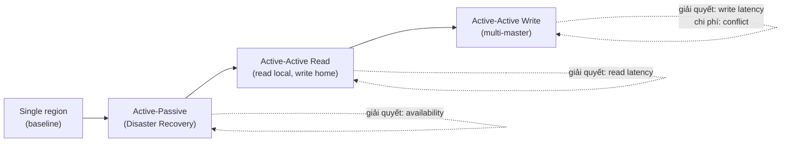
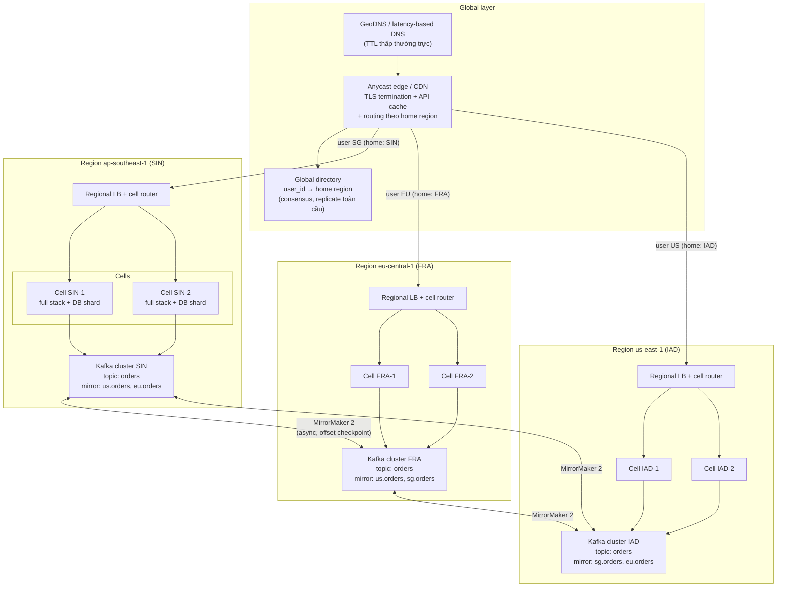
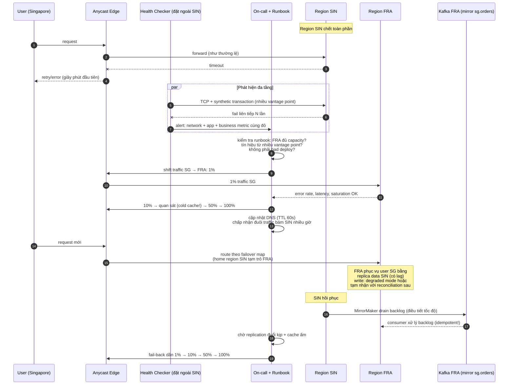

+++
title = "Chương 15. Principal Architecture — Multi-Region, Cross-DC và Large Scale"
date = "2026-02-22T20:00:00+07:00"
draft = false
tags = ["backend", "communication", "api", "architecture"]
series = ["Backend Communication Architecture"]
+++

[← Chương trước](/series/backend-communication-architect/14-microservices-communication/) | Mục lục | [Chương sau →](/series/backend-communication-architect/16-failure-cases/)

---

## 15.1. Business problem: khi công ty vượt qua biên giới một region

Hãy bắt đầu từ một tình huống có thật ở hầu hết các công ty tăng trưởng nhanh.

Công ty của bạn khởi đầu với toàn bộ hệ thống đặt tại một region — giả sử `us-east-1` (Virginia). Ba năm sau, business mở rộng ra ba châu lục: Bắc Mỹ, châu Âu, và Đông Nam Á. Ngay lập tức, ba loại áp lực xuất hiện cùng lúc, và cả ba đều không giải quyết được bằng cách "tối ưu code":

1. **Latency**. User ở Singapore gọi API đặt tại Virginia chịu ~230ms round-trip time (RTT) cho *mỗi* round-trip mạng — trước khi server xử lý bất kỳ logic nào. Một trang cần 4 API call tuần tự đã mất gần 1 giây chỉ để "ánh sáng chạy qua chạy lại Thái Bình Dương". Conversion rate ở thị trường châu Á thấp hơn hẳn, và team product không hiểu tại sao.

2. **Compliance**. Regulator châu Âu yêu cầu personal data của user EU phải lưu trong EU (GDPR + các luật data localization). Regulator Indonesia, Việt Nam, Trung Quốc có yêu cầu tương tự với mức độ khác nhau. "Tất cả data ở Virginia" không còn là lựa chọn hợp pháp.

3. **Availability**. Hợp đồng với khách hàng enterprise cam kết 99.99% uptime. Một region cloud — dù của nhà cung cấp nào — vẫn có thể chết toàn phần (đã xảy ra nhiều lần trong lịch sử mọi cloud lớn). Nếu toàn bộ hệ thống nằm ở một region, SLA của bạn bị chặn trên bởi SLA của region đó. **Một region chết không được phép kéo sập toàn hệ thống.**

Technical problem rút ra: bạn phải phân tán hệ thống ra nhiều region, trong khi vẫn giữ được tính đúng đắn của dữ liệu (consistency), khả năng vận hành (operability), và chi phí trong tầm kiểm soát. Đây là bài toán khó nhất trong communication architecture, vì mọi trade-off ở các chương trước — sync vs async, consistency vs availability, coupling vs autonomy — đều bị **khuếch đại bởi khoảng cách vật lý**.

Chương này đi từ first principles: vật lý của latency → các mức trưởng thành của kiến trúc multi-region → replication cho từng loại hạ tầng → CAP/PACELC ở mức region → data residency → các pattern large scale (cell, failover, load shedding) → và cuối cùng là chi phí, vì multi-region trước hết là một quyết định tài chính.

---

## 15.2. Vật lý của latency: không có tối ưu code nào thắng được tốc độ ánh sáng

### 15.2.1. First principles

Ánh sáng trong chân không đi ~300,000 km/s. Trong cáp quang, do chiết suất của thủy tinh, tốc độ thực tế chỉ còn **~200,000 km/s** (khoảng 2/3 tốc độ trong chân không). Từ đó suy ra giới hạn cứng:

- 1,000 km cáp quang → tối thiểu ~5ms một chiều, ~10ms RTT.
- Singapore ↔ Virginia: khoảng cách đường chim bay ~15,500 km, nhưng cáp quang không đi đường thẳng — nó đi theo tuyến cáp biển, qua các landing station, các điểm trung chuyển. Đường cáp thực tế dài hơn đáng kể, cộng thêm độ trễ của thiết bị mạng (router, amplifier, transit), cho ra RTT thực tế ~220–250ms.

Đây là **giới hạn vật lý**, không phải giới hạn kỹ thuật. Bạn không thể mua CPU nhanh hơn, viết code gọn hơn, hay đổi ngôn ngữ lập trình để giảm con số này. Chỉ có một cách: **giảm khoảng cách** — đưa data và compute đến gần user.

### 15.2.2. Bảng RTT liên lục địa thực tế

| Tuyến | Khoảng cách ước lượng | RTT điển hình | Ghi chú |
|---|---|---|---|
| SIN (Singapore) ↔ IAD (Virginia) | ~15,500 km | 220–250ms | Qua Thái Bình Dương hoặc Ấn Độ Dương + Đại Tây Dương |
| FRA (Frankfurt) ↔ IAD (Virginia) | ~6,500 km | 85–95ms | Cáp xuyên Đại Tây Dương, tuyến "tốt" nhất liên lục địa |
| SYD (Sydney) ↔ IAD (Virginia) | ~15,700 km | 195–230ms | |
| NRT (Tokyo) ↔ IAD (Virginia) | ~10,900 km | 145–170ms | |
| SIN ↔ FRA | ~10,300 km | 145–175ms | |
| SIN ↔ SYD | ~6,300 km | 90–110ms | |
| GRU (São Paulo) ↔ IAD | ~7,600 km | 115–140ms | |
| Trong cùng region, khác AZ | < 100 km | 0.5–2ms | |
| Trong cùng AZ | — | 0.1–0.5ms | |

*(Số liệu minh họa, phụ thuộc môi trường: tuyến cáp, nhà cung cấp, thời điểm đo, backbone riêng của cloud provider có thể tốt hơn Internet công cộng đáng kể.)*

### 15.2.3. Hệ quả kiến trúc

Nhìn vào bảng trên, hãy rút ra ba nguyên tắc mà toàn bộ phần còn lại của chương này xoay quanh:

1. **Mỗi round-trip liên region là một quyết định kiến trúc.** Trong một region, gọi thêm một service tốn 1–2ms — bạn có thể "phóng khoáng". Giữa SIN và IAD, mỗi call tốn 230ms — một chuỗi 3 call tuần tự cross-region là 700ms, tức là *chết* với mọi trải nghiệm interactive. Khi thiết kế flow liên region, bạn phải đếm từng round-trip như đếm tiền.

2. **Chênh lệch giữa intra-region và inter-region là 2–3 bậc độ lớn (0.5ms vs 230ms).** Điều này nghĩa là ranh giới region là ranh giới kiến trúc quan trọng nhất trong hệ thống phân tán của bạn — quan trọng hơn ranh giới service, quan trọng hơn ranh giới database. Mọi pattern trong chương này về bản chất đều là cách *tránh* hoặc *ẩn* độ trễ cross-region khỏi critical path của user.

3. **Không tối ưu code nào thắng được vật lý.** Nếu user Singapore phải chờ dữ liệu từ Virginia, không có gì cứu được trải nghiệm đó ngoài việc đưa dữ liệu (hoặc bản sao của nó) đến Singapore. Toàn bộ multi-region architecture là hệ quả logic của câu này.

Một hệ quả tinh tế hơn: **consensus cross-region kế thừa toàn bộ độ trễ vật lý**. Một thuật toán quorum như Raft cần ít nhất 1 round-trip đến đa số node để commit. Nếu quorum trải trên SIN–FRA–IAD, mỗi write tốn tối thiểu ~85–150ms (RTT đến node gần thứ hai). Chúng ta sẽ quay lại điểm này ở mục 15.5.

### 15.2.4. Latency budget: phép cộng tàn nhẫn của round-trip

RTT 230ms nghe "chỉ là một phần tư giây" — cho đến khi bạn cộng dồn những gì một request thực tế phải trả. Xét user Singapore mở một trang gọi API ở Virginia, **kết nối lạnh** (chưa có connection sẵn):

| Bước | Số RTT | Thời gian (RTT = 230ms) |
|---|---|---|
| DNS resolve (cache miss) | 1 | 230ms |
| TCP handshake | 1 | 230ms |
| TLS 1.3 handshake | 1 | 230ms |
| HTTP request/response đầu tiên | 1 | 230ms |
| **Tổng cho byte đầu tiên** | **4** | **~920ms** |

*(Số liệu minh họa, phụ thuộc môi trường; TLS 1.2 tốn thêm 1 RTT, TLS 1.3 0-RTT resumption và QUIC/HTTP3 giảm được 1–2 RTT cho kết nối lặp lại.)*

Gần một giây trước khi nhận byte dữ liệu đầu tiên — chưa tính server xử lý, chưa tính trang cần nhiều request. Ba hệ quả thiết kế:

1. **Handshake phải xảy ra ở gần user** — đây chính là lý do tồn tại của edge TLS termination (15.4.4): 3 RTT handshake × 10ms (đến edge) thay vì × 230ms (đến origin).
2. **Chuỗi call tuần tự là kẻ thù**: frontend gọi API A, lấy kết quả gọi API B, rồi C — mỗi mắt xích cộng nguyên một RTT liên region. Các kỹ thuật của Chương 14 (BFF/API aggregation, batch endpoint, GraphQL-style single round-trip) từ "tối ưu đẹp" trở thành "bắt buộc sống còn" khi có khoảng cách liên lục địa xen giữa.
3. **Tail latency khuếch đại theo khoảng cách**: RTT liên lục địa không phải hằng số — nó dao động theo congestion, reroute của tuyến cáp, buffer bloat. p50 có thể là 235ms nhưng p99 là 400ms+. Một trang cần 5 request song song sẽ chậm theo request *chậm nhất* — xác suất dính p99 của ít nhất một request tăng theo số request (với 5 request độc lập, ~5% trang dính đuôi p99). Hedged request (gửi bản sao request sau một ngưỡng chờ) và timeout đặt theo p99 *per-route* là công cụ bắt buộc.

Bài tập tư duy tôi yêu cầu mọi team làm trước khi thiết kế flow liên region: vẽ sequence diagram của flow, đếm số mũi tên vượt ranh giới region, nhân với RTT của tuyến. Nếu kết quả vượt latency budget của sản phẩm, thiết kế lại *trước khi viết dòng code nào* — vì không có tối ưu nào sau đó gỡ lại được những mũi tên này.

---

## 15.3. Kiến trúc multi-region theo mức trưởng thành

Đừng nhảy thẳng vào active-active. Multi-region có một **maturity ladder** rõ ràng, và mỗi bậc thang giải quyết một bài toán khác nhau với chi phí khác nhau. Nhảy cóc bậc thang là nguồn gốc của phần lớn thảm họa multi-region tôi từng chứng kiến.

### 15.3.1. Bậc 1 — Active-Passive (Disaster Recovery)

**Mô hình**: một region phục vụ toàn bộ traffic (active), một region dự phòng (passive) nhận replication liên tục nhưng không phục vụ traffic. Khi region active chết, failover sang passive.

Hai chỉ số định nghĩa toàn bộ thiết kế DR:

- **RPO (Recovery Point Objective)**: mất tối đa bao nhiêu dữ liệu? Quyết định bởi replication lag. Async replication với lag 2 giây → RPO ~2 giây dữ liệu có thể mất khi failover.
- **RTO (Recovery Time Objective)**: mất bao lâu để hệ thống hoạt động trở lại? Quyết định bởi mức độ "nóng" của region passive.

| Mức passive | Mô tả | RTO điển hình | Chi phí tương đối |
|---|---|---|---|
| Backup & restore | Chỉ có backup, dựng lại từ đầu | Nhiều giờ → ngày | ~5–10% region active |
| Pilot light | DB replica chạy, app server tắt | 30 phút → vài giờ | ~15–25% |
| Warm standby | Toàn bộ stack chạy ở scale nhỏ | 5–30 phút | ~30–50% |
| Hot standby | Full scale, sẵn sàng nhận 100% traffic | < 5 phút | ~90–100% |

*(Số liệu minh họa, phụ thuộc môi trường.)*

Ba bài học đắt giá của active-passive:

**Thứ nhất — chi phí "region đắp chiếu".** Hot standby nghĩa là bạn trả tiền gần gấp đôi hạ tầng cho một region *không phục vụ ai cả* trong 99.9% thời gian. CFO sẽ hỏi, và câu hỏi đó chính đáng. Đây là lý do nhiều tổ chức tiến lên active-active: nếu đã trả tiền cho region thứ hai, hãy để nó phục vụ traffic thật.

**Thứ hai — DR không được test là DR không tồn tại.** Đây không phải khẩu hiệu. Region passive không nhận traffic thật nên mọi thứ có thể mục ruỗng trong im lặng: config drift (ai đó sửa security group ở active mà quên passive), secret hết hạn, capacity không đủ (passive được provision từ 2 năm trước khi traffic bằng 1/3 hiện tại), dependency ngầm về region active (một service ở passive vẫn gọi Redis ở active mà không ai biết). Tổ chức nghiêm túc chạy **game day** định kỳ: failover thật, với traffic thật, theo lịch — ví dụ mỗi quý. Nếu bạn chưa bao giờ failover thật, RTO của bạn là một con số tưởng tượng.

**Thứ ba — failover là quyết định, không phải phản xạ.** Failover có chi phí (mất RPO giây dữ liệu, rủi ro failover nhầm — xem 15.7.2). Ai có quyền bấm nút? Tiêu chí nào? Runbook phải trả lời trước, không phải lúc 3 giờ sáng.

Checklist tối thiểu cho một game day DR nghiêm túc (mỗi mục fail là một finding phải fix trước game day kế tiếp):

| # | Hạng mục kiểm tra | Câu hỏi cụ thể |
|---|---|---|
| 1 | Config parity | Diff toàn bộ IaC state giữa hai region — có drift không? |
| 2 | Secret & certificate | Secret ở passive còn hạn? Certificate có cover domain failover? |
| 3 | Capacity | Passive chịu được 100% traffic *hiện tại* (không phải traffic lúc provision)? |
| 4 | Hidden dependency | Tắt hẳn network đến active — service nào ở passive bắt đầu lỗi? (đây là câu phát hiện nhiều nhất) |
| 5 | Data | RPO thực đo được là bao nhiêu? Restore backup có chạy được không? |
| 6 | Runbook | Người on-call *chưa từng* failover có làm theo runbook được không? |
| 7 | Fail-back | Quay về active cũ mất bao lâu, mất gì? |
| 8 | Thời gian tổng | RTO thực đo so với RTO cam kết? |

Hạng mục 4 xứng đáng nhấn mạnh: hidden dependency về region active là loại lỗi phổ biến nhất và chỉ lộ ra khi *thật sự* cắt mạng. Các thủ phạm quen mặt: hardcoded endpoint trong config cũ, package registry/artifact store nội bộ chỉ có ở active (passive không deploy nổi bản vá trong lúc sự cố), CI/CD runner nằm ở active (không rollback được), license server, và — trớ trêu nhất — hệ thống secret management hoặc feature flag service chỉ chạy ở active, khiến passive khởi động xong nhưng không lấy được config để chạy.

### 15.3.2. Bậc 2 — Active-Active Read

**Mô hình**: mọi region đều phục vụ **read** từ replica local; **write** vẫn đi về một region duy nhất (single-write region). Đây là điểm cân bằng tốt nhất cho đa số hệ thống read-heavy (tỷ lệ read:write 10:1 trở lên): read latency giảm từ 230ms xuống vài ms cho user ở xa, trong khi write path vẫn đơn giản — không có conflict.

Cái giá phải trả là **replication lag** và hệ quả trực tiếp của nó: **read-your-writes problem**.

Kịch bản kinh điển: user ở Singapore cập nhật profile. Write bay về Virginia (230ms, chấp nhận được vì write ít). Ngay sau đó, client reload trang — read đánh vào replica ở Singapore, nơi replication *chưa kịp* đưa bản ghi mới sang (lag 200ms–vài giây). User thấy dữ liệu cũ, tưởng update thất bại, bấm lại. Với hệ thống thanh toán, kịch bản tương tự là "tôi vừa nạp tiền mà số dư không đổi" — ticket support và mất niềm tin.

Các kỹ thuật xử lý, theo thứ tự nên cân nhắc:

1. **Session pinning / sticky read-after-write**: sau khi user thực hiện write, pin các read của session đó về write region (hoặc về primary) trong một cửa sổ ngắn (ví dụ 5–30 giây, lớn hơn p99 replication lag). Đơn giản, hiệu quả, chi phí là một ít read chịu latency cao trong cửa sổ đó.
2. **Read-your-writes bằng version token**: write trả về một version/LSN; client gửi kèm token đó trong read tiếp theo; replica chỉ trả kết quả khi đã apply đến version đó, hoặc forward về primary. Chính xác hơn pinning, nhưng cần hỗ trợ từ tầng data.
3. **Write-through cache local**: sau khi write thành công, cập nhật luôn cache ở region của user để read tiếp theo trúng cache. Cẩn thận: đây là dạng dual-write, cần xử lý thất bại một nửa.
4. **UI optimistic update**: tầng sản phẩm hấp thụ lag — hiển thị dữ liệu vừa nhập từ client state thay vì đọc lại từ server. Rẻ nhất, nhưng chỉ che được các flow đơn giản.

Điểm quan trọng ở tầng kiến trúc: **replication lag phải là một SLO được đo và alert**, không phải một hiện tượng được phát hiện qua ticket của user. Dashboard multi-region nào cũng cần đồ thị lag per-region, với alert khi p99 vượt ngưỡng mà các kỹ thuật trên đã được thiết kế để chịu.

Để giao tiếp chính xác trong design review, hãy dùng đúng từ vựng của các mức consistency phía client — mỗi mức là một cam kết khác nhau và có chi phí hiện thực khác nhau:

| Mức consistency | Cam kết | Cách hiện thực điển hình trong multi-region |
|---|---|---|
| Eventual | Rồi sẽ hội tụ, không hứa khi nào | Async replication thuần, mặc định rẻ nhất |
| Bounded staleness | Dữ liệu cũ tối đa T giây / K version | Replica từ chối phục vụ khi lag > T, forward về primary |
| Monotonic reads | Không bao giờ thấy dữ liệu "đi lùi" | Pin session vào một replica (không nhảy qua lại giữa replica có lag khác nhau) |
| Read-your-writes | Thấy write của chính mình | Session pinning / version token (đã bàn ở trên) |
| Strong (linearizable) | Mọi người thấy cùng một thứ tự | Đọc từ leader hoặc quorum read — trả latency cross-region |

Sai lầm phổ biến trong review: product nói "cần consistency" và engineer hiểu thành "cần strong". Đào sâu hơn, 90% yêu cầu thực chất là read-your-writes + monotonic reads *cho chính user đó* — rẻ hơn strong hàng trăm ms mỗi request. Hãy luôn hỏi: "consistency với *ai*? User thấy write của *chính họ*, hay mọi user thấy write của *nhau* ngay lập tức?" Hai câu trả lời dẫn đến hai kiến trúc khác nhau một bậc chi phí.

### 15.3.3. Bậc 3 — Active-Active Write (multi-master)

**Mô hình**: nhiều region cùng nhận write. Đây là bậc thang cuối, và lời khuyên đầu tiên của tôi với tư cách người đã trả học phí: **tránh nếu có thể**. Không phải vì nó "khó" — mà vì nó chuyển một bài toán hạ tầng thành một bài toán *ngữ nghĩa dữ liệu* mà mọi engineer chạm vào data model đều phải hiểu, mãi mãi.

Khi hai region cùng nhận write cho *cùng một bản ghi*, sớm muộn sẽ có **conflict**: hai write đồng thời (hoặc trong lúc partition) vào cùng một key. Để cảm nhận được vấn đề bằng dữ liệu cụ thể, xét bản ghi tồn kho `sku_123 = 10` bị hai region cập nhật trong lúc mất liên lạc:

| Thời điểm | Region SIN | Region IAD |
|---|---|---|
| T0 | đọc stock = 10 | đọc stock = 10 |
| T1 | bán 4 → ghi stock = 6 | bán 7 → ghi stock = 3 |
| T2 (mạng lành) | nhận replicate "stock = 3" | nhận replicate "stock = 6" |
| Kết quả đúng | stock = 10 − 4 − 7 = **−1** (oversell, cần xử lý) | |
| LWW cho ra | stock = 6 hoặc 3 tùy timestamp — **cả hai đều sai**, và một lượng bán biến mất | |

Chú ý: ngay cả khi conflict được "phát hiện" hoàn hảo, kết quả đúng (−1) đòi hỏi hiểu *ngữ nghĩa* của phép toán (trừ kho là phép cộng dồn, không phải phép gán). Đây là lý do conflict resolution không thể giải quyết trọn vẹn ở tầng hạ tầng — nó là bài toán của data model. Các chiến lược, từ thô đến tinh:

- **Last-write-wins (LWW)**: lấy write có timestamp muộn hơn. Đơn giản nhất và **nguy hiểm nhất**: (1) clock giữa hai region không bao giờ đồng bộ tuyệt đối — clock skew vài chục ms là bình thường, nghĩa là "muộn hơn" có thể sai; (2) write thua bị **lặng lẽ vứt bỏ** — mất data mà không có log, không có error, không ai biết cho đến khi khách hàng phàn nàn. LWW chấp nhận được cho dữ liệu mà mất một bản cập nhật không sao (presence status, last-seen), và *không bao giờ* chấp nhận được cho dữ liệu tiền bạc, tồn kho, hay bất kỳ thứ gì có invariant.

- **Vector clock**: theo dõi quan hệ nhân quả giữa các phiên bản; phát hiện được conflict thật (hai write concurrent) thay vì đoán bằng timestamp. Nhưng vector clock chỉ *phát hiện* conflict — ai đó vẫn phải *giải quyết*: đẩy lên application (như Dynamo-style "siblings" trả cả hai phiên bản cho app tự merge). Chi phí: mọi read path phải xử lý khả năng nhận nhiều phiên bản.

- **CRDT (Conflict-free Replicated Data Types)**: thiết kế cấu trúc dữ liệu sao cho merge luôn hội tụ và giao hoán — counter, set, register với ngữ nghĩa merge định nghĩa sẵn. Tuyệt vời khi domain map được vào CRDT (like counter, collaborative editing, shopping cart dạng add-wins set). Nhưng phần lớn business logic có invariant *không* map được: "số dư không âm", "còn đúng 1 vé cuối cùng" — đây là các ràng buộc **toàn cục**, mà CRDT về bản chất chỉ đảm bảo hội tụ, không đảm bảo invariant.

**Lối thoát thực dụng — shard theo home region:** thay vì cho phép mọi region write mọi bản ghi, gán mỗi user (hoặc mỗi aggregate) một **home region** — nơi duy nhất được write dữ liệu của user đó. User Singapore có home region ở Singapore: write của họ là local (nhanh), và không bao giờ conflict với write từ region khác *vì không region nào khác được write dữ liệu của họ*. Hệ thống nhìn tổng thể là active-active (mọi region đều nhận write), nhưng nhìn từng bản ghi là single-writer. Bạn được gần hết lợi ích của active-active write mà không phải trả giá conflict resolution.

Cái giá của home region: (1) cần một tầng routing biết user nào thuộc region nào (thường là một global directory service, cache mạnh vì gần như bất biến); (2) thao tác *cross-user* giữa hai user khác home region trở thành giao dịch phân tán — xử lý bằng saga/async như Chương 14; (3) user di chuyển (relocation) cần quy trình chuyển home region — hiếm, nhưng phải có.

**Quy tắc ngón tay cái**: nếu bạn đang thiết kế conflict resolution cho dữ liệu có invariant nghiệp vụ, hãy dừng lại và tự hỏi "có cách nào để dữ liệu này chỉ có một writer không?". Trong 9/10 trường hợp, câu trả lời là có.

---

## 15.4. Cross-DC replication cho từng loại hạ tầng communication

Multi-region không phải một quyết định — nó là hàng chục quyết định, mỗi loại hạ tầng một kiểu. Phần này đi qua bốn tầng quan trọng nhất.

### 15.4.1. Kafka cross-region

Kafka cluster được thiết kế cho intra-region (broker cần latency thấp với nhau để replication trong ISR không nghẽn). Trải một cluster qua nhiều region là anti-pattern trong đa số trường hợp (trừ các thiết kế "stretch cluster" 3 region gần nhau với tuning cẩn thận). Mô hình chuẩn: **mỗi region một cluster độc lập + mirror giữa các cluster**, phổ biến nhất là **MirrorMaker 2 (MM2)** hoặc các giải pháp tương đương (Confluent Replicator, uReplicator...).

Ba vấn đề bạn *sẽ* gặp:

**1. Offset translation.** Offset là tọa độ local của một cluster: message có offset 1000 ở cluster nguồn có thể là offset 400 ở cluster đích (mirror bắt đầu giữa chừng, retention khác nhau, compaction). Nghĩa là consumer group failover từ region A sang region B **không thể** dùng offset cũ. MM2 giải quyết bằng cách phát mapping offset nguồn→đích vào topic checkpoint và cung cấp API/tiện ích để dịch committed offset của consumer group sang tọa độ cluster đích. Nhưng translation là *xấp xỉ theo checkpoint* — khi failover, consumer phải chấp nhận nhận lại một đoạn message đã xử lý. Hệ quả kiến trúc: **consumer trong hệ multi-region bắt buộc phải idempotent** — không phải "nên", mà là "bắt buộc" (ôn lại Chương về messaging semantics: cross-region mirroring cho bạn at-least-once là tốt nhất có thể).

**2. Topic naming cho active-active.** Nếu region A mirror topic `orders` sang region B và ngược lại với *cùng tên*, bạn tạo vòng lặp replication vô hạn. MM2 giải quyết bằng remote topic prefix: topic từ cluster `us` xuất hiện ở cluster `sg` với tên `us.orders`. Consumer ở SG muốn đọc *toàn bộ* order thì subscribe pattern `.*orders` (đọc cả `orders` local lẫn `us.orders`). Quy ước này phải được chuẩn hóa toàn công ty từ ngày đầu — đổi naming convention của hàng trăm topic đang chạy là một dự án đau đớn.

**3. Mirror lag là một phần của SLA dữ liệu.** Mirror là consumer+producer, chịu chính RTT liên region và throughput limit. Khi region nguồn bùng nổ traffic, mirror lag tăng — region đích nhìn thấy "quá khứ". Mọi thiết kế đọc dữ liệu mirror phải trả lời câu hỏi: "nếu dữ liệu này trễ 30 giây thì chuyện gì xảy ra?".

### 15.4.2. Database replication

Các mô hình theo thứ tự phức tạp tăng dần:

| Mô hình | Write latency | Read latency (remote region) | RPO | Conflict |
|---|---|---|---|---|
| Async physical/logical replica | Local (nhanh) | Local (nhanh, có lag) | > 0 (lag) | Không (single writer) |
| Sync/semi-sync cross-region | +1 RTT liên region | Local | ~0 | Không |
| Multi-master async | Local | Local | > 0 | **Có** |
| Consensus-based global DB (Spanner-style, quorum cross-region) | +RTT đến quorum | Tùy thiết kế (leader lease, local read) | ~0 | Không (serialized) |

*(Số liệu minh họa, phụ thuộc môi trường.)*

Chú ý dòng thứ hai: sync replication cross-region nghĩa là **mọi write của mọi user** trả thêm 85–230ms. Rất ít sản phẩm chịu được. Đây là lý do async replica + các kỹ thuật read-your-writes (15.3.2) là mặc định thực dụng, và consensus-based global database chỉ dành cho tập dữ liệu hẹp thực sự cần strong consistency toàn cầu.

### 15.4.3. Global load balancing — đưa user đến đúng region

Ba cơ chế chính, thường dùng kết hợp:

**GeoDNS / latency-based DNS routing**: DNS trả IP của region gần user nhất. Đơn giản, phổ quát, nhưng có **TTL trap**: bạn đặt TTL 60 giây với kỳ vọng failover trong 1 phút, nhưng thực tế (1) nhiều resolver và ISP *bỏ qua TTL*, cache hàng giờ; (2) OS, browser, connection pool, và đặc biệt là **JVM cũ và các service mesh sidecar** cache DNS theo cách riêng; (3) mobile carrier NAT làm geo-location sai. Kinh nghiệm thực chiến: sau khi đổi DNS, một cái đuôi 1–5% traffic vẫn bám region cũ trong nhiều giờ. Kiến trúc failover **không được** giả định DNS shift là tức thời — region "đã chết" vẫn phải có khả năng trả lời (dù chỉ là redirect/error có kiểm soát) cho đám traffic đuôi này.

**Anycast**: cùng một IP được quảng bá BGP từ nhiều điểm; mạng Internet tự route packet đến điểm gần nhất. Failover gần như tức thời (rút quảng bá BGP → traffic tự dồn sang điểm khác), không phụ thuộc TTL. Đây là cách các CDN và các global load balancer của cloud lớn hoạt động. Trade-off: bạn cần hạ tầng edge (tự vận hành BGP là việc của rất ít công ty — thực tế là mua qua CDN/cloud LB), và anycast định tuyến theo topology mạng chứ không phải theo địa lý hay theo health của *application* — nên vẫn cần tầng health-aware routing phía sau.

**Latency-based routing ở tầng application (edge proxy)**: điểm vào anycast/CDN nhận request rồi *chọn* origin region dựa trên health + latency + home region của user (đọc từ token/cookie). Đây là nơi logic "user này thuộc region SG" sống. Mô hình phổ biến nhất hiện nay: **Anycast edge → routing thông minh ở edge → origin region**, còn GeoDNS chỉ làm lớp thô bên ngoài.

### 15.4.4. CDN cho static và API edge

Static asset qua CDN là hiển nhiên. Điểm ít hiển nhiên hơn: **đưa cả API endpoint lên edge** giúp được gì khi origin vẫn ở xa?

- **TLS termination tại edge**: TCP + TLS handshake tốn 2–3 RTT. Terminate tại edge cách user 10ms thay vì origin cách 230ms tiết kiệm 400–600ms cho connection đầu tiên.
- **Connection reuse edge→origin**: edge giữ sẵn pool kết nối nóng (TCP đã mở, TLS đã bắt tay, congestion window đã lớn) về origin — request của user chỉ tốn đúng 1 RTT liên region thay vì 3–4.
- **Cache API response được phép cache** (public data, config, catalog) ngay tại edge với TTL ngắn — loại bỏ hẳn round-trip liên region cho phần lớn read.

Đây là những "quả treo thấp" nên làm *trước khi* nghĩ đến multi-region đầy đủ — chúng giảm 30–60% latency cảm nhận với chi phí bằng một phần trăm của việc dựng region mới.

---

## 15.5. Consistency vs availability ở mức region: CAP và PACELC trong thực tế

### 15.5.1. Partition giữa các region là chuyện bình thường

CAP nói: khi có network partition (P), bạn phải chọn giữa consistency (C) và availability (A). Ở mức intra-region, partition hiếm. Ở mức **inter-region, partition là chuyện thường kỳ**: cáp biển đứt (tàu kéo neo, động đất), BGP misconfiguration của một transit provider, backbone của cloud provider gặp sự cố. Một hệ thống multi-region *sẽ* trải qua những khoảng thời gian hai region không nói chuyện được với nhau trong khi cả hai vẫn sống và vẫn nhận traffic từ user local. Thiết kế của bạn phải có câu trả lời *trước* cho câu hỏi: lúc đó mỗi region làm gì?

PACELC mở rộng CAP theo hướng thực dụng hơn: **nếu Partition thì chọn A hay C; Else (không partition) thì chọn Latency hay Consistency**. Vế "Else" chính là điểm nhức nhối của multi-region: *ngay cả khi mạng hoàn hảo*, strong consistency cross-region vẫn bắt bạn trả latency vật lý ở mục 15.2.

### 15.5.2. Chi phí latency của consensus cross-region

Xét Raft/Paxos trải 3 region: SIN (leader), FRA, IAD. Mỗi write cần leader nhận ack từ đa số (2/3):

- SIN tự ack (0ms) + chờ ack nhanh hơn giữa FRA (~150ms RTT) và IAD (~230ms RTT) → mỗi commit tốn **~150ms tối thiểu**, mọi write, mãi mãi, do vật lý.
- Nếu leader ở FRA: quorum với IAD (~90ms) → ~90ms mỗi write. Vị trí leader trở thành quyết định latency — và user ở xa leader chịu thêm RTT đến leader trước cả khi consensus bắt đầu.

So sánh: cùng thuật toán đó trong 1 region 3 AZ tốn ~1–2ms. **Consensus không đắt — khoảng cách mới đắt.**

### 15.5.3. Mặc định thực dụng: strong trong region, eventual giữa region

Từ hai mục trên, ta rút ra kiến trúc mà đa số hệ thống lớn hội tụ về, không phải vì thời thượng mà vì nó là điểm cân bằng của vật lý + business:

- **Trong region: strong consistency.** Quorum 3 AZ tốn 1–2ms — rẻ. Transaction, lock, constraint hoạt động bình thường. Toàn bộ invariant nghiệp vụ được bảo vệ *trong phạm vi một region* (kết hợp với home region sharding ở 15.3.3, điều này đủ cho hầu hết invariant).
- **Giữa region: eventual consistency.** Replication async, mirror async, chấp nhận lag đo được. Khi partition liên region xảy ra, mỗi region tiếp tục phục vụ user của mình (chọn A cho traffic local), và dữ liệu hội tụ khi mạng lành.
- **Ngoại lệ có chủ đích**: một tập dữ liệu rất hẹp thực sự cần strong consistency toàn cầu (ví dụ: cấp phát global unique identifier, mapping user→home region, cấu hình routing) thì dùng consensus cross-region — và chấp nhận trả latency, vì các thao tác này hiếm và không nằm trên hot path.

Câu hỏi kiểm tra thiết kế mà tôi dùng trong mọi review: *"Chỉ ra cho tôi từng loại dữ liệu, nó cần consistency gì, trong phạm vi nào, và điều gì xảy ra với nó khi hai region mất liên lạc 30 phút."* Nếu team không trả lời được theo từng loại dữ liệu, thiết kế chưa xong.

---

## 15.6. Data residency và compliance: khi luật pháp vẽ lại topology

GDPR và làn sóng luật data localization (và các yêu cầu ngành như PCI DSS, quy định ngân hàng địa phương) đưa vào một loại ràng buộc mới: **dữ liệu cá nhân của user thuộc khu vực X phải được lưu trữ (và đôi khi xử lý) trong khu vực X**. Đây không phải ràng buộc kỹ thuật — nó là ràng buộc *pháp lý*, nghĩa là không thể trade-off bằng tiền hay latency. Nó định hình topology trước cả khi bạn cân nhắc hiệu năng.

Kiến trúc đáp ứng — **region-scoped user data + global metadata**:

- **Region-scoped user data**: PII, nội dung user tạo ra, dữ liệu giao dịch — lưu *duy nhất* tại region tương ứng với residency của user. Chú ý nghiêm ngặt: "duy nhất" nghĩa là **không replicate ra ngoài khu vực pháp lý**, kể cả cho DR — DR của dữ liệu EU phải là một region EU khác (Frankfurt ↔ Dublin), không phải Virginia. Điều này ràng buộc luôn thiết kế DR của bạn: mỗi khu vực pháp lý cần *ít nhất hai* region.
- **Global metadata**: những gì cần thiết để hệ thống định tuyến và vận hành — mapping `user_id → home region`, dữ liệu không phải PII (feature flag, config, catalog công khai) — được replicate toàn cầu. Ranh giới giữa hai loại này phải được định nghĩa cùng đội legal, bằng văn bản, per-field: chính field nào của bảng nào được phép rời khu vực. Kinh nghiệm: `user_id` dạng opaque thường được coi là chấp nhận được trong global directory; email thì không.

Hệ quả lan tỏa mà các team hay quên:

- **Backup và log**: backup database chứa PII cũng phải ở đúng khu vực. Log tập trung (centralized logging) chứa PII trong message là một lỗ hổng compliance kinh điển — cần scrubbing tại nguồn hoặc logging pipeline per-region.
- **Analytics và data warehouse**: "đổ hết về một warehouse trung tâm" vi phạm residency nếu chứa PII. Các mô hình: warehouse per-region + query liên bang, hoặc anonymization/pseudonymization trước khi tập trung.
- **Truy cập chéo (cross-region user interaction)**: user EU nhắn tin cho user SG — message lưu ở đâu? Đây là câu hỏi cần legal trả lời trước khi engineer thiết kế; các đáp án thường gặp là lưu theo residency của *người tạo* dữ liệu, hoặc lưu hai bản với quyền xóa liên kết.
- **Quyền xóa (right to erasure)**: kiến trúc event-sourced/immutable log phải có chiến lược xóa (crypto-shredding — xóa key mã hóa per-user — là pattern phổ biến).

Điểm kiến trúc quan trọng nhất: residency **loại bỏ một số lựa chọn** khỏi bảng trade-off. Bạn không thể "replicate mọi thứ đi mọi nơi cho nhanh" nữa. Điều này thực ra *cộng hưởng* với home region sharding ở 15.3.3 — ràng buộc pháp lý và giải pháp chống conflict trỏ về cùng một thiết kế. Khi luật và vật lý cùng chỉ một hướng, hãy đi hướng đó.

---

## 15.7. Large scale patterns: cell, failover, backpressure, degradation

### 15.7.1. Cell-based architecture — giới hạn blast radius

Khi một region đã lớn (hàng nghìn instance, hàng triệu user), bản thân region trở thành blast radius quá lớn: một bad deploy, một poison-pill message, một khách hàng gây quá tải có thể hạ *toàn bộ* region. Câu trả lời: chia region thành các **cell**.

**Cell** = một bản sao đầy đủ, khép kín của toàn bộ stack (load balancer, service, queue, database shard) phục vụ một tập con user. Nguyên tắc cốt lõi:

- **Cô lập tuyệt đối**: cell không gọi sang cell khác. Không shared database, không shared cache, không shared queue. Thứ duy nhất dùng chung là tầng routing mỏng phía trên (cell router) — và tầng này phải đơn giản đến mức gần như không thể hỏng.
- **Kích thước cố định, scale bằng số lượng**: thay vì phóng to cell, thêm cell mới. Lợi ích kép: mỗi cell được test ở đúng kích thước nó chạy (không có "chưa từng chạy ở scale này"), và capacity planning thành phép nhân.
- **Blast radius = 1/N**: bad deploy roll out theo từng cell (cell canary trước), sự cố ở một cell ảnh hưởng đúng phần user của cell đó. Với 20 cell, sự cố tệ nhất chạm 5% user thay vì 100%.

**Shuffle sharding** — tinh chỉnh quan trọng khi tài nguyên được chia sẻ giữa nhiều khách hàng (ví dụ: gán khách hàng vào worker pool): thay vì gán khách hàng A và B vào *cùng* một nhóm tài nguyên cố định, gán mỗi khách hàng một tổ hợp ngẫu nhiên (ví dụ 2 trong 8 node). Xác suất hai khách hàng trùng *toàn bộ* tổ hợp là rất nhỏ (với 8 node chọn 2: 1/28 cặp trùng hoàn toàn). Một khách hàng "độc" (traffic bẩn làm chết node) chỉ hạ được tổ hợp node của họ — các khách hàng khác gần như chắc chắn còn ít nhất một node sạch. Đây là cách đạt mức cô lập gần như per-customer với chi phí của hạ tầng dùng chung.

### 15.7.2. Regional failover runbook

Failover region là thao tác nguy hiểm nhất trong vận hành multi-region — làm đúng cứu hệ thống, làm sai *tạo ra* outage lớn hơn cái nó định cứu. Runbook tối thiểu:

**Phát hiện — health check nhiều tầng.** Một tín hiệu đơn lẻ không đủ để kết luận "region chết":

| Tầng | Tín hiệu | Cảnh báo giả điển hình |
|---|---|---|
| Network | Ping/TCP từ nhiều điểm quan sát *bên ngoài* region | Partition giữa điểm quan sát và region (region vẫn sống với user) |
| Load balancer | Health endpoint của LB | LB chết nhưng backend sống |
| Application | Synthetic transaction end-to-end (login, đặt hàng thử) | Bug trong synthetic test |
| Business metric | Đơn hàng/giây, login/giây tụt về ~0 | Sự cố phía client/app store, sự kiện mùa vụ |

Quy tắc: chỉ kết luận region chết khi **nhiều tầng độc lập cùng xấu, quan sát từ nhiều vantage point**. Cạm bẫy chết người: monitoring đặt *trong* region đang được giám sát — region chết mang theo cả hệ thống báo động. Observability cho failover phải nằm ngoài mọi region được giám sát (region thứ ba hoặc nhà cung cấp độc lập).

**Phát hiện failover nhầm** — trước khi bấm nút, hỏi ba câu: (1) region đích có đủ capacity nhận thêm toàn bộ traffic không (nếu bình thường mỗi region chạy 70% utilization thì câu trả lời là *không* — quy tắc: mỗi region phải đủ headroom chịu traffic của region lớn nhất còn lại)? (2) tín hiệu chết có đến từ nhiều vantage point độc lập không, hay chỉ là monitoring của chúng ta bị partition khỏi region? (3) sự cố có phải do một bad deploy vừa xảy ra không — vì failover không cứu được bad deploy đã roll out mọi region, nó chỉ nhân đôi sự cố.

**Thực thi — traffic shifting dần.** Không bao giờ chuyển 100% một phát:

1. Đánh dấu region hỏng là draining — ngừng nhận traffic *mới*, để in-flight request hoàn thành nếu còn có thể.
2. Shift **1%** traffic sang region đích → quan sát error rate, latency, saturation ở đích trong vài phút.
3. **10%** → quan sát. Đây là điểm phát hiện các vấn đề chỉ xuất hiện khi có tải thật (cold cache ở region đích — cache hit rate thấp làm DB đích chịu tải gấp nhiều lần bình thường; connection pool chưa nóng).
4. **50%** → quan sát. 5. **100%**.
5. Đồng thời: hạ DNS TTL đã phải làm *từ trước* (TTL thấp thường trực, ví dụ 60s, chấp nhận thêm tải DNS query); nhớ cái đuôi traffic bám region cũ hàng giờ (15.4.3) — region cũ nếu còn thở phải trả redirect.
6. **Backlog drain**: queue/Kafka backlog dồn lại trong sự cố sẽ xả vào region đích — điều tiết tốc độ drain để không tự đánh sập mình lần hai (xem 15.7.3).

Và quan trọng nhất: **fail-back cũng cần runbook**. Quay về region cũ sau khi nó hồi phục cũng nguy hiểm như failover — region cũ có dữ liệu lỗi thời, cache lạnh, và có thể chưa lành hẳn.

### 15.7.3. Backpressure toàn hệ thống và load shedding có ưu tiên

Khi failover dồn traffic 2 region vào 1, hoặc khi một sự kiện tạo đột biến, hệ thống *sẽ* quá tải. Hệ thống lớn không cố phục vụ 100% khi chỉ đủ sức cho 60% — nó **chọn** 60% nào được phục vụ. Không chọn nghĩa là congestion collapse: mọi request đều chậm, timeout, retry, và retry storm giết nốt phần còn sống (ôn lại chương resiliency — retry với backoff + retry budget là tiền đề của mọi thứ ở đây).

**Load shedding có ưu tiên** — quyết định drop traffic nào *trước*, thiết kế *trước khi* sự cố xảy ra, gắn vào request ngay từ edge (header priority do edge gán, service phía sau tôn trọng):

| Ưu tiên | Loại traffic | Hành vi khi quá tải |
|---|---|---|
| P0 — Critical | Thanh toán, đặt hàng, xác thực | Giữ đến cùng |
| P1 — Core | Xem sản phẩm, tìm kiếm | Giảm chất lượng (kết quả cache cũ) trước khi drop |
| P2 — Enhancing | Recommendation, personalization | Drop sớm, trả default |
| P3 — Background | Batch, analytics event, prefetch, retry của chính hệ thống | Drop đầu tiên, không cần báo lỗi |

Nguyên tắc thực thi: shed **càng sớm càng tốt trong chuỗi xử lý** (tại edge/LB rẻ hơn nhiều so với sau khi đã tốn công gọi 5 service), và trả tín hiệu rõ (HTTP 429/503 + Retry-After) để client backoff thay vì retry mù.

**Backpressure toàn hệ thống**: mỗi hop phải *truyền* tín hiệu quá tải ngược lên trên thay vì hấp thụ âm thầm. Queue không phải vô hạn — queue dài chỉ đổi "reject nhanh" lấy "timeout chậm", tệ hơn. Bounded queue + reject khi đầy + client tôn trọng tín hiệu = hệ thống tự ổn định. Unbounded queue = hệ thống sập chậm và khó hiểu.

### 15.7.4. Graceful degradation bằng feature flag

Tầng trên cùng của load shedding là degradation ở mức *tính năng*: hệ thống quá tải thì tắt dần tính năng phụ để bảo vệ tính năng chính. Điều kiện tiên quyết: mọi tính năng phụ phải nằm sau **feature flag tắt được trong runtime không cần deploy**, và — quan trọng hơn — **đường degradation phải được test định kỳ** (tắt flag trong giờ làm việc mỗi tháng một lần). Một flag chưa từng được tắt trong production sẽ hỏng đúng lúc bạn cần nó, giống hệt DR chưa từng test.

Ví dụ trình tự degradation của một trang e-commerce khi utilization vượt ngưỡng:
80% → tắt recommendation (trả danh sách tĩnh); 85% → tắt review/rating trên trang danh sách; 90% → search trả kết quả cache không personalize; 95% → chỉ còn browse + checkout. User thấy trang "nghèo" đi nhưng vẫn mua được hàng — doanh thu được bảo vệ, và phần lớn user không nhận ra.

---

## 15.8. Kiến trúc tổng thể: diagram tham chiếu

Ghép các mảnh ở trên thành bức tranh đầy đủ: active-active 3 region với home-region write, Kafka MirrorMaker 2, global load balancing, và cell trong mỗi region.

Các quyết định thể hiện trong diagram, đọc theo first principles:

- **Write đi về home region của user** (routing tại edge dựa trên global directory) → không có write conflict, không cần multi-master (15.3.3).
- **Kafka per-region + MM2 mesh** với remote topic prefix (`us.orders`, `sg.orders`) → không loop, mỗi region đọc được luồng sự kiện toàn cầu ở chế độ eventual (15.4.1).
- **Cell trong mỗi region** → blast radius trong region là 1/số cell; cell router là thành phần mỏng, gần như stateless (15.7.1).
- **Global directory dùng consensus cross-region** → chấp nhận latency vì chỉ ghi khi tạo user/relocation (ngoại lệ có chủ đích ở 15.5.3), còn read được cache dày tại edge.

---

## 15.9. Sequence diagram: failover khi một region chết

Kịch bản: region SIN mất điện toàn bộ. User SG được chuyển sang FRA (region gần thứ nhì, ~150–175ms — tệ hơn bình thường nhưng sống).

Ba điểm cần đọc kỹ trong sequence này:

1. **Bước 10 là bước con người** (hoặc automation với guardrail tương đương). Failover tự động hoàn toàn chỉ an toàn khi hệ thống phát hiện được cả ba cạm bẫy trong runbook; đa số tổ chức chọn "tự động phát hiện + con người phê duyệt" cho failover cấp region.
2. **Ghi chú "write: degraded mode"**: khi home region của user chết, write của họ ở region khác là ngoại lệ của quy tắc single-writer. Hai lựa chọn: từ chối write (consistency — chấp nhận user SG chỉ đọc trong thời gian sự cố) hoặc nhận write vào hàng đợi riêng và reconcile khi SIN sống lại (availability — chấp nhận độ phức tạp reconciliation). Chọn *trước*, theo từng loại dữ liệu — với payment thường là từ chối, với dữ liệu ít invariant thì nhận.
3. **Backlog drain có điều tiết** (bước cuối): xả toàn bộ backlog hết tốc lực sẽ đánh sập consumer — chính là lúc cần backpressure của 15.7.3.

---

## 15.10. Production example: hệ thống thanh toán 3 region

Hệ thống giả định nhưng lắp từ các mảnh có thật: nền tảng payment phục vụ Bắc Mỹ, EU, Đông Nam Á. Yêu cầu: authorize giao dịch < 500ms p99 tại mọi thị trường; ledger không bao giờ sai; data residency EU; chịu được một region chết.

**Thiết kế:**

- **Home region theo merchant**: mỗi merchant được gán home region khi onboard (theo địa lý + residency). Toàn bộ write liên quan đến merchant đó — transaction, balance, ledger entry — chỉ xảy ra ở home region. Trong home region: database strong consistency 3 AZ, transaction ACID cho cặp bất biến quan trọng nhất (trừ tiền A + cộng tiền B + ghi ledger là một transaction).
- **Đọc local mọi nơi**: dashboard của merchant, lịch sử giao dịch, báo cáo — đọc từ replica tại region gần user, chấp nhận lag vài giây, hiển thị "cập nhật lúc hh:mm:ss" để đặt kỳ vọng. Read-after-write cho thao tác vừa thực hiện: session pinning 30 giây về home region.
- **Ledger sync qua event stream**: mỗi ledger entry phát thành event vào Kafka của home region, mirror sang hai region còn lại (MM2, prefix theo region). Region khác materialize thành read model phục vụ báo cáo và làm **bản sao thẩm định**: một job đối soát chạy liên tục so khớp tổng theo chu kỳ giữa các region — lệch là alert ngay, vì lệch chỉ có thể do bug hoặc mất event.
- **Cross-merchant payment** (merchant SIN thanh toán cho merchant FRA): saga hai bước — debit tại SIN (home của người trả) → event → credit tại FRA (home của người nhận), với outbox pattern ở mỗi bên và trạng thái trung gian "in-transit" hiển thị cho user. Không có distributed transaction cross-region; tính đúng đắn đến từ idempotency key trên từng bước + đối soát.
- **Residency**: PII của merchant EU chỉ nằm ở FRA + Dublin (DR trong EU). Ledger event mirror ra ngoài EU được tokenize: chứa `merchant_id` opaque và số tiền, không chứa tên/địa chỉ/IBAN — đã rà soát per-field với legal.
- **Latency budget** cho authorize tại SIN: edge 5ms + routing 3ms + fraud check local 40ms + DB transaction 3 AZ 10ms + tổng xử lý ≈ 120ms p99 — không có round-trip liên region nào trên hot path. Chính con số "0 round-trip cross-region trên critical path" là KPI kiến trúc được review mỗi khi thêm tính năng.

*(Số liệu minh họa, phụ thuộc môi trường.)*

Bài học rút ra từ mô hình này: hệ thống *trông* như active-active toàn cầu, nhưng mọi bản ghi đều single-writer. Độ phức tạp dồn vào hai chỗ được kiểm soát chặt: routing theo home region, và saga + đối soát cho luồng cross-region. Đổi lại, không có conflict resolution, không có LWW, và ledger — thứ tuyệt đối không được sai — sống trọn trong ranh giới strong consistency của một region.

---

## 15.11. Failure example: split-brain giữa hai region active-active

Đây là failure có thật về mặt hình thái, xảy ra ở nhiều tổ chức với nhiều biến thể. Bối cảnh: một hệ thống quản lý tồn kho chạy active-active write ở 2 region (SIN, IAD) — team đã bỏ qua lời khuyên home region vì "hàng hóa được bán ở cả hai thị trường, region nào cũng cần write". Database multi-master async, conflict resolution: last-write-wins theo timestamp.

**Diễn biến:**

- **T+0**: một sự cố backbone làm đứt liên lạc SIN ↔ IAD trong 47 phút. Cả hai region đều khỏe, đều tiếp tục phục vụ user local. Health check nội bộ mỗi region: xanh. Không ai bị page trong 15 phút đầu — vì mỗi region tự thấy mình ổn.
- **T+5ph**: replication hai chiều đứt, mỗi bên tích backlog. Cả hai bên tiếp tục nhận write cho *cùng các SKU*: flash sale đang chạy toàn cầu.
- **T+12ph**: alert đầu tiên — không phải từ network, mà từ *business*: hệ thống chống oversell dựa trên số tồn kho replicate, và một SKU hot bán vượt tồn ở cả hai bên (mỗi bên thấy tồn kho "còn" vì không thấy lượng bán của bên kia).
- **T+47ph**: mạng lành. Replication hai chiều drain backlog, LWW bắt đầu "giải quyết" conflict: với mỗi SKU bị cả hai bên cập nhật, bản ghi có timestamp muộn hơn *ghi đè* bản kia. Lượng trừ kho của bên "thua" **biến mất không dấu vết**. Tồn kho giờ vừa sai vừa không biết sai bao nhiêu.
- **Hậu quả**: ~3,100 đơn oversell; 6 ngày kỹ sư dựng lại sự thật bằng cách replay order log của cả hai region và đối chiếu tay với tồn kho vật lý; một đợt email xin lỗi + đền bù.

**Triệu chứng đặc trưng của split-brain** (để nhận diện sớm): mỗi bên tự thấy khỏe nhưng metric replication lag tăng vô hạn; business invariant toàn cục (tổng tồn kho, tổng số dư) bắt đầu vi phạm; sau khi mạng lành, xuất hiện làn sóng "dữ liệu tự thay đổi" mà không có audit log tương ứng.

**Root cause — ba tầng:**

1. Tầng trực tiếp: LWW âm thầm vứt bỏ write trong reconciliation — mất data by design.
2. Tầng thiết kế: cho phép hai writer trên cùng bản ghi mà không có cơ chế phát hiện/ngăn concurrent write (không quorum, không fencing).
3. Tầng gốc: quyết định active-active write được đưa ra để giải quyết bài toán *latency*, trong khi bài toán latency có lời giải rẻ hơn nhiều (đọc local + write về home region của SKU theo kho vật lý — tồn kho vốn dĩ *có* home tự nhiên: cái kho).

**Khắc phục ngay (trong sự cố):** khi phát hiện partition giữa hai region multi-master, chuyển một bên sang read-only *ngay lập tức* (chọn trước bên nào nhường theo runbook) — thà giảm availability của write một thị trường còn hơn tạo hai lịch sử song song. Đây phải là quy trình định sẵn, vì mỗi phút cả hai bên cùng write là thêm hàng giờ reconciliation.

**Phòng tránh — ba cơ chế, theo thứ tự ưu tiên:**

1. **Single-writer theo home**: mỗi bản ghi một writer (home region theo kho/merchant/user). Loại bỏ vấn đề thay vì giải quyết nó. Đây là bài học lớn nhất.
2. **Quorum cho dữ liệu bắt buộc multi-writer**: nếu thật sự cần, dùng hệ quorum (write phải được đa số xác nhận) — khi partition, phía thiểu số *không thể* write, split-brain bị chặn về mặt toán học. Giá: latency consensus (15.5.2) và mất write availability ở phía thiểu số — đó chính là CAP, trả giá có ý thức.
3. **Fencing token**: mọi writer phải xuất trình token (epoch/term tăng đơn điệu, cấp bởi hệ thống bầu leader); storage từ chối write mang token cũ. Chặn kịch bản "leader cũ tưởng mình còn là leader" — biến split-brain từ mất data thành error hiển thị.

Và một nguyên tắc giám sát: **alert trên replication lag và trên business invariant toàn cục**, không chỉ trên health của từng region — split-brain là failure mà mọi thành phần đều "xanh".

---

## 15.12. Refactoring example: lộ trình single-region → multi-region

Sai lầm phổ biến nhất: coi multi-region là một dự án big-bang "dựng region mới rồi bật lên". Lộ trình đúng là chuỗi bước tăng dần, mỗi bước tự nó có giá trị và có thể dừng lại. Minh họa với hệ thống e-commerce đang chạy toàn bộ ở IAD, muốn phục vụ tốt thị trường Đông Nam Á và chịu được region chết.

**Bước 0 — Dọn nhà trước khi chuyển nhà (1–2 quý, làm ngay trong single-region):**
- Đưa mọi state ra khỏi app server (session → token/store riêng) — app stateless mới nhân bản được.
- Infrastructure as Code 100%: region mới phải dựng được từ code, không phải từ trí nhớ. Mọi thứ click tay trong console là một chỗ config drift tương lai.
- Gắn `region` vào mọi metric/log/trace từ bây giờ; hạ DNS TTL xuống thấp thường trực; kiểm kê dữ liệu: phân loại PII vs non-PII, xác định "home" tự nhiên của từng aggregate.
- Làm các "quả treo thấp" 15.4.4: CDN + edge TLS termination. Riêng bước này thường giảm 30–50% latency cảm nhận cho user ở xa — mua thời gian cho các bước sau.

**Bước 1 — Active-passive DR (1 quý):** dựng region thứ hai từ IaC (chọn region thỏa cả mục tiêu DR lẫn tương lai active-active — ví dụ SIN), replication async DB + mirror Kafka một chiều, warm standby. Định nghĩa RPO/RTO thành văn bản có chữ ký của business. **Game day failover thật trong quý đầu tiên** — trước đó, đừng tuyên bố với ai là đã có DR.

**Bước 2 — Active-active read (1–2 quý):** bật read replica ở SIN cho serving thật; routing tại edge: read → region gần, write → IAD. Triển khai session pinning cho read-after-write; đưa replication lag thành SLO có alert. Đến đây user SG đã có trải nghiệm read tốt (đa số traffic là read), và chi phí region 2 bắt đầu được "trả lương" thay vì đắp chiếu. **Nhiều hệ thống nên dừng ở đây** — nếu write latency 230ms cho user SG chấp nhận được với tần suất write của sản phẩm, mọi bước sau là chi phí không cần thiết.

**Bước 3 — Home region cho write (2–3 quý, bước khó nhất):** xây global directory user→home region; migrate dần dữ liệu user SEA sang SIN theo cohort (1% user đầu tiên → đo đạc → mở rộng), dùng dual-read trong giai đoạn chuyển tiếp (đọc SIN, fallback IAD) và cutover write theo từng cohort với cửa sổ read-only ngắn cho cohort đang chuyển. Mirror Kafka thành hai chiều với prefix naming. Các flow cross-user chuyển sang saga. Đây là bước đụng vào data model và mọi service — lý do phải có bước 0 làm nền.

**Bước 4 — Cell hóa + hardening (liên tục):** chia mỗi region thành cell khi scale đủ lớn; load shedding có ưu tiên + degradation flag; game day định kỳ mở rộng: kill cell, kill region, partition liên region (chaos ở tầng network). Failover từ "sự kiện" trở thành "thao tác".

Nguyên tắc xuyên suốt lộ trình: **mỗi bước phải reversible và có giá trị độc lập**. Nếu công ty đổi ưu tiên sau bước 2, bạn vẫn đang có DR tốt + read latency tốt — không có "công trình dở dang chiếm một nửa kiến trúc".

---

## 15.13. Chi phí: multi-region là quyết định tài chính

Kết thúc bằng phần mà architect hay nói cuối cùng nhưng CFO hỏi đầu tiên.

### 15.13.1. Egress cost giữa các region

Cloud lớn tính phí data transfer ra khỏi region (egress), và cross-region replication chạy 24/7 trên chính đường tính phí đó:

| Loại transfer | Đơn giá tham khảo | Ghi chú |
|---|---|---|
| Trong cùng AZ | ~$0 | |
| Giữa AZ cùng region | ~$0.01–0.02/GB | Thường tính cả hai chiều |
| Giữa region cùng châu lục | ~$0.02–0.05/GB | |
| Giữa châu lục | ~$0.05–0.15/GB | Tuyến có Úc/Nam Mỹ thường đắt nhất |
| Ra Internet | ~$0.05–0.12/GB | Giảm theo bậc thang khối lượng |
| Qua CDN | ~$0.02–0.10/GB | Thường rẻ hơn origin egress |

*(Số liệu minh họa, phụ thuộc môi trường: nhà cung cấp, hợp đồng committed-use, thời điểm — hãy lấy báo giá thật khi thiết kế.)*

Bài toán nhanh: mirror Kafka 50 MB/s liên tục giữa hai châu lục ở $0.08/GB ≈ 50 MB/s × 86,400s × 30 ngày ≈ 126 TB/tháng ≈ **~$10,000/tháng cho một chiều của một tuyến** — trước khi tính DB replication, backup cross-region, và traffic nội bộ khác. Ba region mirror mesh hai chiều là 6 tuyến. Egress thường là dòng chi phí *bất ngờ* lớn nhất của multi-region vì nó vô hình trong thiết kế và chỉ hiện hình trong hóa đơn.

### 15.13.2. Trade-off duplicate data vs egress

Nghịch lý thú vị: **lưu nhiều hơn để truyền ít hơn thường rẻ hơn**. Storage ~$0.02–0.03/GB-*tháng*; egress ~$0.08/GB-*mỗi lần truyền*. Dữ liệu được đọc cross-region nhiều lần thì replicate một lần rồi đọc local rẻ hơn hẳn đọc xuyên region mỗi lần. Quy tắc thô: dữ liệu bị đọc cross-region hơn ~1–3 lần/tháng → replicate có lợi hơn. Ngược lại, dữ liệu ghi nhiều đọc ít (log, event archive) thì replicate mù quáng đi mọi region là đốt tiền — chỉ mirror những topic có consumer thật ở region đích (đây là lý do MM2 cho phép chọn topic theo whitelist, và whitelist đó cần được review định kỳ như review chi phí).

### 15.13.3. Chi phí nhân sự — dòng chi phí lớn nhất và ít được tính nhất

- **Vận hành**: on-call phải hiểu topology phức tạp gấp bội; game day, runbook, chaos testing là công việc kỹ sư thường trực, không phải one-off. Một hệ thống 3 region cần đầu tư observability và tooling thường tương đương 2–4 kỹ sư platform full-time so với baseline single-region.
- **Thuế phát triển (dev tax)**: *mọi* feature mới từ nay phải trả lời "dữ liệu này home ở đâu, replicate thế nào, degrade ra sao khi partition" — mỗi thiết kế chậm hơn, mỗi review dài hơn. Thuế này đánh vào toàn bộ tổ chức engineering, mãi mãi.
- **Chi phí cơ hội**: hai quý xây multi-region là hai quý không xây feature.

Vì vậy, câu hỏi đúng không phải "làm multi-region như thế nào" mà là "**mức multi-region nào là đủ**". Khung quyết định tôi dùng: latency có phải vấn đề thật (đo bằng conversion, không phải cảm giác)? — nếu chỉ latency, CDN + edge + active-active read là đủ. Residency có bắt buộc? — nếu có, topology bị luật định hình, không có lựa chọn. Availability cam kết bao nhiêu? — 99.9% chưa chắc cần multi-region (một region nhiều AZ có thể đạt), 99.99% với ràng buộc region-failure thì cần. Nhiều hệ thống thành công dừng vĩnh viễn ở bậc 2 của maturity ladder — và đó là quyết định kiến trúc *tốt*, không phải nợ.

---

## 15.14. Tổng kết chương

Chưng cất lại các nguyên tắc, theo đúng mạch first principles:

1. **Vật lý là ràng buộc gốc**: ~200,000 km/s trong cáp quang → 230ms SIN↔IAD → không tối ưu code nào thay được việc đưa data/compute gần user. Mỗi round-trip liên region là một quyết định kiến trúc; hot path lý tưởng có *zero* round-trip cross-region.
2. **Đi theo maturity ladder**: active-passive DR (và DR không test là DR không tồn tại) → active-active read (quản lý replication lag + read-your-writes) → active-active write (tránh nếu được, bằng home region sharding). Dừng ở bậc thấp nhất thỏa yêu cầu.
3. **Single-writer là chiến lược chống conflict tốt nhất**: LWW mất data âm thầm, vector clock đẩy độ phức tạp lên app, CRDT không bảo vệ được invariant toàn cục. Gần như mọi dữ liệu đều có "home" tự nhiên — hãy tìm nó.
4. **Strong trong region, eventual giữa region** là điểm cân bằng mà vật lý (PACELC) và business cùng trỏ về; ngoại lệ strong toàn cầu chỉ cho tập dữ liệu hẹp, ngoài hot path.
5. **Compliance định hình topology trước cả hiệu năng**: region-scoped PII + global metadata, rà soát per-field với legal, và nhớ backup/log/analytics cũng là dữ liệu.
6. **Ở large scale, giới hạn blast radius quan trọng hơn ngăn ngừa lỗi**: cell + shuffle sharding; failover theo runbook nhiều tầng với traffic shifting dần; load shedding có ưu tiên và degradation flag được test định kỳ.
7. **Multi-region là quyết định tài chính**: egress, duplicate storage, và trên hết là chi phí nhân sự + dev tax vĩnh viễn. Trả lời "mức nào là đủ" trước khi trả lời "làm thế nào".

Chương tiếp theo sẽ mổ xẻ các failure case kinh điển của communication architecture — nơi các nguyên tắc trong chương này (và các chương trước) bị vi phạm, và cái giá cụ thể của từng vi phạm.

---

[← Chương trước](/series/backend-communication-architect/14-microservices-communication/) | Mục lục | [Chương sau →](/series/backend-communication-architect/16-failure-cases/)
