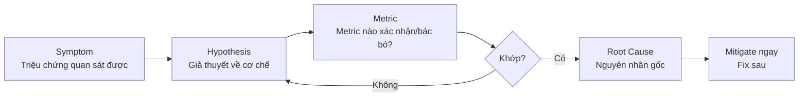
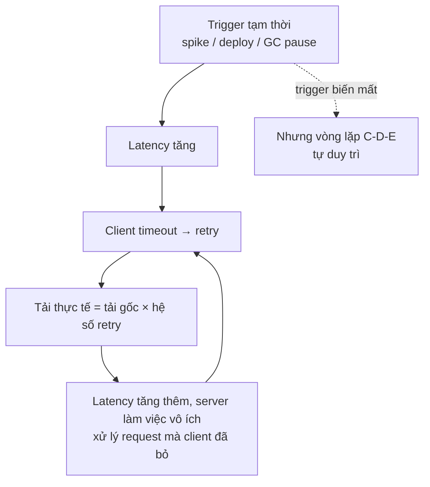

+++
title = "Chương 16: Failure Cases — Phân tích sự cố Production"
date = "2026-02-22T21:00:00+07:00"
draft = false
tags = ["backend", "communication", "api", "architecture"]
series = ["Backend Communication Architecture"]
+++

[← Chương trước](/series/backend-communication-architect/15-principal-architecture/) | Mục lục | Chương sau →

---

Đây là chương quan trọng nhất của toàn bộ tài liệu. Mọi kiến thức về giao thức, message broker, resilience pattern ở các chương trước chỉ thực sự có giá trị khi bạn đứng trước một dashboard đỏ rực lúc 2 giờ sáng và phải trả lời ba câu hỏi: **chuyện gì đang xảy ra, tại sao, và làm gì ngay bây giờ**.

Chương này phân tích 21 failure case kinh điển trong communication architecture. Mỗi case được viết như một postmortem thực tế, theo đúng cấu trúc 7 phần: Triệu chứng → Root Cause → Metric → Monitoring → Alert → Khắc phục → Phòng tránh. Mọi số liệu trong chương (ngưỡng alert, timeout, kích thước pool...) là **số liệu minh họa, phụ thuộc môi trường** — bạn phải đo và hiệu chỉnh theo hệ thống của mình.

## 16.0. Phương pháp phân tích sự cố

### 16.0.1. Vòng lặp Symptom → Hypothesis → Metric → Root Cause

Kỹ sư thiếu kinh nghiệm debug sự cố bằng cách "nhìn log và đoán". Kỹ sư có kinh nghiệm debug bằng một vòng lặp có kỷ luật:



1. **Symptom**: mô tả chính xác những gì quan sát được, không diễn giải. "Latency p99 của service A tăng từ 50ms lên 8s lúc 14:02" — không phải "service A bị chậm vì DB".
2. **Hypothesis**: mỗi giả thuyết phải nêu được **cơ chế** (mechanism), không chỉ nêu thủ phạm. "DB chậm" không phải giả thuyết; "connection pool của service A cạn vì query X giữ connection lâu, request mới phải chờ pool" mới là giả thuyết — vì nó dự đoán được metric nào sẽ bất thường.
3. **Metric**: mỗi giả thuyết phải kiểm chứng được bằng metric/log/trace cụ thể. Nếu giả thuyết đúng thì `db_pool_wait_duration` phải tăng trước khi latency tăng. Nếu không tăng — bỏ giả thuyết, quay lại bước 2.
4. **Root cause**: chỉ kết luận khi cơ chế giải thích được **toàn bộ** triệu chứng, kể cả timeline. Nếu root cause của bạn không giải thích được tại sao sự cố bắt đầu lúc 14:02 chứ không phải 13:00, bạn chưa tìm ra root cause.

Nguyên tắc vàng khi đang on-call: **mitigate trước, hiểu sau**. Rollback, scale, mở circuit breaker bằng tay, shed load — tất cả hợp lệ trước khi hiểu root cause. Postmortem là nơi để hiểu; incident là nơi để dừng thiệt hại.

### 16.0.2. Metastable failure — khái niệm nền tảng của chương này

Nhiều case trong chương này (case 2, 16, 17, 21) chia sẻ một cơ chế chung mà bạn phải nắm vững: **metastable failure**.

Hệ thống phân tán có hai trạng thái ổn định:

- **Trạng thái tốt (stable-healthy)**: tải bình thường, mọi request thành công, hệ thống tự cân bằng.
- **Trạng thái xấu ổn định (stable-degraded / metastable)**: một trigger tạm thời (deploy, spike, GC pause) đẩy hệ thống vào trạng thái quá tải; **cơ chế phản hồi của chính hệ thống** (retry, reconnect, health check fail → bớt node → node còn lại quá tải hơn) duy trì sự quá tải đó **ngay cả khi trigger đã biến mất**.



Đặc điểm nhận dạng metastable failure: **nguyên nhân gốc đã hết nhưng hệ thống không tự hồi phục**. DB đã khỏe lại, deploy đã rollback, nhưng error rate vẫn 100%. Lý do: sustaining feedback loop (thường là retry hoặc reconnect storm) giữ tải ở mức vượt capacity. Cách thoát duy nhất là **phá vòng lặp**: shed load mạnh tay, tắt retry, hoặc restart theo đợt. Ghi nhớ điều này — nó sẽ xuất hiện lặp đi lặp lại trong 21 case dưới đây.

### 16.0.3. Cách đọc mỗi case

Mỗi case theo đúng 7 phần. Phần "Metric cần xem" dùng naming convention kiểu Prometheus (bạn map sang hệ thống metric của mình). Phần "Alert" ghi điều kiện cụ thể — ngưỡng là minh họa, phụ thuộc môi trường. Code Golang trong phần "Phòng tránh" là code rút gọn để minh họa cơ chế, không phải code production hoàn chỉnh (thiếu logging, config injection...).

---

## Case 1: REST timeout — timeout không được set hoặc set sai tầng

### 1. Triệu chứng

- Alert đầu tiên thường **không phải** từ service gọi downstream, mà từ **service phía trên nó**: gateway báo 504, hoặc frontend team báo "trang treo".
- Dashboard: latency p99 của service A tăng vọt nhưng **p50 vẫn bình thường** — dấu hiệu kinh điển của một tập con request bị treo.
- Số lượng goroutine (Go) hoặc thread (Java) của service A tăng tuyến tính theo thời gian.
- CPU của service A **thấp bất thường** so với traffic — vì phần lớn goroutine đang chờ I/O chứ không làm việc.
- Cuối cùng: service A hết connection pool / hết memory / bị OOM kill, và sự cố lan lên toàn chuỗi.

### 2. Root Cause

Từ first principles: một HTTP call không có timeout là một lời hứa chờ đợi **vô hạn**. Trong Go, `http.Client{}` mặc định có `Timeout: 0` — nghĩa là không timeout. Khi downstream B bị treo (GC pause, deadlock, network blackhole — packet bị drop mà không có RST), mọi request từ A sang B sẽ giữ goroutine + connection + memory **mãi mãi**.

Cơ chế lan truyền: mỗi request treo chiếm một slot tài nguyên hữu hạn (goroutine thì rẻ, nhưng connection pool, semaphore, DB connection thì không). Tài nguyên cạn → request mới xếp hàng → latency của A tăng → client của A cũng bắt đầu treo (nếu họ cũng không set timeout) → sự cố lan ngược lên chuỗi gọi. Một service chết kéo cả cụm chết — đây là lý do timeout là **resilience pattern quan trọng nhất**, trước cả retry và circuit breaker.

Biến thể "set sai tầng" còn nguy hiểm hơn vì khó thấy:

- **Timeout tầng ngoài dài hơn tầng trong là đúng; ngược lại là sai.** Gateway timeout 10s nhưng service bên trong retry 3 lần × 5s = 15s: gateway đã trả 504 cho user, nhưng bên trong hệ thống vẫn cày tiếp 5s vô ích — server làm việc cho request mà không ai còn chờ kết quả.
- **`http.Client.Timeout` vs `context`**: set `Timeout` trên client nhưng không truyền `context` xuống DB call → HTTP bị hủy nhưng query DB vẫn chạy.
- **Chỉ set connect timeout, quên read timeout**: kết nối thành công rồi treo ở đọc response — trường hợp phổ biến nhất khi downstream "nhận nhưng không trả lời".

### 3. Metric cần xem

- `http_client_request_duration_seconds` (histogram, label `target`, `code`) — nhìn p99 và **max**.
- `http_client_in_flight_requests` — số request đang bay; tăng không giới hạn = có request treo.
- `go_goroutines` — tăng tuyến tính là red flag số một trong Go.
- `http_client_pool_wait_duration_seconds` hoặc connection pool metrics.
- `process_open_fds` — file descriptor tăng dần vì connection không được trả lại.

### 4. Monitoring

- Dashboard latency **phải hiển thị p50/p95/p99/max trên cùng một panel** — sự phân kỳ giữa p50 và p99 là tín hiệu chẩn đoán.
- Query phát hiện request treo:

```promql
# Số request đang bay quá lâu (nếu có exemplar/trace thì tốt hơn)
http_client_in_flight_requests{job="service-a"} > 100

# Goroutine tăng đơn điệu trong 30 phút
delta(go_goroutines{job="service-a"}[30m]) > 500
```

- Distributed tracing là công cụ tốt nhất ở đây: trace nào có span "đang mở" hàng phút là chỉ thẳng vào call không timeout.

### 5. Alert

- `go_goroutines > 10000` hoặc `delta(go_goroutines[15m]) > 2000` (ngưỡng minh họa, phụ thuộc môi trường) — page.
- `histogram_quantile(0.99, rate(http_client_request_duration_seconds_bucket[5m])) > <SLO>` kéo dài 5 phút — page.
- `process_open_fds / process_max_fds > 0.8` — warn trước khi chết hẳn.

### 6. Khắc phục

1. Xác định downstream đang treo (qua tracing hoặc `in_flight` theo label `target`).
2. **Restart service A** để giải phóng goroutine/connection bị treo — đây là mitigation hợp lệ, đừng ngại.
3. Nếu downstream B vẫn bệnh: chặn traffic sang B (feature flag, circuit breaker bằng tay, hoặc trả degraded response).
4. Nếu chưa thể sửa code: giảm tác động bằng cách hạ connection pool limit sang B — biến "treo vô hạn" thành "fail nhanh khi pool đầy".

### 7. Phòng tránh

Quy tắc kiến trúc: **mọi I/O call phải có deadline, và deadline phải giảm dần khi đi sâu vào hệ thống** (deadline propagation).

```go
// SAI: client mặc định không có timeout
var badClient = &http.Client{}

// ĐÚNG: timeout ở từng tầng, tường minh
var client = &http.Client{
    Timeout: 3 * time.Second, // chặn trên toàn bộ request
    Transport: &http.Transport{
        DialContext: (&net.Dialer{
            Timeout: 500 * time.Millisecond, // connect timeout
        }).DialContext,
        ResponseHeaderTimeout: 2 * time.Second, // chờ header
        IdleConnTimeout:       90 * time.Second,
        MaxIdleConnsPerHost:   32,
    },
}

// Deadline propagation: nhận budget từ caller, trừ hao rồi truyền xuống
func (s *Svc) Handle(ctx context.Context, req Request) error {
    // Nếu caller cho 3s, chỉ dành tối đa 2s cho downstream,
    // giữ lại budget cho xử lý và trả response.
    dctx, cancel := context.WithTimeout(ctx, 2*time.Second)
    defer cancel()

    httpReq, _ := http.NewRequestWithContext(dctx, "GET", s.url, nil)
    resp, err := client.Do(httpReq) // context hủy -> request hủy
    if err != nil {
        return fmt.Errorf("call downstream: %w", err)
    }
    defer resp.Body.Close()
    // ...
    return nil
}
```

Bổ sung ở tầng tổ chức: lint rule/CI check cấm `http.Client{}` và `http.Get()` trần; load test có kịch bản "downstream blackhole" (drop packet, không phải trả lỗi nhanh) — vì downstream trả lỗi nhanh gần như vô hại, downstream **treo** mới là kịch bản giết hệ thống.

---

## Case 2: HTTP retry storm — retry không backoff khuếch đại tải

### 1. Triệu chứng

- Downstream B gặp một sự cố nhỏ (deploy, GC pause 2 giây) — nhưng traffic đến B **tăng gấp 3-4 lần** ngay lập tức thay vì giữ nguyên.
- Error rate của B tăng theo hình xoắn ốc: càng lỗi càng nhiều request, càng nhiều request càng lỗi.
- Sau khi B đã khỏe (deploy xong, GC xong), **traffic vẫn không giảm** và B vẫn quá tải — dấu hiệu metastable.
- Ở phía A: latency tăng, và tổng số request outbound (đo ở client) lớn hơn nhiều lần số request inbound (đo ở server A).

### 2. Root Cause

Từ first principles: retry là **nhân bản tải có điều kiện** — điều kiện kích hoạt chính là lúc hệ thống yếu nhất. Gọi hệ số retry là R (số lần thử tối đa). Khi downstream lỗi 100%, tải thực = tải gốc × R. Nguy hiểm hơn, retry **xếp tầng** qua nhiều lớp: client retry 3, gateway retry 3, service A retry 3 → downstream cuối nhận 3×3×3 = **27 lần** tải gốc. Đây là retry amplification.

Không có backoff → mọi retry dồn vào đúng lúc hệ thống đang yếu. Không có jitter → các client retry **đồng pha**: tất cả fail lúc T, tất cả retry lúc T+1s, tạo sóng tải hình răng cưa mà autoscaler không kịp phản ứng.

Tại sao hệ thống không tự hồi phục sau khi trigger hết? Vì server đang dành phần lớn capacity xử lý các retry của request mà client đã bỏ cuộc (goodput ≈ 0, throughput vẫn max). Latency vì thế vẫn cao → client tiếp tục timeout → tiếp tục retry. Vòng lặp tự duy trì — chính là metastable failure ở mục 16.0.2.

### 3. Metric cần xem

- `http_client_retries_total` (label `target`) — **bắt buộc phải có metric riêng cho retry**, đừng để retry lẫn vào request thường.
- Tỷ lệ khuếch đại: `rate(http_client_requests_total)` (phía A, tính cả retry) chia cho `rate(http_server_requests_total{job="A"})` (request gốc vào A).
- `http_server_requests_total{code=~"5.."}` ở B.
- Goodput của B: tỷ lệ response mà client còn chờ nhận (cần đo qua tracing hoặc so sánh success ở hai phía).

### 4. Monitoring

```promql
# Hệ số khuếch đại retry: > 1.5 là đáng ngờ, > 2 là đang có storm
sum(rate(http_client_requests_total{target="service-b"}[1m]))
/
sum(rate(http_server_requests_total{job="service-a"}[1m]))

# Retry rate tuyệt đối
sum(rate(http_client_retries_total{target="service-b"}[1m]))
```

Dashboard nên có panel "inbound vs outbound request rate" cho mỗi service — sự phân kỳ giữa hai đường là chữ ký của retry storm.

### 5. Alert

- Hệ số khuếch đại > 2 trong 5 phút (minh họa, phụ thuộc môi trường) — page.
- `rate(http_client_retries_total[5m]) / rate(http_client_requests_total[5m]) > 0.1` — hơn 10% call là retry, warn.

### 6. Khắc phục

1. **Tắt hoặc giảm retry ngay** — qua config động/feature flag nếu có (đây là lý do retry policy phải điều khiển được lúc runtime, không hardcode).
2. Nếu không tắt được retry: **shed load ở phía trước B** (rate limit thô bạo ở gateway) để B có không gian thoát khỏi vòng xoáy. Chấp nhận từ chối 50% request có chủ đích tốt hơn 100% request timeout.
3. Scale B chỉ có tác dụng nếu scale **nhanh hơn tốc độ khuếch đại** — thường không kịp; ưu tiên cắt retry trước.
4. Sau khi B khỏe: mở lại traffic **từ từ** (10% → 50% → 100%), không mở hết một lần.

### 7. Phòng tránh

Ba quy tắc: (1) backoff mũ + full jitter, (2) retry budget thay vì retry count đơn thuần, (3) chỉ một tầng được retry — thường là tầng gần client nhất hoặc mesh, các tầng khác retry = 0.

```go
// Exponential backoff + full jitter + retry budget
type RetryBudget struct {
    mu      sync.Mutex
    tokens  float64
    max     float64
    ratio   float64 // ví dụ 0.1 = retry tối đa 10% traffic
}

func (b *RetryBudget) OnRequest() { // mỗi request gốc nạp token
    b.mu.Lock(); defer b.mu.Unlock()
    b.tokens = math.Min(b.max, b.tokens+b.ratio)
}

func (b *RetryBudget) AllowRetry() bool { // retry tiêu 1 token
    b.mu.Lock(); defer b.mu.Unlock()
    if b.tokens >= 1 {
        b.tokens--
        return true
    }
    return false // budget cạn: fail luôn, KHÔNG retry
}

func doWithRetry(ctx context.Context, budget *RetryBudget, fn func(context.Context) error) error {
    budget.OnRequest()
    var err error
    base := 100 * time.Millisecond
    for attempt := 0; attempt < 3; attempt++ {
        if err = fn(ctx); err == nil {
            return nil
        }
        if !isRetryable(err) || attempt == 2 || !budget.AllowRetry() {
            return err
        }
        // Full jitter: sleep ngẫu nhiên trong [0, base*2^attempt)
        sleep := time.Duration(rand.Int64N(int64(base) << attempt))
        select {
        case <-time.After(sleep):
        case <-ctx.Done():
            return ctx.Err()
        }
    }
    return err
}
```

Retry budget là điểm mấu chốt: khi downstream lỗi diện rộng, budget cạn ngay và hệ thống **tự động ngừng khuếch đại** — thuộc tính mà "retry 3 lần có backoff" không có (backoff chỉ trải sóng ra, không giảm tổng khối lượng). Ngoài ra: chỉ retry lỗi idempotent-safe và lỗi có tính tạm thời (503, timeout kết nối); tôn trọng header `Retry-After`; kết hợp circuit breaker (case 16).

---

## Case 3: Head-of-line blocking — HTTP/1.1 và TCP-level trong HTTP/2

### 1. Triệu chứng

- **Kịch bản HTTP/1.1**: latency của các request **nhanh** tăng bất thường khi hệ thống có lẫn request chậm. p50 của endpoint "GET /health" (bình thường 1ms) nhảy lên hàng trăm ms dù server không quá tải.
- **Kịch bản HTTP/2 trên mạng có packet loss**: mọi stream trên cùng connection cùng chậm đồng loạt; latency tương quan chặt với `tcp_retransmit`. Đặc biệt thấy ở client mobile/mạng yếu.
- CPU và memory server đều bình thường — điểm nghẽn không nằm ở server mà ở **hàng đợi trên connection**.

### 2. Root Cause

Hai tầng head-of-line (HoL) blocking khác nhau, cùng một nguyên lý: **khi nhiều đơn vị công việc chia sẻ một hàng đợi FIFO, đơn vị chậm nhất ở đầu hàng chặn tất cả phía sau**.

**HTTP/1.1 application-level HoL**: một connection HTTP/1.1 chỉ xử lý tuần tự một request tại một thời điểm (pipelining trên thực tế đã chết vì chính HoL). Client có pool N connection sang server; khi có nhiều request chậm chiếm hết N connection, request nhanh phải xếp hàng chờ connection — dù server còn thừa capacity. Trong Go, triệu chứng nằm ở `MaxConnsPerHost`/`MaxIdleConnsPerHost` quá nhỏ: request nhanh chờ sau request chậm trong pool.

**HTTP/2 TCP-level HoL**: HTTP/2 multiplexing giải quyết HoL ở tầng ứng dụng — nhiều stream song song trên một TCP connection. Nhưng TCP cung cấp một byte stream **có thứ tự**: mất một packet thì mọi byte phía sau (thuộc mọi stream, kể cả stream không liên quan đến packet mất) phải chờ retransmit rồi mới được deliver lên tầng trên. Nghịch lý: trên mạng loss cao, HTTP/2 (1 connection, N stream) có thể **tệ hơn** HTTP/1.1 (N connection độc lập) — vì HTTP/1.1 chỉ mất 1/N throughput khi 1 connection dính loss, còn HTTP/2 mất toàn bộ. Đây chính là lý do QUIC/HTTP3 tồn tại: stream độc lập ở tầng transport, mất packet của stream này không chặn stream kia.

### 3. Metric cần xem

- `http_client_pool_wait_duration_seconds` — thời gian chờ connection từ pool (HTTP/1.1).
- Latency histogram **tách theo endpoint** — HoL biểu hiện qua endpoint nhanh bị chậm theo endpoint chậm.
- `node_netstat_Tcp_RetransSegs` / tỷ lệ retransmit — cho kịch bản HTTP/2.
- `http2_active_streams_per_connection` (nếu có) — nhiều stream trên ít connection + mạng loss = nguy cơ HoL TCP.

### 4. Monitoring

```promql
# Tương quan: latency endpoint nhanh tăng cùng lúc endpoint chậm tăng
histogram_quantile(0.95,
  sum by (le, handler) (rate(http_request_duration_seconds_bucket[5m])))

# TCP retransmit rate trên node
rate(node_netstat_Tcp_RetransSegs[5m]) / rate(node_netstat_Tcp_OutSegs[5m])
```

Dấu hiệu chẩn đoán quyết định: server-side duration (đo từ lúc handler bắt đầu) **bình thường**, nhưng client-side duration cao — chênh lệch nằm ở hàng đợi connection/network, không phải ở xử lý.

### 5. Alert

- `histogram_quantile(0.95, rate(http_client_pool_wait_duration_seconds_bucket[5m])) > 0.1` (100ms chờ pool, minh họa) — warn.
- Tỷ lệ TCP retransmit > 1-2% (phụ thuộc môi trường) — warn, điều tra mạng.
- Chênh lệch client-observed latency và server-observed latency > X ms kéo dài — dấu hiệu nghẽn ở tầng vận chuyển.

### 6. Khắc phục

1. HTTP/1.1: **tăng `MaxConnsPerHost` / `MaxIdleConnsPerHost`** ngay (config/env) để request nhanh không chờ sau request chậm; hoặc tách client riêng cho endpoint chậm.
2. Cách ly ngay các request chậm đã biết (report nặng, export...) sang worker/queue để chúng ngừng chiếm connection đồng bộ.
3. HTTP/2 trên mạng loss: nếu là internal service bị mạng kém, giảm số stream/connection và tăng số connection (nhiều gRPC client cho phép nhiều subchannel); với client public, cân nhắc bật HTTP/3 ở edge (CDN/LB hỗ trợ sẵn).

### 7. Phòng tránh

Nguyên tắc kiến trúc: **bulkhead theo loại tải** — không cho request chậm và request nhanh chia sẻ cùng hàng đợi/pool.

```go
// Tách transport: pool riêng cho call chậm và call nhanh,
// call chậm không thể chiếm connection của call nhanh.
func newTransport(maxConns int) *http.Transport {
    return &http.Transport{
        MaxConnsPerHost:     maxConns,
        MaxIdleConnsPerHost: maxConns,
        IdleConnTimeout:     90 * time.Second,
    }
}

var (
    fastClient = &http.Client{ // API call nhẹ, latency-sensitive
        Timeout:   2 * time.Second,
        Transport: newTransport(64),
    }
    slowClient = &http.Client{ // report, export, batch
        Timeout:   60 * time.Second,
        Transport: newTransport(8), // giới hạn thấp, có chủ đích
    }
)
```

Ở tầng thiết kế: endpoint chậm chuyển sang mô hình async (trả 202 + job id, client poll hoặc nhận webhook — xem case 14); edge public bật HTTP/3; internal gRPC cân nhắc nhiều connection khi chạy qua network chất lượng thấp (cross-region).

---

## Case 4: GraphQL N+1

### 1. Triệu chứng

- Một query GraphQL trông vô hại (`{ posts { author { name } } }`) tạo ra **hàng trăm query SQL** hoặc hàng trăm call sang user-service.
- DB/downstream báo QPS tăng đột biến sau khi frontend release một màn hình mới — dù traffic user không đổi.
- Latency của GraphQL endpoint tỷ lệ thuận với **kích thước danh sách trả về** (100 post chậm gấp ~100 lần 1 post) thay vì gần như phẳng.
- APM trace của một request cho thấy chuỗi span giống hệt nhau lặp N lần, tuần tự hoặc song song.

### 2. Root Cause

Từ first principles: GraphQL resolver là hàm được gọi **cho từng node** trong response graph. Resolver `Post.author` được gọi một lần cho mỗi post — mỗi lần thực thi một query `SELECT * FROM users WHERE id = ?`. Với danh sách N post: 1 query lấy posts + N query lấy author = N+1.

Điểm nguy hiểm về mặt kiến trúc: **schema che giấu chi phí**. Người viết resolver chỉ thấy hàm "lấy 1 user" — hoàn toàn hợp lý cục bộ; sự bùng nổ chỉ xuất hiện khi composition với danh sách. Đây là bài toán thiếu **batching layer**: thay vì thực thi ngay từng lookup, cần gom các lookup trong cùng một tick thực thi thành một batch (`WHERE id IN (...)` hoặc một gRPC BatchGet). Trong microservices, N+1 còn tệ hơn N+1 SQL: mỗi lookup là một network round-trip với đủ chi phí serialize + connection + tail latency.

### 3. Metric cần xem

- `graphql_resolver_calls_total` (label `field`) — số lần gọi resolver theo field.
- Tỷ lệ chẩn đoán quyết định: `graphql_resolver_calls_total{field="Post.author"} / graphql_requests_total` — nếu ≈ N (kích thước list trung bình) thay vì ≈ 1, bạn có N+1.
- `db_queries_per_request` (histogram) — số query DB trên mỗi request GraphQL.
- QPS của downstream (`grpc_client_started_total{method="GetUser"}`) so với QPS GraphQL.

### 4. Monitoring

```promql
# Số resolver call trung bình mỗi request, theo field — tìm field có tỷ lệ cao bất thường
sum by (field) (rate(graphql_resolver_calls_total[5m]))
/ ignoring(field) group_left
sum(rate(graphql_requests_total[5m]))
```

Tracing là công cụ chẩn đoán số một: một trace với N span `GetUser` giống hệt nhau là bằng chứng không thể chối cãi. Bật span cho resolver ở môi trường staging và soi trước mỗi release schema.

### 5. Alert

- `db_queries_per_request` p95 > 20 (minh họa, phụ thuộc môi trường) — warn.
- QPS downstream tăng > 3x trong khi QPS gateway không đổi — warn, thường trùng với frontend release.

### 6. Khắc phục

1. Xác định query gây hại (qua `graphql_operation_name` trong metric/log) và field N+1 (qua trace).
2. Mitigation nhanh nhất: **persisted query blocklist / tắt field** đó qua schema directive hoặc feature flag nếu hạ tầng cho phép; hoặc phối hợp frontend rollback màn hình mới.
3. Giảm tải khẩn cấp cho downstream: thêm cache ngắn hạn (vài giây) trước lookup nóng — chấp nhận stale nhẹ để sống sót.
4. Rate limit theo operation name ở gateway.

### 7. Phòng tránh

Chuẩn mực: **mọi resolver lấy dữ liệu theo id bắt buộc đi qua dataloader** — không có ngoại lệ, enforce bằng code review checklist và bằng test đếm query.

```go
// Dataloader pattern rút gọn: gom lookup trong 1 tick thành 1 batch
type UserLoader struct {
    mu      sync.Mutex
    pending map[string][]chan *User
    fetch   func(ctx context.Context, ids []string) (map[string]*User, error)
    wait    time.Duration // cửa sổ gom batch, ví dụ 1ms
}

func (l *UserLoader) Load(ctx context.Context, id string) (*User, error) {
    ch := make(chan *User, 1)
    l.mu.Lock()
    first := len(l.pending) == 0
    l.pending[id] = append(l.pending[id], ch)
    l.mu.Unlock()

    if first { // request đầu tiên trong batch lên lịch flush
        time.AfterFunc(l.wait, func() { l.flush(ctx) })
    }
    select {
    case u := <-ch:
        return u, nil
    case <-ctx.Done():
        return nil, ctx.Err()
    }
}

func (l *UserLoader) flush(ctx context.Context) {
    l.mu.Lock()
    batch := l.pending
    l.pending = map[string][]chan *User{}
    l.mu.Unlock()

    ids := make([]string, 0, len(batch))
    for id := range batch {
        ids = append(ids, id)
    }
    users, _ := l.fetch(ctx, ids) // 1 query: WHERE id IN (...) hoặc BatchGet
    for id, chans := range batch {
        for _, ch := range chans {
            ch <- users[id]
        }
    }
}
```

Kèm theo: test tự động "query X trả về N item thì số query DB ≤ hằng số" (đếm bằng interceptor trong test); downstream service phải expose **Batch API** (BatchGet) — dataloader phía gateway vô nghĩa nếu downstream chỉ nhận từng id một.

---

## Case 5: GraphQL query explosion — nested query độ sâu lớn, thiếu depth/complexity limit

### 1. Triệu chứng

- CPU và memory của GraphQL server tăng vọt trong khi **request rate không đổi** — vài request "nặng" chiếm toàn bộ tài nguyên.
- Một vài request có latency hàng chục giây, response size hàng chục MB; các request bình thường xung quanh bị chậm lây (chung worker pool, chung DB pool).
- Log cho thấy các query có cấu trúc đệ quy: `{ user { friends { friends { friends { ... } } } } }` — thường từ một client lạ hoặc script, không phải frontend chính thức.
- Trường hợp xấu nhất: OOM kill lặp lại, và kẻ tấn công (hoặc một client vô ý) chỉ cần vài request/giây để giữ server chết — một dạng application-level DoS chi phí cực thấp.

### 2. Root Cause

Từ first principles: GraphQL cho phép client **tự soạn hình dạng của response**, nghĩa là client tự quyết định chi phí server phải trả. Với schema có quan hệ vòng (`User → friends → User`), chi phí tăng **theo hàm mũ với độ sâu**: mỗi tầng nhân số node lên trung bình K lần → độ sâu D tạo ra ~K^D node, mỗi node là resolver call + memory giữ kết quả trung gian. Query 200 byte có thể sinh hàng triệu resolver call.

Khác biệt căn bản với REST: REST endpoint có chi phí **do server quyết định và gần như hằng số**; GraphQL endpoint có chi phí **do client quyết định và không chặn trên** nếu bạn không tự đặt chặn. Thiếu ba lớp phòng thủ — depth limit, complexity limit (cost analysis trước khi thực thi), và timeout per-query — là root cause thực sự; query độc chỉ là trigger. Alias abuse là biến thể cần biết: client dùng alias để lặp một field nặng hàng nghìn lần trong một query mà không cần độ sâu (`a1: expensiveField, a2: expensiveField, ...`) — depth limit không bắt được, phải có complexity limit.

### 3. Metric cần xem

- `graphql_query_depth` (histogram) — độ sâu query thực nhận.
- `graphql_query_complexity` (histogram) — điểm complexity đã tính (nếu có cost analysis).
- `graphql_request_duration_seconds` p99 và max, tách theo `operation_name`.
- `graphql_response_bytes` (histogram) — response size bất thường.
- `go_memstats_heap_inuse_bytes`, `process_cpu_seconds_total` — tương quan với các query nặng.

### 4. Monitoring

```promql
# Query sâu bất thường xuất hiện
histogram_quantile(0.99, rate(graphql_query_depth_bucket[5m]))

# Top operation theo tổng thời gian xử lý (ai đang đốt CPU của bạn)
topk(5, sum by (operation_name) (rate(graphql_request_duration_seconds_sum[5m])))
```

Log mọi query bị từ chối vì depth/complexity kèm client id — đây vừa là tín hiệu bảo mật, vừa là cách phát hiện client hợp lệ đang cần một API tốt hơn.

### 5. Alert

- `graphql_query_depth` max > 10 (minh họa, phụ thuộc schema) — warn, điều tra client.
- Xuất hiện query bị reject vì complexity với tần suất > X/phút — warn (có thể đang bị dò).
- `graphql_response_bytes` p99 > 5MB — warn.

### 6. Khắc phục

1. Xác định query độc qua log/APM (`operation_name`, query hash, client id).
2. **Chặn ở tầng gateway/WAF theo query hash hoặc client id** — nhanh nhất, không cần deploy.
3. Nếu chưa có depth limit: deploy hotfix bật depth limit của thư viện GraphQL đang dùng (hầu hết đều có sẵn, chỉ là chưa bật).
4. Hạ timeout per-request của GraphQL endpoint xuống mức chặt (ví dụ 5s) để query nặng chết sớm thay vì chiếm tài nguyên hàng phút.

### 7. Phòng tránh

Ba lớp chặn bắt buộc, theo thứ tự chi phí kiểm tra tăng dần — reject càng sớm càng rẻ:

```go
// Lớp 1: depth limit — kiểm tra trên AST trước khi thực thi, chi phí ~0
// (gqlgen có sẵn: server.Use(extension.FixedComplexityLimit(...)))
func maxDepth(sel ast.SelectionSet, depth int) int {
    m := depth
    for _, s := range sel {
        if f, ok := s.(*ast.Field); ok {
            if d := maxDepth(f.SelectionSet, depth+1); d > m {
                m = d
            }
        }
    }
    return m
}

// Lớp 2: complexity limit — mỗi field gán cost, list nhân theo tham số `first`
// Ví dụ với gqlgen:
//   srv.Use(extension.ComplexityLimit(300))
//   cfg.Complexity.User.Friends = func(childComplexity, first int) int {
//       return first * childComplexity // list nhân chi phí con
//   }

// Lớp 3: timeout cứng cho toàn bộ query — chặn phần lọt lưới
func timeoutMiddleware(next http.Handler) http.Handler {
    return http.HandlerFunc(func(w http.ResponseWriter, r *http.Request) {
        ctx, cancel := context.WithTimeout(r.Context(), 5*time.Second)
        defer cancel()
        next.ServeHTTP(w, r.WithContext(ctx))
    })
}
```

Với API public/partner, nâng cấp lên **persisted queries / trusted documents**: production chỉ chấp nhận các query đã đăng ký trước theo hash — loại bỏ hoàn toàn lớp tấn công "client tự soạn query", đồng thời giảm băng thông. Bổ sung: pagination bắt buộc trên mọi list field (`first` có max, ví dụ 100), và rate limit tính theo **complexity đã tiêu** thay vì theo số request — 1000 query nhẹ và 10 query nặng phải bị tính khác nhau.

---

## Case 6: gRPC connection leak — không close ClientConn, tạo connection mỗi request

### 1. Triệu chứng

- Memory và file descriptor của client service tăng đơn điệu theo thời gian, restart thì reset — hình răng cưa "leak kinh điển" trên dashboard theo chu kỳ restart/deploy.
- `netstat`/`ss` trên client pod cho thấy hàng nghìn TCP connection ESTABLISHED đến cùng một backend.
- Server gRPC phía kia: số connection tăng tương ứng, memory tăng (mỗi HTTP/2 connection có buffer + state), có thể chạm `ulimit` file descriptor và bắt đầu từ chối accept.
- Latency tăng nhẹ đều đặn (mỗi request mới trả chi phí TCP + TLS handshake ~1-3 RTT thay vì tái dùng connection), rồi đột ngột sập khi chạm giới hạn fd: lỗi `too many open files` hoặc `connection refused`.

### 2. Root Cause

Từ first principles: `grpc.ClientConn` trong Go **không phải một connection** — nó là một đối tượng quản lý đắt đỏ: connection pool, name resolver, load balancer state, health checking, goroutine nền. Nó được thiết kế để tạo **một lần cho mỗi target và dùng suốt vòng đời process**, an toàn cho concurrent use.

Anti-pattern gây leak có hai dạng:

```go
// Dạng 1: tạo conn mỗi request, có defer nhưng vẫn sai về hiệu năng
// (mất multiplexing, mỗi request 1 handshake) — và khi ai đó xóa defer thì leak
func handler(w http.ResponseWriter, r *http.Request) {
    conn, _ := grpc.NewClient(target, opts...) // SAI: mỗi request một ClientConn
    defer conn.Close()
    // ...
}

// Dạng 2: leak thật — tạo trong vòng lặp/goroutine, không bao giờ Close
go func() {
    for job := range jobs {
        conn, _ := grpc.NewClient(target, opts...) // không ai Close
        client := pb.NewWorkerClient(conn)
        client.Process(ctx, job)
    }
}()
```

Vì sao nó âm thầm: gRPC connect theo kiểu lazy, `NewClient` hầu như không tốn gì ngay lập tức; chi phí (goroutine resolver, TCP connection khi RPC đầu tiên chạy) tích tụ dần. Mỗi ClientConn bị bỏ rơi giữ ít nhất vài goroutine + 1 fd + buffer — hàng chục nghìn request sau, process chết. Lưu ý phía server cũng chịu hậu quả: server giữ state cho mỗi connection, nên **một client leak có thể giết server** phục vụ các client khỏe mạnh khác.

### 3. Metric cần xem

- `process_open_fds` và `process_max_fds` — tỷ lệ sử dụng fd.
- `go_goroutines` — mỗi ClientConn rò rỉ kéo theo vài goroutine.
- `grpc_client_started_total` vs số connection thực tế (`node_netstat_Tcp_CurrEstab` hoặc đếm qua `ss` exporter) — connection tăng theo request là chữ ký của "conn per request".
- Phía server: `grpc_server_connections` (nếu có), memory theo connection.
- Latency p50 của RPC: cao bất thường ổn định (mỗi call trả giá handshake).

### 4. Monitoring

```promql
# FD tăng đơn điệu — leak signature
delta(process_open_fds{job="service-a"}[1h]) > 200

# Goroutine tăng cùng nhịp với fd
delta(go_goroutines{job="service-a"}[1h]) > 500
```

Trong Go, `pprof` goroutine profile là công cụ quyết định: hàng nghìn goroutine cùng stack `google.golang.org/grpc.(*addrConn)...` hoặc resolver watcher = ClientConn leak, chỉ thẳng vào nơi tạo conn.

### 5. Alert

- `process_open_fds / process_max_fds > 0.7` — warn; `> 0.9` — page.
- `delta(go_goroutines[2h]) > 2000` (minh họa, phụ thuộc môi trường) — warn.
- Server gRPC: số connection từ một client pod > 100 — warn (client khỏe mạnh chỉ cần vài connection).

### 6. Khắc phục

1. **Restart client service** — giải phóng ngay toàn bộ conn leak, mua thời gian.
2. Nếu chưa fix được code ngay: tăng `ulimit -n` cho cả client và server để kéo dài thời gian sống giữa các restart, và đặt cron restart có kiểm soát (xấu hổ nhưng hợp lệ trong lúc chờ fix).
3. Kiểm tra server phía kia có cần restart không (fd/memory đã bị client leak ăn mòn).

### 7. Phòng tránh

Quy tắc: **ClientConn là singleton theo target, tạo lúc khởi động, đóng lúc shutdown**. Cấu trúc code để vi phạm là khó:

```go
// Khởi tạo một lần trong main/DI container, inject vào handler
type Clients struct {
    User  userpb.UserServiceClient
    Order orderpb.OrderServiceClient
    conns []*grpc.ClientConn
}

func NewClients(userTarget, orderTarget string) (*Clients, error) {
    dial := func(target string) (*grpc.ClientConn, error) {
        return grpc.NewClient(target,
            grpc.WithTransportCredentials(creds),
            grpc.WithKeepaliveParams(keepalive.ClientParameters{
                Time:    30 * time.Second, // phát hiện connection chết
                Timeout: 10 * time.Second,
            }),
        )
    }
    uc, err := dial(userTarget)
    if err != nil { return nil, err }
    oc, err := dial(orderTarget)
    if err != nil { uc.Close(); return nil, err }
    return &Clients{
        User:  userpb.NewUserServiceClient(uc),
        Order: orderpb.NewOrderServiceClient(oc),
        conns: []*grpc.ClientConn{uc, oc},
    }, nil
}

func (c *Clients) Close() { // gọi trong graceful shutdown
    for _, conn := range c.conns { conn.Close() }
}
```

Bổ sung: lint rule/code review checklist cấm `grpc.NewClient`/`grpc.Dial` ngoài package khởi tạo; test leak trong CI (chạy N request, assert `runtime.NumGoroutine()` và số fd không tăng tuyến tính); dashboard chuẩn cho mọi service Go luôn có panel goroutine + fd — hai metric rẻ nhất để bắt mọi loại leak.

---

## Case 7: HTTP/2 stream exhaustion — chạm trần MAX_CONCURRENT_STREAMS

### 1. Triệu chứng

- gRPC client báo lỗi hoặc latency tăng đột biến, nhưng **server-side metric hoàn toàn bình thường**: CPU thấp, request rate không đổi, server-observed latency tốt — vì các RPC bị nghẽn **chưa bao giờ đến được server**.
- Triệu chứng đặc trưng: RPC bị treo ở client trước khi có bất kỳ hoạt động network nào (trace cho thấy span client dài nhưng span server ngắn và bắt đầu muộn).
- Xảy ra khi client có concurrency cao (batch job, fan-out lớn) hoặc dùng nhiều **streaming RPC sống lâu** trên một connection.
- Với Go gRPC client: mặc định hành vi là **xếp hàng chờ stream slot** (block), không phải fail — nên không có error rate, chỉ có latency tăng khó hiểu.

### 2. Root Cause

Từ first principles: HTTP/2 multiplexing không phải vô hạn. Mỗi connection có giới hạn số stream đồng thời do server công bố qua SETTINGS frame: `MAX_CONCURRENT_STREAMS`. Giá trị phổ biến: 100 (mặc định của nhiều server, gồm Go `http2.Server`), một số proxy đặt thấp hơn.

Mỗi RPC unary đang bay = 1 stream. Mỗi streaming RPC đang mở = 1 stream **trong suốt vòng đời của nó** — điểm này hay bị quên: 100 client mở watch/subscribe stream sống lâu qua một connection là hết sạch quota, các RPC unary sau đó xếp hàng vô hạn.

Cơ chế nghẽn: client gRPC Go mặc định dùng **một TCP connection cho mỗi target** (trừ khi cấu hình load balancing với nhiều address). Khi số RPC đồng thời > MAX_CONCURRENT_STREAMS, RPC thứ 101 chờ trong hàng đợi của transport — chờ này **nằm ngoài** mọi metric server và ngoài cả timeout nếu context không được set. Đây là một dạng head-of-line blocking ở tầng stream quota: các RPC nhanh chờ sau quota bị chiếm bởi stream sống lâu.

Biến thể qua proxy: client → Envoy/nginx → server. Proxy có giới hạn stream riêng của nó ở cả hai phía; nginx mặc định `http2_max_concurrent_streams 128`. Bạn có thể chạm trần ở proxy trong khi cả client lẫn server đều nghĩ mình còn quota.

### 3. Metric cần xem

- `grpc_client_started_total` trừ `grpc_client_handled_total` — số RPC in-flight phía client; nếu in-flight bị "kẹp phẳng" đúng ở 100 (hoặc một hằng số tròn trịa) trong khi hàng đợi tăng, đó là stream limit.
- Chênh lệch client-observed vs server-observed latency (cần cả hai phía đo).
- Số streaming RPC đang mở: `grpc_client_started_total{grpc_type=~"server_stream|bidi_stream"}` trừ handled tương ứng.
- Số TCP connection từ client đến target (thường là 1 — chính là vấn đề).

### 4. Monitoring

```promql
# In-flight RPC phía client, theo target — nhìn xem có bị chặn phẳng ở một hằng số
sum by (grpc_service) (grpc_client_started_total - ignoring() grpc_client_handled_total)

# Streaming RPC sống lâu đang chiếm quota
sum(grpc_client_started_total{grpc_type="bidi_stream"}) - sum(grpc_client_handled_total{grpc_type="bidi_stream"})
```

Dấu hiệu chẩn đoán quyết định: in-flight count phía client dừng đúng tại một số tròn (100, 128, 250) như bị cắt bằng dao — giới hạn nhân tạo, không phải nghẽn tài nguyên tự nhiên (nghẽn tự nhiên dao động).

### 5. Alert

- Client in-flight RPC đến một target đạt ≥ 90% giá trị MAX_CONCURRENT_STREAMS đã biết trong 5 phút — warn.
- Chênh lệch p99 client-observed − server-observed latency > 500ms (minh họa) — warn, điều tra tầng transport.

### 6. Khắc phục

1. **Tăng MAX_CONCURRENT_STREAMS phía server** nếu server đủ tài nguyên (Go: `grpc.MaxConcurrentStreams(1000)` khi tạo server; nginx/Envoy: config tương ứng) — thường là mitigation nhanh nhất.
2. Phía client: mở thêm connection — với Go gRPC, cách thực dụng lúc khẩn cấp là tạo thêm 2-3 ClientConn đến cùng target và round-robin ở tầng ứng dụng.
3. Rà và đóng các streaming RPC sống lâu không cần thiết (watch bị leak — stream mở ra nhưng không bao giờ CloseSend/cancel).
4. Đảm bảo mọi RPC có context timeout để "chờ stream slot" không thành "treo vô hạn".

### 7. Phòng tránh

Nguyên tắc: **quota stream là tài nguyên phải quy hoạch**, giống như connection pool — tính toán: (số RPC unary đồng thời đỉnh + số stream sống lâu) mỗi connection phải < MAX_CONCURRENT_STREAMS với dư địa.

```go
// Server: nâng giới hạn stream một cách có chủ đích
srv := grpc.NewServer(
    grpc.MaxConcurrentStreams(1000), // mặc định thấp; đặt theo capacity đã load test
)

// Client: bulkhead — tách connection cho streaming sống lâu và unary,
// để watch stream không chiếm quota của RPC nhanh
type GRPCClients struct {
    Unary  pb.APIClient // ClientConn #1: chỉ unary
    Stream pb.APIClient // ClientConn #2: chỉ streaming sống lâu
}

// Client: chặn concurrency chủ động thay vì để transport xếp hàng ngầm
sem := make(chan struct{}, 80) // < MAX_CONCURRENT_STREAMS, có dư địa
func call(ctx context.Context, do func(context.Context) error) error {
    select {
    case sem <- struct{}{}:
        defer func() { <-sem }()
    case <-ctx.Done():
        return ctx.Err() // fail nhanh, tường minh — không treo ngầm trong transport
    }
    return do(ctx)
}
```

Điểm kiến trúc: semaphore phía client biến "xếp hàng vô hình trong transport" thành "xếp hàng hữu hình, đo được, có timeout" — cùng một sự chờ đợi nhưng một cái quan sát được còn một cái thì không. Với hệ thống fan-out lớn, cân nhắc cấu hình client-side load balancing (`round_robin` trên nhiều backend address) để trải stream lên nhiều connection một cách tự nhiên. Load test phải có kịch bản concurrency vượt 100 — con số mặc định này là một quả mìn được chôn sẵn trong mọi hệ thống gRPC chưa từng bị ép tải.

---

## Case 8: Message duplication — at-least-once không có idempotent consumer

### 1. Triệu chứng

- Business báo trước khi kỹ thuật thấy: khách nhận 2 email giống nhau, bị trừ tiền 2 lần, đơn hàng có 2 bản ghi giao vận.
- Tần suất trùng lặp **tăng vọt trong và sau các sự kiện hạ tầng**: consumer rebalance, deploy, broker failover, network blip — bình thường có thể im lặng hàng tuần.
- Log consumer cho thấy cùng một message id/offset được xử lý bởi hai consumer khác nhau, hoặc bởi cùng consumer trước và sau restart.
- Các bảng số liệu "đếm" (counter, số dư, tồn kho) lệch dần theo thời gian so với nguồn sự thật.

### 2. Root Cause

Từ first principles: trong hệ phân tán, giao nhận **exactly-once thuần túy giữa hai bên qua mạng không đáng tin cậy là bất khả thi** ở tầng vận chuyển — vì ack cũng có thể mất. Broker chỉ có hai lựa chọn thực tế: at-most-once (có thể mất) hoặc at-least-once (có thể trùng). Mọi hệ thống nghiêm túc chọn at-least-once, nghĩa là **duplicate không phải bug của broker — nó là hợp đồng**. Bug nằm ở consumer coi "nhận một lần" là điều được hứa.

Cơ chế sinh duplicate phổ biến:

- **Consumer xử lý xong nhưng commit offset/ack thất bại** (crash, rebalance đúng lúc đó) → message được giao lại cho consumer khác → xử lý lần 2. Đây là khe hở bản chất: "xử lý" và "ghi nhận đã xử lý" là hai thao tác không nguyên tử.
- **Producer retry**: producer gửi, không nhận được ack (mạng), gửi lại → broker có 2 bản. Kafka idempotent producer (`enable.idempotence=true`) xử lý được đúng trường hợp này (dedup theo producer id + sequence trong một session), nhưng **không** xử lý duplicate do consumer redelivery.
- **Kafka rebalance / RabbitMQ redelivery**: consumer bị coi là chết (xử lý lâu quá `max.poll.interval.ms`, mạng chập chờn) trong khi nó vẫn đang xử lý → message giao cho consumer khác → hai bên cùng xử lý.

Lưu ý về "exactly-once" của Kafka: transactions + `read_committed` cho exactly-once **trong phạm vi Kafka-to-Kafka** (đọc topic, xử lý, ghi topic khác). Vừa bước ra ngoài Kafka — gọi API, gửi email, ghi DB ngoài — bạn quay lại thế giới at-least-once. Side effect ra thế giới bên ngoài là nơi idempotency của bạn phải tự lo.

### 3. Metric cần xem

- `consumer_messages_duplicate_total` — đòi hỏi consumer **tự đo** (đếm số lần dedup check trúng); nếu chưa có metric này, bạn đang mù.
- `kafka_consumergroup_rebalance_total` / `kafka_consumer_group_rebalance_rate` — duplicate tương quan với rebalance.
- RabbitMQ: `rabbitmq_channel_messages_redelivered_total` — redelivered flag là tín hiệu trực tiếp.
- `consumer_processing_duration_seconds` p99 so với `max.poll.interval.ms` — xử lý sát giới hạn = sắp có rebalance = sắp có duplicate.

### 4. Monitoring

```promql
# Tỷ lệ dedup-hit: bao nhiêu phần trăm message đến là bản trùng
rate(consumer_messages_duplicate_total[5m]) / rate(consumer_messages_received_total[5m])

# Redelivery rate (RabbitMQ)
rate(rabbitmq_channel_messages_redelivered_total[5m])
```

Cách kiểm tra sức khỏe chủ động tốt nhất: **reconciliation job** — so sánh định kỳ số liệu dẫn xuất (số email đã gửi, tổng tiền đã trừ) với nguồn sự thật. Duplicate rate thấp sẽ không bao giờ thấy được qua sampling thủ công.

### 5. Alert

- Dedup-hit rate > 1% kéo dài 10 phút (minh họa; baseline bình thường gần 0, tăng khi có rebalance) — warn.
- `rate(kafka_consumergroup_rebalance_total[10m]) > 3` — warn (rebalance liên tục, xem case 11).
- Reconciliation job phát hiện lệch vượt ngưỡng — page cho team business tương ứng.

### 6. Khắc phục

1. Xác định phạm vi: khoảng thời gian, topic/queue, tập message bị xử lý trùng (qua log + offset).
2. Nếu side effect nguy hiểm (trừ tiền, gửi hàng): **dừng consumer**, xử lý số liệu trước, chạy lại sau — dừng consumer để lag tăng an toàn hơn nhiều so với tiếp tục nhân đôi side effect.
3. Chạy compensation: script tìm và hoàn tác các side effect trùng (refund, hủy đơn trùng) — lý do mọi side effect nên có `source_message_id` trong bản ghi.
4. Vá nhanh khe hở đang mở: nếu duplicate do xử lý chậm gây rebalance, tăng `max.poll.interval.ms` / giảm `max.poll.records` ngay bằng config.

### 7. Phòng tránh

Quy tắc bất di bất dịch: **mọi consumer phải idempotent — không có ngoại lệ, không có "message này chắc không trùng đâu"**. Kỹ thuật chuẩn: dedup theo message id, và thao tác dedup + side effect phải **nguyên tử** (cùng một DB transaction).

```go
// Idempotent consumer: dedup check + business write trong CÙNG một transaction.
// Check riêng rồi write riêng là sai — crash giữa hai bước tái tạo đúng vấn đề cũ.
func (c *Consumer) Handle(ctx context.Context, msg Message) error {
    tx, err := c.db.BeginTx(ctx, nil)
    if err != nil { return err }
    defer tx.Rollback()

    // Bảng processed_messages: PRIMARY KEY (message_id)
    res, err := tx.ExecContext(ctx,
        `INSERT INTO processed_messages (message_id, processed_at)
         VALUES ($1, now()) ON CONFLICT (message_id) DO NOTHING`, msg.ID)
    if err != nil { return err }
    if n, _ := res.RowsAffected(); n == 0 {
        c.metrics.DuplicateTotal.Inc()
        return nil // đã xử lý trước đó — ack và bỏ qua, KHÔNG phải lỗi
    }

    if err := applyBusinessLogic(ctx, tx, msg); err != nil {
        return err // rollback cả dedup record — message sẽ được giao lại, đúng ý
    }
    return tx.Commit() // commit xong mới ack/commit offset
}
```

Ba yêu cầu đi kèm: (1) **producer phải gán message id ổn định** — sinh id tại nguồn nghiệp vụ (ví dụ `order_id + event_type`), không phải UUID mới mỗi lần retry, nếu không dedup vô dụng với producer retry; (2) bảng dedup cần TTL/cleanup (giữ theo retention của topic + dư địa); (3) với side effect không đi qua DB (gửi email, gọi API ngoài), dùng idempotency key truyền xuống hệ thống đích — đẩy trách nhiệm dedup đến nơi side effect xảy ra. Nếu thao tác tự nhiên idempotent (`SET status = 'shipped'`, upsert theo key), hãy ưu tiên thiết kế đó — idempotency bằng ngữ nghĩa rẻ và bền hơn idempotency bằng bảng dedup.

---

## Case 9: Lost message — message biến mất không dấu vết

### 1. Triệu chứng

- Nghiệp vụ "thiếu": đơn hàng có trong DB order-service nhưng warehouse không bao giờ nhận được; user đăng ký thành công nhưng không có email chào mừng.
- **Không có error log nào cả** — đây là điểm phân biệt với hầu hết sự cố khác. Message mất là sự cố im lặng; bạn phát hiện qua khiếu nại của khách hoặc reconciliation, thường sau nhiều ngày.
- Số liệu hai đầu lệch nhau: `messages_published_total` phía producer > `messages_received_total` phía consumer (sau khi trừ lag), hoặc tệ hơn — count nghiệp vụ ở DB nguồn > count event đã phát.

### 2. Root Cause

Message mất ở bốn điểm khác nhau, mỗi điểm một cơ chế riêng — khi điều tra phải rà lần lượt cả bốn:

**(a) Dual-write — mất trước khi vào broker.** Producer ghi DB rồi publish, hai thao tác không nguyên tử:

```go
// Anti-pattern kinh điển
db.SaveOrder(order)          // thành công
broker.Publish(orderCreated) // process crash tại đây → event mất vĩnh viễn
```

Crash, OOM kill, deploy đúng giữa hai dòng — DB có order, thế giới không bao giờ biết. Đảo thứ tự cũng sai nốt (publish trước, ghi DB fail → event ma cho một order không tồn tại). Đây là bài toán không giải được bằng try/catch — nó cần thay đổi kiến trúc (outbox).

**(b) Fire-and-forget publish — mất trên đường vào broker.** Producer không chờ ack: Kafka `acks=0`, hoặc gửi async mà không kiểm tra error callback, RabbitMQ không bật publisher confirm. Mạng blip, broker đang failover — message rơi vào hư không và producer tin rằng đã gửi.

**(c) Unclean leader election / mất ở broker.** Kafka: partition leader chết khi follower chưa kịp replicate; nếu `unclean.leader.election.enable=true`, một follower tụt hậu được bầu làm leader → các message chưa replicate **mất vĩnh viễn dù producer đã nhận ack** (nếu `acks=1`). Bộ ba cấu hình quyết định: `acks=all` + `min.insync.replicas=2` + `unclean.leader.election.enable=false`. Thiếu một trong ba là có cửa mất message.

**(d) Auto-ack / ack trước khi xử lý — mất ở consumer.** RabbitMQ `autoAck=true` hoặc Kafka commit offset trước khi xử lý xong: broker coi là giao thành công, consumer crash giữa chừng → message không bao giờ được giao lại. Về bản chất đây là tự nguyện hạ cấp xuống at-most-once.

### 3. Metric cần xem

- Cân bằng hai đầu: `sum(rate(messages_published_total))` vs `sum(rate(messages_consumed_total))` theo topic — lệch kéo dài (ngoài lag) là mất.
- `kafka_producer_record_error_total` — publish fail có được đếm không (nếu fire-and-forget thì thường... không có cả metric này).
- `kafka_controller_stats_unclean_leader_elections_total` — **phải bằng 0 tuyệt đối**.
- `kafka_cluster_partition_under_min_isr` — partition đang dưới min ISR (đang trong vùng nguy hiểm).
- Reconciliation: count bản ghi nghiệp vụ trong DB vs count event trong topic theo khung giờ.

### 4. Monitoring

```promql
# Publish/consume imbalance theo topic (sau khi loại trừ lag)
sum by (topic) (rate(messages_published_total[15m]))
- sum by (topic) (rate(messages_consumed_total[15m]))

# Partition dưới min ISR — cửa sổ mất dữ liệu đang mở
kafka_cluster_partition_under_min_isr > 0
```

Monitoring quan trọng nhất cho lost message không phải metric mà là **reconciliation job chạy định kỳ**: đếm chéo nguồn sự thật và hệ quả. Message mất tỷ lệ 0.01% không bao giờ hiện trên dashboard rate.

### 5. Alert

- `kafka_controller_stats_unclean_leader_elections_total` tăng — page ngay, đánh giá mất dữ liệu.
- `kafka_cluster_partition_under_min_isr > 0` kéo dài 5 phút — page.
- Reconciliation lệch > ngưỡng nghiệp vụ — page.
- `rate(kafka_producer_record_error_total[5m]) > 0` kéo dài — warn.

### 6. Khắc phục

1. Khoanh vùng điểm mất bằng cách đối chiếu bốn điểm (a)-(d): DB nguồn có? Topic có (dùng console consumer đọc lại theo timestamp)? Offset consumer đã qua chưa?
2. **Replay**: nếu message còn trong topic (mất ở consumer do auto-ack) — reset offset của consumer group về trước thời điểm sự cố và cho chạy lại (consumer phải idempotent, case 8, chính là lúc nó cứu bạn).
3. Nếu mất trước broker (dual-write): **tái phát event từ DB nguồn** — script quét bảng nghiệp vụ, phát lại event cho các bản ghi thiếu. Đây là lý do event nên tái tạo được từ state.
4. Đóng cửa sổ đang mở: sửa ngay `acks`, tắt auto-ack, bật publisher confirm bằng config trước khi làm postmortem.

### 7. Phòng tránh

Trị tận gốc dual-write bằng **transactional outbox** — event được ghi cùng transaction với dữ liệu nghiệp vụ, một relay đọc outbox và publish (at-least-once, kết hợp idempotent consumer ở case 8 thành pipeline không mất - không trùng về hiệu quả):

```go
// Outbox: ghi event NGUYÊN TỬ cùng transaction nghiệp vụ
func (s *OrderService) CreateOrder(ctx context.Context, o Order) error {
    tx, err := s.db.BeginTx(ctx, nil)
    if err != nil { return err }
    defer tx.Rollback()

    if err := insertOrder(ctx, tx, o); err != nil { return err }

    payload, _ := json.Marshal(OrderCreated{OrderID: o.ID, Total: o.Total})
    if _, err := tx.ExecContext(ctx,
        `INSERT INTO outbox (id, topic, key, payload, created_at)
         VALUES ($1, $2, $3, $4, now())`,
        uuid.NewString(), "orders", o.ID, payload); err != nil {
        return err
    }
    return tx.Commit() // hoặc cả hai cùng tồn tại, hoặc không gì cả
}

// Relay: poll outbox → publish với ack → xóa/đánh dấu. Crash ở bất kỳ đâu
// chỉ gây duplicate (đã có case 8 xử lý), không bao giờ gây mất.
func (r *Relay) run(ctx context.Context) {
    for {
        rows := r.fetchUnsent(ctx, 100)
        for _, row := range rows {
            if err := r.producer.PublishSync(ctx, row.Topic, row.Key, row.Payload); err != nil {
                break // giữ lại, thử lại vòng sau
            }
            r.markSent(ctx, row.ID)
        }
        time.Sleep(200 * time.Millisecond)
    }
}
```

Checklist cấu hình chống mất, theo tầng: **Producer** — `acks=all`, idempotent producer, luôn kiểm tra error của publish async (callback/err channel), không bao giờ fire-and-forget cho event nghiệp vụ. **Broker** — `replication.factor=3`, `min.insync.replicas=2`, `unclean.leader.election.enable=false`; RabbitMQ dùng quorum queue + publisher confirm. **Consumer** — manual ack sau khi xử lý xong, commit offset sau side effect. Và ở tầng tổ chức: mọi luồng event quan trọng phải có reconciliation job — không có nó, bạn chỉ đang *hy vọng* là không mất.

---

## Case 10: Out-of-order message — thứ tự đảo lộn

### 1. Triệu chứng

- State machine nghiệp vụ nhận transition vô lý: `order_shipped` đến trước `order_paid`; bản ghi bị "hồi sinh" — update cũ ghi đè update mới, dữ liệu hiển thị lùi về giá trị trước đó rồi... đứng yên.
- Lỗi rải rác, tỷ lệ thấp, **không tái hiện được trong môi trường test** (nơi chỉ có 1 partition và không có retry) — chữ ký kinh điển của ordering bug.
- Tần suất tăng khi: tăng số partition, tăng producer concurrency, hoặc trong giai đoạn có retry (broker chập chờn).

### 2. Root Cause

Từ first principles: **thứ tự toàn cục trong hệ phân tán là thứ phải trả giá để có, mặc định là không có**. Kafka chỉ cam kết thứ tự **trong một partition**; RabbitMQ chỉ trong một queue với một consumer. Ba cơ chế phá thứ tự phổ biến:

**(a) Thiếu partition key / key sai.** Producer gửi round-robin (không key) → hai event của cùng một order rơi vào hai partition khác nhau → hai consumer xử lý song song, ai xong trước không ai hứa. Biến thể tinh vi hơn: key đúng nhưng **tăng số partition** — Kafka hash key theo số partition hiện tại, nên sau khi tăng, event mới của order cũ rơi vào partition khác với event cũ của nó; trong khoảng giao thời, thứ tự giữa cũ và mới không còn đảm bảo.

**(b) Producer retry đảo thứ tự.** Producer gửi M1 rồi M2 pipeline trên cùng connection (`max.in.flight.requests.per.connection > 1`); M1 fail và được retry, M2 thành công trước → trong log là M2, M1. Fix chuẩn của Kafka: `enable.idempotence=true` (giữ ordering với in-flight ≤ 5). Không bật idempotence mà in-flight > 1 là chấp nhận đảo thứ tự khi retry.

**(c) Consumer xử lý song song trong một partition.** Consumer đọc tuần tự nhưng đẩy vào worker pool xử lý song song — thứ tự broker giữ hộ bị chính bạn phá ở bước cuối. Tương tự: retry ở consumer (message lỗi đẩy về cuối queue/retry topic) làm nó bị xử lý sau các message vốn đứng sau nó.

### 3. Metric cần xem

- `consumer_out_of_order_total` — consumer tự đo: đếm số lần nhận event có sequence/version nhỏ hơn giá trị đã thấy cho cùng entity. Không có metric này thì ordering bug vô hình.
- `kafka_producer_record_retry_total` — retry phía producer (điều kiện của cơ chế b).
- Phân bố event của cùng key qua partition (log sampling / trace) — kiểm tra cơ chế (a).
- Deploy/scaling event của topic (tăng partition) trên timeline — đối chiếu thời điểm bug xuất hiện.

### 4. Monitoring

```promql
# Out-of-order detection rate (consumer tự report)
rate(consumer_out_of_order_total[5m])

# Producer retry — mỗi retry khi chưa bật idempotence là một cơ hội đảo thứ tự
rate(kafka_producer_record_retry_total[5m])
```

Cách rẻ nhất để giám sát: nhúng **sequence number per-entity** vào event (số tăng dần do producer cấp theo entity) — consumer chỉ cần so sánh là phát hiện được cả out-of-order lẫn gap (mất message), một mũi tên hai đích.

### 5. Alert

- `rate(consumer_out_of_order_total[10m]) > 0` với luồng yêu cầu ordering nghiêm ngặt — warn/page tùy nghiệp vụ.
- Cảnh báo quy trình (không phải metric): thay đổi số partition của topic có key-ordering phải qua review — đưa vào checklist infra-change.

### 6. Khắc phục

1. Xác định cơ chế nào trong ba: kiểm tra producer có key không, `enable.idempotence` bật chưa, consumer có worker pool không.
2. Dữ liệu đã sai: tìm các entity bị "update cũ đè mới" bằng cách so version trong event log với state hiện tại; **replay theo thứ tự đúng** (đọc lại partition, sort theo sequence per-entity) hoặc rebuild state từ nguồn sự thật.
3. Chặn tiếp diễn: nếu do worker pool, giảm concurrency về 1 tạm thời (chậm nhưng đúng); nếu do partition tăng, chờ hết giao thời (event cũ của các key bị di chuyển đã tiêu hóa hết) hoặc drain topic.

### 7. Phòng tránh

Ba tầng, chọn theo mức độ yêu cầu:

**Tầng 1 — routing đúng:** mọi event có quan hệ thứ tự phải cùng partition key (entity id); producer bật `enable.idempotence=true`.

**Tầng 2 — consumer giữ thứ tự khi cần song song:** shard theo key vào worker, mỗi key một hàng đợi tuần tự:

```go
// Worker pool giữ ordering per-key: song song giữa các key,
// tuần tự trong một key — cùng nguyên lý partition, ở tầng consumer.
type ShardedWorkers struct {
    shards []chan Message
}

func NewShardedWorkers(n int, handle func(Message)) *ShardedWorkers {
    s := &ShardedWorkers{shards: make([]chan Message, n)}
    for i := range s.shards {
        ch := make(chan Message, 256)
        s.shards[i] = ch
        go func() {
            for m := range ch { handle(m) } // tuần tự trong shard
        }()
    }
    return s
}

func (s *ShardedWorkers) Dispatch(m Message) {
    h := fnv.New32a()
    h.Write([]byte(m.EntityID))
    s.shards[h.Sum32()%uint32(len(s.shards))] <- m
}
```

**Tầng 3 — consumer chịu được out-of-order (bền nhất):** thiết kế để thứ tự không còn quan trọng — event mang **version/sequence**, consumer bỏ qua event có version ≤ version đã áp (last-write-wins theo version, không theo thời gian đến); hoặc event mang toàn bộ state thay vì delta. Hệ thống không phụ thuộc ordering thì không có ordering bug — đây là hướng nên ưu tiên ở thiết kế mới, vì hai tầng trên chỉ thu hẹp chứ không loại trừ rủi ro (rebalance + retry topic vẫn còn kẽ hở).

---

## Case 11: Kafka consumer lag — lag tăng không kiểm soát

### 1. Triệu chứng

- Dữ liệu dẫn xuất "cũ dần": dashboard analytics chậm 30 phút, email xác nhận đến sau 1 giờ, search index thiếu sản phẩm mới.
- `kafka_consumergroup_lag` tăng tuyến tính (consumer quá chậm) hoặc tăng theo bậc thang kèm răng cưa (rebalance loop).
- Biến thể rebalance loop: log consumer đầy `Attempt to heartbeat failed since group is rebalancing`, `Offset commit failed`; consumer group liên tục vào trạng thái rebalancing; **throughput tiêu thụ gần bằng 0 dù consumer "đang chạy"**.
- Nguy cơ đến hạn: nếu lag tiến gần retention của topic, message sẽ bị xóa trước khi kịp đọc — lag chuyển thành lost message.

### 2. Root Cause

Lag là hiệu của hai tốc độ: produce rate − consume rate. Ba cơ chế chính làm consume rate tụt:

**(a) Slow handler.** Throughput trần của một partition = 1/latency_xử_lý_mỗi_message (xử lý tuần tự). Handler mất 50ms/message (thường do gọi API ngoài hoặc DB write từng bản ghi) → trần 20 msg/s/partition. Producer đẩy 100 msg/s vào 4 partition → 25 msg/s/partition > trần → lag tăng vô hạn. Điểm mấu chốt: **thêm consumer không giúp gì khi số consumer đã bằng số partition** — partition là đơn vị song song tối đa.

**(b) Poll interval timeout → rebalance loop — cơ chế ác nhất.** Kafka coi consumer còn sống theo hai kênh: heartbeat (thread riêng, `session.timeout.ms`) và **tiến độ poll** (`max.poll.interval.ms`, mặc định 5 phút). Handler xử lý một batch lâu hơn `max.poll.interval.ms` → consumer bị đuổi khỏi group → rebalance → partition giao cho consumer khác → nó cũng xử lý chậm y như thế → lại rebalance. Vòng lặp: cả group dành thời gian cho rebalance thay vì tiêu thụ, lag tăng dựng đứng trong khi mọi consumer đều "bận". Đây là một dạng metastable: tải xử lý không đổi, nhưng hệ thống kẹt trong trạng thái tự phá.

**(c) Partition lệch tải (skew).** Partition key phân bố lệch (một tenant lớn chiếm 60% traffic) → một partition nóng, lag tập trung ở đó; trung bình nhìn ổn nhưng max lag tăng — luôn nhìn lag **theo partition**, không nhìn tổng.

### 3. Metric cần xem

- `kafka_consumergroup_lag` theo `topic, partition` — và quan trọng hơn: **lag tính bằng thời gian** (time lag = now − timestamp của message tại offset hiện tại), vì "10000 message lag" không nói lên gì nếu không biết tốc độ.
- `kafka_consumergroup_rebalance_total` / trạng thái group (qua kafka-exporter hoặc burrow).
- `consumer_processing_duration_seconds` p99 — so với `max.poll.interval.ms / max.poll.records`.
- `rate(kafka_consumer_records_consumed_total)` vs `rate(kafka_topic_partition_current_offset)` (produce rate) — hai đường này quyết định lag đi lên hay đi xuống.

### 4. Monitoring

```promql
# Time-lag ước lượng: lag records / consume rate = số giây để đuổi kịp (nếu produce dừng)
sum by (topic) (kafka_consumergroup_lag)
/ sum by (topic) (rate(kafka_consumer_records_consumed_total[5m]))

# Rebalance loop: group rebalance nhiều lần trong 10 phút
increase(kafka_consumergroup_rebalance_total[10m]) > 3

# Partition skew: max lag so với trung bình
max by (topic) (kafka_consumergroup_lag) / avg by (topic) (kafka_consumergroup_lag) > 5
```

### 5. Alert

- Time-lag > SLA của luồng dữ liệu (ví dụ luồng email: 5 phút; minh họa, theo nghiệp vụ) — page.
- Lag tiến đến 50% retention window — page (nguy cơ mất dữ liệu).
- `increase(kafka_consumergroup_rebalance_total[10m]) > 3` — page (rebalance loop).
- Lag có đạo hàm dương liên tục 30 phút (`deriv(kafka_consumergroup_lag[30m]) > 0`) — warn sớm.

### 6. Khắc phục

1. **Chẩn đoán loại trước khi hành động**: rebalance loop → sửa cấu hình poll (bước 2); slow handler → scale/tối ưu (bước 3); skew → xem lại key (case 10).
2. Rebalance loop: **giảm `max.poll.records`** (ví dụ 500 → 50) và/hoặc tăng `max.poll.interval.ms` — mục tiêu: thời_gian_xử_lý_một_batch < poll interval với dư địa lớn. Đây là config, deploy nhanh, thường dập được loop trong vài phút.
3. Slow handler: scale consumer đến khi = số partition; nếu vẫn thiếu, tối ưu handler (batch DB write, bỏ call đồng bộ không cần) hoặc chuyển sang xử lý song song trong consumer với sharded worker (case 10, tầng 2) + commit offset cẩn thận.
4. Nếu lag sắp chạm retention: **tăng retention của topic ngay** (config động, không cần restart) — mua thời gian, rẻ hơn mất dữ liệu.
5. Trường hợp chấp nhận được về nghiệp vụ: skip — reset offset lên latest, chấp nhận bỏ dữ liệu cũ (chỉ với luồng mà dữ liệu cũ hết giá trị, ví dụ notification realtime).

### 7. Phòng tránh

Quy hoạch từ đầu: số partition = throughput đỉnh dự kiến / throughput một consumer đo được, nhân dư địa 2-3x (tăng partition sau này đau — case 10). Handler phải được thiết kế để nhanh:

```go
// Slow handler thường do side effect tuần tự — gom batch để đổi N round-trip lấy 1
func (c *Consumer) handleBatch(ctx context.Context, msgs []Message) error {
    rows := make([]Row, 0, len(msgs))
    for _, m := range msgs {
        rows = append(rows, toRow(m))
    }
    // 1 bulk insert thay vì len(msgs) insert — thường nhanh hơn 10-50x
    // (phụ thuộc môi trường)
    if err := c.repo.BulkUpsert(ctx, rows); err != nil {
        return err // không commit offset, cả batch sẽ được giao lại (idempotent!)
    }
    return c.session.Commit()
}
```

Kèm theo: (1) tách luồng nhanh/chậm ra topic riêng — email (chậm, gọi SMTP) không chung topic với cập nhật cache (nhanh), để luồng chậm không kéo lag luồng nhanh; (2) dùng cooperative rebalancing (`CooperativeStickyAssignor`) để rebalance không dừng cả group; (3) load test consumer với produce rate đỉnh × 2 trước khi lên production; (4) alert theo time-lag chứ không theo record-lag ngay từ ngày đầu.

---

## Case 12: RabbitMQ queue full — memory alarm và flow control

### 1. Triệu chứng

- **Publisher đột nhiên chậm hoặc treo hẳn** khi publish — đây là triệu chứng gây bối rối nhất, vì team sở hữu publisher thấy service mình "tự nhiên" treo mà không đổi gì. `basic.publish` block vô hạn, hoặc connection bị chặn.
- RabbitMQ management UI: node đỏ với **memory alarm** hoặc disk alarm; connection của publisher ở trạng thái `blocked`/`blocking`.
- Queue depth của một hoặc vài queue tăng dựng đứng trong nhiều giờ trước đó (hàng triệu message) — nhưng không ai nhìn thấy vì không có alert trên queue depth.
- Điều tra ngược: consumer của queue đó đã **chết ngầm từ lâu** — process còn chạy, connection còn mở, nhưng không consume (deadlock nội bộ, channel bị đóng do lỗi mà app nuốt mất exception, hoặc consumer bị stuck ở một message).

### 2. Root Cause

Chuỗi nhân quả ba bước, gốc rễ thường cách triệu chứng vài giờ:

**Bước 1 — consumer chết ngầm.** RabbitMQ giao message qua channel; nếu handler ném lỗi làm channel đóng mà application không tạo lại channel/consumer, hoặc consumer bị block vĩnh viễn ở một message (gọi API ngoài không timeout — case 1 tái xuất), thì queue mất người tiêu thụ **trong khi connection TCP vẫn mở** — mọi health check dựa trên "connection còn sống" đều báo xanh.

**Bước 2 — queue tích tụ.** RabbitMQ giữ message trong memory (classic queue) và page dần ra disk khi memory căng. Queue càng sâu, chi phí quản lý càng lớn, throughput của chính queue đó càng giảm — queue sâu là queue chậm, một vòng xoáy tự làm nặng.

**Bước 3 — memory alarm kích hoạt flow control toàn cục.** Khi memory của node vượt `vm_memory_high_watermark` (mặc định 40% RAM), RabbitMQ **chặn mọi connection đang publish** — không chỉ publisher của queue đầy, mà **tất cả publisher trên node**. Đây là điểm kiến trúc phải khắc cốt ghi tâm: một queue bị bỏ rơi của một team có thể chặn publish của mọi team khác trên cùng cluster. Blast radius của RabbitMQ memory alarm là cả node, không phải một queue.

Flow control này là **backpressure có chủ đích** của RabbitMQ — nó đang tự cứu mình khỏi OOM. Vấn đề không phải flow control, mà là không ai xử lý queue sâu trước khi đến ngưỡng đó.

### 3. Metric cần xem

- `rabbitmq_queue_messages` theo queue — queue depth, metric quan trọng nhất.
- `rabbitmq_queue_consumers` — **queue có depth tăng và consumers = 0 là báo động đỏ**, kể cả khi chưa ai kêu.
- `rabbitmq_process_resident_memory_bytes` vs `rabbitmq_resident_memory_limit_bytes` — khoảng cách tới alarm.
- `rabbitmq_connections_state{state="blocked"}` — số connection đang bị flow control chặn.
- `rabbitmq_queue_consumer_utilisation` — < 1 nghĩa là consumer nhận chậm hơn queue có thể giao (consumer là nút cổ chai).
- `rabbitmq_queue_messages_unacked` — nhiều unacked bất động = consumer nhận rồi kẹt, không ack.

### 4. Monitoring

```promql
# Queue tăng mà không ai tiêu thụ
rabbitmq_queue_messages > 10000 and rabbitmq_queue_consumers == 0

# Khoảng cách đến memory alarm
rabbitmq_process_resident_memory_bytes / rabbitmq_resident_memory_limit_bytes

# Consumer kẹt: unacked cao và không đổi
rabbitmq_queue_messages_unacked > 100
```

Bổ sung một synthetic check kiểu end-to-end: publish một canary message vào mỗi queue quan trọng theo chu kỳ, consumer echo lại; canary không quay về trong X giây = đường ống đứt ở đâu đó — bắt được "consumer chết ngầm" mà mọi metric connection-level bỏ sót.

### 5. Alert

- `rabbitmq_queue_messages > <ngưỡng theo queue>` (minh họa: 50k với queue thường xuyên gần 0) — warn; kèm alert theo **đạo hàm** để bắt sớm: depth tăng liên tục 15 phút.
- `rabbitmq_queue_consumers == 0` trên queue được khai báo là phải có consumer — page.
- Memory > 80% của watermark — page (trước khi alarm nổ, không phải sau).
- `rabbitmq_connections_state{state="blocked"} > 0` — page: flow control đã kích hoạt, publisher đang bị chặn.

### 6. Khắc phục

1. **Khôi phục hoặc scale consumer** của queue sâu — restart consumer chết ngầm, tăng số consumer, tăng prefetch nếu handler nhanh. Ưu tiên số một vì nó giải quyết gốc.
2. Nếu memory alarm đã nổ và cần giải tỏa ngay: (a) purge queue nếu message chấp nhận mất được (metric, log, notification cũ); (b) nếu không được mất — **shovel/sink message sang nơi khác** (shovel plugin sang cluster khác, hoặc consumer tạm ghi ra file/S3 để reprocess sau).
3. Nâng tạm `vm_memory_high_watermark` chỉ khi node còn RAM thật sự dư — cẩn trọng, đây là mượn thời gian bằng rủi ro OOM.
4. Với publisher đang bị block: nếu message của họ chịu mất được trong ngắn hạn, chuyển publisher sang chế độ drop-on-block (fail fast) thay vì treo — treo publisher lan sự cố lên hệ thống phía trên (chuỗi case 1).

### 7. Phòng tránh

Nguyên tắc: **mọi queue phải có giới hạn tường minh và chính sách khi đầy** — không có queue vô hạn, chỉ có queue chưa đầy:

```go
// Khai báo queue với max-length + overflow policy — quyết định CÓ Ý THỨC
// điều gì xảy ra khi đầy, thay vì để memory alarm quyết định hộ
_, err := ch.QueueDeclare(
    "notifications", true, false, false, false,
    amqp.Table{
        "x-queue-type":  "quorum",          // quorum queue: bền + có delivery limit
        "x-max-length":  500_000,            // trần tường minh
        "x-overflow":    "reject-publish",   // đầy thì báo publisher (backpressure hữu hình)
        // hoặc "drop-head" cho luồng chấp nhận mất cũ giữ mới (metric, presence)
    },
)

// Publisher: bật confirm + xử lý blocked notification thay vì treo mù
ch.Confirm(false)
blocked := conn.NotifyBlocked(make(chan amqp.Blocking, 1))
go func() {
    for b := range blocked {
        if b.Active {
            metrics.PublisherBlocked.Set(1) // alert đọc metric này
            // tùy luồng: chuyển sang buffer local / drop / degrade
        } else {
            metrics.PublisherBlocked.Set(0)
        }
    }
}()
```

Kèm theo: (1) consumer phải có watchdog tự phát hiện mình chết ngầm — đo "thời gian từ lần xử lý message cuối" và tự thoát để orchestrator restart khi vượt ngưỡng bất thường (liveness dựa trên **tiến độ công việc**, không dựa trên process sống); (2) tách vhost/cluster theo mức độ quan trọng — luồng payment không chung node với luồng analytics, thu hẹp blast radius của memory alarm; (3) capacity review định kỳ: queue nào có consumer utilisation < 1 kéo dài là nợ đang tích lũy.

---

## Case 13: Dead Letter Queue phình to — poison message và DLQ không ai nhìn

### 1. Triệu chứng

- Phát hiện thường đến rất muộn và theo một trong hai đường: (a) khiếu nại nghiệp vụ — "một nhóm đơn hàng từ ba tuần trước chưa bao giờ được xử lý"; (b) chi phí/disk — DLQ chứa hàng triệu message chiếm storage.
- Nhìn lại metric: `dlq_messages` tăng đều đặn từ một thời điểm cụ thể (thường trùng một deploy đưa vào message format mới hoặc một bug parse), **không có ai bị page** vì không có alert trên DLQ.
- Biến thể tệ hơn — chưa có DLQ: poison message (message không bao giờ xử lý được — JSON hỏng, schema cũ, dữ liệu vi phạm invariant) bị retry vô hạn tại chỗ, **chặn toàn bộ message phía sau nó** trong queue/partition: consumer "chạy" mà lag tăng, CPU đốt vào việc fail đi fail lại một message.

### 2. Root Cause

Hai lỗi kiến trúc độc lập, thường đi cùng nhau:

**(a) Không phân loại lỗi — retry poison message vô hạn.** Lỗi khi xử lý message có hai loại bản chất khác nhau: **transient** (DB timeout, downstream 503 — thử lại sẽ thành công) và **permanent** (message không parse được, vi phạm nghiệp vụ — thử lại một triệu lần vẫn fail). Consumer không phân biệt hai loại này sẽ retry permanent error mãi mãi. Trong queue có ordering (Kafka partition), một poison message là một nút chặn: head-of-line blocking phiên bản messaging — mọi message sau nó chờ vô hạn.

**(b) DLQ là điểm cuối, không phải quy trình.** Team làm đúng bước một — đẩy message lỗi sang DLQ sau N lần thử — rồi dừng lại. Nhưng DLQ tự nó chỉ là chỗ giấu vấn đề: message trong DLQ là **công việc nghiệp vụ chưa hoàn thành** (đơn chưa xử lý, tiền chưa ghi sổ). DLQ không có monitoring + không có quy trình reprocess = một cách nói giảm nói tránh của "drop message, nhưng có lưu bằng chứng". Về mặt tổ chức, root cause là DLQ không có **chủ sở hữu**: không ai được phân công xem nó, nên không ai xem.

### 3. Metric cần xem

- `dlq_messages_total` (counter, theo `source_topic`, `error_type`) — tốc độ rơi vào DLQ.
- `dlq_messages` / `rabbitmq_queue_messages{queue=~".*dlq.*"}` / lag của DLQ topic — độ sâu hiện tại.
- `dlq_oldest_message_age_seconds` — tuổi message già nhất: chỉ số "nợ chưa xử lý" tốt nhất.
- `consumer_message_failures_total{error_class="permanent|transient"}` — đòi hỏi consumer phân loại lỗi (xem phần 7).
- Với biến thể chưa có DLQ: `consumer_message_retry_total` cùng một offset lặp lại — chữ ký poison message đang chặn partition.

### 4. Monitoring

```promql
# Tốc độ rơi vào DLQ tăng đột biến — thường trùng một deploy
rate(dlq_messages_total[10m])

# Nợ DLQ theo tuổi
dlq_oldest_message_age_seconds > 3600

# Poison message chặn partition: cùng partition, offset không nhích, retry tăng
rate(consumer_message_retry_total[5m]) > 0
and delta(kafka_consumergroup_current_offset[10m]) == 0
```

Dashboard DLQ nên hiển thị breakdown theo `error_type` — 10.000 message cùng một lỗi parse là một bug (fix một chỗ, reprocess tất cả); 10.000 message với 500 lỗi khác nhau là chuyện khác hẳn.

### 5. Alert

- `rate(dlq_messages_total[15m])` > baseline (bình thường ≈ 0) — warn ngay khi bắt đầu có, đừng chờ tích lũy.
- `dlq_messages > 1000` hoặc `dlq_oldest_message_age_seconds > 24*3600` (minh họa, theo SLA nghiệp vụ) — page cho team sở hữu.
- Consumer retry cùng offset > 5 lần (poison đang chặn) — page.

### 6. Khắc phục

1. Poison đang chặn partition (chưa có DLQ): **skip có ghi chép** — log toàn bộ message ra nơi an toàn (file/S3/DB), commit offset qua nó, mở luồng chảy lại. Đừng để một message giữ con tin cả partition trong khi bạn debug nó.
2. DLQ đầy: phân loại theo `error_type`. Nhóm lỗi do bug đã fix → **reprocess** (đẩy lại source topic hoặc chạy consumer riêng đọc DLQ) — consumer idempotent (case 8) làm bước này an toàn. Nhóm lỗi dữ liệu thật sự hỏng → xử lý tay hoặc archive có quyết định tường minh.
3. Reprocess phải **rate-limited** — bơm 2 triệu message DLQ ngược vào pipeline một lúc là tự tạo sự cố consumer lag (case 11) và đè downstream.
4. Truy vết nghiệp vụ: các message nằm DLQ lâu đại diện cho công việc chưa hoàn thành — phối hợp team nghiệp vụ đánh giá hậu quả (đơn trễ, tiền chưa ghi sổ) song song với xử lý kỹ thuật.

### 7. Phòng tránh

Thiết kế đường đi của message lỗi thành pipeline hoàn chỉnh: phân loại lỗi → retry có giới hạn (transient) → DLQ kèm đầy đủ ngữ cảnh → alert → quy trình reprocess.

```go
// Phân loại lỗi tường minh — nền tảng của mọi xử lý lỗi trong consumer
type PermanentError struct{ Err error }
func (e PermanentError) Error() string { return "permanent: " + e.Err.Error() }

func (c *Consumer) Handle(ctx context.Context, msg Message) {
    err := c.process(ctx, msg)
    switch {
    case err == nil:
        c.ack(msg)
    case errors.As(err, &PermanentError{}): // không bao giờ retry loại này
        c.toDLQ(ctx, msg, err, 0)
    case msg.Attempts >= c.maxAttempts:     // transient nhưng đã quá số lần thử
        c.toDLQ(ctx, msg, err, msg.Attempts)
    default:
        c.retryLater(ctx, msg)              // retry topic có delay, không retry tại chỗ
    }
}

// Message vào DLQ phải mang đủ ngữ cảnh để reprocess không cần khảo cổ
func (c *Consumer) toDLQ(ctx context.Context, msg Message, cause error, attempts int) {
    c.producer.Publish(ctx, c.dlqTopic, msg.Key, msg.Value, map[string]string{
        "x-original-topic":     msg.Topic,
        "x-original-partition": strconv.Itoa(msg.Partition),
        "x-original-offset":    strconv.FormatInt(msg.Offset, 10),
        "x-error":              cause.Error(),
        "x-attempts":           strconv.Itoa(attempts),
        "x-failed-at":          time.Now().UTC().Format(time.RFC3339),
        "x-consumer-version":   c.version, // biết bug ở version nào
    })
    c.metrics.DLQTotal.WithLabelValues(msg.Topic, classify(cause)).Inc()
    c.ack(msg) // giải phóng partition — DLQ đã giữ bản ghi
}
```

Ở tầng tổ chức — phần hay bị bỏ: (1) mỗi DLQ có **owner ghi trong catalog**, alert route thẳng đến owner; (2) có sẵn **reprocess tool** được viết và test trước khi cần (CLI: đọc DLQ theo filter, đẩy lại source topic, rate limit) — viết tool lúc 2 giờ sáng giữa sự cố là cách tồi nhất; (3) quy ước "DLQ phải về 0 mỗi tuần" như một hygiene metric của team — DLQ không phải kho lưu trữ, nó là hộp thư đến.

---

## Case 14: Consumer backpressure — consumer chậm hơn producer kéo dài

### 1. Triệu chứng

- Khác với case 11 (một sự cố cụ thể làm consumer chậm đột ngột), đây là **bệnh mãn tính**: lag/queue depth tăng dần qua nhiều ngày-tuần, giảm vào ban đêm, không bao giờ về 0 hẳn, đáy của mỗi ngày cao hơn đáy hôm trước.
- Mọi thành phần đều "khỏe" khi nhìn riêng lẻ: producer bình thường, consumer chạy hết công suất, không có lỗi — chỉ có **cán cân throughput lệch**.
- Khi consumer pull qua API nội bộ (không qua broker): memory của consumer tăng vì buffer nội bộ (channel, slice tích tụ) phình — dạng backpressure không có chỗ chứa trung gian.
- Đến một lúc: chạm retention (Kafka), chạm max-length hoặc memory alarm (RabbitMQ — case 12), hoặc OOM consumer. Bệnh mãn tính kết thúc bằng một sự cố cấp tính.

### 2. Root Cause

Từ first principles: một hệ thống bất kỳ có tốc độ vào λ và tốc độ xử lý μ; nếu λ > μ **kéo dài**, hàng đợi tăng không giới hạn — không có cấu hình nào thay đổi được số học này. Queue chỉ hấp thụ **chênh lệch tạm thời** (burst); dùng queue để che chênh lệch **bền vững** là chuyển vấn đề từ "thấy ngay" sang "nổ chậm".

Vì sao để xảy ra? Ba lý do thực tế:

- **Tăng trưởng lệch pha**: producer scale theo traffic user (tự động), consumer scale theo... lần cuối có ai để ý. Traffic tăng 30% một quý, không ai làm lại capacity math cho consumer.
- **Consumer bị "ăn cắp" throughput dần**: mỗi feature thêm một side effect vào handler (thêm một call, thêm một enrichment) — mỗi lần chậm đi 10%, cộng dồn qua một năm.
- **Không có tín hiệu backpressure ngược về producer**: broker decouple producer khỏi consumer — đó là tính năng, nhưng cũng có nghĩa producer **không cảm thấy gì** khi consumer chìm. Với pipeline nội bộ (Go channel, in-memory buffer), thiếu bounded buffer nghĩa là backpressure biến thành memory growth.

Điểm quyết định của thiết kế: khi λ > μ bền vững, hệ thống **phải** làm một trong ba việc — tăng μ (scale/tối ưu consumer), giảm λ (throttle/shed ở nguồn), hoặc drop có chủ đích (sampling, TTL). Không chọn gì tức là chọn phương án bốn: nổ ở điểm yếu nhất, vào thời điểm ngẫu nhiên.

### 3. Metric cần xem

- Cặp metric quyết định: `rate(messages_produced_total)` vs `rate(messages_consumed_total)` theo topic — **tỷ số** hai đường này là chỉ số sức khỏe số một.
- `kafka_consumergroup_lag` nhìn theo **tuần** (trend), không chỉ theo giờ — bệnh mãn tính chỉ hiện ra ở timescale dài.
- Consumer saturation: CPU/memory của consumer, `consumer_processing_duration_seconds` — consumer đã kịch trần chưa hay còn scale được.
- Với pipeline nội bộ: buffer occupancy (`len(ch)/cap(ch)` export thành gauge), heap của consumer.

### 4. Monitoring

```promql
# Cán cân throughput: > 1 nghĩa là đang chìm
sum by (topic) (rate(messages_produced_total[1h]))
/ sum by (topic) (rate(messages_consumed_total[1h]))

# Trend lag theo ngày — bắt bệnh mãn tính
avg_over_time(kafka_consumergroup_lag[1d])
```

Panel nên nhìn ở khung 7-30 ngày: đường lag mà đáy mỗi chu kỳ ngày cao dần là chẩn đoán xác định, không cần thêm bằng chứng.

### 5. Alert

- Tỷ số produce/consume > 1.1 duy trì 6 giờ (minh họa) — warn: đang chìm chậm.
- `min_over_time(kafka_consumergroup_lag[1d])` tăng 3 ngày liên tiếp — warn: đáy không về được mức cũ, capacity đã hụt cấu trúc.
- Buffer nội bộ > 80% capacity — warn.

### 6. Khắc phục

1. Tăng μ trước nếu còn dư địa: scale consumer (đến trần partition — case 11), tăng batch size, tạm tắt các side effect không thiết yếu trong handler (enrichment, double-write sang hệ analytics) bằng feature flag.
2. Nếu μ đã kịch trần: **giảm λ có chủ đích** — throttle producer ở nguồn (rate limit), hoặc degrade: tạm dừng phát các event loại ưu tiên thấp.
3. Drop có kỷ luật cho luồng chấp nhận được: đặt TTL cho message (event realtime cũ hơn X phút vô giá trị — đừng xử lý), hoặc sampling.
4. Song song: kéo dài retention/max-length để vùng đệm không tràn trong lúc xử lý.

### 7. Phòng tránh

Nguyên tắc: **backpressure phải hữu hình và có điểm chặn tường minh ở mọi tầng** — bounded buffer everywhere, và quyết định "khi đầy thì làm gì" được viết ra bằng code chứ không phó mặc:

```go
// Bounded buffer với chính sách tràn tường minh — mẫu cho pipeline nội bộ
type BoundedPipe struct {
    ch      chan Event
    dropped prometheus.Counter
}

// Chính sách 1: block producer (backpressure thật) — cho luồng không được mất
func (p *BoundedPipe) PushBlocking(ctx context.Context, e Event) error {
    select {
    case p.ch <- e:
        return nil
    case <-ctx.Done(): // block có deadline, không block vô hạn
        return ctx.Err()
    }
}

// Chính sách 2: drop-oldest (giữ dữ liệu mới) — cho luồng realtime
func (p *BoundedPipe) PushDropOldest(e Event) {
    for {
        select {
        case p.ch <- e:
            return
        default:
            select {
            case <-p.ch: // nhường chỗ: bỏ phần tử cũ nhất
                p.dropped.Inc() // drop PHẢI đếm được
            default:
            }
        }
    }
}
```

Kèm theo: (1) **capacity math là tài liệu sống** — với mỗi luồng, ghi rõ produce rate đỉnh, throughput đo được của một consumer, số partition, dư địa; review mỗi quý và sau mỗi thay đổi handler; (2) autoscale consumer theo lag (KEDA với Kafka lag là mẫu chuẩn trên Kubernetes) — nhưng nhớ trần partition; (3) performance regression test cho consumer trong CI: throughput của handler giảm quá X% so với baseline là fail build — chống "ăn cắp throughput dần"; (4) phân loại mọi luồng ngay khi thiết kế: *không-được-mất* (block/backpressure) hay *được-phép-cũ* (drop/TTL) — quyết định lúc bình tĩnh, không phải giữa sự cố.

---

## Case 15: Network partition — split-brain, quorum và fencing

### 1. Triệu chứng

- Hai nhóm node **cùng tự nhận là nguồn sự thật**: hai Kafka controller, hai database primary, hai scheduler leader — mỗi bên phục vụ một phần client.
- Triệu chứng phía client kỳ lạ và không nhất quán: client A ghi thành công và đọc lại được; client B không thấy dữ liệu đó; một lúc sau ngược lại — dữ liệu "nhấp nháy" tùy đường mạng của client.
- Metric của từng node đều xanh (node nào cũng khỏe, chỉ là không thấy nhau); các metric liên-node mới đỏ: replication lag dựng đứng, số peer connected giảm, leader election count tăng vọt.
- Khi mạng liền lại: giai đoạn đau đớn nhất — hai lịch sử ghi song song phải đối chiếu; hệ thống có thể tự "resolve" bằng cách **âm thầm vứt một nhánh dữ liệu**.

### 2. Root Cause

Từ first principles: qua network, một node **không thể phân biệt** "peer chết" với "mất đường đến peer" — cả hai đều chỉ hiện ra là timeout. Đây là giới hạn nhận thức luận của hệ phân tán, không phải bug. Mọi hệ HA đều phải trả lời câu hỏi: *khi tôi không liên lạc được với các peer, tôi có được tiếp tục nhận ghi không?*

- Trả lời "có" một cách ngây thơ (failover dựa trên timeout đơn thuần, không quorum): khi mạng đứt đôi, **cả hai phía đều tự thăng cấp** — split-brain. Hai primary cùng nhận write, hai lịch sử phân kỳ, và không có cách tổng quát nào merge lại hai lịch sử tùy ý — hậu quả là mất dữ liệu hoặc hòa giải tay.
- Trả lời đúng: **quorum** — chỉ phía nào nhìn thấy đa số (> N/2) mới được hoạt động. Vì hai phía của một partition không thể cùng có đa số, tối đa một phía sống. Cái giá phải trả tường minh: phía thiểu số **phải từ chối phục vụ** — nghĩa là partition làm giảm availability. Đây chính là nội dung thật của định lý CAP: khi P xảy ra, chọn C (thiểu số dừng) hay A (cả hai chạy, chấp nhận phân kỳ) — chọn trước, bằng thiết kế, không phải lúc 2 giờ sáng.
- **Fencing** — lớp bảo vệ bắt buộc thứ hai: quorum bầu leader mới, nhưng leader cũ **chưa biết mình bị phế** (nó đang bị cô lập, hoặc GC pause dài vừa tỉnh dậy) và vẫn ghi tiếp vào shared resource. Fencing token — số tăng đơn điệu cấp theo mỗi kỳ leader (epoch/term) — để storage/downstream từ chối thao tác mang token cũ. Không fencing thì quorum chỉ giải quyết một nửa bài toán.

Trigger thực tế của partition thường tầm thường: sự cố switch/router, cấu hình firewall/security group sai sau một lần thay đổi, network policy của Kubernetes, hoặc GC pause/VM freeze dài — "partition một node" mà không có gói tin nào bị mất.

### 3. Metric cần xem

- Số peer nhìn thấy nhau: `etcd_network_peer_round_trip_time_seconds` (etcd), `kafka_server_replicamanager_isrshrinks_total` / ISR size (Kafka), cluster members connected của từng hệ.
- `leader_elections_total` / `etcd_server_leader_changes_seen_total` — election dồn dập là dấu hiệu mạng chập chờn.
- Replication lag giữa các site/AZ: `pg_replication_lag_seconds`, `kafka_replica_lag`.
- Metric mạng nền: packet loss, RTT giữa các AZ (`node_network_*`, mesh probe như blackbox exporter giữa các zone).
- **Write success rate theo AZ/site của client** — split-brain hiện ra dưới dạng hai nhóm client có trải nghiệm khác nhau.

### 4. Monitoring

```promql
# Election bất thường
increase(etcd_server_leader_changes_seen_total[10m]) > 2

# ISR co lại — follower đang mất liên lạc với leader
rate(kafka_server_replicamanager_isrshrinks_total[5m]) > 0

# Probe chéo AZ: mỗi zone probe zone khác
probe_success{probe_type="cross_az"} == 0
```

Nguyên tắc giám sát: partition là thuộc tính của **cạnh** (liên kết giữa các node), không phải của **đỉnh** — phải có phép đo chéo (mesh probe A→B, B→A theo từng cặp AZ). Chỉ giám sát từng node là mù đúng loại sự cố này. Với hệ có nhận diện split-brain: alert "số node tự nhận leader > 1" là alert giá trị nhất — export gauge `is_leader` từ mỗi node và `sum()` nó.

### 5. Alert

- `sum(is_leader) != 1` trong một cluster — page ngay lập tức, mức nghiêm trọng cao nhất.
- Cross-AZ probe fail theo cả hai chiều giữa một cặp zone trong 2 phút — page.
- ISR của > K partition co xuống dưới `min.insync.replicas` — page (đồng thời là cửa mất dữ liệu, case 9).
- Leader election > 2 lần trong 10 phút — warn (mạng chập chờn, tiền thân của partition).

### 6. Khắc phục

1. **Xác nhận có split-brain không** trước mọi hành động: bao nhiêu node đang nhận write? Nếu hai — ưu tiên tuyệt đối là **dừng một bên ngay** (bên thiểu số / bên được chỉ định sẵn trong runbook), kể cả bằng cách thô bạo: chặn traffic đến nó, scale về 0. Mỗi phút hai bên cùng ghi là thêm dữ liệu phân kỳ phải hòa giải.
2. Khoanh vùng đường mạng đứt (cross-AZ? một switch? network policy vừa deploy?) — thường sửa được nhanh hơn dự đoán vì trigger hay là một thay đổi vừa xảy ra: kiểm tra change log hạ tầng 1-2 giờ gần nhất.
3. Sau khi mạng liền: **không cho node thiểu số tự động rejoin và sync bừa**. Đối chiếu dữ liệu ghi trong thời gian phân kỳ (theo timestamp/epoch), quyết định merge có ý thức; bên bị vứt dữ liệu phải được ghi nhận và xử lý nghiệp vụ.
4. Client bị từ chối bởi phía thiểu số (hệ chọn C): đó là hành vi đúng — đừng "sửa" bằng cách nới điều kiện quorum trong lúc sự cố.

### 7. Phòng tránh

Kiến trúc: (1) **mọi cơ chế failover phải dựa trên quorum**, không dựa trên timeout tay đôi — dùng hệ đã giải bài toán này (etcd/ZooKeeper/consensus có sẵn của DB) thay vì tự viết; (2) số node lẻ, trải trên ≥ 3 AZ/site — 2 site là cấu hình không thể có quorum tử tế (site nào chứa đa số thì mất site đó là mất cả); (3) fencing token trên mọi đường ghi vào shared resource:

```go
// Fencing: downstream/storage từ chối epoch cũ — chốt chặn cuối cùng chống split-brain
type FencedWriter struct {
    db          *sql.DB
    leaderEpoch int64 // lấy từ election (etcd revision, K8s lease, Raft term)
}

func (w *FencedWriter) Write(ctx context.Context, key, val string) error {
    // Điều kiện epoch nằm TRONG câu ghi — nguyên tử với chính thao tác ghi
    res, err := w.db.ExecContext(ctx,
        `UPDATE state SET value = $1, epoch = $2
         WHERE key = $3 AND epoch <= $2`, // epoch mới hơn đã ghi -> từ chối
        val, w.leaderEpoch, key)
    if err != nil { return err }
    if n, _ := res.RowsAffected(); n == 0 {
        return ErrFenced // mình là leader cũ — dừng ngay, không retry
    }
    return nil
}
```

Và quan trọng ngang code: **diễn tập**. Chaos test cắt mạng giữa các AZ (network policy / iptables) trong môi trường staging định kỳ; runbook viết sẵn câu trả lời cho "bên nào được sống khi đứt đôi" — quyết định này thuộc về thiết kế, và nó phải tồn tại trước sự cố.

---

## Case 16: Circuit breaker sai config — quá nhạy, không bao giờ mở, và thundering herd khi half-open

### 1. Triệu chứng

Ba kịch bản sai khác nhau, ba bộ triệu chứng:

- **Quá nhạy (mở nhầm)**: error rate của user tăng thành đợt ngắn lặp lại dù downstream chỉ có vài lỗi lẻ tẻ; log đầy `circuit open` trong khi downstream metric gần như sạch. Đặc biệt hay xảy ra ở service traffic thấp: 2 lỗi trong 3 request là "67% error rate" — breaker mở vì toán học của mẫu nhỏ.
- **Không bao giờ mở (vô dụng)**: có đủ triệu chứng của case 1 và case 2 — downstream chết, caller vẫn kiên nhẫn gọi và treo — dù "đã có circuit breaker". Điều tra ra: ngưỡng 90% error trong khi timeout không được đếm là error, hoặc breaker bọc sai chỗ (bọc ngoài retry — retry nuốt lỗi, breaker không bao giờ thấy).
- **Thundering herd khi half-open**: downstream vừa gượng dậy thì bị đá sập lại ngay, theo chu kỳ đều đặn (đúng bằng `open timeout` của breaker); traffic đồ thị hình răng cưa: im lặng → spike → im lặng. Nguyên nhân: hết thời gian open, breaker cho qua **toàn bộ** traffic dồn ứ (hoặc mọi instance cùng chuyển half-open đồng pha) thay vì thử một vài probe.

### 2. Root Cause

Từ first principles: circuit breaker là một **bộ ước lượng thống kê** (ước lượng sức khỏe downstream từ mẫu request gần đây) điều khiển một **cơ chế phản hồi** (cắt/mở traffic). Cả hai nửa đều có thể sai:

- **Nửa ước lượng sai**: mẫu quá nhỏ (không có `minimumRequests` → vài lỗi lẻ đủ mở breaker); định nghĩa lỗi sai (timeout, lỗi 4xx do client, lỗi nghiệp vụ bị đếm/không đếm sai chỗ — 429 và 404 không nói gì về sức khỏe downstream nhưng làm mở breaker; ngược lại timeout không đếm làm breaker mù trước kiểu chết phổ biến nhất); cửa sổ thống kê quá dài (phản ứng chậm) hoặc quá ngắn (nhiễu).
- **Nửa phản hồi sai**: chuyển từ open sang **closed hoàn toàn** thay vì half-open có kiểm soát → dòng traffic tích tụ ập vào downstream còn yếu → sập lại → open → tích tụ → sập lại. Đây là phiên bản thu nhỏ của metastable failure (16.0.2) do chính công cụ chống nó gây ra. Cộng thêm hiệu ứng đồng pha: N instance của caller có N breaker độc lập cùng config → cùng mở, cùng half-open **cùng một lúc** — mỗi instance thử "chỉ 1 probe" nhưng downstream nhận N probe + N phần traffic khi các breaker cùng đóng lại.

Sai lầm gốc về tư duy: coi circuit breaker là thứ "bật lên là xong". Nó là một control loop — và control loop sai tham số thì tự dao động.

### 3. Metric cần xem

- `circuit_breaker_state` (gauge: 0 closed, 1 half-open, 2 open; label `target`) — **bắt buộc export**; breaker không quan sát được là breaker không debug được.
- `circuit_breaker_transitions_total` (label `from`, `to`) — tần suất chuyển trạng thái; flapping = chuyển liên tục.
- `circuit_breaker_rejected_total` — số request bị breaker chặn (đây là error do mình tự tạo, phải nhìn thấy).
- Error rate downstream **theo cách breaker nhìn** (sau phân loại lỗi) so với error rate thô — lệch nhau nhiều nghĩa là định nghĩa lỗi có vấn đề.

### 4. Monitoring

```promql
# Flapping: breaker đổi trạng thái liên tục
increase(circuit_breaker_transitions_total[10m]) > 6

# Breaker mở trong khi downstream có vẻ khỏe — nghi "quá nhạy"
circuit_breaker_state == 2
and on(target) (sum by (target) (rate(http_server_requests_total{code=~"5.."}[5m])) == 0)

# Tỷ lệ request bị chặn bởi breaker
rate(circuit_breaker_rejected_total[5m]) / rate(http_client_requests_total[5m])
```

Dashboard nên vẽ state của breaker **chồng lên** latency/error của downstream trên cùng timeline — nhìn một phát biết breaker phản ứng đúng nhịp hay lệch nhịp.

### 5. Alert

- Breaker mở > 5 phút liên tục — page (downstream có vấn đề thật, hoặc breaker kẹt).
- Flapping: > 6 transition trong 10 phút — warn (config sai, mẫu nhỏ, hoặc downstream chập chờn).
- `circuit_breaker_rejected_total` > 0 ở luồng critical — warn để có ngữ cảnh khi nhìn error tổng.

### 6. Khắc phục

1. **Quá nhạy đang chặn nhầm**: nâng `minimumRequests`/ngưỡng qua dynamic config, hoặc force-close breaker (nhiều thư viện có API/flag) — nhưng chỉ sau khi xác nhận downstream thật sự khỏe.
2. **Không mở khi cần**: force-open breaker bằng tay (hoặc chặn traffic bằng feature flag) để cứu caller khỏi treo — rồi sửa định nghĩa lỗi sau.
3. **Herd khi half-open**: tăng open timeout + thêm jitter qua config để phá đồng pha; nếu không chỉnh được ngay — rate limit phía trước downstream trong lúc nó hồi phục, mở lại từ từ như case 2.
4. Trong cả ba kịch bản, dùng `circuit_breaker_state` timeline để kể lại câu chuyện — không đoán.

### 7. Phòng tránh

Config breaker phải trả lời đủ 5 câu hỏi: lỗi nào được đếm? mẫu tối thiểu bao nhiêu? cửa sổ bao lâu? open bao lâu (có jitter chưa)? half-open cho qua bao nhiêu?

```go
// Cấu hình sony/gobreaker minh họa các quyết định quan trọng
cb := gobreaker.NewCircuitBreaker(gobreaker.Settings{
    Name: "user-service",
    // Mẫu tối thiểu: KHÔNG quyết định khi chưa đủ dữ liệu
    ReadyToTrip: func(c gobreaker.Counts) bool {
        return c.Requests >= 20 && // chống toán học mẫu nhỏ
            float64(c.TotalFailures)/float64(c.Requests) >= 0.5
    },
    // Open timeout CÓ JITTER — phá đồng pha giữa các instance
    Timeout: 30*time.Second + time.Duration(rand.Int64N(int64(10*time.Second))),
    // Half-open: chỉ cho một số ít probe qua, không xả lũ
    MaxRequests: 3,
    Interval:    10 * time.Second, // cửa sổ đếm ở trạng thái closed
})

// Định nghĩa lỗi TƯỜNG MINH: timeout = lỗi; 4xx = không phải lỗi của downstream
res, err := cb.Execute(func() (any, error) {
    resp, err := client.Do(req)
    if err != nil {
        return nil, err // gồm cả timeout — loại lỗi quan trọng nhất
    }
    defer resp.Body.Close()
    if resp.StatusCode >= 500 {
        return nil, fmt.Errorf("server error: %d", resp.StatusCode)
    }
    return resp, nil // 429/404... trả về như thành công đối với breaker
})
```

Ba nguyên tắc bổ sung: (1) **thứ tự bọc**: breaker nằm *ngoài* retry của một attempt-group hay *trong* là quyết định có chủ đích — khuyến nghị phổ biến: breaker đếm từng attempt (nằm trong vòng retry) để thấy đủ tín hiệu, và retry tôn trọng breaker-open (không retry khi open); (2) cân nhắc **adaptive throttling** (giảm dần tỷ lệ request cho qua theo tỷ lệ thành công, kiểu client throttling của Google SRE) thay cho on/off — control loop mượt ít dao động hơn control loop nhị phân; (3) mọi breaker phải qua **chaos test**: giết downstream trong staging và xem breaker có mở đúng, đóng đúng nhịp không — breaker chưa từng thấy sự cố là breaker chưa được test.

<!-- __CONTINUE4__ -->
