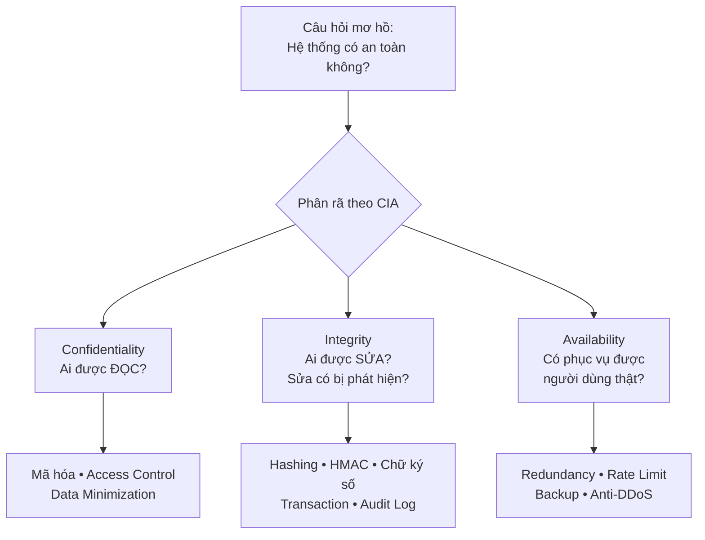
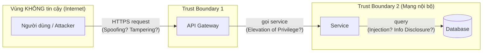
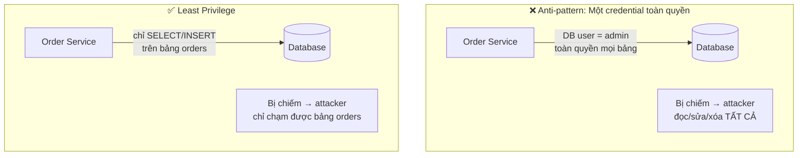
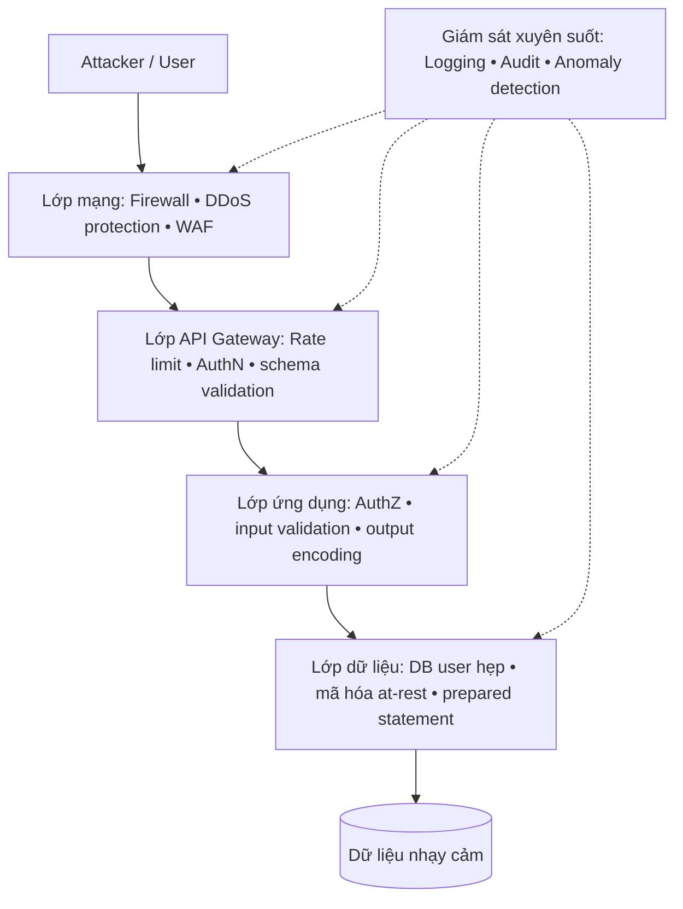
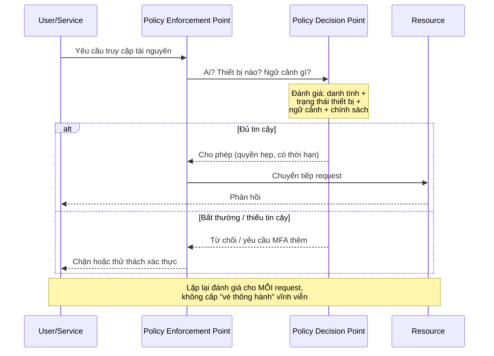
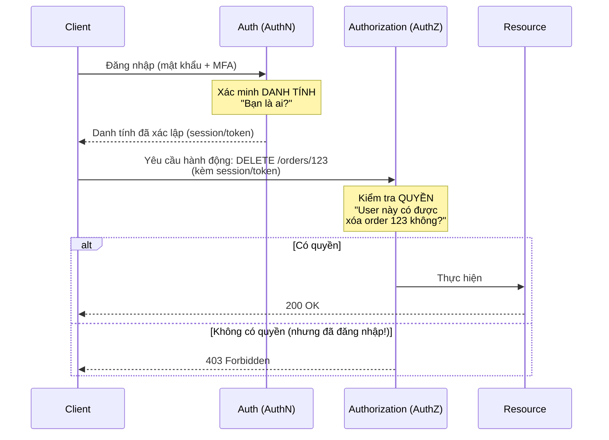

+++
title = "Backend Security — Tập 1: Security Foundations"
date = "2026-07-07T08:00:00+07:00"
draft = false
tags = ["backend", "security"]
series = ["Backend Security"]
+++

> **Đối tượng:** Backend Engineer, Senior Backend Engineer, Tech Lead, Solution Architect, Software Architect.
>
> **Cách đọc tài liệu này:** Đây không phải là một bảng tra cứu kỹ thuật. Mỗi chủ đề được trình bày theo một mạch tư duy cố định:
>
> **Asset → Threat → Attack → Vulnerability → Defense → Trade-off → Production Best Practice.**
>
> Bạn sẽ không thấy tài liệu bắt đầu bằng "X là...". Thay vào đó, mỗi phần bắt đầu bằng câu hỏi: *"Nếu không có cơ chế này thì chuyện gì xảy ra?"* — vì đó chính là cách một attacker và một architect cùng nhìn vào hệ thống.

---

## Lời mở đầu: Security không phải là một tính năng

Trước khi đi vào bất cứ khái niệm nào, hãy đóng đinh một tư tưởng nền tảng mà toàn bộ tài liệu này xoay quanh.

Đa số kỹ sư học Security theo kiểu sưu tầm: học JWT, học bcrypt, học TLS, học CORS, rồi ghép chúng lại như một danh sách "những thứ cần bật". Cách học đó tạo ra những hệ thống trông có vẻ an toàn nhưng vẫn bị đánh sập, vì nó bỏ qua câu hỏi quan trọng nhất: **ai đang tấn công, họ muốn gì, và họ sẽ đi bằng con đường nào?**

Security là một môn học về **đối thủ (adversary)**. Bạn không thiết kế bảo mật cho một thế giới ngẫu nhiên; bạn thiết kế nó chống lại một con người thông minh, có động cơ, có thời gian, và chỉ cần đúng một lỗ hổng. Đây là bất đối xứng cốt lõi của Security:

> **Người phòng thủ phải bịt đúng mọi lỗ hổng. Kẻ tấn công chỉ cần tìm ra một.**

Chính vì bất đối xứng này mà tư duy "checklist" luôn thua. Bạn không thể liệt kê hết mọi thứ cần bảo vệ nếu bạn không hiểu attacker suy nghĩ ra sao. Do đó, mọi khái niệm nền tảng dưới đây — CIA, Threat Modeling, Least Privilege, Defense in Depth, Zero Trust — thực chất chỉ là các công cụ tư duy để trả lời một câu hỏi duy nhất: *tôi đang bảo vệ tài sản gì, chống lại ai, và tôi chấp nhận đánh đổi những gì?*

---

## 1. CIA Triad — Trục tọa độ của mọi quyết định bảo mật

### 1.1. Problem Statement — Bài toán thực sự là gì

Hãy tưởng tượng bạn vận hành một hệ thống ngân hàng. Câu hỏi "hệ thống này có an toàn không?" là một câu hỏi vô nghĩa nếu không được cụ thể hóa. An toàn theo nghĩa nào?

- Số dư tài khoản của khách hàng có bị **người lạ đọc trộm** không?
- Số dư đó có bị **ai đó sửa đổi trái phép** không?
- Khi khách hàng cần rút tiền lúc 2 giờ sáng, hệ thống **có phục vụ được** không?

Ba câu hỏi này tương ứng với ba thuộc tính khác nhau, và chúng độc lập với nhau. Một hệ thống có thể chống đọc trộm rất tốt nhưng lại cho phép sửa dữ liệu tùy tiện. Một hệ thống có thể bảo vệ dữ liệu tuyệt đối bằng cách... tắt máy chủ đi (không ai đọc/sửa được gì cả), nhưng như vậy thì vô dụng.

CIA Triad ra đời để **buộc chúng ta phân rã khái niệm "an toàn" mơ hồ thành ba trục đo lường cụ thể**: Confidentiality (Bí mật), Integrity (Toàn vẹn), Availability (Sẵn sàng). Nếu không có bộ khung này, mọi cuộc thảo luận về bảo mật sẽ trôi vào cảm tính.

**Nếu không có tư duy CIA:** bạn sẽ đổ hết ngân sách bảo mật vào một trục (thường là Confidentiality — mã hóa mọi thứ) mà bỏ quên hai trục còn lại, và attacker sẽ đi vào bằng cửa bạn không canh.

### 1.2. Threat Model — Attacker nhắm vào trục nào

Mỗi trục CIA có một lớp attacker và mục tiêu riêng:

| Trục | Attacker muốn gì | Ví dụ tấn công điển hình |
|------|------------------|--------------------------|
| **Confidentiality** | Đọc được dữ liệu không thuộc về họ | Đánh cắp database, sniff traffic, IDOR, đọc log chứa PII |
| **Integrity** | Sửa dữ liệu mà không bị phát hiện | Sửa số tiền giao dịch, giả mạo token, tamper request, race condition trên số dư |
| **Availability** | Làm hệ thống ngừng phục vụ người dùng thật | DDoS, resource exhaustion, ransomware khóa dữ liệu |

Điểm mấu chốt: **ba mục tiêu này thường xung đột nhau khi thiết kế**. Ví dụ, để tăng Availability bạn nhân bản dữ liệu ra nhiều nơi — nhưng mỗi bản sao lại là một bề mặt tấn công mới cho Confidentiality.

### 1.3. Tại sao khái niệm này tồn tại

CIA có gốc từ ngành bảo mật thông tin quân sự và viễn thông những năm 1970–1980, khi người ta cần một ngôn ngữ chung để nói về "bảo vệ thông tin" mà không sa đà vào từng công nghệ cụ thể. Business problem của nó là: **lãnh đạo và kỹ sư cần một khung phân loại rủi ro để ưu tiên đầu tư**. Technical problem là: cần tách biệt các cơ chế phòng thủ (mã hóa phục vụ Confidentiality, chữ ký số phục vụ Integrity, redundancy phục vụ Availability) để không nhầm lẫn dùng sai công cụ.

### 1.4. Cách hoạt động bên trong — Ba trục, ba nhóm cơ chế

**Confidentiality** được thực thi bởi: mã hóa (at-rest, in-transit), Access Control, phân loại dữ liệu, tối thiểu hóa dữ liệu thu thập.

**Integrity** được thực thi bởi: hàm băm (hashing), Message Authentication Code (HMAC), chữ ký số, kiểm soát phiên bản, transaction ACID, và Audit Log không thể sửa (append-only).

**Availability** được thực thi bởi: redundancy, load balancing, rate limiting, auto-scaling, backup và disaster recovery, chống DDoS.

### 1.5. Trade-off

- **Security vs Availability:** Càng nhiều lớp kiểm soát (xác thực nhiều bước, kiểm tra chữ ký mọi request) thì càng dễ có điểm gãy làm gián đoạn dịch vụ. Một quy tắc WAF quá chặt có thể chặn nhầm người dùng thật.
- **Confidentiality vs Availability:** Mã hóa toàn bộ và giữ khóa cực kỳ nghiêm ngặt → nếu mất khóa, dữ liệu vĩnh viễn không đọc được (đây chính là cách ransomware phá Availability bằng cách chống lại chính Confidentiality của bạn).
- **Integrity vs Performance:** Ký và xác minh chữ ký cho mọi bản ghi tốn CPU; audit log đầy đủ tốn I/O và storage.
- **Cost & Complexity:** Đạt cả ba trục ở mức cao đòi hỏi hạ tầng đắt đỏ (multi-region, HSM, SIEM). Không hệ thống nào tối đa cả ba; bạn **chọn điểm cân bằng theo giá trị tài sản**.

### 1.6. Best Practice

Trong production, hãy **gán trọng số CIA cho từng loại dữ liệu** thay vì áp một mức bảo mật đồng nhất. Bảng phân loại dữ liệu (data classification) là điểm khởi đầu: dữ liệu thanh toán ưu tiên Integrity + Confidentiality tối đa; nội dung marketing công khai ưu tiên Availability. Với microservices, mỗi service khai báo rõ nó xử lý loại dữ liệu nào và trục CIA nào là trọng yếu, từ đó quyết định mức mã hóa, mức audit, mức redundancy tương ứng.

### 1.7. Anti-pattern

- **"Mã hóa là xong":** coi Confidentiality là toàn bộ Security, bỏ quên Integrity và Availability.
- **Availability bằng mọi giá:** tắt xác thực để "cho nhanh", mở toang hệ thống.
- **Không phân loại dữ liệu:** áp cùng một mức bảo mật cho log debug và cho dữ liệu thẻ tín dụng — vừa lãng phí, vừa hở chỗ quan trọng.

### 1.8. Production Case Study

Các vụ **ransomware** là ví dụ kinh điển cho thấy ba trục độc lập. Attacker không cần đọc dữ liệu của bạn (không phá Confidentiality theo cách cổ điển); họ **mã hóa dữ liệu của bạn bằng khóa của họ** để phá Availability, đồng thời đe dọa công bố (đánh vào Confidentiality) để tăng sức ép. Nhiều tổ chức đã đầu tư rất mạnh vào chống rò rỉ (Confidentiality) nhưng backup lại yếu, nên khi Availability bị đánh thì tê liệt hoàn toàn. Bài học: **backup offline, immutable và được kiểm thử phục hồi định kỳ** là một khoản đầu tư Availability sống còn, không phải thứ xa xỉ.

### 1.9. Troubleshooting

Khi điều tra một sự cố, hãy hỏi theo trục CIA: *Dữ liệu có bị lộ không (C)? Có bị sửa không (I)? Dịch vụ có gián đoạn không (A)?* Bộ ba câu hỏi này định hướng việc thu thập log: access log cho C, integrity/audit log cho I, và metric hệ thống (latency, error rate, saturation) cho A.

### 1.10. Khi nào KHÔNG nên nhấn mạnh trục nào

CIA là khung tư duy, không phải mục tiêu tối đa hóa. Với một trang blog tĩnh công khai, dồn tiền vào Confidentiality là lãng phí; Availability và Integrity (chống bị deface) mới đáng quan tâm. Luôn để **giá trị tài sản và mô hình mối đe dọa** quyết định trọng số, không phải phản xạ "bảo mật càng nhiều càng tốt".

---

## 2. Threat Modeling — Suy nghĩ như attacker trước khi họ xuất hiện

### 2.1. Problem Statement

Bạn vừa thiết kế xong một API cho phép người dùng tải lên avatar. Nó chạy tốt. Nhưng nó có an toàn không? Nếu bạn chỉ kiểm thử theo "happy path" (người dùng ngoan ngoãn tải ảnh JPG hợp lệ), bạn sẽ không bao giờ thấy được rằng attacker có thể tải lên một file SVG chứa JavaScript, hay một file tên `../../etc/passwd`, hay một file 10GB để làm nghẽn đĩa.

Threat Modeling giải quyết bài toán: **làm sao phát hiện lỗ hổng khi hệ thống còn trên bản vẽ, trước khi viết code, thay vì đợi bị hack rồi mới biết.** Nếu không có nó, bạn phòng thủ một cách phản ứng (reactive) — vá lỗi sau mỗi sự cố — thay vì chủ động (proactive).

### 2.2. Threat Model (về chính hoạt động threat modeling)

Đây là phần meta: attacker của bạn là ai? Threat modeling buộc bạn viết ra chân dung đối thủ thay vì tưởng tượng mơ hồ. Các nhóm attacker điển hình:

- **Script kiddie / bot tự động:** quét hàng loạt lỗ hổng đã biết, không nhắm riêng bạn. Số lượng khổng lồ, kỹ năng thấp.
- **Insider (nội bộ):** nhân viên, đối tác có quyền truy cập hợp pháp nhưng lạm dụng. Đây là nhóm nguy hiểm và hay bị bỏ quên nhất.
- **Tội phạm có tổ chức:** động cơ tài chính, kiên nhẫn, đầu tư vào phishing, ransomware, gian lận.
- **Nation-state / APT:** nguồn lực gần như vô hạn, tấn công có chủ đích, khai thác cả zero-day.

Bạn không thiết kế giống nhau cho cả bốn nhóm. Một startup e-commerce chủ yếu lo bot và tội phạm tài chính; một hệ thống chính phủ phải tính đến APT.

### 2.3. Tại sao giải pháp này tồn tại

Threat modeling được hệ thống hóa mạnh tại Microsoft cuối những năm 1990 — đầu 2000, khi họ đối mặt với làn sóng lỗ hổng nghiêm trọng và cần một quy trình lặp lại được để tìm lỗi thiết kế. Từ đó ra đời **STRIDE** (một bộ phân loại mối đe dọa) và tư duy "phân tích bề mặt tấn công có hệ thống". Business problem: chi phí vá lỗi sau khi release cao gấp nhiều lần so với sửa ở khâu thiết kế. Technical problem: cần một ngôn ngữ chung để đội dev, security và architect cùng nhìn ra rủi ro.

### 2.4. Cách hoạt động bên trong — Quy trình 4 câu hỏi + STRIDE

Threat modeling hiện đại (theo Adam Shostack) xoay quanh bốn câu hỏi:

1. **Chúng ta đang xây gì?** → Vẽ Data Flow Diagram (DFD): các thực thể, tiến trình, kho dữ liệu, và quan trọng nhất là **trust boundary** (ranh giới tin cậy — nơi dữ liệu đi từ vùng ít tin cậy sang vùng tin cậy hơn).
2. **Có thể sai ở đâu?** → Duyệt từng phần tử qua **STRIDE**.
3. **Chúng ta sẽ làm gì với nó?** → Chọn biện pháp: giảm thiểu (mitigate), loại bỏ (eliminate), chuyển giao (transfer), hoặc chấp nhận (accept) rủi ro.
4. **Chúng ta đã làm tốt chưa?** → Rà soát lại, lặp lại khi thiết kế thay đổi.

**STRIDE** là sáu loại mối đe dọa, mỗi loại phá một thuộc tính bảo mật:

| Chữ | Mối đe dọa | Phá thuộc tính | Phòng thủ tiêu biểu |
|-----|-----------|----------------|---------------------|
| **S**poofing | Giả mạo danh tính | Authentication | Xác thực mạnh, MFA, chữ ký |
| **T**ampering | Sửa đổi dữ liệu | Integrity | Hashing, HMAC, chữ ký số |
| **R**epudiation | Chối bỏ hành vi | Non-repudiation | Audit log không sửa được |
| **I**nformation Disclosure | Rò rỉ thông tin | Confidentiality | Mã hóa, Access Control |
| **D**enial of Service | Từ chối dịch vụ | Availability | Rate limit, redundancy |
| **E**levation of Privilege | Leo thang đặc quyền | Authorization | Least Privilege, kiểm soát quyền |

Mỗi mũi tên cắt qua một trust boundary chính là nơi bạn dừng lại và hỏi: dữ liệu đi qua đây có thể bị giả mạo, sửa đổi, đọc trộm không?

### 2.5. Trade-off

- **Effort vs Coverage:** Threat modeling đầy đủ tốn thời gian của những người đắt giá nhất (senior/architect). Làm quá chi tiết cho mọi thay đổi nhỏ sẽ làm chậm nhịp phát triển.
- **Developer Experience:** Nếu biến nó thành thủ tục giấy tờ nặng nề, đội dev sẽ né tránh. Cần giữ nó nhẹ, tích hợp vào design review.
- **Scalability:** Không thể model thủ công mọi service trong hệ thống hàng trăm microservices; cần chuẩn hóa mẫu (threat model template) và tập trung vào các thay đổi chạm vào trust boundary hoặc dữ liệu nhạy cảm.

### 2.6. Best Practice

Thực hiện threat modeling ở **giai đoạn thiết kế**, không phải sau khi code xong. Gắn nó vào quy trình như một phần của design doc: bất kỳ tính năng nào thêm một trust boundary mới, xử lý PII, hay thay đổi mô hình phân quyền đều phải kèm một mục threat model ngắn. Với microservices, duy trì một "threat model mẫu" cho các pattern lặp lại (service gọi service, service đọc secret, service nhận webhook ngoài) để không phải làm lại từ đầu mỗi lần.

### 2.7. Anti-pattern

- **Chỉ test happy path:** kiểm thử như thể mọi input đều thiện chí.
- **Threat model một lần rồi bỏ:** làm lúc kickoff rồi không bao giờ cập nhật khi kiến trúc đổi.
- **Bỏ quên insider và Repudiation:** chỉ lo attacker ngoài mạng, quên mất nhân viên có quyền và nhu cầu chứng minh "ai đã làm gì".
- **"Chúng ta còn nhỏ, chưa ai thèm hack":** bot tự động không phân biệt lớn nhỏ.

### 2.8. Production Case Study

Rất nhiều vụ lộ dữ liệu qua **IDOR** (Insecure Direct Object Reference) bắt nguồn từ việc thiếu threat modeling ở khâu thiết kế API. Một endpoint dạng `GET /api/orders/{id}` được test kỹ với đúng người dùng sở hữu đơn hàng, và chạy hoàn hảo. Nhưng không ai đặt câu hỏi STRIDE "Elevation of Privilege": *chuyện gì xảy ra nếu người dùng A đổi `{id}` thành đơn hàng của người dùng B?* Vì backend chỉ kiểm tra "đã đăng nhập chưa" mà không kiểm tra "có sở hữu tài nguyên này không", attacker chỉ cần tăng dần ID để rút toàn bộ dữ liệu. Một buổi threat modeling 30 phút với câu hỏi "E" của STRIDE sẽ phát hiện lỗ hổng này trước khi một dòng code được viết.

### 2.9. Troubleshooting

Threat model không có "log" theo nghĩa runtime, nhưng bạn nên **lưu vết quyết định**: mỗi mối đe dọa được nhận diện, biện pháp đã chọn, và lý do chấp nhận rủi ro (nếu có). Khi sự cố xảy ra, tài liệu này giúp trả lời "chúng ta có lường trước tình huống này không, và tại sao quyết định như vậy" — cực kỳ quan trọng cho post-mortem và cho việc cải thiện quy trình.

### 2.10. Khi nào KHÔNG cần threat model nặng

Với một script nội bộ chạy một lần, một prototype ném đi, hoặc thay đổi thuần túy cosmetic không chạm dữ liệu/quyền, threat modeling đầy đủ là thừa. Áp dụng nguyên tắc tương xứng: **độ sâu của threat model tỷ lệ với giá trị tài sản và mức độ chạm vào trust boundary.**

---

## 3. Principle of Least Privilege — Tối thiểu hóa bán kính vụ nổ

### 3.1. Problem Statement

Giả định thực tế nhất trong security: **sớm muộn cũng có một thành phần bị chiếm quyền.** Một service bị RCE, một API key bị lộ trên GitHub, một nhân viên bị phishing. Câu hỏi không phải "làm sao để không bao giờ bị", mà là "**khi một thứ bị chiếm, attacker làm được bao nhiêu?**"

Least Privilege trả lời câu hỏi đó: mỗi chủ thể (user, service, process, token) chỉ được cấp **đúng và đủ** quyền cần thiết để làm việc của nó, không hơn. Nếu một service chỉ cần đọc bảng `products`, nó không nên có quyền `DROP TABLE` hay đọc bảng `users`.

**Nếu không có Least Privilege:** một lỗ hổng nhỏ ở rìa hệ thống biến thành thảm họa toàn diện, vì credential bị chiếm có quyền truy cập mọi thứ.

### 3.2. Threat Model

Attacker sau khi có được một chỗ đứng ban đầu (initial foothold) luôn tìm cách **lateral movement** (di chuyển ngang) và **privilege escalation** (leo thang đặc quyền). Least Privilege trực tiếp làm hai việc này trở nên đắt đỏ và ồn ào:

- Nếu credential họ chiếm được chỉ có quyền hẹp, họ phải tìm thêm nhiều lỗ hổng để mở rộng → nhiều cơ hội để bạn phát hiện.
- Mỗi lần họ chạm vào thứ ngoài phạm vi quyền → sinh ra lỗi "access denied" trong log → tín hiệu phát hiện xâm nhập.

### 3.3. Tại sao nguyên tắc này tồn tại

Least Privilege được Saltzer và Schroeder nêu ra trong bài báo kinh điển năm 1975 "The Protection of Information in Computer Systems" như một trong tám nguyên tắc thiết kế bảo mật. Business problem cốt lõi: **tổ chức không thể ngăn 100% sự cố, nên phải giới hạn thiệt hại của mỗi sự cố.** Technical problem: hệ thống mặc định thường cấp quyền rộng cho tiện lợi (root, admin, `*` permission), và sự tiện lợi đó chính là món quà cho attacker.

### 3.4. Cách hoạt động bên trong

Least Privilege được hiện thực qua nhiều tầng:

- **Con người:** RBAC (Role-Based Access Control), ABAC, Just-In-Time access (cấp quyền tạm thời, tự thu hồi), tách biệt tài khoản admin và tài khoản thường.
- **Service/machine:** IAM roles hẹp, service account riêng cho từng service, scope hẹp cho token, network policy chỉ cho phép các luồng giao tiếp cần thiết.
- **Database:** user DB riêng cho mỗi service, chỉ cấp đúng quyền trên đúng bảng, tách read-replica cho tác vụ chỉ đọc.
- **Process/OS:** không chạy service dưới quyền root, dùng capability tối thiểu, container không privileged, filesystem read-only khi có thể.

### 3.5. Trade-off

- **Security vs Developer Experience:** Quyền hẹp nghĩa là dev thường xuyên gặp "permission denied" và phải xin cấp quyền. Làm quá cứng → dev tìm cách lách (dùng chung tài khoản admin cho nhanh), phản tác dụng.
- **Complexity:** Quản lý hàng trăm role và policy hẹp là gánh nặng vận hành; dễ sinh ra "permission sprawl" (quyền phình ra không kiểm soát).
- **Performance:** Gần như không ảnh hưởng — đây là một trong số ít nguyên tắc bảo mật gần như "free" về hiệu năng.
- **Cost:** Chi phí chủ yếu là con người và công cụ quản trị (IAM, access review định kỳ).

### 3.6. Best Practice

Mặc định **deny-all, cấp thêm khi cần** (allowlist thay vì blocklist). Với cloud, mỗi workload có một IAM role riêng, scope tài nguyên cụ thể (ARN/resource cụ thể, không dùng `*`). Áp dụng **Just-In-Time và Time-boxed access** cho thao tác nhạy cảm: quyền production được cấp tạm trong 1 giờ và tự hết hạn. Định kỳ chạy **access review** để thu hồi quyền không còn dùng (đặc biệt quan trọng khi nhân viên đổi vai trò — "privilege creep"). Với service-to-service, dùng danh tính workload (SPIFFE/mTLS) thay vì credential dùng chung.

### 3.7. Anti-pattern

- **Dùng root/admin cho mọi thứ vì "cho nhanh".**
- **Wildcard permission** (`s3:*`, `Resource: *`) trong policy.
- **Một service account dùng chung cho toàn bộ hệ thống.**
- **Không bao giờ thu hồi quyền:** nhân viên tích lũy quyền qua nhiều dự án (privilege creep).
- **Container chạy privileged / process chạy root** khi không cần.

### 3.8. Production Case Study

Nhiều vụ rò rỉ dữ liệu quy mô lớn khởi đầu từ **một credential bị lộ có quyền quá rộng**. Mô-típ lặp lại: một access key được commit nhầm vào repo public, và thay vì chỉ có quyền hẹp trên một bucket, nó lại có quyền admin trên toàn bộ tài khoản cloud. Attacker quét GitHub tự động (điều này diễn ra trong vài phút sau khi commit), tìm thấy key, và vì key toàn quyền nên họ liệt kê và tải xuống toàn bộ dữ liệu. Nếu key đó tuân thủ Least Privilege — chỉ đọc đúng một bucket không nhạy cảm — thiệt hại đã gần như bằng không. Bài học kép: **secret sẽ bị lộ (nên có cả secret scanning + rotation), và khi lộ, phạm vi quyền quyết định mức thiệt hại.**

### 3.9. Troubleshooting

Least Privilege sinh ra một tín hiệu vận hành quý giá: **access-denied event**. Hãy log và giám sát chúng. Một đợt tăng đột biến các lỗi "permission denied" từ một service có thể nghĩa là (a) cấu hình quyền thiếu — cần sửa, hoặc (b) service đã bị chiếm và attacker đang dò tìm. Đừng "sửa" bằng cách nới quyền rộng ra cho hết lỗi; hãy cấp đúng quyền còn thiếu. Công cụ như IAM Access Analyzer giúp phát hiện quyền được cấp nhưng chưa từng dùng — ứng viên để thu hồi.

### 3.10. Khi nào KHÔNG áp dụng cực đoan

Least Privilege gần như luôn đúng, nhưng đừng cực đoan hóa đến mức tê liệt vận hành. Trong tình huống khẩn cấp (incident response lúc 3 giờ sáng), cần có **break-glass account** — tài khoản quyền cao được niêm phong, chỉ mở khi khẩn cấp, và mọi thao tác đều bị audit gắt gao. Việc chối bỏ hoàn toàn mọi quyền cao trong mọi hoàn cảnh có thể khiến bạn không thể cứu hệ thống khi cần. Giải pháp không phải bỏ nguyên tắc, mà là **kiểm soát ngoại lệ chặt chẽ**.

---

## 4. Defense in Depth — Nhiều lớp, không lớp nào được phép là điểm chết

### 4.1. Problem Statement

Mọi biện pháp bảo mật đơn lẻ đều có thể thất bại: WAF có thể bị bypass, một thư viện có thể có zero-day, một lập trình viên có thể viết sai một câu lệnh validate. Nếu toàn bộ an toàn của hệ thống phụ thuộc vào **một** lớp phòng thủ, thì ngày lớp đó thủng cũng là ngày hệ thống sụp.

Defense in Depth giải quyết bài toán: **làm sao để không có điểm thất bại đơn (single point of failure) về mặt bảo mật.** Ý tưởng: xếp nhiều lớp phòng thủ độc lập, sao cho attacker phải xuyên thủng tất cả mới đạt được mục tiêu, và mỗi lớp là một cơ hội để phát hiện họ.

**Nếu không có Defense in Depth:** một lỗ hổng đơn = toàn thắng cho attacker.

### 4.2. Threat Model

Attacker luôn tìm con đường ít kháng cự nhất. Với một lớp phòng thủ duy nhất, họ chỉ cần một kỹ thuật bypass. Với nhiều lớp, chi phí tấn công tăng theo cấp số nhân, và quan trọng hơn: **thời gian họ ở trong hệ thống (dwell time) tăng lên**, cho bạn nhiều cơ hội phát hiện. Defense in Depth chuyển bài toán từ "ngăn chặn tuyệt đối" (bất khả thi) sang "tăng chi phí và tăng khả năng phát hiện" (khả thi).

### 4.3. Tại sao chiến lược này tồn tại

Khái niệm mượn từ quân sự: một tòa thành không chỉ có một bức tường, mà có hào nước, tường ngoài, tường trong, tháp canh. Trong CNTT, nó trở thành nguyên tắc nền tảng vì thực tế cay đắng rằng **mọi kiểm soát đơn lẻ đều có tỷ lệ thất bại khác 0**. Business problem: rủi ro tổng phải được kéo xuống mức chấp nhận được, và cách toán học để làm điều đó là nhân các xác suất thất bại độc lập với nhau.

### 4.4. Cách hoạt động bên trong — Các lớp điển hình

Một request đi từ Internet đến dữ liệu nhạy cảm nên đi qua nhiều lớp độc lập:

Điểm cốt yếu: các lớp phải **độc lập về cơ chế**. Nếu WAF và ứng dụng cùng dựa trên một thư viện parse lỗi, chúng không thực sự là hai lớp — chúng thủng cùng lúc. Ví dụ tốt: dù attacker bypass được WAF (lớp 1), thì prepared statement ở lớp dữ liệu (lớp 4) vẫn chặn được SQL Injection.

### 4.5. Trade-off

- **Security vs Performance:** Mỗi lớp thêm độ trễ (WAF inspect, mã hóa, validate). Với hệ thống latency-nhạy, cần đo và đặt lớp đúng chỗ.
- **Complexity & Cost:** Nhiều lớp = nhiều thứ để cấu hình, vận hành, và có thể cấu hình sai. Nghịch lý: thêm lớp để an toàn hơn nhưng mỗi lớp lại là một bề mặt lỗi cấu hình mới.
- **Developer Experience:** Nhiều lớp kiểm soát có thể làm việc debug khó hơn ("request của tôi bị chặn ở đâu, ở lớp nào?").
- **Diminishing returns:** Lớp thứ mười thường thêm rất ít an toàn so với chi phí vận hành nó.

### 4.6. Best Practice

Đặt các lớp sao cho chúng **thực sự độc lập** và mỗi lớp bảo vệ một giả định khác nhau. Nguyên tắc "**không tin lớp trước**": lớp ứng dụng vẫn validate input dù đã có WAF; DB vẫn dùng prepared statement dù ứng dụng đã validate. Kết hợp Defense in Depth với **fail securely** (khi một lớp lỗi, nó phải fail ở trạng thái từ chối, không phải mở toang). Và luôn có **lớp giám sát cắt ngang** (logging, audit, alerting) để mỗi lớp bị xuyên thủng đều để lại dấu vết.

### 4.7. Anti-pattern

- **"Chúng ta có WAF rồi, khỏi cần validate trong code":** biến nhiều-lớp-trên-giấy thành một-lớp-thực-tế.
- **Các lớp phụ thuộc lẫn nhau:** cùng thư viện, cùng cấu hình, thủng cùng lúc.
- **Perimeter-only security:** tường ngoài rất dày, nhưng bên trong mạng thì "phẳng" và tin nhau tuyệt đối — một khi vào được là đi khắp nơi (đây chính là lý do Zero Trust ra đời, mục 5).
- **Fail open:** khi lớp xác thực gặp lỗi, hệ thống "cho qua" để tránh gián đoạn.

### 4.8. Production Case Study

Mô-típ "**vỏ cứng, ruột mềm**" (hard shell, soft center) là bài học đắt giá lặp lại trong nhiều vụ xâm nhập lớn. Attacker vượt qua lớp phòng thủ ngoài (thường qua phishing một nhân viên hoặc một máy chủ rìa bị lỗi), và phát hiện rằng **bên trong mạng nội bộ mọi thứ đều tin nhau**: không phân đoạn mạng, service gọi nhau không xác thực, database chấp nhận kết nối từ bất kỳ máy nội bộ nào. Từ một máy bị chiếm, họ di chuyển ngang thoải mái đến kho dữ liệu. Nếu có phân đoạn mạng, xác thực service-to-service, và quyền hẹp ở mỗi chặng, cuộc di chuyển ngang đó đã bị chặn hoặc ít nhất phát ra tín hiệu báo động ở từng lớp.

### 4.9. Troubleshooting

Thách thức vận hành của Defense in Depth là **truy vết một request qua nhiều lớp**. Hãy dùng **correlation ID / trace ID** xuyên suốt: mỗi lớp (WAF, gateway, app, DB) log cùng một request ID để bạn tái dựng được đường đi và biết chính xác lớp nào chặn/cho qua. Thiếu điều này, mỗi lỗi 403 trở thành một cuộc điều tra riêng lẻ trên nhiều hệ thống rời rạc.

### 4.10. Khi nào KHÔNG chồng thêm lớp

Khi lớp mới không độc lập với lớp cũ, hoặc chi phí vận hành/độ trễ của nó vượt xa mức rủi ro nó giảm được, thì thêm lớp là phản tác dụng — bạn chỉ tăng bề mặt cấu hình sai. Với dữ liệu công khai giá trị thấp, một hoặc hai lớp là đủ. Defense in Depth là về **độ sâu tương xứng với giá trị tài sản**, không phải chồng lớp vô hạn.

---

## 5. Zero Trust — "Never trust, always verify"

### 5.1. Problem Statement

Mô hình bảo mật truyền thống dựa trên **chu vi (perimeter)**: dựng một bức tường lửa quanh mạng công ty, ai ở trong tường là "được tin", ai ở ngoài là "không tin". Mô hình này sụp đổ trong thế giới hiện đại vì:

- Nhân viên làm việc từ xa, từ quán cà phê, từ thiết bị cá nhân — "trong tường" không còn nghĩa lý gì.
- Ứng dụng chạy trên cloud, SaaS, multi-cloud — không còn một "bên trong" rõ ràng.
- Khi attacker vượt được tường (chỉ cần một phishing thành công), họ được tin tưởng như người nhà và tự do đi lại.

Zero Trust giải quyết bài toán: **loại bỏ khái niệm "vùng mạng đáng tin".** Mọi truy cập — dù từ trong hay ngoài — đều phải được xác thực, ủy quyền và kiểm tra ngữ cảnh, mỗi lần.

### 5.2. Threat Model

Zero Trust được thiết kế đặc biệt chống lại **lateral movement** — điểm yếu chí mạng của mô hình perimeter. Giả định cốt lõi của nó: **"assume breach"** — hãy cho rằng attacker đã ở bên trong mạng của bạn. Với giả định đó, việc "tin tưởng vì cùng mạng nội bộ" là tự sát. Attacker mà Zero Trust nhắm tới: kẻ đã có foothold và đang tìm cách mở rộng; insider lạm quyền; credential bị đánh cắp được dùng từ vị trí/thiết bị bất thường.

### 5.3. Tại sao mô hình này tồn tại

Thuật ngữ do John Kindervag (Forrester) đặt ra khoảng 2010. Google triển khai nội bộ dưới tên **BeyondCorp** sau các cuộc tấn công có chủ đích, chứng minh rằng có thể vận hành doanh nghiệp lớn mà không cần VPN/perimeter truyền thống. NIST sau đó chuẩn hóa trong SP 800-207. Business problem: lực lượng lao động phân tán + cloud khiến chu vi mạng tan biến. Technical problem: cần dời điểm ra quyết định tin cậy từ "vị trí mạng" sang "danh tính + ngữ cảnh + trạng thái thiết bị", được đánh giá liên tục.

### 5.4. Cách hoạt động bên trong

Zero Trust dựa trên vài trụ cột:

- **Xác minh danh tính mạnh** cho mọi chủ thể (người và máy), mỗi request, không dựa vào vị trí mạng.
- **Đánh giá ngữ cảnh động:** thiết bị có được quản lý và vá đầy đủ không? vị trí, thời điểm, hành vi có bất thường không? → quyết định cho phép / từ chối / yêu cầu thêm xác thực.
- **Micro-segmentation:** chia mạng thành các vùng nhỏ, mỗi luồng giao tiếp giữa các vùng phải được cho phép tường minh.
- **Least Privilege + Just-In-Time:** quyền hẹp và tạm thời.
- **Giám sát liên tục:** tin cậy không phải trạng thái vĩnh viễn; nó được đánh giá lại liên tục.

### 5.5. Trade-off

- **Security vs Developer/User Experience:** Xác minh liên tục có thể gây ma sát (đăng nhập lại, MFA thường xuyên). Làm không khéo → người dùng khó chịu, tìm cách lách.
- **Complexity & Cost:** Cần hạ tầng danh tính mạnh, quản lý thiết bị, policy engine, telemetry. Đây là một chuyển đổi kiến trúc lớn, không phải một sản phẩm mua về cắm là chạy.
- **Performance:** Mỗi request phát sinh chi phí đánh giá chính sách; cần cache quyết định hợp lý để không giết latency.
- **Migration:** Chuyển từ perimeter sang Zero Trust là hành trình nhiều năm với hệ thống legacy.

### 5.6. Best Practice

Tiếp cận Zero Trust như một **hành trình tăng dần**, không phải một cú nhảy. Bắt đầu từ những tài sản giá trị cao nhất: đặt xác thực mạnh + đánh giá thiết bị trước chúng. Với service-to-service, dùng **mTLS + danh tính workload (SPIFFE/SPIRE)** thay cho "tin nhau vì cùng VPC". Áp dụng **phân đoạn mạng** để một service bị chiếm không thấy được toàn bộ mạng. Đưa tín hiệu thiết bị và hành vi vào quyết định truy cập (adaptive/step-up authentication: chỉ yêu cầu MFA thêm khi ngữ cảnh bất thường), để cân bằng an toàn và trải nghiệm.

### 5.7. Anti-pattern

- **"Mua một sản phẩm Zero Trust":** coi nó là công nghệ đóng hộp thay vì một triết lý kiến trúc.
- **Mạng nội bộ phẳng, tin nhau tuyệt đối:** đúng thứ Zero Trust ra đời để xóa bỏ.
- **VPN = Zero Trust:** VPN chỉ mở rộng chu vi, không loại bỏ khái niệm tin-cậy-theo-vị-trí.
- **Xác thực một lần rồi tin mãi:** cấp một token sống rất lâu với quyền rộng, phản bội tinh thần "verify continuously".

### 5.8. Production Case Study

**BeyondCorp** của Google là case study nền tảng. Sau khi bị tấn công có chủ đích, Google kết luận rằng dựa vào mạng nội bộ đáng tin là sai lầm. Họ dời toàn bộ kiểm soát truy cập ra khỏi biên mạng: mọi truy cập ứng dụng nội bộ đều đi qua một access proxy đánh giá danh tính người dùng và trạng thái thiết bị, bất kể nhân viên ngồi trong văn phòng hay ở nhà. Kết quả: bỏ được VPN truyền thống, và một thiết bị/mạng bị chiếm không còn tự động cấp quyền truy cập ứng dụng. Bài học cho backend engineer: **đừng bao giờ để "request đến từ IP nội bộ" trở thành cơ sở tin cậy** — hãy xác thực và ủy quyền như thể request luôn đến từ Internet.

### 5.9. Troubleshooting

Khi debug từ chối truy cập trong Zero Trust, câu hỏi không chỉ là "user này có quyền không" mà là "**tại thời điểm đó, với thiết bị/ngữ cảnh đó, chính sách quyết định thế nào**". Do đó, policy engine phải log **lý do quyết định** (decision reason): thiếu quyền? thiết bị chưa được quản lý? vị trí bất thường? MFA hết hạn? Log ngữ cảnh đầy đủ là điều kiện bắt buộc để vận hành Zero Trust, nếu không mọi từ chối trở thành hộp đen.

### 5.10. Khi nào KHÔNG (chưa) nên Zero Trust toàn diện

Với một hệ thống nhỏ, một team ít người, hoặc giai đoạn đầu của sản phẩm, triển khai Zero Trust đầy đủ có thể là quá tải về chi phí và độ phức tạp so với rủi ro thực tế. Điều đó không có nghĩa bỏ qua các nguyên lý của nó — bạn vẫn nên xác thực service-to-service và không tin mạng nội bộ mù quáng — mà là **áp dụng tương xứng**: lấy các nguyên tắc cốt lõi (verify mọi truy cập, least privilege, assume breach) mà chưa cần toàn bộ bộ máy policy engine và device management đắt đỏ.

---

## 6. Authentication vs Authorization — Hai câu hỏi khác nhau, hay bị nhầm thành một

### 6.1. Problem Statement

Hai từ tiếng Anh gần giống nhau (Authentication / Authorization), thường viết tắt lẫn lộn (AuthN / AuthZ), và bị nhầm lẫn thường xuyên đến mức đây là **một trong những nguồn lỗ hổng bảo mật phổ biến nhất trong thực tế**. Chúng trả lời hai câu hỏi hoàn toàn khác nhau:

- **Authentication (AuthN) — "Bạn là ai?"** Xác minh danh tính. Chứng minh rằng bạn đúng là người/chủ thể mà bạn tuyên bố.
- **Authorization (AuthZ) — "Bạn được phép làm gì?"** Sau khi biết bạn là ai, quyết định bạn có quyền thực hiện hành động cụ thể lên tài nguyên cụ thể hay không.

Bài toán: nếu lẫn lộn hai khái niệm, bạn sẽ xây hệ thống chỉ hỏi "bạn là ai" rồi cho làm mọi thứ — hoặc kiểm tra quyền dựa trên thông tin danh tính không đáng tin. Cả hai đều dẫn tới lỗ hổng nghiêm trọng.

### 6.2. Threat Model

Nhầm lẫn AuthN/AuthZ tạo ra hai lớp lỗ hổng:

- **Chỉ có AuthN, thiếu AuthZ:** hệ thống xác thực người dùng đăng nhập, nhưng sau đó không kiểm tra quyền trên từng tài nguyên. Đây chính là **Broken Access Control** (hạng #1 trong OWASP Top 10) — điển hình là IDOR: user A đăng nhập hợp lệ (AuthN pass) rồi truy cập dữ liệu của user B vì backend quên hỏi "A có được xem cái này không" (AuthZ fail).
- **AuthZ dựa trên dữ liệu do client kiểm soát:** kiểm tra quyền dựa trên field trong request mà attacker có thể sửa (ví dụ tin vào `role=admin` gửi từ client). Đây là privilege escalation.

### 6.3. Tại sao sự phân biệt này tồn tại

Sự tách bạch này có gốc từ lý thuyết kiểm soát truy cập (access control) từ những năm 1970. Lý do nó tồn tại rất căn bản: **biết danh tính không đồng nghĩa với có quyền.** Trong đời thực cũng vậy — hộ chiếu chứng minh bạn là ai (AuthN), nhưng visa mới quyết định bạn được vào nước nào (AuthZ). Hai chức năng này thay đổi độc lập: danh tính của bạn cố định, nhưng quyền của bạn thay đổi theo vai trò, ngữ cảnh, thời điểm.

### 6.4. Cách hoạt động bên trong

**Authentication** trả lời "bạn là ai" bằng cách kiểm tra một hoặc nhiều **yếu tố (factor)**:
- Điều bạn *biết* (mật khẩu, PIN).
- Điều bạn *có* (điện thoại, security key, token).
- Điều bạn *là* (vân tay, khuôn mặt — sinh trắc).

Kết hợp nhiều yếu tố = **MFA (Multi-Factor Authentication)**. Kết quả của AuthN là một **danh tính đã được xác lập** (thường mang theo dưới dạng session hoặc token).

**Authorization** nhận danh tính đã xác lập đó và áp **chính sách quyền** lên nó. Các mô hình chính:
- **RBAC** (Role-Based): gán quyền theo vai trò (admin, editor, viewer).
- **ABAC** (Attribute-Based): quyết định theo thuộc tính (phòng ban, độ nhạy dữ liệu, thời gian, vị trí).
- **ReBAC** (Relationship-Based): quyết định theo quan hệ ("bạn là chủ sở hữu tài nguyên này").

Lưu ý phân biệt mã lỗi HTTP: **401 Unauthorized** thực chất là lỗi *Authentication* ("chưa biết bạn là ai / chứng thực sai"); **403 Forbidden** là lỗi *Authorization* ("biết bạn là ai rồi, nhưng bạn không được phép"). Cách đặt tên của chuẩn HTTP hơi ngược đời và chính nó cũng góp phần gây nhầm lẫn.

### 6.5. Trade-off

- **AuthN — Security vs UX:** MFA tăng an toàn nhưng thêm ma sát đăng nhập. Adaptive auth (chỉ thử thách khi rủi ro cao) là cách cân bằng.
- **AuthZ — Complexity vs Flexibility:** RBAC đơn giản nhưng cứng nhắc, dễ "role explosion" (bùng nổ số vai trò). ABAC/ReBAC linh hoạt hơn nhưng phức tạp để hiện thực và kiểm toán.
- **Performance:** Kiểm tra quyền chi tiết (fine-grained) trên mỗi request tốn công, đặc biệt ReBAC cần truy vấn đồ thị quan hệ; cần cache và thiết kế cẩn thận.
- **Centralized vs Distributed AuthZ:** tập trung (một service quyết định quyền) dễ kiểm toán nhưng thành nút cổ chai; phân tán (mỗi service tự quyết) nhanh nhưng dễ lệch chính sách.

### 6.6. Best Practice

Luôn thực hiện **AuthZ ở phía server, trên mỗi request, cho mỗi tài nguyên**, và dựa trên danh tính đã được xác lập một cách đáng tin (từ session/token đã xác minh), tuyệt đối không dựa trên field do client gửi. Áp dụng **default-deny**. Với AuthN, tách bạch rõ khỏi AuthZ trong code (đừng để logic "user là ai" trộn lẫn với "user được làm gì"). Trong microservices, thường tách AuthN ra biên (API Gateway xác thực token) nhưng **AuthZ chi tiết nên gần business logic** — vì chỉ service sở hữu dữ liệu mới biết rõ quan hệ sở hữu. Xem xét dùng một **policy engine** (như OPA) để tập trung logic phân quyền, tách khỏi code nghiệp vụ.

### 6.7. Anti-pattern

- **Xác thực xong = cho làm mọi thứ:** không kiểm tra quyền per-resource → IDOR/Broken Access Control.
- **Tin dữ liệu client cho quyết định quyền:** `if request.body.role == "admin"` — attacker chỉ cần sửa body.
- **Kiểm tra quyền ở frontend, không ở backend:** ẩn nút "Delete" trên UI nhưng API vẫn cho gọi.
- **Trộn AuthN và AuthZ thành một khối logic** khó kiểm toán, dễ để lọt trường hợp.
- **"Confused deputy":** một service đặc quyền thực hiện hành động thay client mà không kiểm tra client có quyền hay không.

### 6.8. Production Case Study

**Broken Access Control** đứng đầu OWASP Top 10 2021 chính vì lỗi AuthN/AuthZ này phổ biến đến mức nào. Mô-típ điển hình trong các API: developer bảo vệ endpoint bằng middleware xác thực ("phải đăng nhập"), thấy nó chặn được người lạ, và tin rằng đã "bảo mật xong". Nhưng họ quên tầng thứ hai: kiểm tra rằng người dùng *đã đăng nhập này* có được phép truy cập *đúng bản ghi này*. Kết quả là bất kỳ người dùng hợp lệ nào cũng đọc/sửa được dữ liệu của người khác chỉ bằng cách đổi ID trong URL. Nguyên nhân gốc luôn là cùng một sự nhầm lẫn: **coi Authentication là đủ, trong khi thứ còn thiếu là Authorization ở mức tài nguyên.** Cách phòng tránh: mọi truy cập tài nguyên đều phải qua một bước kiểm tra "chủ thể X có quyền hành động Y trên tài nguyên Z không", đặt gần lớp dữ liệu để không thể bị bỏ sót.

### 6.9. Troubleshooting

Khi gỡ lỗi truy cập, phân biệt rạch ròi hai trục qua mã lỗi và log: nếu là **401**, vấn đề nằm ở AuthN (token hết hạn, chữ ký sai, thiếu credential) — kiểm tra luồng xác thực. Nếu là **403**, AuthN đã ổn, vấn đề ở AuthZ (thiếu role, không sở hữu tài nguyên, chính sách từ chối) — kiểm tra policy. Log của cả hai nên ghi rõ **chủ thể (subject), hành động (action), tài nguyên (resource) và quyết định (decision + reason)**. Đây cũng chính là các trường bạn cần cho audit log phục vụ điều tra sau sự cố.

### 6.10. Khi nào ranh giới mờ đi

Trong một số kiến trúc hiện đại (đặc biệt token-based, xem Tập 2), thông tin ủy quyền (scopes, roles, claims) được nhúng ngay vào token do bước AuthN cấp ra. Điều này khiến ranh giới AuthN/AuthZ trông như hòa vào nhau, nhưng về mặt khái niệm chúng vẫn tách biệt: token *mang theo* thông tin ủy quyền, nhưng **quyết định cho phép hay không vẫn là một bước AuthZ riêng** mà server phải thực hiện. Đừng để sự tiện lợi của "claims trong token" khiến bạn bỏ qua bước kiểm tra quyền thực sự ở phía server — token nói bạn *tuyên bố* có quyền gì, server vẫn phải *quyết định* có chấp nhận hay không.

---

## Tổng kết Tập 1 — Sáu nguyên tắc, một tư duy

Sáu chủ đề nền tảng này không phải sáu công nghệ để "bật lên". Chúng là sáu góc nhìn của cùng một tư duy phòng thủ:

- **CIA Triad** cho bạn *trục tọa độ* để định nghĩa "an toàn" nghĩa là gì với từng tài sản.
- **Threat Modeling** cho bạn *phương pháp* nhìn hệ thống qua con mắt attacker, ngay từ bản vẽ.
- **Least Privilege** *giới hạn thiệt hại* khi (chứ không phải nếu) một thành phần bị chiếm.
- **Defense in Depth** đảm bảo *không lớp nào là điểm chết duy nhất*.
- **Zero Trust** *xóa bỏ giả định tin cậy theo vị trí* — thứ đã lỗi thời trong thế giới cloud và làm việc từ xa.
- **AuthN vs AuthZ** *tách bạch "bạn là ai" khỏi "bạn được làm gì"* — ranh giới mà việc nhầm lẫn nó gây ra lỗ hổng phổ biến nhất thực tế.

Xuyên suốt cả sáu là một sợi chỉ đỏ: **giả định rằng mọi thứ sẽ thất bại — credential sẽ lộ, lớp phòng thủ sẽ thủng, mạng nội bộ sẽ bị xâm nhập — và thiết kế sao cho hệ thống vẫn giới hạn được thiệt hại và phát hiện được kẻ tấn công.** Đó là khác biệt giữa một hệ thống "trông có vẻ bảo mật" và một hệ thống *thực sự* chịu được va đập trong production.

Tập tiếp theo (**Tập 2: Authentication**) sẽ áp đúng tư duy này để đi từ First Principles qua Basic Auth → Session → Cookie → Token → JWT → OAuth2 → OpenID Connect, trả lời từng câu hỏi "vì sao cơ chế này xuất hiện, nó giải quyết được gì, và nó *không* giải quyết được gì".
