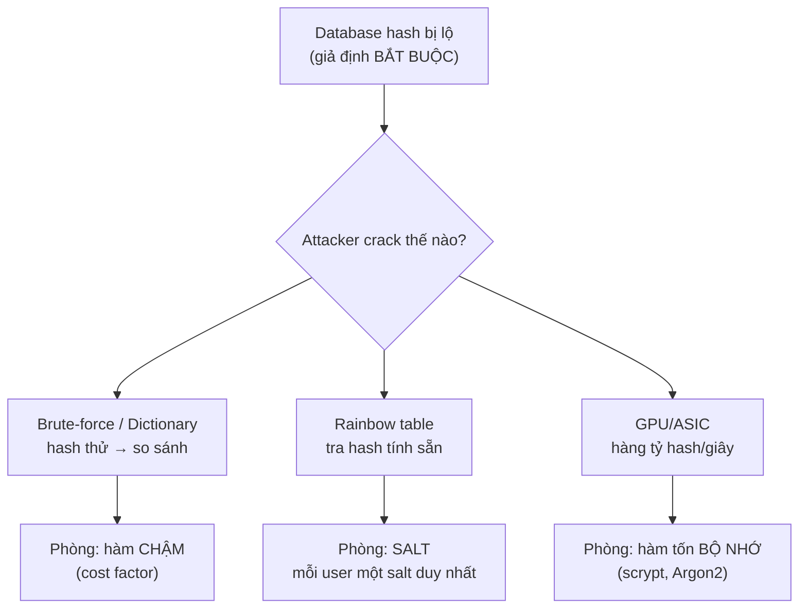
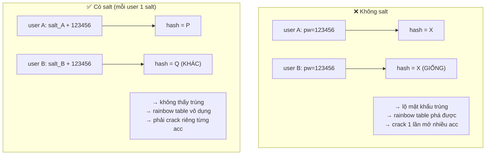
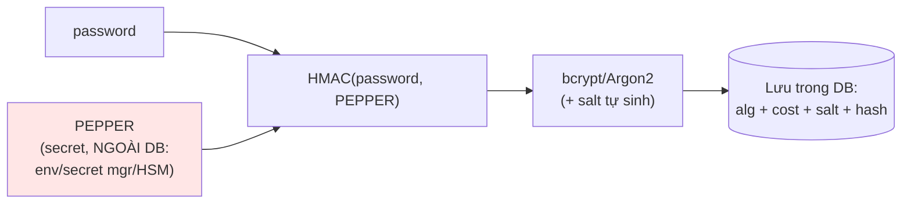
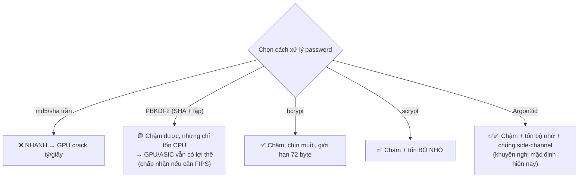
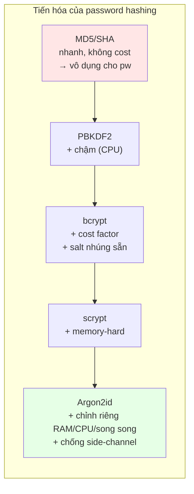

+++
title = "Backend Security — Tập 3: Password Security"
date = "2026-07-07T10:00:00+07:00"
draft = false
tags = ["backend", "security"]
series = ["Backend Security"]
+++

> **Đối tượng:** Backend Engineer, Senior Backend Engineer, Tech Lead, Solution Architect, Software Architect.
>
> **Mạch tư duy:** Asset → Threat → Attack → Vulnerability → Defense → Trade-off → Production Best Practice.
>
> Tập này trả lời những câu hỏi cốt lõi mà mọi backend engineer *phải* nắm: vì sao MD5 không còn an toàn, vì sao SHA — dù là hàm băm mật mã mạnh — lại *không phù hợp* để lưu password, vì sao bcrypt/scrypt/Argon2 được thiết kế *khác hẳn* SHA, và vì sao ta phải cố tình làm cho quá trình hash *chậm lại*.

---

## 0. First Principles: Bài toán không phải là "giấu mật khẩu", mà là "sống sót khi database bị lộ"

### Giả định nền tảng: database CỦA BẠN sẽ bị lộ

Đa số kỹ sư nghĩ về lưu mật khẩu theo hướng "làm sao để không ai đọc được mật khẩu người dùng". Đó là cách nghĩ sai, vì nó dẫn tới các giải pháp vô dụng (như "mã hóa mật khẩu rồi giữ khóa ở server").

Cách nghĩ đúng của một security architect bắt đầu bằng một giả định bi quan nhưng thực tế:

> **Hãy cho rằng toàn bộ bảng chứa mật khẩu của bạn *đã* nằm trong tay attacker.** SQL Injection, backup bị lộ, insider, misconfiguration cloud storage — có vô số con đường. Câu hỏi thiết kế không phải "làm sao ngăn lộ" (dù vẫn phải cố), mà là: **khi bảng đó bị lộ, attacker phải tốn bao nhiêu công sức để lấy ra được mật khẩu thật của người dùng?**

Toàn bộ ngành password storage xoay quanh việc **tối đa hóa chi phí của attacker sau khi họ đã có dữ liệu**. Đây là lý do vì sao "mã hóa" là câu trả lời sai (mã hóa có khóa — mà khóa thường bị lộ cùng dữ liệu), và "hashing được thiết kế đặc biệt" là câu trả lời đúng.

### Vì sao không bao giờ được lưu plaintext, và vì sao không được "mã hóa"

- **Plaintext:** database lộ = tất cả mật khẩu lộ tức thì. Tệ hơn: người dùng **dùng lại mật khẩu** ở nhiều nơi (thực tế phổ biến), nên lộ mật khẩu ở site bạn = attacker đăng nhập được vào ngân hàng, email của họ. Bạn không chỉ hại người dùng ở phạm vi hệ thống mình.
- **Mã hóa hai chiều (encryption):** nghe có vẻ an toàn hơn, nhưng mã hóa cần khóa, và khóa phải nằm đâu đó server truy cập được → thường bị lộ cùng lúc với dữ liệu (cùng một server bị chiếm). Hơn nữa, bạn *không cần* giải mã mật khẩu bao giờ cả — khi người dùng đăng nhập, bạn chỉ cần *so sánh*, không cần *đọc lại*. Khả năng giải mã là một điểm yếu không cần thiết.

Kết luận First Principles: dùng **hàm một chiều (one-way hash)** — biến mật khẩu thành một giá trị không thể đảo ngược, và khi đăng nhập thì hash lại mật khẩu nhập vào rồi so sánh hai hash. Nhưng như ta sẽ thấy, *loại* hàm băm nào mới là câu chuyện quyết định.

### Threat Model của password storage

Attacker sau khi có bảng hash sẽ làm gì?

- **Brute-force:** thử mọi tổ hợp ký tự có thể, hash từng cái, so với hash trong bảng.
- **Dictionary attack:** thử các từ/mật khẩu phổ biến (`123456`, `password`, `qwerty`...) và biến thể.
- **Rainbow table:** bảng tra cứu khổng lồ tính sẵn hash → mật khẩu, đổi thời gian tính toán lấy dung lượng lưu trữ. Chỉ hiệu quả khi hash *không có salt*.
- **GPU/ASIC cracking:** dùng phần cứng chuyên dụng hash hàng *tỷ* lần mỗi giây với các hàm nhanh như MD5/SHA.
- **Credential stuffing:** dùng mật khẩu đã crack ở site này thử đăng nhập site khác.

Mọi cơ chế dưới đây — salt, pepper, hàm chậm — đều nhắm trực tiếp vào việc phá các đòn tấn công này.

---

## 1. Hashing cho Password — vì sao "hàm băm mật mã tốt" vẫn có thể là lựa chọn sai

### 1.1. Problem Statement

Chúng ta cần một hàm một chiều biến mật khẩu thành hash. Bản năng đầu tiên của kỹ sư: dùng một hàm băm mật mã "chuẩn công nghiệp" như SHA-256 — nó nhanh, phổ biến, được kiểm chứng, chống va chạm (collision-resistant). Nghe hoàn hảo.

Đây chính là cái bẫy tinh vi nhất của toàn bộ chủ đề: **những thuộc tính khiến một hàm băm *tốt cho mục đích chung* lại khiến nó *tồi cho lưu mật khẩu*.**

### 1.2. Sự khác biệt bản chất: General-purpose hash vs Password hash

Hàm băm mật mã đa dụng (MD5, SHA-1, SHA-256, SHA-3) được thiết kế để **nhanh nhất có thể** — vì chúng dùng để băm file lớn, verify integrity, ký số, nơi tốc độ là ưu điểm. Chúng cũng **không tốn bộ nhớ**.

Nhưng với password, **tốc độ là kẻ thù**. Nếu hàm hash nhanh, thì attacker cũng hash nhanh — họ thử hàng tỷ ứng viên mỗi giây trên GPU. Một hàm băm lý tưởng cho password phải có tính chất ngược đời:

> **Đủ nhanh để server xác thực một lần đăng nhập không thấy trễ (vài chục–vài trăm ms), nhưng đủ chậm để attacker không thể thử hàng tỷ ứng viên trong thời gian hợp lý.**

Đây là lý do tồn tại của cả một họ hàm riêng — **Password Hashing Functions** (bcrypt, scrypt, Argon2, PBKDF2) — được thiết kế với **cost factor điều chỉnh được**: cố tình làm chậm, và có thể tăng độ chậm theo thời gian khi phần cứng mạnh lên.

### 1.3–1.10 (gộp, vì đây là phần khái niệm nền — chi tiết từng hàm ở các mục sau)

**Threat/Attack:** hàm nhanh + không salt = rainbow table và GPU cracking phá sạch. **Defense:** hàm chậm + salt + (tùy chọn) tốn bộ nhớ. **Trade-off cốt lõi:** mỗi lần đăng nhập tốn CPU/RAM của server — đây là chi phí *cố ý* và *đáng giá*. **Best practice:** không bao giờ dùng hàm băm đa dụng (MD5/SHA) một mình cho password; luôn dùng password hashing function chuyên dụng. **Anti-pattern:** `sha256(password)`, hoặc thậm chí `sha256(sha256(password))` tự chế. Các phần sau đi sâu từng hàm cụ thể.

---

## 2. Salt — vô hiệu hóa rainbow table và tấn công hàng loạt

### 2.1. Problem Statement — vấn đề mà chỉ hashing không giải được

Giả sử bạn dùng một hàm một chiều để hash. Vẫn còn hai lỗ hổng lớn:

1. **Hai người dùng có cùng mật khẩu sẽ có cùng hash.** Attacker nhìn bảng thấy 500 tài khoản có cùng một giá trị hash → biết ngay 500 người này dùng chung một mật khẩu (gần như chắc chắn là mật khẩu phổ biến), crack một lần là mở được cả 500.
2. **Rainbow table:** attacker tính sẵn một bảng khổng lồ hash→mật khẩu *một lần*, rồi tra cứu tức thì cho *mọi* database bị lộ. Công sức tính toán được khấu hao (amortize) trên vô số nạn nhân.

Cả hai lỗ hổng có chung gốc: hash của một mật khẩu là **cố định và giống nhau ở mọi nơi**.

### 2.2. Ý tưởng của Salt

**Salt** là một chuỗi ngẫu nhiên, **duy nhất cho mỗi người dùng**, được thêm vào mật khẩu *trước khi* hash: `hash(salt + password)`. Salt **không bí mật** — nó được lưu ngay cạnh hash trong database. Điều đó nghe kỳ lạ ("sao lại lưu công khai?"), nhưng mục đích của salt không phải giữ bí mật, mà là **làm cho mỗi hash trở nên độc nhất**:

- Hai người cùng mật khẩu `123456` giờ có hash *khác nhau*, vì salt khác nhau. Attacker không thể phát hiện mật khẩu trùng, không thể crack một lần mở nhiều tài khoản.
- **Rainbow table trở nên vô dụng:** bảng tính sẵn phải tính riêng cho *từng* salt. Với salt đủ dài và ngẫu nhiên, attacker phải xây một rainbow table riêng cho mỗi người dùng — phá hủy hoàn toàn lợi thế khấu hao của rainbow table. Tấn công quay về brute-force từng tài khoản một.

### 2.3–2.7. Cách hoạt động, Trade-off & Best Practice

Salt phải **ngẫu nhiên mạnh (CSPRNG)**, **đủ dài** (≥16 byte), và **duy nhất cho mỗi mật khẩu** (tạo mới mỗi lần đặt/đổi mật khẩu). Điều quan trọng cần biết: **các hàm password hashing hiện đại (bcrypt, scrypt, Argon2) tự sinh salt và nhúng salt vào chuỗi hash kết quả** — bạn *không cần* tự quản lý salt riêng. Chuỗi output của bcrypt chẳng hạn đã chứa sẵn thuật toán, cost, salt, và hash trong một string. Trade-off gần như bằng không: salt tốn thêm vài chục byte lưu trữ, không ảnh hưởng hiệu năng đáng kể, mà chặn được cả một lớp tấn công.

### 2.8. Anti-pattern

Dùng **salt cố định (hard-coded) cho mọi người dùng** (chỉ chặn rainbow table chung nhưng không chặn crack hàng loạt trong chính DB của bạn — attacker vẫn thấy mật khẩu trùng); dùng salt ngắn hoặc không ngẫu nhiên (username làm salt — đoán được, không unique toàn cầu); tái sử dụng salt; tự nối salt bằng tay khi hàm đã tự làm (dễ sai). Salt phải **per-password + ngẫu nhiên + đủ dài**, và tốt nhất là để hàm chuyên dụng lo.

### 2.9–2.10. Case study & khi nào

Vô số vụ lộ dữ liệu cho thấy các bảng mật khẩu **unsalted** (hoặc salt cố định) bị crack gần như toàn bộ trong thời gian ngắn nhờ rainbow table, trong khi các bảng salt đúng cách buộc attacker phải brute-force từng tài khoản — đắt hơn hàng triệu lần. **Salt là không thể thương lượng** — luôn dùng, không có trường hợp ngoại lệ cho việc lưu mật khẩu.

---

## 3. Pepper — lớp bí mật bổ sung, và vì sao nó khác Salt

### 3.1. Problem Statement — điều salt không giải quyết

Salt giải quyết vấn đề "mỗi hash độc nhất", nhưng nó **không bí mật** (lưu cạnh hash). Vậy nếu attacker lấy được cả bảng (bao gồm salt), họ vẫn có thể brute-force từng mật khẩu yếu — chậm hơn, đắt hơn, nhưng vẫn làm được, đặc biệt với mật khẩu ngắn/phổ biến.

Câu hỏi: có thể thêm một lớp phòng thủ mà **ngay cả khi database bị lộ hoàn toàn, attacker vẫn thiếu một mảnh ghép** không? Đó là ý tưởng của **pepper**.

### 3.2. Ý tưởng của Pepper

**Pepper** là một giá trị bí mật (secret) được thêm vào cùng mật khẩu khi hash, **nhưng KHÔNG lưu trong database** — nó lưu ở nơi khác: biến môi trường, secret manager, hoặc HSM. Khác biệt cốt lõi so với salt:

| Đặc điểm | Salt | Pepper |
|----------|------|--------|
| Bí mật? | Không (public) | **Có (secret)** |
| Duy nhất mỗi user? | Có | Không (thường dùng chung một pepper) |
| Lưu ở đâu? | Cạnh hash trong DB | **Ngoài DB** (env/secret manager/HSM) |
| Mục đích | Chống rainbow table, chống trùng hash | Vô hiệu hóa tấn công *nếu chỉ DB bị lộ* |

Lý do pepper hữu ích: các con đường lộ dữ liệu phổ biến (SQL Injection, backup DB rò rỉ) thường **chỉ lộ database**, không lộ file cấu hình/secret manager. Nếu pepper nằm ngoài DB, thì bảng hash bị lộ *một mình* trở nên vô dụng — attacker thiếu pepper thì mọi phép hash thử đều sai. Pepper là ứng dụng của **Defense in Depth** cho password: tách bí mật ra khỏi dữ liệu.

### 3.3. Cách hiện thực đúng

Cách được khuyến nghị hiện đại: **dùng pepper như một khóa HMAC**, không phải nối chuỗi ngây thơ. Tức là: `bcrypt(HMAC-SHA256(password, pepper))` hoặc dùng pepper làm khóa cho một bước HMAC trước khi đưa vào hàm hash chậm. Cách này tránh các vấn đề về độ dài input và cho phép **xoay pepper** (rotation) mạch lạc hơn.

### 3.4–3.8. Trade-off, Best Practice, Anti-pattern

Pepper thêm một lớp phòng thủ *khi chỉ DB bị lộ*, nhưng nó **không thay thế** salt hay hàm chậm — nó là *bổ sung*. Trade-off chính là **vận hành**: pepper trở thành một secret sống còn phải quản lý, backup, và xoay; nếu **mất pepper** thì *không ai* đăng nhập được nữa (giống mất khóa). **Best practice:** lưu pepper trong secret manager/HSM (không hard-code trong source), có kế hoạch rotation (giữ nhiều version pepper để xác thực hash cũ, hash mới bằng pepper mới). **Anti-pattern:** hard-code pepper trong source code (commit lên Git là lộ); lưu pepper cùng chỗ với DB (mất luôn ý nghĩa); coi pepper là lý do bỏ qua salt hoặc dùng hàm nhanh. **Lưu ý thực tế:** nhiều hệ thống bỏ qua pepper vì độ phức tạp vận hành — điều đó *chấp nhận được* nếu bạn đã dùng đúng hàm chậm + salt; pepper là lớp "nice-to-have" cho hệ thống giá trị cao.

---

## 4. MD5 — vì sao TUYỆT ĐỐI không dùng cho password (và cho gì cũng nên tránh)

### 4.1. Problem Statement lịch sử

MD5 (1991) từng là hàm băm phổ biến nhất thế giới. Nhiều hệ thống cũ lưu mật khẩu bằng `md5(password)`. Ngày nay đây là một trong những anti-pattern nguy hiểm nhất còn sót lại trong các codebase legacy.

### 4.2. Vì sao MD5 không còn an toàn — hai vấn đề tách biệt

Cần phân biệt hai lỗi của MD5, vì chúng khác nhau:

1. **Collision (va chạm) — MD5 đã vỡ hoàn toàn về mật mã.** Người ta có thể tạo ra hai input khác nhau cho *cùng* một hash MD5 một cách nhanh chóng. Điều này phá hủy MD5 cho mọi mục đích cần chống va chạm (chữ ký số, verify integrity). Đây là lý do MD5 bị loại khỏi mọi ứng dụng bảo mật.
2. **Quá nhanh — vấn đề chí mạng cho password.** Ngay cả khi bỏ qua collision, MD5 *cực nhanh*: phần cứng hiện đại (GPU/ASIC) tính hàng *chục tỷ* MD5 mỗi giây. Với tốc độ đó, mọi mật khẩu ngắn/phổ biến bị brute-force gần như tức thì. **Đây mới là lý do chính khiến MD5 vô dụng cho password** — kể cả có salt, tốc độ khiến brute-force từng tài khoản vẫn khả thi.

### 4.3–4.10. Threat, Best Practice, Case study

Với MD5, một mật khẩu 8 ký tự có thể bị vét cạn trong thời gian rất ngắn trên một dàn GPU. Rainbow table MD5 cho mật khẩu phổ biến có sẵn tràn lan. **Best practice: không dùng MD5 cho bất cứ mục đích bảo mật nào**, và tuyệt đối không cho password. **Case study:** nhiều vụ lộ dữ liệu lớn để lại hàng chục–trăm triệu hash MD5 (đôi khi unsalted), bị crack với tỷ lệ rất cao trong vài ngày. **Migration:** nếu bạn kế thừa hệ thống dùng `md5(password)`, chiến lược nâng cấp an toàn là **re-hash dần**: khi người dùng đăng nhập thành công (bạn có plaintext trong khoảnh khắc đó), hash lại bằng Argon2/bcrypt và thay thế; hoặc "hash bọc" (`bcrypt(md5_hash_cũ)`) để nâng cấp ngay toàn bộ mà không cần chờ người dùng đăng nhập. **Khi nào dùng MD5:** chỉ cho checksum không-bảo-mật (phát hiện lỗi truyền dữ liệu ngẫu nhiên), không bao giờ cho thứ liên quan bảo mật.

---

## 5. SHA (SHA-1, SHA-2, SHA-3) — mạnh về mật mã, nhưng vẫn SAI cho password

### 5.1. Problem Statement — cái bẫy "hàm mạnh nên phải tốt"

SHA-256 (thuộc họ SHA-2) là một hàm băm mật mã **rất mạnh**: không có tấn công collision thực tế, được dùng rộng rãi trong TLS, blockchain, chữ ký số. Vậy tại sao *nó* cũng không nên dùng để lưu password?

Đây là điểm mà nhiều senior engineer vẫn hiểu sai. Câu trả lời **không** liên quan gì đến độ mạnh mật mã của SHA. Câu trả lời là: **SHA được thiết kế để NHANH.**

### 5.2. Vì sao SHA không phù hợp để lưu password

SHA-256 an toàn về mặt collision, nhưng cùng thuộc tính "nhanh và ít tốn bộ nhớ" khiến nó lý tưởng cho verify file lại khiến nó **tồi cho password**, y hệt lý do của MD5 (chỉ là SHA không vỡ về collision):

- GPU hiện đại tính hàng *tỷ* SHA-256 mỗi giây. Salt chặn được rainbow table nhưng **không làm chậm** việc brute-force từng tài khoản — mà tốc độ là thứ quyết định.
- SHA không có **cost factor điều chỉnh được**. Bạn không thể "làm SHA chậm lại theo phần cứng năm nay". Nó nhanh cố định.

Ghi chú về SHA-1: ngoài vấn đề tốc độ, **SHA-1 còn đã bị phá về collision** (tấn công thực tế đã được chứng minh) — nên SHA-1 tệ gấp đôi. SHA-2/SHA-3 vẫn mạnh về mật mã, chỉ là *sai công cụ* cho password.

### 5.3. Ngoại lệ: PBKDF2 — SHA "được làm chậm"

Có một cách dùng SHA *đúng* cho password: **PBKDF2** (Password-Based Key Derivation Function 2). PBKDF2 lấy một hàm băm (thường HMAC-SHA256) và **lặp nó hàng chục–trăm nghìn lần** — biến hàm nhanh thành hàm chậm có cost factor (số vòng lặp) điều chỉnh được. PBKDF2 được NIST/FIPS chấp nhận và vẫn hợp lệ.

Tuy nhiên, PBKDF2 có một điểm yếu so với các hàm hiện đại: nó **chỉ tốn CPU, không tốn bộ nhớ**. Điều này khiến nó dễ bị tăng tốc bằng GPU/ASIC hơn so với scrypt/Argon2 (những hàm cố tình tốn RAM để vô hiệu hóa lợi thế phần cứng song song). PBKDF2 là lựa chọn *chấp nhận được* (đặc biệt khi cần tuân thủ FIPS), nhưng không phải lựa chọn *tốt nhất*.

### 5.4–5.10. Kết luận

**Best practice:** không dùng `sha256(password)` trần. Nếu buộc dùng họ SHA vì lý do tuân thủ, dùng **PBKDF2 với số vòng lặp cao**. Ngược lại, ưu tiên bcrypt/scrypt/Argon2. **Anti-pattern kinh điển:** `sha256(salt + password)` một lần — nhanh, dễ crack; hoặc tự chế "stretching" bằng cách lặp SHA thủ công (dễ sai, dễ tạo lỗ hổng, không bằng PBKDF2 chuẩn). **Bài học cốt lõi của cả tập:** độ mạnh mật mã (collision resistance) và tính phù hợp cho password (chậm + tốn bộ nhớ) là **hai thuộc tính khác nhau**. Một hàm có thể mạnh mà vẫn sai công cụ.

---

## 6. bcrypt — hàm password chuyên dụng, đã được kiểm chứng thời gian

### 6.1. Problem Statement & vì sao bcrypt được thiết kế khác SHA

bcrypt (1999, dựa trên thuật toán mã hóa Blowfish) ra đời chính xác để giải bài toán mà SHA/MD5 không giải được: **một hàm hash CÓ CHỦ ĐÍCH chậm, với cost factor điều chỉnh được**. Khác biệt thiết kế cốt lõi so với SHA:

- **Work factor (cost) điều chỉnh được:** bcrypt nhận một tham số `cost` (thường 10–14). Mỗi lần tăng cost lên 1, thời gian hash **tăng gấp đôi**. Điều này cho phép "theo kịp định luật Moore": khi phần cứng mạnh lên, bạn chỉ cần tăng cost để giữ nguyên mức khó cho attacker.
- **Tự sinh salt và nhúng vào output:** chuỗi bcrypt (`$2b$12$...`) đã chứa version thuật toán, cost, salt (22 ký tự), và hash — tất cả trong một string. Bạn không cần quản lý salt riêng.
- **Được thiết kế để chậm và tốn tài nguyên hơn một chút** so với hàm băm thường, chống GPU tốt hơn MD5/SHA (dù không mạnh bằng scrypt/Argon2 về khoản tốn bộ nhớ).

### 6.2. Cách hoạt động & điểm cần lưu ý

Output bcrypt điển hình: `$2b$12$R9h/cIPz0gi.URNNX3kh2OPST9/PgBkqquzi.Ss7KIUgO2t0jWMUW`
- `$2b$` = version, `12` = cost, tiếp theo là 22 ký tự salt, phần còn lại là hash.

**Cạm bẫy quan trọng:** bcrypt **chỉ dùng tối đa 72 byte đầu** của input; ký tự vượt quá bị *âm thầm bỏ qua*. Với mật khẩu dài (hoặc khi bạn nối pepper vào trước), điều này có thể tạo lỗ hổng bất ngờ (hai mật khẩu khác nhau ở phần sau byte 72 sẽ hash giống nhau). Cách phòng: **pre-hash bằng HMAC/SHA-256 trước bcrypt** để nén input về độ dài cố định — cũng chính là cách tích hợp pepper an toàn.

### 6.3–6.10. Trade-off, Best Practice, Case study

**Trade-off:** cost càng cao càng an toàn nhưng càng tốn CPU/thời gian đăng nhập — cần cân bằng để đăng nhập không quá vài trăm ms và server chịu được lượng đăng nhập đồng thời. **Best practice:** chọn cost sao cho một lần hash mất ~200–300ms trên phần cứng production của bạn (thường cost 12+ ở thời điểm hiện tại); **đo lại và tăng cost định kỳ** khi nâng cấp phần cứng; pre-hash input dài. **Anti-pattern:** cost quá thấp (4–6, nhanh như SHA); không bao giờ tăng cost; quên giới hạn 72 byte khi nối pepper; tự triển khai bcrypt (dùng thư viện chuẩn đã kiểm chứng). **Case study:** bcrypt đã bảo vệ tốt nhiều database bị lộ — với cost đủ cao, ngay cả khi bảng hash rò rỉ, chỉ các mật khẩu rất yếu bị crack, còn mật khẩu mạnh tốn chi phí không khả thi để vét cạn. Đó là minh chứng cho triết lý "làm chậm để sống sót".

---

## 7. scrypt — thêm chiều "tốn bộ nhớ" để đánh bại phần cứng chuyên dụng

### 7.1. Problem Statement — điểm yếu còn lại của bcrypt/PBKDF2

bcrypt và PBKDF2 làm chậm bằng cách tốn **CPU/thời gian**. Nhưng attacker có một vũ khí: **phần cứng song song hàng loạt** (GPU với hàng nghìn core, hoặc ASIC/FPGA chế riêng). Các hàm chỉ tốn CPU dễ bị "song song hóa" — attacker chạy hàng nghìn phép hash cùng lúc trên một GPU rẻ tiền.

Làm sao vô hiệu hóa lợi thế phần cứng này? Câu trả lời: bắt hàm hash **tốn nhiều BỘ NHỚ (memory-hard)**. GPU có rất nhiều core tính toán nhưng bộ nhớ trên mỗi core lại hạn chế và đắt. Nếu mỗi phép hash đòi hỏi một lượng RAM lớn, attacker không thể chạy hàng nghìn phép song song — họ bị nghẽn ở bộ nhớ, không phải ở tính toán.

### 7.2. Ý tưởng của scrypt

**scrypt** (2009) là hàm password hashing đầu tiên phổ biến được thiết kế **memory-hard**: nó buộc phải cấp phát và truy cập một lượng bộ nhớ lớn theo cách không thể "đánh đổi bộ nhớ lấy tính toán" một cách rẻ. Tham số của scrypt gồm `N` (cost — số lần lặp/bộ nhớ), `r` (kích thước block), `p` (song song). Bằng cách chỉnh `N`, bạn quyết định mỗi phép hash tốn bao nhiêu RAM. Điều này khiến việc chế ASIC/GPU để crack scrypt **đắt hơn nhiều bậc** so với bcrypt.

### 7.3–7.10. Trade-off & Best Practice

**Trade-off đặc thù:** vì scrypt tốn RAM *cho cả server hợp lệ*, nó tiêu thụ bộ nhớ đáng kể mỗi lần đăng nhập → cần cân nhắc trên server phục vụ nhiều đăng nhập đồng thời (RAM có thể thành nút cổ chai). Cấu hình tham số scrypt cũng khó trực giác hơn bcrypt. **Best practice:** dùng khi bạn muốn kháng phần cứng chuyên dụng mạnh hơn bcrypt; chọn tham số sao cho cân bằng RAM/thời gian phù hợp với server; đo tải đồng thời. **Anti-pattern:** đặt tham số quá thấp (mất tính memory-hard); đặt quá cao gây cạn RAM server (tự tạo DoS cho chính mình). scrypt là bước tiến quan trọng, nhưng ngày nay thường được thay bằng **Argon2** — hàm kế thừa và cải tiến ý tưởng memory-hard.

---

## 8. Argon2 — tiêu chuẩn khuyến nghị hiện nay

### 8.1. Problem Statement & vì sao Argon2 tồn tại

scrypt chứng minh memory-hardness là hướng đúng, nhưng cộng đồng mật mã muốn một hàm được thiết kế *chuyên biệt* cho password hashing, phân tích kỹ lưỡng, và điều chỉnh linh hoạt hơn. Năm 2015, **Argon2** thắng **Password Hashing Competition** — cuộc thi công khai để chọn hàm password hashing thế hệ mới. Nó là khuyến nghị mặc định hiện nay (OWASP khuyến nghị Argon2id).

### 8.2. Ba biến thể & ba tham số

Argon2 có ba biến thể:
- **Argon2d:** tối đa kháng GPU (truy cập bộ nhớ phụ thuộc dữ liệu), nhưng dễ tổn thương side-channel.
- **Argon2i:** kháng tấn công side-channel (truy cập bộ nhớ độc lập dữ liệu), nhưng kháng GPU kém hơn.
- **Argon2id (khuyến nghị):** lai hai loại trên — lấy ưu điểm của cả hai. Đây là biến thể nên dùng mặc định.

Ba tham số điều chỉnh, cho phép cân bằng linh hoạt hơn mọi hàm trước:
- **memory (m):** lượng RAM mỗi phép hash — chiều memory-hard.
- **iterations/time (t):** số vòng lặp — chiều thời gian/CPU.
- **parallelism (p):** số luồng song song.

### 8.3–8.10. Trade-off, Best Practice, Case study

**Trade-off:** Argon2 mạnh nhất nhưng cấu hình *ba* tham số đòi hỏi hiểu biết và benchmark trên phần cứng thật; đặt sai (đặc biệt memory quá cao) có thể gây cạn RAM và DoS server. **Best practice:** dùng **Argon2id**; bắt đầu từ tham số OWASP khuyến nghị (ví dụ m=19–46 MiB, t=1–3, p=1 tùy phiên bản khuyến nghị — luôn tra tài liệu OWASP mới nhất) rồi **benchmark trên chính production để đạt ~ vài trăm ms/hash**; đo tải đồng thời để không cạn RAM. **Anti-pattern:** chọn Argon2d cho web (side-channel), tham số quá thấp (mất tác dụng), hoặc quá cao (DoS). **Case study & khuyến nghị tổng kết:** với hệ thống mới, mặc định nên là **Argon2id**; nếu ràng buộc thư viện/tuân thủ thì **bcrypt** (chín muồi, an toàn khi cost đủ) hoặc **PBKDF2** (khi cần FIPS) là các lựa chọn chấp nhận được. **Điều quan trọng hơn cả việc chọn hàm nào là: (1) dùng đúng một hàm chuyên dụng có cost factor, (2) đặt cost đủ cao và tăng theo thời gian, (3) luôn có salt, (4) chuẩn bị sẵn đường migration khi cần nâng cấp thuật toán.**

### 8.x. Bổ sung: những thứ quan trọng ngoài việc chọn hàm hash

Chọn hàm hash chỉ là một phần của password security. Trong production, một hệ thống xác thực mật khẩu vững chắc còn cần:

- **Chống brute-force online:** rate limiting theo IP/tài khoản, tăng độ trễ lũy tiến, khóa tạm/captcha sau nhiều lần sai, để attacker không thử mật khẩu qua chính API đăng nhập.
- **Chống credential stuffing:** kiểm tra mật khẩu người dùng đặt có nằm trong danh sách mật khẩu đã rò rỉ (breached password check, ví dụ dùng k-anonymity của HaveIBeenPwned) và từ chối; theo dõi đăng nhập bất thường.
- **So sánh hash an toàn:** dùng hàm so sánh hằng-thời-gian (constant-time compare) để tránh timing attack (dù hầu hết thư viện password hashing đã lo việc này).
- **MFA:** lớp phòng thủ mạnh nhất — kể cả mật khẩu bị lộ, attacker vẫn thiếu yếu tố thứ hai.
- **Chính sách mật khẩu hợp lý:** ưu tiên độ dài và passphrase, không ép quy tắc phức tạp vô nghĩa (theo NIST 800-63B: khuyến khích mật khẩu dài, không bắt đổi định kỳ nếu không có dấu hiệu lộ, kiểm tra danh sách rò rỉ).

Nói cách khác: **hashing mạnh bảo vệ bạn *khi database bị lộ*; rate limiting, MFA và breached-password check bảo vệ bạn *trước khi* điều đó xảy ra.** Cần cả hai.

---

## Tổng kết Tập 3

Toàn bộ password security xoay quanh một giả định và một triết lý:

- **Giả định:** database hash *sẽ* bị lộ. Thiết kế để tối đa hóa chi phí của attacker *sau* thời điểm đó.
- **Triết lý ngược đời:** cố tình làm hash **chậm** (và tốn **bộ nhớ**) — vì tốc độ là bạn của attacker.

Mạch tiến hóa nói lên tất cả: **plaintext** (thảm họa) → **mã hóa** (sai vì khóa lộ cùng dữ liệu) → **md5/sha trần** (sai vì quá nhanh, md5 còn vỡ collision) → **+ salt** (chặn rainbow table & trùng hash) → **+ pepper** (lớp bí mật ngoài DB) → **hàm chậm có cost** (PBKDF2 → bcrypt) → **+ memory-hard** (scrypt → Argon2id). Mỗi bước sửa một điểm yếu của bước trước, đúng như tư duy First Principles.

Điều quan trọng nhất cần mang theo: **độ mạnh mật mã ≠ phù hợp cho password.** SHA-256 rất mạnh nhưng sai công cụ. Hãy dùng Argon2id (hoặc bcrypt/PBKDF2 khi có ràng buộc), đặt cost đủ cao, luôn salt, và đừng quên rằng hashing chỉ là *một nửa* — nửa còn lại là rate limiting, MFA và kiểm tra mật khẩu rò rỉ để ngăn tấn công *trước khi* database bị đụng tới.
