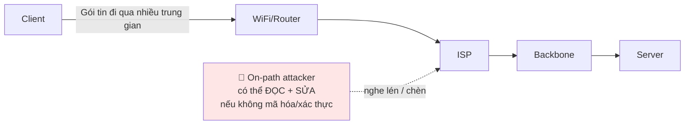
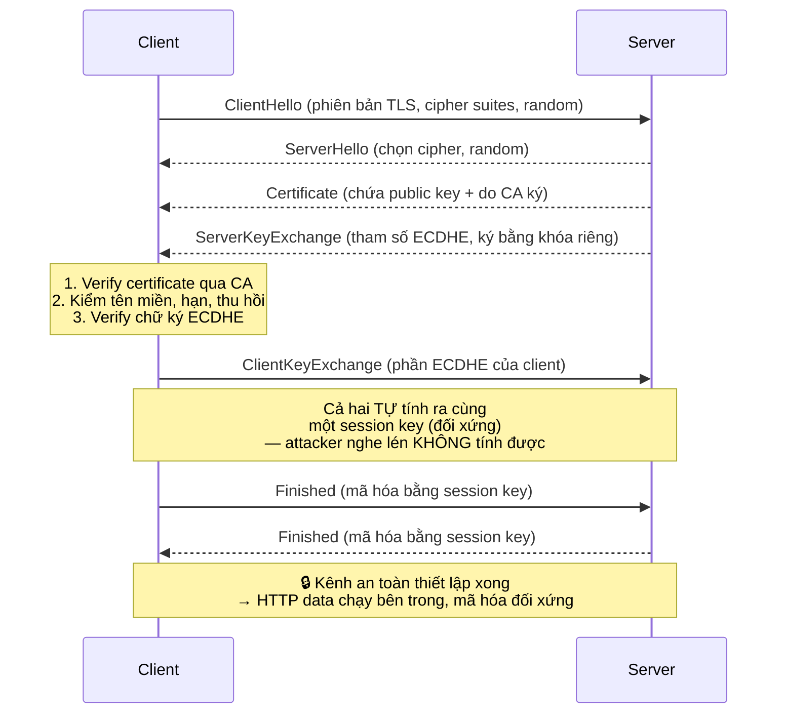
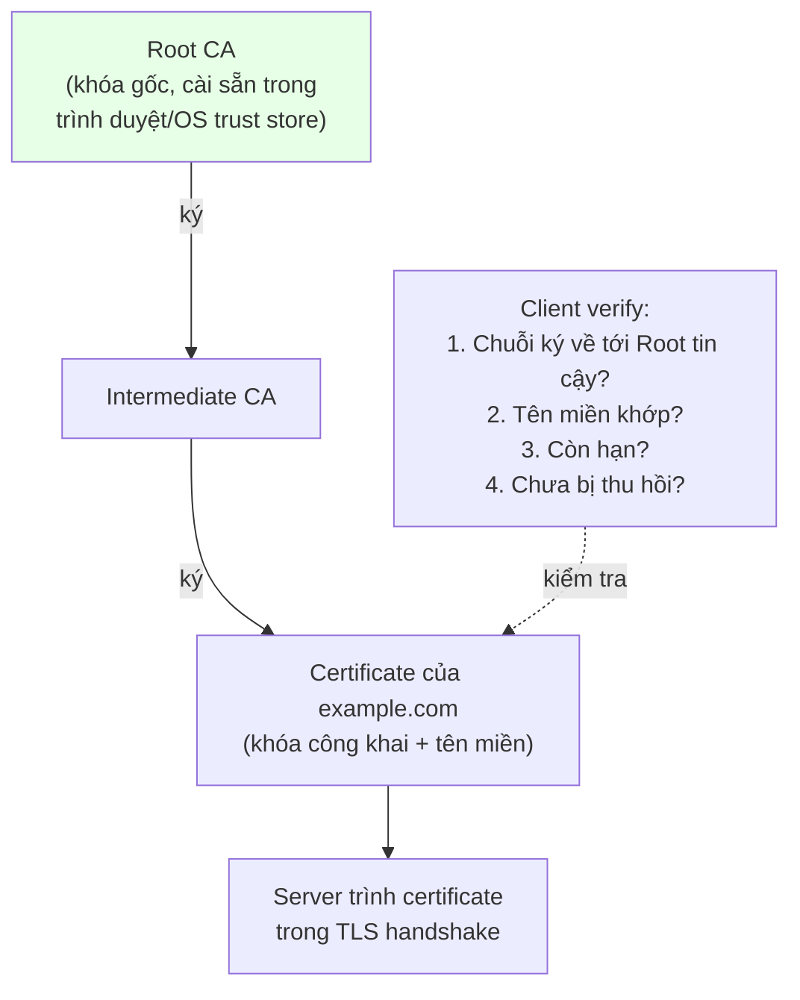
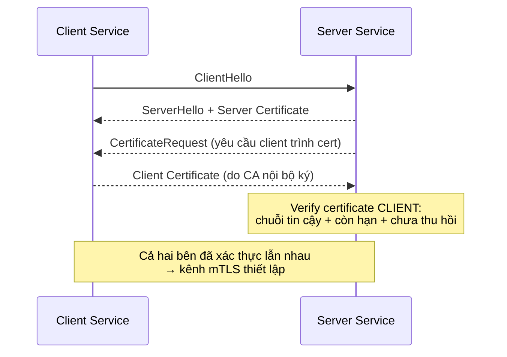

+++
title = "Backend Security — Tập 4: Transport Security"
date = "2026-07-07T11:00:00+07:00"
draft = false
tags = ["backend", "security"]
series = ["Backend Security"]
+++

> **Đối tượng:** Backend Engineer, Senior Backend Engineer, Tech Lead, Solution Architect, Software Architect.
>
> **Mạch tư duy:** Asset → Threat → Attack → Vulnerability → Defense → Trade-off → Production Best Practice.
>
> Tập này trả lời: TLS *thực sự* bảo vệ điều gì (và điều gì nó *không* bảo vệ), vì sao "có ổ khóa xanh" không đồng nghĩa với "an toàn", certificate và CA giải bài toán tin cậy ra sao, TLS handshake diễn ra thế nào bên trong, và khi nào cần Mutual TLS.

---

## 0. First Principles: Internet là một kênh công cộng thù địch

### Dữ liệu của bạn đi qua tay người lạ

Khi client gửi một request tới server, gói tin không "bay thẳng" tới đích. Nó đi qua hàng loạt thiết bị trung gian: router của mạng WiFi quán cà phê, ISP, các nhà mạng backbone, load balancer, proxy. **Bất kỳ mắt xích nào trên đường đi đều có thể đọc, sao chép, hoặc sửa đổi gói tin** nếu nó không được bảo vệ.

Đây là mô hình mối đe dọa nền tảng của transport security, thường gọi là **kẻ tấn công trên đường truyền (on-path attacker / Man-in-the-Middle - MITM)**. Giả định của security architect: **kênh truyền là công cộng và thù địch.** Bất cứ thứ gì bạn gửi dưới dạng plaintext thì coi như đã công bố công khai và có thể bị chỉnh sửa.

### Ba thứ transport security phải bảo đảm

Transport security (TLS) tồn tại để cung cấp ba bảo đảm cho dữ liệu *đang di chuyển* (in-transit) — ánh xạ trực tiếp vào ba mối quan tâm:

1. **Confidentiality (Bí mật):** kẻ nghe lén không đọc được nội dung → giải quyết bằng **mã hóa**.
2. **Integrity (Toàn vẹn):** kẻ trên đường truyền không sửa được nội dung mà không bị phát hiện → giải quyết bằng **MAC/AEAD**.
3. **Authentication (Xác thực máy chủ):** client chắc chắn đang nói chuyện với đúng server thật, không phải kẻ giả mạo → giải quyết bằng **certificate + CA**.

Điểm mấu chốt mà nhiều kỹ sư bỏ qua: **mã hóa (điểm 1) là vô nghĩa nếu không có xác thực (điểm 3).** Nếu bạn mã hóa dữ liệu nhưng đang nói chuyện với *kẻ mạo danh*, bạn chỉ đang mã hóa cẩn thận rồi trao chìa khóa cho attacker. Đây là lý do certificate và CA — phần "tin cậy" — quan trọng ngang mã hóa.

---

## 1. HTTP — vì sao nó không đủ, và điều đó nghĩa là gì

### 1.1. Problem Statement

HTTP là giao thức truyền dữ liệu web nền tảng, nhưng nó truyền **plaintext**: mọi thứ — URL, header, cookie, body, mật khẩu — đi qua mạng dưới dạng đọc được. Trong mô hình "kênh công cộng thù địch", HTTP không cung cấp *bất kỳ* bảo đảm nào trong ba điều ở trên.

### 1.2. Threat Model & Attack

- **Eavesdropping (nghe lén):** bất kỳ ai trên đường truyền (kẻ ngồi cùng WiFi công cộng, ISP, chính phủ) đọc được toàn bộ nội dung — mật khẩu, session cookie, dữ liệu cá nhân.
- **Session hijacking:** đánh cắp session cookie bay qua HTTP → chiếm phiên đăng nhập.
- **Injection / tampering:** attacker chèn nội dung vào response (quảng cáo, malware, script độc), sửa dữ liệu request. ISP đã từng bị phát hiện chèn quảng cáo vào trang HTTP.
- **SSL stripping:** attacker chặn giữa, giữ kết nối HTTP với nạn nhân trong khi nói HTTPS với server → nạn nhân tưởng an toàn nhưng thực ra đang gửi plaintext cho attacker.

### 1.3–1.10. Kết luận

HTTP thuần **không được dùng cho bất cứ thứ gì ngoài nội dung công khai tĩnh không nhạy cảm**, và ngay cả khi đó cũng nên chuyển sang HTTPS để tránh tampering và SSL stripping. **Best practice hiện đại: HTTPS mọi nơi (HTTPS everywhere), redirect toàn bộ HTTP → HTTPS, và dùng HSTS** (mục 2) để trình duyệt *không bao giờ* thử HTTP nữa. **Anti-pattern:** phục vụ trang đăng nhập qua HTTP rồi "submit sang HTTPS" (trang đăng nhập đã có thể bị chèn script trước khi submit); trộn nội dung HTTP và HTTPS (mixed content). **Khi nào HTTP chấp nhận được:** gần như chỉ trong mạng nội bộ hoàn toàn cô lập hoặc localhost khi phát triển — và ngay cả đó cũng ngày càng nên dùng TLS.

---

## 2. HTTPS — HTTP chạy bên trong một đường hầm an toàn

### 2.1. Problem Statement & bản chất

**HTTPS đơn giản là HTTP được truyền bên trong một kết nối TLS.** Nó không phải một giao thức khác; nó là HTTP quen thuộc, nhưng thay vì gửi plaintext qua TCP, nó gửi qua một kênh đã được TLS mã hóa và xác thực. Mọi bảo đảm của HTTPS (bí mật, toàn vẹn, xác thực server) đến từ **TLS bên dưới** — HTTPS chỉ là "HTTP + TLS".

Vì vậy, hiểu HTTPS = hiểu TLS (mục 4). Ở mục này ta tập trung vào những hiểu lầm và best practice ở tầng HTTPS/vận hành.

### 2.2. Hiểu lầm nguy hiểm: "ổ khóa xanh = an toàn"

Một hiểu lầm phổ biến và nguy hiểm: thấy biểu tượng ổ khóa (HTTPS) là tin trang web "an toàn". Thực tế, ổ khóa **chỉ đảm bảo ba điều**: kết nối được mã hóa, không bị sửa trên đường, và bạn đang nói chuyện với *chủ sở hữu của tên miền đó*. Nó **không** đảm bảo:

- Rằng tên miền đó là *website hợp pháp* bạn muốn tới. `paypa1-secure.com` có thể có HTTPS hợp lệ — chứng chỉ chứng minh nó thật là `paypa1-secure.com`, nhưng đó là site lừa đảo. **Phishing site ngày nay hầu hết đều có HTTPS.**
- Rằng server phía sau an toàn, không có lỗ hổng, không lưu dữ liệu bậy. HTTPS chỉ bảo vệ dữ liệu *trên đường*, không bảo vệ dữ liệu *khi đã tới server* (at-rest) hay logic ứng dụng.

> **HTTPS bảo vệ *đường ống*, không bảo vệ *nội dung ở hai đầu* hay *danh tiếng của điểm đến*.**

### 2.3. HSTS — chống SSL stripping

**HSTS (HTTP Strict Transport Security)** là một HTTP header (`Strict-Transport-Security`) buộc trình duyệt *chỉ* kết nối tới domain này qua HTTPS trong một khoảng thời gian, kể cả khi người dùng gõ `http://`. Nó bịt lỗ hổng SSL stripping (nơi attacker cố ép nạn nhân về HTTP ở lần kết nối đầu). Với `preload`, domain được nhúng sẵn vào trình duyệt để bảo vệ ngay cả lần truy cập đầu tiên.

### 2.4–2.10. Best Practice & Anti-pattern

**Best practice:** HTTPS trên toàn site (không chỉ trang đăng nhập); redirect 301 HTTP→HTTPS; bật **HSTS** (cân nhắc preload); cookie nhạy cảm đặt cờ `Secure`; tránh **mixed content** (trang HTTPS nhúng tài nguyên HTTP → bị chặn/cảnh báo và tạo lỗ hổng); dùng chứng chỉ tự động (ACME/Let's Encrypt) để không bao giờ để chứng chỉ hết hạn. **Anti-pattern:** HTTPS chỉ ở trang login; chứng chỉ hết hạn (gây gián đoạn dịch vụ — một sự cố Availability rất phổ biến); dùng TLS phiên bản cũ/cipher yếu; tin rằng "có HTTPS là xong bảo mật". **Case study vận hành:** rất nhiều sự cố sập dịch vụ toàn cầu bắt nguồn từ **chứng chỉ TLS hết hạn** không được gia hạn kịp — đây là bài học về việc tự động hóa gia hạn và giám sát ngày hết hạn chứng chỉ như một chỉ số vận hành sống còn.

---

## 3. SSL vs TLS — làm rõ thuật ngữ và vì sao phiên bản quan trọng

### 3.1. SSL và TLS là gì, quan hệ ra sao

- **SSL (Secure Sockets Layer):** giao thức gốc do Netscape tạo ra những năm 1990 (SSL 2.0, 3.0). **Toàn bộ các phiên bản SSL đã lỗi thời và không an toàn** — SSL 2.0 và 3.0 đều đã bị phá (ví dụ tấn công POODLE trên SSL 3.0) và bị vô hiệu hóa khắp nơi.
- **TLS (Transport Layer Security):** phiên bản kế thừa và chuẩn hóa của SSL. TLS 1.0, 1.1 (nay cũng đã lỗi thời), **TLS 1.2** (vẫn phổ biến, an toàn khi cấu hình đúng), và **TLS 1.3** (2018, hiện đại nhất — nhanh hơn, an toàn hơn, loại bỏ các cipher yếu).

Trong đời thực, người ta vẫn nói "SSL certificate", "SSL handshake" theo thói quen, nhưng **thực chất ngày nay tất cả đều là TLS.** "SSL" chỉ còn là cách gọi lịch sử.

### 3.2. Vì sao phiên bản quan trọng — Threat

Mỗi phiên bản cũ mang theo các lỗ hổng đã biết: POODLE (SSL 3.0), BEAST (TLS 1.0), và các cipher suite yếu (RC4, DES, cipher không có forward secrecy). Cho phép client thương lượng xuống (downgrade) phiên bản/cipher cũ = mở cửa cho **downgrade attack**, nơi attacker ép hai bên dùng phiên bản yếu rồi khai thác.

### 3.3–3.10. Best Practice

**Chỉ bật TLS 1.2 và 1.3; vô hiệu hóa toàn bộ SSL và TLS 1.0/1.1.** Ưu tiên TLS 1.3. Chỉ dùng cipher suite mạnh, có **forward secrecy** (ECDHE) — để nếu khóa riêng của server bị lộ *trong tương lai*, các phiên đã ghi lại *trong quá khứ* vẫn không giải mã được. Tắt cipher lỗi thời (RC4, 3DES, export ciphers). Dùng công cụ như SSL Labs / testssl.sh để kiểm tra cấu hình. **Anti-pattern:** để mặc định server hỗ trợ cả SSLv3/TLS1.0 "cho tương thích client cũ"; dùng cipher không forward-secrecy; không cập nhật thư viện TLS (các lỗ hổng như Heartbleed nằm ở *cài đặt* thư viện, không phải giao thức).

---

## 4. TLS Handshake — cơ chế bên trong: thiết lập kênh an toàn qua kênh không an toàn

### 4.1. Problem Statement — nghịch lý cần giải

Đây là bài toán đẹp nhất của mật mã ứng dụng: **làm sao hai bên (client và server) chưa từng gặp nhau, giao tiếp qua một kênh công cộng mà attacker đang nghe lén, lại có thể thống nhất được một khóa bí mật chung để mã hóa — mà attacker nghe hết toàn bộ cuộc trao đổi vẫn không biết khóa đó?**

Nghe như bất khả thi, nhưng mật mã khóa công khai (public-key cryptography) giải được. TLS handshake là quy trình thực hiện điều này, đồng thời xác thực server.

### 4.2. Ba việc handshake phải hoàn thành

1. **Xác thực server:** client kiểm tra certificate của server để chắc chắn đang nói chuyện với đúng server thật (chống MITM).
2. **Thống nhất khóa phiên (session key):** hai bên cùng tạo ra một khóa đối xứng chung một cách an toàn, dùng **key exchange** (ngày nay là ECDHE — Elliptic Curve Diffie-Hellman Ephemeral).
3. **Thống nhất thuật toán:** chọn phiên bản TLS và cipher suite mà cả hai cùng hỗ trợ.

Vì sao dùng *cả* khóa công khai *và* khóa đối xứng? Vì mật mã bất đối xứng (khóa công khai) **chậm**, còn mật mã đối xứng **nhanh**. Giải pháp lai: dùng khóa công khai/key exchange *chỉ để thiết lập* một khóa đối xứng chung (giai đoạn handshake), rồi *toàn bộ dữ liệu thực tế* mã hóa bằng khóa đối xứng nhanh đó. Đây là "hybrid cryptosystem" — nền tảng của mọi kết nối TLS.

### 4.3. Cách hoạt động (TLS 1.2, đơn giản hóa)

**Điểm cốt lõi về Diffie-Hellman:** client và server trao đổi các "mảnh" công khai qua kênh mở, nhưng nhờ toán học của DH, mỗi bên kết hợp mảnh công khai của bên kia với bí mật riêng của mình để tính ra *cùng một* khóa chung — mà kẻ nghe lén, dù thấy hết các mảnh công khai, *không thể* tính ra khóa đó. Với **Ephemeral** DH (ECDHE), khóa này là tạm thời cho mỗi phiên → **forward secrecy**: lộ khóa riêng server sau này cũng không giải mã được phiên cũ.

### 4.4. TLS 1.3 nhanh hơn

TLS 1.3 rút gọn handshake còn **một vòng (1-RTT)** thay vì hai, loại bỏ các bước và cipher lỗi thời, và hỗ trợ **0-RTT** cho kết nối lặp lại (đánh đổi: 0-RTT có rủi ro replay nhất định, cần cân nhắc cho request không idempotent). Kết quả: kết nối nhanh hơn rõ rệt và an toàn hơn — một trong số ít trường hợp "vừa nhanh hơn vừa an toàn hơn".

### 4.5–4.10. Trade-off & Best Practice

**Trade-off:** handshake tốn round-trip và tính toán (đặc biệt phần bất đối xứng) → thêm độ trễ ở đầu kết nối. **Best practice:** dùng **TLS 1.3**; bật **session resumption** để tránh handshake đầy đủ mỗi lần; **TLS termination** hợp lý (thường ở load balancer/reverse proxy để giảm tải CPU cho app server, nhưng cần bảo vệ chặng nội bộ sau đó — xem mTLS); dùng ECDHE cho forward secrecy. **Anti-pattern:** khóa riêng yếu/rò rỉ; cipher không forward-secrecy; certificate không khớp tên miền; bỏ qua kiểm tra thu hồi certificate. **Troubleshooting:** các lỗi handshake thường gặp — `certificate expired`, `hostname mismatch`, `unknown CA` (chuỗi certificate không đầy đủ — thiếu intermediate), `protocol/cipher mismatch` (hai bên không có phiên bản/cipher chung), lệch đồng hồ khiến certificate "chưa hợp lệ" hoặc "đã hết hạn". Dùng `openssl s_client` để chẩn đoán chuỗi certificate và thương lượng.

---

## 5. Certificate & CA — giải bài toán "làm sao tin được khóa công khai này là của đúng server?"

### 5.1. Problem Statement — lỗ hổng cốt lõi của key exchange

TLS handshake dựa trên việc client nhận được **khóa công khai của server**. Nhưng có một lỗ hổng chí mạng: **làm sao client biết khóa công khai nó nhận được thật sự là của server thật, chứ không phải của một attacker MITM đang mạo danh?**

Nếu không giải được điều này, toàn bộ mã hóa vô nghĩa: attacker chỉ cần chen vào giữa, gửi cho client *khóa công khai của attacker* (giả làm server), rồi giải mã mọi thứ client gửi, đọc/sửa, rồi chuyển tiếp tới server thật bằng một kết nối riêng. Client mã hóa cẩn thận... cho attacker. Đây là bài toán **phân phối khóa đáng tin (trusted key distribution)** — và certificate + CA là lời giải.

### 5.2. Ý tưởng: chuỗi tin cậy (Chain of Trust)

**Certificate** là một tài liệu điện tử gắn kết **một khóa công khai** với **một danh tính (tên miền)**, và được **ký bởi một bên thứ ba đáng tin — Certificate Authority (CA)**. Logic:

- Client không tin khóa công khai của server một cách mù quáng. Thay vào đó, server trình ra một certificate nói "khóa công khai này thuộc về `example.com`", và certificate đó được **CA ký**.
- Client tin CA (vì danh sách CA gốc được cài sẵn trong hệ điều hành/trình duyệt — **trust store**). Nếu certificate được một CA đáng tin ký, và nó khớp tên miền, còn hạn, chưa bị thu hồi → client tin khóa công khai đó là thật.

Đây là mô hình **Public Key Infrastructure (PKI)**: sự tin cậy được ủy thác cho một số ít CA gốc, và mở rộng qua chuỗi ký:

Attacker MITM không thể làm giả điều này: họ có thể tạo một cặp khóa, nhưng **không thể khiến một CA đáng tin ký certificate cho `example.com`** (vì họ không kiểm soát domain đó, và CA xác minh quyền sở hữu domain trước khi ký). Certificate của attacker sẽ không có chuỗi ký hợp lệ về root tin cậy → client từ chối.

### 5.3. Các loại certificate & cách CA xác minh

- **Domain Validated (DV):** CA chỉ xác minh bạn kiểm soát domain (qua DNS/HTTP challenge). Nhanh, miễn phí (Let's Encrypt). Đủ cho hầu hết trường hợp.
- **Organization Validated (OV) / Extended Validation (EV):** CA xác minh thêm danh tính tổ chức. Dùng cho ngân hàng, doanh nghiệp lớn — nhưng lưu ý trình duyệt hiện đại đã bỏ hiển thị tên tổ chức đặc biệt cho EV, nên lợi thế UX giảm.

### 5.4. Threat & các vấn đề của mô hình CA

Mô hình PKI mạnh nhưng có điểm yếu hệ thống: **nó chỉ mạnh bằng CA yếu nhất mà client tin.** Nếu *bất kỳ* CA nào trong trust store bị xâm nhập hoặc phát hành nhầm certificate cho domain của bạn, attacker có thể mạo danh bạn. Đã có tiền lệ CA bị hack (ví dụ vụ DigiNotar) và bị phát hành sai. Các cơ chế phòng thủ bổ sung:

- **Certificate Transparency (CT):** mọi certificate được ghi vào log công khai, cho phép chủ domain phát hiện certificate lạ được phát hành cho domain của mình.
- **Revocation (thu hồi):** CRL và OCSP để đánh dấu certificate bị lộ/thu hồi trước khi hết hạn (OCSP stapling giúp hiệu quả hơn).
- **CAA record:** DNS record khai báo *CA nào* được phép phát hành certificate cho domain của bạn.

### 5.5–5.10. Best Practice & Anti-pattern

**Best practice:** tự động hóa cấp/gia hạn certificate (ACME/Let's Encrypt) để không bao giờ hết hạn; giám sát CT log cho domain của mình; đặt CAA record; bảo vệ **khóa riêng** cẩn mật (đây là bí mật tối quan trọng — lộ nó là attacker mạo danh được server); dùng chứng chỉ có thời hạn ngắn + tự động xoay. **Anti-pattern:** để certificate hết hạn (nguyên nhân sự cố phổ biến); **vô hiệu hóa kiểm tra certificate** ở phía client/service (`verify=False`, `InsecureSkipVerify: true`, tắt SSL verification trong HTTP client) — đây là một trong những anti-pattern nguy hiểm và phổ biến nhất, biến TLS thành vô dụng vì mở cửa cho MITM; tự ký certificate cho production mà không có cơ chế phân phối trust hợp lý; nhúng khóa riêng vào repo. **Case study kinh điển:** các thư viện HTTP client tắt xác minh certificate "cho tiện phát triển" rồi lỡ để nguyên lên production → mọi kết nối "HTTPS" thực chất chấp nhận bất kỳ certificate nào, kể cả của attacker. Bài học: **mã hóa mà không xác thực = không có bảo mật.**

---

## 6. Mutual TLS (mTLS) — khi cả hai bên phải chứng minh danh tính

### 6.1. Problem Statement — điều TLS thường không làm

TLS tiêu chuẩn chỉ xác thực **một chiều**: client kiểm tra certificate của server (client biết chắc server là ai), nhưng server **không** biết chắc client là ai ở tầng TLS — nó dựa vào tầng ứng dụng (mật khẩu, token) để xác thực client. Điều này ổn cho web công cộng (server không thể phát certificate cho hàng triệu người dùng ẩn danh).

Nhưng trong một số bối cảnh, đặc biệt **service-to-service trong microservices** và **API B2B nhạy cảm**, ta muốn *cả hai chiều* đều xác thực bằng certificate: server chứng minh nó là server thật, **và client cũng chứng minh nó là client được phép** — ngay ở tầng transport, trước cả khi chạm tới logic ứng dụng.

### 6.2. Cách hoạt động

**mTLS** mở rộng handshake: sau khi server trình certificate, **server cũng yêu cầu client trình certificate**, và server verify certificate của client theo cùng logic chuỗi tin cậy. Chỉ khi cả hai bên có certificate hợp lệ (thường do một CA nội bộ của tổ chức phát hành) thì kết nối mới thành công.

### 6.3. Vì sao mTLS là trụ cột của Zero Trust service mesh

Trong kiến trúc microservices theo Zero Trust (Tập 1), ta không tin "cùng mạng nội bộ nghĩa là đáng tin". mTLS cung cấp **danh tính mật mã cho mỗi service**: service A chỉ chấp nhận kết nối từ service có certificate hợp lệ, và ngược lại. Điều này chống lại lateral movement — một service bị chiếm không thể tùy tiện gọi service khác nếu nó không có certificate được cấp. Các **service mesh** (như Istio/Linkerd) tự động cấp phát, xoay và quản lý certificate cho mọi service, làm mTLS trở nên khả thi ở quy mô lớn mà không cần dev tự cấu hình từng service. Chuẩn **SPIFFE/SPIRE** cung cấp danh tính workload cho mô hình này.

### 6.4–6.10. Trade-off, Best Practice, Anti-pattern

**Trade-off:** mTLS mạnh nhưng **gánh nặng vận hành lớn** — phải quản lý vòng đời certificate cho *mọi* client/service (cấp, phân phối, xoay, thu hồi). Không có tự động hóa (service mesh/PKI nội bộ), việc này nhanh chóng trở thành cơn ác mộng; certificate hết hạn ở một service có thể làm gãy giao tiếp. Thêm chút độ trễ handshake. **Best practice:** dùng mTLS cho service-to-service nội bộ và B2B API nhạy cảm; **tự động hóa hoàn toàn** vòng đời certificate (service mesh hoặc công cụ như SPIRE/cert-manager); certificate ngắn hạn + xoay tự động; CA nội bộ riêng, bảo vệ nghiêm ngặt. **Anti-pattern:** cấp certificate thủ công rồi quên xoay; certificate sống quá lâu; dùng mTLS cho client là trình duyệt người dùng cuối đại chúng (không thực tế — dùng token/OAuth thay thế); coi mTLS là thay thế cho authorization (mTLS xác thực *client là ai*, vẫn cần authorization quyết định *client được làm gì*). **Khi nào KHÔNG dùng:** web/mobile công cộng với người dùng ẩn danh (dùng TLS một chiều + token); hệ thống nhỏ chưa có hạ tầng PKI/mesh để quản lý vòng đời certificate — chi phí vận hành vượt lợi ích.

---

## Tổng kết Tập 4

Transport security giải quyết một bài toán duy nhất: **truyền dữ liệu an toàn qua một kênh công cộng thù địch**, với ba bảo đảm — bí mật (mã hóa), toàn vẹn (MAC/AEAD), và xác thực (certificate + CA).

Những điều quan trọng nhất cần mang theo:

- **Mã hóa mà không xác thực là vô nghĩa.** Đây là lý do certificate và CA (phần "tin cậy") quan trọng ngang phần mã hóa. Tắt xác minh certificate là biến TLS thành trò trang trí.
- **HTTPS bảo vệ đường ống, không bảo vệ hai đầu.** Ổ khóa xanh không có nghĩa website đáng tin — phishing site cũng có HTTPS. HTTPS không thay thế được bảo mật ứng dụng, at-rest, hay chống phishing.
- **TLS handshake là màn ảo thuật mật mã**: hai bên lạ mặt thống nhất được khóa bí mật chung qua kênh mở mà kẻ nghe lén không tính ra được — nhờ Diffie-Hellman và mô hình lai (bất đối xứng để thiết lập, đối xứng để truyền). Dùng ECDHE để có forward secrecy.
- **Phiên bản và cấu hình quyết định tất cả.** Chỉ TLS 1.2/1.3, cipher mạnh, forward secrecy. SSL đã chết. Certificate hết hạn là nguyên nhân sự cố *vận hành* phổ biến — hãy tự động hóa.
- **mTLS** nâng xác thực lên hai chiều, là trụ cột của Zero Trust trong microservices — nhưng chỉ khả thi khi vòng đời certificate được tự động hóa (service mesh/PKI).

TLS bảo vệ dữ liệu *đang di chuyển*. Nó **không** bảo vệ dữ liệu *khi đã tới trình duyệt* (nơi XSS, CSRF, và các tấn công tầng trình duyệt hoành hành) — đó là chủ đề của tập tiếp theo, **Browser Security** (CORS, CSP, Same-Origin Policy, CSRF, Cookie Security).
