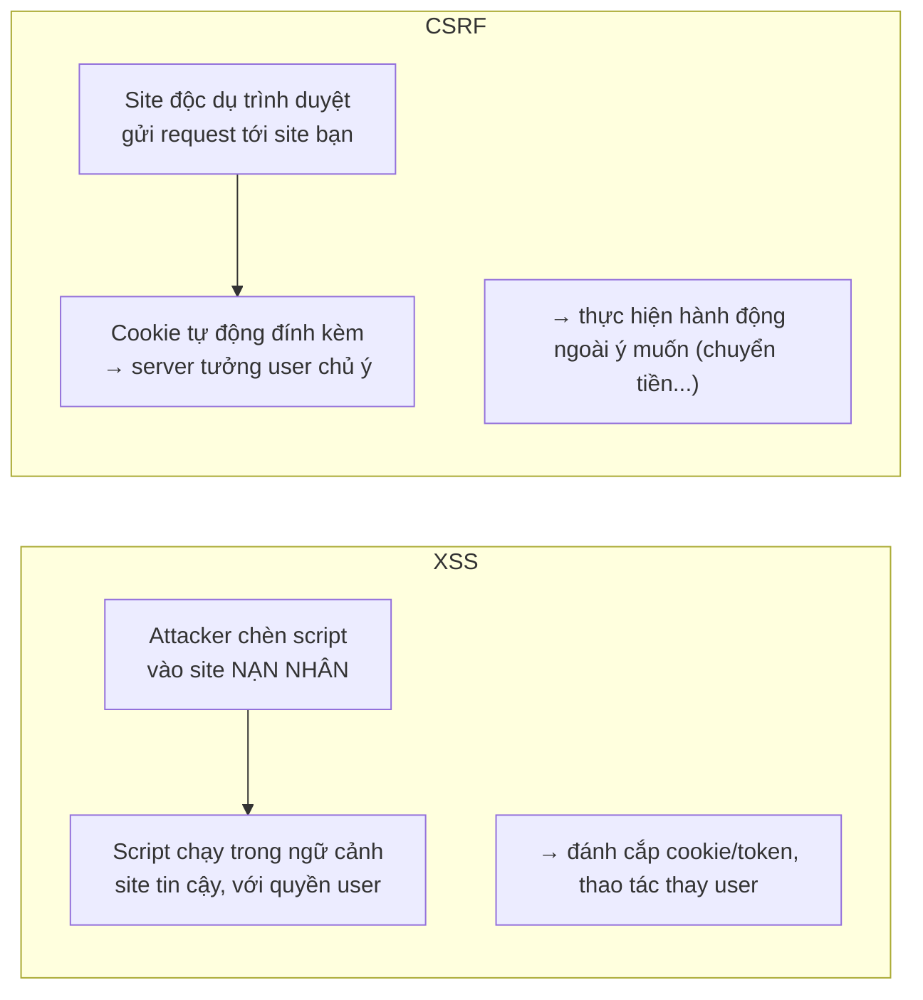
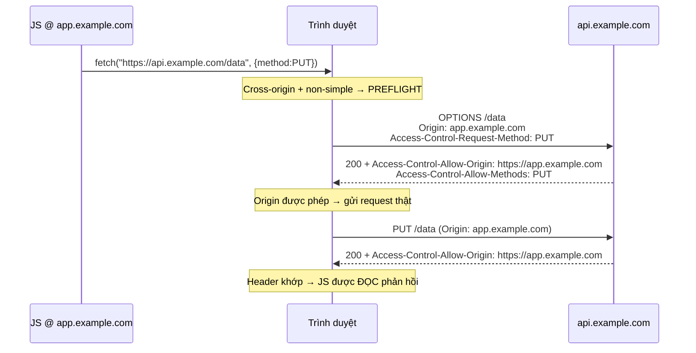
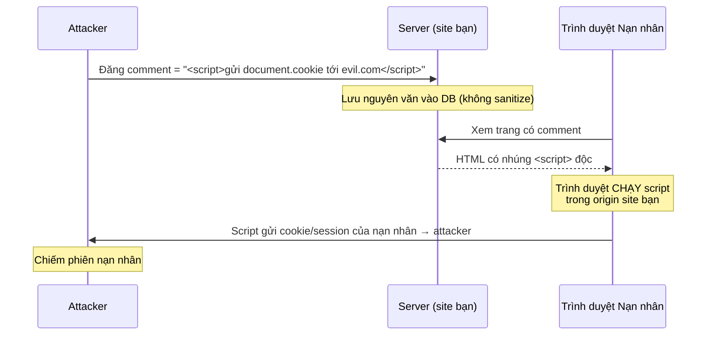
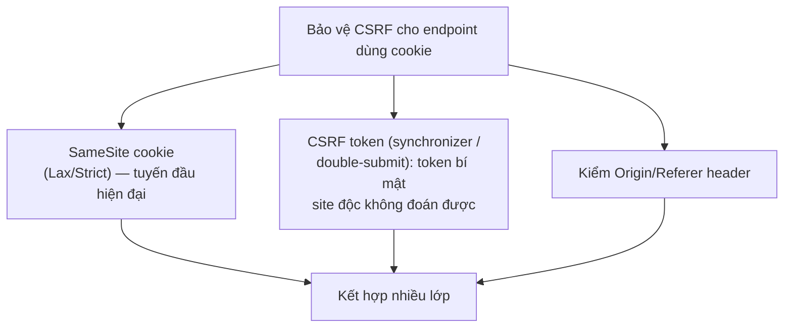
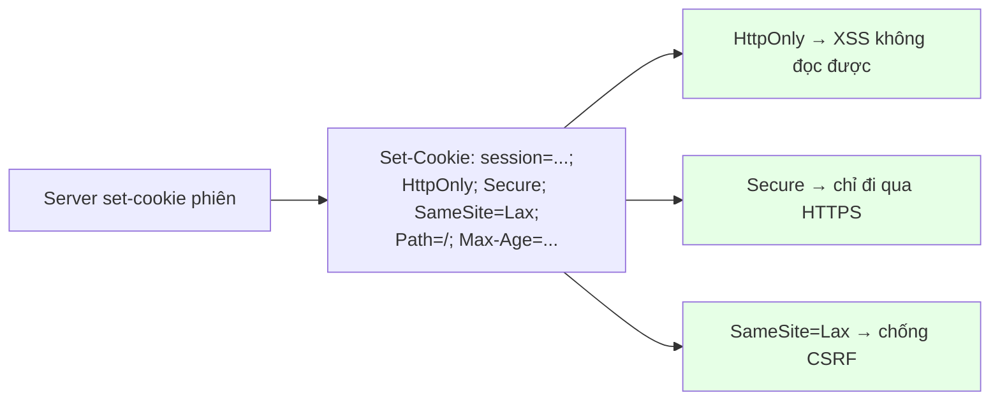

+++
title = "Backend Security — Tập 5: Browser Security"
date = "2026-07-07T12:00:00+07:00"
draft = false
tags = ["backend", "security"]
series = ["Backend Security"]
+++

> **Đối tượng:** Backend Engineer, Senior Backend Engineer, Tech Lead, Solution Architect, Software Architect.
>
> **Mạch tư duy:** Asset → Threat → Attack → Vulnerability → Defense → Trade-off → Production Best Practice.
>
> TLS (Tập 4) bảo vệ dữ liệu *trên đường truyền*. Nhưng khi dữ liệu đã tới trình duyệt, một mặt trận hoàn toàn khác mở ra. Tập này trả lời: vì sao trình duyệt cần Same-Origin Policy, CORS *nới lỏng* (chứ không *siết chặt*) bảo mật ra sao, XSS và CSRF khác nhau ở bản chất nào, và vì sao ba cờ cookie nhỏ bé (Secure, HttpOnly, SameSite) lại là tuyến phòng thủ quan trọng bậc nhất.

---

## 0. First Principles: Trình duyệt chạy code của người lạ, trên dữ liệu của bạn

### Nghịch lý nền tảng của web

Trình duyệt là một môi trường thực thi kỳ lạ nhất trong ngành phần mềm: nó **tải và chạy code (JavaScript) từ bất kỳ website nào bạn ghé thăm**, thường không cần bạn đồng ý, và làm điều đó *trong khi* bạn vẫn đang đăng nhập vào ngân hàng, email, mạng xã hội ở các tab khác. Một tab mở `evil.com` đang chạy JavaScript của kẻ lạ, ngay cạnh tab đang mở tài khoản ngân hàng của bạn.

Điều gì ngăn JavaScript của `evil.com` đọc trộm dữ liệu tài khoản ngân hàng, hoặc thực hiện giao dịch thay bạn? Câu trả lời là toàn bộ mô hình bảo mật của trình duyệt — mà nền móng là **Same-Origin Policy**. Nếu không có nó, web như ta biết không thể tồn tại: mọi trang web sẽ đọc được dữ liệu của mọi trang khác.

### Hai loại tấn công tầng trình duyệt cần phân biệt ngay

Toàn bộ tập này xoay quanh việc hiểu và phòng thủ hai lớp tấn công có bản chất *ngược nhau*, và việc lẫn lộn chúng là nguồn lỗi phổ biến:

- **XSS (Cross-Site Scripting):** attacker chèn được **code của họ** vào **site của bạn**, để nó chạy trong ngữ cảnh site bạn (với quyền của người dùng). Đây là vấn đề "**site tôi tin chạy code tôi không tin**".
- **CSRF (Cross-Site Request Forgery):** attacker khiến **trình duyệt nạn nhân gửi request tới site của bạn** mà nạn nhân không chủ ý, lợi dụng việc cookie được gửi tự động. Đây là vấn đề "**trình duyệt tin cookie của tôi một cách mù quáng**".

Ghi nhớ cặp đối xứng này: **XSS lạm dụng lòng tin của *người dùng* vào *site*; CSRF lạm dụng lòng tin của *site* vào *trình duyệt của người dùng*.** Chúng cần những phòng thủ khác nhau, và một site cần chống *cả hai*.

---

## 1. Same-Origin Policy (SOP) — luật nền tảng của web

### 1.1. Problem Statement

Trình duyệt cần một quy tắc trả lời: **JavaScript chạy trên trang A có được phép đọc dữ liệu/tương tác với trang B không?** Nếu câu trả lời luôn là "có", thì `evil.com` đọc được nội dung tab ngân hàng của bạn. Nếu luôn là "không", web không thể tích hợp gì (không nhúng được ảnh, script, iframe từ CDN). Cần một ranh giới hợp lý.

### 1.2. Origin là gì & quy tắc

**Origin** = bộ ba `(scheme, host, port)`. Hai URL cùng origin khi *cả ba* trùng khớp. `https://app.example.com` và `https://api.example.com` là **khác origin** (khác host), `http://` và `https://` cùng host cũng khác origin (khác scheme).

**Same-Origin Policy** quy định: JavaScript ở origin A **không được đọc** response/dữ liệu từ origin B khác. Cụ thể, SOP chặn việc *đọc* dữ liệu cross-origin qua script (ví dụ `fetch` tới origin khác rồi đọc kết quả bị chặn), chặn đọc DOM của iframe khác origin, chặn đọc cookie/localStorage của origin khác.

**Điểm tinh tế quan trọng:** SOP chặn *đọc phản hồi*, nhưng **không chặn việc *gửi* request**. Một form/thẻ `` trên `evil.com` vẫn có thể *gửi* request tới `bank.com` (và cookie vẫn tự động đính kèm) — attacker chỉ không đọc được kết quả. Chính "khe hở gửi được nhưng không đọc được" này là gốc rễ của **CSRF** (mục 4).

### 1.3–1.10. Vai trò & hệ quả

SOP là **mặc định an toàn (secure by default)** của web — mọi thứ khác trong tập này hoặc *nới lỏng* nó một cách có kiểm soát (CORS), hoặc *vá các khe hở* nó để lại (CSRF protection cho khe "gửi được"; CSP cho việc script độc chạy trong cùng origin). Hiểu SOP là điều kiện tiên quyết để hiểu tất cả. **Best practice:** tách các thành phần nhạy cảm sang origin riêng để tận dụng ranh giới SOP (ví dụ nội dung do người dùng tải lên phục vụ từ một domain riêng, để script độc trong đó không chạy cùng origin với app chính). **Anti-pattern:** phá vỡ SOP bằng các cấu hình lỏng lẻo (CORS `*` + credentials, `document.domain` nới lỏng) mà không hiểu hệ quả.

---

## 2. CORS — nới lỏng SOP một cách có kiểm soát (và vì sao hay bị hiểu ngược)

### 2.1. Problem Statement & hiểu lầm cốt lõi

SOP quá nghiêm với thế giới thực: ngày nay một Single Page App ở `https://app.example.com` *cần* gọi API ở `https://api.example.com` — hai origin khác nhau, và SOP mặc định sẽ chặn việc đọc phản hồi. Cần một cơ chế cho phép server *chủ động cho phép* một số origin khác được đọc dữ liệu của nó. Đó là **CORS (Cross-Origin Resource Sharing)**.

Đây là hiểu lầm phổ biến nhất về CORS, cần đóng đinh:

> **CORS KHÔNG phải một cơ chế bảo mật siết chặt. CORS là cơ chế *nới lỏng* Same-Origin Policy một cách có kiểm soát.** Mặc định (không CORS) đã là an toàn (SOP chặn). CORS *mở* thêm quyền đọc cross-origin cho các origin mà server *cho phép*.

Hệ quả tư duy: khi bạn "cấu hình CORS", bạn đang *cho phép* thêm, không phải *bảo vệ* thêm. Và CORS **chỉ kiểm soát trình duyệt** — nó không bảo vệ API khỏi client không phải trình duyệt (curl, script server-side bỏ qua CORS hoàn toàn). CORS *không* thay thế authentication/authorization.

### 2.2. Cách hoạt động

Server điều khiển CORS qua các response header, quan trọng nhất là `Access-Control-Allow-Origin`. Với request "không đơn giản" (method như PUT/DELETE, header tùy biến, một số content-type), trình duyệt gửi trước một **preflight** `OPTIONS` để hỏi server "origin này, method này có được phép không?".

Nếu server *không* trả header cho phép, trình duyệt **chặn JS đọc phản hồi** (dù request có thể đã tới server). Lưu ý: nếu request đó có side-effect (ghi dữ liệu), server *vẫn xử lý* nó — CORS chỉ chặn *đọc kết quả*, không chặn *thực hiện*. Đây là lý do CORS không phải công cụ chống CSRF.

### 2.3–2.10. Trade-off, Best Practice, Anti-pattern

**Best practice:** dùng **allowlist origin cụ thể** (không dùng `*` cho API có credentials); chỉ mở đúng method/header cần; đặt `Access-Control-Allow-Credentials: true` *chỉ khi thực sự cần cookie cross-origin* và khi đó **không được** dùng `*` cho origin (chuẩn cấm kết hợp này); cache preflight hợp lý (`Access-Control-Max-Age`). **Anti-pattern nguy hiểm:** `Access-Control-Allow-Origin: *` kết hợp gửi credentials; **phản chiếu (reflect) origin** một cách mù quáng (`Allow-Origin: <bất kỳ origin nào gửi tới>` + `Allow-Credentials: true`) — biến CORS thành mở toang, cho mọi site đọc dữ liệu có xác thực của người dùng; nghĩ rằng CORS bảo vệ API (nó không — client không-trình-duyệt bỏ qua nó). **Case study kinh điển:** cấu hình CORS phản chiếu origin + cho phép credentials khiến bất kỳ website độc nào cũng đọc được API nhạy cảm của người dùng đã đăng nhập — một lỗ hổng rò rỉ dữ liệu nghiêm trọng do "nới lỏng" quá tay. **Troubleshooting:** lỗi "CORS blocked" trong console là lỗi *phía trình duyệt do server thiếu header* — sửa ở cấu hình server, không phải "tắt CORS ở trình duyệt". Phân biệt lỗi CORS (thiếu Allow-Origin) với lỗi preflight (OPTIONS bị 401/404).

---

## 3. XSS (Cross-Site Scripting) — khi site của bạn chạy code của attacker

### 3.1. Problem Statement

XSS xảy ra khi attacker chèn được JavaScript vào trang web của bạn, và script đó chạy trong trình duyệt nạn nhân **trong ngữ cảnh origin của bạn** — nghĩa là nó có mọi quyền mà code hợp pháp của bạn có: đọc DOM, đọc cookie (nếu không `HttpOnly`), đọc token trong localStorage, gọi API của bạn với danh nghĩa người dùng, ghi keylog, sửa giao diện để lừa đảo. XSS phá vỡ Same-Origin Policy *từ bên trong*: script độc *đang ở cùng origin*, nên SOP không cứu được.

Gốc rễ: **dữ liệu do người dùng/attacker kiểm soát bị trình duyệt diễn giải thành CODE thay vì DATA.** Đây cùng bản chất với Injection nói chung (Tập OWASP) — chỉ khác là "trình thông dịch" ở đây là trình duyệt.

### 3.2. Threat Model & ba loại XSS

- **Stored (persistent) XSS:** script độc được *lưu* trên server (comment, profile, tên hiển thị) và phục vụ cho mọi người xem → nguy hiểm nhất, lan rộng. Ví dụ: attacker đăng một "comment" chứa `<script>` đánh cắp cookie, mọi người đọc comment đều bị dính.
- **Reflected XSS:** script độc nằm trong request (thường là URL/tham số) và bị *phản chiếu* ngay vào response mà không lưu → attacker dụ nạn nhân bấm một link chứa payload.
- **DOM-based XSS:** lỗ hổng nằm hoàn toàn ở JavaScript phía client xử lý dữ liệu không an toàn (ví dụ nhét `location.hash` thẳng vào `innerHTML`) — không cần server tham gia.

### 3.3. Cách hoạt động — attack flow điển hình (Stored)

### 3.4. Defense — phòng thủ nhiều lớp

Không có "một viên đạn bạc" cho XSS; cần nhiều lớp:

1. **Output encoding theo ngữ cảnh (quan trọng nhất):** khi *hiển thị* dữ liệu người dùng, encode nó đúng theo nơi nó xuất hiện — HTML entity encoding trong body HTML, attribute encoding trong thuộc tính, JavaScript encoding trong ngữ cảnh JS, URL encoding trong URL. Encode biến "code" thành "text hiển thị". Đây là tuyến chính.
2. **Dùng framework tự động escape:** các framework hiện đại (React, Angular, Vue) mặc định escape output → chặn phần lớn XSS. Nhưng cẩn thận các "lối thoát hiểm" như `dangerouslySetInnerHTML` / `v-html` / `[innerHTML]` — chúng vô hiệu hóa bảo vệ.
3. **Input validation/sanitization:** với nội dung phải cho phép HTML (rich text), dùng thư viện sanitize đã kiểm chứng (như DOMPurify) theo allowlist thẻ/thuộc tính an toàn — không tự viết regex lọc HTML (luôn thiếu sót).
4. **Content Security Policy (CSP):** lớp phòng thủ *sâu* — kể cả khi script độc lọt vào, CSP có thể chặn nó chạy (mục 5).
5. **Cookie `HttpOnly`:** giảm thiệt hại — script XSS không đọc được cookie phiên (mục 6).

### 3.5–3.10. Trade-off, Anti-pattern, Case study

**Trade-off:** sanitize rich content quá chặt làm hỏng chức năng hợp lệ; quá lỏng để lọt XSS. Encode đúng ngữ cảnh đòi hỏi hiểu nơi dữ liệu xuất hiện. **Anti-pattern:** tin rằng "đã validate input là đủ" (XSS phòng chính ở *output*, vì cùng một dữ liệu an toàn ở chỗ này có thể độc ở chỗ khác); tự viết bộ lọc HTML bằng regex; blacklist thẻ (`<script>`) thay vì allowlist (attacker có vô số cách khác: ``, `<svg>`, event handler...); nhét dữ liệu người dùng vào `innerHTML`/`eval`/`dangerouslySetInnerHTML`. **Case study:** các "self-propagating XSS worm" trên mạng xã hội (script độc trong profile tự lan sang bạn bè người xem) minh họa sức tàn phá của stored XSS. Bài học: **XSS là lỗ hổng web phổ biến và nguy hiểm hàng đầu; phòng thủ phải nhiều lớp (encode + framework + CSP + HttpOnly), không dựa vào một lớp duy nhất.** Cũng chính vì XSS phổ biến hơn CSRF mà xu hướng lưu token nhạy cảm trong cookie `HttpOnly` (Tập 2) được ưa chuộng.

---

## 4. CSRF (Cross-Site Request Forgery) — lạm dụng việc cookie tự động gửi

### 4.1. Problem Statement

Nhớ lại khe hở của SOP (mục 1): trình duyệt *chặn đọc* phản hồi cross-origin, nhưng *không chặn gửi* request cross-origin — và khi gửi tới một domain, trình duyệt **tự động đính kèm cookie** của domain đó. CSRF khai thác chính điều này.

Kịch bản: bạn đang đăng nhập `bank.com` (có session cookie). Bạn ghé `evil.com`. Trang này chứa ẩn một form/``/`fetch` tự động gửi `POST bank.com/transfer?to=attacker&amount=1000`. Trình duyệt *tự động đính kèm session cookie của bank.com* vào request đó. Server `bank.com` thấy cookie hợp lệ → tưởng chính bạn chủ ý chuyển tiền → thực hiện. Attacker **không cần đọc phản hồi** (SOP vẫn chặn đọc) — họ chỉ cần *hành động ghi* được thực hiện.

Bản chất: **CSRF lạm dụng việc server tin cookie một cách mù quáng như bằng chứng ý định của người dùng.** Cookie chứng minh "request đến từ trình duyệt có phiên của user", nhưng *không* chứng minh "user thực sự chủ ý gửi request này".

### 4.2. Vì sao token-in-header miễn nhiễm CSRF một cách tự nhiên

Điểm mấu chốt nối lại với Tập 2: CSRF chỉ hiệu quả khi credential được **tự động đính kèm** (cookie). Nếu xác thực bằng token trong header `Authorization` (JS chủ động đính kèm), thì site độc *không thể* thêm header đó vào request cross-origin nó tạo ra → **miễn nhiễm CSRF tự nhiên**. Đây chính là một vế của trade-off cookie-vs-token: cookie tiện nhưng phải chống CSRF; token-in-header né CSRF nhưng phơi bày trước XSS.

### 4.3. Defense

- **SameSite cookie (tuyến phòng thủ hiện đại, mục 6):** đặt cookie `SameSite=Lax` hoặc `Strict` → trình duyệt *không gửi* cookie trong hầu hết request cross-site → CSRF bị vô hiệu ở gốc. Đây là thay đổi lớn nhất trong chống CSRF những năm gần đây.
- **CSRF token (synchronizer token):** server sinh một token bí mật ngẫu nhiên gắn với phiên, nhúng vào form/trang; mọi request thay đổi trạng thái phải kèm token này. Site độc *không đọc được* token (SOP chặn đọc) nên không giả được request. "Double-submit cookie" là biến thể stateless.
- **Kiểm `Origin`/`Referer`:** từ chối request thay đổi trạng thái nếu Origin không thuộc allowlist.
- **Chỉ dùng phương thức an toàn cho thao tác an toàn:** không bao giờ để `GET` gây side-effect (GET không được bảo vệ CSRF token và dễ bị nhúng qua ``).

### 4.4–4.10. Trade-off, Best Practice, Anti-pattern

**Best practice:** kết hợp `SameSite=Lax` (mặc định tốt cho hầu hết) + CSRF token cho các thao tác nhạy cảm + kiểm Origin. Với API stateless dùng token-in-header (không cookie) thì CSRF vốn không phải vấn đề. **Anti-pattern:** dựa hoàn toàn vào kiểm `Referer` (có thể vắng mặt); dùng `GET` cho hành động ghi; đặt CSRF token nhưng không verify; nghĩ CORS chống được CSRF (không — CORS chặn *đọc*, CSRF cần *ghi*). **Case study:** các cuộc tấn công CSRF thay đổi email/mật khẩu tài khoản (chiếm tài khoản) hoặc chuyển tiền là minh họa kinh điển — nạn nhân chỉ cần đang đăng nhập và ghé một trang độc. **Khi nào ít lo CSRF:** API thuần dùng Bearer token trong header, không dùng cookie cho xác thực. **Khi nào phải lo nhất:** ứng dụng dùng session cookie truyền thống — bắt buộc SameSite + CSRF token.

---

## 5. CSP (Content Security Policy) — lưới an toàn khi XSS đã lọt qua

### 5.1. Problem Statement

Output encoding và sanitize là tuyến chính chống XSS, nhưng chúng do con người viết → sẽ có lúc sót. Cần một lớp phòng thủ *sâu* (defense in depth): giả sử script độc đã lọt vào trang, làm sao *ngăn nó chạy hoặc ngăn nó gửi dữ liệu ra ngoài*? Đó là **Content Security Policy**.

### 5.2. Cách hoạt động

CSP là một HTTP response header (`Content-Security-Policy`) khai báo cho trình duyệt **những nguồn nào được phép** tải/thực thi cho từng loại tài nguyên: script chỉ được từ đâu (`script-src`), style từ đâu, ảnh từ đâu, được kết nối tới đâu (`connect-src`), v.v. Trình duyệt *thực thi* chính sách này: script từ nguồn không được phép, hoặc inline script không có nonce/hash hợp lệ, sẽ **bị chặn không chạy**.

Ví dụ ý tưởng: `script-src 'self'` nghĩa là chỉ chạy script từ chính origin của bạn → một `<script>` inline mà attacker chèn qua XSS sẽ bị chặn (vì nó là inline, không phải từ file cùng origin được phép). Kết hợp `nonce`/`hash` cho phép các inline script *hợp lệ* của bạn chạy trong khi chặn inline script lạ.

### 5.3–5.10. Trade-off, Best Practice, Anti-pattern

**Trade-off:** CSP mạnh nhưng **khó triển khai đúng** trên ứng dụng phức tạp — dễ chặn nhầm tài nguyên hợp lệ, tốn công tinh chỉnh. Inline script/style cần nonce/hash → phải thay đổi cách viết. **Best practice:** triển khai theo lộ trình — bắt đầu với `Content-Security-Policy-Report-Only` (chỉ báo cáo vi phạm, không chặn) để đo tác động, rồi siết dần; ưu tiên **nonce-based CSP** hoặc `strict-dynamic` thay vì allowlist domain dài (allowlist dễ bị bypass); loại bỏ `'unsafe-inline'` và `'unsafe-eval'` (chúng vô hiệu hóa phần lớn giá trị của CSP); thu thập báo cáo vi phạm để phát hiện tấn công. **Anti-pattern:** CSP có `'unsafe-inline' 'unsafe-eval'` (gần như vô dụng); allowlist quá rộng (`https:` hay chứa các CDN cho phép host script tùy ý); coi CSP là *thay thế* cho output encoding (nó là *bổ sung* — lớp cuối, không phải lớp đầu). **Bài học:** CSP là ứng dụng đẹp của Defense in Depth cho tầng trình duyệt — nó không sửa lỗ hổng XSS, nó giảm thiểu *hậu quả* khi lỗ hổng bị khai thác.

---

## 6. Cookie Security — Secure, HttpOnly, SameSite: ba cờ nhỏ, phòng thủ lớn

### 6.1. Problem Statement

Cookie là nơi chứa "vé thông hành" (session id/token) trong hầu hết ứng dụng web. Vì thế cookie là mục tiêu số một: đánh cắp cookie phiên = chiếm phiên (session hijacking). Ba mối đe dọa chính với cookie: bị đọc trộm qua mạng (nếu không HTTPS), bị đọc qua XSS (JavaScript đọc `document.cookie`), và bị lạm dụng qua CSRF (tự động gửi cross-site). Ba cờ cookie ánh xạ *trực tiếp* vào ba mối đe dọa này.

### 6.2. Ba cờ và mối đe dọa chúng chặn

| Cờ | Chặn mối đe dọa | Cơ chế |
|-----|-----------------|--------|
| **`Secure`** | Đọc trộm qua mạng (sniff) | Cookie *chỉ* được gửi qua HTTPS, không bao giờ qua HTTP |
| **`HttpOnly`** | Đánh cắp qua XSS | JavaScript **không đọc được** cookie (`document.cookie` không thấy nó) → script XSS không lấy được session |
| **`SameSite`** | CSRF | Trình duyệt *không gửi* cookie trong request cross-site (Lax/Strict) |

Đây là ví dụ tuyệt vời về việc **các cơ chế nhỏ, đúng chỗ, giải quyết các lỗ hổng lớn**. Chỉ ba thuộc tính khi set cookie mà bịt được ba lớp tấn công khác nhau.

### 6.3. SameSite chi tiết

- **`SameSite=Strict`:** cookie *không bao giờ* gửi khi request đến từ site khác — kể cả khi người dùng bấm link từ site khác sang. An toàn nhất nhưng ảnh hưởng UX (bấm link từ email vào trang có thể thấy "chưa đăng nhập").
- **`SameSite=Lax`:** cookie *được* gửi khi điều hướng top-level bằng GET (bấm link), nhưng *không* gửi cho request cross-site kiểu POST/nhúng ngầm → chặn CSRF phổ biến trong khi giữ UX. Đây là **mặc định của trình duyệt hiện đại** và lựa chọn hợp lý cho hầu hết.
- **`SameSite=None`:** cookie gửi cross-site bình thường — **bắt buộc kèm `Secure`**. Chỉ dùng khi thực sự cần cookie cross-site (ví dụ SSO, embed hợp pháp), và khi đó phải có phòng thủ CSRF khác.

### 6.4. Cách hoạt động — set cookie an toàn

### 6.5–6.10. Best Practice, Anti-pattern, Case study

**Best practice cho cookie phiên nhạy cảm:** *luôn* đặt cả ba — `HttpOnly` + `Secure` + `SameSite=Lax` (hoặc Strict cho thao tác cực nhạy); thêm `Path` hẹp, thời hạn hợp lý; cân nhắc tiền tố `__Host-` (buộc Secure + Path=/ + không Domain, chống một số tấn công cookie); không đặt `Domain` rộng hơn cần thiết (cookie chia sẻ sang subdomain kém tin cậy là rủi ro). **Anti-pattern nghiêm trọng:** lưu session/token *thiếu* `HttpOnly` (mở cửa cho XSS đánh cắp — đây là lý do lưu JWT trong localStorage bị chê, vì localStorage *luôn* JS đọc được, tệ hơn cả cookie thiếu HttpOnly); thiếu `Secure` (cookie rò qua HTTP); không đặt `SameSite` (dễ CSRF — dù trình duyệt hiện đại mặc định Lax, đừng phụ thuộc mặc định); đặt `SameSite=None` mà không có phòng thủ CSRF bổ sung. **Case study:** vô số vụ chiếm phiên bắt nguồn từ cookie thiếu `HttpOnly` bị XSS đọc, hoặc thiếu `Secure` bị sniff trên WiFi công cộng. Bài học: **ba cờ này gần như miễn phí và bịt được ba lớp tấn công — không đặt chúng là bỏ trống phòng thủ dễ nhất có thể có.**

---

## Tổng kết Tập 5

Browser Security là mặt trận bắt đầu *nơi TLS kết thúc* — khi dữ liệu đã tới trình duyệt, một môi trường chạy code của người lạ ngay cạnh dữ liệu nhạy cảm của bạn.

Sợi chỉ đỏ xuyên suốt:

- **Same-Origin Policy** là luật nền tảng (mặc định an toàn): script origin A không đọc được dữ liệu origin B. Nhưng nó *chặn đọc, không chặn gửi* — khe hở này sinh ra CSRF.
- **CORS** *nới lỏng* SOP có kiểm soát để app gọi API cross-origin — nó **không phải** cơ chế bảo mật siết chặt, và không bảo vệ API khỏi client không-trình-duyệt. Cấu hình lỏng (reflect origin + credentials) là lỗ hổng rò rỉ dữ liệu.
- **XSS** = site bạn chạy code attacker (lạm dụng lòng tin của *user* vào *site*). Phòng bằng nhiều lớp: output encoding theo ngữ cảnh (chính) + framework auto-escape + sanitize + CSP + HttpOnly.
- **CSRF** = trình duyệt gửi request ngoài ý muốn (lạm dụng lòng tin của *site* vào *cookie*). Phòng bằng SameSite + CSRF token + kiểm Origin. Token-in-header miễn nhiễm tự nhiên.
- **CSP** là lưới an toàn *sâu* — giảm thiệt hại khi XSS đã lọt, không thay thế encoding.
- **Cookie Security (Secure + HttpOnly + SameSite)** — ba cờ nhỏ ánh xạ trực tiếp vào ba mối đe dọa (sniff, XSS, CSRF), gần như miễn phí, và là phòng thủ dễ nhất mà nhiều hệ thống vẫn bỏ trống.

Điểm nối quan trọng với Tập 2: cặp đối xứng **XSS ↔ CSRF** chính là cốt lõi của trade-off "lưu credential ở cookie hay ở header". Không có lựa chọn thắng tuyệt đối — chỉ có việc hiểu bạn đang đánh đổi mối đe dọa nào lấy mối đe dọa nào, và phòng thủ lớp còn lại cho tương xứng.

Tập tiếp theo (**API Security**) chuyển từ tầng trình duyệt sang tầng API: xác thực/ủy quyền API, API Key vs Token, Rate Limiting, Replay Attack, Idempotency, và Request Signing/HMAC.
