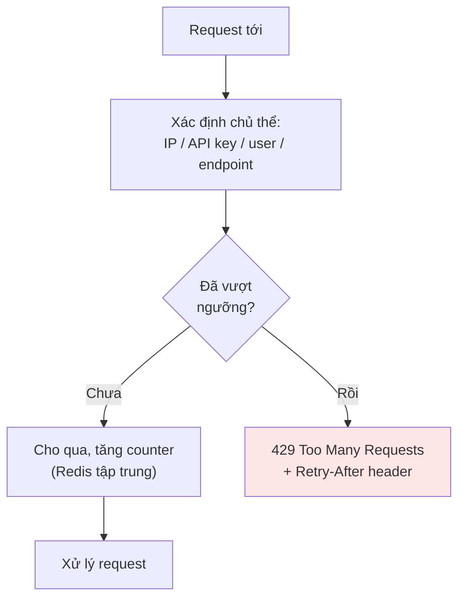
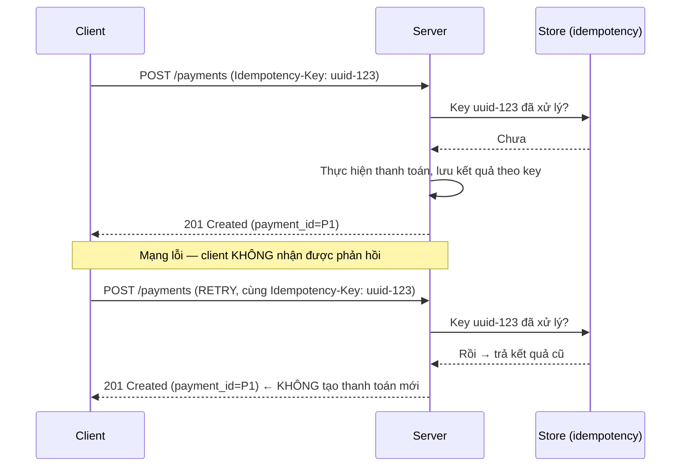
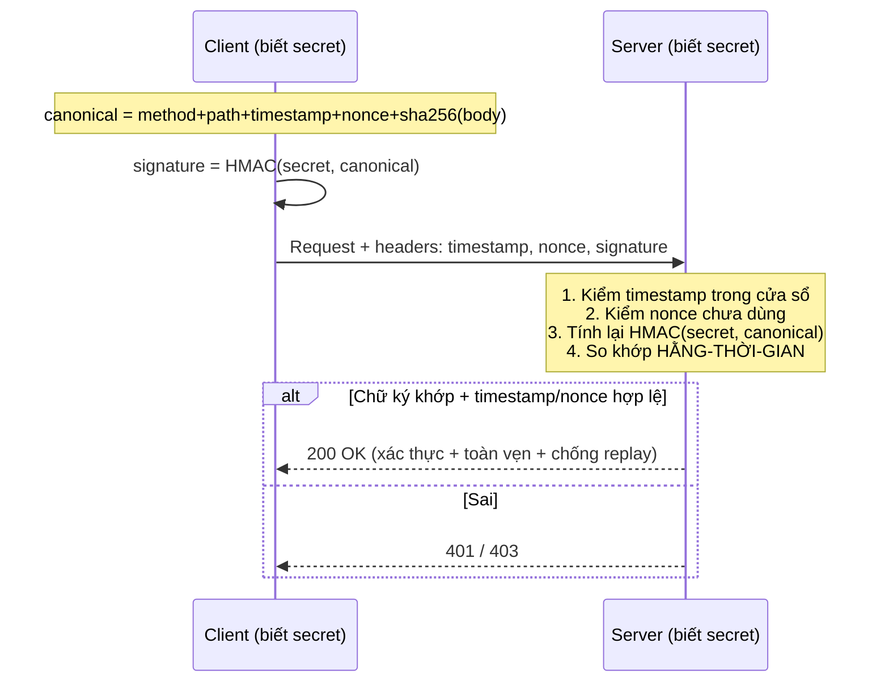

+++
title = "Backend Security — Tập 6: API Security"
date = "2026-07-07T13:00:00+07:00"
draft = false
tags = ["backend", "security"]
series = ["Backend Security"]
+++

> **Đối tượng:** Backend Engineer, Senior Backend Engineer, Tech Lead, Solution Architect, Software Architect.
>
> **Mạch tư duy:** Asset → Threat → Attack → Vulnerability → Defense → Trade-off → Production Best Practice.
>
> Tập này trả lời: API khác web app ở điểm nào về mô hình mối đe dọa, khi nào dùng API Key vs Token, vì sao Rate Limiting là *bảo mật* chứ không chỉ là *quản lý tài nguyên*, Replay Attack là gì và vì sao Idempotency vừa là tính đúng đắn vừa là phòng thủ, và khi nào cần Request Signing/HMAC thay vì token thường.

---

## 0. First Principles: API là bề mặt tấn công trần trụi nhất

### Không có "giao diện" để ẩn sau

Với web app truyền thống, có một ảo tưởng an toàn: "người dùng chỉ thấy các nút bấm ta cho họ thấy". API phá vỡ hoàn toàn ảo tưởng đó. API là **hợp đồng công khai, có cấu trúc, được thiết kế để máy gọi máy** — attacker đọc tài liệu API của bạn, gọi thẳng từng endpoint bằng script, thử mọi tham số, tự động hóa hàng triệu lần. Không có "UI để giấu logic", không có "nút Delete bị ẩn" — mọi endpoint đều phơi ra và có thể bị gọi trực tiếp.

Hệ quả tư duy nền tảng:

> **Mọi kiểm soát bảo mật phải nằm ở *phía server, tại API*. Bất cứ thứ gì dựa vào client (validation ở frontend, ẩn nút trên UI, "client của chúng tôi sẽ không gửi field đó") đều vô nghĩa — attacker gọi API trực tiếp, bỏ qua hoàn toàn client của bạn.**

Đây là lý do OWASP có hẳn một danh sách riêng **OWASP API Security Top 10** bên cạnh OWASP Top 10 web: các lỗ hổng API có đặc thù riêng, và hạng đầu bảng luôn là **Broken Object Level Authorization (BOLA/IDOR)** — chính là lỗi authorization ở mức tài nguyên đã bàn ở Tập 1.

### Threat Model đặc thù của API

- **Enumeration / IDOR:** đổi ID trong request để truy cập tài nguyên của người khác (BOLA).
- **Automated abuse:** brute-force, credential stuffing, scraping dữ liệu hàng loạt, spam — vì API dễ tự động hóa.
- **Excessive data exposure:** API trả về nhiều field hơn cần (client lọc hiển thị, nhưng dữ liệu thừa vẫn nằm trong response → attacker đọc thẳng).
- **Mass assignment:** client gửi thêm field (`isAdmin: true`) và server tự động gán vào model.
- **Replay:** bắt lại và gửi lại request hợp lệ.
- **Lạm dụng credential máy:** API key/token của máy bị lộ (trong repo, log, client mobile decompiled).

---

## 1. API Authentication — chứng minh "ai đang gọi"

### 1.1. Problem Statement

API cần biết *ai* (người dùng hay hệ thống nào) đang gọi, để sau đó quyết định họ được làm gì. Nhưng bối cảnh API đa dạng hơn web: có thể là người dùng qua SPA/mobile, có thể là một *hệ thống khác* (server-to-server, không có con người), có thể là đối tác B2B. Mỗi bối cảnh cần cơ chế xác thực phù hợp.

### 1.2. Các cơ chế & khi nào dùng

- **Token (JWT/opaque) qua `Authorization: Bearer`:** chuẩn cho người dùng cuối (SPA/mobile) sau khi đăng nhập. Chi tiết ở Tập 2. Miễn nhiễm CSRF tự nhiên (header, không cookie).
- **OAuth2 / OIDC:** khi có ủy quyền bên thứ ba, SSO, hoặc access token có scope. Chi tiết Tập 2.
- **API Key:** cho định danh *ứng dụng/dự án* (thường server-to-server hoặc để đo lường/tính phí). Mục 2.
- **mTLS:** service-to-service nội bộ, B2B nhạy cảm (Tập 4).
- **Request Signing/HMAC:** khi cần đảm bảo toàn vẹn request + chống replay ở mức cao (webhook, tài chính). Mục 6.

### 1.3–1.10. Best Practice tổng quát

Xác thực **mọi** endpoint trừ endpoint công khai có chủ đích (và ngay cả đó cũng rate-limit). Đặt xác thực ở **API Gateway** như tuyến đầu (xác minh token/khóa trước khi request chạm service), nhưng đừng để đó là *duy nhất* — service vẫn phải kiểm authorization. **Anti-pattern:** tin `X-User-Id` do client gửi làm danh tính; xác thực chỉ ở gateway rồi service nội bộ "tin nhau tuyệt đối" (vi phạm Zero Trust); dùng cùng một credential quyền rộng cho mọi việc. Phần lớn nội dung AuthN/AuthZ đã ở Tập 1 và 2; ở đây tập trung vào các cơ chế *đặc thù API* trong các mục sau.

---

## 2. API Key — định danh ứng dụng, không phải xác thực người dùng

### 2.1. Problem Statement & bản chất

**API Key** là một chuỗi bí mật dài, ngẫu nhiên, cấp cho một *ứng dụng/dự án/đối tác* để nó tự nhận diện khi gọi API. Bản chất cần làm rõ:

> **API Key trả lời "ứng dụng/dự án NÀO đang gọi", KHÔNG trả lời "người dùng nào" và thường KHÔNG mang thông tin ủy quyền chi tiết.** Nó gần với "định danh + đo lường/tính phí" hơn là "xác thực an toàn của một danh tính người dùng".

API Key hữu ích cho: server-to-server đơn giản, đo lường usage/quota, phân biệt khách hàng, thu hồi theo dự án. Nó **không** phù hợp làm cơ chế xác thực người dùng cuối (không có khái niệm phiên, không MFA, không hết hạn tự nhiên).

### 2.2. Threat Model

Vì API Key là một bí mật *tĩnh, sống lâu*, mối đe dọa chính là **rò rỉ**: key bị commit lên Git, nằm trong URL (bị log), nhúng trong app mobile (decompile ra), lộ trong log/error message. Một khi lộ, ai cũng dùng được cho tới khi bị thu hồi — và vì không hết hạn tự nhiên, "cho tới khi thu hồi" có thể là rất lâu.

### 2.3–2.10. Best Practice & Anti-pattern

**Best practice:** gửi key trong **header** (`Authorization` hoặc header riêng), *không bao giờ* trong URL/query string (URL bị log khắp nơi); lưu key ở server dưới dạng **hash** (như password) để DB lộ không lộ key; gắn key với **scope hẹp** và **quota/rate limit**; hỗ trợ **nhiều key + rotation** (cấp key mới, thu hồi key cũ mà không gián đoạn); giám sát và cảnh báo khi key dùng bất thường; dùng **secret scanning** để phát hiện key bị commit. **Anti-pattern:** key trong URL/query; nhúng key bí mật trong client mobile/JS công khai (bất kỳ ai cũng trích được — nếu buộc phải lộ ra client thì key đó chỉ nên có quyền tối thiểu, public-tier); key vĩnh viễn không xoay; một key toàn quyền dùng chung; lưu key plaintext trong DB. **Case study:** bot quét GitHub tìm API key/secret bị commit *trong vài phút* sau khi push — vô số vụ lạm dụng (đặc biệt key cloud dẫn tới hóa đơn khổng lồ hoặc truy cập dữ liệu) khởi nguồn từ key lộ trên repo. Bài học: **API Key sẽ bị lộ; hãy thiết kế để lộ có hậu quả tối thiểu (scope hẹp) và phát hiện/xoay nhanh.**

---

## 3. Rate Limiting — phòng thủ, không chỉ là quản lý tài nguyên

### 3.1. Problem Statement — vì sao Rate Limiting là vấn đề BẢO MẬT

Nhiều kỹ sư xem rate limiting thuần túy là chuyện "bảo vệ tài nguyên/tránh quá tải". Đó là góc nhìn thiếu. Trong bảo mật, rate limiting là **lớp phòng thủ chống lại các tấn công dựa trên *khối lượng* và *tự động hóa*** — vốn là bản chất của tấn công API:

- **Brute-force / credential stuffing:** không giới hạn số lần thử đăng nhập = attacker thử hàng triệu mật khẩu/cặp credential rò rỉ. Rate limit biến việc này thành bất khả thi.
- **Enumeration/scraping:** rút dữ liệu hàng loạt bằng cách gọi API liên tục.
- **DoS ở tầng ứng dụng:** làm cạn tài nguyên bằng request tốn kém.
- **Lạm dụng tài nguyên đắt tiền:** spam gửi OTP/email (tốn tiền + quấy rối), gọi endpoint tính toán nặng.

> **Không có rate limiting, mọi phòng thủ khác dựa trên "attacker chỉ có hữu hạn lần thử" đều sụp đổ.** Mật khẩu mạnh vô nghĩa nếu attacker thử được vô hạn lần; OTP 6 số bị brute-force trong vài phút nếu không giới hạn.

### 3.2. Cách hoạt động — các thuật toán

- **Fixed window:** đếm request trong mỗi cửa sổ thời gian cố định. Đơn giản nhưng có "burst" ở ranh giới cửa sổ.
- **Sliding window:** mượt hơn, tránh burst ranh giới.
- **Token bucket / Leaky bucket:** cho phép burst có kiểm soát, tốc độ trung bình bị giới hạn — phổ biến nhất trong thực tế.

Rate limit theo nhiều chiều: theo **IP**, theo **user/API key**, theo **endpoint** (login/OTP siết chặt hơn endpoint đọc thường), theo **tenant**. Trong hệ phân tán, cần **counter tập trung** (thường Redis) để giới hạn nhất quán qua nhiều instance.

### 3.3–3.10. Trade-off, Best Practice, Anti-pattern

**Trade-off:** ngưỡng quá chặt chặn nhầm người dùng thật (đặc biệt sau NAT dùng chung IP); quá lỏng không cản được attacker. Rate limit theo IP đơn thuần dễ bị né bằng IP xoay vòng (botnet, proxy) và chặn nhầm nhiều user chung IP → nên kết hợp nhiều chiều. **Best practice:** siết chặt các endpoint nhạy cảm (login, đăng ký, OTP, reset mật khẩu, thanh toán) mạnh hơn endpoint thường; trả `429` kèm `Retry-After`; kết hợp với **backoff lũy tiến**, captcha, và **account lockout mềm** cho login; rate limit ở **API Gateway** (tuyến đầu) *và* các lớp sâu; giám sát để phát hiện tấn công qua mẫu vượt ngưỡng. Cân nhắc phân biệt **rate limiting** (giới hạn tốc độ) và **quota** (giới hạn tổng theo tháng, thường cho tính phí). **Anti-pattern:** không rate-limit endpoint login/OTP (lỗ hổng phổ biến dẫn tới chiếm tài khoản); rate limit chỉ ở client (vô dụng); counter cục bộ từng instance (attacker chia tải qua nhiều instance để né); chặn cứng theo IP gây khóa nhầm hàng loạt. **Case study:** nhiều vụ chiếm tài khoản hàng loạt qua credential stuffing hoặc brute-force OTP xảy ra chính vì thiếu rate limiting trên endpoint xác thực. Bài học: **rate limiting là hạ tầng bảo mật cốt lõi, không phải tính năng phụ.**

---

## 4. Replay Attack & Idempotency — chống gửi lại, và làm đúng khi phải thử lại

### 4.1. Replay Attack — Problem Statement

Ngay cả khi request được mã hóa (TLS) và xác thực (token hợp lệ), vẫn còn một lỗ hổng: **attacker bắt được một request hợp lệ (hoặc chính nó bị gửi lại do lỗi mạng) và gửi lại (replay) nó nhiều lần.** Ví dụ: một request "chuyển 1 triệu" hợp lệ bị bắt lại và gửi 10 lần → chuyển 10 triệu. Token vẫn hợp lệ, chữ ký vẫn đúng — vấn đề không phải giả mạo, mà là **lặp lại**.

TLS chống *nghe lén và sửa*, nhưng một request hợp lệ được ghi lại rồi phát lại vẫn "hợp lệ" về mọi mặt kỹ thuật. Cần cơ chế để server nhận ra "request này tôi đã xử lý rồi".

### 4.2. Defense chống Replay

- **Nonce + timestamp:** mỗi request kèm một **nonce** (số dùng một lần) và **timestamp**. Server từ chối request có timestamp quá cũ (ngoài cửa sổ vài phút) và từ chối nonce đã thấy (lưu nonce đã dùng trong cửa sổ đó). Kẻ replay dùng lại nonce cũ → bị chặn; nếu chờ quá lâu → timestamp hết hạn.
- **Idempotency key:** client gắn một khóa duy nhất cho mỗi *thao tác dự định*; server nhớ khóa đã xử lý và không thực hiện lại (mục 4.3).
- **Request signing (HMAC) bao gồm timestamp/nonce trong phần được ký** để chúng không bị sửa (mục 6).

### 4.3. Idempotency — vừa là tính đúng đắn, vừa là phòng thủ

**Idempotency** nghĩa là: thực hiện cùng một thao tác *nhiều lần* cho kết quả *giống như thực hiện một lần*. Đây là khái niệm ở giao điểm của **độ tin cậy (reliability)** và **bảo mật**:

- **Reliability:** mạng không đáng tin. Client gửi "tạo đơn hàng", mạng timeout, client *không biết* server đã nhận chưa nên **thử lại**. Nếu server không idempotent, khách bị tính tiền hai lần. Đây là vấn đề đúng-đắn kinh điển của hệ phân tán.
- **Security:** idempotency cũng vô hiệu hóa replay của các thao tác ghi — request lặp lại (dù do lỗi hay do attacker) chỉ có tác dụng một lần.

Cách hiện thực: client sinh một **Idempotency-Key** (UUID) cho mỗi thao tác dự định, gửi kèm header. Server lưu kết quả theo key; nếu thấy key đã xử lý, nó *trả lại kết quả cũ* thay vì thực hiện lại.

### 4.4–4.10. Best Practice & Anti-pattern

**Best practice:** thiết kế mọi endpoint *ghi* nhạy cảm (thanh toán, tạo tài nguyên, chuyển tiền) hỗ trợ **Idempotency-Key**; theo bản chất HTTP, `GET/PUT/DELETE` nên idempotent, `POST` thì không nên dùng Idempotency-Key; chống replay cho API nhạy cảm bằng nonce+timestamp trong cửa sổ ngắn; ký các trường chống-replay bằng HMAC để không bị sửa. **Anti-pattern:** endpoint tạo/thanh toán không idempotent (double-charge khi client retry); dùng `GET` cho hành động ghi (bị replay/prefetch dễ dàng); tin timestamp mà không ký nó (attacker sửa timestamp); lưu nonce vĩnh viễn (dùng cửa sổ thời gian + timestamp để giới hạn bộ nhớ). **Case study:** double-charge trong thanh toán do retry là một trong những lỗi production tốn kém và phổ biến nhất — vừa là bug đúng-đắn vừa là bề mặt bị lạm dụng. Idempotency giải quyết cả hai. **Bài học:** trong hệ phân tán, "thử lại" là điều *chắc chắn xảy ra*; thiết kế idempotent không phải tùy chọn mà là yêu cầu — và nó tặng kèm phòng thủ replay.

---

## 5. Request Signing & HMAC — đảm bảo toàn vẹn và nguồn gốc của chính request

### 5.1. Problem Statement — điều token thường không làm

Bearer token chứng minh "người gọi có token hợp lệ", nhưng nó **không ràng buộc với *nội dung* của request**. Nếu token bị bắt (bearer = "ai cầm cũng dùng được"), attacker có thể dùng nó cho request *khác*. Và token không đảm bảo rằng *body request* không bị sửa trên đường (dù TLS bảo vệ đường truyền, có các kịch bản qua nhiều trung gian, proxy, hoặc yêu cầu bằng chứng toàn vẹn end-to-end độc lập với TLS).

Một số bối cảnh cần đảm bảo mạnh hơn: **request này đến từ đúng bên nắm secret, và nội dung của nó không bị sửa một byte nào.** Ví dụ: webhook (server bạn nhận sự kiện từ bên thứ ba — làm sao chắc nó thật?), API tài chính, API mà mỗi request phải được xác thực toàn vẹn độc lập. Đó là lúc **Request Signing bằng HMAC**.

### 5.2. HMAC là gì & cách hoạt động

**HMAC (Hash-based Message Authentication Code)** dùng một **secret dùng chung** giữa hai bên và một hàm băm để tạo ra một "chữ ký" (MAC) cho một thông điệp. Người gửi tính `HMAC(secret, nội_dung_request)` và đính kèm; người nhận (biết cùng secret) tính lại và so sánh. Nếu khớp: chứng minh (a) người gửi biết secret — **xác thực nguồn gốc**, và (b) nội dung không bị sửa — **toàn vẹn**. HMAC nhanh, đối xứng (khác chữ ký số bất đối xứng của JWT RS256), phù hợp khi hai bên đã chia sẻ secret.

**Cách ký request điển hình:** ký lên một chuỗi chuẩn hóa gồm: method + path + timestamp + nonce + hash của body. Bao gồm **timestamp và nonce** trong phần ký → chống replay (mục 4). Secret không bao giờ truyền qua mạng — chỉ chữ ký được gửi.

### 5.3–5.10. Trade-off, Best Practice, Anti-pattern

**Trade-off:** HMAC signing mạnh (toàn vẹn + nguồn gốc + chống replay) nhưng **phức tạp cho client** (phải canonicalize chính xác, đồng bộ thời gian, quản lý secret) → DX kém hơn Bearer token; là secret đối xứng nên *cả hai bên* đều giữ secret (không phù hợp khi cần một bên chỉ verify mà không ký). **Best practice:** dùng cho webhook (verify chữ ký nhà cung cấp gửi tới — luôn verify!), API server-to-server nhạy cảm, tài chính; luôn bao gồm timestamp+nonce trong phần ký; **so sánh chữ ký bằng hàm hằng-thời-gian** (constant-time compare) để chống timing attack; canonicalization phải xác định và nhất quán hai bên; xoay secret định kỳ. **Anti-pattern:** **không verify chữ ký webhook** (chấp nhận mọi payload gửi tới endpoint webhook — cực kỳ phổ biến và nguy hiểm, cho phép giả mạo sự kiện như "thanh toán thành công"); so sánh chữ ký bằng `==` thường (rò rỉ timing); không ký timestamp (mở replay); canonicalization không nhất quán (chữ ký luôn sai hoặc bỏ sót phần body). **Case study:** các lỗ hổng giả mạo webhook (attacker gửi sự kiện "đơn hàng đã thanh toán" giả tới endpoint webhook không verify chữ ký) dẫn tới gian lận — bài học là **mọi webhook nhận từ bên ngoài phải verify chữ ký HMAC nhà cung cấp cung cấp.** **Khi nào KHÔNG cần HMAC:** API người dùng cuối thông thường qua HTTPS + Bearer token đã đủ; HMAC signing chỉ đáng cho các luồng cần đảm bảo toàn vẹn/nguồn gốc mạnh và chống replay.

---

## 6. Tổng hợp: các phòng thủ đặc thù API khác cần biết

Ngoài các mục trên, một API production vững chắc còn cần các phòng thủ mà bản chất đã bàn ở các tập khác nhưng đặc biệt quan trọng với API:

- **Object-level authorization (chống BOLA/IDOR):** kiểm *quyền sở hữu tài nguyên* trên mỗi request, gần lớp dữ liệu — hạng #1 OWASP API (đã bàn Tập 1). Không bao giờ tin ID trong request là "đương nhiên thuộc về người gọi".
- **Chống Mass Assignment:** dùng **allowlist field** khi bind request vào model; không bao giờ tự động gán mọi field client gửi (attacker gửi `role`, `isVerified`, `balance`...).
- **Chống Excessive Data Exposure:** định hình response tường minh (DTO/serializer chỉ trả field cần); không "trả cả object rồi để client lọc".
- **Input validation nghiêm ngặt:** validate kiểu, độ dài, định dạng, phạm vi *phía server* (schema validation ở gateway/app) — vì client không đáng tin.
- **Giới hạn kích thước & độ phức tạp:** giới hạn body size, độ sâu JSON, độ phức tạp query (đặc biệt GraphQL — chống query lồng sâu gây DoS), số lượng item trong batch.
- **API Gateway** làm điểm thực thi tập trung: xác thực, rate limit, schema validation, logging — nhưng không thay thế authorization ở service.
- **Versioning & deprecation an toàn:** endpoint cũ (v1) thường bị bỏ quên vá lỗi → là bề mặt tấn công. Quản lý vòng đời version và tắt endpoint cũ.
- **Audit logging:** log mọi truy cập nhạy cảm (ai, hành động, tài nguyên, kết quả) để điều tra và phát hiện lạm dụng — chi tiết ở tập sau.

Các chủ đề này sẽ được đào sâu trong **Tập 8 (OWASP Top 10)** và **Tập 10 (API Security Best Practices)**; ở đây liệt kê để hoàn thiện bức tranh phòng thủ API.

---

## Tổng kết Tập 6

API là bề mặt tấn công trần trụi nhất — không có UI để giấu, mọi endpoint gọi thẳng được, và attacker tự động hóa dễ dàng. Từ đó suy ra nguyên tắc bất di bất dịch: **mọi kiểm soát phải ở server; không tin gì từ client.**

Những điểm cốt lõi:

- **API Key** định danh *ứng dụng*, không xác thực *người dùng*; nó sẽ bị lộ → scope hẹp, hash khi lưu, rotation, để trong header không phải URL.
- **Rate Limiting** là *phòng thủ bảo mật* chống brute-force/stuffing/scraping/DoS, không chỉ là quản lý tài nguyên. Thiếu nó, mọi phòng thủ dựa trên "attacker có hữu hạn lần thử" đều sụp. Siết mạnh endpoint xác thực/OTP.
- **Replay Attack** vượt qua TLS và token hợp lệ bằng cách *lặp lại*; chống bằng nonce+timestamp và idempotency.
- **Idempotency** là điểm giao của reliability và security: mạng *sẽ* retry, thiết kế idempotent để tránh double-charge — và tặng kèm phòng thủ replay.
- **Request Signing/HMAC** đảm bảo toàn vẹn + nguồn gốc + chống replay ở mức mạnh, thiết yếu cho **webhook** (luôn verify chữ ký!) và API tài chính — đổi lấy độ phức tạp client.

Xuyên suốt: các cơ chế này bổ sung cho AuthN/AuthZ (Tập 1–2) và Transport Security (Tập 4), tạo thành phòng thủ nhiều lớp cho API. Tập tiếp theo (**OWASP Top 10**) sẽ hệ thống hóa các lớp lỗ hổng phổ biến nhất — nhiều trong số đó chính là các attack đã điểm qua ở đây, nhìn dưới lăng kính phân loại chuẩn của ngành.
