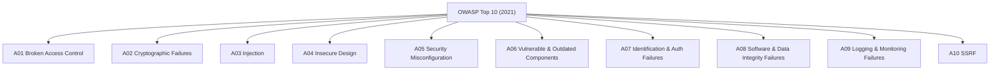
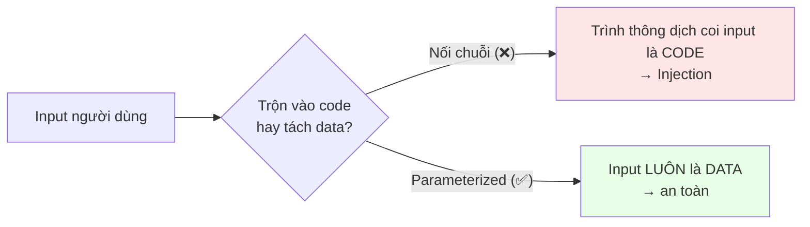
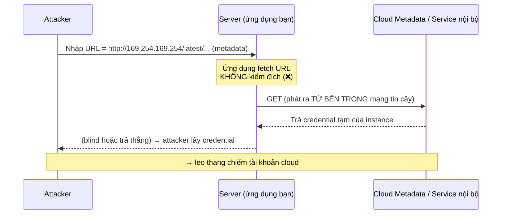

+++
title = "Backend Security — Tập 7: OWASP Top 10"
date = "2026-07-07T14:00:00+07:00"
draft = false
tags = ["backend", "security"]
series = ["Backend Security"]
+++

> **Đối tượng:** Backend Engineer, Senior Backend Engineer, Tech Lead, Solution Architect, Software Architect.
>
> **Mạch tư duy:** Asset → Threat → Attack → Vulnerability → Defense → Trade-off → Production Best Practice.
>
> OWASP Top 10 (phiên bản 2021) là danh sách các *hạng mục rủi ro* web phổ biến và nghiêm trọng nhất, do cộng đồng bảo mật ứng dụng tổng hợp từ dữ liệu thực tế. Đây **không** phải một checklist "làm xong là an toàn" — nó là bản đồ các *lớp lỗ hổng* mà mọi backend engineer phải nhận diện được. Với mỗi mục, ta đi theo bốn câu hỏi bạn yêu cầu: **Cơ chế → Attack → Demo → Phòng tránh**, kèm trade-off và case study.
>
> **Lưu ý về "Demo":** các ví dụ dưới đây trình bày *mẫu code có lỗ hổng và cách sửa* cho mục đích giáo dục phòng thủ. Chúng cố ý ở mức minh họa khái niệm, không phải công cụ khai thác hoàn chỉnh.

---

## 0. Cách đọc OWASP Top 10 đúng cách

Trước khi vào từng mục, ba tư tưởng nền:

1. **Đây là "risk categories", không phải "vulnerabilities" đơn lẻ.** "Injection" không phải một lỗi, mà là cả một họ (SQL, NoSQL, OS command, LDAP, XSS...). Hiểu *lớp* giúp bạn nhận ra biến thể mới.
2. **Thứ hạng phản ánh mức độ phổ biến + tác động thực tế.** Broken Access Control đứng #1 năm 2021 vì nó xuất hiện ở tỷ lệ ứng dụng cao nhất — không phải vì nó "mới".
3. **Nhiều mục là góc nhìn phân loại của các attack đã bàn ở Tập 1–6.** Ví dụ Broken Access Control = lỗi AuthZ (Tập 1), Cryptographic Failures liên quan password/TLS (Tập 3–4), Injection bao gồm XSS (Tập 5). OWASP cho ta một *ngôn ngữ chung* để nói về chúng.



---

## A01 — Broken Access Control (Kiểm soát truy cập bị phá vỡ)

### Cơ chế
Lỗi khi hệ thống **không thực thi đúng ràng buộc về việc người dùng được phép làm gì**. Người dùng đã xác thực (biết họ là ai — AuthN) nhưng hệ thống không kiểm tra đúng *quyền* (AuthZ) trên hành động/tài nguyên cụ thể. Đây là hiện thân trực tiếp của sự nhầm lẫn AuthN/AuthZ (Tập 1) và là **hạng #1** vì phổ biến nhất.

### Attack
- **IDOR / BOLA (Broken Object Level Authorization):** đổi ID trong request để truy cập tài nguyên người khác (`GET /api/orders/1002` → đổi thành `1003`).
- **Privilege escalation:** truy cập chức năng admin dù là user thường (đoán URL `/admin`, gọi thẳng API admin).
- **Vượt qua kiểm soát ở tầng UI:** UI ẩn nút nhưng API vẫn cho gọi.
- **Thao túng metadata:** sửa JWT claim/`role` field client gửi, force browsing tới endpoint không được liên kết.

### Demo (mẫu lỗ hổng → sửa)
```
# ❌ Lỗ hổng: chỉ kiểm ĐÃ ĐĂNG NHẬP, không kiểm SỞ HỮU
GET /api/orders/{id}
def get_order(id, user):
    return db.orders.find(id)         # trả về BẤT KỲ đơn hàng nào!

# ✅ Sửa: kiểm quyền sở hữu ở mức tài nguyên
def get_order(id, user):
    order = db.orders.find(id)
    if order.owner_id != user.id and not user.is_admin:
        raise Forbidden(403)          # từ chối nếu không sở hữu
    return order
```

### Phòng tránh
Mặc định **deny-all**. Thực thi authorization **phía server, trên mỗi request, ở mức tài nguyên**, đặt gần lớp dữ liệu để không bị bỏ sót. Không bao giờ dựa vào ID/role do client gửi. Dùng ID khó đoán (UUID) như phòng thủ *bổ sung* (không thay thế kiểm quyền). Kiểm thử authorization tự động (test với user A truy cập tài nguyên user B phải 403). **Trade-off:** kiểm quyền chi tiết tốn công thiết kế/hiệu năng; nhưng đây là rủi ro #1 — không thể tiết kiệm. Xem lại Tập 1 mục 6 (AuthN vs AuthZ) và Tập 6 (BOLA).

---

## A02 — Cryptographic Failures (Thất bại về mật mã)

### Cơ chế
Dữ liệu nhạy cảm không được bảo vệ đúng bằng mật mã — *đang truyền* (thiếu/yếu TLS) hoặc *khi lưu* (không mã hóa, thuật toán yếu, quản lý khóa sai). Trước 2021 gọi là "Sensitive Data Exposure"; đổi tên để nhấn *nguyên nhân gốc* là lỗi mật mã.

### Attack
- Nghe lén dữ liệu truyền plaintext/TLS yếu (Tập 4).
- Đánh cắp DB có mật khẩu hash yếu (MD5/SHA trần, không salt — Tập 3).
- Khai thác thuật toán lỗi thời (DES, RC4, ECB mode), khóa hard-code, IV tái sử dụng.
- Đọc dữ liệu nhạy cảm lưu plaintext (số thẻ, PII) khi DB/backup lộ.

### Demo (mẫu lỗ hổng → sửa)
```
# ❌ Lưu password bằng hàm nhanh, không salt
hash = sha256(password)                     # crack GPU tỷ/giây

# ✅ Hàm chuyên dụng, chậm, salt tự sinh
hash = argon2id(password)                   # hoặc bcrypt

# ❌ Mã hóa với chế độ ECB (lộ mẫu dữ liệu)  / khóa hard-code
# ✅ AES-GCM (AEAD: mã hóa + toàn vẹn), khóa từ KMS/secret manager
```

### Phòng tránh
Phân loại dữ liệu; **mã hóa in-transit (TLS 1.2/1.3, forward secrecy) và at-rest** cho dữ liệu nhạy cảm. Dùng thuật toán hiện đại đã kiểm chứng (AES-GCM/ChaCha20-Poly1305; Argon2/bcrypt cho password), **không tự chế mật mã**. Quản lý khóa qua **KMS/HSM/secret manager**, xoay khóa, không hard-code. Tối thiểu hóa dữ liệu thu thập/lưu (không lưu thì không lộ được). **Trade-off:** mã hóa at-rest + quản lý khóa tốn hạ tầng và độ phức tạp; nhưng dữ liệu không cần thì đừng lưu — đó là cách rẻ nhất. Xem Tập 3 (password) và Tập 4 (TLS).

---

## A03 — Injection

### Cơ chế
Xảy ra khi **dữ liệu do người dùng kiểm soát bị một trình thông dịch diễn giải thành CODE/lệnh thay vì DATA**. Bản chất chung cho SQL Injection, NoSQL, OS command, LDAP, và cả **XSS** (trình thông dịch là trình duyệt — Tập 5). Nguyên nhân gốc luôn là **trộn lẫn code và data**.

### Attack
- **SQL Injection:** chèn cú pháp SQL vào input để đọc/sửa/xóa dữ liệu, bypass đăng nhập, rút toàn bộ DB.
- **OS Command Injection:** chèn lệnh shell nếu input được nối vào lệnh hệ thống.
- **NoSQL Injection:** chèn toán tử truy vấn (`$ne`, `$gt`) vào query MongoDB.
- **XSS:** chèn script (đã bàn Tập 5).

### Demo (SQL Injection — mẫu lỗ hổng → sửa)
```
# ❌ Nối chuỗi trực tiếp — input thành CODE
query = "SELECT * FROM users WHERE email = '" + email + "'"
# input email = ' OR '1'='1  → trả về mọi user / bypass

# ✅ Prepared statement / parameterized query — input LUÔN là DATA
query = "SELECT * FROM users WHERE email = ?"
db.execute(query, [email])              # driver tách code khỏi data
```

### Phòng tránh
**Prepared statements / parameterized queries** (tuyến chính cho SQLi) — driver đảm bảo input không bao giờ được diễn giải là cú pháp. Dùng ORM đúng cách (cẩn thận raw query). **Output encoding theo ngữ cảnh** cho XSS (Tập 5). Validate input theo allowlist (kiểu, định dạng). Với OS command: tránh gọi shell, dùng API có tham số hóa, không nối chuỗi vào lệnh. **Least privilege cho DB user** (Injection thành công vẫn hạn chế thiệt hại). **Trade-off:** gần như không có — prepared statement vừa an toàn vừa thường nhanh hơn (query plan cache); không có lý do chính đáng để nối chuỗi. **Anti-pattern kinh điển:** "escape thủ công" input thay vì parameterize (luôn sót).



---

## A04 — Insecure Design (Thiết kế thiếu an toàn)

### Cơ chế
Hạng mục *mới* năm 2021, nhấn một sự thật quan trọng: **một số lỗ hổng nằm ở *thiết kế*, không phải ở *cài đặt*.** Bạn có thể code hoàn hảo, không bug, nhưng nếu *bản thiết kế* thiếu một kiểm soát an toàn (không có threat modeling, thiếu giới hạn nghiệp vụ), thì hệ thống vẫn không an toàn. Không thể "vá" một thiết kế sai bằng code sạch.

### Attack
- Lạm dụng *logic nghiệp vụ* hợp lệ về mặt kỹ thuật: đặt hàng số lượng âm để được hoàn tiền, dùng luồng reset mật khẩu thiếu giới hạn để chiếm tài khoản, lạm dụng khuyến mãi/điểm thưởng.
- Khai thác thiếu kiểm soát tốc độ/giới hạn ở tầng thiết kế (không có rate limit trên OTP → brute-force).
- Các luồng không lường trước ("chuyện gì xảy ra nếu bước 2 bị bỏ qua?").

### Demo (khái niệm, không phải code)
Một luồng "đổi email" thiết kế thiếu an toàn: cho đổi email mà **không xác nhận email cũ và không xác thực lại**. Về code có thể đúng hoàn toàn, nhưng *thiết kế* cho phép kẻ chiếm được phiên tạm đổi email → chiếm vĩnh viễn tài khoản. Lỗ hổng ở *quyết định thiết kế*, không ở dòng code nào.

### Phòng tránh
**Threat modeling ngay từ khâu thiết kế** (Tập 1 mục 2) — đây là phòng thủ chính. Xác định các *lạm dụng nghiệp vụ* (abuse cases), không chỉ use cases. Áp dụng **secure design patterns**, giới hạn nghiệp vụ (giới hạn số lần, giá trị hợp lệ, luồng bắt buộc theo thứ tự). Dùng **defense in depth** và **fail securely**. Review thiết kế có sự tham gia của security. **Trade-off:** threat modeling tốn thời gian của người đắt giá ở giai đoạn đầu — nhưng rẻ hơn nhiều so với sửa thiết kế sau khi đã build. **Bài học:** không có công cụ scan nào bắt được Insecure Design; chỉ tư duy tấn công ở khâu thiết kế mới bắt được.

---

## A05 — Security Misconfiguration (Cấu hình sai)

### Cơ chế
Hệ thống, framework, server, cloud, container bị **cấu hình không an toàn**: để mặc định nguy hiểm, bật tính năng thừa, thông báo lỗi lộ thông tin, không vá, permission rộng. Nghịch lý Defense in Depth (Tập 1): càng nhiều lớp/thành phần, càng nhiều chỗ cấu hình sai.

### Attack
- Truy cập trang admin/console mặc định với credential mặc định (admin/admin).
- Đọc **error message chi tiết** (stack trace lộ đường dẫn, version, query).
- Truy cập tài nguyên do **cloud storage cấu hình public** (bucket mở).
- Khai thác dịch vụ/cổng thừa đang bật; directory listing bật; CORS lỏng (Tập 5).
- Header bảo mật thiếu (HSTS, CSP, X-Content-Type-Options).

### Demo (mẫu lỗ hổng → sửa)
```
# ❌ Trả stack trace chi tiết cho client ở production
app.debug = True                            # lộ đường dẫn, version, query

# ✅ Production: log chi tiết ở server, trả lỗi generic cho client
app.debug = False
# client nhận: {"error": "Internal error", "id": "req-abc123"}
# server log: đầy đủ stack trace gắn với req-abc123
```

### Phòng tránh
**Hardening baseline** cho mọi môi trường; quy trình cấu hình *lặp lại được* (Infrastructure as Code). Vô hiệu hóa tính năng/cổng/tài khoản mặc định không dùng. **Không lộ thông tin trong error** cho client; log chi tiết ở server. Đặt **security headers** (HSTS, CSP, X-Content-Type-Options, ...). Quét cấu hình tự động (CIS Benchmarks, scanner cloud). Tách biệt rõ cấu hình dev/staging/prod. **Trade-off:** hardening tốn công thiết lập và có thể chặn tính năng tiện; nhưng IaC giúp lặp lại và audit. Xem Tập tiếp theo (**Server Security**) để đào sâu.

---

## A06 — Vulnerable & Outdated Components (Thành phần lỗi thời/có lỗ hổng)

### Cơ chế
Ứng dụng hiện đại được xây trên hàng trăm–nghìn thư viện/dependency bên thứ ba. Nếu một trong số đó có **lỗ hổng đã biết (CVE)** và bạn dùng phiên bản dính lỗi, thì bạn *thừa hưởng* lỗ hổng đó — dù code của bạn hoàn hảo. Đây là rủi ro **chuỗi cung ứng phần mềm (software supply chain)**.

### Attack
- Khai thác CVE công khai của một thư viện phổ biến bạn đang dùng (attacker quét hàng loạt site tìm version dính lỗi).
- Lỗ hổng trong dependency *gián tiếp* (transitive) mà bạn thậm chí không biết mình đang dùng.
- Component không còn được bảo trì (không có bản vá cho lỗ hổng mới).

### Demo (khái niệm)
Một lỗ hổng RCE nghiêm trọng trong một thư viện logging/serialization phổ biến (như các vụ Log4Shell, các CVE deserialization) cho phép attacker chỉ cần gửi một chuỗi đặc biệt để chạy code trên server — mọi ứng dụng dùng phiên bản dính lỗi đều bị ảnh hưởng, bất kể code ứng dụng viết tốt đến đâu.

### Phòng tránh
**Quản lý dependency chủ động:** duy trì **SBOM (Software Bill of Materials)** — biết chính xác mình dùng gì; quét lỗ hổng tự động (SCA: `npm audit`, Dependabot, Snyk, Trivy...) trong CI/CD; cập nhật/vá kịp thời, đặc biệt CVE nghiêm trọng. Loại bỏ dependency không dùng (giảm bề mặt). Chỉ lấy từ nguồn tin cậy, khóa version (lockfile), cân nhắc kiểm tra tính toàn vẹn package. **Trade-off:** cập nhật liên tục tốn công và có rủi ro breaking change; nhưng nợ bảo mật tích lũy nhanh và bị khai thác tự động. Liên quan A08 (Integrity Failures) về nguồn gốc component.

---

## A07 — Identification & Authentication Failures (Thất bại về định danh & xác thực)

### Cơ chế
Các lỗi trong việc xác nhận danh tính (AuthN — Tập 2): quản lý phiên yếu, cho phép mật khẩu yếu, thiếu chống brute-force, thiếu MFA, luồng khôi phục tài khoản hớ hênh. Trước 2021 xếp cao hơn ("Broken Authentication"); vẫn nghiêm trọng.

### Attack
- **Credential stuffing / brute-force** khi thiếu rate limit (Tập 6 mục 3).
- **Session hijacking/fixation** khi quản lý phiên yếu (Tập 2 mục 2).
- Cho phép mật khẩu phổ biến/rò rỉ; thiếu MFA → mật khẩu lộ là mất tài khoản.
- Luồng reset mật khẩu/OTP thiếu an toàn (token đoán được, không hết hạn).
- Lộ session id trong URL; không hủy phiên khi đăng xuất/đổi mật khẩu.

### Demo (mẫu lỗ hổng → sửa)
```
# ❌ Không giới hạn số lần thử → brute-force / stuffing
def login(email, pw): return check(email, pw)

# ✅ Rate limit + lockout mềm + MFA + kiểm mật khẩu rò rỉ
def login(email, pw, ctx):
    enforce_rate_limit(email, ctx.ip)        # 429 nếu vượt
    if check(email, pw):
        if breached_password(pw): warn_user()
        require_mfa_if_risky(ctx)             # step-up khi ngữ cảnh lạ
```

### Phòng tránh
Áp dụng đầy đủ Tập 2 và Tập 6: **MFA** (phòng thủ mạnh nhất), **rate limiting + lockout** cho login/OTP, session id ngẫu nhiên mạnh + tái tạo sau login + cờ cookie đầy đủ (Tập 5), token ngắn hạn + revocation, kiểm **mật khẩu rò rỉ** (breached password check), chính sách mật khẩu theo NIST (ưu tiên độ dài). Luồng khôi phục tài khoản phải an toàn (token ngẫu nhiên, hết hạn nhanh, không lộ tài khoản tồn tại). **Trade-off:** MFA/step-up thêm ma sát UX → dùng adaptive auth. Xem Tập 2, 3, 5, 6.

---

## A08 — Software & Data Integrity Failures (Thất bại về toàn vẹn)

### Cơ chế
Hạng mục *mới* 2021: hệ thống tin vào **code, dữ liệu, hoặc bản cập nhật mà không kiểm chứng tính toàn vẹn/nguồn gốc**. Bao gồm cả **insecure deserialization** (trước đây là mục riêng) và các rủi ro **CI/CD pipeline**.

### Attack
- **Insecure deserialization:** ứng dụng deserialize dữ liệu không tin cậy → attacker chế payload gây RCE hoặc thao túng object.
- **Cập nhật/plugin không ký:** attacker chèn code độc vào bản cập nhật auto-update không verify chữ ký.
- **CI/CD bị xâm nhập / dependency bị đầu độc** (supply chain): build server hoặc package bị chèn code độc.
- Tin dữ liệu từ nguồn không xác thực (JWT `alg:none` cũng thuộc lớp này — Tập 2).

### Demo (khái niệm)
Một pipeline CI/CD kéo dependency từ registry công khai *không kiểm tra chữ ký/hash*; attacker publish một package độc trùng tên (typosquatting) hoặc chiếm package hợp pháp → code độc chạy trên build server và lọt vào sản phẩm. Hoặc: ứng dụng deserialize một object Java/Python từ input người dùng → gadget chain dẫn tới thực thi code.

### Phòng tránh
**Xác minh chữ ký số** cho cập nhật, plugin, artifact (chỉ chạy code đã ký từ nguồn tin cậy). **Không deserialize dữ liệu không tin cậy**; nếu buộc phải, dùng định dạng dữ liệu thuần (JSON) với schema validation, tránh deserialization đối tượng tùy ý. Bảo vệ **CI/CD**: kiểm soát truy cập chặt, secret an toàn, kiểm tra tính toàn vẹn dependency (lockfile + hash), ký artifact build (SLSA, provenance). Kiểm tra chữ ký JWT đúng (Tập 2). **Trade-off:** ký/verify artifact và bảo vệ pipeline tốn hạ tầng; nhưng chuỗi cung ứng là mục tiêu tấn công tăng nhanh. Liên quan chặt A06.

---

## A09 — Security Logging & Monitoring Failures (Thiếu ghi log & giám sát)

### Cơ chế
Không phải một *lỗ hổng cho phép tấn công*, mà là **lỗ hổng khiến bạn không *phát hiện* được tấn công** — và khi bị tấn công, không điều tra được. Thiếu log, log không đủ, không giám sát, không cảnh báo → attacker hoạt động trong bóng tối hàng tháng (dwell time cao).

### Attack
Bản thân mục này không bị "tấn công trực tiếp"; hậu quả là **mọi tấn công khác trở nên vô hình**: brute-force không bị phát hiện vì không log lần thử thất bại; rò rỉ dữ liệu âm thầm; sau sự cố không có log để biết *cái gì đã bị chạm tới*. Thời gian phát hiện xâm nhập trung bình trong ngành thường tính bằng *tháng* — phần lớn do logging/monitoring yếu.

### Demo (khái niệm)
Attacker thử 100.000 mật khẩu trên endpoint login. Nếu hệ thống **không log các lần đăng nhập thất bại** và **không cảnh báo** khi tỷ lệ thất bại tăng vọt, cuộc tấn công diễn ra hoàn toàn im lặng cho tới khi một tài khoản bị chiếm và khách hàng khiếu nại. Với log + alert đúng, đợt tăng đột biến đã kích hoạt cảnh báo trong vài phút.

### Phòng tránh
Log các **sự kiện bảo mật quan trọng**: đăng nhập (thành công/thất bại), thay đổi quyền, truy cập dữ liệu nhạy cảm, thao tác admin, lỗi validation/authorization (401/403), các quyết định của policy engine (Tập 1). Log phải đủ ngữ cảnh (ai, hành động, tài nguyên, kết quả, thời gian, correlation ID). **Tập trung log (SIEM), cảnh báo thời gian thực** cho mẫu bất thường, và **bảo vệ log** (append-only, không cho attacker xóa dấu vết — phục vụ Non-repudiation/STRIDE). **KHÔNG log dữ liệu nhạy cảm** (mật khẩu, token, PII, số thẻ) — chính log lại thành chỗ rò rỉ. Có **incident response plan**. **Trade-off:** log nhiều tốn storage/chi phí và có rủi ro lộ nếu log sai dữ liệu; cần cân bằng độ chi tiết và bảo vệ. Đây là điều kiện tiên quyết để *vận hành* mọi phòng thủ khác.

---

## A10 — SSRF (Server-Side Request Forgery)

### Cơ chế
Xảy ra khi ứng dụng **lấy một tài nguyên từ URL do người dùng cung cấp mà không kiểm soát đích đến**. Attacker khiến *server của bạn* gửi request tới đích mà *họ* chọn — thường là **tài nguyên nội bộ** mà attacker không truy cập trực tiếp được. Server trở thành "proxy" bất đắc dĩ, vượt qua firewall vì request phát ra *từ bên trong* mạng tin cậy.

Đây là ví dụ đắt giá cho bài học Zero Trust (Tập 1): mạng nội bộ "phẳng và tin nhau" khiến SSRF cực kỳ nguy hiểm — server bị lợi dụng có thể chạm tới mọi thứ bên trong.

### Attack
- Truy cập **metadata endpoint của cloud** (IP nội bộ đặc biệt) để lấy **credential tạm của instance** → leo thang chiếm tài khoản cloud. Đây là kịch bản SSRF nghiêm trọng và phổ biến nhất.
- Quét mạng nội bộ, truy cập service nội bộ (database, admin panel) không phơi ra Internet.
- Đọc file cục bộ (`file://`), gọi các scheme khác.
- Dùng server làm bàn đạp tấn công bên thứ ba.

### Demo (mẫu lỗ hổng → sửa)
```
# ❌ Fetch URL người dùng cung cấp không kiểm soát
def fetch_avatar(url):
    return http.get(url)          # url = http://169.254.169.254/... → lộ credential cloud
                                  # url = http://internal-db:5432 → chạm service nội bộ

# ✅ Allowlist đích + chặn IP nội bộ + validate sau khi resolve DNS
def fetch_avatar(url):
    host = validate_scheme_and_host(url)     # chỉ http/https, domain allowlist
    ip = resolve(host)
    if is_private_or_link_local(ip):         # chặn 10./172.16/192.168/127./169.254.
        raise Forbidden
    return http.get(url, allow_redirects=False)  # chặn redirect vòng nội bộ
```

### Phòng tránh
**Allowlist** các đích được phép (mạnh nhất) thay vì blocklist. **Chặn dải IP nội bộ/link-local/loopback** — và validate *sau khi resolve DNS* để tránh **DNS rebinding** (domain hợp lệ trỏ tới IP nội bộ). Vô hiệu hóa các scheme không cần (`file://`, `gopher://`), **chặn redirect** hoặc validate lại mỗi hop. Bảo vệ **metadata endpoint cloud** (dùng IMDSv2 yêu cầu token — chống SSRF lấy credential). Áp dụng **network segmentation** (Zero Trust) để server ứng dụng không tùy tiện chạm tài nguyên nội bộ nhạy cảm. Không trả nguyên văn response về client (chống blind SSRF exfiltration). **Trade-off:** allowlist chặt có thể cản tính năng hợp lệ (fetch URL tùy ý); nhưng SSRF dẫn thẳng tới chiếm cloud — cực kỳ nghiêm trọng.



---

## Tổng kết Tập 7 — OWASP Top 10 là bản đồ, không phải checklist

Mười hạng mục này không rời rạc — chúng đan vào nhau và nối lại toàn bộ các tập trước:

- **A01 Broken Access Control** = lỗi AuthZ (Tập 1), BOLA (Tập 6). Hạng #1 vì phổ biến nhất.
- **A02 Cryptographic Failures** = password yếu (Tập 3) + TLS yếu (Tập 4) + quản lý khóa sai.
- **A03 Injection** = trộn code & data; bao gồm SQLi và XSS (Tập 5). Phòng bằng parameterization + encoding.
- **A04 Insecure Design** = lỗ hổng ở *thiết kế*, chỉ threat modeling (Tập 1) mới bắt được.
- **A05 Security Misconfiguration** = nghịch lý Defense in Depth; đào sâu ở Server Security (tập sau).
- **A06 Vulnerable Components** & **A08 Integrity Failures** = rủi ro chuỗi cung ứng; quản lý dependency + ký/verify.
- **A07 Auth Failures** = toàn bộ Tập 2 + rate limiting (Tập 6) + MFA.
- **A09 Logging Failures** = điều kiện *phát hiện* mọi tấn công khác; không có nó, bạn mù.
- **A10 SSRF** = server bị biến thành proxy vào mạng nội bộ; minh chứng vì sao cần Zero Trust + segmentation.

Điều quan trọng nhất: **đừng coi đây là danh sách để "tick".** Hãy dùng nó như một tập các *lăng kính tấn công* để soi lại thiết kế của bạn — với mỗi tính năng, hỏi: nó có thể bị Broken Access Control không? Injection không? Có kiểm soát đích cho mọi lời gọi ra ngoài (SSRF) không? Có log đủ để phát hiện lạm dụng không? Tư duy đó — không phải checklist — mới là thứ giúp hệ thống production sống sót.

Các tập tiếp theo sẽ đào sâu **Server Security** (hardening, secret, container, WAF — bổ trợ A05), **API Security Best Practices** (tổng hợp phòng thủ vận hành), và **Kiến trúc thực tế** (áp dụng tất cả vào e-commerce, banking, fintech, SaaS, microservices).
