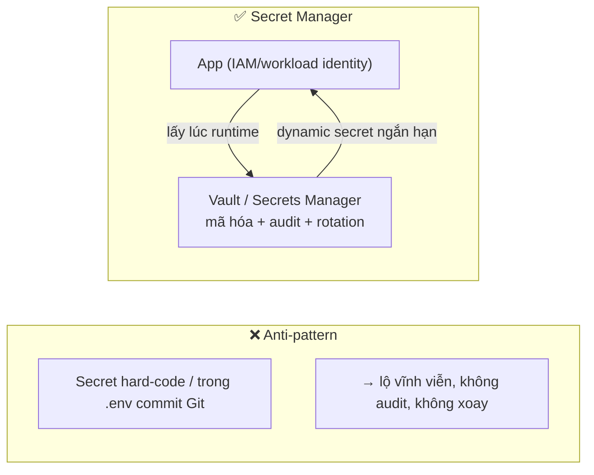
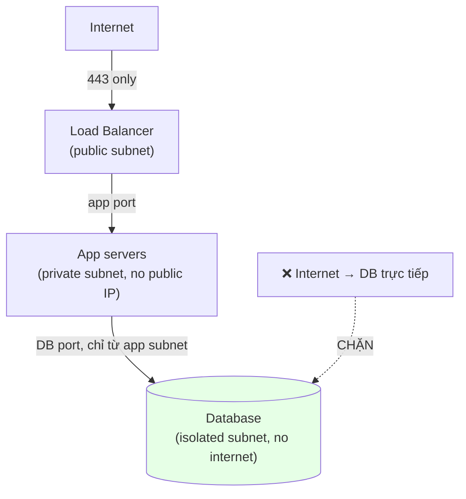
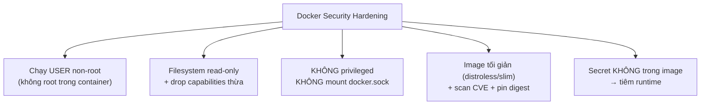
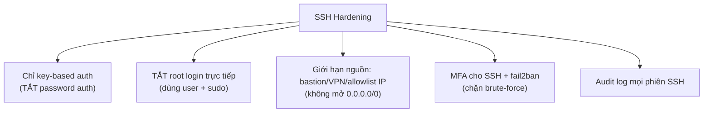

+++
title = "Backend Security — Tập 8: Server Security"
date = "2026-07-07T15:00:00+07:00"
draft = false
tags = ["backend", "security"]
series = ["Backend Security"]
+++

> **Đối tượng:** Backend Engineer, Senior Backend Engineer, Tech Lead, Solution Architect, Software Architect.
>
> **Mạch tư duy:** Asset → Threat → Attack → Vulnerability → Defense → Trade-off → Production Best Practice.
>
> Các tập trước bảo vệ *ứng dụng*. Tập này bảo vệ *nền tảng chạy ứng dụng*: máy chủ, mạng, container, secret. Nó đào sâu A05 (Security Misconfiguration) của OWASP. Tư tưởng xuyên suốt: **giảm bề mặt tấn công (attack surface) và giới hạn bán kính vụ nổ (blast radius)** — mỗi cổng mở, mỗi secret hớ hênh, mỗi container quyền cao là một cánh cửa cho attacker.

---

## 0. First Principles: Ứng dụng an toàn trên một nền tảng hớ hênh vẫn bị đánh sập

Bạn có thể viết code hoàn hảo, dùng Argon2, TLS 1.3, kiểm quyền chặt chẽ — và vẫn bị chiếm toàn bộ hệ thống nếu: secret nằm trong biến môi trường bị lộ qua một trang lỗi, container chạy quyền root bị escape ra host, SSH mở cho cả thế giới với mật khẩu yếu, hay một cổng database quên đóng phơi ra Internet.

Server security dựa trên hai nguyên tắc nền (nối lại Tập 1):

> **Giảm bề mặt tấn công:** mọi thứ *không cần thiết* — cổng, dịch vụ, tài khoản, quyền, package — đều là cửa cho attacker. Tắt hết những gì không dùng.
>
> **Giới hạn bán kính vụ nổ:** giả định *một* thành phần sẽ bị chiếm. Thiết kế sao cho khi điều đó xảy ra, attacker không lan được ra toàn hệ thống (Least Privilege + segmentation + isolation).

Mọi chủ đề dưới đây — hardening, secret, firewall, container, SSH — đều là hiện thực của hai nguyên tắc này.

---

## 1. Secret Management — trái tim của server security

### 1.1. Problem Statement
Ứng dụng cần các **secret**: mật khẩu DB, API key, khóa ký JWT, khóa mã hóa, chứng chỉ. Câu hỏi: lưu chúng ở đâu và cấp cho ứng dụng thế nào mà **không để lộ**? Đây là bài toán trung tâm, vì hầu hết các vụ xâm nhập nghiêm trọng đều đi qua một secret bị lộ (nối A02/A05/A07 của OWASP, và Least Privilege ở Tập 1).

### 1.2. Threat Model & Attack
- Secret **hard-code trong source** → commit lên Git → bot quét thấy trong vài phút (Tập 6).
- Secret trong **file config không bảo vệ**, trong **image Docker** (nằm trong layer, `docker history` đọc được), trong **log** (in ra khi debug), trong **error/stack trace** trả về client.
- Secret **sống vĩnh viễn** không xoay → một lần lộ là dùng được mãi.
- Insider đọc được secret vì quyền quá rộng.

### 1.3. Defense — dùng Secret Manager chuyên dụng
Giải pháp đúng: một **secret manager** tập trung (HashiCorp Vault, AWS Secrets Manager, GCP Secret Manager, Azure Key Vault). Ứng dụng *lấy secret lúc runtime* qua danh tính đã xác thực (IAM role, workload identity), thay vì secret nằm tĩnh trong code/config. Lợi ích: **mã hóa at-rest, kiểm soát truy cập chi tiết (audit ai đọc secret nào), xoay tự động (rotation), thu hồi tập trung, và secret động (dynamic secret** — credential ngắn hạn cấp theo yêu cầu, tự hết hạn).

### 1.4–1.10. Trade-off, Best Practice, Anti-pattern
**Best practice:** không bao giờ secret trong source/image/log; lấy từ secret manager qua danh tính workload; **xoay định kỳ và tự động**; ưu tiên **dynamic secret ngắn hạn**; scope hẹp (Least Privilege — app chỉ đọc được secret của nó); **secret scanning** trong CI (chặn commit chứa secret); mã hóa secret ở mọi tầng. **Trade-off:** secret manager thêm hạ tầng, độ phức tạp, và một điểm phụ thuộc (nếu Vault down, app không lấy được secret → cần HA); nhưng lợi ích áp đảo. **Anti-pattern:** `.env` commit Git; secret trong biến môi trường mà lại in ra log/error; một secret dùng chung mọi service; secret không bao giờ xoay; gửi secret qua Slack/email. **Case study:** vô số vụ xâm nhập lớn bắt đầu từ một access key cloud lộ trong repo/artifact — vì key quyền rộng + không xoay, attacker chiếm toàn bộ tài khoản cloud. Bài học: **secret sẽ lộ; hãy làm cho việc lộ có hậu quả tối thiểu (scope hẹp) và ngắn ngủi (rotation/dynamic).**

---

## 2. Environment Variables — tiện nhưng không phải "két sắt"

### 2.1. Problem Statement & bản chất
Biến môi trường (env var) là cách phổ biến để cấp cấu hình/secret cho ứng dụng (theo triết lý 12-factor app). Chúng tiện: tách config khỏi code, dễ thay theo môi trường. Nhưng cần hiểu rõ: **env var là nơi *chứa* secret ở runtime, không phải nơi *bảo vệ* secret.** Chúng có những rò rỉ tinh vi.

### 2.2. Threat & các đường rò rỉ của env var
- **Process khác/child process kế thừa env** → một thư viện hay subprocess có thể đọc.
- **Lộ qua trang lỗi/debug** (nhiều framework in cả env trong stack trace/health page).
- **Lộ qua log** khi ai đó `print(os.environ)` để debug.
- Nằm trong **file `.env`** dễ bị commit hoặc để permission rộng.
- Đọc được qua `/proc/<pid>/environ` nếu attacker có chỗ đứng trên host.

### 2.3–2.10. Best Practice & Anti-pattern
**Best practice:** dùng env var để *tham chiếu* tới secret manager (ví dụ env chứa *đường dẫn/ID* của secret, app tự fetch), hoặc để env được *tiêm lúc runtime* từ secret manager thay vì lưu tĩnh; đặt permission chặt cho file `.env` (600, chủ sở hữu app); **không bao giờ commit `.env`** (thêm vào `.gitignore`); không log/không trả env ra client; tắt debug ở production (A05). **Anti-pattern:** coi env var là an toàn tuyệt đối; secret lâu dài trong env không xoay; `.env` trong repo/image; in env để debug rồi quên. **Trade-off:** env var đơn giản và phổ biến; kết hợp với secret manager (inject runtime) là điểm cân bằng tốt giữa tiện lợi và an toàn.

---

## 3. Firewall & Network Segmentation — chỉ mở đúng cửa cần mở

### 3.1. Problem Statement
Mỗi cổng/dịch vụ phơi ra mạng là một bề mặt tấn công. Không kiểm soát mạng = database, cache, admin panel, cổng nội bộ vô tình mở ra Internet. Firewall và segmentation trả lời: **luồng mạng nào được phép đi từ đâu tới đâu?**

### 3.2. Cách hoạt động & tư duy
- **Firewall (Security Group / NACL / iptables):** mặc định **deny-all inbound**, chỉ mở cổng thực sự cần (443 cho web, không mở 5432 DB ra Internet). Giới hạn nguồn (chỉ cho phép IP/subnet cụ thể).
- **Network Segmentation:** chia hệ thống thành các vùng (public subnet cho load balancer, private subnet cho app, isolated subnet cho DB). Database *không* có đường ra Internet và chỉ chấp nhận kết nối từ subnet app. Đây là hiện thực **Defense in Depth + Zero Trust** ở tầng mạng (Tập 1): chống lateral movement — server web bị chiếm không tự động chạm được DB nếu không đúng luồng cho phép.

### 3.3–3.10. Best Practice & Anti-pattern
**Best practice:** deny-all mặc định, allowlist tối thiểu; database/cache/service nội bộ **không phơi ra Internet**; egress filtering (kiểm soát cả luồng *ra* — chống SSRF exfiltration và malware call-home); segmentation theo tier/độ nhạy; định kỳ rà cổng mở (port scan chính mình). **Anti-pattern:** `0.0.0.0/0` cho cổng DB/admin (mở toàn thế giới); mạng nội bộ phẳng tin nhau tuyệt đối (vỏ cứng ruột mềm — Tập 1); chỉ lọc inbound, bỏ mặc egress. **Case study:** vô số vụ lộ dữ liệu do database (MongoDB/Elasticsearch/Redis) phơi ra Internet không mật khẩu — bot quét toàn Internet tìm các cổng này. Bài học: **không dịch vụ dữ liệu nào được phép nghe trực tiếp từ Internet.**

---

## 4. Reverse Proxy — lớp trung gian kiểm soát và che chắn

### 4.1. Problem Statement & vai trò
**Reverse proxy** (Nginx, Envoy, HAProxy, hoặc API Gateway/CDN) đứng *trước* app server, nhận mọi request từ Internet và chuyển tiếp vào. Nó không phải công cụ bảo mật đơn thuần, nhưng là **điểm kiểm soát tập trung** lý tưởng để đặt nhiều phòng thủ và **che giấu/cô lập** app server khỏi tiếp xúc trực tiếp Internet.

### 4.2. Vai trò bảo mật
- **TLS termination** (Tập 4): tập trung xử lý HTTPS, quản lý chứng chỉ một chỗ.
- **Che giấu topology:** app server không có IP public, chỉ proxy tiếp xúc Internet → giảm bề mặt.
- Điểm đặt **rate limiting, WAF, request size limit, header hygiene** (thêm security header, loại bỏ header lộ thông tin như `Server`/`X-Powered-By`).
- **Load balancing + health check** (Availability).

### 4.3–4.10. Best Practice & Anti-pattern
**Best practice:** app server chỉ chấp nhận kết nối *từ proxy* (không public); bảo vệ chặng proxy→app (mTLS nội bộ nếu qua mạng không tin cậy — Tập 4); đặt security header và giới hạn kích thước request tại proxy; ẩn header lộ version. **Anti-pattern:** để app server vừa sau proxy vừa mở port public (bypass được proxy → bỏ qua mọi phòng thủ); tin tưởng mù quáng header `X-Forwarded-For` (attacker giả IP để bypass rate limit/allowlist — chỉ tin XFF từ proxy tin cậy); proxy cấu hình sai làm lộ request smuggling. **Trade-off:** thêm một hop (độ trễ nhỏ) và một thành phần phải vận hành/bảo mật; đổi lại điểm kiểm soát tập trung rất giá trị.

---

## 5. WAF (Web Application Firewall) — lá chắn tầng ứng dụng, không phải phao cứu sinh

### 5.1. Problem Statement & vai trò
**WAF** lọc HTTP request để chặn các mẫu tấn công tầng ứng dụng (SQLi, XSS, path traversal, các payload OWASP) *trước khi* chúng tới app. Nó là một *lớp* trong Defense in Depth — hữu ích, nhưng cần hiểu đúng giới hạn.

### 5.2. Hiểu đúng: WAF là lớp bổ sung, KHÔNG thay thế secure coding
> **WAF có thể bị bypass** (encoding lạ, kỹ thuật obfuscation, tấn công tầng logic mà WAF không hiểu). Nó **không** sửa lỗ hổng gốc; nó chỉ *lọc* các mẫu đã biết. Một ứng dụng dựa WAF thay vì parameterized query vẫn có SQLi — chỉ là bị che.

Đúng như nguyên tắc "không tin lớp trước" của Defense in Depth (Tập 1): dù có WAF, app vẫn phải dùng prepared statement, output encoding, input validation.

### 5.3–5.10. Best Practice & Anti-pattern
**Best practice:** dùng WAF như *một lớp* (chặn nhiễu/tấn công tự động phổ biến, virtual patching tạm thời cho CVE khi chưa kịp vá code); tinh chỉnh rule để giảm false positive (chặn nhầm user thật là vấn đề Availability); dùng chế độ **detection trước, blocking sau**; kết hợp rate limiting và bot management. **Anti-pattern:** coi WAF là "đã bảo mật xong" và bỏ qua secure coding; bật rule quá gắt gây chặn nhầm; không cập nhật/tinh chỉnh rule. **Trade-off:** WAF thêm độ trễ, chi phí, và công tinh chỉnh; giá trị lớn nhất là *virtual patching* và chặn tấn công tự động, nhưng không bao giờ là tuyến duy nhất.

---

## 6. Container & Docker Security — cô lập, và đừng chạy như root

### 6.1. Problem Statement
Container chia sẻ **kernel của host** (khác máy ảo có kernel riêng). Điều này khiến container nhẹ và nhanh, nhưng cũng nghĩa là **cô lập yếu hơn VM**: một container bị chiếm, nếu chạy quyền cao và cấu hình lỏng, có thể **escape ra host** và chiếm mọi container khác. Bài toán: cô lập workload và giới hạn bán kính vụ nổ.

### 6.2. Threat & Attack
- **Container escape:** khai thác container privileged / mount nhạy cảm / kernel vuln để thoát ra host.
- **Chạy như root trong container:** nếu escape, có root trên host.
- **Image độc/lỗ hổng:** base image có CVE hoặc chứa malware/secret.
- **Secret nằm trong image layer** (đọc qua `docker history`).
- **Docker socket** (`/var/run/docker.sock`) mount vào container = trao quyền kiểm soát toàn bộ host.

### 6.3. Defense — Docker hardening

### 6.4–6.10. Best Practice & Anti-pattern
**Best practice:** `USER` non-root trong Dockerfile; drop mọi Linux capability không cần (`--cap-drop=ALL` rồi thêm lại cái cần); filesystem read-only + tmpfs cho ghi tạm; **không** `--privileged`, không mount `docker.sock`; base image tối giản (distroless/alpine slim), **pin theo digest** không dùng `latest`; **scan image** (Trivy, Grype) trong CI; secret tiêm runtime, không nằm trong layer; giới hạn resource (chống DoS). **Anti-pattern:** container chạy root; `--privileged`; mount docker socket; image khổng lồ nhiều package thừa (bề mặt lớn); secret trong `ENV`/layer; dùng `latest` (không tái lập được, khó biết đang chạy gì). **Trade-off:** hardening (read-only, non-root, drop cap) đôi khi làm app cần chỉnh để chạy đúng; đó là chi phí xứng đáng cho cô lập.

---

## 7. Kubernetes Security — cô lập ở quy mô cụm

### 7.1. Problem Statement
Kubernetes điều phối hàng trăm–nghìn container. Nó thêm nhiều bề mặt tấn công mới: API server (bộ não cụm), RBAC, network giữa các pod (mặc định **phẳng** — mọi pod nói chuyện được với mọi pod), secret, và cấu hình workload. Bài toán: áp Least Privilege + segmentation + Zero Trust vào một môi trường động và phức tạp.

### 7.2. Các trụ cột phòng thủ
- **RBAC chặt:** phân quyền tối thiểu cho user và service account; không dùng `cluster-admin` bừa bãi; mỗi workload một service account scope hẹp.
- **NetworkPolicy:** mặc định mạng pod là *phẳng và mở* — phải áp NetworkPolicy **default-deny** rồi allowlist luồng cần (chống lateral movement — Zero Trust).
- **Pod Security (Standards/admission):** cấm pod privileged, cấm host namespace/hostPath, ép non-root, drop capabilities — thực thi qua admission controller (Pod Security Admission, OPA/Gatekeeper, Kyverno).
- **Secret:** K8s Secret mặc định chỉ *base64* (không mã hóa!) — bật **encryption at-rest cho etcd** và/hoặc dùng external secret manager; hạn chế quyền đọc secret.
- **API server & etcd:** bảo vệ nghiêm ngặt (đây là bộ não — chiếm được là chiếm cụm); mTLS nội bộ; audit logging bật.
- **Image & supply chain:** admission chỉ cho phép image đã ký/đã scan từ registry tin cậy.

### 7.3–7.10. Best Practice & Anti-pattern
**Best practice:** default-deny NetworkPolicy; RBAC tối thiểu; Pod Security Standards mức `restricted`; mã hóa secret at-rest (etcd) hoặc external secret manager; audit log API server; quét image + admission control; cập nhật cụm/vá CVE; cân nhắc service mesh (mTLS tự động — Tập 4). **Anti-pattern:** RBAC `cluster-admin` cho mọi thứ; không NetworkPolicy (pod tự do nói chuyện); pod privileged/hostPath; tin K8s Secret là "đã mã hóa" (nó chỉ base64); phơi API server ra Internet không kiểm soát; container root. **Trade-off:** Kubernetes hardening phức tạp và tốn chuyên môn; với hệ thống nhỏ có thể là quá tải — nhưng ở quy mô lớn, thiếu nó nghĩa là một pod bị chiếm có thể lan ra cả cụm.

---

## 8. File Permission — nguyên tắc tối thiểu ở tầng hệ điều hành

### 8.1. Problem Statement & Attack
Quyền file/thư mục sai là con đường leo thang đặc quyền cổ điển trên host: file cấu hình chứa secret cho ai đọc cũng được; file/thư mục *ghi được* bởi user không nên có quyền → attacker sửa script chạy bởi user cao hơn; file **SUID/SGID** cấu hình sai → chạy quyền chủ sở hữu (thường root).

### 8.2–8.10. Best Practice & Anti-pattern
**Best practice:** áp **Least Privilege** cho file — secret/config nhạy cảm chỉ chủ sở hữu đọc (`600`/`640`); thư mục ứng dụng không ghi được bởi user chạy app (chống ghi đè code); tránh `777`; kiểm soát SUID/SGID (rà soát binary có bit này); service chạy dưới **user riêng, quyền tối thiểu**, không root; filesystem read-only khi có thể (đặc biệt container). **Anti-pattern:** `chmod 777` "cho nhanh"; secret file world-readable; app chạy root ghi được chính binary của nó; SUID bừa bãi. **Case study:** nhiều lỗ hổng leo thang đặc quyền cục bộ khai thác đúng file/thư mục quyền lỏng để chuyển từ user thường lên root. **Trade-off:** gần như không — permission chặt là "miễn phí" về hiệu năng, chỉ tốn kỷ luật.

---

## 9. SSH Hardening — cửa quản trị, mục tiêu tấn công số một

### 9.1. Problem Statement
SSH là cửa vào để quản trị server — và vì thế là mục tiêu bị dò (brute-force) liên tục bởi bot toàn Internet. Một SSH cấu hình lỏng (mật khẩu yếu, mở cho cả thế giới, cho root đăng nhập) là con đường trực tiếp để chiếm server.

### 9.2. Defense — SSH hardening checklist tư duy

### 9.3–9.10. Best Practice & Anti-pattern
**Best practice:** **key-based authentication**, tắt hoàn toàn password auth (loại bỏ brute-force mật khẩu); **tắt root login** (`PermitRootLogin no`), đăng nhập bằng user thường rồi `sudo`; giới hạn truy cập SSH qua **bastion host/VPN** và allowlist IP (không phơi SSH ra toàn Internet); **MFA** cho SSH; `fail2ban` chặn IP dò; đổi/khóa key rời nhân sự kịp thời (quản lý vòng đời key); audit log; cân nhắc SSH certificate (key ngắn hạn, ký bởi CA nội bộ) thay vì key tĩnh vĩnh viễn; ưu tiên **không SSH** (immutable infrastructure — thay vì sửa server, thay server mới) khi có thể. **Anti-pattern:** password auth bật; root login trực tiếp; SSH mở `0.0.0.0/0`; key dùng chung/không xoay; không MFA, không giám sát; port-knocking/đổi port coi như bảo mật (security by obscurity — chỉ giảm nhiễu). **Trade-off:** bastion/VPN + MFA thêm ma sát cho admin; nhưng SSH là cửa quyền cao nhất — xứng đáng bảo vệ gắt nhất.

---

## Tổng kết Tập 8 — Nền tảng an toàn cho ứng dụng an toàn

Server security là tầng mà nếu bỏ trống, mọi công sức bảo mật ứng dụng ở các tập trước có thể trở nên vô nghĩa. Hai nguyên tắc nền quán xuyến tất cả:

- **Giảm bề mặt tấn công:** tắt cổng/dịch vụ/tài khoản/package thừa; database không phơi Internet; SSH không mở cho cả thế giới; image tối giản.
- **Giới hạn bán kính vụ nổ:** Least Privilege ở mọi tầng (secret scope hẹp, file permission, container non-root, RBAC K8s); segmentation mạng và NetworkPolicy chống lateral movement; cô lập container/pod.

Những điểm cốt lõi cần mang theo:

- **Secret sẽ lộ** — dùng secret manager, scope hẹp, rotation/dynamic secret để việc lộ có hậu quả tối thiểu. Đừng bao giờ để secret trong source/image/log.
- **Env var chứa, không bảo vệ** secret — kết hợp với secret manager và tránh các đường rò rỉ (log, error page, `.env` commit).
- **Firewall + segmentation** là hiện thực Zero Trust ở tầng mạng; không dịch vụ dữ liệu nào nghe trực tiếp từ Internet; kiểm soát cả egress.
- **Reverse proxy** là điểm kiểm soát tập trung và lớp che chắn; **WAF** là *một lớp* bổ sung, không thay thế secure coding (có thể bị bypass).
- **Container/K8s**: chia sẻ kernel → cô lập yếu hơn VM; đừng chạy root, đừng privileged, đừng mount docker socket; mạng pod mặc định phẳng → phải default-deny; K8s Secret chỉ base64 → phải mã hóa at-rest.
- **File permission & SSH**: Least Privilege ở tầng OS; SSH key-only + no-root + bastion + MFA.

Tập tiếp theo (**API Security Best Practices**) tổng hợp các phòng thủ vận hành ở tầng API thành một bộ nguyên tắc thực hành, trước khi tập cuối áp toàn bộ vào **các kiến trúc thực tế**.
