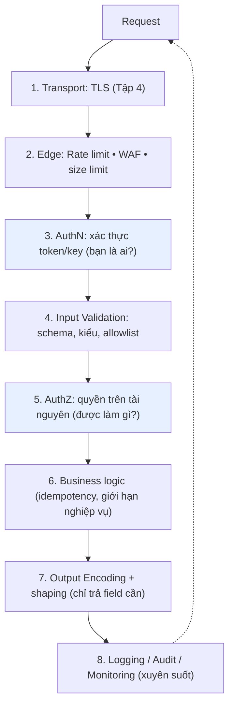

+++
title = "Backend Security — Tập 9: API Security Best Practices"
date = "2026-07-07T16:00:00+07:00"
draft = false
tags = ["backend", "security"]
series = ["Backend Security"]
+++

> **Đối tượng:** Backend Engineer, Senior Backend Engineer, Tech Lead, Solution Architect, Software Architect.
>
> **Mạch tư duy:** Asset → Threat → Attack → Vulnerability → Defense → Trade-off → Production Best Practice.
>
> Tập 6 giải thích *cơ chế* các phòng thủ API đặc thù. Tập này tổng hợp chúng thành một **bộ nguyên tắc thực hành vận hành** — thứ tự áp dụng, cách chúng khớp vào vòng đời một request, và những nguyên tắc thường bị bỏ sót. Đây là "sổ tay checklist có tư duy" trước khi bước sang các kiến trúc thực tế ở tập cuối.

---

## 0. First Principles: Một request đi qua những trạm phòng thủ nào

Thay vì học rời rạc từng best practice, hãy hình dung **hành trình của một request** qua các trạm kiểm soát. Mỗi trạm là một lớp Defense in Depth, và thứ tự rất quan trọng: rẻ-trước-đắt-sau (chặn sớm những gì chặn được rẻ), và không-tin-lớp-trước.

Ba nguyên tắc điều phối toàn bộ: **(1) validate ở biên, thực thi ở lõi** — chặn rác sớm nhưng quyết định quyền gần dữ liệu; **(2) default-deny** ở mọi trạm; **(3) không tin lớp trước** — mỗi trạm tự bảo vệ, không giả định trạm trước đã lọc sạch.

---

## 1. Authentication — xác thực đúng và nhất quán

**Nguyên tắc:** xác thực **mọi** endpoint (trừ endpoint công khai có chủ đích, vẫn rate-limit). Dùng cơ chế phù hợp bối cảnh (token cho user, mTLS/client-credentials cho service, API key cho định danh app — Tập 2, 6).

**Best practice:** token ngắn hạn + refresh có rotation (Tập 2); xác thực ở **API Gateway** làm tuyến đầu nhưng **service vẫn không tin mù quáng** (Zero Trust — Tập 1); ép thuật toán JWT, kiểm `exp/aud/iss`; hỗ trợ MFA/step-up cho hành động nhạy cảm.

**Anti-pattern:** tin `X-User-Id`/header danh tính do client gửi; xác thực chỉ ở gateway rồi service nội bộ tin nhau tuyệt đối; token dài hạn không thu hồi được; endpoint "quên" gắn middleware xác thực (rất phổ biến — cần default-secure: mọi route yêu cầu auth trừ khi *tường minh* đánh dấu public).

---

## 2. Authorization — quyết định quyền ở gần dữ liệu, trên mỗi request

**Nguyên tắc:** đây là rủi ro #1 của OWASP (Broken Access Control) — cần đầu tư nhất. Kiểm quyền **mức tài nguyên**, **phía server**, **mỗi request**, **default-deny**.

**Best practice:** kiểm quyền sở hữu đối tượng (chống BOLA/IDOR — Tập 6) đặt gần lớp dữ liệu để không bị bỏ sót; tách logic phân quyền khỏi nghiệp vụ (cân nhắc policy engine như OPA — Tập 1); RBAC/ABAC/ReBAC tùy nhu cầu; không dựa role/ID client gửi; kiểm thử tự động (user A truy cập tài nguyên user B phải bị từ chối).

**Anti-pattern:** xác thực xong cho làm mọi thứ; ẩn nút ở UI coi như phân quyền; tin claim `role` trong body; kiểm quyền rải rác không nhất quán giữa các endpoint (dễ sót một chỗ).

---

## 3. Input Validation — không tin bất kỳ dữ liệu nào từ client

**Nguyên tắc:** mọi input (body, query, header, path param, file) đều **không đáng tin**. Validate **phía server** theo **allowlist** (mô tả cái *được phép*, từ chối phần còn lại) — mạnh hơn blocklist (luôn sót biến thể).

**Best practice:** **schema validation** ở biên (JSON Schema/OpenAPI/thư viện validation) kiểm kiểu, định dạng, độ dài, phạm vi, enum; giới hạn kích thước body và độ sâu/độ phức tạp JSON (chống DoS, đặc biệt GraphQL — Tập 6); validate *ngữ nghĩa* (email hợp lệ, ngày hợp lý) không chỉ cú pháp; **chống Mass Assignment** bằng allowlist field khi bind vào model (không auto-gán mọi field client gửi — attacker gửi `isAdmin`, `balance`).

**Anti-pattern:** validate chỉ ở frontend (attacker gọi API trực tiếp — Tập 6); blocklist ký tự "nguy hiểm"; tin `Content-Type`/header client; auto-bind toàn bộ request body vào entity DB.

**Phân biệt quan trọng:** input validation **không thay thế** phòng thủ injection. Cùng một chuỗi có thể hợp lệ như *dữ liệu* nhưng vẫn nguy hiểm nếu bị diễn giải là *code* — nên vẫn cần parameterized query + output encoding (mục 4). Validation là lớp *bổ sung*, không phải lớp *duy nhất*.

---

## 4. Sanitization & Output Encoding — chống Injection đúng chỗ

**Nguyên tắc cốt lõi (nối Tập 5, 7):** phòng Injection/XSS chủ yếu ở **điểm dữ liệu rời hệ thống của bạn** (output/sink), theo **ngữ cảnh** của sink đó — không chỉ ở input.

**Best practice:**
- **SQL/lệnh:** luôn **parameterized query / prepared statement**; không nối chuỗi. Least privilege cho DB user.
- **HTML output (XSS):** **output encoding theo ngữ cảnh** (HTML/attribute/JS/URL); dùng framework auto-escape; sanitize rich HTML bằng thư viện allowlist (DOMPurify) — không tự viết regex.
- **Các sink khác:** encode phù hợp khi ghi vào log (chống log injection), khi tạo command, khi build URL.
- **Sanitization** (làm sạch/loại bỏ) khác **encoding** (biến đổi để hiển thị an toàn) — hiểu đúng dùng đúng: dữ liệu cần *lưu nguyên* thì encode lúc *xuất*; dữ liệu HTML người dùng cần *lọc* thì sanitize lúc *nhận/hiển thị*.

**Anti-pattern:** "đã validate input nên khỏi encode output"; escape thủ công thay parameterize; tin một lần sanitize là an toàn cho mọi ngữ cảnh (dữ liệu an toàn trong HTML body có thể độc trong ngữ cảnh JS/attribute).

---

## 5. Rate Limiting & Abuse Prevention — chặn tấn công dựa trên khối lượng

**Nguyên tắc (Tập 6):** rate limiting là *bảo mật*, không chỉ quản tài nguyên. Không có nó, brute-force/stuffing/scraping/DoS đều khả thi.

**Best practice:** rate limit nhiều chiều (IP + user/key + endpoint + tenant); **siết mạnh** endpoint nhạy cảm (login, đăng ký, OTP, reset mật khẩu, thanh toán, gửi email/SMS); counter tập trung (Redis) cho hệ phân tán; trả `429` + `Retry-After`; kết hợp backoff lũy tiến, captcha, lockout mềm, bot management; **quota** (giới hạn tổng) song song với rate (giới hạn tốc độ).

**Anti-pattern:** không rate-limit endpoint xác thực/OTP (lỗ hổng chiếm tài khoản phổ biến); rate limit chỉ ở client; counter cục bộ từng instance (né bằng chia tải); chặn cứng theo IP gây khóa nhầm hàng loạt sau NAT.

---

## 6. Secret Rotation — không secret nào sống mãi

**Nguyên tắc (Tập 8):** mọi secret (API key, khóa ký JWT, credential DB, chứng chỉ) đều có vòng đời và phải **xoay định kỳ + xoay ngay khi nghi lộ**.

**Best practice:** dùng secret manager với **rotation tự động** và **dynamic secret ngắn hạn**; thiết kế hệ thống hỗ trợ **nhiều secret song song** trong giai đoạn chuyển tiếp (ví dụ JWT dùng `kid` để chấp nhận cả khóa cũ và mới khi xoay — Tập 2/5), tránh downtime khi rotate; tự động hóa gia hạn chứng chỉ TLS (Tập 4); có runbook thu hồi/xoay khẩn cấp khi lộ.

**Anti-pattern:** secret vĩnh viễn; rotation thủ công "khi nào nhớ thì làm"; rotate mà không có cơ chế grace period → gãy dịch vụ; xoay khóa ký nhưng không hỗ trợ `kid` → mọi token cũ hỏng đột ngột.

---

## 7. API Versioning — quản lý thay đổi và endpoint cũ như bề mặt tấn công

**Nguyên tắc:** endpoint cũ (`v1`) thường bị **bỏ quên vá lỗi và giám sát** → trở thành bề mặt tấn công. Versioning không chỉ là chuyện tương thích, mà là **quản lý vòng đời bảo mật**.

**Best practice:** version rõ ràng (URL path/header); **deprecation policy** có thời hạn và thông báo; **tắt thật sự** endpoint cũ khi hết vòng đời (không để "chạy âm thầm"); áp cùng bộ phòng thủ (auth, rate limit, validation) cho *mọi* version; giám sát traffic version cũ để phát hiện client/attacker còn dùng.

**Anti-pattern:** để `v1` chạy mãi không ai bảo trì; version mới siết bảo mật nhưng version cũ vẫn hở (attacker chỉ cần gọi `v1`); không có kế hoạch tắt.

---

## 8. Logging, Audit Logging & Monitoring — điều kiện để *phát hiện* và *điều tra*

**Nguyên tắc (Tập 7 — A09):** không log/giám sát = mọi tấn công vô hình. Đây là hạ tầng để mọi phòng thủ khác *có thể vận hành và được kiểm chứng*.

**Best practice:**
- **Log sự kiện bảo mật:** đăng nhập (thành/bại), thay đổi quyền, truy cập dữ liệu nhạy cảm, thao tác admin, 401/403, quyết định policy — kèm ngữ cảnh (ai, hành động, tài nguyên, kết quả, thời gian, **correlation/trace ID** xuyên các service — Tập 1 Defense in Depth).
- **Audit logging** riêng cho hành động nghiệp vụ nhạy cảm (chuyển tiền, đổi thông tin tài khoản), **append-only/không sửa được** (phục vụ Non-repudiation — chống chối bỏ).
- **Monitoring + alerting thời gian thực:** cảnh báo mẫu bất thường (đột biến 401/403, 429, lỗi 5xx, truy cập bất thường); tập trung log (SIEM); có **incident response plan**.
- **Bảo vệ log:** attacker sẽ tìm cách xóa dấu vết → log append-only, tách quyền, chuyển log ra hệ thống riêng.

**Anti-pattern nghiêm trọng:** **log dữ liệu nhạy cảm** (mật khẩu, token, số thẻ, PII) — biến log thành nguồn rò rỉ (che/mask trước khi log); không log lần đăng nhập thất bại (không phát hiện brute-force); log rời rạc không correlation ID (không truy vết được request qua microservices); có log nhưng không ai giám sát/cảnh báo.

---

## 9. Các best practice bổ trợ thường bị bỏ sót

- **Excessive Data Exposure:** định hình response tường minh (DTO/serializer) — chỉ trả field cần, không "trả cả object để client lọc" (Tập 6). API trả thừa = rò rỉ dù UI không hiển thị.
- **Error handling an toàn:** trả lỗi generic cho client (mã tham chiếu), log chi tiết ở server; không lộ stack trace/query/version (A05 — Tập 7).
- **Security headers** cho API/response: `Content-Type` đúng + `X-Content-Type-Options: nosniff`, HSTS, CORS chặt (Tập 5), tắt header lộ version.
- **Idempotency** cho endpoint ghi nhạy cảm (Tập 6) — chống double-charge và replay.
- **Request signing/HMAC** cho webhook và luồng tài chính; **luôn verify chữ ký webhook nhận từ ngoài** (Tập 6).
- **Fail securely:** khi một kiểm soát lỗi (auth service timeout, policy engine unreachable), mặc định **từ chối**, không "cho qua" (Tập 1 Defense in Depth).
- **Dependency & supply chain:** SCA scan, cập nhật CVE, SBOM (A06/A08 — Tập 7).
- **Threat modeling** cho tính năng mới chạm dữ liệu nhạy cảm/trust boundary (A04 — Tập 7).

---

## 10. Bảng tổng hợp: best practice ↔ mối đe dọa ↔ tập tham chiếu

| Best practice | Chặn mối đe dọa chính | Tham chiếu |
|---------------|------------------------|-----------|
| Authentication nhất quán | Giả mạo danh tính, truy cập trái phép | Tập 2, 6 |
| Authorization mức tài nguyên | Broken Access Control / BOLA (OWASP #1) | Tập 1, 6, 7 |
| Input Validation (allowlist, server-side) | Injection (một phần), Mass Assignment, DoS | Tập 5, 6, 7 |
| Parameterized query + Output Encoding | SQLi, XSS, các Injection | Tập 5, 7 |
| Rate Limiting (nhiều chiều) | Brute-force, stuffing, scraping, DoS | Tập 6 |
| Secret Rotation + Secret Manager | Lộ credential, lạm dụng lâu dài | Tập 8 |
| Idempotency + Replay defense | Double-charge, replay | Tập 6 |
| Request Signing/HMAC (webhook) | Giả mạo nguồn gốc, tamper, replay | Tập 6 |
| API Versioning + deprecation | Endpoint cũ bị bỏ quên bảo trì | Tập này |
| Logging + Audit + Monitoring | Không phát hiện được tấn công (A09) | Tập 7 |
| Error handling + security headers | Rò rỉ thông tin, misconfiguration (A05) | Tập 5, 7 |
| Fail securely + default-deny | Lỗi kiểm soát biến thành mở toang | Tập 1 |

---

## Tổng kết Tập 9

API Security Best Practices không phải một checklist rời rạc để tick, mà là **một chuỗi trạm phòng thủ dọc theo hành trình của mỗi request**, được điều phối bởi ba nguyên tắc:

- **Validate ở biên, thực thi ở lõi:** chặn rác sớm (rate limit, schema, size), nhưng quyết định quyền và nghiệp vụ gần dữ liệu.
- **Default-deny + fail securely:** mặc định từ chối ở mọi trạm; khi một kiểm soát lỗi, nghiêng về từ chối.
- **Không tin lớp trước:** mỗi lớp tự bảo vệ; gateway không thay service kiểm quyền, WAF không thay parameterized query, input validation không thay output encoding.

Điểm quan trọng nhất để mang theo: các best practice này **nối lại với nhau và với mọi tập trước** — chúng là sự vận hành hóa của CIA, Least Privilege, Defense in Depth và Zero Trust (Tập 1) ở tầng API. Một API production vững chắc là API mà *mỗi* request đều đi qua *đủ* các trạm này, *nhất quán* trên mọi endpoint và mọi version, và *để lại dấu vết* đủ để phát hiện khi có điều bất thường.

Tập cuối (**Kiến trúc thực tế**) sẽ áp toàn bộ chín tập vào các hệ thống cụ thể — e-commerce, banking, fintech, SaaS, mobile backend, microservices, public API — cho thấy các nguyên tắc này kết hợp thành luồng Authentication, Authorization, Token Flow, Refresh Flow, API Gateway, Secret Management và Service-to-Service Auth trong thực chiến ra sao.
