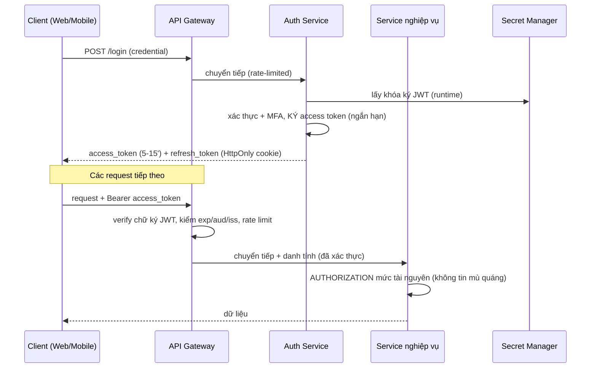
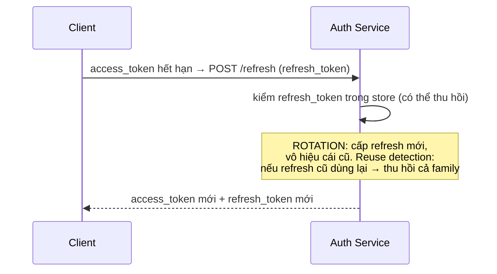
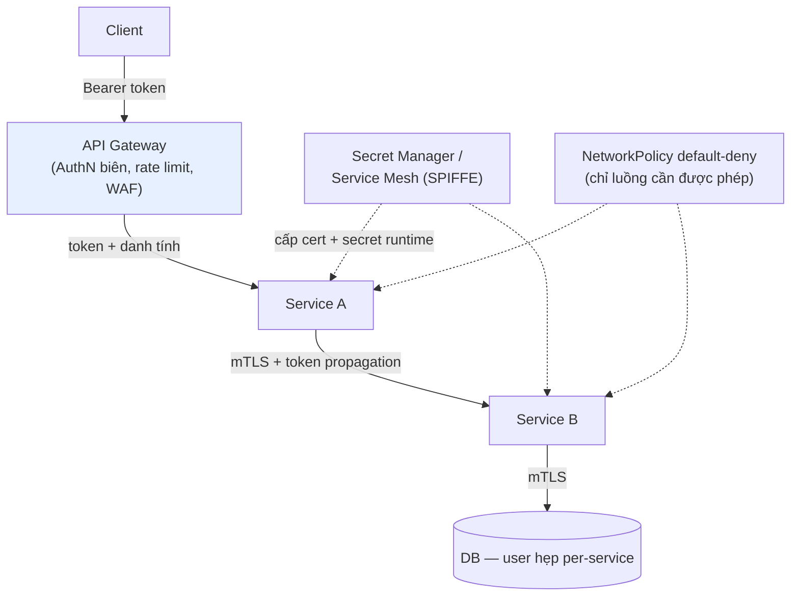

+++
title = "Backend Security — Tập 10: Kiến trúc Bảo mật Thực tế"
date = "2026-07-07T17:00:00+07:00"
draft = false
tags = ["backend", "security"]
series = ["Backend Security"]
+++

> **Đối tượng:** Backend Engineer, Senior Backend Engineer, Tech Lead, Solution Architect, Software Architect.
>
> **Mạch tư duy:** Asset → Threat → Attack → Vulnerability → Defense → Trade-off → Production Best Practice.
>
> Chín tập trước xây dựng *từ vựng và nguyên lý*. Tập cuối này *lắp ráp* chúng vào các hệ thống thật. Với mỗi loại kiến trúc, ta hỏi: **tài sản quan trọng nhất là gì, attacker nhắm vào đâu, và các nguyên lý (CIA, Least Privilege, Defense in Depth, Zero Trust, AuthN/AuthZ, token, TLS, secret) kết hợp thành luồng cụ thể ra sao.** Trọng tâm là các luồng: Authentication, Authorization, Token Flow, Refresh Flow, API Gateway, Secret Management, Service-to-Service Authentication.

---

## 0. Khung phân tích: mọi kiến trúc đều bắt đầu từ "tài sản và đối thủ"

Không có "kiến trúc bảo mật đúng" chung chung. Thiết kế đúng *phụ thuộc* vào tài sản cần bảo vệ và mô hình mối đe dọa. Trước khi vẽ luồng, luôn trả lời:

1. **Tài sản giá trị nhất là gì?** (tiền, PII, dữ liệu y tế, sở hữu trí tuệ, uy tín)
2. **Trục CIA nào trọng yếu?** (banking ưu tiên Integrity + Confidentiality; hệ nội dung công khai ưu tiên Availability)
3. **Attacker là ai?** (bot tài chính, tội phạm có tổ chức, insider, nation-state — Tập 1)
4. **Ràng buộc là gì?** (tuân thủ PCI-DSS/HIPAA/GDPR, latency, chi phí, quy mô)

Câu trả lời quyết định *mức* và *trọng số* của từng phòng thủ. Dưới đây là bảy kiến trúc điển hình.

---

## 1. Nền tảng chung: Kiến trúc Auth hiện đại (dùng lại cho mọi hệ thống)

Trước khi vào từng ngành, đây là bộ khung Auth mà hầu hết hệ thống hiện đại chia sẻ — kết tinh của Tập 2, 6, 8.

**Các thành phần chuẩn:**
- **API Gateway** làm tuyến đầu: TLS termination, rate limiting, xác thực token, schema validation, WAF. Nhưng **không** là nơi duy nhất kiểm quyền.
- **Auth Service** riêng: phát/refresh/thu hồi token, MFA, quản lý phiên.
- **AuthZ ở service nghiệp vụ:** quyết định quyền gần dữ liệu (Zero Trust — Tập 1).
- **Secret Manager:** khóa ký, credential DB lấy lúc runtime, xoay tự động (Tập 8).

### Refresh Flow chuẩn (Tập 2, dùng chung)

Các phần dưới đây *tùy biến* bộ khung này theo đặc thù từng ngành.

---

## 2. E-commerce — quy mô lớn, gian lận, và Availability mùa cao điểm

### Tài sản & Threat Model
**Tài sản:** tài khoản người dùng, thông tin thanh toán, đơn hàng, tồn kho, uy tín. **Trục CIA:** cân bằng — Availability rất quan trọng (sập ngày sale = mất tiền lớn), Confidentiality cho PII/thanh toán, Integrity cho giá/tồn kho. **Attacker:** bot (credential stuffing, scalping/mua gom hàng hot, scraping giá), gian lận thanh toán, lạm dụng khuyến mãi (Insecure Design — Tập 7).

### Luồng & phòng thủ đặc thù
- **AuthN:** token cho web/mobile; MFA tùy chọn; **credential stuffing** là mối đe dọa số một → rate limiting mạnh + breached-password check + bot management (Tập 6, 9).
- **Thanh toán:** **không tự lưu số thẻ** — dùng payment gateway/tokenization (giảm phạm vi PCI-DSS, và "không lưu thì không lộ" — Tập 3/7). Chỉ lưu token thanh toán.
- **Idempotency** bắt buộc cho đặt hàng/thanh toán (chống double-charge khi retry — Tập 6).
- **Insecure Design:** giới hạn nghiệp vụ chống lạm dụng khuyến mãi (số lượng âm, gộp mã giảm giá, race condition tồn kho); dùng transaction/khóa để chống oversell.
- **Availability:** CDN, cache, auto-scaling, rate limit chống scraping; WAF chống tấn công tự động mùa sale.

### Anti-pattern & Case study
Tự lưu số thẻ (gánh PCI-DSS + rủi ro lộ khổng lồ); không idempotent (double-charge); không rate-limit login (chiếm tài khoản hàng loạt qua stuffing); logic khuyến mãi thiếu giới hạn (bị khai thác tài chính). **Bài học:** e-commerce thua nhiều nhất ở *gian lận logic nghiệp vụ* và *lạm dụng tự động* — nơi threat modeling và rate limiting quan trọng ngang mã hóa.

---

## 3. Banking — Integrity tuyệt đối, thu hồi tức thì, audit không thể chối bỏ

### Tài sản & Threat Model
**Tài sản:** tiền và số dư (Integrity là *tối thượng* — một xu sai là thảm họa), dữ liệu tài chính cá nhân. **Trục CIA:** Integrity + Confidentiality tối đa; Availability cao nhưng *không đánh đổi* Integrity (thà từ chối giao dịch còn hơn xử lý sai). **Attacker:** tội phạm tài chính có tổ chức, insider, gian lận; nation-state với hệ thống lớn. **Ràng buộc:** quy định nghiêm ngặt, audit bắt buộc, non-repudiation.

### Luồng & phòng thủ đặc thù
- **AuthN:** MFA **bắt buộc**; step-up authentication cho giao dịch giá trị cao (xác thực lại dù phiên còn hiệu lực); adaptive auth theo rủi ro (thiết bị/vị trí lạ).
- **Thu hồi tức thì:** khác e-commerce, banking cần **revocation gần tức thì** — nên thiên về **session stateful** hoặc **reference token + introspection** thay vì JWT stateless thuần, hoặc JWT ngắn hạn + denylist `jti` (Tập 2). Khóa tài khoản phải có hiệu lực *ngay*.
- **Integrity giao dịch:** transaction ACID; **request signing/HMAC** cho lệnh chuyển tiền; **idempotency** chống trùng; **maker-checker** (một người tạo, người khác duyệt) cho thao tác nhạy cảm — hiện thân Least Privilege + phân tách nhiệm vụ.
- **Audit logging không thể chối bỏ:** append-only, đầy đủ, bảo vệ nghiêm (Non-repudiation — Tập 7 A09).
- **Confidentiality:** mã hóa at-rest + in-transit; phân loại và tối thiểu hóa dữ liệu; kiểm soát truy cập chi tiết + audit ai xem gì.

### Trade-off & Anti-pattern
Banking *chấp nhận đánh đổi UX và một phần Availability lấy Integrity/khả năng thu hồi*: thà thêm bước xác thực và từ chối khi nghi ngờ. **Anti-pattern:** dùng JWT dài hạn stateless không thu hồi được cho tài khoản banking (không khóa ngay được khi phát hiện gian lận); thiếu maker-checker cho thao tác admin; audit log có thể bị sửa. **Bài học:** ở banking, *khả năng thu hồi tức thì và audit không thể chối bỏ* quan trọng hơn sự tiện lợi stateless.

---

## 4. FinTech — cầu nối nhiều bên, OAuth2 và bảo mật đối tác

### Tài sản & Threat Model
FinTech thường **kết nối tới ngân hàng/bên thứ ba** (Open Banking, payment, KYC). **Tài sản:** tiền, dữ liệu tài chính, *và các credential/token truy cập hệ thống đối tác*. **Đặc thù:** ranh giới tin cậy phức tạp — bạn vừa là client của API ngân hàng, vừa là API cho app của bạn, vừa tích hợp nhiều nhà cung cấp.

### Luồng & phòng thủ đặc thù
- **OAuth2/OIDC là trung tâm** (Tập 2): FinTech thường dùng OAuth2 để *được ủy quyền* truy cập tài khoản ngân hàng người dùng (Authorization Code + PKCE) — **không** cầm mật khẩu ngân hàng của họ (đúng bài toán OAuth giải). Scope tối thiểu.
- **Service-to-service với đối tác:** **mTLS** và/hoặc **request signing (HMAC)** cho API tài chính B2B; **client credentials** cho M2M (Tập 4, 6).
- **Webhook:** nhận sự kiện thanh toán từ đối tác → **luôn verify chữ ký HMAC** (Tập 6) + idempotency (webhook có thể gửi lại).
- **Secret Management nghiêm ngặt:** credential/khóa của *nhiều* đối tác → secret manager, scope hẹp per-đối-tác, rotation (Tập 8). Lộ một khóa đối tác = rủi ro tài chính trực tiếp.
- **Tuân thủ:** PCI-DSS, quy định tài chính địa phương; audit đầy đủ.

### Anti-pattern & Case study
Lưu mật khẩu ngân hàng người dùng (thay vì OAuth token) — thảm họa và thường vi phạm quy định; không verify webhook (giả mạo "đã thanh toán" — gian lận); một secret dùng chung cho mọi đối tác; token đối tác không xoay. **Bài học:** FinTech sống hay chết ở *quản lý danh tính và secret across nhiều ranh giới tin cậy* — OAuth đúng cách, mTLS/HMAC cho đối tác, verify mọi thứ nhận từ ngoài.

---

## 5. SaaS Multi-tenant — cô lập tenant là ranh giới bảo mật số một

### Tài sản & Threat Model
**Tài sản:** dữ liệu của *nhiều khách hàng (tenant)* trên hạ tầng dùng chung. **Mối đe dọa đặc trưng và nghiêm trọng nhất:** **cross-tenant data leakage** — tenant A đọc/sửa được dữ liệu tenant B. Đây là biến thể của Broken Access Control (Tập 7 A01) ở mức tenant, và là lỗi *chí mạng* với SaaS (mất niềm tin toàn bộ khách hàng).

### Luồng & phòng thủ đặc thù
- **Tenant context trong mọi request:** token mang `tenant_id` (claim đã ký — Tập 2); **mọi truy vấn dữ liệu phải lọc theo tenant** một cách *bắt buộc và tập trung*, không dựa vào lập trình viên nhớ thêm `WHERE tenant_id=`.
- **AuthZ hai tầng:** (1) tenant isolation (dữ liệu này thuộc tenant của user không?), (2) role trong tenant (RBAC nội bộ tenant). Cả hai default-deny.
- **Chiến lược cô lập dữ liệu:** từ mềm (shared DB + `tenant_id` + row-level security) đến cứng (schema riêng, DB riêng per-tenant) — trade-off giữa chi phí/độ phức tạp và mức cô lập. RLS (row-level security) ở DB là lớp phòng thủ sâu chống lỗi quên filter.
- **Secret & config per-tenant** khi cần; tránh một khóa mã hóa dùng chung nếu yêu cầu cô lập cao.
- **Rate limit + quota per-tenant** (một tenant không làm ảnh hưởng tenant khác — Availability).

### Anti-pattern & Case study
Lọc tenant *chỉ ở tầng ứng dụng* và dựa vào dev nhớ (một endpoint quên là rò rỉ chéo); tin `tenant_id` do client gửi thay vì lấy từ token đã xác thực; ID tài nguyên đoán được không kèm kiểm tenant (IDOR chéo tenant). **Bài học:** với SaaS, **tenant isolation phải được thực thi ở tầng thấp nhất có thể (DB/RLS + middleware bắt buộc)**, không phó mặc cho kỷ luật lập trình từng endpoint. Đây là ranh giới bảo mật quan trọng nhất của mô hình.

---

## 6. Mobile Backend — client không thể tin, secret không thể giấu trong app

### Tài sản & Threat Model
**Đặc thù cốt lõi:** app mobile chạy trên **thiết bị của người dùng — môi trường không kiểm soát**. App có thể bị **decompile, reverse-engineer**; mọi thứ nhúng trong app (khóa, secret, logic) coi như **công khai**. **Mối đe dọa:** trích secret từ app, giả mạo request, lạm dụng API, đánh cắp token trên thiết bị.

### Luồng & phòng thủ đặc thù
- **Không nhúng secret bí mật trong app:** bất kỳ key nào trong binary đều trích được → chỉ nhúng key **public-tier quyền tối thiểu** nếu buộc phải (Tập 6). Secret thật ở backend.
- **OAuth2 Authorization Code + PKCE** cho đăng nhập (PKCE thiết kế đúng cho client công khai không giữ được `client_secret` — Tập 2).
- **Lưu token an toàn trên thiết bị:** dùng **secure storage của OS** (Keychain iOS / Keystore Android), không lưu plaintext; access token ngắn hạn + refresh token trong secure storage.
- **Mọi kiểm soát ở server:** validation, giá cả, logic nghiệp vụ *không bao giờ* tin client (client có thể bị chỉnh sửa — Tập 6). "App của chúng tôi sẽ không gửi field đó" là vô nghĩa.
- **Bổ sung tùy mức nhạy cảm:** certificate pinning (chống MITM với CA giả — nhưng cân nhắc vận hành khi xoay cert), app attestation (Play Integrity / App Attest) để tăng độ tin cậy client, chống tampering/root/jailbreak detection (giảm thiểu, không tuyệt đối).
- **Rate limiting + abuse prevention** mạnh (API mobile dễ bị gọi tự động sau khi reverse-engineer).

### Anti-pattern & Case study
Nhúng API key/secret có quyền trong app (bị trích trong vài phút); tin validation phía app; lưu token plaintext (`SharedPreferences`/`UserDefaults` không mã hóa); dùng OAuth Implicit/ROPC (lỗi thời — Tập 2). **Bài học:** thiết kế mobile backend với giả định **client hoàn toàn không đáng tin và mọi thứ trong app đều công khai** — bảo mật nằm ở server và ở token flow đúng chuẩn.

---

## 7. Microservices — Zero Trust nội bộ và Service-to-Service Authentication

### Tài sản & Threat Model
Hàng chục–trăm service gọi nhau qua mạng. **Mối đe dọa đặc trưng:** một service bị chiếm (qua lỗ hổng, dependency độc — Tập 7) rồi **lateral movement** sang service khác nếu mạng nội bộ "phẳng và tin nhau" (vỏ cứng ruột mềm — Tập 1, 8). Đây chính là bài toán Zero Trust ra đời để giải.

### Luồng & phòng thủ đặc thù

- **Xác thực service-to-service:** **mTLS** (mỗi service một danh tính mật mã — Tập 4) qua **service mesh** (Istio/Linkerd) tự động cấp/xoay cert, hoặc **SPIFFE/SPIRE** cho workload identity. Không "tin nhau vì cùng VPC".
- **Token propagation:** danh tính người dùng cuối truyền qua các service (JWT hoặc token nội bộ) để mỗi service tự **authorize** — không service nào cho rằng "đã được gateway kiểm rồi" (Zero Trust — Tập 1, 9).
- **Network segmentation + NetworkPolicy default-deny** (Tập 8): chỉ cho phép các luồng gọi cần thiết → chống lateral movement.
- **Least Privilege ở mọi service:** mỗi service có DB user hẹp riêng, secret scope riêng (Tập 1, 8).
- **API Gateway** xử lý AuthN biên, rate limit, TLS; **AuthZ chi tiết ở từng service** (gần dữ liệu).
- **Secret Management tập trung** (Tập 8): mọi service lấy secret/cert runtime qua danh tính workload.
- **Observability:** correlation/trace ID xuyên service để truy vết và phát hiện bất thường (Tập 9).

### Anti-pattern & Case study
Mạng nội bộ phẳng tin nhau (một service thủng → chiếm tất cả); xác thực chỉ ở gateway rồi service tin mọi request nội bộ; secret dùng chung mọi service; DB user quyền rộng dùng chung; không segmentation. **Bài học:** microservices *khuếch đại* rủi ro lateral movement — Zero Trust (mTLS, token propagation, default-deny network, least privilege per-service) không phải xa xỉ mà là điều kiện sống còn ở quy mô.

---

## 8. Public API — hợp đồng mở cho thế giới, quản trị lạm dụng và định danh

### Tài sản & Threat Model
API mở cho developer bên ngoài (hoặc public). **Mối đe dọa:** lạm dụng tài nguyên, scraping, abuse, DoS, và **quản lý danh tính hàng loạt client** không kiểm soát được. Mọi endpoint và tham số đều công khai và bị dò tự động (Tập 6).

### Luồng & phòng thủ đặc thù
- **Định danh client:** **API Key** cho định danh app + đo lường/quota (Tập 6); **OAuth2** khi truy cập dữ liệu người dùng thay mặt (scope, consent). Key trong header, hash khi lưu, rotation.
- **Rate limiting + quota theo tier** (free/paid) là *mô hình kinh doanh lẫn phòng thủ* (Tập 6, 9); trả `429` + `Retry-After`.
- **Versioning nghiêm túc** (Tập 9): deprecation policy rõ, tắt version cũ; áp cùng phòng thủ cho mọi version.
- **Input validation chặt + response shaping** (chống excessive data exposure); giới hạn kích thước/độ phức tạp (GraphQL depth).
- **Tài liệu + hợp đồng rõ ràng** nhưng *không* để tài liệu tiết lộ nội bộ nhạy cảm; error generic.
- **Monitoring lạm dụng:** phát hiện mẫu bất thường per-key, thu hồi key lạm dụng.

### Anti-pattern & Case study
Không rate limit/quota (một client làm sập hoặc tốn chi phí khổng lồ); API key trong URL (bị log); version cũ hở bảo mật vẫn chạy; trả thừa dữ liệu; không thu hồi được key lạm dụng. **Bài học:** public API cần *quản trị vòng đời client và chống lạm dụng* mạnh mẽ như cần bảo mật kỹ thuật — rate limit/quota và versioning là trung tâm.

---

## 9. Bảng tổng hợp: đặc thù bảo mật theo kiến trúc

| Kiến trúc | Tài sản/CIA trọng yếu | Mối đe dọa đặc trưng | Phòng thủ nhấn mạnh |
|-----------|----------------------|----------------------|---------------------|
| **E-commerce** | Availability + PII + thanh toán | Credential stuffing, gian lận logic, scraping | Rate limit + bot mgmt, tokenize thẻ, idempotency, giới hạn nghiệp vụ |
| **Banking** | Integrity tối thượng + Confidentiality | Gian lận tài chính, insider | MFA/step-up, revocation tức thì, HMAC + maker-checker, audit không chối bỏ |
| **FinTech** | Tiền + token đối tác | Giả mạo webhook, lộ secret đối tác | OAuth2/PKCE, mTLS/HMAC B2B, verify webhook, secret mgmt per-đối-tác |
| **SaaS** | Dữ liệu multi-tenant | Cross-tenant leakage | Tenant isolation bắt buộc (RLS + middleware), AuthZ hai tầng, quota per-tenant |
| **Mobile** | Token trên thiết bị | Reverse-engineer, trích secret | Không nhúng secret, PKCE, secure storage, mọi kiểm soát ở server |
| **Microservices** | Toàn hệ thống nội bộ | Lateral movement | mTLS/SPIFFE, token propagation, NetworkPolicy default-deny, least privilege |
| **Public API** | Tài nguyên + định danh client | Lạm dụng, scraping, DoS | API key/OAuth, rate limit + quota theo tier, versioning, monitoring lạm dụng |

Điểm chung xuyên suốt: **mọi kiến trúc đều dùng chung một bộ nguyên lý (Tập 1) và cùng bộ công cụ (Tập 2–9); khác biệt nằm ở *trọng số* — tài sản nào, trục CIA nào, attacker nào — quyết định phòng thủ nào được nhấn mạnh.**

---

## 10. Tổng kết Tập 10 & toàn bộ bộ tài liệu

### Từ nguyên lý đến thực chiến
Bảy kiến trúc trên cho thấy một sự thật: **không có "cấu hình bảo mật đúng" phổ quát.** Cùng một JWT, cùng một OAuth, cùng một mTLS — nhưng banking dùng khác e-commerce, mobile dùng khác microservices, vì *tài sản và mô hình mối đe dọa* khác nhau. Kỹ năng của một architect không phải thuộc lòng công nghệ, mà là **đọc ra tài sản + đối thủ + ràng buộc, rồi chọn đúng trọng số phòng thủ và chấp nhận đúng trade-off.**

### Mười sợi chỉ đỏ xuyên suốt cả bộ tài liệu
1. **Security là môn học về đối thủ** — luôn hỏi "attacker muốn gì, đi đường nào" trước khi chọn giải pháp.
2. **Giả định thất bại** — credential sẽ lộ, lớp phòng thủ sẽ thủng, service sẽ bị chiếm. Thiết kế để *giới hạn thiệt hại* và *phát hiện*, không chỉ để *ngăn chặn*.
3. **CIA cho từng tài sản** — "an toàn" là vô nghĩa nếu không nói rõ trục nào cho tài sản nào.
4. **Least Privilege ở mọi tầng** — giới hạn bán kính vụ nổ.
5. **Defense in Depth** — không lớp nào là điểm chết duy nhất; không tin lớp trước; fail securely.
6. **Zero Trust** — không tin theo vị trí mạng; verify mọi truy cập, kể cả nội bộ.
7. **AuthN ≠ AuthZ** — "bạn là ai" khác "bạn được làm gì"; lỗi lẫn lộn là rủi ro #1.
8. **Không tin client, mọi kiểm soát ở server** — đặc biệt với API và mobile.
9. **Không thần thánh hóa công nghệ nào** — JWT/OAuth/WAF/mTLS đều có chỗ *không nên* dùng; mỗi thứ là một trade-off.
10. **Phát hiện quan trọng ngang phòng ngừa** — logging, audit, monitoring là điều kiện để mọi phòng thủ khác *có ý nghĩa vận hành*.

### Vì sao nhiều hệ thống production vẫn bị hack dù dùng đúng công nghệ
Vì bảo mật không phải là *có công nghệ*, mà là *dùng đúng, cấu hình đúng, nhất quán, và hiểu giới hạn*. JWT không cứu bạn nếu cấu hình `alg:none`. TLS vô dụng nếu tắt verify certificate. WAF bị bypass. Rate limit đặt sai chỗ. Một endpoint quên kiểm quyền. Một secret lọt vào Git. Một tenant filter bị quên. **Lỗ hổng hầu như luôn nằm ở khoảng cách giữa "đã dùng công nghệ" và "dùng đúng ở mọi chỗ" — và attacker chỉ cần tìm ra một khoảng cách đó.**

Đó là lý do tài liệu này không dạy "cách bật tính năng", mà dạy *cách suy nghĩ*: từ First Principles, qua con mắt attacker, với sự tôn trọng dành cho trade-off. Một kỹ sư nắm được tư duy đó sẽ tự suy ra được cách phòng thủ cho cả những công nghệ và tình huống chưa từng gặp — điều mà không checklist nào làm được.

---

> **Kết bộ tài liệu.** Mười tập, đi từ nền tảng (CIA, Threat Modeling, Least Privilege, Defense in Depth, Zero Trust) qua Authentication, Password, Transport, Browser, API, OWASP Top 10, Server, Best Practices, đến Kiến trúc thực tế. Mỗi tập bám cùng một mạch: **Asset → Threat → Attack → Vulnerability → Defense → Trade-off → Production Best Practice.** Chúc bạn thiết kế được những hệ thống *thực sự* chịu được va đập trong production — không phải chỉ *trông có vẻ* bảo mật.
